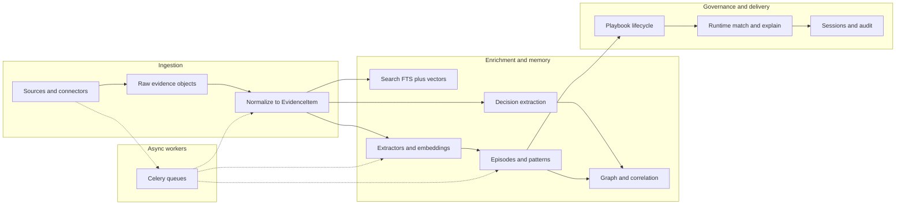

# End-to-end pipeline

## Summary

After reading this page, you should see how operational content enters ContextEdge, becomes **tenant-scoped evidence**, is enriched and searched, surfaces as **episodes**, **patterns**, and **governed playbooks**, and is finally retrieved at **runtime** with audit-friendly traces—without needing to open every subsystem first. Deeper articles in this wiki unpack each box in the diagram below.

## Business picture

Most organizations already have the answers to their recurring problems—they are just buried across ticket queues, chat threads, emails, and shared drives. ContextEdge connects to those systems and converts scattered activity into a **structured, governed knowledge pipeline** that delivers three measurable outcomes:

1. **Faster resolution** — When a new incident arrives, the system surfaces the most relevant approved playbook in seconds, ranked by confidence, so responders spend less time searching and more time fixing.
2. **Fewer repeat mistakes** — Patterns, contradictions, and past failures are captured alongside successes, so teams learn from what went wrong, not just what went right.
3. **Audit-ready traceability** — Every recommendation can be traced back to the evidence it came from, the review it passed, and the policy that governs its retention—satisfying compliance without extra manual work.

The pipeline flows through six stages: **ingest** raw data from connected systems, **normalize** it into comparable evidence records, **enrich** it with search indexes and AI-assisted extraction, **derive** structured memory (episodes, patterns, playbooks), **deliver** governed guidance at runtime, and **maintain** data quality through retention and drift monitoring. Each stage is scoped to a single customer (tenant) so data never crosses organizational boundaries.

## Technical walkthrough

The path below is the backbone of the product; names in parentheses are the main implementation homes.

1. **API surface** — Clients call FastAPI routes under `/api/v1` for admin CRUD, sync, evidence, episodes, patterns, playbooks, sessions, runtime, and more. The router index wires modules to URL prefixes. **In code:** `backend/src/contextedge/api/v1/__init__.py`, `backend/src/contextedge/main.py`.

2. **Request context and audit** — Each request carries tenant and identity context; auditing records meaningful access. **In code:** `middleware/request_context.py`, `middleware/request_audit.py`, `middleware/auth.py`.

3. **Sources and sync** — External systems are modeled as **sources**. Sync runs and connectors fetch or accept changes, then hand off batches of ingestion events. **In code:** `connectors/` (adapters), `services/sync_worker_service.py`, `api/v1/sources.py`, `api/v1/sync.py`.

4. **Raw then normalized evidence** — Ingestion persists **raw** payloads (and object storage for larger blobs), then workers **normalize** into **evidence items** (title, body, hashes, provenance). A recovery-aware handoff claims backlog safely before queueing normalize work so broker hiccups do not double-process forever. **In code:** `services/ingestion_persistence.py` (`persist_ingestion_events`), `services/sync_worker_service.py` (`_claim_pending_raw_ids_for_handoff`), `workers/extraction_tasks.py` (`normalize_evidence`), `services/evidence_normalization.py`, `models/evidence.py`.

5. **Search** — Analysts and services query evidence using **full-text search (FTS)** and **semantic** (embedding) signals, combined in a **hybrid** ranker; results respect **access** rules. **In code:** `search/pg_fts.py`, `search/vector_search.py`, `search/hybrid_ranker.py`, `search/access_control.py`, `api/v1/evidence.py`.

6. **AI-assisted extraction** — Language models and embeddings help classify relevance, extract structure, and power semantic retrieval. **In code:** `ai/provider.py`, `ai/embeddings.py`, `ai/extractors/`, `ai/classifiers/`.

7. **Episodes, patterns, graph, decisions** — Higher-level objects summarize incidents (**episodes**), surface recurrence (**patterns**), and link entities via a **graph** and correlation services. **Decision extraction** identifies operational actions from evidence text and links actors/targets to canonical identities as graph edges. **Governed execution** steps (approvals, denials, outcomes) also produce graph edges for full decision traceability. **In code:** `services/episode_service.py`, `services/pattern_service.py`, `graph/builder.py`, `services/correlation_service.py`, `services/contradiction_service.py`, `services/decision_service.py`, `ai/extractors/decision_extractor.py`.

8. **Playbooks and governance** — **Playbooks** move through a lifecycle; only **published** versions are what runtime retrieval prefers to serve. **In code:** `services/playbook_service.py`, `models/playbook.py`, `api/v1/playbooks.py`.

9. **Runtime match and explain** — Integrations call **runtime** endpoints to match a situation to ranked playbooks; scoring reuses hybrid ideas; explanations can be cached briefly in Redis. **In code:** `api/v1/runtime.py`, `services/runtime_service.py`, `search/hybrid_ranker.py` (`rank_playbooks`).

10. **Sessions, execution, audit trail** — **Resolution sessions** and **execution** APIs support governed operational workflows and append-style traces for review. **In code:** `api/v1/sessions.py`, `api/v1/execution.py`, `services/session_service.py`, `services/execution_service.py`, `services/audit_service.py`, `services/event_log_service.py`.

11. **Background work** — Celery workers drain dedicated **queues** (sync, hydration, extraction, pattern, evaluation, default) so HTTP stays responsive and failures can retry. **In code:** `workers/celery_app.py`, task modules under `workers/`.

12. **Retention** — Policies and services eventually remove or age data according to tenant rules. **In code:** `services/retention_service.py` (see also tenant policy schemas).

The **Next.js** dashboard is a thin client over this API; most rules stay on the server (`frontend/`).

## Flow diagram

This is the same story as the numbered list, compressed for orientation.



Solid arrows are the main data dependency; dashed arrows show where **workers** extend or continue the HTTP-started path.

## Example: Acme VPN data at this stage

One Jira ticket travels the full pipeline. Each box below shows the data shape at that stage.

**1. Connector output (ingestion event)**

```json
{
  "external_id": "JIRA-4521",
  "source_type": "jira_sm",
  "title": "VPN connection drops after Windows update KB5032190",
  "body": "Users reporting VPN disconnects since patch Tuesday. Gateway: vpn-gw-east-01. Error: AUTH_CERT_EXPIRED. Reported by jsmith@acme.com.",
  "created_at": "2026-03-15T09:23:00Z"
}
```

**2. Raw evidence (after persist)**

```json
{
  "raw_id": "raw-7f3a1b",
  "tenant_id": "acme-corp",
  "source_id": "src-jira-01",
  "external_id": "JIRA-4521",
  "content_hash": "sha256:9f3a2b...",
  "raw_payload": "{ ... full Jira JSON ... }"
}
```

**3. Normalized evidence item**

```json
{
  "evidence_id": "ev-a1b2c3",
  "tenant_id": "acme-corp",
  "domain_id": "vpn-connectivity",
  "source_id": "src-jira-01",
  "title": "VPN connection drops after Windows update KB5032190",
  "body_summary": "Multiple users report VPN disconnects following patch Tuesday. AUTH_CERT_EXPIRED on vpn-gw-east-01.",
  "relevance_state": "operational",
  "canonical_entity_refs": {
    "identities": ["id:john-smith", "id:kb5032190", "id:vpn-gw-east-01"],
    "decisions": [
      { "decision_type": "remediation", "actor": "id:john-smith", "target": "id:vpn-gw-east-01", "action": "renewed gateway certificate" }
    ]
  }
}
```

**4. Episode (after AI reconstruction)**

```json
{
  "episode_id": "ep-x1y2z3",
  "title": "Corporate VPN authentication failure after KB5032190",
  "status": "draft",
  "reviewer_state": "pending_review",
  "steps": [
    { "order": 1, "type": "complaint", "text": "Users report VPN drops post-patch Tuesday" },
    { "order": 2, "type": "diagnostic", "text": "Checked gateway logs — AUTH_CERT_EXPIRED errors" },
    { "order": 3, "type": "failed_attempt", "text": "Restarted VPN service — no improvement" },
    { "order": 4, "type": "remediation", "text": "Renewed gateway certificate via internal CA" },
    { "order": 5, "type": "outcome", "text": "VPN restored for all affected users" }
  ]
}
```

**5. Approved playbook (after review)**

```json
{
  "playbook_id": "pb-r1s2t3",
  "title": "VPN Certificate Rotation After Patch Tuesday",
  "lifecycle_state": "approved",
  "risk_tier": "medium",
  "current_version": "1.0.0",
  "trigger_conditions": "VPN auth failures after Windows update with AUTH_CERT_EXPIRED"
}
```

**6. Runtime match response**

```json
{
  "matches": [{
    "playbook_id": "pb-r1s2t3",
    "title": "VPN Certificate Rotation After Patch Tuesday",
    "confidence": 0.92,
    "breakdown": { "keyword": 0.85, "semantic": 0.94, "graph": 0.88, "recency": 0.95 },
    "evidence_trace": ["ev-a1b2c3", "ev-d4e5f6"],
    "freshness": "current"
  }]
}
```

## Design decisions

- **Modular monolith (FastAPI + one Postgres)** — *Why:* simpler operations and consistent transactions across tenants' data. *Tradeoff:* horizontal scaling is mostly "scale the app + DB," not independent microservices per feature.

- **Post-commit worker pipeline for normalization** — *Why:* HTTP and sync paths stay fast; heavy parsing and embedding do not block the caller. *Tradeoff:* evidence is briefly "raw-only" until workers catch up; monitoring queue depth matters.

- **Claim-before-queue handoff for raw backlog** — *Why:* survives Redis/broker outages without duplicate normalize tasks or lost tails. *Tradeoff:* more moving parts in `sync_worker_service` than a naive "enqueue immediately."

- **Application-layer hash dedupe for evidence** — *Why:* flexible evolution of what counts as "the same" content. *Tradeoff:* under extreme concurrency, duplicates are still possible until a DB uniqueness story hardens (see root `README.md` known constraints).

- **Hybrid retrieval (lexical + semantic + signals)** — *Why:* operational questions are both keyword-precise ("VPN gateway host name") and conceptually fuzzy ("similar outage last month"). *Tradeoff:* more indexes to maintain (FTS, pgvector) and tuning surface area.

- **Playbook publication gate for runtime** — *Why:* customers should not get draft or unreviewed procedures in automated retrieval. *Tradeoff:* operators must complete lifecycle steps before runtime "sees" the latest version.

## Code map

| Concern | Module path | Key symbols | When it runs |
| --- | --- | --- | --- |
| App bootstrap | `backend/src/contextedge/main.py` | `create_app`, `lifespan` | Process start |
| API mount | `backend/src/contextedge/api/v1/__init__.py` | `router`, `include_router` | Per route registration |
| Tenant and audit middleware | `backend/src/contextedge/middleware/request_context.py` | `TenantContextMiddleware` | Each HTTP request |
| Ingestion persist | `backend/src/contextedge/services/ingestion_persistence.py` | `persist_ingestion_events` | After connector/sync produces events |
| Sync handoff / recovery | `backend/src/contextedge/services/sync_worker_service.py` | `_claim_pending_raw_ids_for_handoff` | Before enqueueing normalize tasks |
| Normalize worker | `backend/src/contextedge/workers/extraction_tasks.py` | `normalize_evidence` | Celery **extraction** queue |
| Hybrid ranking | `backend/src/contextedge/search/hybrid_ranker.py` | `rank_playbooks` | Runtime match and evaluations |
| Runtime orchestration | `backend/src/contextedge/services/runtime_service.py` | `match_playbooks` | Service layer for `/runtime` |
| Celery topology | `backend/src/contextedge/workers/celery_app.py` | `celery_app`, `task_routes`, `beat_schedule` | Worker and beat processes |
| Playbook governance | `backend/src/contextedge/services/playbook_service.py` | lifecycle transitions (module-level API) | Admin API and internal callers |

## Acme VPN incident (this layer)

When **Acme Corp**'s **Corporate VPN** outage spawns duplicate Jira tickets, Teams threads, and a follow-up email, **connectors and sync** land multiple **raw** payloads that **normalize** into evidence rows analysts can find with "VPN gateway." **Decision extraction** identifies that jsmith restarted the gateway and links the action to both the actor and the target system in the graph. **Extraction** proposes an **episode** spanning the noise; **patterns** may later reflect "auth certificate expiry" style repeats. A reviewed **playbook** version captures the approved fix; **runtime** ranks that playbook when an integration asks about VPN failures, and **sessions** record what was decided. When the playbook executes, **governed decision edges** capture the approval chain and outcome — so the same story threads every stage above without changing the example.

## Further reading

- Repository architecture and package map: [`docs/TECHNICAL_BLUEPRINT.md`](../docs/TECHNICAL_BLUEPRINT.md)
- HTTP details and auth headers: [`docs/API.md`](../docs/API.md)
- Commands, workers, and operations: [`docs/RUNBOOK.md`](../docs/RUNBOOK.md)
- Next articles in this wiki: [PLAN.md](./PLAN.md) (02 API lifecycle through 11 retention)
