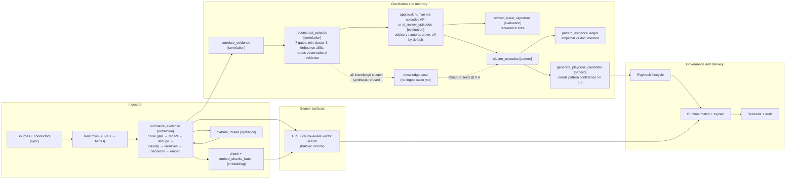

# End-to-end pipeline

## Summary

After reading this page, you should see how operational content enters ContextEdge, becomes **tenant-scoped evidence**, is enriched and searched, surfaces as **episodes** (an account of something that happened), **knowledge cases** (what a document claims works), **patterns**, and **governed playbooks**, and is finally retrieved at **runtime** with audit-friendly traces—without needing to open every subsystem first. You should also know, for each stage, **which Celery task or function runs it, on which queue, and in what order**. Deeper articles in this wiki unpack each box in the diagram below.

Two things on this page have **landed as structure but do not run yet**, and are labelled where they appear: knowledge-case attachment (the logic is written and a migration has already used it, but nothing on the ingest path calls it) and operational situations (**tables and constraints only — no correlation logic has been written at all**). Treat an unlabelled step as live.

## Business picture

Most organizations already have the answers to their recurring problems—they are just buried across ticket queues, chat threads, emails, and shared drives. ContextEdge connects to those systems and converts scattered activity into a **structured, governed knowledge pipeline** that delivers three measurable outcomes:

1. **Faster resolution** — When a new incident arrives, the system surfaces the most relevant approved playbook in seconds, ranked by confidence, so responders spend less time searching and more time fixing.
2. **Fewer repeat mistakes** — Patterns, contradictions, recurrences of the same failure, and past failed attempts are captured alongside successes, so teams learn from what went wrong, not just what went right.
3. **Audit-ready traceability** — Every recommendation can be traced back to the evidence it came from, the review it passed (human or AI-assisted), and the policy that governs its retention—satisfying compliance without extra manual work.

The pipeline flows through six stages: **ingest** raw data from connected systems, **normalize** it into comparable evidence records, **enrich** it with search indexes and AI-assisted extraction, **derive** structured memory (episodes, patterns, playbooks), **deliver** governed guidance at runtime, and **maintain** data quality through review sweeps, retention, and drift monitoring. Each stage is scoped to a single customer (tenant) so data never crosses organizational boundaries, and AI calls are metered against a per-tenant daily budget.

## Technical walkthrough

The path below is the backbone of the product, in execution order. Each step names the function or Celery task that runs it and the queue it runs on.

1. **API surface and request context** — Clients call FastAPI routes under `/api/v1`; the router index wires modules to URL prefixes (`backend/src/contextedge/api/v1/__init__.py`, `backend/src/contextedge/main.py`). Middleware stamps every request with tenant, identity, and correlation IDs that later ride into Celery task headers, so one ID joins an operator's click to the worker and LLM spend it caused (`backend/src/contextedge/middleware/request_context.py`, `backend/src/contextedge/workers/celery_app.py:25-68`). Details in [02](./02-api-and-request-lifecycle.md).

2. **Sources and sync** — External systems are modeled as **sources** with per-object approval flags. Celery Beat fires `sync.trigger_scheduled_syncs` every 15 minutes (`backend/src/contextedge/workers/celery_app.py:292`), which dispatches one `sync.run_incremental_sync` per approved object; backfills arrive from the API as `sync.run_backfill` (`backend/src/contextedge/workers/sync_tasks.py:14-70`). All `sync.*` tasks run on the **sync** queue (`backend/src/contextedge/workers/celery_app.py:227`). A per-object Postgres advisory lock makes sync single-flight — a second worker returns `skipped_locked` instead of racing a checkpoint (`backend/src/contextedge/services/sync_worker_service.py:379`). An incremental run with no checkpoint yet returns `skipped_no_checkpoint` rather than quietly pulling the source's whole history, so an object approved for sync but never backfilled stays idle on purpose (`backend/src/contextedge/services/sync_worker_service.py:571-595`). Details in [03](./03-ingestion-connectors-and-sync.md).

3. **Raw persistence with MinIO offload** — Each connector event becomes one `raw_evidence_objects` row via `persist_ingestion_events` (`backend/src/contextedge/services/ingestion_persistence.py:19`), deduplicated on `(tenant, source, external_id, content_hash)` before insert. A payload over **32 KB** (`OFFLOAD_THRESHOLD_BYTES`, `backend/src/contextedge/services/ingestion_persistence.py:16`) is uploaded to MinIO under `raw/{tenant_id}/{raw_id}.json` (`backend/src/contextedge/services/object_store.py:50-51`) and the database keeps only a stub `{"_offloaded": true, "size_bytes": N}`. **Caveat:** any SQL that filters on `raw_payload` silently sees the stub for the biggest rows — exactly the longest conversations and articles (see [KNOWN_GAPS.md](./KNOWN_GAPS.md), knowledge-lifecycle entry).

4. **Crash-safe handoff to normalization** — After the sync run commits, `_commit_and_queue_normalization` (`backend/src/contextedge/services/sync_worker_service.py:301`) claims the new raw IDs plus any IDs a previous failed enqueue left behind (`_claim_pending_raw_ids_for_handoff`, `backend/src/contextedge/services/sync_worker_service.py:273`), then `queue_normalize_raw_objects` dispatches one `extraction.normalize_evidence` task per raw row (`backend/src/contextedge/services/sync_ingestion_queue.py:16`). If the broker fails mid-enqueue, the un-enqueued IDs are parked on the source object and re-drained by the next successful run — no double-processing, no lost tail.

5. **Normalization — one task, a fixed inner order** — `extraction.normalize_evidence` (**extraction** queue; task at `backend/src/contextedge/workers/extraction_tasks.py:1394-1400`) runs `_normalize` (`backend/src/contextedge/workers/extraction_tasks.py:125`), whose steps happen in this order:
   - **Noise gate** (deterministic, pre-LLM, hydrated thread messages only): `message_noise_reason` rejects delivery failures, quote-only replies, empties, and short coordination chatter under 150 diagnostic characters with no technical signal (`backend/src/contextedge/workers/extraction_tasks.py:150-163`; `backend/src/contextedge/services/message_filter.py:52,174`). A rejected message gets **no evidence row**; the raw object stays so a rule change can re-judge it. Measured: 47% of live thread messages die here before any model call.
   - **Title/body extraction + content hash**: the hash is computed on the **pre-redaction** body so tuning redaction rules never breaks dedup (`backend/src/contextedge/workers/extraction_tasks.py:165-171`).
   - **Redaction**: secrets and PII are regex-redacted before the classifier, embedder, extractors, or database see the text (`backend/src/contextedge/workers/extraction_tasks.py:173-178`; rules in `backend/src/contextedge/services/redaction_service.py`).
   - **Dedupe** on `(tenant_id, content_hash)` — a re-ingest refreshes the existing row (case state, knowledge state, facets) instead of duplicating it (`backend/src/contextedge/workers/extraction_tasks.py:216-224`). A concurrent insert of the same content trips the partial unique index from migration `0026` (`backend/alembic/versions/0026_dedup_uniqueness.py`); the loser rolls back and adopts the winner without re-spending LLM calls (`backend/src/contextedge/workers/extraction_tasks.py:379-399`).
   - **Relevance classification** (first LLM call, prompt `relevance` **v2** default — `backend/src/contextedge/ai/prompts/relevance.py:76-84`; call at `backend/src/contextedge/workers/extraction_tasks.py:431`). Failure falls through to full extraction — classification never blocks ingestion.
   - **Knowledge applicability** (knowledge evidence only, on the **ingest** path): for a `kb_article`, `sop`, or `documentation` row, one call reads where the article actually applies — product versions, platforms, environments — and stores it on `evidence_items.applicability` (`backend/src/contextedge/workers/extraction_tasks.py:477`, helper at `:704`, type gate at `:723`). It sits here, right after the classifier that just read the same text, and it never raises. A stated environment or version on the source's own facets wins outright and skips the call entirely (`:730-738`). This used to run **only** from the manual `classify_relevance` task, so an article arriving through a normal sync — which is every article — never got one: 7 of 133 on the live corpus carried applicability, and all 7 had been re-classified by hand. The failure was silent because missing applicability degrades to lexical matching rather than erroring.
   - **Skip gate**: `not_relevant` at confidence ≥ 0.75 skips all remaining LLM work and chunking; the evidence row stays for audit but never enters vector search (`backend/src/contextedge/workers/extraction_tasks.py:487-495`).
   - **Message-function classification** (second LLM call, conversational sources only): what a message is *doing* — confirms a fix, asks for status, withdraws a claim (`backend/src/contextedge/workers/extraction_tasks.py:503-515`).
   - **Error signatures** (deterministic regex, runs even for skipped items — a confidently-irrelevant thread can still carry a pasted stack trace) (`backend/src/contextedge/workers/extraction_tasks.py:523-536`).
   - **Identity resolution** (`link_evidence_identities`, `backend/src/contextedge/services/identity_service.py:810`; called at `backend/src/contextedge/workers/extraction_tasks.py:549`): strong identifiers match at 1.0, exact aliases at 0.95, otherwise an LLM adjudicator that may abstain into `needs_review`. See [12](./12-identity-resolution-and-thread-hydration.md).
   - **Decision extraction** (`link_evidence_decisions`, `backend/src/contextedge/services/decision_service.py:21`; called at `backend/src/contextedge/workers/extraction_tasks.py:567`): "engineer restarted vpn-gw-east-01" becomes `records_decision` / `records_action_on` graph edges.
   - **Parent embedding**: title + first 8,000 body chars → one 3,072-dimension vector on `evidence_items.embedding` (`backend/src/contextedge/workers/extraction_tasks.py:68,584`; `backend/src/contextedge/models/evidence.py:91`). This is the one call in `_normalize` that hands the provider no tenant context, so it is neither budget-gated nor billed to a tenant; every other model call here passes `tenant_id` and the session.
   - **Chunk dispatch**: runs after the parent embedding so a chunker bug cannot regress retrieval. Bodies under 16 KB from known ticket/thread sources chunk **inline**; everything else goes async (`backend/src/contextedge/workers/extraction_tasks.py:57,76-122,595`).

6. **Post-commit fan-out** — After the transaction commits, the task wrapper dispatches the next stages (`backend/src/contextedge/workers/extraction_tasks.py:1400-1453`): attachments → `artifact.extract_attachment`; otherwise `extraction.correlate_evidence` + `extraction.compute_evidence_baseline` (both on the **correlation** queue, `backend/src/contextedge/workers/celery_app.py:256-258`); and, for a parent record that carries a thread reference, `hydration.hydrate_thread` (`backend/src/contextedge/workers/hydration_tasks.py:189`, **hydration** queue). That last dispatch is skipped on the dedup path and for knowledge evidence types, because a KB article's body *is* its content and the connectors return `hydration: not_applicable` without making a call — a 630-article backfill queued 578 tasks that each did nothing (`:1449-1450`). Hydrated messages loop back through `normalize_evidence` — where the step-5 noise gate drops roughly half of them — but never re-trigger hydration themselves, so the loop converges after one pass.

7. **Chunking and chunk embeddings** — `extraction.chunk_evidence` and `extraction.embed_chunks_batch` run on the dedicated **embedding** queue (`backend/src/contextedge/workers/celery_app.py:267-268`) so retrieval never starves behind bulk normalization (the queue exists because 85% of chunks once sat unembedded — ingested but silently unretrievable). `get_chunker` picks a per-source strategy — document chunker for KB articles, ticket, thread, attachment, fallback (`backend/src/contextedge/services/chunkers/registry.py:116`); `write_chunks` persists `evidence_chunks` rows keyed by `(evidence_id, chunk_index, chunker_version)` (`backend/src/contextedge/services/evidence_chunk_service.py:43`; model at `backend/src/contextedge/models/evidence.py:173`). Chunk embeddings run in batches of 32 (`backend/src/contextedge/workers/chunk_tasks.py:51`) and — unlike the parent embedding — are budget-gated and cost-attributed per tenant.

8. **Search (live and chunk-aware)** — The real ANN index is migration `0032`'s **halfvec expression HNSW**: pgvector's HNSW caps at 2,000 dimensions and the app stores 3,072, so the four embedding columns are indexed over `(embedding::halfvec(3072))` with `m = 16, ef_construction = 64` (`backend/alembic/versions/0032_halfvec_hnsw_indexes.py:111`). Every cosine query must use the same cast (`halfvec_cosine_distance`, `backend/src/contextedge/search/vector_ops.py:40`) and set `hnsw.ef_search = 200` per transaction (`backend/src/contextedge/search/vector_ops.py:31`) or it silently sequential-scans. Semantic search is **chunk-aware today**: `search_evidence_semantic` (`backend/src/contextedge/search/vector_search.py:204`) runs an oversampled chunk pass, diversifies with maximal marginal relevance at λ = 0.7 (`backend/src/contextedge/search/chunk_rollup.py:31,79`), rolls up to one best chunk per parent evidence, then merges a parent-embedding pass so unchunked evidence still surfaces. Lexical search is `search_evidence_fts` over a generated tsvector column with ticket-number and title fallbacks (`backend/src/contextedge/search/pg_fts.py:13`; column at `backend/src/contextedge/models/evidence.py:108`). **The two surfaces now gate identically.** Both call the same `_visibility_predicates` helper — legal hold, pending redaction, and role-excluded access policies — imported by the lexical path from the semantic one so the two cannot drift again (`backend/src/contextedge/search/pg_fts.py:10,78`; helper at `backend/src/contextedge/search/vector_search.py:49`). This corrects what this page said before: lexical search used to exclude role-blocked access policies and nothing else, so a document on legal hold or awaiting redaction was hidden from vector search and returned by lexical search — and because this function also matches on the raw ticket payload and a title `ILIKE`, it reached withheld records by substring, not only by embedding neighbourhood. The one remaining difference is scope, not permission: lexical still hides hydrated thread replies by default unless an `evidence_type` is named (`backend/src/contextedge/search/pg_fts.py:36-39`). Details in [05](./05-search-hybrid-and-access.md).

9. **Correlation → case graph → episode synthesis** — `extraction.correlate_evidence` runs `correlate_evidence_item` (`backend/src/contextedge/services/correlation_service.py:197`): tier 1 writes deterministic case links at confidence 1.0 (shared ticket references, thread membership, quoted ticket numbers); tier 2 scores identity co-occurrence within a 7-day window, gated so hub identities and single shared persons never mass-merge. When new edges were created, it schedules `extraction.reconstruct_episode` with a **180-second debounce** (`backend/src/contextedge/workers/correlation_tasks.py:48-51`). Reconstruction (`_reconstruct`, `backend/src/contextedge/workers/extraction_tasks.py:1052`; task at `:1500`) first materializes the connected evidence cluster — capped at 50 members, 3 hops, a 30-day window (`backend/src/contextedge/services/episode_cluster_service.py:47-49,108`) — then applies its gates **in this order**, cheapest first, each one a chance to exit before an LLM call is spent:

   | # | Gate | Line | Exits with |
   | --- | --- | --- | --- |
   | 1 | Cluster smaller than 3 | `:1073` | `skipped_below_min_cluster` |
   | 2 | No resolution signal anywhere (when `episode_resolution_gate="cluster"`) | `:1090` | `deferred_unresolved` |
   | 3 | Per-cluster advisory lock already held | `:1131` | `skipped_locked` |
   | 4 | Cluster still unsettled inside the 180 s debounce | `:1169` | `deferred_unsettled` |
   | 5 | A pending draft already carries this cluster fingerprint | `:1188` | `duplicate_cluster` |
   | 6 | **No observational evidence in the cluster** | `:1219` | `skipped_knowledge_only_cluster` |
   | 7 | Cluster has not grown 1.5× over the episode already covering it | `:1253` | `skipped_insufficient_growth` |

   Gates 1, 2, 4 and 7 apply only to automatic dispatch: a reviewer's manual trigger passes `settle=False` and bypasses them (`:1073,1090,1139,1249`). Gates 3, 5 and 6 always run. Gate 4 carries a 30-minute starvation cap so a never-quiet thread still gets narrated (`MAX_SYNTHESIS_DELAY_SECONDS`, `:853`); the constants for gates 1, 4, and 7 are at `:775`, `:765`, and `:793`. Only after all seven does `create_episodes_from_evidence` call the model and persist draft episodes in `reviewer_state="pending_review"` (`backend/src/contextedge/services/episode_service.py:114`).

   **Gate 6 is new, and it is the one that changed what an episode means.** An episode asserts that something *happened*. A cluster built only from knowledge — KB articles, SOPs, documentation — describes what a document *says* works, and narrating that as an episode quietly converts "this article claims X resolves it" into "an engineer did X and it worked". Everything downstream then believes the invention: the playbook prompt is told episode outcomes are empirical evidence that a step works, patterns count them as recurrence, and the agent cites them as `[ep-N]`. `_cluster_has_observational_evidence` (`backend/src/contextedge/workers/extraction_tasks.py:1014`) reads the distinct `evidence_type` values of the cluster and refuses synthesis only when **every** one of them is in `KNOWLEDGE_EVIDENCE_TYPES` — `kb_article`, `sop`, `documentation` (`backend/src/contextedge/services/evidence_typing.py:92`). It **fails open** on purpose: an empty result, a NULL type, or a query error all return `True` and allow synthesis, because wrongly allowing costs one reviewable draft while wrongly blocking costs a real incident that silently never becomes an episode (`:1017-1048`).

   Two things this gate does **not** do. It does not stop knowledge participating: a KB article still normalizes, embeds, correlates, reaches the graph, and seeds patterns — only episode **synthesis** is gated. And it does not sit at the top of `_reconstruct`; it sits at position 6 of 7 — the growth gate still follows it — so every cheaper exit short-circuits first and the query is paid only by a cluster that would otherwise have spent an LLM call.

   It was found after a knowledge backfill took the corpus from 53 articles to 629: **299 episodes had all-knowledge evidence, 8 of them predating the backfill** — so the defect was always there and merely too rare to notice (`:1205-1207`).

   **One gap worth knowing before you trust the gate.** `KNOWLEDGE_EVIDENCE_TYPES` holds exactly three types (`evidence_typing.py:92`), but `runbook` is an evidence type this system can produce: an uploader may declare it (`UPLOADABLE_EVIDENCE_TYPES`, `evidence_typing.py:104-115`), and migration `0073` counted it as a knowledge source when it picked each episode's source article (`backend/alembic/versions/0073_migrate_knowledge_episodes_to_cases.py:136`). A cluster made only of runbook-typed evidence therefore passes this gate and still becomes an episode. Nothing on this deployment produces runbooks — uploads are the only path to one, and the single connected connector is Zoho Desk — so it is latent rather than active, but the two lists disagree and the gate is the one that decides.

   Once past all seven gates, extraction itself is size-bounded: a cluster of 20 evidence items or fewer is one call; a bigger one is split into chunks of 20 and extracted a chunk at a time, with no cross-chunk pass (`backend/src/contextedge/ai/extractors/episode_extractor.py:44,196-212`) — and that split path is the open cause of the stacked-step drafts recorded in [KNOWN_GAPS.md](./KNOWN_GAPS.md), so a multi-chunk episode's step timeline should not be read as reliable yet.

10. **Knowledge cases — the other half of the split** *(built and migrated; not yet on the ingest path)* — Gate 6 above refuses to make an episode out of a document, but the reconstruction of a KB article is genuinely valuable: it is often the only structured description of a failure mode nobody has hit yet. That content now has its own home.

    **The tables** (migration `0072`, `backend/alembic/versions/0072_knowledge_case_and_pattern_evidence.py`). `knowledge_cases` and `knowledge_case_steps` (`backend/src/contextedge/models/knowledge_case.py:46,139`) mirror an episode's shape — title, symptoms, cause, resolution, steps, entity refs, applicability, a 3,072-dim embedding — with the truth-claim fields deliberately removed. A `KnowledgeCase` has **no** outcome, reopen count, duration, `occurred_at`, or empirical confidence, and it says `documented_cause`, not `root_cause`, because the source asserts the cause and nobody here confirmed it (`:94`). A `KnowledgeCaseStep` drops `failed_flag`, `successful_flag`, and `result_state`, and carries `expected_outcome` instead: a document describes an action to take, not one that was taken (`:140-147,164`). One case per source document, enforced by a unique index on `(tenant_id, source_evidence_id)` — an article reconstructed twice is a duplicate, not a second opinion (`:130`).

    **Why a table and not `episodes.kind='knowledge'`.** With a discriminator column, every query that counts, clusters, scores, reviews, or cites episodes stays correct only while everyone remembers `AND kind = 'observed'`, and one forgotten predicate silently reintroduces exactly the contamination the split exists to prevent. A separate table turns that failure into a missing join — loud — rather than a wrong number — silent (`backend/src/contextedge/models/knowledge_case.py:10-17`).

    **The ledger.** `pattern_evidence` (`backend/src/contextedge/models/pattern.py:87`) records not *that* something belongs to a pattern — `PatternEvidenceLink` already did that — but what it contributes and on what epistemic footing: `evidence_class` is one of `empirical | documented | prescriptive | conversational | inferred`, derived from the object type and never from a model's opinion (`:142-145`). A database CHECK constraint, `ck_pattern_evidence_empirical_is_episode`, makes the invariant unforgettable: only an episode may be `empirical`, and only an empirical row may carry an `outcome` (`:177-181`). A documented claim can never become an observed success because some later code path set a field.

    **Attach-or-seed** (`backend/src/contextedge/services/knowledge_case_service.py`). Cases deliberately do not cluster with each other — two incidents are similar because they happened similarly, two articles because someone *wrote* them similarly, and 600 articles behaving like 600 incidents is the failure the split exists to avoid (`:3-8`). Instead `attach_case` (`:144`) finds the pattern owning the member episode nearest the case, ordered by distance (`_nearest_pattern`, `:58`). Inside `KNOWLEDGE_ATTACH_MAX_DISTANCE = 0.27` (`:49`) — deliberately tighter than clustering's own 0.30 prefilter, because a wrong attachment puts a document behind a procedure it does not describe and the generator will cite it — the same LLM adjudicator clustering uses validates the match (`:174`); on acceptance a `documented` ledger row is written (`:198`). Otherwise the case **seeds a new pattern** at `DOCUMENTED_ONLY_PATTERN_CONFIDENCE = 0.4` with `episode_count=0` (`:55,217-237`). That 0.4 is below the 0.5 playbook-generation floor on purpose, so **a documented-only pattern generates no playbooks** until an incident confirms it. This is the cold start: a pattern can exist before any incident does and *graduate* as real ones arrive. The pattern graduates; the case does not — it stays permanently "documentation said this". `pattern_support` (`:246`) reads the ledger back grouped by class and derives one of three states a reviewer can act on: `empirically_supported`, `documented_only`, or `unsupported` (`:294-299`).

    **What actually ran.** Migration `0073` (`backend/alembic/versions/0073_migrate_knowledge_episodes_to_cases.py`) moved the knowledge-derived episodes — already marked `reviewer_state='invalidated'` with `invalid_reason='source_not_observational'` (`:68-72`) — into cases, then tombstoned the originals verbatim into `episodes_knowledge_migrated_backup` and `episode_steps_knowledge_migrated_backup` (`:89,97`) so a widened filter can never revive them. Duplicate reconstructions of one article collapse to the richest: most steps, then confidence, then newest (`:122-130`). Two fields are **re-labelled rather than copied**, both recorded in provenance so the substitution is auditable: `final_outcome` → `documented_resolution` and `episode_steps.observation` → `expected_outcome` (`:18-31`). On this deployment the live run moved **482 episodes into 135 knowledge cases** ([INCIDENT_DIAGNOSIS_ROADMAP.md](./INCIDENT_DIAGNOSIS_ROADMAP.md), G2); of those, **75 seeded new patterns and 60 attached** to existing ones, alongside **1,416 empirical ledger rows** backfilled from existing episode links.

    Two counts circulate for this work and they are **not** the same measurement, so do not treat one as a correction of the other. **299** is the number of all-knowledge episodes found when the defect was diagnosed, measured *after* the backfill grew the corpus to 629 articles — that is what the gate comment (`extraction_tasks.py:1205-1207`), the migration docstring (`0073…py:3`) and the roadmap (G1) all record. **482** is how many rows the migration actually moved when it ran. The migration selects on `reviewer_state='invalidated'` with `invalid_reason='source_not_observational'` (`0073…py:68-72`), so its target set is whatever had been marked by then, not a frozen count; nothing in the repo states the relationship between the two figures, and this page does not guess at one.

    **The caveat that matters:** `attach_case` and `pattern_support` have **no production caller** — a repo-wide search finds them only in `backend/tests/test_knowledge_case_attachment.py`. Nothing in `_normalize`, no worker, and no API route creates a `KnowledgeCase`. The 482→135 run was operational, driven by migration `0073` plus a one-off script. **A KB article ingested today still does not become a knowledge case.** The tables, the constraint, and the attach logic are all real; the wiring from ingest is not built yet.

11. **Episode review — human and AI** — Humans approve drafts via the episodes API. In addition, an hourly sweep `evaluation.ai_review_episodes` (`backend/src/contextedge/workers/evaluation_tasks.py:129`, **evaluation** queue) reviews pending drafts with one LLM verdict each, in one of three modes — `off` (default), `advisory`, `auto_approve` (`backend/src/contextedge/config.py:185`). Every reviewed draft gets the verdict stamped on `episodes.ai_review`; auto-approval additionally requires deterministic floors — at least 2 evidence items, a ≥20-character outcome, verdict `approve` at confidence ≥ 0.8 (`backend/src/contextedge/services/episode_review_service.py:42-44,89,174`) — and leaves `reviewer_user_id` NULL so an AI approval is permanently distinguishable from a human one. The sweep commits per episode before dispatching anything, defers while bulk ingest is active, and loses cleanly to any concurrent human decision.

12. **Issue signatures and recurrence** — Every episode approval (human or auto) dispatches `evaluation.extract_issue_signature` (`backend/src/contextedge/workers/signature_tasks.py:24`). One LLM call distills the episode into a generalized fingerprint — `capability|component|failure_mode`, slugged and unique per tenant (`backend/src/contextedge/services/issue_signature_service.py:76,89`). When the same key appears again, the new episode's seed evidence gets a low-confidence (0.6) **recurrence** pointer to the previous occurrence's case (`backend/src/contextedge/services/issue_signature_service.py:36`) — a precedent link for retrieval, never a merge: the episode cluster resolver deliberately refuses to expand through recurrence memberships.

13. **Patterns and playbook candidates** — `pattern.cluster_episodes` (**pattern** queue, `backend/src/contextedge/workers/pattern_tasks.py:422`) is **event-driven, not scheduled**: episode approvals and the AI-review sweep dispatch it per domain (plus a manual API). For each approved, embedded, unlinked episode it takes the pattern owning the single **nearest** member episode inside `PATTERN_MATCH_MAX_DISTANCE = 0.30` (pattern_tasks.py:50, 243-257) and puts it to an LLM adjudication; failing that it groups semantic neighbours inside `CLUSTER_GROUP_MAX_DISTANCE = 0.27` (pattern_tasks.py:60, 299-312) and synthesizes a new pattern. **Both constants were recalibrated on 2026-08-19** against the live corpus and the `ORDER BY distance` was added at the same time — earlier text here said 0.35 / 0.20 with an unordered `LIMIT 1`, which handed the validator an arbitrary qualifying pattern; the fix took the validator's accept rate from 12% to 40%. New or grown patterns dispatch `pattern.generate_playbook_candidate` (`pattern_tasks.py:446`) **through `services/deferred_dispatch.dispatch_after_commit`** (`services/pattern_service.py:192, 247`), not by a bare `.delay()`, so a worker can never read pre-commit state. Generation refuses patterns below the 0.5 confidence floor (`PLAYBOOK_GENERATION_MIN_PATTERN_CONFIDENCE`, `pattern_tasks.py:34`, gate at `:487`), retrieves relevant KB/SOP knowledge to ground the draft, drops any citation the model invented, structurally sanitises the branching logic, and persists a **candidate** playbook with full evidence provenance. The generation prompt defaults to `playbook` **v6** (`backend/src/contextedge/ai/prompts/playbook.py:418`, moved there by the 2026-08-19 A/B), and because the A/B found v6 emitted *more* branch defects than v5, not fewer (6 occurrences vs 3, both valid on 5 of 8 patterns), the invalid decision points are dropped **structurally** afterwards by `sanitize_branching_logic` rather than prompted away — a model cannot be reliably talked out of referencing a branch it never defined (`backend/src/contextedge/ai/generators/playbook_generator.py:154`; verdict recorded at `backend/src/contextedge/ai/prompts/playbook.py:371-382`). A pattern seeded from documentation alone sits at 0.4 and never reaches this step at all. Details in [07](./07-episodes-patterns-playbooks.md).

14. **Playbooks, governance, runtime** — Playbooks move through a reviewed lifecycle (`transition_playbook`, `create_playbook_version` — `backend/src/contextedge/services/playbook_service.py:217,360`); only **approved** playbooks with a published version are retrievable at runtime. `POST /api/v1/runtime/match` calls `rank_playbooks` (`backend/src/contextedge/api/v1/runtime.py:130`; `backend/src/contextedge/search/hybrid_ranker.py:213`), which blends keyword, semantic, graph, evidence-quality, identity, recency, and freshness signals minus a negative-knowledge penalty (`RankingWeights`, `backend/src/contextedge/search/hybrid_ranker.py:23-31`) and **abstains** — returns an empty list — when nothing clears 0.35 (`backend/src/contextedge/search/hybrid_ranker.py:171`). The full explain payload is cached in Redis for an hour (`backend/src/contextedge/api/v1/runtime.py:29`). Sessions record retrieval traces and decisions for audit (`backend/src/contextedge/services/session_service.py:38,139`).

15. **Background topology and upkeep** — Workers drain **eight** queues: `default, sync, hydration, extraction, correlation, embedding, pattern, evaluation` (`backend/dev.py:16`; routing table at `backend/src/contextedge/workers/celery_app.py:226-280`). The `correlation` and `embedding` lanes exist because FIFO behind bulk normalization once starved the graph and left evidence unretrievable — a deployment that does not consume them recreates that failure. Workers refuse to start against a database that is behind the code's Alembic head (`_require_migrations_at_head`, `backend/src/contextedge/workers/celery_app.py:84`). Retention runs on Beat: archive daily, purge weekly (`retention-archive-daily` / `retention-purge-weekly`, `backend/src/contextedge/workers/celery_app.py:336,341`); soft purge also scrubs `evidence_chunks`, which carry the same content as their parent. Details in [08](./08-workers-celery-queues.md) and [11](./11-retention-and-operational-events.md).

The **Next.js** dashboard is a thin client over this API; most rules stay on the server (`frontend/`).

### Landed as schema only: operational situations

Migration `0074` (`backend/alembic/versions/0074_operational_situations.py`) adds four tables — `operational_situations`, `situation_evidence_memberships`, `situation_entity_impacts`, `situation_change_candidates` (`backend/src/contextedge/models/situation.py:118,226,317,379`). **There is no situation-correlation logic. None. The schema is the entire delivery.** A repo-wide search for `OperationalSituation` returns four files and only four: the model, `models/__init__.py`, migration `0074`, and `backend/tests/test_situation_model.py`, which asserts the constraints. No service constructs one, no Celery task dispatches one, no API route reads one, nothing groups signals into an occurrence, nothing ranks a change against an onset time, and the tables are empty on this deployment. Anything on this page that describes *what a situation would mean* is describing a decided shape and an enforced invariant, never an observed behaviour.

**What a situation is meant to be, and what it is not.** The definition below is what the schema commits to, not a description of running code. A situation is what is happening *now*. It is not a renamed `CorrelationEdge`: an edge says two evidence items look related, while a situation says many signals describe **one occurrence**, which is a stronger claim and a different object (`backend/src/contextedge/graph/edge_types.py:138-141`). It is not an episode either: an episode is a finished account with an outcome, and a situation may exist while nothing is resolved.

**Invariants the database enforces**, so they cannot be forgotten by a later code path:

- `ck_change_after_onset_not_causal` (`backend/src/contextedge/models/situation.py:455-458`) — a change whose `temporal_relation` is `after_onset` may not be `suspected`, `corroborated`, or `confirmed`. Something that happened after the symptoms started cannot be the original cause. It *can* still be recorded, because a post-onset change is often the remediation or the rollback.
- `ck_situation_merged_has_target` (`:218-221`) — a `merged` situation must name what it merged into, and an unmerged one must not pretend to. Merged rows are never deleted; they are how "why did these two become one" stays answerable.
- `fingerprint` is deliberately **not** unique (`:187-191`). It is a lookup and duplicate-suppression key, not identity: the same service can fail twice in one window for unrelated reasons, and those are two situations.

Two smaller design choices are worth naming. `healthy_control` is a first-class impact role (`:95`) — what appears *fine* narrows a root cause as much as what is broken. And impacts carry their own `signal_observed_at` (`:350`), because "database healthy" is a useful fact when the last signal is two minutes old and a dangerous one when it is eight hours old; the claim has to carry its own age or a reader cannot tell those apart.

**Graph relations.** Seven are registered in `_SITUATION` (`backend/src/contextedge/graph/edge_types.py:141-151`). Registered means the vocabulary will accept them and the projection knows what to do with each; nothing writes an edge of any of the seven types today, so all of what follows describes a decided routing rather than traffic. Four are traversable by the MAF agent — `situation_affects`, `suspected_change`, `confirmed_change`, `similar_situation` (`backend/src/contextedge/graph/agent/profiles.py:100-103`) — because they are what an agent needs to reason about a live occurrence: what it hit, what changed, and what it resembles. Three are excluded in `PROJECTION_EXCLUSIONS` with their reasons recorded as data, not comments (`edge_types.py:201-216`): `part_of_situation` because an incident storm is hundreds of hub edges that would spend the whole traversal budget re-deriving a count the situation node already carries; `merged_into` because it is audit lineage rather than reasoning; and `recurred_from` because precedent belongs to the historical half of diagnostic context, and traversing it here would surface an older occurrence beside current signals as though it were also happening now.

**How far the data is from this.** This deployment has only `zoho_desk` connected. The evidence types present are `thread_message`, `ticket`, and `kb_article`; there are **zero** change records, **zero** monitoring alerts, **zero** CI or service entities (all 849 entities are `topic` or `knowledge_category`), and **zero** topology edges — the same measurement recorded in [KNOWN_GAPS.md](./KNOWN_GAPS.md) and in [INCIDENT_DIAGNOSIS_ROADMAP.md](./INCIDENT_DIAGNOSIS_ROADMAP.md) under C1. So `suspected_change` and `confirmed_change` have nothing to point at, and `situation_affects` has no infrastructure entity to affect. Filling these tables needs change-management, monitoring, and topology connectors that do not exist yet — the correlation logic alone would not be enough, and neither exists today.

## Flow diagram

This is the same story as the numbered list, compressed for orientation. Queue names in brackets show which Celery lane carries each hop.



Solid arrows show the main data dependency; **dotted arrows are built but not wired to ingest** — the knowledge-case hop runs only from migration `0073` and a one-off script today. Chunk-level retrieval is **live**: the chunk pass, MMR diversification, and best-chunk-per-parent rollup shipped in `search/vector_search.py` + `search/chunk_rollup.py` (see [05](./05-search-hybrid-and-access.md) and [`CHUNKING_DESIGN.md`](./CHUNKING_DESIGN.md) §6). Operational situations are not in this diagram at all, because nothing yet produces them.

## Example: Acme VPN data at this stage

One Jira ticket travels the full pipeline. Each box below shows the data shape at that stage.

**1. Connector output (ingestion event)**

```json
{
  "external_id": "JIRA-4521",
  "source_type": "jira_sm",
  "title": "VPN connection drops after Windows update KB5032190",
  "body": "Users reporting VPN disconnects since patch Tuesday. Gateway: vpn-gw-east-01. Error: AUTH_CERT_EXPIRED. Reported by jsmith@acme.com.",
  "created_at": "2026-03-15T09:23:00Z"
}
```

**2. Raw evidence (after persist)**

```json
{
  "raw_id": "raw-7f3a1b",
  "tenant_id": "acme-corp",
  "source_id": "src-jira-01",
  "external_id": "JIRA-4521",
  "content_hash": "sha256:9f3a2b...",
  "raw_payload": "{ ... full Jira JSON ... }"
}
```

Had this payload exceeded 32 KB (a 40-message thread, a long post-mortem), `raw_payload` would instead hold the stub `{"_offloaded": true, "size_bytes": 41230}` and the full JSON would live in MinIO at `raw/acme-corp/raw-7f3a1b.json`.

**3. Normalized evidence item**

```json
{
  "evidence_id": "ev-a1b2c3",
  "tenant_id": "acme-corp",
  "title": "VPN connection drops after Windows update KB5032190",
  "body_summary": "Multiple users report VPN disconnects following patch Tuesday. AUTH_CERT_EXPIRED on vpn-gw-east-01.",
  "relevance_state": "operational",
  "chunked_at": "2026-05-08T01:13:42Z",
  "chunk_count": 1,
  "canonical_entity_refs": {
    "identities": [
      { "canonical_id": "b7e2...", "canonical_name": "John Smith", "entity_type": "person",
        "alias": "jsmith@acme.com", "matched_via": "strong:email", "confidence": 1.0, "resolution_state": "resolved" },
      { "canonical_id": "9c41...", "canonical_name": "vpn-gw-east-01", "entity_type": "device",
        "alias": "vpn-gw-east-01", "matched_via": "strong:hostname", "confidence": 1.0, "resolution_state": "resolved" }
    ],
    "decisions": [
      { "decision_type": "remediation", "action": "renewed gateway certificate",
        "actor": "John Smith", "actor_identity_id": "b7e2...",
        "target": "vpn-gw-east-01", "target_identity_id": "9c41...",
        "context": "after AUTH_CERT_EXPIRED errors post-KB5032190" }
    ]
  }
}
```

(The ref shapes match what `link_evidence_identities` and `link_evidence_decisions` actually write — `backend/src/contextedge/services/identity_service.py:858-870`, `backend/src/contextedge/services/decision_service.py:97-105`.)

**4. Evidence chunks (one card, one or more chunks)**

```json
[
  {
    "chunk_id": "chk-7a8b9c",
    "evidence_id": "ev-a1b2c3",
    "chunk_index": 0,
    "chunk_kind": "body",
    "text": "VPN connection drops after Windows update KB5032190\n\nUsers reporting VPN disconnects since patch Tuesday. Gateway: vpn-gw-east-01. Error: AUTH_CERT_EXPIRED. Reported by jsmith@acme.com.",
    "metadata": {
      "priority": "high",
      "issue_type": "incident",
      "project": "IT-OPS",
      "author": "jsmith@acme.com",
      "source_authority": "ticket"
    },
    "chunker_version": 1
  }
]
```

A long Teams thread or a multi-page post-mortem attachment produces many chunks here — one per message or per heading section. The single-chunk case (above) is the common shape for short Jira tickets, and chunk search still helps: at query time the chunk pass, MMR, and rollup surface the *best-matching part* of every record, with the chunk's `parent_section` and snippet attached to the hit.

**5. Episode (after AI reconstruction, then AI review)**

```json
{
  "episode_id": "ep-x1y2z3",
  "title": "Corporate VPN authentication failure after KB5032190",
  "status": "draft",
  "reviewer_state": "pending_review",
  "cluster_fingerprint": "sha256:c41f...",
  "ai_review": { "verdict": "approve", "confidence": 0.88, "reasons": ["outcome follows from the gateway log evidence"],
                 "prompt_version": "v1", "mode": "advisory", "auto_approved": false,
                 "failed_floors": [], "reviewed_at": "2026-03-15T14:00:11Z" },
  "steps": [
    { "order": 1, "type": "complaint", "text": "Users report VPN drops post-patch Tuesday" },
    { "order": 2, "type": "diagnostic", "text": "Checked gateway logs — AUTH_CERT_EXPIRED errors" },
    { "order": 3, "type": "failed_step", "text": "Restarted VPN service — no improvement" },
    { "order": 4, "type": "remediation", "text": "Renewed gateway certificate via internal CA" },
    { "order": 5, "type": "outcome", "text": "VPN restored for all affected users" }
  ]
}
```

(Step types come from the fixed vocabulary the schema gate enforces — `backend/src/contextedge/ai/extractors/episode_schema.py:22-33`; `failed_step` is the canonical label for an attempt that did not work. In `auto_approve` mode this draft would flip to approved with `reviewer_user_id` NULL, since it clears all floors.)

This cluster clears gate 6 easily: it holds a `ticket` and several `thread_message` rows, so it contains observation and not only documentation.

**5b. The same subject, but sourced from an article — a knowledge case, not an episode**

Acme's KB also has article KB-441, "Rotating the VPN gateway certificate." Before the observational gate, a cluster of that article on its own could be reconstructed into an episode reading "Certificate renewed, VPN restored" — an outcome nobody observed. Now synthesis is refused (`skipped_knowledge_only_cluster`) and the same reconstruction lands here instead:

```json
{
  "knowledge_case_id": "kc-441",
  "source_evidence_id": "ev-kb441",
  "source_kind": "kb_article",
  "source_authority": "internal_kb",
  "title": "Rotating the VPN gateway certificate",
  "symptom_summary": "AUTH_CERT_EXPIRED on the gateway after a cumulative update",
  "documented_cause": "Patch chain invalidates the existing gateway certificate",
  "documented_resolution": "Reissue from the internal CA and reload the gateway",
  "steps": [
    { "step_order": 1, "step_type": "diagnostic", "text": "Check gateway cert expiry",
      "expected_outcome": "Expiry date is in the past" },
    { "step_order": 2, "step_type": "action", "text": "Reissue certificate from internal CA",
      "expected_outcome": "New certificate issued with a current chain" },
    { "step_order": 3, "step_type": "check", "text": "Reload gateway and retry a client connection",
      "expected_outcome": "Client authenticates without AUTH_CERT_EXPIRED" }
  ]
}
```

Read the differences against block 5, because they are the whole point. There is no `final_outcome`, no `reopen_count`, no `occurred_at`, and no empirical confidence — the article never happened. `documented_cause` replaces `root_cause`: KB-441 *asserts* the patch chain is to blame, and nobody confirmed it here. Every step carries `expected_outcome` instead of `observation`, and no step can be flagged failed or successful, because nobody performed them. Had this row been produced by migration `0073` from an old mis-made episode, `final_outcome` would have been re-labelled into `documented_resolution` and the original field name kept in provenance.

Attached to the certificate-expiry pattern, KC-441 writes one ledger row — `evidence_class='documented'`, `outcome` NULL, which the CHECK constraint requires — so `pattern_support` can tell a reviewer "1 article documents this, 8 episodes observed it, 7 succeeded" instead of a bare count of 9. Had no pattern existed within 0.27, KC-441 would have seeded one at confidence 0.4 and that pattern would have produced **no** playbook until a real incident arrived to raise it past 0.5.

**6. Approved playbook (after review)**

```json
{
  "playbook_id": "pb-r1s2t3",
  "title": "VPN Certificate Rotation After Patch Tuesday",
  "lifecycle_state": "approved",
  "risk_tier": "medium",
  "current_version": "0.1.0",
  "trigger_conditions": "VPN auth failures after Windows update with AUTH_CERT_EXPIRED"
}
```

**7. Runtime match response**

```json
{
  "matches": [{
    "playbook_id": "pb-r1s2t3",
    "title": "VPN Certificate Rotation After Patch Tuesday",
    "confidence": 0.92,
    "breakdown": { "keyword": 0.85, "semantic": 0.94, "graph_distance": 0.60,
                   "evidence_quality": 0.78, "identity": 1.0, "recency": 0.95,
                   "freshness": 0.95, "negative_penalty": 0.0 },
    "evidence_trace": ["ev-a1b2c3", "ev-d4e5f6"],
    "freshness": "fresh"
  }]
}
```

(The breakdown keys are the actual `RankingWeights` signals — `backend/src/contextedge/search/hybrid_ranker.py:23-31`. Had every candidate scored below 0.35, the list would be empty by contract: the ranker abstains rather than guessing.)

## Design decisions

- **Modular monolith (FastAPI + one Postgres)** — *Why:* simpler operations and consistent transactions across tenants' data. *Tradeoff:* horizontal scaling is mostly "scale the app + DB," not independent microservices per feature.

- **Post-commit worker pipeline for normalization** — *Why:* HTTP and sync paths stay fast; heavy parsing, LLM calls, and embedding do not block the caller, and every `.delay()` on this path fires only after the transaction commits so a worker can never read uncommitted state. *Tradeoff:* evidence is briefly "raw-only" until workers catch up; monitoring queue depth matters (`/api/v1/admin/pipeline-health` exists for exactly this).

- **Claim-before-queue handoff for raw backlog** — *Why:* survives Redis/broker outages without duplicate normalize tasks or lost tails (`backend/src/contextedge/services/sync_worker_service.py:273-376`). *Tradeoff:* more moving parts in `sync_worker_service` than a naive "enqueue immediately."

- **DB-enforced dedupe with race adoption** — *Why:* a partial unique index on `(tenant_id, content_hash)` (migration `0026`) makes duplicates impossible even under concurrency; the losing worker catches the `IntegrityError`, adopts the winner's row, and skips re-running the LLM enrichment it already paid for (`backend/src/contextedge/workers/extraction_tasks.py:376-396`). The hash covers the **pre-redaction body**, so redaction tuning never forks dedup. *Tradeoff:* fields that change without the body changing (ticket status, article lifecycle) must be explicitly refreshed on the dedup path — and are.

- **Gates in front of the expensive LLM calls** — *Why:* the deterministic noise gate, the relevance skip gate, and the episode-synthesis gates (debounce, min-cluster, growth) exist because measured spend showed most model output was rejected chatter or superseded drafts; per-tenant daily budgets (`check_budget`, `backend/src/contextedge/services/tenant_budget_service.py:234`) cap what remains. *Tradeoff:* a stable two-evidence cluster below the min-cluster floor never gets an episode until new correlation arrives (see [KNOWN_GAPS.md](./KNOWN_GAPS.md)).

- **Per-source chunking as a sibling table + query-time rollup** — *Why:* a single embedding per `EvidenceItem` saw at most `body[:8000]`, making anything past 8 KB invisible to retrieval. Chunks index the *inside* of long records; at query time MMR-diversified chunk hits roll up to one best chunk per parent, so the card surface stays one-per-record. *Tradeoff:* ~5–10× more embedding rows and a rollup step per query. Detail in [`CHUNKING_DESIGN.md`](./CHUNKING_DESIGN.md).

- **halfvec expression indexes instead of plain HNSW** — *Why:* pgvector's HNSW on the `vector` type supports at most 2,000 dimensions and the app stores 3,072 — the pre-`0032` indexes never existed and every similarity query sequential-scanned. `0032` indexes `(embedding::halfvec(3072))` and the query side casts identically (`backend/src/contextedge/search/vector_ops.py:40`). *Tradeoff:* every new cosine query must use the shared expression helper or it silently loses the index, and an environment stamped at an older `0032` revision stays on sequential scans until re-migrated.

- **An episode requires an observational source** — *Why:* an episode is a claim that something happened, and downstream consumers spend that claim as if it were verified — the playbook prompt treats episode outcomes as empirical evidence a step works, patterns count them as recurrence, the agent cites them. A cluster of KB articles has no observation in it, so synthesising one manufactures the very thing the rest of the system trusts most. *Tradeoff:* one more query per cluster that survives every other gate, and a real deployment where knowledge and tickets are correlated tightly could see a genuine incident refused if its only cluster members happen to be articles — which is why the check fails **open** on anything it cannot positively identify as knowledge-only.

- **Knowledge cases as a separate table, not `episodes.kind`** — *Why:* a discriminator column makes correctness depend on every current and future query remembering `AND kind='observed'`; one forgotten predicate silently counts a document's claim as an observed outcome. A separate table converts that from a wrong number into a missing join. *Tradeoff:* two shapes to maintain and to join across, plus a real migration (`0073`) with tombstone tables rather than a one-line `UPDATE`.

- **Epistemic class in the database, not in code** — *Why:* `ck_pattern_evidence_empirical_is_episode` means no future code path can promote a documented claim into an observed success by setting a field, because the write simply fails. *Tradeoff:* the constraint has to be relaxed deliberately if a new evidence class ever legitimately carries an outcome.

- **Documented-only patterns exist, but stay below the playbook floor** — *Why:* cold start is real — a documented failure mode should be findable before anyone hits it, otherwise the documentation helps exactly when it is too late. Seeding at 0.4 makes the pattern exist; keeping it under the 0.5 generation floor means nothing writes a procedure from a claim no incident has confirmed. *Tradeoff:* on this deployment about **55% of the migrated cases (75 of 135) seeded patterns with no empirical support at all**, which inflates the pattern count a reviewer sees; `pattern_support`'s `documented_only` state is what keeps that honest, and only if surfaces actually read it.

- **Situations shipped as schema before behaviour** — *Why:* the invariants that matter (a post-onset change cannot be the cause; a merged row must say where it went; a fingerprint is not an identity) are cheaper to enforce from the first row than to retrofit onto a populated table, and writing them down settles what a situation *is* before code starts assuming. *Tradeoff:* four empty tables and seven registered edge types that no reader can yet see working — documentation has to keep saying "not yet", and this deployment could not populate them anyway without change, alert, and topology connectors that do not exist.

- **AI drafts, humans gate — with an optional AI reviewer** — *Why:* episodes and playbooks are born as drafts/candidates; runtime only serves approved artifacts, and the AI review sweep (default `off`) can triage or auto-approve only over deterministic floors, with a downgrade-only override and a NULL `reviewer_user_id` marking machine approvals forever. *Tradeoff:* the fastest path is not always the path the system allows; enabling auto-approve is a deliberate configuration decision, not a default.

## Code map

| Concern | Module path | Key symbols | When it runs |
| --- | --- | --- | --- |
| App bootstrap | `backend/src/contextedge/main.py` | `create_app`, `lifespan` | Process start |
| Sync tasks | `backend/src/contextedge/workers/sync_tasks.py:14-70` | `trigger_scheduled_syncs`, `run_backfill`, `run_incremental_sync` | Beat / API → **sync** queue |
| Ingestion persist + offload | `backend/src/contextedge/services/ingestion_persistence.py:16-19` | `persist_ingestion_events`, `OFFLOAD_THRESHOLD_BYTES` | Inside each sync/hydration run |
| Sync handoff / recovery | `backend/src/contextedge/services/sync_worker_service.py:273,301` | `_claim_pending_raw_ids_for_handoff`, `_commit_and_queue_normalization` | After sync commit, before enqueue |
| Normalize worker | `backend/src/contextedge/workers/extraction_tasks.py:76,125,1400` | `_normalize`, `normalize_evidence`, `_dispatch_chunking` | **extraction** queue |
| Noise gate | `backend/src/contextedge/services/message_filter.py:52,174` | `message_noise_reason`, `MIN_DIAGNOSTIC_CHARS` | First step of `_normalize` (hydrated messages) |
| Thread hydration | `backend/src/contextedge/workers/hydration_tasks.py:189` | `hydrate_thread` | **hydration** queue, post-commit |
| Chunkers | `backend/src/contextedge/services/chunkers/registry.py:116` | `get_chunker` + document/ticket/thread/attachment/fallback | Inline or `chunk_evidence` |
| Chunk persistence + embedding | `backend/src/contextedge/services/evidence_chunk_service.py:43`; `backend/src/contextedge/workers/chunk_tasks.py:51,210,238` | `write_chunks`, `chunk_evidence_task`, `embed_chunks_batch_task`, `EMBED_BATCH_SIZE` | **embedding** queue |
| ANN plumbing | `backend/src/contextedge/search/vector_ops.py:31,40` | `halfvec_cosine_distance`, `ANN_EF_SEARCH` | Every semantic query |
| Chunk-aware search | `backend/src/contextedge/search/vector_search.py:204`; `backend/src/contextedge/search/chunk_rollup.py:79,111` | `search_evidence_semantic`, `mmr_order`, `rollup_best_chunk_per_evidence` | Search + ranker |
| Correlation | `backend/src/contextedge/services/correlation_service.py:197`; `backend/src/contextedge/workers/correlation_tasks.py:16` | `correlate_evidence_item` | **correlation** queue |
| Episode synthesis | `backend/src/contextedge/workers/extraction_tasks.py:1052,1500`; `backend/src/contextedge/services/episode_service.py:114` | `_reconstruct`, `reconstruct_episode_task`, `create_episodes_from_evidence` | **correlation** queue, debounced |
| Observational-source gate | `backend/src/contextedge/workers/extraction_tasks.py:1014,1219`; `backend/src/contextedge/services/evidence_typing.py:92,149` | `_cluster_has_observational_evidence`, `KNOWLEDGE_EVIDENCE_TYPES`, `is_knowledge_evidence` | Gate 6 of 7 in `_reconstruct`, before the LLM call |
| Knowledge applicability | `backend/src/contextedge/workers/extraction_tasks.py:477,704`; `backend/src/contextedge/services/knowledge_applicability_service.py` | `_extract_applicability`, `extract_applicability_llm` | Ingest path, knowledge types only |
| Knowledge case model | `backend/src/contextedge/models/knowledge_case.py:46,139` | `KnowledgeCase`, `KnowledgeCaseStep` | Migration `0072` |
| Pattern evidence ledger | `backend/src/contextedge/models/pattern.py:87,177` | `PatternEvidence`, `ck_pattern_evidence_empirical_is_episode` | Written on attach/seed and episode backfill |
| Knowledge attach-or-seed | `backend/src/contextedge/services/knowledge_case_service.py:49,55,144,246` | `attach_case`, `pattern_support`, both distance constants | **No production caller yet** — backfill and tests only |
| Knowledge episode migration | `backend/alembic/versions/0073_migrate_knowledge_episodes_to_cases.py` | tombstone tables, richest-reconstruction dedup, field re-labelling | One-off, already run |
| Situation schema | `backend/src/contextedge/models/situation.py:118,226,317,379,218,455` | `OperationalSituation` + 3 children, both CHECK constraints | Migration `0074`; **no writer, no correlation logic** |
| Situation edge types | `backend/src/contextedge/graph/edge_types.py:141,201`; `backend/src/contextedge/graph/agent/profiles.py:100-103` | `_SITUATION`, `PROJECTION_EXCLUSIONS`, `MAF_RELATIONSHIP_TYPES` | Registry validation and MAF projection |
| Episode AI review | `backend/src/contextedge/workers/evaluation_tasks.py:129`; `backend/src/contextedge/services/episode_review_service.py:42-44,174` | `ai_review_episodes`, `ai_review_episode`, floors | Hourly Beat → **evaluation** queue |
| Issue signatures / recurrence | `backend/src/contextedge/workers/signature_tasks.py:24`; `backend/src/contextedge/services/issue_signature_service.py:36,76,89` | `extract_issue_signature`, `signature_key_for`, `RECURRENCE_CONFIDENCE` | On every episode approval |
| Patterns + playbook candidates | `backend/src/contextedge/workers/pattern_tasks.py:34,424,448` | `cluster_episodes`, `generate_playbook_candidate`, `PLAYBOOK_GENERATION_MIN_PATTERN_CONFIDENCE` | **pattern** queue, approval-driven |
| Hybrid ranking | `backend/src/contextedge/search/hybrid_ranker.py:23-31,171,213` | `rank_playbooks`, `RankingWeights`, `MIN_RECOMMENDATION_SCORE` | Runtime match and evaluations |
| Runtime endpoint | `backend/src/contextedge/api/v1/runtime.py:29,130` | match route, `MATCH_CACHE_TTL_SEC` | `/api/v1/runtime/match` |
| Celery topology | `backend/src/contextedge/workers/celery_app.py:226-280` | `task_routes`, `beat_schedule` | Worker and beat processes |
| Playbook governance | `backend/src/contextedge/services/playbook_service.py:217,360` | `transition_playbook`, `create_playbook_version` | Admin API and internal callers |

## Acme VPN incident (this layer)

When **Acme Corp**'s **Corporate VPN** outage spawns duplicate Jira tickets, Teams threads, and a follow-up email, **connectors and sync** land raw payloads (the 40 KB post-mortem offloads to MinIO) that **normalize** into evidence rows analysts can find with "VPN gateway" — after the noise gate drops the "any update?" replies and redaction scrubs the email addresses. **Identity resolution** binds `jsmith`, "John Smith," and `vpn-gw-east-01` to canonical rows; **decision extraction** records that John renewed the gateway certificate. **Chunking** makes AUTH_CERT_EXPIRED recoverable wherever it appears in a long thread, not just in the first 8 KB. **Correlation** links the ticket, the thread, and the email into one case, and the debounced **episode synthesis** narrates them as a single draft. With the review sweep switched on, the hourly **AI review** stamps an `approve` verdict; on approval — by a person or by the sweep — the **issue signature** `remote_access|tls_certificate|certificate_expired` is minted — so when the same certificate expires next year, the new episode's evidence gets a recurrence pointer straight back to this case. **Pattern clustering** groups this episode with prior certificate-expiry episodes, a **playbook candidate** is generated with the renewal SOP cited as `[kb-1]`, review approves it, and **runtime** ranks it first the next time an integration asks about VPN auth failures — with **sessions** and audit recording what was recommended and why.

Acme's KB article KB-441 travels a different road on purpose. It normalizes, gets an applicability read at ingest, embeds, chunks, correlates with the ticket, and reaches the graph exactly like everything else — but a cluster containing only KB-441 is refused synthesis, because no engineer's account of a VPN outage is in it. Its reconstruction becomes **knowledge case KC-441**, which attaches to the certificate-expiry pattern as `documented` support and never as an observed success. That is what lets a reviewer looking at the pattern see "one article documents this, eight incidents observed it, seven of them worked" rather than a flat count of nine that quietly includes a document. Had Acme's KB described a failure mode nobody had hit yet, KC-441 would instead have seeded a pattern at 0.4 — findable in retrieval, and deliberately unable to produce a playbook until a real incident confirmed it. One caveat for anyone reading this as live behaviour: that attach-or-seed step ran as a backfill, and no ingest path performs it today.

## Further reading

- Repository architecture and package map: [`docs/TECHNICAL_BLUEPRINT.md`](../docs/TECHNICAL_BLUEPRINT.md)
- HTTP details and auth headers: [`docs/API.md`](../docs/API.md)
- Commands, worker topology (Windows two-worker layout), and operations: [`docs/RUNBOOK.md`](../docs/RUNBOOK.md)
- Known caveats the idealized flow glosses over: [KNOWN_GAPS.md](./KNOWN_GAPS.md)
- Next articles in this wiki: [PLAN.md](./PLAN.md) (02 API lifecycle through 18 cost containment)
