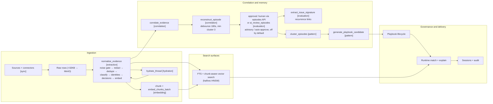

# End-to-end pipeline

## Summary

After reading this page, you should see how operational content enters ContextEdge, becomes **tenant-scoped evidence**, is enriched and searched, surfaces as **episodes**, **patterns**, and **governed playbooks**, and is finally retrieved at **runtime** with audit-friendly traces—without needing to open every subsystem first. You should also know, for each stage, **which Celery task or function runs it, on which queue, and in what order**. Deeper articles in this wiki unpack each box in the diagram below.

## Business picture

Most organizations already have the answers to their recurring problems—they are just buried across ticket queues, chat threads, emails, and shared drives. ContextEdge connects to those systems and converts scattered activity into a **structured, governed knowledge pipeline** that delivers three measurable outcomes:

1. **Faster resolution** — When a new incident arrives, the system surfaces the most relevant approved playbook in seconds, ranked by confidence, so responders spend less time searching and more time fixing.
2. **Fewer repeat mistakes** — Patterns, contradictions, recurrences of the same failure, and past failed attempts are captured alongside successes, so teams learn from what went wrong, not just what went right.
3. **Audit-ready traceability** — Every recommendation can be traced back to the evidence it came from, the review it passed (human or AI-assisted), and the policy that governs its retention—satisfying compliance without extra manual work.

The pipeline flows through six stages: **ingest** raw data from connected systems, **normalize** it into comparable evidence records, **enrich** it with search indexes and AI-assisted extraction, **derive** structured memory (episodes, patterns, playbooks), **deliver** governed guidance at runtime, and **maintain** data quality through review sweeps, retention, and drift monitoring. Each stage is scoped to a single customer (tenant) so data never crosses organizational boundaries, and AI calls are metered against a per-tenant daily budget.

## Technical walkthrough

The path below is the backbone of the product, in execution order. Each step names the function or Celery task that runs it and the queue it runs on.

1. **API surface and request context** — Clients call FastAPI routes under `/api/v1`; the router index wires modules to URL prefixes (`backend/src/contextedge/api/v1/__init__.py`, `backend/src/contextedge/main.py`). Middleware stamps every request with tenant, identity, and correlation IDs that later ride into Celery task headers, so one ID joins an operator's click to the worker and LLM spend it caused (`backend/src/contextedge/middleware/request_context.py`, `backend/src/contextedge/workers/celery_app.py:25-68`). Details in [02](./02-api-and-request-lifecycle.md).

2. **Sources and sync** — External systems are modeled as **sources** with per-object approval flags. Celery Beat fires `sync.trigger_scheduled_syncs` every 15 minutes (`backend/src/contextedge/workers/celery_app.py:292`), which dispatches one `sync.run_incremental_sync` per approved object; backfills arrive from the API as `sync.run_backfill` (`backend/src/contextedge/workers/sync_tasks.py:14-70`). All `sync.*` tasks run on the **sync** queue (`backend/src/contextedge/workers/celery_app.py:227`). A per-object Postgres advisory lock makes sync single-flight — a second worker returns `skipped_locked` instead of racing a checkpoint (`backend/src/contextedge/services/sync_worker_service.py:379`). An incremental run with no checkpoint yet returns `skipped_no_checkpoint` rather than quietly pulling the source's whole history, so an object approved for sync but never backfilled stays idle on purpose (`backend/src/contextedge/services/sync_worker_service.py:571-595`). Details in [03](./03-ingestion-connectors-and-sync.md).

3. **Raw persistence with MinIO offload** — Each connector event becomes one `raw_evidence_objects` row via `persist_ingestion_events` (`backend/src/contextedge/services/ingestion_persistence.py:19`), deduplicated on `(tenant, source, external_id, content_hash)` before insert. A payload over **32 KB** (`OFFLOAD_THRESHOLD_BYTES`, `backend/src/contextedge/services/ingestion_persistence.py:16`) is uploaded to MinIO under `raw/{tenant_id}/{raw_id}.json` (`backend/src/contextedge/services/object_store.py:50-51`) and the database keeps only a stub `{"_offloaded": true, "size_bytes": N}`. **Caveat:** any SQL that filters on `raw_payload` silently sees the stub for the biggest rows — exactly the longest conversations and articles (see [KNOWN_GAPS.md](./KNOWN_GAPS.md), knowledge-lifecycle entry).

4. **Crash-safe handoff to normalization** — After the sync run commits, `_commit_and_queue_normalization` (`backend/src/contextedge/services/sync_worker_service.py:301`) claims the new raw IDs plus any IDs a previous failed enqueue left behind (`_claim_pending_raw_ids_for_handoff`, `backend/src/contextedge/services/sync_worker_service.py:273`), then `queue_normalize_raw_objects` dispatches one `extraction.normalize_evidence` task per raw row (`backend/src/contextedge/services/sync_ingestion_queue.py:16`). If the broker fails mid-enqueue, the un-enqueued IDs are parked on the source object and re-drained by the next successful run — no double-processing, no lost tail.

5. **Normalization — one task, a fixed inner order** — `extraction.normalize_evidence` (**extraction** queue; task at `backend/src/contextedge/workers/extraction_tasks.py:1304-1306`) runs `_normalize` (`backend/src/contextedge/workers/extraction_tasks.py:122`), whose steps happen in this order:
   - **Noise gate** (deterministic, pre-LLM, hydrated thread messages only): `message_noise_reason` rejects delivery failures, quote-only replies, empties, and short coordination chatter under 150 diagnostic characters with no technical signal (`backend/src/contextedge/workers/extraction_tasks.py:147-160`; `backend/src/contextedge/services/message_filter.py:52,174`). A rejected message gets **no evidence row**; the raw object stays so a rule change can re-judge it. Measured: 47% of live thread messages die here before any model call.
   - **Title/body extraction + content hash**: the hash is computed on the **pre-redaction** body so tuning redaction rules never breaks dedup (`backend/src/contextedge/workers/extraction_tasks.py:162-168`).
   - **Redaction**: secrets and PII are regex-redacted before the classifier, embedder, extractors, or database see the text (`backend/src/contextedge/workers/extraction_tasks.py:173-175`; rules in `backend/src/contextedge/services/redaction_service.py`).
   - **Dedupe** on `(tenant_id, content_hash)` — a re-ingest refreshes the existing row (case state, knowledge state, facets) instead of duplicating it (`backend/src/contextedge/workers/extraction_tasks.py:213-221`). A concurrent insert of the same content trips the partial unique index from migration `0026` (`backend/alembic/versions/0026_dedup_uniqueness.py`); the loser rolls back and adopts the winner without re-spending LLM calls (`backend/src/contextedge/workers/extraction_tasks.py:376-396`).
   - **Relevance classification** (first LLM call, prompt `relevance` **v2** default — `backend/src/contextedge/ai/prompts/relevance.py:76-84`; call at `backend/src/contextedge/workers/extraction_tasks.py:428`). Failure falls through to full extraction — classification never blocks ingestion.
   - **Skip gate**: `not_relevant` at confidence ≥ 0.75 skips all remaining LLM work and chunking; the evidence row stays for audit but never enters vector search (`backend/src/contextedge/workers/extraction_tasks.py:475-479`).
   - **Message-function classification** (second LLM call, conversational sources only): what a message is *doing* — confirms a fix, asks for status, withdraws a claim (`backend/src/contextedge/workers/extraction_tasks.py:487-499`).
   - **Error signatures** (deterministic regex, runs even for skipped items — a confidently-irrelevant thread can still carry a pasted stack trace) (`backend/src/contextedge/workers/extraction_tasks.py:511-514`).
   - **Identity resolution** (`link_evidence_identities`, `backend/src/contextedge/services/identity_service.py:810`; called at `backend/src/contextedge/workers/extraction_tasks.py:533`): strong identifiers match at 1.0, exact aliases at 0.95, otherwise an LLM adjudicator that may abstain into `needs_review`. See [12](./12-identity-resolution-and-thread-hydration.md).
   - **Decision extraction** (`link_evidence_decisions`, `backend/src/contextedge/services/decision_service.py:21`; called at `backend/src/contextedge/workers/extraction_tasks.py:551`): "engineer restarted vpn-gw-east-01" becomes `records_decision` / `records_action_on` graph edges.
   - **Parent embedding**: title + first 8,000 body chars → one 3,072-dimension vector on `evidence_items.embedding` (`backend/src/contextedge/workers/extraction_tasks.py:65,568`; `backend/src/contextedge/models/evidence.py:91`). This is the one call in `_normalize` that hands the provider no tenant context, so it is neither budget-gated nor billed to a tenant; every other model call here passes `tenant_id` and the session.
   - **Chunk dispatch**: runs after the parent embedding so a chunker bug cannot regress retrieval. Bodies under 16 KB from known ticket/thread sources chunk **inline**; everything else goes async (`backend/src/contextedge/workers/extraction_tasks.py:54,73-119,579`).

6. **Post-commit fan-out** — After the transaction commits, the task wrapper dispatches the next stages (`backend/src/contextedge/workers/extraction_tasks.py:1306-1346`): attachments → `artifact.extract_attachment`; otherwise `extraction.correlate_evidence` + `extraction.compute_evidence_baseline` (both on the **correlation** queue, `backend/src/contextedge/workers/celery_app.py:256-258`); and, for any parent record that carries a thread reference — never for a hydrated message, and never on the dedup path — `hydration.hydrate_thread` (`backend/src/contextedge/workers/hydration_tasks.py:189`, **hydration** queue). Hydrated messages loop back through `normalize_evidence` — where the step-5 noise gate drops roughly half of them — but never re-trigger hydration themselves, so the loop converges after one pass.

7. **Chunking and chunk embeddings** — `extraction.chunk_evidence` and `extraction.embed_chunks_batch` run on the dedicated **embedding** queue (`backend/src/contextedge/workers/celery_app.py:267-268`) so retrieval never starves behind bulk normalization (the queue exists because 85% of chunks once sat unembedded — ingested but silently unretrievable). `get_chunker` picks a per-source strategy — document chunker for KB articles, ticket, thread, attachment, fallback (`backend/src/contextedge/services/chunkers/registry.py:116`); `write_chunks` persists `evidence_chunks` rows keyed by `(evidence_id, chunk_index, chunker_version)` (`backend/src/contextedge/services/evidence_chunk_service.py:43`; model at `backend/src/contextedge/models/evidence.py:173`). Chunk embeddings run in batches of 32 (`backend/src/contextedge/workers/chunk_tasks.py:51`) and — unlike the parent embedding — are budget-gated and cost-attributed per tenant.

8. **Search (live and chunk-aware)** — The real ANN index is migration `0032`'s **halfvec expression HNSW**: pgvector's HNSW caps at 2,000 dimensions and the app stores 3,072, so the four embedding columns are indexed over `(embedding::halfvec(3072))` with `m = 16, ef_construction = 64` (`backend/alembic/versions/0032_halfvec_hnsw_indexes.py:111`). Every cosine query must use the same cast (`halfvec_cosine_distance`, `backend/src/contextedge/search/vector_ops.py:40`) and set `hnsw.ef_search = 200` per transaction (`backend/src/contextedge/search/vector_ops.py:31`) or it silently sequential-scans. Semantic search is **chunk-aware today**: `search_evidence_semantic` (`backend/src/contextedge/search/vector_search.py:204`) runs an oversampled chunk pass, diversifies with maximal marginal relevance at λ = 0.7 (`backend/src/contextedge/search/chunk_rollup.py:31,79`), rolls up to one best chunk per parent evidence, then merges a parent-embedding pass so unchunked evidence still surfaces. Lexical search is `search_evidence_fts` over a generated tsvector column with ticket-number and title fallbacks (`backend/src/contextedge/search/pg_fts.py:12`; column at `backend/src/contextedge/models/evidence.py:108`). The two surfaces do **not** gate identically, and the difference matters: the semantic path applies legal hold, pending redaction, and role-excluded access policies (`_visibility_predicates`, `backend/src/contextedge/search/vector_search.py:49`), while the lexical path applies only the access-policy exclusion and, by default, hides hydrated thread replies (`backend/src/contextedge/search/pg_fts.py:35-38,73-79`). Details in [05](./05-search-hybrid-and-access.md).

9. **Correlation → case graph → episode synthesis** — `extraction.correlate_evidence` runs `correlate_evidence_item` (`backend/src/contextedge/services/correlation_service.py:197`): tier 1 writes deterministic case links at confidence 1.0 (shared ticket references, thread membership, quoted ticket numbers); tier 2 scores identity co-occurrence within a 7-day window, gated so hub identities and single shared persons never mass-merge. When new edges were created, it schedules `extraction.reconstruct_episode` with a **180-second debounce** (`backend/src/contextedge/workers/correlation_tasks.py:48-51`). Reconstruction (`_reconstruct`) first materializes the connected evidence cluster — capped at 50 members, 3 hops, a 30-day window (`backend/src/contextedge/services/episode_cluster_service.py:47-49,108`) — then applies cost gates in order: minimum cluster size 3, a per-cluster advisory lock, a settlement re-check (with a 30-minute starvation cap so a never-quiet thread still gets narrated), and a 1.5× growth requirement before re-synthesizing (`backend/src/contextedge/workers/extraction_tasks.py:746,756,774,834`). Only then does `create_episodes_from_evidence` call the model and persist draft episodes in `reviewer_state="pending_review"` (`backend/src/contextedge/services/episode_service.py:114`). A cluster of 20 evidence items or fewer is one call; a bigger one is split into chunks of 20 and extracted a chunk at a time, with no cross-chunk pass (`backend/src/contextedge/ai/extractors/episode_extractor.py:44,196-212`) — and that split path is the open cause of the stacked-step drafts recorded in [KNOWN_GAPS.md](./KNOWN_GAPS.md), so a multi-chunk episode's step timeline should not be read as reliable yet.

10. **Episode review — human and AI** — Humans approve drafts via the episodes API. In addition, an hourly sweep `evaluation.ai_review_episodes` (`backend/src/contextedge/workers/evaluation_tasks.py:129`, **evaluation** queue) reviews pending drafts with one LLM verdict each, in one of three modes — `off` (default), `advisory`, `auto_approve` (`backend/src/contextedge/config.py:185`). Every reviewed draft gets the verdict stamped on `episodes.ai_review`; auto-approval additionally requires deterministic floors — at least 2 evidence items, a ≥20-character outcome, verdict `approve` at confidence ≥ 0.8 (`backend/src/contextedge/services/episode_review_service.py:42-44,89,174`) — and leaves `reviewer_user_id` NULL so an AI approval is permanently distinguishable from a human one. The sweep commits per episode before dispatching anything, defers while bulk ingest is active, and loses cleanly to any concurrent human decision.

11. **Issue signatures and recurrence** — Every episode approval (human or auto) dispatches `evaluation.extract_issue_signature` (`backend/src/contextedge/workers/signature_tasks.py:24`). One LLM call distills the episode into a generalized fingerprint — `capability|component|failure_mode`, slugged and unique per tenant (`backend/src/contextedge/services/issue_signature_service.py:76,89`). When the same key appears again, the new episode's seed evidence gets a low-confidence (0.6) **recurrence** pointer to the previous occurrence's case (`backend/src/contextedge/services/issue_signature_service.py:36`) — a precedent link for retrieval, never a merge: the episode cluster resolver deliberately refuses to expand through recurrence memberships.

12. **Patterns and playbook candidates** — `pattern.cluster_episodes` (**pattern** queue, `backend/src/contextedge/workers/pattern_tasks.py:422`) is **event-driven, not scheduled**: episode approvals and the AI-review sweep dispatch it per domain (plus a manual API). For each approved, embedded, unlinked episode it takes the pattern owning the single **nearest** member episode inside `PATTERN_MATCH_MAX_DISTANCE = 0.30` (pattern_tasks.py:50, 243-257) and puts it to an LLM adjudication; failing that it groups semantic neighbours inside `CLUSTER_GROUP_MAX_DISTANCE = 0.27` (pattern_tasks.py:60, 299-312) and synthesizes a new pattern. **Both constants were recalibrated on 2026-08-19** against the live corpus and the `ORDER BY distance` was added at the same time — earlier text here said 0.35 / 0.20 with an unordered `LIMIT 1`, which handed the validator an arbitrary qualifying pattern; the fix took the validator's accept rate from 12% to 40%. New or grown patterns dispatch `pattern.generate_playbook_candidate` (`pattern_tasks.py:446`) **through `services/deferred_dispatch.dispatch_after_commit`** (`services/pattern_service.py:192, 247`), not by a bare `.delay()`, so a worker can never read pre-commit state. Generation refuses patterns below the 0.5 confidence floor (`PLAYBOOK_GENERATION_MIN_PATTERN_CONFIDENCE`, `pattern_tasks.py:34`, gate at `:487`), retrieves relevant KB/SOP knowledge to ground the draft, drops any citation the model invented, structurally sanitises the branching logic, and persists a **candidate** playbook with full evidence provenance. Details in [07](./07-episodes-patterns-playbooks.md).

13. **Playbooks, governance, runtime** — Playbooks move through a reviewed lifecycle (`transition_playbook`, `create_playbook_version` — `backend/src/contextedge/services/playbook_service.py:217,360`); only **approved** playbooks with a published version are retrievable at runtime. `POST /api/v1/runtime/match` calls `rank_playbooks` (`backend/src/contextedge/api/v1/runtime.py:130`; `backend/src/contextedge/search/hybrid_ranker.py:213`), which blends keyword, semantic, graph, evidence-quality, identity, recency, and freshness signals minus a negative-knowledge penalty (`RankingWeights`, `backend/src/contextedge/search/hybrid_ranker.py:23-31`) and **abstains** — returns an empty list — when nothing clears 0.35 (`backend/src/contextedge/search/hybrid_ranker.py:171`). The full explain payload is cached in Redis for an hour (`backend/src/contextedge/api/v1/runtime.py:29`). Sessions record retrieval traces and decisions for audit (`backend/src/contextedge/services/session_service.py:38,139`).

14. **Background topology and upkeep** — Workers drain **eight** queues: `default, sync, hydration, extraction, correlation, embedding, pattern, evaluation` (`backend/dev.py:16`; routing table at `backend/src/contextedge/workers/celery_app.py:226-280`). The `correlation` and `embedding` lanes exist because FIFO behind bulk normalization once starved the graph and left evidence unretrievable — a deployment that does not consume them recreates that failure. Workers refuse to start against a database that is behind the code's Alembic head (`_require_migrations_at_head`, `backend/src/contextedge/workers/celery_app.py:84`). Retention runs on Beat: archive daily, purge weekly (`retention-archive-daily` / `retention-purge-weekly`, `backend/src/contextedge/workers/celery_app.py:336,341`); soft purge also scrubs `evidence_chunks`, which carry the same content as their parent. Details in [08](./08-workers-celery-queues.md) and [11](./11-retention-and-operational-events.md).

The **Next.js** dashboard is a thin client over this API; most rules stay on the server (`frontend/`).

## Flow diagram

This is the same story as the numbered list, compressed for orientation. Queue names in brackets show which Celery lane carries each hop.



Arrows show the main data dependency. Chunk-level retrieval is **live**: the chunk pass, MMR diversification, and best-chunk-per-parent rollup shipped in `search/vector_search.py` + `search/chunk_rollup.py` (see [05](./05-search-hybrid-and-access.md) and [`CHUNKING_DESIGN.md`](./CHUNKING_DESIGN.md) §6).

## Example: Acme VPN data at this stage

One Jira ticket travels the full pipeline. Each box below shows the data shape at that stage.

**1. Connector output (ingestion event)**

```json
{
  "external_id": "JIRA-4521",
  "source_type": "jira_sm",
  "title": "VPN connection drops after Windows update KB5032190",
  "body": "Users reporting VPN disconnects since patch Tuesday. Gateway: vpn-gw-east-01. Error: AUTH_CERT_EXPIRED. Reported by jsmith@acme.com.",
  "created_at": "2026-03-15T09:23:00Z"
}
```

**2. Raw evidence (after persist)**

```json
{
  "raw_id": "raw-7f3a1b",
  "tenant_id": "acme-corp",
  "source_id": "src-jira-01",
  "external_id": "JIRA-4521",
  "content_hash": "sha256:9f3a2b...",
  "raw_payload": "{ ... full Jira JSON ... }"
}
```

Had this payload exceeded 32 KB (a 40-message thread, a long post-mortem), `raw_payload` would instead hold the stub `{"_offloaded": true, "size_bytes": 41230}` and the full JSON would live in MinIO at `raw/acme-corp/raw-7f3a1b.json`.

**3. Normalized evidence item**

```json
{
  "evidence_id": "ev-a1b2c3",
  "tenant_id": "acme-corp",
  "title": "VPN connection drops after Windows update KB5032190",
  "body_summary": "Multiple users report VPN disconnects following patch Tuesday. AUTH_CERT_EXPIRED on vpn-gw-east-01.",
  "relevance_state": "operational",
  "chunked_at": "2026-05-08T01:13:42Z",
  "chunk_count": 1,
  "canonical_entity_refs": {
    "identities": [
      { "canonical_id": "b7e2...", "canonical_name": "John Smith", "entity_type": "person",
        "alias": "jsmith@acme.com", "matched_via": "strong:email", "confidence": 1.0, "resolution_state": "resolved" },
      { "canonical_id": "9c41...", "canonical_name": "vpn-gw-east-01", "entity_type": "device",
        "alias": "vpn-gw-east-01", "matched_via": "strong:hostname", "confidence": 1.0, "resolution_state": "resolved" }
    ],
    "decisions": [
      { "decision_type": "remediation", "action": "renewed gateway certificate",
        "actor": "John Smith", "actor_identity_id": "b7e2...",
        "target": "vpn-gw-east-01", "target_identity_id": "9c41...",
        "context": "after AUTH_CERT_EXPIRED errors post-KB5032190" }
    ]
  }
}
```

(The ref shapes match what `link_evidence_identities` and `link_evidence_decisions` actually write — `backend/src/contextedge/services/identity_service.py:858-870`, `backend/src/contextedge/services/decision_service.py:97-105`.)

**4. Evidence chunks (one card, one or more chunks)**

```json
[
  {
    "chunk_id": "chk-7a8b9c",
    "evidence_id": "ev-a1b2c3",
    "chunk_index": 0,
    "chunk_kind": "body",
    "text": "VPN connection drops after Windows update KB5032190\n\nUsers reporting VPN disconnects since patch Tuesday. Gateway: vpn-gw-east-01. Error: AUTH_CERT_EXPIRED. Reported by jsmith@acme.com.",
    "metadata": {
      "priority": "high",
      "issue_type": "incident",
      "project": "IT-OPS",
      "author": "jsmith@acme.com",
      "source_authority": "ticket"
    },
    "chunker_version": 1
  }
]
```

A long Teams thread or a multi-page post-mortem attachment produces many chunks here — one per message or per heading section. The single-chunk case (above) is the common shape for short Jira tickets, and chunk search still helps: at query time the chunk pass, MMR, and rollup surface the *best-matching part* of every record, with the chunk's `parent_section` and snippet attached to the hit.

**5. Episode (after AI reconstruction, then AI review)**

```json
{
  "episode_id": "ep-x1y2z3",
  "title": "Corporate VPN authentication failure after KB5032190",
  "status": "draft",
  "reviewer_state": "pending_review",
  "cluster_fingerprint": "sha256:c41f...",
  "ai_review": { "verdict": "approve", "confidence": 0.88, "reasons": ["outcome follows from the gateway log evidence"],
                 "prompt_version": "v1", "mode": "advisory", "auto_approved": false,
                 "failed_floors": [], "reviewed_at": "2026-03-15T14:00:11Z" },
  "steps": [
    { "order": 1, "type": "complaint", "text": "Users report VPN drops post-patch Tuesday" },
    { "order": 2, "type": "diagnostic", "text": "Checked gateway logs — AUTH_CERT_EXPIRED errors" },
    { "order": 3, "type": "failed_step", "text": "Restarted VPN service — no improvement" },
    { "order": 4, "type": "remediation", "text": "Renewed gateway certificate via internal CA" },
    { "order": 5, "type": "outcome", "text": "VPN restored for all affected users" }
  ]
}
```

(Step types come from the fixed vocabulary the schema gate enforces — `backend/src/contextedge/ai/extractors/episode_schema.py:22-33`; `failed_step` is the canonical label for an attempt that did not work. In `auto_approve` mode this draft would flip to approved with `reviewer_user_id` NULL, since it clears all floors.)

**6. Approved playbook (after review)**

```json
{
  "playbook_id": "pb-r1s2t3",
  "title": "VPN Certificate Rotation After Patch Tuesday",
  "lifecycle_state": "approved",
  "risk_tier": "medium",
  "current_version": "0.1.0",
  "trigger_conditions": "VPN auth failures after Windows update with AUTH_CERT_EXPIRED"
}
```

**7. Runtime match response**

```json
{
  "matches": [{
    "playbook_id": "pb-r1s2t3",
    "title": "VPN Certificate Rotation After Patch Tuesday",
    "confidence": 0.92,
    "breakdown": { "keyword": 0.85, "semantic": 0.94, "graph_distance": 0.60,
                   "evidence_quality": 0.78, "identity": 1.0, "recency": 0.95,
                   "freshness": 0.95, "negative_penalty": 0.0 },
    "evidence_trace": ["ev-a1b2c3", "ev-d4e5f6"],
    "freshness": "fresh"
  }]
}
```

(The breakdown keys are the actual `RankingWeights` signals — `backend/src/contextedge/search/hybrid_ranker.py:23-31`. Had every candidate scored below 0.35, the list would be empty by contract: the ranker abstains rather than guessing.)

## Design decisions

- **Modular monolith (FastAPI + one Postgres)** — *Why:* simpler operations and consistent transactions across tenants' data. *Tradeoff:* horizontal scaling is mostly "scale the app + DB," not independent microservices per feature.

- **Post-commit worker pipeline for normalization** — *Why:* HTTP and sync paths stay fast; heavy parsing, LLM calls, and embedding do not block the caller, and every `.delay()` on this path fires only after the transaction commits so a worker can never read uncommitted state. *Tradeoff:* evidence is briefly "raw-only" until workers catch up; monitoring queue depth matters (`/api/v1/admin/pipeline-health` exists for exactly this).

- **Claim-before-queue handoff for raw backlog** — *Why:* survives Redis/broker outages without duplicate normalize tasks or lost tails (`backend/src/contextedge/services/sync_worker_service.py:273-376`). *Tradeoff:* more moving parts in `sync_worker_service` than a naive "enqueue immediately."

- **DB-enforced dedupe with race adoption** — *Why:* a partial unique index on `(tenant_id, content_hash)` (migration `0026`) makes duplicates impossible even under concurrency; the losing worker catches the `IntegrityError`, adopts the winner's row, and skips re-running the LLM enrichment it already paid for (`backend/src/contextedge/workers/extraction_tasks.py:376-396`). The hash covers the **pre-redaction body**, so redaction tuning never forks dedup. *Tradeoff:* fields that change without the body changing (ticket status, article lifecycle) must be explicitly refreshed on the dedup path — and are.

- **Gates in front of the expensive LLM calls** — *Why:* the deterministic noise gate, the relevance skip gate, and the episode-synthesis gates (debounce, min-cluster, growth) exist because measured spend showed most model output was rejected chatter or superseded drafts; per-tenant daily budgets (`check_budget`, `backend/src/contextedge/services/tenant_budget_service.py:234`) cap what remains. *Tradeoff:* a stable two-evidence cluster below the min-cluster floor never gets an episode until new correlation arrives (see [KNOWN_GAPS.md](./KNOWN_GAPS.md)).

- **Per-source chunking as a sibling table + query-time rollup** — *Why:* a single embedding per `EvidenceItem` saw at most `body[:8000]`, making anything past 8 KB invisible to retrieval. Chunks index the *inside* of long records; at query time MMR-diversified chunk hits roll up to one best chunk per parent, so the card surface stays one-per-record. *Tradeoff:* ~5–10× more embedding rows and a rollup step per query. Detail in [`CHUNKING_DESIGN.md`](./CHUNKING_DESIGN.md).

- **halfvec expression indexes instead of plain HNSW** — *Why:* pgvector's HNSW on the `vector` type supports at most 2,000 dimensions and the app stores 3,072 — the pre-`0032` indexes never existed and every similarity query sequential-scanned. `0032` indexes `(embedding::halfvec(3072))` and the query side casts identically (`backend/src/contextedge/search/vector_ops.py:40`). *Tradeoff:* every new cosine query must use the shared expression helper or it silently loses the index, and an environment stamped at an older `0032` revision stays on sequential scans until re-migrated.

- **AI drafts, humans gate — with an optional AI reviewer** — *Why:* episodes and playbooks are born as drafts/candidates; runtime only serves approved artifacts, and the AI review sweep (default `off`) can triage or auto-approve only over deterministic floors, with a downgrade-only override and a NULL `reviewer_user_id` marking machine approvals forever. *Tradeoff:* the fastest path is not always the path the system allows; enabling auto-approve is a deliberate configuration decision, not a default.

## Code map

| Concern | Module path | Key symbols | When it runs |
| --- | --- | --- | --- |
| App bootstrap | `backend/src/contextedge/main.py` | `create_app`, `lifespan` | Process start |
| Sync tasks | `backend/src/contextedge/workers/sync_tasks.py:14-70` | `trigger_scheduled_syncs`, `run_backfill`, `run_incremental_sync` | Beat / API → **sync** queue |
| Ingestion persist + offload | `backend/src/contextedge/services/ingestion_persistence.py:16-19` | `persist_ingestion_events`, `OFFLOAD_THRESHOLD_BYTES` | Inside each sync/hydration run |
| Sync handoff / recovery | `backend/src/contextedge/services/sync_worker_service.py:273,301` | `_claim_pending_raw_ids_for_handoff`, `_commit_and_queue_normalization` | After sync commit, before enqueue |
| Normalize worker | `backend/src/contextedge/workers/extraction_tasks.py:122,1304` | `_normalize`, `normalize_evidence`, `_dispatch_chunking` | **extraction** queue |
| Noise gate | `backend/src/contextedge/services/message_filter.py:52,174` | `message_noise_reason`, `MIN_DIAGNOSTIC_CHARS` | First step of `_normalize` (hydrated messages) |
| Thread hydration | `backend/src/contextedge/workers/hydration_tasks.py:189` | `hydrate_thread` | **hydration** queue, post-commit |
| Chunkers | `backend/src/contextedge/services/chunkers/registry.py:116` | `get_chunker` + document/ticket/thread/attachment/fallback | Inline or `chunk_evidence` |
| Chunk persistence + embedding | `backend/src/contextedge/services/evidence_chunk_service.py:43`; `backend/src/contextedge/workers/chunk_tasks.py:51,210,238` | `write_chunks`, `chunk_evidence_task`, `embed_chunks_batch_task`, `EMBED_BATCH_SIZE` | **embedding** queue |
| ANN plumbing | `backend/src/contextedge/search/vector_ops.py:31,40` | `halfvec_cosine_distance`, `ANN_EF_SEARCH` | Every semantic query |
| Chunk-aware search | `backend/src/contextedge/search/vector_search.py:204`; `backend/src/contextedge/search/chunk_rollup.py:79,111` | `search_evidence_semantic`, `mmr_order`, `rollup_best_chunk_per_evidence` | Search + ranker |
| Correlation | `backend/src/contextedge/services/correlation_service.py:197`; `backend/src/contextedge/workers/correlation_tasks.py:16` | `correlate_evidence_item` | **correlation** queue |
| Episode synthesis | `backend/src/contextedge/workers/extraction_tasks.py:746-834,1391`; `backend/src/contextedge/services/episode_service.py:114` | `_reconstruct`, `create_episodes_from_evidence` | **correlation** queue, debounced |
| Episode AI review | `backend/src/contextedge/workers/evaluation_tasks.py:129`; `backend/src/contextedge/services/episode_review_service.py:42-44,174` | `ai_review_episodes`, `ai_review_episode`, floors | Hourly Beat → **evaluation** queue |
| Issue signatures / recurrence | `backend/src/contextedge/workers/signature_tasks.py:24`; `backend/src/contextedge/services/issue_signature_service.py:36,76,89` | `extract_issue_signature`, `signature_key_for`, `RECURRENCE_CONFIDENCE` | On every episode approval |
| Patterns + playbook candidates | `backend/src/contextedge/workers/pattern_tasks.py:34,379,403` | `cluster_episodes`, `generate_playbook_candidate`, confidence floor | **pattern** queue, approval-driven |
| Hybrid ranking | `backend/src/contextedge/search/hybrid_ranker.py:23-31,171,213` | `rank_playbooks`, `RankingWeights`, `MIN_RECOMMENDATION_SCORE` | Runtime match and evaluations |
| Runtime endpoint | `backend/src/contextedge/api/v1/runtime.py:29,130` | match route, `MATCH_CACHE_TTL_SEC` | `/api/v1/runtime/match` |
| Celery topology | `backend/src/contextedge/workers/celery_app.py:226-280` | `task_routes`, `beat_schedule` | Worker and beat processes |
| Playbook governance | `backend/src/contextedge/services/playbook_service.py:217,360` | `transition_playbook`, `create_playbook_version` | Admin API and internal callers |

## Acme VPN incident (this layer)

When **Acme Corp**'s **Corporate VPN** outage spawns duplicate Jira tickets, Teams threads, and a follow-up email, **connectors and sync** land raw payloads (the 40 KB post-mortem offloads to MinIO) that **normalize** into evidence rows analysts can find with "VPN gateway" — after the noise gate drops the "any update?" replies and redaction scrubs the email addresses. **Identity resolution** binds `jsmith`, "John Smith," and `vpn-gw-east-01` to canonical rows; **decision extraction** records that John renewed the gateway certificate. **Chunking** makes AUTH_CERT_EXPIRED recoverable wherever it appears in a long thread, not just in the first 8 KB. **Correlation** links the ticket, the thread, and the email into one case, and the debounced **episode synthesis** narrates them as a single draft. With the review sweep switched on, the hourly **AI review** stamps an `approve` verdict; on approval — by a person or by the sweep — the **issue signature** `remote_access|tls_certificate|certificate_expired` is minted — so when the same certificate expires next year, the new episode's evidence gets a recurrence pointer straight back to this case. **Pattern clustering** groups this episode with prior certificate-expiry episodes, a **playbook candidate** is generated with the renewal SOP cited as `[kb-1]`, review approves it, and **runtime** ranks it first the next time an integration asks about VPN auth failures — with **sessions** and audit recording what was recommended and why.

## Further reading

- Repository architecture and package map: [`docs/TECHNICAL_BLUEPRINT.md`](../docs/TECHNICAL_BLUEPRINT.md)
- HTTP details and auth headers: [`docs/API.md`](../docs/API.md)
- Commands, worker topology (Windows two-worker layout), and operations: [`docs/RUNBOOK.md`](../docs/RUNBOOK.md)
- Known caveats the idealized flow glosses over: [KNOWN_GAPS.md](./KNOWN_GAPS.md)
- Next articles in this wiki: [PLAN.md](./PLAN.md) (02 API lifecycle through 18 cost containment)
