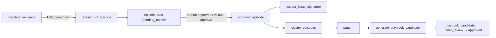

# Episodes, patterns, and playbooks

## Summary

You will see how **episodes** reconstruct what happened from correlated evidence, how approved episodes gain **issue signatures** that link recurring problems, how **patterns** cluster similar episodes, and how **playbooks** become governed, versioned procedures — with the exact Celery tasks and service functions that carry each stage, in order, and the gates that keep low-value work from reaching a reviewer.

## Business picture

Individual incidents become reusable organizational knowledge through a governed review process. An **episode** captures the full story of one incident — what users reported, what the team tried, what worked, and what the outcome was. When the same kind of problem happens again, an **issue signature** connects the new occurrence to the old one as a precedent, without ever merging the two incidents. When several episodes look alike, the system surfaces a **pattern**: a signal that the same type of problem keeps happening, which helps teams prioritize fixes and documentation. Once a pattern is well understood, the system drafts a **playbook candidate** — a proposed, versioned procedure that describes how to handle this class of issue, grounded both in what engineers actually did (episodes) and in what the approved documentation says (knowledge articles). Playbooks go through a formal review cycle (candidate → under review → approved) so that only vetted procedures reach the teams and automation that rely on them.

At every stage, humans own the final word. The AI proposes drafts and can pre-annotate them; an optional AI first-pass reviewer can even approve the unambiguous subset — but only under deterministic floors, only when an operator has switched that mode on, and always in a way that stays permanently distinguishable from a human approval.

## Technical walkthrough



### 1. Episodes: from correlated evidence to a draft story

Reconstruction is a Celery chain, not an API call. When `extraction.correlate_evidence` creates new correlation edges, it enqueues `extraction.reconstruct_episode` with a **180-second countdown** so a burst of related messages settles before anyone pays for narration (`reconstruct_episode_task.apply_async(..., countdown=RECONSTRUCT_DEBOUNCE_SECONDS)`, backend/src/contextedge/workers/correlation_tasks.py:48-51; the constant lives at backend/src/contextedge/workers/extraction_tasks.py:746). Both tasks run on the dedicated `correlation` queue so they never starve behind bulk normalization (backend/src/contextedge/workers/celery_app.py:256-257).

The task body, `_reconstruct` (backend/src/contextedge/workers/extraction_tasks.py:995), runs a series of gates **in order** before any LLM spend:

1. **Cluster resolution.** `resolve_episode_cluster` (backend/src/contextedge/services/episode_cluster_service.py:108) materializes the connected component over case links and correlation edges, bounded by `MAX_CLUSTER_SIZE = 50`, `MAX_HOPS = 3`, and a 30-day time fence relative to the nearest seed (episode_cluster_service.py:47-49). Tenant, legal-hold, and pending-redaction filters are applied in SQL, so excluded evidence never enters the cluster at all. The output carries a `fingerprint` — a hash of the sorted member ids — used everywhere below.
2. **Minimum-cluster gate.** Clusters smaller than `MIN_AUTO_SYNTHESIS_CLUSTER = 3` are skipped — re-attempted only when a new correlation dispatch fires (extraction_tasks.py:756). Measured basis: 58% of one day's drafts were one-to-two-evidence fragments that dedup retired minutes later.
3. **Resolution gate** (optional; `episode_resolution_gate` defaults to `"off"`, backend/src/contextedge/config.py:175). When set to `cluster`, synthesis defers until some evidence in the cluster carries a resolution signal. The check is deterministic — it reads `evidence_items.case_state == 'resolved'` first (the source system's own verdict), then a precision-first regex over titles and body head/tail — and it fails open on errors. Manual reviewer triggers (`settle=False`) bypass it.
4. **Advisory lock, debounce re-check, draft idempotency, growth gate.** A per-cluster Postgres advisory lock stops concurrent tasks from minting duplicate drafts; the debounce re-check defers if the newest member arrived inside the 180-second window (with a starvation guard: a never-quiet channel still gets its first synthesis within `MAX_SYNTHESIS_DELAY_SECONDS = 1800`, extraction_tasks.py:834); an existing pending draft with the same `cluster_fingerprint` short-circuits; and re-synthesis requires the cluster to have grown by at least `MIN_RESYNTHESIS_GROWTH = 0.5` over the largest covered draft (extraction_tasks.py:774) — without this, ten trailing messages cost ten full ~12,700-token syntheses of which dedup retired nine.
5. **Source roles.** Each evidence item is labeled with a synthesis authority role — `ticket`, `working_discussion`, `external_communication`, `document`, `monitoring` — via `resolve_synthesis_role` (extraction_tasks.py:887), which the episode prompt uses for field-level authority (the ticket is authoritative for state and close code; the chat for what was actually tried).
6. **Supersede-on-growth.** Pending drafts whose evidence is a strict subset of this cluster are marked `reviewer_state = "superseded"` before the new synthesis lands.

The LLM call itself is `reconstruct_episode` (backend/src/contextedge/ai/extractors/episode_extractor.py:167): at most `MAX_ITEMS_PER_CALL = 20` items per call, each body budgeted to `PER_ITEM_CHAR_LIMIT = 2000` chars by salience-aware truncation (episode_extractor.py:44, 48). Items are labeled `[ev-N]`, the whole block is fenced as untrusted content, and the current default prompt is **episode v3** (source-authority rules plus structured contradictions). After the call, label translation drops any evidence reference the model invented, a schema gate (`validate_episode`) drops broken episodes and coerces unknown vocabulary, and a generation-provenance stamp is applied by the caller — the model can never supply its own provenance. Clusters larger than 20 items split into sequential chunks with **no cross-chunk merge pass** — see the caveat below.

Persistence is `create_episodes_from_evidence` (backend/src/contextedge/services/episode_service.py:114). It writes the `episodes` row (`status="draft"`, `reviewer_state="pending_review"`, `evidence_ids`, `cluster_fingerprint`, `entity_refs`, `contradictions`, embedding, `generation_provenance` — model columns at backend/src/contextedge/models/episode.py:244-261), one `episode_evidence_links` row per grounding item, and ordered `episode_steps`. An LLM failure logs and returns `[]` — reconstruction never crashes the task; Celery retries up to 3 times (extraction_tasks.py:1302). Each new episode also resolves a **`primary_case_ref`** — the quotable ticket number — by following the episode's own cited evidence to its canonical cases and taking the identifier correlation already marked authoritative (`_resolve_primary_case_ref`, episode_service.py:18). It returns `None` rather than a guess when no linked case exists (normal for `local_file` ingests, where a filename is not a verified identifier).

> **Known gap (open P1):** clusters above 20 evidence items produce episodes whose per-chunk steps are concatenated and all numbered from #1 — 949 live episodes carry stacked timelines. As interim damage control, 836 affected pending drafts were stamped `hold / timeline_corrupted_pending_repair` in `ai_review` — the sweep then skips them, because its selection filter is `ai_review IS NULL`. That stamp is data, written once by an operational script; no code path produces it, so do not look for it in the review modes (which are exactly `off` / `advisory` / `auto_approve`). See [KNOWN_GAPS.md](./KNOWN_GAPS.md), "multi-chunk synthesis stacks steps". Also: a stable two-evidence cluster that never grows is terminally skipped by the min-cluster gate, not deferred — nothing re-dispatches it.

### 2. Review: humans first, an AI first-pass when enabled

**Human path.** `POST /api/v1/episodes/{id}/approve` (role `knowledge_manager`) and `POST /api/v1/episodes/bulk-approve` set `status`/`reviewer_state` to `approved`, **commit first**, then dispatch `evaluation.extract_issue_signature` per episode and one `pattern.cluster_episodes` per affected domain (backend/src/contextedge/api/v1/episodes.py:230, 282; dispatches at 266, 275, 324, 335). Commit-before-dispatch is deliberate: a message consumed before the commit would read pending state and no-op without retry. The episode detail response exposes `ai_review` verbatim to the review UI (episodes.py:145).

**AI first-pass** (`EPISODE_AI_REVIEW`, default `off`; values `off` / `advisory` / `auto_approve`, backend/src/contextedge/config.py:185-187). An hourly sweep, `evaluation.ai_review_episodes` (backend/src/contextedge/workers/evaluation_tasks.py:131; beat entry at celery_app.py:379-383), selects pending drafts with `ai_review IS NULL` in the same priority order the human queue uses, and calls `ai_review_episode` (backend/src/contextedge/services/episode_review_service.py:174) per draft. That service renders the draft's steps and contradictions, picks citation-driven evidence excerpts, asks the `episode_review` prompt for an `approve`/`hold` verdict, then **re-reads the row `FOR UPDATE`** so any concurrent human decision or dedup supersede wins, and stamps the verdict on `episodes.ai_review`. In `auto_approve` mode a draft is approved only when the model verdict AND deterministic floors all pass: `MIN_EVIDENCE = 2`, `MIN_OUTCOME_CHARS = 20`, verdict exactly `approve`, `MIN_VERDICT_CONFIDENCE = 0.8` (episode_review_service.py:42-44). Auto-approvals keep `reviewer_user_id` NULL, so they stay permanently distinguishable from human approvals. The sweep commits **per episode, before any dispatch**, defers per tenant while bulk ingest is active, and can be run on demand via `POST /api/v1/episodes/ai-review` — where the dispatch argument can only downgrade the configured mode, never escalate it (episodes.py:556-592). Auto-approve was blocked until 2026-08-19; both blocking findings (dispatch-before-commit, write ordering) are fixed ([KNOWN_GAPS.md](./KNOWN_GAPS.md)). The sweep's mechanics are covered in depth in [13-evaluation-drift-and-feedback.md](./13-evaluation-drift-and-feedback.md).

**Dedup on a clock.** `pattern.deduplicate_knowledge` runs hourly from beat (celery_app.py:367-371; task at backend/src/contextedge/workers/pattern_tasks.py:791-793) and calls the shared entry point `deduplicate_patterns_and_playbooks` (backend/src/contextedge/services/pattern_service.py:336). Its passes, in order: duplicate evidence items (pattern_service.py:254); same-title episodes split into **evidence-overlap components** before merging (episode_service.py:336) — title alone never merges, because different incidents share labels; strict-containment supersession (episode_service.py:515); embedding-similarity supersession at cosine ≥ `SIMILAR_EPISODE_MIN_COSINE = 0.85` (episode_service.py:626) that additionally **requires shared evidence** (the refusal is at episode_service.py:645-656) — disjoint-evidence twins are the recurrence case and must never merge; then patterns and playbooks. Merges supersede, never hard-delete. The beat path defers per tenant while ingest is active (`tenant_pipeline_active`, pattern_tasks.py:705; thresholds: 50 evidence rows or 30 episodes in 10 minutes, pattern_tasks.py:693-702).

### 3. Issue signatures and recurrence

Approval triggers one more distillation. `evaluation.extract_issue_signature` (backend/src/contextedge/workers/signature_tasks.py:24-26, queue `evaluation`, retry ×2) calls `extract_issue_signature` (backend/src/contextedge/services/issue_signature_service.py:89): one LLM call turns the approved episode into a generalized problem fingerprint — `affected_capability`, `failing_component`, `failure_mode` — validated by a Pydantic gate that is strict about structure and lenient about vocabulary. The normalized key (`signature_key_for`, issue_signature_service.py:76) is `capability|component|failure_mode`; trigger, environment, and scope are descriptive, not identity, so the same failure triggered differently still recurs under one key. Rows land in `issue_signatures` (unique key per tenant, `episode_count` incremented on recurrence) and `episode_issue_signatures`, plus a fail-soft `has_signature` graph edge.

When the signature already existed, `_link_recurrence` (issue_signature_service.py:249) adds a **`recurrence` case membership** at `RECURRENCE_CONFIDENCE = 0.6` (issue_signature_service.py:36) from the new episode's seed evidence to the previous occurrence's case — a precedent pointer, never a merge. The episode cluster resolver explicitly refuses to expand through `recurrence` memberships, so past and present occurrences keep separate stories. If a dispatch is lost to a crash or broker outage, the hourly AI-review sweep re-dispatches signatures for up to 20 auto-approved episodes that have none (evaluation_tasks.py:205-239).

> **Caveats:** `IssueSignature.error_signature_id` has no writer, so LLM issue signatures and the deterministic regex `error_signatures` remain parallel, unjoined systems; and the downstream consumers of recurrence (B4 applicability, B5 cohorts) are dormant because nothing populates `fix_patterns` ([KNOWN_GAPS.md](./KNOWN_GAPS.md)).

### 4. Patterns: clustering approved episodes

`pattern.cluster_episodes` (backend/src/contextedge/workers/pattern_tasks.py:422-424 (`name=` line 422), queue `pattern`, retry ×2 @ 120 s) has **no beat schedule entry** — it is event-driven: dispatched per domain from the human approve/bulk-approve endpoints (episodes.py:275, 335), per domain from the AI review sweep after auto-approvals (evaluation_tasks.py:340-347), and manually via `POST /api/v1/patterns/cluster`. Domain scoping is strict: a domain pass sees only that domain's episodes, the global pass only NULL-domain ones — so one domain's episode text can never surface inside another domain's knowledge.

Per run (`_cluster`): repair missing episode embeddings; select up to 100 approved, embedded, not-yet-linked episodes; then for each candidate:

1. **Existing-pattern probe** — the same-scope pattern owning the single **nearest** member episode, provided that member sits within `PATTERN_MATCH_MAX_DISTANCE = 0.30` cosine distance (pattern_tasks.py:50, query at 243-257), is tested by `validate_pattern_match` (backend/src/contextedge/ai/extractors/pattern_extractor.py:56), an LLM adjudication on the `verification` task lane. A confirmed match joins via `add_episode_to_pattern`. **This check fails open**: on a provider outage it returns `is_match=True` at 0.75, so the embedding probe alone decides membership during outages.

   Both the threshold and the `ORDER BY member_distance.asc()` changed on 2026-08-19 and the pairing matters. The gate used to be 0.35 with an unordered `LIMIT 1` — and 0.35 is roughly the 10th percentile of the distance between two *random* episodes on this corpus (pairwise spread: min 0.157, p01 0.257, median 0.409, max 0.524; everything is an AutomationEdge support incident, so the embeddings bunch). Every unlinked episode therefore had *some* qualifying member, and an unordered `LIMIT 1` handed the validator a near-random pattern, which it correctly rejected: 8 of 65 episodes joined and the other 88% went off to mint singletons. Asking about the **nearest** pattern instead took the validator's accept rate from **12% to 40%** on the same corpus. Any doc still quoting `< 0.35` here is stale.
2. **New-cluster formation** — otherwise, gather same-scope unassigned episodes within `CLUSTER_GROUP_MAX_DISTANCE = 0.27` cosine distance (pattern_tasks.py:60, query at 299-312); an empty neighborhood forms a single-episode cluster. This was raised from 0.20 on 2026-08-19: 0.20 sat *below* the random-pair p01, so 126 of 150 probed episodes could group with nothing and became single-episode "patterns". Measured singletons / mean cluster size over the same 150: 0.20 -> 126 / 2.3, 0.25 -> 83 / 3.3, 0.27 -> 50 / 3.8, 0.30 -> 20 / 6.3, 0.40 -> 0 / 66.2, where 0.40 is the corpus collapsing into one blob. 0.27 is the knee.
3. **Synthesis** — `synthesize_pattern` (pattern_extractor.py:18; prompt `pattern` v2, task `pattern`, model gemini-2.5-flash — deliberately unpromoted to 3.7 pending its own measure-first A/B). There is no Pydantic gate on this output; a title containing "no incident"/"no pattern" skips persistence, and any exception falls back to a bare `Auto: <title>` pattern at confidence 0.75 with NULL provenance.
4. **Persistence** — `create_pattern_from_episodes` (backend/src/contextedge/services/pattern_service.py:62): a domain-safety assertion (cross-domain or cross-tenant membership raises), a preventive same-domain title dedup that absorbs instead of duplicating, the `patterns` row with JSONB synthesis fields and `generation_provenance`, `pattern_evidence_links` membership, concept-node enrichment edges, per-episode graph edges, `promote_pattern_memory` (backend/src/contextedge/services/memory_service.py:291), and finally an automatic `generate_playbook_candidate.delay(...)` (pattern_service.py:188; also re-enqueued on membership growth at 247).

> **Known gap:** a full 100-episode pass runs as **one long DB transaction** — 25 minutes observed, ~156 LLM calls, nothing visible or committed until the end; a late failure rolls back every row while the spend stays spent ([KNOWN_GAPS.md](./KNOWN_GAPS.md), 2026-08-17 items). Note also that the older KNOWN_GAPS line "patterns never form without an operator" is half-stale: there is still no beat entry, but approval-time auto-dispatch exists at the sites above.

### 5. Playbooks: generation, then governance

**Generation** (`pattern.generate_playbook_candidate`, pattern_tasks.py:446-448 (`name=` line 446), queue `pattern`, dispatched post-commit via `services/deferred_dispatch.dispatch_after_commit` from `pattern_service.py:192, 247`) runs deterministic gates before, around, and after one long LLM call:

- **Before**: skip if a playbook already exists for the pattern (by id or title); skip below the confidence floor `PLAYBOOK_GENERATION_MIN_PATTERN_CONFIDENCE = 0.5` (constant at pattern_tasks.py:34, gate at 443-456; the calibration is written into the comment above it at 428-434 — reviewing 37 generated playbooks showed the corpus splitting cleanly, with everything below ~0.5 structured-but-hollow); skip with no episode links. Evidence provenance is resolved through `episode_evidence_links`, **not** `PatternEvidenceLink.evidence_id`, which nothing populates (pattern_tasks.py:465-476).
- **Knowledge retrieval**: `retrieve_knowledge_for_pattern` (backend/src/contextedge/services/knowledge_retrieval_service.py:226) embeds the pattern's own vocabulary, keeps only knowledge evidence types, withholds source-retired articles, and re-ranks (never filters) by empirical support, applicability, and supersession (×1.6 demotion) before truncating to `MAX_KNOWLEDGE_DOCS = 5` with top sections attached (knowledge_retrieval_service.py:54-57). Confident, applicability-clean matches are persisted as `pattern -supported_by-> evidence` edges when similarity ≥ `KNOWLEDGE_LINK_MIN_SIMILARITY = 0.75` (`persist_knowledge_links`, knowledge_retrieval_service.py:526, constant at 61) — the measured band where genuine pairs (0.75-0.84) separate from vocabulary noise (0.62-0.69). Any retrieval failure returns `[]` and generation proceeds knowledge-less.
- **The call**: `generate_playbook_candidate` in the generator (backend/src/contextedge/ai/generators/playbook_generator.py:17) uses prompt **`playbook` v6** (the default since 2026-08-19; registration at backend/src/contextedge/ai/prompts/playbook.py:415-423) on `task="playbook"` → `vertex_ai/gemini-3.7-flash`, chosen by the 2026-08-17 model A/B (grounded share 0.70 → 0.81, latency 25.5 s → 14.5 s). v6 adds three rules on top of v5 — sequence by causality, emit the minimal complete set of steps, write plain friendly language — and won its own A/B against v5 on 6 patterns: steps 6.3 → 5.5 at 62 → 61 surviving citations, grounded share 0.79 → 0.94, judge language grade 4.67 → 5.0, rollback notes 6/6 on both (playbook.py:362-382; harness `backend/src/contextedge/evals/playbook_prompt_ab.py`, snapshot `evals/datasets/playbook_prompt_ab_2026-08-19.json`). v5 stays registered and immutable at playbook.py:350-359. One half of v6 did **not** hold up: its sequencing rule did not improve branch validity, so no prompt version gets credit for that — the code does it (next bullet).
- **After**, in order on a dict result (playbook_generator.py:90-96): `validate_source_refs` (playbook_generator.py:259) drops any `kb-N`/`ep-N` citation the model minted; `classify_step_grounding` (playbook_generator.py:184) then forces every step without surviving citations to `grounding_status="non_grounded"` / `step_classification="best_practice"` no matter what the model claimed — structural, so an evidenced step cannot be mislabeled and a hollow one cannot pose as sourced; `sanitize_branching_logic` (playbook_generator.py:106) then drops `decision_points` that cannot execute — an anchor or jump target naming a step that does not exist, a branch back onto its own anchor, or a "decision" whose true and false paths land on the same step. It repairs rather than rejects, because the steps of such a playbook are usually fine and only the branching appendix is junk; the counts land in `result["branching_validation"]`. The provenance stamp is applied last. Back in the worker: a steps-less result is refused (`no_steps_generated` — the documented incident is a truncated response whose complete-looking prefix survived JSON repair), and the model's suggested risk tier may only **raise** risk above the deterministic floor derived from the steps' own safety classes — never lower it, with unknown safety classes flooring at `high` and an ungraded suggestion falling back to at least `medium` (`_effective_risk_tier`, pattern_tasks.py:47-65).
- **Persistence**: a `Playbook` row (`lifecycle_state="candidate"`, `automation_mode="suggest_only"`) plus `create_playbook_version` (backend/src/contextedge/services/playbook_service.py:360), which validates step tool bindings, allocates a unique semantic version with retry, materializes `playbook_evidence_links`, and repoints `current_version_id`. `embed_playbook` writes a best-effort semantic fingerprint capped at `MAX_EMBED_CHARS = 4000` (backend/src/contextedge/services/playbook_embedding.py:79, constant at 25); failure leaves the playbook reachable by full-text search.

The manual route `POST /api/v1/playbooks/generate` (backend/src/contextedge/api/v1/playbooks.py:654) exists for patterns below the floor and for humans who disagree with it — but it is a leaner path: no knowledge retrieval, no confidence or risk floor, no empty-steps guard, no playbook embedding, and its episode summaries omit ids so every `ep-N` citation the model writes is dropped. Prefer the worker path's output when both exist.

**Governance** is a state machine. `VALID_TRANSITIONS` (playbook_service.py:22-30): `candidate → under_review → approved`, with `under_review` able to fall back to `candidate`; `approved` able to move to `under_review`, `restricted`, `deprecated`, `expired`, or `retired`; `restricted` back to `approved` or on to `deprecated`/`retired`; `expired` to `under_review` or `retired`; `deprecated` only to `retired`; and `retired` terminal. `transition_playbook` (playbook_service.py:217) refuses to send a **zero-step version** to review or approval (251-259); on approval it stamps `approver_user_id` and `last_validated_at` (the freshness clock the drift scanner reads), sets `published_at`/`published_by` on the current version if unset (263-272), records a `PlaybookApproval` row and a `playbook.transitioned` operational event, runs `promote_playbook_memory` (memory_service.py:333), and repairs a missing embedding so the just-approved playbook is immediately semantically matchable (307-316). Runtime retrieval ranks **approved playbooks only** (`rank_playbooks` filters `lifecycle_state == "approved"`, backend/src/contextedge/search/hybrid_ranker.py:238-241), so every other state is invisible to agents by construction. The candidate review queue is the one listing that does not sort by recency: with `lifecycle_state=candidate` it orders by the current version's `playbook_confidence` descending and only then by `updated_at`, so the best-sourced candidates sit at the top instead of whatever generated last (api/v1/playbooks.py:157-168).

Per-step metadata on `PlaybookVersion.steps` is validated on write through the `PlaybookStep` schema (`schemas/playbook.py`) — `reversible`, `time_estimate_sec`, `verification`, `rollback_hint`, `safety_class`, `tool_ref` — all optional with defaults, `extra="allow"`. `verification_policy` (JSONB) declares post-action recheck behavior, consumed since 2026-08-01 by the `evaluation.verify_executions` beat sweep (see [KNOWN_GAPS.md](./KNOWN_GAPS.md) for the verification model's F9 upgrade).

One projection gotcha, fixed but worth knowing: seeded playbooks store steps as `{"order", "instruction"}` while generated ones use `{"text", ...}`. The graph hydrator and the embedding text both read `title`/`text`/`action`/`instruction` — before `instruction` was added to that chain, every *approved* playbook (the only kind an agent may see) projected an empty step list and embedded on its title alone.

## Example: Acme VPN data at this stage

**Stage 1 — Episode (created from AI extraction, pending review)**

```json
{
  "episode_id": "ep-x1y2z3",
  "tenant_id": "acme-corp",
  "domain_id": "vpn-connectivity",
  "title": "Corporate VPN authentication failure - expired gateway certificate",
  "primary_case_ref": "INC0010427",
  "status": "draft",
  "reviewer_state": "pending_review",
  "extraction_confidence": 0.87,
  "cluster_fingerprint": "9f2c...e81a",
  "root_cause_summary": "TLS certificate on vpn-gw-east-01 expired; auth chain validation failed",
  "final_outcome": "Certificate renewed via internal CA; RADIUS restarted; VPN restored",
  "evidence_ids": ["ev-a1b2c3", "ev-d4e5f6", "ev-g7h8i9"],
  "steps": [
    { "step_order": 1, "step_type": "complaint", "text": "Users report VPN drops", "evidence_refs": ["ev-a1b2c3"] },
    { "step_order": 2, "step_type": "diagnostic", "text": "Gateway logs show AUTH_CERT_EXPIRED", "evidence_refs": ["ev-d4e5f6"] },
    { "step_order": 3, "step_type": "failed_step", "text": "Restarted VPN service - no improvement", "failed_flag": true, "evidence_refs": ["ev-d4e5f6"] },
    { "step_order": 4, "step_type": "remediation", "text": "Renewed gateway certificate; restarted RADIUS", "successful_flag": true, "evidence_refs": ["ev-g7h8i9"] },
    { "step_order": 5, "step_type": "outcome", "text": "VPN restored for all affected users", "evidence_refs": ["ev-g7h8i9"] }
  ],
  "ai_review": { "verdict": "approve", "confidence": 0.91, "mode": "advisory", "auto_approved": false }
}
```

(Step types come from the extractor's fixed vocabulary — `complaint`, `diagnostic`, `hypothesis`, `action`, `observation`, `failed_step`, `remediation`, `escalation`, `outcome`; unknown values coerce to `observation` at the schema gate.)

**Stage 2 — Issue signature (minted on approval)**

```json
{
  "signature_key": "remote_access|tls_certificate|certificate_expired",
  "affected_capability": "remote_access",
  "failing_component": "tls_certificate",
  "failure_mode": "certificate_expired",
  "environment": "production",
  "scope": "site_wide",
  "episode_count": 2
}
```

Six months later, the same failure on the same gateway mints a second episode under this key, and its seed evidence gains a `recurrence` membership (confidence 0.6) pointing at the original INC0010427 case — a precedent link, never a merge.

**Stage 3 — Pattern (clusters similar episodes)**

```json
{
  "pattern_id": "pat-m1n2o3",
  "tenant_id": "acme-corp",
  "domain_id": "vpn-connectivity",
  "title": "VPN gateway certificate expiry",
  "pattern_type": "recurring_issue",
  "confidence": 0.82,
  "episode_count": 3,
  "trigger_conditions": ["gateway certificate approaching expiry", "auth chain validation change"],
  "root_causes": ["TLS certificate on the VPN gateway expired without renewal"],
  "resolution_steps": ["Renew the gateway certificate via the internal CA", "Restart RADIUS", "Verify client connections"]
}
```

**Stage 4 — Playbook (governed, versioned, approved)**

```json
{
  "playbook_id": "pb-r1s2t3",
  "stable_key": "pb-4f8a2c9d01e7",
  "title": "VPN Gateway Certificate Rotation",
  "lifecycle_state": "approved",
  "risk_tier": "medium",
  "automation_mode": "suggest_only",
  "current_version": {
    "semantic_version": "0.1.0",
    "trigger_conditions": "VPN auth failures with AUTH_CERT_EXPIRED on the gateway",
    "published_at": "2026-08-18T14:00:00Z",
    "steps_summary": "3 grounded steps citing [kb-1] and [ep-1..3]; 2 tagged best_practice",
    "conflicts": ["SOP requires certificate backup before renewal; observed episodes skipped it"],
    "evidence_refs": { "evidence_ids": ["ev-a1b2c3", "ev-d4e5f6", "ev-g7h8i9"], "knowledge_ids": ["ev-kb-0042"] }
  }
}
```

The playbook is visible to runtime retrieval only in `approved` state with a published version. Candidate and under-review versions are invisible to downstream consumers, and the `conflicts` block carries the documented-vs-observed disagreement (the cert-backup step the SOP requires but engineers skipped) to the reviewer unresolved.

## Design decisions

- **Draft episodes with pending review** — *Why:* AI reconstruction is advisory; humans correct the narrative before anything downstream trusts it. *Tradeoff:* review is the pipeline's long pole — one bulk-ingest night took the pending-draft count from 643 to 2,869, and a single manual dedup sweep only brought it back to about 950 (the measurement recorded on the dedup beat entry, celery_app.py:359-366). That backlog is what motivated the AI first-pass below.

- **AI first-pass review proposes; policy disposes** (`EPISODE_AI_REVIEW`) — *Why:* a first-pass filter that annotates everything and approves only the unambiguous subset moves real workload without moving authority — deterministic floors sit on top of the verdict, a dispatch argument can only downgrade the configured mode, and `reviewer_user_id` stays NULL on auto-approvals forever. *Tradeoff:* the floors are tuned to fail in the safe direction, so the yield is deliberately low — a draft is held unless it has at least 2 evidence items, a final outcome of at least 20 characters, an `approve` verdict, and model confidence of at least 0.8 (episode_review_service.py:42-44, 89-101). Anything ambiguous stays in the human queue, and every reviewed draft still costs one LLM call whether it is approved or held. The feature reduces review load; it does not replace review. How much load it actually removes is still unmeasured — no calibration run for this stage is recorded anywhere in the repo, so treat any specific approval-rate figure as unverified until one is.

- **Synthesis gates before LLM spend** (min-cluster, growth, debounce, advisory lock) — *Why:* episode synthesis is 29% of all tokens and 71% of its output used to be superseded; every gate exists to not pay for narration dedup would retire. *Tradeoff:* a two-evidence cluster that never grows is terminally skipped, because the gate only re-fires on a new correlation dispatch. Pairs are not all fragments — the corpus already holds 2,322 two-evidence episodes, 20 of them approved — so the min-cluster floor is a mitigation for evidence-keyed dispatch, not the fix ([KNOWN_GAPS.md](./KNOWN_GAPS.md), "Stable two-evidence clusters are terminally skipped").

- **Recurrence links, never merges** — *Why:* "similar problem" and "same occurrence" are different facts; merging them would contaminate both stories and destroy the precedent signal retrieval depends on. The cluster resolver refuses to expand through `recurrence` memberships, and the semantic dedup pass refuses ≥0.85 twins with disjoint evidence for the same reason. *Tradeoff:* an operator sees two separate episodes for what a human might casually call "the same issue" and must follow the recurrence pointer.

- **Explicit playbook lifecycle vs free text** — *Why:* compliance and runtime safety need known states; runtime ranks approved playbooks only, so state is the access control. *Tradeoff:* more clicks to reach `approved`, and an unpublished "newer" version stays invisible to matching.

- **Confidence floor on generation, not on review** — *Why:* a hollow candidate costs reviewer attention and dilutes trust in the good ones; skipping before the LLM call costs nothing. *Tradeoff:* a pattern that accrues evidence later needs the manual generate route — nothing re-dispatches automatically, and that route trades away the worker path's knowledge retrieval and guards.

- **Two knowledge thresholds, deliberately different (0.6 seed vs 0.75 edge/step)** — *Why:* a weak *seed* ranks low and falls out of the projection budget; a weak *edge or step* is asserted as fact and read back forever. Wrong seeds cost a little context; wrong edges corrupt the graph. The 0.75 was measured rather than chosen: ranking every pattern in a live tenant against its best-matching document put genuine pairs at 0.75-0.84 and pure vocabulary noise at 0.62-0.69, so a 0.6 threshold would have written every one of those wrong pairs as a permanent edge (knowledge_retrieval_service.py:566-585). *Tradeoff:* coverage stays thin until product-derived patterns accumulate — the problem this replaced was the opposite, 17 of 18 KB articles with no edge to any pattern or playbook at all (knowledge_retrieval_service.py:536-541).

- **Grounded vs best-practice step taxonomy enforced structurally** (the prompt asks for it since v5; `classify_step_grounding` decides it) — *Why:* neither humans nor agents may mistake expert inference for sourced procedure; making the tag structural (derived from the citations that survived validation) means the model cannot argue with it. *Tradeoff:* a genuinely correct step whose citation was minted gets downgraded to best-practice — the safe direction. Measured on the v5-vs-v6 prompt A/B: grounded share 0.79 → 0.94 across 6 patterns (playbook.py:371-375).

- **Branching is repaired in code, not asked for in the prompt** (`sanitize_branching_logic`) — *Why:* v6's sequencing rule was written to fix invalid branches and did not; on a deterministic audit both prompt versions produced valid control flow on 5 of 8 patterns, and v6 emitted more defects, not fewer. Auditing the 190 generated playbooks found 20 with branching defects — 39% of the 51 that branch at all (playbook_generator.py:111-115). *Tradeoff:* the repair drops the offending decision points rather than failing the generation, so a playbook can be persisted with fewer branches than the model wrote; the counts are logged and stored on the result so a prompt that starts emitting junk shows up in the numbers rather than only in a reviewer's confusion.

## Code map

| Concern | Module path | Key symbols | When it runs |
| --- | --- | --- | --- |
| Reconstruction task + gates | `backend/src/contextedge/workers/extraction_tasks.py` | `_reconstruct` (995), `MIN_AUTO_SYNTHESIS_CLUSTER` (756), `MIN_RESYNTHESIS_GROWTH` (774), `resolve_synthesis_role` (887) | Celery `correlation` queue, debounced 180 s |
| Cluster resolution | `backend/src/contextedge/services/episode_cluster_service.py` | `resolve_episode_cluster` (108), bounds (47-49) | Inside `_reconstruct` |
| Episode extractor | `backend/src/contextedge/ai/extractors/episode_extractor.py` | `reconstruct_episode` (167), `MAX_ITEMS_PER_CALL` (44) | LLM call, prompt `episode` v3 |
| Episode persistence + dedup | `backend/src/contextedge/services/episode_service.py` | `create_episodes_from_evidence` (114), `_resolve_primary_case_ref` (18), `deduplicate_episodes` (336), `supersede_contained_episodes` (515), `supersede_similar_episodes` (629) | Synthesis; hourly dedup sweep |
| Episode model | `backend/src/contextedge/models/episode.py` | `Episode` (`cluster_fingerprint` 244, `generation_provenance` 254, `ai_review` 261), `EpisodeStep` | ORM |
| Episode API | `backend/src/contextedge/api/v1/episodes.py` | approve (230), bulk-approve (282), reconstruct (342), ai-review dispatch (556) | HTTP |
| AI review sweep | `backend/src/contextedge/workers/evaluation_tasks.py` | `ai_review_episodes` (131) | Hourly beat + on demand |
| AI review service | `backend/src/contextedge/services/episode_review_service.py` | `ai_review_episode` (174), floors (42-44), `review_priority_expression` (57) | Per draft, inside the sweep |
| Issue signatures | `backend/src/contextedge/services/issue_signature_service.py` | `extract_issue_signature` (89), `signature_key_for` (76), `_link_recurrence` (249), `RECURRENCE_CONFIDENCE` (36) | On approval, queue `evaluation` |
| Pattern clustering | `backend/src/contextedge/workers/pattern_tasks.py` | `cluster_episodes` (381), `deduplicate_knowledge` (793), `tenant_pipeline_active` (705) | Approval-dispatched / hourly / manual |
| Pattern adjudication + synthesis | `backend/src/contextedge/ai/extractors/pattern_extractor.py` | `synthesize_pattern` (18), `validate_pattern_match` (56) | Inside clustering |
| Pattern persistence + dedup | `backend/src/contextedge/services/pattern_service.py` | `create_pattern_from_episodes` (62), `add_episode_to_pattern` (200), `deduplicate_patterns_and_playbooks` (336) | Clustering; dedup sweep |
| Playbook generation | `backend/src/contextedge/workers/pattern_tasks.py` | `generate_playbook_candidate` (405), `PLAYBOOK_GENERATION_MIN_PATTERN_CONFIDENCE` (34) | Auto on pattern create/growth; queue `pattern` |
| Knowledge for generation | `backend/src/contextedge/services/knowledge_retrieval_service.py` | `retrieve_knowledge_for_pattern` (226), `persist_knowledge_links` (526), `KNOWLEDGE_LINK_MIN_SIMILARITY` (61), `MAX_KNOWLEDGE_DOCS` (54) | Generation |
| Generator + grounding | `backend/src/contextedge/ai/generators/playbook_generator.py` | `generate_playbook_candidate` (17), `sanitize_branching_logic` (106), `classify_step_grounding` (184), `validate_source_refs` (259) | Generation |
| Generator prompt | `backend/src/contextedge/ai/prompts/playbook.py` | v6 default since 2026-08-19 (415-423), v5 prior (350-359) | Generation |
| Playbook governance | `backend/src/contextedge/services/playbook_service.py` | `VALID_TRANSITIONS` (22), `transition_playbook` (217), `create_playbook_version` (360), `_next_semantic_version` (55) | Approvals / version create |
| Playbook embedding | `backend/src/contextedge/services/playbook_embedding.py` | `embed_playbook` (79), `MAX_EMBED_CHARS` (25) | Version create, approval repair |
| Memory promotion | `backend/src/contextedge/services/memory_service.py` | `promote_pattern_memory` (291), `promote_playbook_memory` (333) | Pattern create / playbook approve |

## Acme VPN incident (this layer)

When Acme's duplicate VPN tickets, the Teams working discussion, and the engineer's root-cause email correlate into one canonical case, a single reconstruction narrates the whole incident as one **episode** carrying `primary_case_ref: "INC0010427"` — instead of three single-source fragments. On approval, an **issue signature** (`remote_access|tls_certificate|certificate_expired`) is minted, ready to link any future recurrence back to this case as precedent. Clustering groups it with prior certificate-expiry episodes into a **pattern**, which auto-dispatches a **playbook candidate**: generation retrieves Acme's approved cert-renewal SOP, keeps the SOP's backup step the engineers skipped, cites `[kb-1]`, and records that disagreement in `conflicts` for the reviewer. Once a knowledge manager moves it `under_review` → `approved`, the published version becomes visible to the runtime matching described in [05-search-hybrid-and-access.md](./05-search-hybrid-and-access.md).

## Further reading

- [06-ai-extraction-and-embeddings.md](./06-ai-extraction-and-embeddings.md) — the LLM plumbing episode text rides on (routing, budgets, fencing, provenance)
- [08-workers-celery-queues.md](./08-workers-celery-queues.md) — queue topology; `pattern.*` serializes on a solo worker
- [13-evaluation-drift-and-feedback.md](./13-evaluation-drift-and-feedback.md) — the AI review sweep's home file, plus drift monitoring of approved playbooks
- [KNOWN_GAPS.md](./KNOWN_GAPS.md) — stacked-steps P1, two-evidence skips, single-transaction clustering, dormant `fix_patterns`
- [`docs/TECHNICAL_BLUEPRINT.md`](../docs/TECHNICAL_BLUEPRINT.md) — governance section
