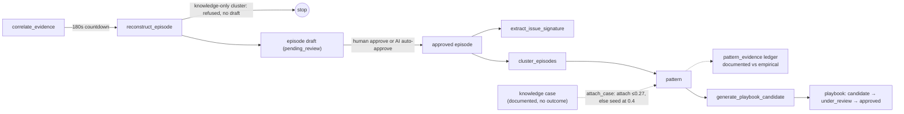

# Episodes, patterns, and playbooks

## Summary

You will see how **episodes** reconstruct what happened from correlated evidence, how approved episodes gain **issue signatures** that link recurring problems, how **patterns** cluster similar episodes, and how **playbooks** become governed, versioned procedures — with the exact Celery tasks and service functions that carry each stage, in order, and the gates that keep low-value work from reaching a reviewer.

Two things joined this layer on 2026-08-19/20 and are covered here too. First, an episode now needs an **observational source**: a cluster made only of documentation is refused before synthesis, and the documented material it carries gets its own object — a **knowledge case** — plus its own route into patterns through a **pattern evidence ledger** that records what each contributor is worth and on what footing. Second, the **operational situation** schema landed: four tables and seven graph relations describing what is happening *now*. That one is schema only — nothing populates it yet, and this page says where the line is.

## Business picture

Individual incidents become reusable organizational knowledge through a governed review process. An **episode** captures the full story of one incident — what users reported, what the team tried, what worked, and what the outcome was. When the same kind of problem happens again, an **issue signature** connects the new occurrence to the old one as a precedent, without ever merging the two incidents. When several episodes look alike, the system surfaces a **pattern**: a signal that the same type of problem keeps happening, which helps teams prioritize fixes and documentation. Once a pattern is well understood, the system drafts a **playbook candidate** — a proposed, versioned procedure that describes how to handle this class of issue, grounded both in what engineers actually did (episodes) and in what the approved documentation says (knowledge articles). Playbooks go through a formal review cycle (candidate → under review → approved) so that only vetted procedures reach the teams and automation that rely on them.

One distinction runs underneath all of it: **an episode is a claim that something happened.** A KB article is not that. It says what a document claims works, which is genuinely valuable — often it is the only structured description of a failure mode nobody has hit yet — but narrating it as an episode turns "this article says X resolves it" into "an engineer did X and it worked", and everything downstream then reads it as an observation. So documentation gets its own object, the **knowledge case**, and patterns keep a ledger of which of their support is observed and which is merely documented. A pattern can now exist on documentation alone and *graduate* when real incidents arrive; the knowledge case never graduates, because a document does not become an experiment by being cited.

Newest of all is the **operational situation** — a bounded occurrence that is still unfolding, assembled from many signals. It is the answer to "is this incident on its own, or one symptom of something bigger", and it is not an episode: a situation can exist while nothing is resolved. Only the shape of it exists today.

At every stage, humans own the final word. The AI proposes drafts and can pre-annotate them; an optional AI first-pass reviewer can even approve the unambiguous subset — but only under deterministic floors, only when an operator has switched that mode on, and always in a way that stays permanently distinguishable from a human approval.

## Technical walkthrough



Solid arrows are code paths that run today. The two dashed ones are not: `attach_case` and the `pattern_evidence` ledger are written and tested but have **no automatic caller** — see section 6. Note also that the refusal at `reconstruct_episode` does not itself create a knowledge case; it only declines to create an episode.

### 1. Episodes: from correlated evidence to a draft story

Reconstruction is a Celery chain, not an API call. When `extraction.correlate_evidence` creates new correlation edges, it enqueues `extraction.reconstruct_episode` with a **180-second countdown** so a burst of related messages settles before anyone pays for narration (`reconstruct_episode_task.apply_async(..., countdown=RECONSTRUCT_DEBOUNCE_SECONDS)`, backend/src/contextedge/workers/correlation_tasks.py:48-52; the constant lives at backend/src/contextedge/workers/extraction_tasks.py:765). Both tasks run on the dedicated `correlation` queue so they never starve behind bulk normalization (backend/src/contextedge/workers/celery_app.py:256-257).

The task body, `_reconstruct` (backend/src/contextedge/workers/extraction_tasks.py:1052), runs a series of gates **in order** before any LLM spend:

1. **Cluster resolution.** `resolve_episode_cluster` (backend/src/contextedge/services/episode_cluster_service.py:108) materializes the connected component over case links and correlation edges, bounded by `MAX_CLUSTER_SIZE = 50`, `MAX_HOPS = 3`, and a 30-day time fence relative to the nearest seed (episode_cluster_service.py:47-49). Tenant, legal-hold, and pending-redaction filters are applied in SQL, so excluded evidence never enters the cluster at all. The output carries a `fingerprint` — a hash of the sorted member ids — used everywhere below.
2. **Minimum-cluster gate.** Clusters smaller than `MIN_AUTO_SYNTHESIS_CLUSTER = 3` are skipped — re-attempted only when a new correlation dispatch fires (extraction_tasks.py:775). Measured basis: 58% of one day's drafts were one-to-two-evidence fragments that dedup retired minutes later.
3. **Resolution gate** (optional; `episode_resolution_gate` defaults to `"off"`, backend/src/contextedge/config.py:175). When set to `cluster`, synthesis defers until some evidence in the cluster carries a resolution signal. The check is deterministic — it reads `evidence_items.case_state == 'resolved'` first (the source system's own verdict), then a precision-first regex over titles and body head/tail — and it fails open on errors. Manual reviewer triggers (`settle=False`) bypass it.
4. **Advisory lock, debounce re-check, draft idempotency.** A per-cluster Postgres advisory lock stops concurrent tasks from minting duplicate drafts (8 identical episodes in 46 seconds, measured live, before it existed); the debounce re-check defers if the newest member arrived inside the 180-second window (with a starvation guard: a never-quiet channel still gets its first synthesis within `MAX_SYNTHESIS_DELAY_SECONDS = 1800`, extraction_tasks.py:853); and an existing pending draft with the same `cluster_fingerprint` short-circuits.
5. **Observational-source gate** (new, 2026-08-19). `_cluster_has_observational_evidence` (extraction_tasks.py:1014, called at 1219) asks one question of the cluster: does anything in it record something that *happened*? It selects the distinct `evidence_type` values of the cluster's members and returns true as soon as one of them is outside `KNOWLEDGE_EVIDENCE_TYPES` — the frozen set `{kb_article, sop, documentation}` at backend/src/contextedge/services/evidence_typing.py:92. A cluster made only of those types returns `{"status": "skipped_knowledge_only_cluster"}` and never reaches the LLM. Two properties matter. It **fails open**: an empty id list, a query that raises, or rows whose type is not a string all return `True`, because wrongly allowing synthesis costs one reviewable draft while wrongly blocking it loses a real incident forever (the reasoning is written into the docstring at 1017-1024, the non-string filter at 1044). And its **placement** is deliberate — it sits at line 1219, after every cheaper exit above it (too small, unresolved, locked, unsettled, duplicate fingerprint) and immediately before the synthesis it protects, so only a cluster that was otherwise about to spend an LLM call pays for the query.
6. **Growth gate.** Re-synthesis requires the cluster to have grown by at least `MIN_RESYNTHESIS_GROWTH = 0.5` over the largest covered draft (extraction_tasks.py:793) — without this, ten trailing messages cost ten full ~12,700-token syntheses of which dedup retired nine. The measured incident behind it is recorded in the comment at extraction_tasks.py:1232-1248: one ticket accumulated 44 accounts of a single incident, because a fingerprint is derived from membership, so one more thread message yields a new fingerprint and the idempotency check at gate 4 misses.
7. **Source roles.** Each evidence item is labeled with a synthesis authority role — `ticket`, `working_discussion`, `external_communication`, `document`, `monitoring` — via `resolve_synthesis_role` (extraction_tasks.py:906), which the episode prompt uses for field-level authority (the ticket is authoritative for state and close code; the chat for what was actually tried).
8. **Supersede-on-growth.** Pending drafts whose evidence is a strict subset of this cluster are marked `reviewer_state = "superseded"` before the new synthesis lands.

**What gate 5 does not do.** It gates *synthesis*, not participation. Knowledge evidence is still normalized, still chunked by the heading-aware document chunker, still embedded, still correlated, still visible to hybrid search, still hydrated into the graph, and still retrieved for playbook generation (`retrieve_knowledge_for_pattern`, section 5). Applicability is still extracted for it on the ingest path — `_extract_applicability` runs on exactly the same three evidence types (extraction_tasks.py:704, 723) and prefers what the source *states* over what a model infers, which skips a ~7,200-token call whenever the connector supplied facets (extraction_tasks.py:726-738). What changes is only this: the cluster no longer becomes a narrative that asserts an engineer did something. The structured content of an all-knowledge cluster belongs in a knowledge case instead (section 6).

The LLM call itself is `reconstruct_episode` (backend/src/contextedge/ai/extractors/episode_extractor.py:167): at most `MAX_ITEMS_PER_CALL = 20` items per call, each body budgeted to `PER_ITEM_CHAR_LIMIT = 2000` chars by salience-aware truncation (episode_extractor.py:44, 48). Items are labeled `[ev-N]`, the whole block is fenced as untrusted content, and the current default prompt is **episode v3** (source-authority rules plus structured contradictions). After the call, label translation drops any evidence reference the model invented, a schema gate (`validate_episode`) drops broken episodes and coerces unknown vocabulary, and a generation-provenance stamp is applied by the caller — the model can never supply its own provenance. Clusters larger than 20 items split into sequential chunks with **no cross-chunk merge pass** — see the caveat below.

Persistence is `create_episodes_from_evidence` (backend/src/contextedge/services/episode_service.py:114). It writes the `episodes` row (`status="draft"`, `reviewer_state="pending_review"`, `evidence_ids`, `cluster_fingerprint`, `entity_refs`, `contradictions`, embedding, `generation_provenance` — model columns at backend/src/contextedge/models/episode.py:244-261), one `episode_evidence_links` row per grounding item, and ordered `episode_steps`. An LLM failure logs and returns `[]` — reconstruction never crashes the task; Celery retries up to 3 times (extraction_tasks.py:1494-1499). Each new episode also resolves a **`primary_case_ref`** — the quotable ticket number — by following the episode's own cited evidence to its canonical cases and taking the identifier correlation already marked authoritative (`_resolve_primary_case_ref`, episode_service.py:18). It returns `None` rather than a guess when no linked case exists (normal for `local_file` ingests, where a filename is not a verified identifier).

> **Known gap (open P1):** clusters above 20 evidence items produce episodes whose per-chunk steps are concatenated and all numbered from #1 — 949 episodes carried stacked timelines when this was measured. Treat that count and the 836 below as **pre-migration-0073 figures**: 0073 deleted several hundred knowledge-derived episodes afterwards and neither number has been re-measured since. As interim damage control, 836 affected pending drafts were stamped `hold / timeline_corrupted_pending_repair` in `ai_review` — the sweep then skips them, because its selection filter is `ai_review IS NULL`. That stamp is data, written once by an operational script; no code path produces it, so do not look for it in the review modes (which are exactly `off` / `advisory` / `auto_approve`). See [KNOWN_GAPS.md](./KNOWN_GAPS.md), "multi-chunk synthesis stacks steps". Also: a stable two-evidence cluster that never grows is terminally skipped by the min-cluster gate, not deferred — nothing re-dispatches it.

> **Caveat on the observational gate (opened 2026-08-19):** the refusal is only as wide as `KNOWLEDGE_EVIDENCE_TYPES`, and that set holds **three** types — `kb_article`, `sop`, `documentation` (evidence_typing.py:92). `runbook` and `postmortem` are accepted at upload (`UPLOADABLE_EVIDENCE_TYPES`, evidence_typing.py:104-115) but are *not* in the knowledge set, so a cluster made only of runbooks still synthesizes an episode today. Migration 0073 disagrees with the constant on exactly this point — its source-resolution query matches `('kb_article', 'sop', 'runbook', 'documentation')` (backend/alembic/versions/0073_migrate_knowledge_episodes_to_cases.py:136) — so the cleanup was slightly wider than the gate that replaced it. Nothing has ingested a runbook on this deployment (the only connector is Zoho Desk, whose knowledge arrives as `kb_article`), which is why this has not bitten; adding `runbook` to the frozen set is the fix, and the two lists should be reconciled in one change so they cannot drift again.

### 2. Review: humans first, an AI first-pass when enabled

**Human path.** `POST /api/v1/episodes/{id}/approve` (role `knowledge_manager`) and `POST /api/v1/episodes/bulk-approve` set `status`/`reviewer_state` to `approved`, **commit first**, then dispatch `evaluation.extract_issue_signature` per episode and one `pattern.cluster_episodes` per affected domain (backend/src/contextedge/api/v1/episodes.py:230, 282; dispatches at 266, 275, 324, 335). Commit-before-dispatch is deliberate: a message consumed before the commit would read pending state and no-op without retry. The episode detail response exposes `ai_review` verbatim to the review UI (episodes.py:145).

**AI first-pass** (`EPISODE_AI_REVIEW`, default `off`; values `off` / `advisory` / `auto_approve`, backend/src/contextedge/config.py:185-187). An hourly sweep, `evaluation.ai_review_episodes` (backend/src/contextedge/workers/evaluation_tasks.py:131; beat entry at celery_app.py:379-383), selects pending drafts with `ai_review IS NULL` in the same priority order the human queue uses, and calls `ai_review_episode` (backend/src/contextedge/services/episode_review_service.py:174) per draft. That service renders the draft's steps and contradictions, picks citation-driven evidence excerpts, asks the `episode_review` prompt for an `approve`/`hold` verdict, then **re-reads the row `FOR UPDATE`** so any concurrent human decision or dedup supersede wins, and stamps the verdict on `episodes.ai_review`. In `auto_approve` mode a draft is approved only when the model verdict AND deterministic floors all pass: `MIN_EVIDENCE = 2`, `MIN_OUTCOME_CHARS = 20`, verdict exactly `approve`, `MIN_VERDICT_CONFIDENCE = 0.8` (episode_review_service.py:42-44). Auto-approvals keep `reviewer_user_id` NULL, so they stay permanently distinguishable from human approvals. The sweep commits **per episode, before any dispatch**, defers per tenant while bulk ingest is active, and can be run on demand via `POST /api/v1/episodes/ai-review` — where the dispatch argument can only downgrade the configured mode, never escalate it (episodes.py:556-592). Auto-approve was blocked until 2026-08-19; both blocking findings (dispatch-before-commit, write ordering) are fixed ([KNOWN_GAPS.md](./KNOWN_GAPS.md)). The sweep's mechanics are covered in depth in [13-evaluation-drift-and-feedback.md](./13-evaluation-drift-and-feedback.md).

**Dedup on a clock.** `pattern.deduplicate_knowledge` runs hourly from beat (celery_app.py:367-371; task at backend/src/contextedge/workers/pattern_tasks.py:834-836) and calls the shared entry point `deduplicate_patterns_and_playbooks` (backend/src/contextedge/services/pattern_service.py:336). Its passes, in order: duplicate evidence items (pattern_service.py:254); same-title episodes split into **evidence-overlap components** before merging (episode_service.py:336) — title alone never merges, because different incidents share labels; strict-containment supersession (episode_service.py:515); embedding-similarity supersession at cosine ≥ `SIMILAR_EPISODE_MIN_COSINE = 0.85` (episode_service.py:626) that additionally **requires shared evidence** (the refusal is at episode_service.py:645-656) — disjoint-evidence twins are the recurrence case and must never merge; then patterns and playbooks. Merges supersede, never hard-delete. The beat path defers per tenant while ingest is active (`tenant_pipeline_active`, pattern_tasks.py:748; thresholds: 50 evidence rows or 30 episodes in 10 minutes, pattern_tasks.py:736-745).

### 3. Issue signatures and recurrence

Approval triggers one more distillation. `evaluation.extract_issue_signature` (backend/src/contextedge/workers/signature_tasks.py:24-26, queue `evaluation`, retry ×2) calls `extract_issue_signature` (backend/src/contextedge/services/issue_signature_service.py:89): one LLM call turns the approved episode into a generalized problem fingerprint — `affected_capability`, `failing_component`, `failure_mode` — validated by a Pydantic gate that is strict about structure and lenient about vocabulary. The normalized key (`signature_key_for`, issue_signature_service.py:76) is `capability|component|failure_mode`; trigger, environment, and scope are descriptive, not identity, so the same failure triggered differently still recurs under one key. Rows land in `issue_signatures` (unique key per tenant, `episode_count` incremented on recurrence) and `episode_issue_signatures`, plus a fail-soft `has_signature` graph edge.

When the signature already existed, `_link_recurrence` (issue_signature_service.py:249) adds a **`recurrence` case membership** at `RECURRENCE_CONFIDENCE = 0.6` (issue_signature_service.py:36) from the new episode's seed evidence to the previous occurrence's case — a precedent pointer, never a merge. The episode cluster resolver explicitly refuses to expand through `recurrence` memberships, so past and present occurrences keep separate stories. If a dispatch is lost to a crash or broker outage, the hourly AI-review sweep re-dispatches signatures for up to 20 auto-approved episodes that have none (evaluation_tasks.py:205-239).

> **Caveats:** `IssueSignature.error_signature_id` has no writer, so LLM issue signatures and the deterministic regex `error_signatures` remain parallel, unjoined systems; and the downstream consumers of recurrence (B4 applicability, B5 cohorts) are dormant because nothing populates `fix_patterns` ([KNOWN_GAPS.md](./KNOWN_GAPS.md)).

### 4. Patterns: clustering approved episodes

`pattern.cluster_episodes` (backend/src/contextedge/workers/pattern_tasks.py:422-424 (`name=` line 422), queue `pattern`, retry ×2 @ 120 s) has **no beat schedule entry** — it is event-driven: dispatched per domain from the human approve/bulk-approve endpoints (episodes.py:275, 335), per domain from the AI review sweep after auto-approvals (evaluation_tasks.py:340-347), and manually via `POST /api/v1/patterns/cluster`. Domain scoping is strict: a domain pass sees only that domain's episodes, the global pass only NULL-domain ones — so one domain's episode text can never surface inside another domain's knowledge.

Per run (`_cluster`): repair missing episode embeddings; select up to 100 approved, embedded, not-yet-linked episodes; then for each candidate:

1. **Existing-pattern probe** — the same-scope pattern owning the single **nearest** member episode, provided that member sits within `PATTERN_MATCH_MAX_DISTANCE = 0.30` cosine distance (pattern_tasks.py:50, query at 243-257), is tested by `validate_pattern_match` (backend/src/contextedge/ai/extractors/pattern_extractor.py:56), an LLM adjudication on the `verification` task lane. A confirmed match joins via `add_episode_to_pattern`. **This check fails open**: on a provider outage it returns `is_match=True` at 0.75, so the embedding probe alone decides membership during outages.

   Both the threshold and the `ORDER BY member_distance.asc()` changed on 2026-08-19 and the pairing matters. The gate used to be 0.35 with an unordered `LIMIT 1` — and 0.35 is roughly the 10th percentile of the distance between two *random* episodes on this corpus (pairwise spread: min 0.157, p01 0.257, median 0.409, max 0.524; everything is an AutomationEdge support incident, so the embeddings bunch). Every unlinked episode therefore had *some* qualifying member, and an unordered `LIMIT 1` handed the validator a near-random pattern, which it correctly rejected: 8 of 65 episodes joined and the other 88% went off to mint singletons. Asking about the **nearest** pattern instead took the validator's accept rate from **12% to 40%** on the same corpus. Any doc still quoting `< 0.35` here is stale.
2. **New-cluster formation** — otherwise, gather same-scope unassigned episodes within `CLUSTER_GROUP_MAX_DISTANCE = 0.27` cosine distance (pattern_tasks.py:60, query at 299-312); an empty neighborhood forms a single-episode cluster. This was raised from 0.20 on 2026-08-19: 0.20 sat *below* the random-pair p01, so 126 of 150 probed episodes could group with nothing and became single-episode "patterns". Measured singletons / mean cluster size over the same 150: 0.20 -> 126 / 2.3, 0.25 -> 83 / 3.3, 0.27 -> 50 / 3.8, 0.30 -> 20 / 6.3, 0.40 -> 0 / 66.2, where 0.40 is the corpus collapsing into one blob. 0.27 is the knee.
3. **Synthesis** — `synthesize_pattern` (pattern_extractor.py:18; prompt `pattern` v2, task `pattern`, model gemini-2.5-flash — deliberately unpromoted to 3.7 pending its own measure-first A/B). There is no Pydantic gate on this output; a title containing "no incident"/"no pattern" skips persistence, and any exception falls back to a bare `Auto: <title>` pattern at confidence 0.75 with NULL provenance.
4. **Persistence** — `create_pattern_from_episodes` (backend/src/contextedge/services/pattern_service.py:62): a domain-safety assertion (cross-domain or cross-tenant membership raises), a preventive same-domain title dedup that absorbs instead of duplicating, the `patterns` row with JSONB synthesis fields and `generation_provenance`, `pattern_evidence_links` membership, concept-node enrichment edges, per-episode graph edges, `promote_pattern_memory` (backend/src/contextedge/services/memory_service.py:291), and finally an automatic `generate_playbook_candidate` dispatched **after commit** (`dispatch_after_commit`, pattern_service.py:192; also re-enqueued on membership growth at 247). Post-commit is the fix for two live failures: a rolled-back clustering pass had left 65 tasks naming patterns that never existed, and on the success path a worker reading too early returned `pattern_not_found` and skipped, so a real pattern silently never got its playbook (the reasoning is in the comment at pattern_service.py:180-191).

Two tables now describe a pattern's support and they answer different questions. `pattern_evidence_links` records **that** an episode belongs to the pattern — this is what clustering writes and what playbook generation reads for provenance. `pattern_evidence` (new, migration 0072) records **what a contributor is worth and on what footing**, and clustering does not write it yet; see section 6.

> **Known gap:** a full 100-episode pass runs as **one long DB transaction** — 25 minutes observed, ~156 LLM calls, nothing visible or committed until the end; a late failure rolls back every row while the spend stays spent ([KNOWN_GAPS.md](./KNOWN_GAPS.md), 2026-08-17 items). Note also that the older KNOWN_GAPS line "patterns never form without an operator" is half-stale: there is still no beat entry, but approval-time auto-dispatch exists at the sites above.

### 5. Playbooks: generation, then governance

**Generation** (`pattern.generate_playbook_candidate`, pattern_tasks.py:446-448 (`name=` line 446), queue `pattern`, dispatched post-commit via `services/deferred_dispatch.dispatch_after_commit` from `pattern_service.py:192, 247`) runs deterministic gates before, around, and after one long LLM call:

- **Before**: skip if a playbook already exists for the pattern (by id or title); skip below the confidence floor `PLAYBOOK_GENERATION_MIN_PATTERN_CONFIDENCE = 0.5` (constant at pattern_tasks.py:34, gate at 486-499; the calibration is written into the comment above it at 471-485 — reviewing 37 generated playbooks showed the corpus splitting cleanly, with everything below ~0.5 structured-but-hollow); skip with no episode links (pattern_tasks.py:501-507). Those last two are what keep documented-only patterns out of the playbook queue: a pattern seeded from a knowledge case carries confidence 0.4 *and* zero `pattern_evidence_links`, so it fails both. Evidence provenance is resolved through `episode_evidence_links`, **not** `PatternEvidenceLink.evidence_id`, which nothing populates (pattern_tasks.py:508-519).
- **Knowledge retrieval**: `retrieve_knowledge_for_pattern` (backend/src/contextedge/services/knowledge_retrieval_service.py:226) embeds the pattern's own vocabulary, keeps only knowledge evidence types, withholds source-retired articles, and re-ranks (never filters) by empirical support, applicability, and supersession (×1.6 demotion) before truncating to `MAX_KNOWLEDGE_DOCS = 5` with top sections attached (knowledge_retrieval_service.py:54-57). Confident, applicability-clean matches are persisted as `pattern -supported_by-> evidence` edges when similarity ≥ `KNOWLEDGE_LINK_MIN_SIMILARITY = 0.75` (`persist_knowledge_links`, knowledge_retrieval_service.py:526, constant at 61) — the measured band where genuine pairs (0.75-0.84) separate from vocabulary noise (0.62-0.69). Any retrieval failure returns `[]` and generation proceeds knowledge-less.
- **The call**: `generate_playbook_candidate` in the generator (backend/src/contextedge/ai/generators/playbook_generator.py:17) uses prompt **`playbook` v6** (the default since 2026-08-19; registration at backend/src/contextedge/ai/prompts/playbook.py:415-423) on `task="playbook"` → `vertex_ai/gemini-3.7-flash`, chosen by the 2026-08-17 model A/B (grounded share 0.70 → 0.81, latency 25.5 s → 14.5 s). v6 adds three rules on top of v5 — sequence by causality, emit the minimal complete set of steps, write plain friendly language — and won its own A/B against v5 on 6 patterns: steps 6.3 → 5.5 at 62 → 61 surviving citations, grounded share 0.79 → 0.94, judge language grade 4.67 → 5.0, rollback notes 6/6 on both (playbook.py:362-382; harness `backend/src/contextedge/evals/playbook_prompt_ab.py`, snapshot `evals/datasets/playbook_prompt_ab_2026-08-19.json`). v5 stays registered and immutable at playbook.py:350-359. One half of v6 did **not** hold up: its sequencing rule did not improve branch validity, so no prompt version gets credit for that — the code does it (next bullet).
- **After**, in order on a dict result (playbook_generator.py:90-96): `validate_source_refs` (playbook_generator.py:331) drops any `kb-N`/`ep-N` citation the model minted; `classify_step_grounding` (playbook_generator.py:256) then forces every step without surviving citations to `grounding_status="non_grounded"` / `step_classification="best_practice"` no matter what the model claimed — structural, so an evidenced step cannot be mislabeled and a hollow one cannot pose as sourced; `sanitize_branching_logic` (playbook_generator.py:154) then drops `decision_points` that cannot execute — an anchor or jump target naming a step that does not exist, a branch back onto its own anchor, or a "decision" whose true and false paths land on the same step. It repairs rather than rejects, because the steps of such a playbook are usually fine and only the branching appendix is junk; the counts land in `result["branching_validation"]`. The provenance stamp is applied last. Back in the worker: a steps-less result is refused (`no_steps_generated` — the documented incident is a truncated response whose complete-looking prefix survived JSON repair), and the model's suggested risk tier may only **raise** risk above the deterministic floor derived from the steps' own safety classes — never lower it, with unknown safety classes flooring at `high` and an ungraded suggestion falling back to at least `medium` (`_effective_risk_tier`, pattern_tasks.py:73-91).
- **Persistence**: a `Playbook` row (`lifecycle_state="candidate"`, `automation_mode="suggest_only"`) plus `create_playbook_version` (backend/src/contextedge/services/playbook_service.py:360), which validates step tool bindings, allocates a unique semantic version with retry, materializes `playbook_evidence_links`, and repoints `current_version_id`. `embed_playbook` writes a best-effort semantic fingerprint capped at `MAX_EMBED_CHARS = 4000` (backend/src/contextedge/services/playbook_embedding.py:79, constant at 25); failure leaves the playbook reachable by full-text search.

The manual route `POST /api/v1/playbooks/generate` (backend/src/contextedge/api/v1/playbooks.py:654) exists for patterns below the floor and for humans who disagree with it — but it is a leaner path: no knowledge retrieval, no confidence or risk floor, no empty-steps guard, no playbook embedding, and its episode summaries omit ids so every `ep-N` citation the model writes is dropped. Prefer the worker path's output when both exist.

**Governance** is a state machine. `VALID_TRANSITIONS` (playbook_service.py:22-30): `candidate → under_review → approved`, with `under_review` able to fall back to `candidate`; `approved` able to move to `under_review`, `restricted`, `deprecated`, `expired`, or `retired`; `restricted` back to `approved` or on to `deprecated`/`retired`; `expired` to `under_review` or `retired`; `deprecated` only to `retired`; and `retired` terminal. `transition_playbook` (playbook_service.py:217) refuses to send a **zero-step version** to review or approval (251-259); on approval it stamps `approver_user_id` and `last_validated_at` (the freshness clock the drift scanner reads), sets `published_at`/`published_by` on the current version if unset (263-272), records a `PlaybookApproval` row and a `playbook.transitioned` operational event, runs `promote_playbook_memory` (memory_service.py:333), and repairs a missing embedding so the just-approved playbook is immediately semantically matchable (307-316). Runtime retrieval ranks **approved playbooks only** (`rank_playbooks` filters `lifecycle_state == "approved"`, backend/src/contextedge/search/hybrid_ranker.py:238-241), so every other state is invisible to agents by construction. The candidate review queue is the one listing that does not sort by recency: with `lifecycle_state=candidate` it orders by the current version's `playbook_confidence` descending and only then by `updated_at`, so the best-sourced candidates sit at the top instead of whatever generated last (api/v1/playbooks.py:157-168).

Per-step metadata on `PlaybookVersion.steps` is validated on write through the `PlaybookStep` schema (`schemas/playbook.py`) — `reversible`, `time_estimate_sec`, `verification`, `rollback_hint`, `safety_class`, `tool_ref` — all optional with defaults, `extra="allow"`. `verification_policy` (JSONB) declares post-action recheck behavior, consumed since 2026-08-01 by the `evaluation.verify_executions` beat sweep (see [KNOWN_GAPS.md](./KNOWN_GAPS.md) for the verification model's F9 upgrade).

One projection gotcha, fixed but worth knowing: seeded playbooks store steps as `{"order", "instruction"}` while generated ones use `{"text", ...}`. The graph hydrator and the embedding text both read `title`/`text`/`action`/`instruction` — before `instruction` was added to that chain, every *approved* playbook (the only kind an agent may see) projected an empty step list and embedded on its title alone.

### 6. Knowledge cases and the pattern evidence ledger

Gate 5 refuses to narrate a document as an incident. This is where the document's content goes instead.

**The shape** (migration 0072, `backend/src/contextedge/models/knowledge_case.py`). `knowledge_cases` carries the same reconstructed semantics an episode does — title, `symptom_summary`, entities, applicability, embedding, extraction confidence — plus provenance about *who said it*: `source_evidence_id`, `source_kind`, `source_authority` (internal_kb / vendor / community / unknown), and the source's own lifecycle in `source_state` (knowledge_case.py:64-107). A unique index on `(tenant_id, source_evidence_id)` means one case per source document: an article reconstructed twice is a duplicate, not a second opinion (knowledge_case.py:127-136). `knowledge_case_steps` mirrors `EpisodeStep` and deliberately drops `failed_flag`, `successful_flag` and `result_state`, keeping `expected_outcome` in their place — a document describes an action to take, not one that was taken (knowledge_case.py:139-168).

What the table does **not** have is the point of it: no outcome, no reopen count, no duration, no `occurred_at`, no empirical confidence. The cause column is named `documented_cause`, not `root_cause`, because the source asserts it and nobody confirmed it here (knowledge_case.py:92-94).

**Why a separate table and not `episodes.kind = 'knowledge'`.** With a discriminator column, every query that counts, clusters, scores, reviews or cites episodes is correct only for as long as everyone remembers to write `AND kind = 'observed'` — and one forgotten predicate silently reintroduces exactly the contamination the split exists to prevent. A separate table turns that failure into a missing join, which is loud, instead of a wrong number, which is quiet (knowledge_case.py:10-17; the same argument in migration 0072's docstring at lines 15-20).

**The ledger** (`pattern_evidence`, `backend/src/contextedge/models/pattern.py:87`). A bare `episode_count` cannot tell a pattern backed by three KB articles from one backed by nineteen resolved incidents. This table records, per contributor: `support_role` (`supports_resolution`, `contradicts_resolution`, …), `evidence_class` (`empirical` | `documented` | `prescriptive` | `conversational` | `inferred`), `strength`, `confidence`, `observed_at`, and `outcome`. It is polymorphic by `(evidence_object_type, evidence_object_id)` rather than one nullable FK per kind, because the set of contributors is expected to grow (pattern.py:112-134).

The invariant sits in the database, not in a service:

```sql
CHECK ((evidence_class = 'empirical' AND evidence_object_type = 'episode')
    OR (evidence_class <> 'empirical' AND outcome IS NULL))
```

— `ck_pattern_evidence_empirical_is_episode` (pattern.py:177-181, migration 0072 at lines 222-226). Only an episode may be empirical, and only an empirical row may carry an outcome, so no later code path can turn a documented claim into an observed success by setting a field.

**Attach-or-seed** (`backend/src/contextedge/services/knowledge_case_service.py`, 2026-08-20). Cases do not cluster with each other — 600 articles behaving like 600 incidents is the failure the whole split exists to avoid — so a case seeks the *pattern it documents*:

1. `_nearest_pattern` (knowledge_case_service.py:58) measures the case's embedding against pattern **member episodes** (patterns carry no embedding of their own), groups by pattern, and takes the minimum — `ORDER BY distance ASC ... LIMIT 1`, which is precisely the ordering clustering was missing before 2026-08-19.
2. If that distance is within `KNOWLEDGE_ATTACH_MAX_DISTANCE = 0.27` (knowledge_case_service.py:49), the same LLM adjudicator clustering uses (`validate_pattern_match`) is asked whether the document actually describes this pattern's problem. Distance can only say "same subject". The threshold is deliberately **tighter than clustering's own 0.30 prefilter** — a wrong attachment is worse than a missed one, because it files a document behind a procedure it does not describe and the playbook generator will cite it (the relationship is asserted by a test: `backend/tests/test_knowledge_case_attachment.py:20-26`). An adjudicator *error* falls back to the distance verdict and attaches; an adjudicator *rejection* falls through to step 3.
3. Otherwise the case **seeds** a new pattern at `DOCUMENTED_ONLY_PATTERN_CONFIDENCE = 0.4` with `episode_count = 0` and provenance `{"support": "documented_only"}` (knowledge_case_service.py:55, 217-234). 0.4 is below the 0.5 playbook floor on purpose, so a documented-only pattern generates no playbook until an incident confirms it — and because `attach_case` builds the `Pattern` row directly rather than going through `create_pattern_from_episodes`, no generation task is dispatched at all. Two independent guards, by construction.

Either branch ends in one `PatternEvidence` row written by `_record` (knowledge_case_service.py:116), always `evidence_class="documented"` with `observed_at=None` and `outcome=None` — belt and braces over the CHECK constraint. Attachment records `confidence = 1.0 - distance`; a seed records 0.6.

`pattern_support` (knowledge_case_service.py:246) reads the ledger back, grouped by class, role and outcome, and derives the state a reviewer actually needs: `empirically_supported` if any empirical row exists, else `documented_only` if anything documented or prescriptive does, else `unsupported`. It also returns the `contradicts` count, which is what would make stale-KB detection possible — a documented resolution accumulating `contradicts_resolution` rows from recent episodes while the article stays approved upstream.

**The cleanup** (migration 0073). The knowledge-derived episodes it targets had already been taken out of circulation by a one-off remediation that stamped them `reviewer_state='invalidated'` with `generation_provenance->>'invalid_reason' = 'source_not_observational'` — that stamp is data, not a code path; nothing in the repo writes it, and the gate above is what prevents new ones. 0073 migrates whatever carries that stamp: it copies the rows verbatim into `episodes_knowledge_migrated_backup` / `episode_steps_knowledge_migrated_backup` first, resolves each episode to its earliest knowledge-typed source document, and collapses duplicate reconstructions of the same article by keeping the richest — **most steps, then highest extraction confidence, then newest** (0073:116-143). Two fields are re-labelled rather than copied, and both re-labellings are recorded in provenance so the substitution is auditable: `episodes.final_outcome` becomes `documented_resolution` (`"documented_resolution_from": "episodes.final_outcome"`, 0073:172) and `episode_steps.observation` becomes `expected_outcome` (0073:199). Multi-source syntheses are migrated against their first article with the full source list kept under `synthesised_from_evidence_ids` and a `needs_review` flag (0073:173-174). Originals are then deleted — including the runners-up, whose content survives in the tombstone — but an episode that resolves to **no** knowledge source at all is deliberately left alone and stays `invalidated`: migrate-then-delete must never become delete-without-migrate (0073:216-220). The migration prints its own counts rather than leaving them to be discovered later (0073:247-252).

**A note on the numbers.** Two sets are in circulation and they are not the same measurement. The migration's own docstring, written against the corpus at the time, records **299** affected episodes of which 296 resolved to just **116** distinct articles (0073:3, 108-115). The run reported on this deployment covered **482** episodes and produced **135** knowledge cases, of which the attach-or-seed pass placed **75 as new documented-only patterns and 60 as attachments** to existing ones, alongside **1,416** empirical ledger rows backfilled from the episode links that already existed. The gap between 299 and 482 is the corpus growing between the migration being written and being run; neither figure is in the code, so treat the second set as an operator-reported outcome rather than something this page can cite a line for. What *is* citable is the collapse ratio's cause: the same article had been reconstructed many times over, which is the duplicate-synthesis problem the growth gate exists for showing up again (0073:108-115).

> **Caveats (all opened by these commits, 2026-08-19/20):**
> - **Nothing calls `attach_case` or `pattern_support` automatically.** The only code that imports `knowledge_case_service` is its own test, `backend/tests/test_knowledge_case_attachment.py`. No ingest hook, no Celery task, no API route. The 135/75/60 figures above came from a one-off backfill run, and the next KB article ingested produces no knowledge case at all until a caller exists — the gate refuses the episode and nothing takes its place.
> - **Nothing writes empirical ledger rows either.** `create_pattern_from_episodes` and `add_episode_to_pattern` write `pattern_evidence_links` only — a search for `PatternEvidence` across `backend/src/contextedge` finds writes in `knowledge_case_service._record` and nowhere else. So the empirical half of the ledger is frozen at whatever the backfill inserted, and a pattern that gains episodes tomorrow will not gain empirical rows. Until a writer exists, `pattern_support` reports a snapshot, not the present.
> - **Nothing reads it, either.** `pattern_support` has no HTTP route and no UI, so `documented_only` is not visible to a reviewer yet, and `contradicts_resolution` is never written by anything — the knowledge-drift detection the ledger was designed for is a capability of the schema, not a running behaviour.
> - **About 55% of the knowledge cases seeded a pattern with no empirical support.** 75 of the 135 cases found no pattern within 0.27 and seeded their own, so a majority of the patterns this backfill produced exist on documentation alone. They are invisible to playbook generation (confidence 0.4, and no `pattern_evidence_links` at all) but they *are* rows in `patterns`, so any count of "patterns" now mixes observed and merely-documented ones unless it joins the ledger.
> - **Some episodes remain `invalidated` with no knowledge source to migrate to.** 0073 refuses to delete an episode it did not represent (0073:216-220), so these stay live in `episodes` — out of review, clustering and the agent, but still counted by anything that counts episodes. The migration counts them at run time and prints the number rather than hardcoding it (0073:244-252); the docstring's own arithmetic (296 of 299 resolved to a source) implies **3**, but that pairing is from the corpus the migration was written against, not the one it ran on. Their rows were copied into `episodes_knowledge_migrated_backup` along with the rest before deletion ran, so the backup table is a superset of what was actually removed.
> - **28 Zoho articles have no body.** The Zoho Desk API never returned one for them (bodies exist only on the per-record detail call — see [KNOWN_GAPS.md](./KNOWN_GAPS.md), Zoho connector), so those articles cannot be reconstructed into a knowledge case at all. Operator-reported count; nothing in the repo records it, and the absence is silent rather than visible as an empty case.

### 7. Operational situations — schema only

Migration 0074 (2026-08-20) adds four tables and `backend/src/contextedge/models/situation.py`. **No correlation logic runs.** The migration says so itself ("Schema only. No inference runs yet: the correlation that populates these is the next phase", 0074:41-43), and nothing in `backend/src/contextedge` writes a row to any of the four tables or emits any of the seven relations — a search for `OperationalSituation`, `SituationEvidenceMembership` and the relation names finds only the model module, the `models/__init__` re-export, and the two registries. With no writer, the tables are empty on this deployment. Everything below describes a shape, not a behaviour.

A **situation** is a bounded real-world occurrence that is still unfolding — "what is happening now", where an episode is "what happened, and what worked" and a knowledge case is "what a source says works" (situation.py:9-11). It is deliberately not a renamed `CorrelationEdge`: an edge says two evidence items look related, a situation says many signals describe **one** occurrence, which is a stronger claim (situation.py:18-21). It is also not an episode: a situation may exist while nothing is resolved, and must not become an episode merely by existing (situation.py:13-16).

- `operational_situations` — type, state (`emerging` → `active` → `stabilizing` → `resolved`, plus `reopened` / `merged` / `invalidated`), `situation_confidence`, and a timeline that separates `onset_at` (when it began in the world) from `detected_at` (when we first saw it), so late-arriving evidence can move onset backwards without corrupting causality (situation.py:150-159).
- `situation_evidence_memberships` — why one evidence item is considered part of it, carrying the **decomposed** `score_breakdown` rather than a total, plus `source_lineage_group` so an alert, the ticket it opened and the mail it sent count as one observation rather than three. Rejected memberships are kept, never deleted: the machine score beside the human verdict is the only record of what the model got wrong (situation.py:256-282).
- `situation_entity_impacts` — what appears affected **and what appears fine**. `healthy_control` is a first-class impact role (situation.py:95) because a healthy component narrows a diagnosis as much as a broken one, and every impact carries `signal_observed_at`, since "database healthy" is useful at two minutes old and dangerous at eight hours (situation.py:346-352).
- `situation_change_candidates` — a change that might explain it, with a lifecycle from `weak_candidate` to `confirmed`. `correlation_score` is documented as a **ranking, never a probability** (situation.py:404-409), and `confirmed` is reachable only from governed evidence recorded in `confirmation_basis` — an ITSM caused-by relation, an approved RCA, a human decision — never a score and never an agent's opinion (situation.py:420-424).

Two invariants are enforced by the database rather than by a service:

- `ck_change_after_onset_not_causal` — `NOT (temporal_relation = 'after_onset' AND status IN ('suspected','corroborated','confirmed'))` (situation.py:455-459). A change made after onset cannot have caused it. It can still be recorded, as `remediation` or `rollback`.
- `ck_situation_merged_has_target` — a `merged` situation must name what it merged into, and an unmerged one must not pretend to (situation.py:218-222). Merged rows are never deleted; they are how "why did these two become one" stays answerable.

`fingerprint` is a lookup and duplicate-suppression key and is **deliberately not unique** — the same service can fail twice in one window for unrelated reasons (situation.py:187-191).

Seven relations are registered in `_SITUATION` (backend/src/contextedge/graph/edge_types.py:141-151). Registration is a vocabulary declaration, not traffic: nothing writes an edge of any of the seven, so the projection currently traverses none of them. Four are *allowed* to be traversed by the `maf.v1` projection once they exist — `situation_affects`, `suspected_change`, `confirmed_change`, `similar_situation` (graph/agent/profiles.py:100-103) — because they are what an agent would need to reason about a live occurrence. Three are excluded with recorded reasons, which the edge-registry test requires: `part_of_situation` (an incident storm is hundreds of hub memberships; the agent reads the situation summary instead), `merged_into` (audit lineage, not reasoning) and `recurred_from` (precedent belongs to the historical half of diagnostic context, not beside current signals) — edge_types.py:201-216.

> **Caveats:** the correlation that would populate these tables is the next phase and does not exist. Worse, most of its intended inputs do not exist on this deployment either: the only connector is Zoho Desk, the evidence types present are `thread_message`, `ticket` and `kb_article`, and there are **zero change records, zero monitoring alerts, zero CI or service entities** (all 849 entities are `topic` or `knowledge_category`) and **zero topology edges** ([INCIDENT_DIAGNOSIS_ROADMAP.md](./INCIDENT_DIAGNOSIS_ROADMAP.md), H3-H6). So `situation_change_candidates` has nothing to rank, `situation_entity_impacts` has no CIs to mark healthy or affected, and topology distance has no edges to measure along. Read this section as a contract landed early so it could be reviewed against a real schema — not as a feature.

## Example: Acme VPN data at this stage

**Stage 1 — Episode (created from AI extraction, pending review)**

```json
{
  "episode_id": "ep-x1y2z3",
  "tenant_id": "acme-corp",
  "domain_id": "vpn-connectivity",
  "title": "Corporate VPN authentication failure - expired gateway certificate",
  "primary_case_ref": "INC0010427",
  "status": "draft",
  "reviewer_state": "pending_review",
  "extraction_confidence": 0.87,
  "cluster_fingerprint": "9f2c...e81a",
  "root_cause_summary": "TLS certificate on vpn-gw-east-01 expired; auth chain validation failed",
  "final_outcome": "Certificate renewed via internal CA; RADIUS restarted; VPN restored",
  "evidence_ids": ["ev-a1b2c3", "ev-d4e5f6", "ev-g7h8i9"],
  "steps": [
    { "step_order": 1, "step_type": "complaint", "text": "Users report VPN drops", "evidence_refs": ["ev-a1b2c3"] },
    { "step_order": 2, "step_type": "diagnostic", "text": "Gateway logs show AUTH_CERT_EXPIRED", "evidence_refs": ["ev-d4e5f6"] },
    { "step_order": 3, "step_type": "failed_step", "text": "Restarted VPN service - no improvement", "failed_flag": true, "evidence_refs": ["ev-d4e5f6"] },
    { "step_order": 4, "step_type": "remediation", "text": "Renewed gateway certificate; restarted RADIUS", "successful_flag": true, "evidence_refs": ["ev-g7h8i9"] },
    { "step_order": 5, "step_type": "outcome", "text": "VPN restored for all affected users", "evidence_refs": ["ev-g7h8i9"] }
  ],
  "ai_review": { "verdict": "approve", "confidence": 0.91, "mode": "advisory", "auto_approved": false }
}
```

(Step types come from the extractor's fixed vocabulary — `complaint`, `diagnostic`, `hypothesis`, `action`, `observation`, `failed_step`, `remediation`, `escalation`, `outcome`; unknown values coerce to `observation` at the schema gate.)

**Stage 2 — Issue signature (minted on approval)**

```json
{
  "signature_key": "remote_access|tls_certificate|certificate_expired",
  "affected_capability": "remote_access",
  "failing_component": "tls_certificate",
  "failure_mode": "certificate_expired",
  "environment": "production",
  "scope": "site_wide",
  "episode_count": 2
}
```

Six months later, the same failure on the same gateway mints a second episode under this key, and its seed evidence gains a `recurrence` membership (confidence 0.6) pointing at the original INC0010427 case — a precedent link, never a merge.

**Stage 3 — Pattern (clusters similar episodes)**

```json
{
  "pattern_id": "pat-m1n2o3",
  "tenant_id": "acme-corp",
  "domain_id": "vpn-connectivity",
  "title": "VPN gateway certificate expiry",
  "pattern_type": "recurring_issue",
  "confidence": 0.82,
  "episode_count": 3,
  "trigger_conditions": ["gateway certificate approaching expiry", "auth chain validation change"],
  "root_causes": ["TLS certificate on the VPN gateway expired without renewal"],
  "resolution_steps": ["Renew the gateway certificate via the internal CA", "Restart RADIUS", "Verify client connections"]
}
```

**Stage 3b — Knowledge case (the SOP, which is not an episode)**

Acme's "VPN Gateway Certificate Rotation SOP" is a `kb_article`. On its own it forms an all-knowledge cluster, so gate 5 refuses to reconstruct it as an episode; its content becomes a knowledge case instead.

```json
{
  "knowledge_case_id": "kc-441",
  "source_evidence_id": "ev-kb-0042",
  "source_kind": "kb_article",
  "source_authority": "internal_kb",
  "title": "VPN gateway certificate rotation",
  "documented_cause": "Gateway certificate reaches expiry and the auth chain stops validating",
  "documented_resolution": "Back up the current certificate, renew via the internal CA, restart RADIUS, verify a client connection",
  "extraction_confidence": 0.81,
  "steps": [
    { "step_order": 1, "step_type": "action", "text": "Back up the current gateway certificate", "expected_outcome": "A restorable copy exists before any change" },
    { "step_order": 2, "step_type": "action", "text": "Renew the certificate via the internal CA", "expected_outcome": "New certificate issued with a valid chain" },
    { "step_order": 3, "step_type": "check", "text": "Restart RADIUS and connect a test client", "expected_outcome": "Client authenticates successfully" }
  ]
}
```

Note what is absent and cannot be added: no `final_outcome`, no `failed_flag`/`successful_flag`, no `occurred_at`, no empirical confidence. Step 1 is the SOP's certificate-backup step — the one the engineers skipped in the episode — and it is recorded as *expected*, not as observed.

Attaching this case to `pat-m1n2o3` (distance 0.19, adjudicator agrees) writes one ledger row, and `pattern_support(pat-m1n2o3)` then reads:

```json
{
  "documented": 1,
  "prescriptive": 0,
  "empirical": 3,
  "empirical_success": 3,
  "empirical_failure": 0,
  "contradicts": 0,
  "state": "empirically_supported"
}
```

Had no pattern been within 0.27, the case would instead have seeded a fresh pattern at confidence 0.4 with `episode_count: 0` and `state: "documented_only"` — real, searchable, and generating no playbook until an incident confirms it. On this deployment 75 of 135 cases took that branch. (Illustrative shapes: `empirical` rows exist only where the backfill wrote them, and nothing writes new ones — see section 6's caveats.)

**Stage 4 — Playbook (governed, versioned, approved)**

```json
{
  "playbook_id": "pb-r1s2t3",
  "stable_key": "pb-4f8a2c9d01e7",
  "title": "VPN Gateway Certificate Rotation",
  "lifecycle_state": "approved",
  "risk_tier": "medium",
  "automation_mode": "suggest_only",
  "current_version": {
    "semantic_version": "0.1.0",
    "trigger_conditions": "VPN auth failures with AUTH_CERT_EXPIRED on the gateway",
    "published_at": "2026-08-18T14:00:00Z",
    "steps_summary": "3 grounded steps citing [kb-1] and [ep-1..3]; 2 tagged best_practice",
    "conflicts": ["SOP requires certificate backup before renewal; observed episodes skipped it"],
    "evidence_refs": { "evidence_ids": ["ev-a1b2c3", "ev-d4e5f6", "ev-g7h8i9"], "knowledge_ids": ["ev-kb-0042"] }
  }
}
```

The playbook is visible to runtime retrieval only in `approved` state with a published version. Candidate and under-review versions are invisible to downstream consumers, and the `conflicts` block carries the documented-vs-observed disagreement (the cert-backup step the SOP requires but engineers skipped) to the reviewer unresolved.

## Design decisions

- **Draft episodes with pending review** — *Why:* AI reconstruction is advisory; humans correct the narrative before anything downstream trusts it. *Tradeoff:* review is the pipeline's long pole — one bulk-ingest night took the pending-draft count from 643 to 2,869, and a single manual dedup sweep only brought it back to about 950 (the measurement recorded on the dedup beat entry, celery_app.py:359-366; measured before migration 0073 removed the knowledge-derived episodes, so it describes the backlog's shape rather than today's count). That backlog is what motivated the AI first-pass below.

- **AI first-pass review proposes; policy disposes** (`EPISODE_AI_REVIEW`) — *Why:* a first-pass filter that annotates everything and approves only the unambiguous subset moves real workload without moving authority — deterministic floors sit on top of the verdict, a dispatch argument can only downgrade the configured mode, and `reviewer_user_id` stays NULL on auto-approvals forever. *Tradeoff:* the floors are tuned to fail in the safe direction, so the yield is deliberately low — a draft is held unless it has at least 2 evidence items, a final outcome of at least 20 characters, an `approve` verdict, and model confidence of at least 0.8 (episode_review_service.py:42-44, 89-101). Anything ambiguous stays in the human queue, and every reviewed draft still costs one LLM call whether it is approved or held. The feature reduces review load; it does not replace review. How much load it actually removes is still unmeasured — no calibration run for this stage is recorded anywhere in the repo, so treat any specific approval-rate figure as unverified until one is.

- **Synthesis gates before LLM spend** (min-cluster, growth, debounce, advisory lock) — *Why:* episode synthesis is 29% of all tokens and 71% of its output used to be superseded; every gate exists to not pay for narration dedup would retire. *Tradeoff:* a two-evidence cluster that never grows is terminally skipped, because the gate only re-fires on a new correlation dispatch. Pairs are not all fragments — the corpus held 2,322 two-evidence episodes when this was measured, 20 of them approved (again a pre-0073 count) — so the min-cluster floor is a mitigation for evidence-keyed dispatch, not the fix ([KNOWN_GAPS.md](./KNOWN_GAPS.md), "Stable two-evidence clusters are terminally skipped").

- **An episode requires an observational source, and the check fails open** — *Why:* an episode asserts that something happened, and the whole system downstream reads it that way: the playbook prompt treats episode outcomes as empirical evidence a step works, patterns count them as recurrence, the agent cites them as `[ep-N]`. A KB article narrated as an episode launders "this document claims X resolves it" into "an engineer did X and it worked", which is a fabricated observation that no later reader can distinguish from a real one. Found live after a knowledge backfill took the corpus from 53 articles to 629: 299 episodes had all-knowledge evidence — and 8 of them predated the backfill, so the failure was always there and was simply too rare to see. *Tradeoff:* the gate is asymmetric on purpose. An unclassifiable cluster, a query error, or a NULL evidence type all read as "allow", because a wrongly allowed synthesis costs one reviewable draft while a wrongly blocked one loses a real incident permanently. The cost of that choice is that the gate catches only clusters *positively identified* as knowledge-only, and its idea of "knowledge" is three evidence types — a runbook-only cluster still slips through (see the caveat in section 1).

- **A separate table, not `episodes.kind`** — *Why:* a discriminator column makes correctness depend on memory. Every query that counts, clusters, scores, reviews or cites episodes would need `AND kind = 'observed'`, forever, in code not yet written; one forgotten predicate silently recreates the exact contamination the split exists to prevent, and it recreates it as a plausible-looking number rather than an error. A separate table converts that failure mode into a missing join, which fails loudly. The same instinct put the ledger's invariant in a CHECK constraint rather than a service method: `ck_pattern_evidence_empirical_is_episode` is the one place a future code path cannot forget it. *Tradeoff:* real duplication — `KnowledgeCase` restates most of `Episode`'s reconstructed shape, and anything wanting "all reconstructions regardless of footing" must union two tables. That is the price of making the wrong answer impossible rather than merely discouraged.

- **Documented-only patterns are real, and sit below the playbook floor** — *Why:* the cold start is worth solving. A documented failure mode nobody has hit yet is invisible until somebody hits it — which is precisely the moment the documentation would have helped — so a pattern is allowed to exist on documentation alone at confidence 0.4 and *graduate* as incidents arrive. The pattern graduates; the knowledge case never does, because a document does not become an experiment by being cited. *Tradeoff:* the pattern table now mixes observed and merely-documented entries, and about 55% of the seeded set is the documented-only kind (75 of 135 cases seeded rather than attached), so any pattern count that does not join the ledger overstates what has actually been seen. The 0.4/0.5 relationship is the guard that keeps them out of the playbook queue, and it is asserted by a test rather than left to a comment (`backend/tests/test_knowledge_case_attachment.py:29-39`).

- **Situations landed as schema with no behaviour** — *Why:* the shape is the part worth reviewing, and reviewing it against a real migration beats reviewing it against a design document — the two database-enforced invariants (a post-onset change cannot be a cause; a merged situation must name its survivor) are exactly the kind of rule that is cheap now and unaddable later once rows exist. It also lets the vocabulary be argued over — `healthy_control` as a first-class impact role, `correlation_score` as a ranking and never a probability, `fingerprint` deliberately non-unique — before any code depends on it. *Tradeoff:* four empty tables and seven registered relations that look like a feature in the schema browser and are not one. Anything reading these tables today gets nothing, and most of the intended inputs (changes, alerts, CIs, topology) have no connector on this deployment at all.

- **Recurrence links, never merges** — *Why:* "similar problem" and "same occurrence" are different facts; merging them would contaminate both stories and destroy the precedent signal retrieval depends on. The cluster resolver refuses to expand through `recurrence` memberships, and the semantic dedup pass refuses ≥0.85 twins with disjoint evidence for the same reason. *Tradeoff:* an operator sees two separate episodes for what a human might casually call "the same issue" and must follow the recurrence pointer.

- **Explicit playbook lifecycle vs free text** — *Why:* compliance and runtime safety need known states; runtime ranks approved playbooks only, so state is the access control. *Tradeoff:* more clicks to reach `approved`, and an unpublished "newer" version stays invisible to matching.

- **Confidence floor on generation, not on review** — *Why:* a hollow candidate costs reviewer attention and dilutes trust in the good ones; skipping before the LLM call costs nothing. *Tradeoff:* a pattern that accrues evidence later needs the manual generate route — nothing re-dispatches automatically, and that route trades away the worker path's knowledge retrieval and guards.

- **Two knowledge thresholds, deliberately different (0.6 seed vs 0.75 edge/step)** — *Why:* a weak *seed* ranks low and falls out of the projection budget; a weak *edge or step* is asserted as fact and read back forever. Wrong seeds cost a little context; wrong edges corrupt the graph. The 0.75 was measured rather than chosen: ranking every pattern in a live tenant against its best-matching document put genuine pairs at 0.75-0.84 and pure vocabulary noise at 0.62-0.69, so a 0.6 threshold would have written every one of those wrong pairs as a permanent edge (knowledge_retrieval_service.py:566-585). *Tradeoff:* coverage stays thin until product-derived patterns accumulate — the problem this replaced was the opposite, 17 of 18 KB articles with no edge to any pattern or playbook at all (knowledge_retrieval_service.py:536-541).

- **Grounded vs best-practice step taxonomy enforced structurally** (the prompt asks for it since v5; `classify_step_grounding` decides it) — *Why:* neither humans nor agents may mistake expert inference for sourced procedure; making the tag structural (derived from the citations that survived validation) means the model cannot argue with it. *Tradeoff:* a genuinely correct step whose citation was minted gets downgraded to best-practice — the safe direction. Measured on the v5-vs-v6 prompt A/B: grounded share 0.79 → 0.94 across 6 patterns (playbook.py:371-375).

- **Branching is repaired in code, not asked for in the prompt** (`sanitize_branching_logic`) — *Why:* v6's sequencing rule was written to fix invalid branches and did not; on a deterministic audit both prompt versions produced valid control flow on 5 of 8 patterns, and v6 emitted more defects, not fewer. Auditing the 190 generated playbooks found 20 with branching defects — 39% of the 51 that branch at all (playbook_generator.py:158-163, and the same figure in the A/B harness at `evals/playbook_prompt_ab.py:29-33`). *Tradeoff:* the repair drops the offending decision points rather than failing the generation, so a playbook can be persisted with fewer branches than the model wrote; the counts are logged and stored on the result so a prompt that starts emitting junk shows up in the numbers rather than only in a reviewer's confusion.

## Code map

| Concern | Module path | Key symbols | When it runs |
| --- | --- | --- | --- |
| Reconstruction task + gates | `backend/src/contextedge/workers/extraction_tasks.py` | `_reconstruct` (1052), `MIN_AUTO_SYNTHESIS_CLUSTER` (775), `MIN_RESYNTHESIS_GROWTH` (793), `resolve_synthesis_role` (906) | Celery `correlation` queue, debounced 180 s |
| Observational-source gate | `backend/src/contextedge/workers/extraction_tasks.py` | `_cluster_has_observational_evidence` (1014), call site (1219) | Inside `_reconstruct`, last gate before the LLM call |
| Knowledge/observation type split | `backend/src/contextedge/services/evidence_typing.py` | `KNOWLEDGE_EVIDENCE_TYPES` (92), `is_knowledge_evidence` (149, currently uncalled) | Imported by the gate, chunking, retrieval, applicability |
| Cluster resolution | `backend/src/contextedge/services/episode_cluster_service.py` | `resolve_episode_cluster` (108), bounds (47-49) | Inside `_reconstruct` |
| Episode extractor | `backend/src/contextedge/ai/extractors/episode_extractor.py` | `reconstruct_episode` (167), `MAX_ITEMS_PER_CALL` (44) | LLM call, prompt `episode` v3 |
| Episode persistence + dedup | `backend/src/contextedge/services/episode_service.py` | `create_episodes_from_evidence` (114), `_resolve_primary_case_ref` (18), `deduplicate_episodes` (336), `supersede_contained_episodes` (515), `supersede_similar_episodes` (629) | Synthesis; hourly dedup sweep |
| Episode model | `backend/src/contextedge/models/episode.py` | `Episode` (`cluster_fingerprint` 244, `generation_provenance` 254, `ai_review` 261), `EpisodeStep` | ORM |
| Episode API | `backend/src/contextedge/api/v1/episodes.py` | approve (230), bulk-approve (282), reconstruct (342), ai-review dispatch (556) | HTTP |
| AI review sweep | `backend/src/contextedge/workers/evaluation_tasks.py` | `ai_review_episodes` (131) | Hourly beat + on demand |
| AI review service | `backend/src/contextedge/services/episode_review_service.py` | `ai_review_episode` (174), floors (42-44), `review_priority_expression` (57) | Per draft, inside the sweep |
| Issue signatures | `backend/src/contextedge/services/issue_signature_service.py` | `extract_issue_signature` (89), `signature_key_for` (76), `_link_recurrence` (249), `RECURRENCE_CONFIDENCE` (36) | On approval, queue `evaluation` |
| Pattern clustering | `backend/src/contextedge/workers/pattern_tasks.py` | `cluster_episodes` (424), `deduplicate_knowledge` (836), `tenant_pipeline_active` (748) | Approval-dispatched / hourly / manual |
| Knowledge case model | `backend/src/contextedge/models/knowledge_case.py` | `KnowledgeCase` (46), `KnowledgeCaseStep` (139), `uq_knowledge_case_source` (130) | ORM (migration 0072) |
| Pattern evidence ledger | `backend/src/contextedge/models/pattern.py` | `PatternEvidence` (87), `ck_pattern_evidence_empirical_is_episode` (177) | ORM (migration 0072); no production writer yet |
| Attach-or-seed service | `backend/src/contextedge/services/knowledge_case_service.py` | `attach_case` (144), `_nearest_pattern` (58), `pattern_support` (246), `KNOWLEDGE_ATTACH_MAX_DISTANCE` (49), `DOCUMENTED_ONLY_PATTERN_CONFIDENCE` (55) | **No automatic caller** — tests and one-off backfill only |
| Knowledge-episode cleanup | `backend/alembic/versions/0073_migrate_knowledge_episodes_to_cases.py` | richest-survivor ranking (116-143), field re-labelling (172, 199), tombstone tables (86-102) | One-time migration |
| Situation schema | `backend/src/contextedge/models/situation.py` | `OperationalSituation` (118), `SituationEvidenceMembership` (226), `SituationEntityImpact` (317), `SituationChangeCandidate` (379) | ORM (migration 0074); tables empty, no writer |
| Situation graph relations | `backend/src/contextedge/graph/edge_types.py` | `_SITUATION` (141), `PROJECTION_EXCLUSIONS` situation entries (201-216); allowlist at `graph/agent/profiles.py:100-103` | Registry; enforced by `require_registered` (220) |
| Pattern adjudication + synthesis | `backend/src/contextedge/ai/extractors/pattern_extractor.py` | `synthesize_pattern` (18), `validate_pattern_match` (56) | Inside clustering |
| Pattern persistence + dedup | `backend/src/contextedge/services/pattern_service.py` | `create_pattern_from_episodes` (63), `add_episode_to_pattern` (199), `deduplicate_patterns_and_playbooks` (336) | Clustering; dedup sweep |
| Playbook generation | `backend/src/contextedge/workers/pattern_tasks.py` | `generate_playbook_candidate` (448), `PLAYBOOK_GENERATION_MIN_PATTERN_CONFIDENCE` (34), confidence gate (486-499), no-links gate (501-507) | Auto on pattern create/growth; queue `pattern` |
| Knowledge for generation | `backend/src/contextedge/services/knowledge_retrieval_service.py` | `retrieve_knowledge_for_pattern` (226), `persist_knowledge_links` (526), `KNOWLEDGE_LINK_MIN_SIMILARITY` (61), `MAX_KNOWLEDGE_DOCS` (54) | Generation |
| Generator + grounding | `backend/src/contextedge/ai/generators/playbook_generator.py` | `generate_playbook_candidate` (17, post-call chain 90-96), `validate_source_refs` (331), `classify_step_grounding` (256), `sanitize_branching_logic` (154) | Generation |
| Generator prompt | `backend/src/contextedge/ai/prompts/playbook.py` | v6 default since 2026-08-19 (415-423), v5 prior (350-359) | Generation |
| Playbook governance | `backend/src/contextedge/services/playbook_service.py` | `VALID_TRANSITIONS` (22), `transition_playbook` (217), `create_playbook_version` (360), `_next_semantic_version` (55) | Approvals / version create |
| Playbook embedding | `backend/src/contextedge/services/playbook_embedding.py` | `embed_playbook` (79), `MAX_EMBED_CHARS` (25) | Version create, approval repair |
| Memory promotion | `backend/src/contextedge/services/memory_service.py` | `promote_pattern_memory` (291), `promote_playbook_memory` (333) | Pattern create / playbook approve |

## Acme VPN incident (this layer)

When Acme's duplicate VPN tickets, the Teams working discussion, and the engineer's root-cause email correlate into one canonical case, a single reconstruction narrates the whole incident as one **episode** carrying `primary_case_ref: "INC0010427"` — instead of three single-source fragments. Acme's cert-rotation SOP takes a different road entirely: correlated to the same subject but observational of nothing, it is refused at gate 5 and reconstructed as a **knowledge case** whose steps say what *should* happen, then attached to the same pattern as a `documented` ledger row. That is what keeps the SOP's certificate-backup step available to the playbook generator without letting it be counted as a fourth time somebody successfully rotated a certificate. On approval of the episode, an **issue signature** (`remote_access|tls_certificate|certificate_expired`) is minted, ready to link any future recurrence back to this case as precedent. Clustering groups it with prior certificate-expiry episodes into a **pattern**, which auto-dispatches a **playbook candidate**: generation retrieves Acme's approved cert-renewal SOP, keeps the SOP's backup step the engineers skipped, cites `[kb-1]`, and records that disagreement in `conflicts` for the reviewer. Once a knowledge manager moves it `under_review` → `approved`, the published version becomes visible to the runtime matching described in [05-search-hybrid-and-access.md](./05-search-hybrid-and-access.md).

## Further reading

- [06-ai-extraction-and-embeddings.md](./06-ai-extraction-and-embeddings.md) — the LLM plumbing episode text rides on (routing, budgets, fencing, provenance)
- [08-workers-celery-queues.md](./08-workers-celery-queues.md) — queue topology; `pattern.*` serializes on a solo worker
- [13-evaluation-drift-and-feedback.md](./13-evaluation-drift-and-feedback.md) — the AI review sweep's home file, plus drift monitoring of approved playbooks
- [INCIDENT_DIAGNOSIS_ROADMAP.md](./INCIDENT_DIAGNOSIS_ROADMAP.md) — where the situation schema (H1) sits in the plan, and which of H2-H7 are blocked on connectors that do not exist here
- [KNOWN_GAPS.md](./KNOWN_GAPS.md) — stacked-steps P1, two-evidence skips, single-transaction clustering, dormant `fix_patterns`
- [`docs/TECHNICAL_BLUEPRINT.md`](../docs/TECHNICAL_BLUEPRINT.md) — governance section
