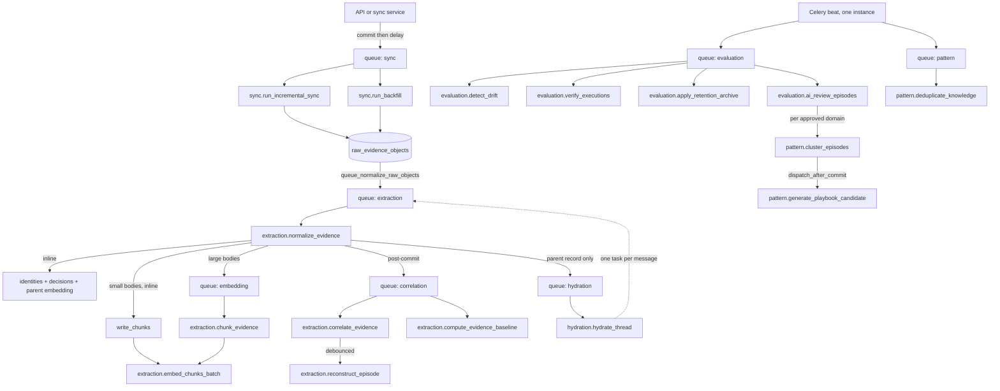

# Workers: Celery and queues

## Summary

You will understand which **background tasks** exist, which **Redis queue** each one lands on and why, how a task gets its own database session, how **Celery beat** schedules the recurring sweeps, and how a request id follows work from a browser click into a worker. After reading you should be able to look at a stuck pipeline and name the task, the queue, and the file that owns it.

## Business picture

Background processing keeps the product responsive. When someone connects a source or a new ticket arrives, the platform files the work on a queue and answers immediately — nobody waits on an AI model. Heavy jobs (reading tickets, extracting who did what, building the graph, embedding text for search) run behind the scenes and retry themselves when a provider blips.

Some jobs run on a clock instead of on demand: pulling source updates every 15 minutes, re-checking whether an automated fix actually held, ageing out old data, spotting when a playbook has drifted away from reality. That is why the system stays useful overnight without anyone minding it.

One business detail matters more than it sounds: **queues are separated by consequence, not by convenience.** Bulk work (reading thousands of tickets) is deliberately kept in a different lane from the small follow-up work that turns those tickets into a connected picture. When those shared a lane, a real backfill ingested 8,255 items and produced **zero** episodes, patterns, or playbooks — nothing failed, nothing logged an error, the graph simply never started forming. Separate lanes are the fix, and a lane that no worker is listening to is the failure mode to watch for.

## Technical walkthrough

### 1. The Celery application

`celery_app = Celery("contextedge", broker=..., backend=..., include=[...])` (`backend/src/contextedge/workers/celery_app.py:142-190`). Broker is Redis DB 1, result backend Redis DB 2, and the app's own Redis cache is DB 0 (`backend/src/contextedge/config.py:26-28`).

There is **no `autodiscover_tasks`** — **21** task modules are listed explicitly in `include=[...]` (`celery_app.py:146-189`), several carrying an in-file comment saying why they are there. The repo holds 23 modules that define Celery tasks. Of the two that are not listed:

- `chunk_tasks` rides in on an import — `extraction_tasks` imports both its tasks by name (`backend/src/contextedge/workers/extraction_tasks.py:43`), and `extraction_tasks` *is* listed, so registration happens as a side effect.
- `evidence_typing_tasks` rides in on nothing. It is neither listed nor imported by any module under `backend/src` (repo-wide search, 2026-08-19; the only importer is `backend/tests/test_knowledge_provenance.py:377`). Its own docstring offers `celery call extraction.backfill_evidence_types --args '["all"]'` as the way to run it (`backend/src/contextedge/workers/evidence_typing_tasks.py:13-15`), but a worker started from `celery_app` never imports the module, so the name is unregistered on that worker and the message is rejected rather than run. Treat the task as reachable today only from a process that imports the module itself.

That second case is the failure mode to remember: add a task module, forget both the `include` entry and an import path, and its tasks are simply never registered — no error at startup, no queue.

Core configuration (`celery_app.py:192-200`): JSON serialization only, UTC, `task_track_started=True`, `task_acks_late=True` (a crashed worker's task is re-delivered — this is what makes running many separate worker processes safe), `worker_prefetch_multiplier=1`.

**Broker resilience** (`celery_app.py:216-225`): `broker_connection_retry_on_startup=True`, `broker_connection_max_retries=None` (retry forever — a broker outage should pause a worker, never kill it), plus TCP keepalive and a 30-second health check. The in-file note records why: on the Windows dev box Redis is reached through WSL's port relay, which drops connections under load; on 2026-08-17 one blip silently killed four of eight workers and halved throughput with nothing reporting a failure.

### 2. Queue routing — matched in declaration order

`task_routes` is a dict and Celery matches it **in order**, so a specific route declared after a wildcard is silently swallowed (`celery_app.py:226-279`). `backend/tests/test_celery_queue_routing.py` asserts the ordering rather than trusting review.

| Route key | Queue | Why |
| --- | --- | --- |
| `sync.*` | **sync** | connector pulls (`celery_app.py:227`) |
| `hydration.*` | **hydration** | thread hydration, rate-limited by the source (`celery_app.py:228`) |
| `extraction.classify_relevance` | **default** | fast lane: a ~2.5s gate call must not queue behind 20–60s episode work; 500 classifications once starved ~40 minutes (`celery_app.py:229-233`) |
| `extraction.correlate_evidence` | **correlation** | graph lane (`celery_app.py:234-256`) |
| `extraction.reconstruct_episode` | **correlation** | `celery_app.py:257` |
| `extraction.compute_evidence_baseline` | **correlation** | `celery_app.py:258` |
| `extraction.chunk_evidence` | **embedding** | retrieval lane (`celery_app.py:259-267`) |
| `extraction.embed_chunks_batch` | **embedding** | `celery_app.py:268` |
| `extraction.*` | **extraction** | bulk normalization catch-all (`celery_app.py:269`) |
| `artifact.*` | **extraction** | attachment text extraction (`celery_app.py:270`) |
| `pattern.*` | **pattern** | clustering, playbook generation, dedup (`celery_app.py:271`) |
| `evaluation.*` | **evaluation** | every scheduled sweep (`celery_app.py:272`) |
| `review_queue.*` | **default** | explicit so the short name isn't caught by the fallback (`celery_app.py:273-276`) |
| `contextedge.workers.*` | **default** | module-path fallback (`celery_app.py:277-278`) |

`task_default_queue = "default"` (`celery_app.py:280`). The complete set a fleet must consume is therefore **eight** lanes: `default, sync, hydration, extraction, correlation, embedding, pattern, evaluation` — exactly `DEFAULT_QUEUES` in the launcher (`backend/dev.py:16`).

Two task families use short names that match no explicit route and no module-path fallback, so they land on **default**: `identity.reconcile_identities` (`backend/src/contextedge/workers/identity_tasks.py:147`) and the two `maintenance.*` sweeps (`backend/src/contextedge/workers/maintenance_tasks.py:46,71`). Any doc claiming identity reconciliation runs on the evaluation queue is wrong.

> **Watch the RUNBOOK's queue list.** `docs/RUNBOOK.md:242-249` and its PowerShell worker block (`docs/RUNBOOK.md:266-274`) predate the `correlation` and `embedding` lanes. A fleet started verbatim from that block never consumes them — which is precisely the silent starvation the lanes were created to fix. Treat `backend/dev.py:16` as the authority until the RUNBOOK catches up.

### 3. Registered tasks, by module

Every name below is the string in `@celery_app.task(name=...)`, which is what the routing table matches.

| Task name | Defined at | Queue |
| --- | --- | --- |
| `sync.trigger_scheduled_syncs` | `workers/sync_tasks.py:14` | sync |
| `sync.run_backfill` | `workers/sync_tasks.py:39` | sync |
| `sync.run_incremental_sync` | `workers/sync_tasks.py:68` | sync |
| `hydration.hydrate_thread` | `workers/hydration_tasks.py:189` | hydration |
| `extraction.normalize_evidence` | `workers/extraction_tasks.py:1304` | extraction |
| `extraction.classify_relevance` | `workers/extraction_tasks.py:1361` | default |
| `extraction.reconstruct_episode` | `workers/extraction_tasks.py:1391` | correlation |
| `extraction.correlate_evidence` | `workers/correlation_tasks.py:16` | correlation |
| `extraction.compute_evidence_baseline` | `workers/evidence_baseline_tasks.py:26` | correlation |
| `extraction.chunk_evidence` | `workers/chunk_tasks.py:210` | embedding |
| `extraction.embed_chunks_batch` | `workers/chunk_tasks.py:238` | embedding |
| `extraction.backfill_evidence_types` | `workers/evidence_typing_tasks.py:100` | extraction (would route there — the module is not registered on a `celery_app` worker, see §1) |
| `extraction.rebuild_identity_snapshots` | `workers/identity_tasks.py:72` | extraction |
| `artifact.extract_attachment` | `workers/artifact_tasks.py:15` | extraction |
| `pattern.cluster_episodes` | `workers/pattern_tasks.py:422` | pattern |
| `pattern.generate_playbook_candidate` | `workers/pattern_tasks.py:446` | pattern |
| `pattern.deduplicate_knowledge` | `workers/pattern_tasks.py:834` | pattern |
| `evaluation.run_evaluation` | `workers/evaluation_tasks.py:18` | evaluation |
| `evaluation.detect_drift` | `workers/evaluation_tasks.py:41` | evaluation |
| `evaluation.scan_contradictions_task` | `workers/evaluation_tasks.py:88` | evaluation |
| `evaluation.ai_review_episodes` | `workers/evaluation_tasks.py:129` | evaluation |
| `evaluation.extract_issue_signature` | `workers/signature_tasks.py:24` | evaluation |
| `evaluation.verify_executions` | `workers/verification_tasks.py:112` | evaluation |
| `evaluation.apply_retention_archive` | `workers/retention_tasks.py:72` | evaluation |
| `evaluation.purge_archived` | `workers/retention_tasks.py:104` | evaluation |
| `evaluation.cleanup_hard_deleted_evidence` | `workers/cleanup_tasks.py:165` | evaluation |
| `evaluation.reconcile_graph_relationships` | `workers/graph_tasks.py:33` | evaluation |
| `evaluation.mine_decision_patterns` | `workers/decision_tasks.py:34` | evaluation |
| `evaluation.calibrate_decision_confidence` | `workers/decision_tasks.py:130` | evaluation |
| `evaluation.detect_fleet_groups` | `workers/fleet_tasks.py:41` | evaluation |
| `evaluation.generate_correlation_suggestions` | `workers/suggestion_tasks.py:26` | evaluation |
| `evaluation.warm_cmdb_topology` | `workers/cmdb_tasks.py:74` | evaluation |
| `evaluation.backfill_playbook_embeddings` | `workers/playbook_tasks.py:74` | evaluation |
| `identity.reconcile_identities` | `workers/identity_tasks.py:147` | default (fallback) |
| `maintenance.infer_ci_relatedness` | `workers/maintenance_tasks.py:46` | default (fallback) |
| `maintenance.reclassify_stale_evidence` | `workers/maintenance_tasks.py:71` | default (fallback) |
| `review_queue.prefetch_review_context` | `workers/review_queue_tasks.py:33` | default (explicit) |

### 4. The ingest chain, in order

This is the sequence that turns one connector payload into retrievable, connected knowledge. Each arrow is a `.delay()` issued **after** the previous task's transaction committed.

1. **Sync** — `sync.run_incremental_sync` / `sync.run_backfill` fetch records and call `persist_ingestion_events`, which writes one `raw_evidence_objects` row per event (`backend/src/contextedge/services/ingestion_persistence.py:19-91`). Payloads over `OFFLOAD_THRESHOLD_BYTES = 32_768` go to MinIO and the inline column keeps only a stub `{"_offloaded": true, "size_bytes": N}` (`ingestion_persistence.py:16, 84-87`). The caller commits, then `queue_normalize_raw_objects` dispatches one normalize task per new raw id — and a broker failure mid-loop raises `NormalizeEnqueueError` carrying the ids it never reached, so the run can reconcile them back onto the source object instead of losing them (`backend/src/contextedge/services/sync_ingestion_queue.py:8, 16-30`).
2. **Normalize** — `extraction.normalize_evidence` (`workers/extraction_tasks.py:1304`) runs the whole enrichment inside one transaction: noise gate → title/body derivation → content hash → PII redaction → dedup lookup → relevance classification → message-function classification → error-signature fingerprinting → identity linking → decision extraction → parent embedding → chunk dispatch. Full step-by-step in [04-evidence-normalization-and-storage.md](./04-evidence-normalization-and-storage.md).
3. **Chunking** — `_dispatch_chunking` (`extraction_tasks.py:73-119`) chunks **inline** when the body is under 16 KB and the source is a known ticket/chat/mail type; otherwise it hands off to `extraction.chunk_evidence` on the **embedding** queue so a 40 KB attachment never stalls the normalize transaction.
4. **Chunk embedding** — `extraction.embed_chunks_batch` (`workers/chunk_tasks.py:238`) embeds in batches of `EMBED_BATCH_SIZE = 32` (`chunk_tasks.py:51`), budget-gated per sub-batch. A batch failure logs and stops without raising, leaving the remaining `embedding IS NULL` rows for the next replay.
5. **Graph** — after commit, normalize dispatches `extraction.correlate_evidence` and `extraction.compute_evidence_baseline` on the **correlation** queue (`extraction_tasks.py:1333-1334`). This is an `if`/`else`: when the item has attachments, normalize dispatches one `artifact.extract_attachment` per attachment **instead** (`extraction_tasks.py:1315-1322`), and the graph fan-out waits. Each artifact task re-reads the *parent* evidence row, and the last one to finish — the one that finds no artifact still `pending`/`processing`, reported as `follow_up_ready` (`backend/src/contextedge/services/artifact_extraction_service.py:855-865`) — dispatches `extraction.classify_relevance`, `extraction.correlate_evidence` and `extraction.compute_evidence_baseline` for that parent (`backend/src/contextedge/workers/artifact_tasks.py:30-43`). The point is that correlation should read a ticket body that already includes its PDF's extracted text, not the body as it stood before. Correlation, in turn, schedules `extraction.reconstruct_episode` with a settle delay of `RECONSTRUCT_DEBOUNCE_SECONDS = 180` (`extraction_tasks.py:746`; dispatch at `workers/correlation_tasks.py:48-51`).
6. **Hydration** — when the payload carried a `_thread_id`, this was the **parent** record, and the item was not a dedup hit, normalize dispatches `hydration.hydrate_thread(thread_external_id, source_id, tenant_id)` (`extraction_tasks.py:1341-1351`). "Parent record" is decided inside `_normalize`, which returns `_thread_external_id = None` for a hydrated message using the same `is_hydrated_message` predicate the noise gate at the top of the function uses — one definition, not a local copy (`extraction_tasks.py:613-615`, gate at `extraction_tasks.py:147`). The guard matters: hydration stamps `_thread_id` onto every message it writes, so without it each hydrated message would re-hydrate its own thread — measured at 10× amplification, and 50× on the largest ticket, against an API that answers throttling with empty results rather than an error (`extraction_tasks.py:598-609`).

`extraction.classify_relevance` is **no longer part of normalize's fan-out** — normalize classifies inline before the expensive work (`extraction_tasks.py:1328-1332`). The task survives as the re-classification entry point (`extraction_tasks.py:1357-1384`), reached from the admin UI, from `maintenance.reclassify_stale_evidence` (`workers/maintenance_tasks.py:113-114`), and from the attachment path in step 5. When it re-classifies an item a stale verdict had skipped, it fans retrieval work out itself: chunk, correlate and baseline (`extraction_tasks.py:1371-1381`).

### 5. How a task talks to the database

Every task body is an `async def work(db)` handed to `run_async` (`backend/src/contextedge/workers/asyncio_runner.py:31-34`). `run_async` calls `asyncio.run(_with_session(fn))`, and `_with_session` creates a **fresh NullPool engine per task**, opens one session, commits on success, rolls back on exception, then closes and disposes the engine (`asyncio_runner.py:10-28`).

Why per-task: on Windows/Celery a shared pooled engine hits "Event loop is closed" during connection check-in. The cost is that each running task holds its own connections — budget roughly 2–3 × concurrency. The API side uses a pooled engine instead (`backend/src/contextedge/database.py:19-21`).

The normal pattern is that `run_async` owns the commit, so services called from tasks **flush and leave committing to the wrapper**, and the `.delay()` fan-out sits in the task wrapper *after* `run_async` returns — which is what guarantees a dispatched task can never observe an uncommitted row. Sweeps that loop over many items are the deliberate exception: the AI-review sweep commits per episode inside `work()` and only then dispatches (`workers/evaluation_tasks.py:278-283, 319-326`). The rule that actually holds everywhere is **commit before dispatch**, not "only the wrapper commits".

A service that does not own its transaction — anything running inside `run_async` or a FastAPI `get_db` dependency — gets the rule for free from `dispatch_after_commit` (`backend/src/contextedge/services/deferred_dispatch.py:72-95`). It parks `(task_name, args)` on the session and registers `after_commit` / `after_rollback` listeners once, so the message is sent when the transaction lands and thrown away when it does not. `send_task` applies the same `task_routes` `.delay()` would, so queues are unaffected (`deferred_dispatch.py:27-28, 52-54`). Both failure directions had been seen live: a rolled-back clustering pass left 65 queued `generate_playbook_candidate` tasks naming patterns that never existed, and on the success path a worker reading a fraction of a second too early got "pattern_not_found", returned `skipped`, and nothing retried — a real pattern silently never got its playbook (`deferred_dispatch.py:1-15`). A broker outage at send time only logs: the row is already durable, and re-sending is not worth undoing a commit (`deferred_dispatch.py:55-64`). This is the path clustering uses to reach playbook generation — `_cluster` calls `create_pattern_from_episodes` (`workers/pattern_tasks.py:364, 384`), which queues the candidate task for after the commit (`backend/src/contextedge/services/pattern_service.py:192-194`).

### 6. Workers refuse to start behind the schema

A `worker_ready` signal handler resolves the bundled Alembic head, reads `alembic_version.version_num` on a throwaway sync engine, and `raise SystemExit` on a definite mismatch — including the "no `alembic_version` table at all" case, treated as the most definite mismatch of all (`celery_app.py:83-139`). Transient DB errors and installed layouts with no alembic directory are skipped with a `worker.migration_check_skipped` warning. Without this, workers would consume the normalize queue against a stale schema and corrupt ingestion mid-transaction. The API's equivalent is `/ready` (`backend/src/contextedge/main.py:179-210`).

### 7. Beat schedule — 14 entries

One beat process only; a second double-dispatches everything (`docs/RUNBOOK.md:276-277`). Every tenant-scanning entry passes the literal sentinel `"all"` and iterates tenants internally with per-tenant try/except so one bad tenant never stops the sweep.

| Beat entry | Task | Every | Args |
| --- | --- | --- | --- |
| `detect-drift-every-6h` | `evaluation.detect_drift` | 6 h | `("all",)` |
| `scan-contradictions-every-12h` | `evaluation.scan_contradictions_task` | 12 h | `("all",)` |
| `trigger-syncs-every-15m` | `sync.trigger_scheduled_syncs` | 15 min | — |
| `reconcile-identities-daily` | `identity.reconcile_identities` | 24 h | `("all",)` |
| `calibrate-decision-confidence-daily` | `evaluation.calibrate_decision_confidence` | 24 h | `("all",)` |
| `mine-decision-patterns-daily` | `evaluation.mine_decision_patterns` | 24 h | `("all",)` |
| `cleanup-hard-deleted-daily` | `evaluation.cleanup_hard_deleted_evidence` | 24 h | `("all",)` |
| `reconcile-graph-relationships-every-6h` | `evaluation.reconcile_graph_relationships` | 6 h | `("all",)` |
| `retention-archive-daily` | `evaluation.apply_retention_archive` | 24 h | `("all",)` |
| `retention-purge-weekly` | `evaluation.purge_archived` | 7 d | `("all",)` |
| `verify-executions-every-15m` | `evaluation.verify_executions` | 15 min | `("all",)` |
| `detect-fleet-groups` | `evaluation.detect_fleet_groups` | 30 min | — |
| `deduplicate-knowledge-hourly` | `pattern.deduplicate_knowledge` | 1 h | `("all",)` |
| `ai-review-episodes-hourly` | `evaluation.ai_review_episodes` | 1 h | `("all",)` |

All fourteen live in `celery_app.py:281-384`. Two notes an operator needs:

- **`pattern.cluster_episodes` has no beat entry.** Clustering is event-driven. Episode approval — single (`backend/src/contextedge/api/v1/episodes.py:272-275`) and bulk (`episodes.py:332-335`) — dispatches it per affected domain; the AI-review sweep dispatches it per domain that had auto-approvals (`workers/evaluation_tasks.py:340-347`); and `POST /api/v1/patterns/cluster` is the manual door, which with no domain given fans out one task per tenant domain plus one global `None` pass (`backend/src/contextedge/api/v1/patterns.py:412-445`).
- **`ai-review-episodes-hourly` is scheduled unconditionally** so turning the feature on needs no beat restart. Dispatched the way beat dispatches it — no `mode_override` — the task returns `{"status": "disabled"}` immediately while `EPISODE_AI_REVIEW=off` (`workers/evaluation_tasks.py:171-173`). An API dispatch that *does* pass an override runs in advisory mode even on an `off` deployment; it can never run auto-approve there (`evaluation_tasks.py:174-181`).

### 8. The shared "don't churn during ingest" gate

Two hourly sweeps — knowledge dedup and AI episode review — call the same guard before touching a tenant: `tenant_pipeline_active(db, tenant_id, window_start)` (`workers/pattern_tasks.py:748-783`). A tenant is *active* when either more than `DEDUP_ACTIVITY_THRESHOLD = 50` evidence rows landed in the last `DEDUP_ACTIVITY_WINDOW_MINUTES = 10`, or more than `EPISODE_ACTIVITY_THRESHOLD = 30` episodes were minted in that window (`pattern_tasks.py:736-745`). Active tenants are counted as deferred and skipped — `deferred` in the dedup sweep's result (`pattern_tasks.py:812-821, 827`), `deferred_tenants` in the AI review sweep's (`workers/evaluation_tasks.py:193, 195-203`).

The episode half of the threshold was added after a 12:29 sweep retired 446 drafts mid-reconstruction-tail: the guard was watching evidence inflow only, and reconstruction keeps minting episodes for hours after the last evidence row lands (`pattern_tasks.py:738-745`).

### 9. AI episode review sweep (`evaluation.ai_review_episodes`)

Mode comes from `settings.episode_ai_review`, one of `off | advisory | auto_approve` (`backend/src/contextedge/config.py:185-187`). Those three are the only review modes the code has. A dispatch-time `mode_override` may only **downgrade** — running advisory under an auto-approve configuration is allowed, escalating is not (`workers/evaluation_tasks.py:174-181`).

Mechanics worth knowing (`workers/evaluation_tasks.py:125-358`):

- Drafts are read in the same review-priority order the human queue shows, and drafts that already carry an assessment are skipped — the sweep never pays twice (`evaluation_tasks.py:241-250`).
- **Commit per episode, before any dispatch** (`evaluation_tasks.py:278-283`). A batch-end commit made every verdict hostage to the last one: one deadlock re-paid 50 LLM calls.
- After 5 consecutive transient failures (provider down, budget block) the tenant's batch aborts rather than burning 100 drafts (`evaluation_tasks.py:297-309`).
- Auto-approved episodes dispatch `evaluation.extract_issue_signature`; a bounded crash-recovery pass (20 per sweep) re-dispatches for auto-approved episodes that have no signature row (`evaluation_tasks.py:205-239, 316-331`).
- Clustering is dispatched **once per domain that had approvals** — passing `None` clustered nothing, because the global pass deliberately sees only NULL-domain episodes (`evaluation_tasks.py:335-351`).
- Optional `shard` / `shards` arguments hash-partition the draft pool so concurrent sweep workers don't review the same drafts in lockstep (`evaluation_tasks.py:251-268`).

### 10. Request ids follow work into the workers

Three Celery signal handlers carry a `request_id` / `correlation_id` / `causation_id` triad from an HTTP request into every task it spawns:

1. `TenantContextMiddleware.dispatch` mints or parses the three ids and binds them to a ContextVar (`backend/src/contextedge/middleware/request_context.py:88-104`).
2. `before_task_publish` → `_inject_correlation_headers` copies them onto the outgoing task headers with `headers.setdefault`, so a caller-set header is never clobbered (`celery_app.py:25-42`).
3. `task_prerun` → `_bind_worker_context` reads them back and re-binds the ContextVar for that task; the reset token is stored per task id because concurrent pools interleave tasks (`celery_app.py:16-20, 45-68`). `task_postrun` → `_release_worker_context` pops and resets, swallowing a double reset (`celery_app.py:71-80`).
4. Any service that calls `append_operational_event` inherits the ids without asking — correlation, causation, and actor all default from the request context (`backend/src/contextedge/services/event_log_service.py:54-56`).

Malformed header values are skipped rather than raised on (`celery_app.py:61-64`).

### 11. Windows worker topology

Prefork is unusable on Windows. **`-P threads` is also unusable for the LLM-bearing lanes**: litellm holds asyncio locks bound to the loop that created them, so a threads pool raises "Lock is bound to a different event loop" on every enrichment call, trips the provider circuit breaker, and fails the run while the workers still look healthy (measured on a live backfill 2026-08-16; `docs/RUNBOOK.md:256-262`).

Two places still say otherwise and should not be followed: the launcher's own comment claims "threads works fine on Windows for I/O-bound queues" (`backend/dev.py:113-115`), and the RUNBOOK's launcher example passes `-P threads -c 8` for Worker A (`docs/RUNBOOK.md:304`) — both predate the 2026-08-16 measurement recorded twelve lines above that example.

Parallelism therefore comes from **processes**:

- **Worker A (parallel)** — N separate processes, each `-P solo` with a distinct node name, consuming the high-volume lanes. Ticket processing is ~95% waiting on the LLM, so process parallelism is near-linear.
- **Worker B (serialized)** — one `-P solo` worker for `sync,pattern,evaluation`. Clustering and playbook generation operate on the whole graph and hold **no advisory lock** (unlike sync), so two concurrent runs could mint duplicate patterns. The hourly dedup sweep deliberately rides `pattern.*` so it serializes behind clustering on this same worker (`workers/pattern_tasks.py:836-839`).
- **Beat** — exactly one instance.

Add `correlation` and `embedding` to whichever worker you run; the RUNBOOK's `-Q` strings predate them. The simplest correct start is `python dev.py worker`, which consumes all eight lanes and defaults to `-P solo` on Windows unless you pass a pool (`backend/dev.py:16, 102-126`).

Why the split is safe: a fresh NullPool engine per task (§5), a per-source Postgres advisory lock for sync so a second worker returns `skipped_locked` instead of racing a checkpoint (`backend/src/contextedge/services/sync_worker_service.py:379-395`), and `task_acks_late=True` re-delivering a crashed task.

Ceilings to respect before scaling up: 8 concurrent Gemini calls is roughly 60–120 requests/min against the Vertex quota, and concurrent hydration can get you rate-limited by the source (`docs/RUNBOOK.md:311`). Worker count is bounded by RAM, not CPU: each solo worker is a full process at ~325 MB, and on the 15.3 GB dev box also hosting Postgres/Redis/MinIO the practical ceiling was 5–7 workers against 8 cores (`codewiki/KNOWN_GAPS.md:571-576`).

### 12. Seeing the queues

`GET /api/v1/admin/pipeline-health` (rendered at `/admin/pipeline`) reads `LLEN` per lane in pipeline order plus `HLEN unacked` for in-flight work (`backend/src/contextedge/services/pipeline_health_service.py:43-52, 58-84`), and counts the graph chain end-to-end in one SQL read — evidence, embedded, raw objects, identities, case links, correlation edges, episodes, chunks, patterns, playbooks — so the first zero in the sequence is the diagnosis (`pipeline_health_service.py:89-139`). `BACKLOG_ALERT_DEPTH = 500` (`pipeline_health_service.py:55`). It never raises on a broker failure — it logs and returns empty depths (`pipeline_health_service.py:82-84`).

In-flight matters as much as depth: during the reconstruction phase of a bulk ingest, 5,800 debounced reconstruct tasks churned for hours while every queue read zero and the page said "idle" about a pipeline burning a dollar a minute (`pipeline_health_service.py:62-68`).

## Flow diagram



## Example: Acme VPN data at this stage

Acme's ServiceNow incident `INC0010427` on CI `vpn-gw-east-01` arrives, along with the Teams thread and the Gmail escalation that quote it. Here is the task chain for the ticket itself.

The result shapes below are the keys the task functions actually return; only the values are illustrative.

**Task 1 — normalize (extraction queue)** — result keys at `extraction_tasks.py:617-628`.

```json
{
  "task": "extraction.normalize_evidence",
  "queue": "extraction",
  "args": ["raw-7f3a1b", "acme-tenant-uuid"],
  "result": {
    "evidence_id": "ev-a1b2c3",
    "deduped": false,
    "embedded": true,
    "identity_count": 2,
    "decision_count": 1,
    "relevance_state": "operational",
    "skipped_extraction": false,
    "attachment_ids": [],
    "_thread_external_id": "thr-vpn-east",
    "_source_id": "src-snow-acme"
  }
}
```

**Task 2 — chunk embedding (embedding queue, dispatched after commit)** — result keys at `chunk_tasks.py:187-191`. `written` counts chunks that got an embedding this run; `skipped` counts those that already had one, which is what makes a replay a no-op.

```json
{
  "task": "extraction.embed_chunks_batch",
  "queue": "embedding",
  "args": [["chk-01", "chk-02", "chk-03"], "acme-tenant-uuid"],
  "result": {
    "written": 3,
    "skipped": 0,
    "embedded_evidence_ids": ["ev-a1b2c3"]
  }
}
```

**Task 3 — correlate (correlation queue, dispatched after commit)** — result keys at `backend/src/contextedge/services/correlation_service.py:778-791`.

```json
{
  "task": "extraction.correlate_evidence",
  "queue": "correlation",
  "args": ["ev-a1b2c3", "acme-tenant-uuid"],
  "result": {
    "status": "ok",
    "canonical_case_id": "case-0010427",
    "candidate_count": 3,
    "case_links_created": 1,
    "case_links_updated": 0,
    "correlations_created": 1,
    "identity_match_candidates": 2,
    "servicenow_references": { "warm_candidates": [] },
    "ticket_bridge": { "memberships_created": 1 }
  }
}
```

Because `correlations_created` is above zero, the task wrapper then schedules `extraction.reconstruct_episode` with `countdown=180` (`workers/correlation_tasks.py:38-51`).

**Task 4 — thread hydration (hydration queue, parent record only)** — three positional arguments, not two: thread id, source id, tenant id (`hydration_tasks.py:191`). Result keys at `hydration_tasks.py:174-182`.

```json
{
  "task": "hydration.hydrate_thread",
  "queue": "hydration",
  "args": ["thr-vpn-east", "src-snow-acme", "acme-tenant-uuid"],
  "result": {
    "thread_ref": "thr-vpn-east",
    "messages": 41,
    "raw_objects_created": 41,
    "quoted_chars_removed": 2180,
    "quote_only_messages": 3,
    "delivery_failures": 0
  }
}
```

The wrapper then issues one `extraction.normalize_evidence` per new raw id (`hydration_tasks.py:199-202`).

That last number is the one to hold onto: **one ticket became 41 more extraction tasks.** That is why bulk normalization has its own lane and why correlation and embedding have theirs.

**Scheduled task — post-action verification (evaluation queue, every 15 minutes)** — result keys at `verification_tasks.py:43-50`, plus `approvals_expired` added per tenant at `verification_tasks.py:94-96`.

```json
{
  "task": "evaluation.verify_executions",
  "queue": "evaluation",
  "args": ["all"],
  "result": {
    "tenants": 12,
    "verified": 3,
    "failed": 0,
    "unverifiable": 1,
    "not_due": 7,
    "skipped": 0,
    "approvals_expired": 2
  }
}
```

Every task retries on its own, so an AI provider outage during classification does not block correlation or hydration from finishing.

## Design decisions

- **A lane per consequence, because a shared FIFO starves the work that matters** (`correlation`, `embedding`) — *Why:* `extraction` carries the bulk normalization of a backfill, and normalization *feeds itself* — thread hydration turns one Zoho ticket into ~41 message rows, each another `normalize_evidence` task. Measured on the live backfill (2026-08-17): the extraction queue was **growing by ~70 tasks/minute at 8,255 deep**, with ~55,000 message tasks still to come. Every follow-up task routed to that same lane, so each queued behind the very work that produced it. Two things were dying invisibly. `correlate_evidence` — a **0.25s** task — had been dispatched and *never once received*, so no correlation edge, no `reconstruct_episode`, no episodes, patterns or playbooks after 193 evidence items. And `embed_chunks_batch` was equally stuck: **1,879 chunks existed with 289 embedded (15%)**, meaning most ingested evidence was silently invisible to vector search. No task failed and no error was logged in either case. *Tradeoff:* two more lanes to run; a lane with no consumer is a silent backlog, which is why `docs/RUNBOOK.md` drifting behind the routing table is an operational hazard, not a documentation nit.

- **Specific routes before the `extraction.*` wildcard** — *Why:* `task_routes` is matched in declaration order, so a wildcard silently swallows any specific route declared after it, and the symptom is invisible: tasks run, nothing errors, the graph simply never forms. *Tradeoff:* a correctness property that lives in dict ordering, which is why `backend/tests/test_celery_queue_routing.py` asserts the ordering explicitly rather than trusting review.

- **`-P threads` is unusable, so parallelism comes from processes** — *Why:* litellm holds asyncio locks bound to the loop that created them, so a threads pool raises "Lock is bound to a different event loop" on every enrichment call and trips the provider circuit breaker — measured on a live backfill, where it failed the whole run while reporting healthy workers. Prefork is unusable on Windows independently. *Tradeoff:* each solo worker is a full process at ~325 MB, so worker count is bounded by RAM rather than CPU: on a 15.3 GB dev box with Docker hosting Postgres/Redis/MinIO, the practical ceiling was 5–7 workers, not the 16 an 8-core machine suggests.

- **A fresh NullPool engine per task instead of a shared pool** — *Why:* Windows/Celery closes the event loop between tasks, and a pooled connection checked in against a dead loop raises "Event loop is closed"; a per-task engine has no state to survive the loop (`workers/asyncio_runner.py:13-15`). *Tradeoff:* connection count scales with concurrency (~2–3 per running task), so the database's `max_connections` — not CPU — is often what caps the fleet.

- **The worker exits rather than consuming against a stale schema** — *Why:* a worker one migration behind fails every task mid-transaction and corrupts ingestion while the queue keeps draining; `SystemExit` lets a supervisor restart-loop until migrations run (`celery_app.py:85-93`). *Tradeoff:* a definite-mismatch-only gate, so transient DB errors are skipped with a warning rather than blocking startup — the check is deliberately not a health check.

- **Retry the broker forever instead of exiting** — *Why:* one dropped TCP connection silently killed four of eight workers and halved throughput with nothing reporting a failure; silent capacity loss is worse than a crash because the queue just drains slower and looks fine (`celery_app.py:201-215`). *Tradeoff:* a genuinely dead broker leaves workers alive and idle, so queue depth — not process count — is the signal to alert on.

- **Sweeps defer while a tenant is ingesting** — *Why:* dedup and AI review both consume work another stage is still producing; a sweep mid-backfill retires drafts the next message burst regrows, which is pure churn plus LLM spend (`pattern_tasks.py:730-745`). *Tradeoff:* a tenant under continuous heavy ingest can defer its hourly sweeps for a long stretch; the counters (`deferred_tenants`) exist so that shows up rather than looking like the sweep never ran.

- **Prefetch multiplier 1 + late ack** — *Why:* fair distribution across workers and safe retry on a crash. *Tradeoff:* slightly lower throughput for very small tasks.

- **Thin tasks, fat services** — *Why:* the same business logic serves HTTP and workers, and `run_async` owns the commit so services only ever flush. *Tradeoff:* tasks import services locally in several places to avoid circular imports.

## Code map

| Concern | Module path | Key symbols | When it runs |
| --- | --- | --- | --- |
| Celery app, routing, beat | `backend/src/contextedge/workers/celery_app.py` | `celery_app`, `task_routes` (226-279), `beat_schedule` (281-384) | Import time |
| Migration guard | `backend/src/contextedge/workers/celery_app.py` | `_require_migrations_at_head` (83-139) | `worker_ready` signal |
| Correlation-ID signals | `backend/src/contextedge/workers/celery_app.py` | `_inject_correlation_headers` (25), `_bind_worker_context` (45), `_release_worker_context` (71) | Publish / prerun / postrun |
| Async DB bridge | `backend/src/contextedge/workers/asyncio_runner.py` | `run_async` (31), `_with_session` (10) | Every task |
| Launcher + consumed queues | `backend/dev.py` | `DEFAULT_QUEUES` (16), `worker` / `beat` commands (102-137) | Dev start |
| Sync | `backend/src/contextedge/workers/sync_tasks.py` | `trigger_scheduled_syncs` (14), `run_backfill` (39), `run_incremental_sync` (68) | sync queue |
| Enqueue helper | `backend/src/contextedge/services/sync_ingestion_queue.py` | `queue_normalize_raw_objects` (16), `NormalizeEnqueueError` (8) | After ingest commit |
| Commit-before-dispatch helper | `backend/src/contextedge/services/deferred_dispatch.py` | `dispatch_after_commit` (72), `_send_pending` (45), `_drop_pending` (67) | Services that don't own their transaction |
| Normalize / classify / episode | `backend/src/contextedge/workers/extraction_tasks.py` | `normalize_evidence` (1304), `_dispatch_chunking` (73), `classify_relevance` (1361), `reconstruct_episode` (1391) | extraction / default / correlation |
| Chunk + chunk embed | `backend/src/contextedge/workers/chunk_tasks.py` | `chunk_evidence_task` (210), `embed_chunks_batch_task` (238), `EMBED_BATCH_SIZE = 32` (51) | embedding queue |
| Correlation | `backend/src/contextedge/workers/correlation_tasks.py` | `correlate_evidence` (16) | correlation queue |
| Evidence baseline | `backend/src/contextedge/workers/evidence_baseline_tasks.py` | `compute_evidence_baseline` (26) | correlation queue |
| Thread hydration | `backend/src/contextedge/workers/hydration_tasks.py` | `hydrate_thread` (189) | hydration queue |
| Attachments | `backend/src/contextedge/workers/artifact_tasks.py` | `extract_attachment` (15) | extraction queue |
| Patterns + dedup + defer gate | `backend/src/contextedge/workers/pattern_tasks.py` | `cluster_episodes` (422), `generate_playbook_candidate` (446), `deduplicate_knowledge` (834), `tenant_pipeline_active` (748) | pattern queue |
| Drift / contradictions / AI review | `backend/src/contextedge/workers/evaluation_tasks.py` | `detect_drift` (41), `scan_contradictions_task` (88), `ai_review_episodes` (129) | evaluation queue |
| Issue signatures | `backend/src/contextedge/workers/signature_tasks.py` | `extract_issue_signature_task` (24) | evaluation queue |
| Post-action verification | `backend/src/contextedge/workers/verification_tasks.py` | `verify_executions` (112), `SWEEP_LIMIT_PER_TENANT = 50` (26) | evaluation queue, 15 min |
| Retention archive + purge | `backend/src/contextedge/workers/retention_tasks.py` | `apply_retention_archive` (72), `purge_archived` (104) | evaluation queue |
| Orphan cleanup | `backend/src/contextedge/workers/cleanup_tasks.py` | `cleanup_hard_deleted_evidence` (165) | evaluation queue, daily |
| Graph reconciliation | `backend/src/contextedge/workers/graph_tasks.py` | `reconcile_graph_relationships` (33) | evaluation queue, 6 h |
| Identity reconciliation | `backend/src/contextedge/workers/identity_tasks.py` | `reconcile_identities` (147), `rebuild_identity_snapshots` (72) | default / extraction |
| Operator sweeps | `backend/src/contextedge/workers/maintenance_tasks.py` | `infer_ci_relatedness` (46), `reclassify_stale_evidence` (71) | default queue |
| Queue observability | `backend/src/contextedge/services/pipeline_health_service.py` | `get_pipeline_health` (87), `QUEUES` (43), `BACKLOG_ALERT_DEPTH` (55) | `/admin/pipeline` |

## Acme VPN incident (this layer)

After Acme's ServiceNow raws commit, **extraction** workers normalize `INC0010427` and its siblings — redacting, classifying, extracting identities (`vpn-gw-east-01` resolves to a CI identity) and decisions ("jsmith restarted vpn-gw-east-01" becomes a `records_decision` edge), and embedding the parent body. The same task chunks inline for the short ticket description; the 40 KB post-mortem markdown attached to the engineer's email goes async to `extraction.chunk_evidence` on the **embedding** lane, which writes about a dozen `heading_section` chunks before queueing one `extraction.embed_chunks_batch`. Meanwhile **hydration** turns the Teams thread into 41 message rows, each of which re-enters the extraction lane. On the **correlation** lane, `extraction.correlate_evidence` links the Gmail escalation to the incident by the quoted ticket number and schedules a debounced `extraction.reconstruct_episode`; when a knowledge manager approves the resulting episode, **pattern** workers cluster it and `evaluation.extract_issue_signature` distils the fingerprint `remote_access|tls_certificate|certificate_expired`. Overnight, **evaluation** beat jobs check the new playbook for drift, verify any execution against fresh alerts on `vpn-gw-east-01`, and age out the chat fragments nobody linked.

## Further reading

- [`docs/RUNBOOK.md`](../docs/RUNBOOK.md) — worker commands and bulk-backfill onboarding (apply the eight-queue correction in §2 above)
- [03-ingestion-connectors-and-sync.md](./03-ingestion-connectors-and-sync.md) — what enqueues normalize, and the sync advisory lock
- [04-evidence-normalization-and-storage.md](./04-evidence-normalization-and-storage.md) — every step inside `normalize_evidence`
- [07-episodes-patterns-playbooks.md](./07-episodes-patterns-playbooks.md) — episode review modes and what clustering does with an approval
- [09-graph-and-correlation.md](./09-graph-and-correlation.md) — what the correlation lane builds
- [11-retention-and-operational-events.md](./11-retention-and-operational-events.md) — the retention and cleanup beat entries in detail
- [18-cost-observability-and-containment.md](./18-cost-observability-and-containment.md) — the budget gate every LLM-bearing task passes through
- [CHUNKING_DESIGN.md](./CHUNKING_DESIGN.md) — inline-vs-async chunking thresholds
- [KNOWN_GAPS.md](./KNOWN_GAPS.md) — current caveats before assuming a stage is end-to-end
