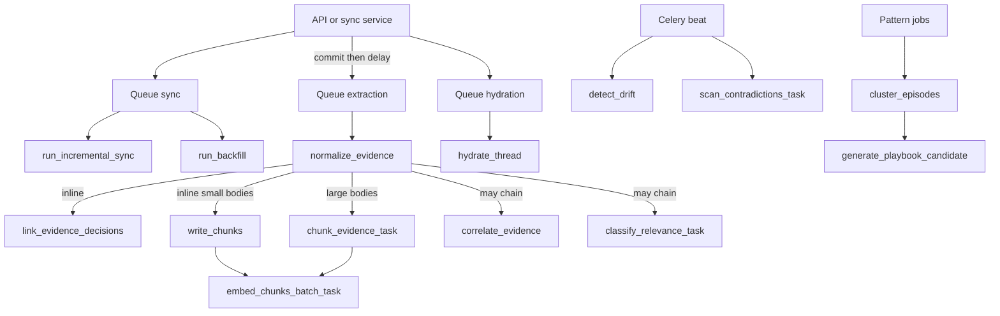

# Workers: Celery and queues

## Summary

You will understand which **background tasks** exist, how they map to **Redis queues**, how async database work runs inside workers, and how **beat** schedules periodic jobs—so you can operate and debug the pipeline without tracing only HTTP.

## Business picture

Background processing ensures that heavy work like AI extraction, pattern detection, and health checks happens without slowing down the interface. When a user triggers an import or a new ticket arrives, the platform queues those jobs and returns immediately—users never wait for AI models or data crunching to finish. If something fails (an AI provider is temporarily down, a database hiccup, etc.), the system **retries automatically**. Some jobs also run on a **recurring schedule**—for example, checking whether playbooks have drifted from reality or whether knowledge-base articles contradict approved guidance—so the platform stays healthy around the clock without manual intervention.

## Technical walkthrough

1. **Celery application** — `workers/celery_app.py` constructs `Celery("contextedge")` with JSON serialization, late acks, prefetch multiplier 1, and `task_routes` mapping task name prefixes to queues:
   - `sync_tasks.*` → **sync**
   - `hydration_tasks.*` → **hydration**
   - `extraction_tasks.*`, `artifact_tasks.*`, `correlation_tasks.*` → **extraction**
   - `pattern_tasks.*` → **pattern**
   - `evaluation_tasks.*` → **evaluation**
   - default queue **default**

2. **Autodiscovery** — `autodiscover_tasks` loads the task modules listed in config so workers register all `@celery_app.task` functions.

3. **Async bridge** — `workers/asyncio_runner.run_async` runs an async callable with a DB session (unit-of-work style) so tasks stay thin wrappers around `services/`.

4. **Representative tasks**
   - **sync:** `run_backfill`, `run_incremental_sync` (`sync_tasks.py`) — historical backfill and incremental pull per source object.
   - **extraction:** `normalize_evidence` (redacts PII → classifies → embeds → links identities & decisions → dispatches chunking), `classify_relevance_task`, `reconstruct_episode_task` (`extraction_tasks.py`; scheduled runs pass a singleton-cluster skip, the optional resolution gate, and a per-cluster advisory lock before any LLM spend — statuses `skipped_single_evidence` / `deferred_unresolved` / `skipped_locked`, see codewiki/07); `chunk_evidence_task`, `embed_chunks_batch_task` (`chunk_tasks.py`) — async chunking for large items + batched chunk embeddings (32 chunks per LLM call).
   - **hydration:** `hydrate_thread` (`hydration_tasks.py`) for fuller thread payloads.
   - **correlation:** `correlate_evidence` (`correlation_tasks.py`).
   - **artifacts:** `extract_attachment_artifact` (`artifact_tasks.py`).
   - **pattern:** `cluster_episodes`, `generate_playbook_candidate` (`pattern_tasks.py`).
   - **evaluation:** `run_evaluation`, `detect_drift`, `scan_contradictions_task` (`evaluation_tasks.py`); `evaluation.calibrate_decision_confidence`, `evaluation.mine_decision_patterns` (`decision_tasks.py`); `evaluation.cleanup_hard_deleted_evidence` (`cleanup_tasks.py`). Each of these accepts the literal string `"all"` as `tenant_id` to fan out across every tenant with per-tenant exception isolation (one bad tenant won't kill the beat for the rest).

5. **Beat schedule** — Same file defines periodic tasks: `detect_drift` every 6 hours, `scan_contradictions_task` every 12 hours, `trigger_scheduled_syncs` every 15 minutes, `calibrate-decision-confidence-daily`, `mine-decision-patterns-daily`, and `cleanup-hard-deleted-daily` every 24 hours. All tenant-scanning entries use `args: ("all",)`.

6. **Correlation-ID propagation** — `celery_app.py` registers three Celery signal handlers so a single `request_id` / `correlation_id` / `causation_id` triad follows an HTTP request into the workers: `before_task_publish` reads the ContextVar set by `TenantContextMiddleware` and stamps it onto the outgoing task headers; `task_prerun` rebinds the IDs into the worker's ContextVar so any service code (and `append_operational_event`) picks them up automatically; `task_postrun` resets the token. Malformed headers are skipped; overlapping tasks each own their own reset token so concurrent pools don't stomp on each other.

6. **Enqueue from API/services** — `sync_ingestion_queue.queue_normalize_raw_objects` imports `normalize_evidence` and calls `.delay` per raw id after commit. `api/v1/sync.py` and `api/v1/sources.py` enqueue **sync** tasks for retry and backfill. Other paths enqueue correlation, pattern jobs, etc.

7. **Sync queue operations** — Sync tasks only execute if a worker consumes the **sync** queue. See [KNOWN_GAPS.md](./KNOWN_GAPS.md) if jobs stay pending.

## Flow diagram



## Example: Acme VPN data at this stage

When Acme's VPN tickets are ingested, multiple background tasks fire in sequence. Here is the task chain for one evidence item:

**Task 1 — Normalize evidence (extraction queue)**

```json
{
  "task": "extraction_tasks.normalize_evidence",
  "queue": "extraction",
  "args": { "raw_id": "raw-7f3a1b" },
  "result": "Created evidence item ev-a1b2c3"
}
```

**Task 2 — Classify relevance (extraction queue, chained from normalize)**

```json
{
  "task": "extraction_tasks.classify_relevance_task",
  "queue": "extraction",
  "args": { "evidence_id": "ev-a1b2c3" },
  "result": "Classification: operational (confidence: 0.94)"
}
```

**Task 3 — Correlate evidence (extraction queue, chained from normalize)**

```json
{
  "task": "correlation_tasks.correlate_evidence",
  "queue": "extraction",
  "args": { "evidence_id": "ev-a1b2c3" },
  "result": "Linked to ev-d4e5f6 (Teams thread) with confidence 0.78"
}
```

**Scheduled task — Drift detection (evaluation queue, runs every 6 hours)**

```json
{
  "task": "evaluation_tasks.detect_drift",
  "queue": "evaluation",
  "args": { "tenant_id": "all" },
  "result": {
    "tenants_scanned": 12,
    "alerts": [
      { "playbook_id": "pb-r1s2t3", "issues": ["high_negative_feedback_3"], "severity": "medium" }
    ],
    "expired_transitions": 2
  }
}
```

Each task runs independently and retries on failure, so a temporary AI provider outage during classification does not block evidence normalization or correlation from completing.

## Design decisions

- **Multiple queues** — *Why:* isolate slow extraction from quick hydration; operators can scale worker pools per queue. *Tradeoff:* more processes to monitor.

- **Prefetch multiplier 1 + late ack** — *Why:* fair distribution and safer retry on worker crash. *Tradeoff:* slightly lower throughput per worker for tiny tasks.

- **Thin tasks, fat services** — *Why:* same business logic for HTTP and workers. *Tradeoff:* tasks must import services carefully to avoid circular imports (local imports used where needed).

- **JSON task payloads** — *Why:* simple introspection and logging. *Tradeoff:* large blobs must stay in DB/S3, not in task args.

## Code map

| Concern | Module path | Key symbols | Queue |
| --- | --- | --- | --- |
| Celery config | `backend/src/contextedge/workers/celery_app.py` | `celery_app`, `task_routes`, `beat_schedule` | — |
| Async runner | `backend/src/contextedge/workers/asyncio_runner.py` | `run_async` | All async tasks |
| Normalize / classify / episode | `backend/src/contextedge/workers/extraction_tasks.py` | `normalize_evidence` (calls `link_evidence_identities` + `link_evidence_decisions` + embedding inline + `_dispatch_chunking`), `classify_relevance_task`, `reconstruct_episode_task` | extraction |
| Chunk + chunk embed | `backend/src/contextedge/workers/chunk_tasks.py` | `chunk_evidence_task` (async path for large bodies; idempotent on `chunker_version`), `embed_chunks_batch_task` (batches of `EMBED_BATCH_SIZE = 32`) | extraction |
| Decision extraction | `backend/src/contextedge/ai/extractors/decision_extractor.py` | `extract_decisions` | Called within normalize |
| Decision linking | `backend/src/contextedge/services/decision_service.py` | `link_evidence_decisions` | Called within normalize |
| Thread hydration | `backend/src/contextedge/workers/hydration_tasks.py` | `hydrate_thread` | hydration |
| Correlation | `backend/src/contextedge/workers/correlation_tasks.py` | `correlate_evidence` | extraction |
| Attachments | `backend/src/contextedge/workers/artifact_tasks.py` | `extract_attachment_artifact` | extraction |
| Patterns | `backend/src/contextedge/workers/pattern_tasks.py` | `cluster_episodes`, `generate_playbook_candidate` | pattern |
| Eval / drift / contradictions | `backend/src/contextedge/workers/evaluation_tasks.py` | `run_evaluation`, `detect_drift`, `scan_contradictions_task` | evaluation |
| Decision analytics | `backend/src/contextedge/workers/decision_tasks.py` | `calibrate_decision_confidence`, `mine_decision_patterns` (registered as `evaluation.*`) | evaluation |
| Hard-delete cleanup | `backend/src/contextedge/workers/cleanup_tasks.py` | `cleanup_hard_deleted_evidence` (registered as `evaluation.cleanup_hard_deleted_evidence`) — reaps orphan MinIO blobs + `graph_edges` rows referencing deleted evidence | evaluation |
| Correlation-ID signals | `backend/src/contextedge/workers/celery_app.py` | `_inject_correlation_headers`, `_bind_worker_context`, `_release_worker_context` | publisher + worker boundary |
| Sync | `backend/src/contextedge/workers/sync_tasks.py` | `run_backfill`, `run_incremental_sync` | sync |
| Enqueue helper | `backend/src/contextedge/services/sync_ingestion_queue.py` | `queue_normalize_raw_objects` | extraction |

## Acme VPN incident (this layer)

After Acme's raws commit, **extraction** workers normalize and embed VPN evidence, extracting identities and decisions inline (e.g., "jsmith restarted vpn-gw-east-01" becomes a `records_decision` graph edge). The same `normalize_evidence` task dispatches chunking — short Jira descriptions and Teams messages chunk inline; the 40 KB post-mortem markdown attached to the email RCA goes async via `chunk_evidence_task`, which writes ~12 `heading_section` chunks before queueing a single `embed_chunks_batch_task` for the whole batch. **Correlation** links the email RCA to tickets; **pattern** workers may later cluster episodes; **evaluation** beat jobs scan for drift between the new playbook and KB articles overnight.

## Further reading

- [`docs/RUNBOOK.md`](../docs/RUNBOOK.md) — `make celery-dev`, worker commands  
- [03-ingestion-connectors-and-sync.md](./03-ingestion-connectors-and-sync.md) — what enqueues normalize  
- [09-graph-and-correlation.md](./09-graph-and-correlation.md) — what correlation does  
- [CHUNKING_DESIGN.md](./CHUNKING_DESIGN.md) — `chunk_evidence_task` + `embed_chunks_batch_task` design context  
