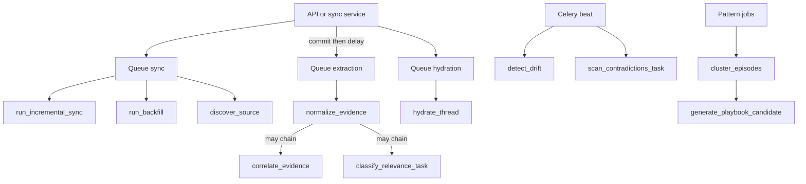

# Workers: Celery and queues

## Summary

You will understand which **background tasks** exist, how they map to **Redis queues**, how async database work runs inside workers, and how **beat** schedules periodic jobs—so you can operate and debug the pipeline without tracing only HTTP.

## Business picture

Ingestion, AI, clustering, and health checks would make the API slow if everything ran in the browser request. **Workers** pick up jobs from a queue, process them with retries, and update the database. Some jobs run on a **schedule** (drift, contradiction scans) like a cron for the platform.

## Technical walkthrough

1. **Celery application** — `workers/celery_app.py` constructs `Celery("contextedge")` with JSON serialization, late acks, prefetch multiplier 1, and `task_routes` mapping task name prefixes to queues:
   - `sync_tasks.*` → **sync**
   - `hydration_tasks.*` → **hydration**
   - `extraction_tasks.*`, `artifact_tasks.*`, `correlation_tasks.*` → **extraction**
   - `pattern_tasks.*` → **pattern**
   - `evaluation_tasks.*` → **evaluation**
   - default queue **default**

2. **Autodiscovery** — `autodiscover_tasks` loads the task modules listed in config so workers register all `@celery_app.task` functions.

3. **Async bridge** — `workers/asyncio_runner.run_async` runs an async callable with a DB session (unit-of-work style) so tasks stay thin wrappers around `services/`.

4. **Representative tasks**
   - **sync:** `discover_source`, `run_backfill`, `run_incremental_sync` (`sync_tasks.py`) — discovery, historical backfill, incremental pull per source object.
   - **extraction:** `normalize_evidence`, `classify_relevance_task`, `generate_embeddings`, `reconstruct_episode_task` (`extraction_tasks.py`).
   - **hydration:** `hydrate_thread` (`hydration_tasks.py`) for fuller thread payloads.
   - **correlation:** `correlate_evidence` (`correlation_tasks.py`).
   - **artifacts:** `extract_attachment_artifact` (`artifact_tasks.py`).
   - **pattern:** `cluster_episodes`, `generate_playbook_candidate` (`pattern_tasks.py`).
   - **evaluation:** `run_evaluation`, `detect_drift`, `scan_contradictions_task` (`evaluation_tasks.py`).

5. **Beat schedule** — Same file defines periodic tasks: `detect_drift` every 6 hours (`args: ("all",)`), `scan_contradictions_task` every 12 hours.

6. **Enqueue from API/services** — `sync_ingestion_queue.queue_normalize_raw_objects` imports `normalize_evidence` and calls `.delay` per raw id after commit. `api/v1/sync.py` and `api/v1/sources.py` enqueue **sync** tasks for retry and backfill. Other paths enqueue correlation, pattern jobs, etc.

7. **Sync queue operations** — Sync tasks only execute if a worker consumes the **sync** queue. See [KNOWN_GAPS.md](./KNOWN_GAPS.md) if jobs stay pending.

## Flow diagram

## Design decisions

- **Multiple queues** — *Why:* isolate slow extraction from quick hydration; operators can scale worker pools per queue. *Tradeoff:* more processes to monitor.

- **Prefetch multiplier 1 + late ack** — *Why:* fair distribution and safer retry on worker crash. *Tradeoff:* slightly lower throughput per worker for tiny tasks.

- **Thin tasks, fat services** — *Why:* same business logic for HTTP and workers. *Tradeoff:* tasks must import services carefully to avoid circular imports (local imports used where needed).

- **JSON task payloads** — *Why:* simple introspection and logging. *Tradeoff:* large blobs must stay in DB/S3, not in task args.

## Code map

| Concern | Module path | Key symbols | Queue |
| --- | --- | --- | --- |
| Celery config | `backend/src/contextedge/workers/celery_app.py` | `celery_app`, `task_routes`, `beat_schedule` | — |
| Async runner | `backend/src/contextedge/workers/asyncio_runner.py` | `run_async` | All async tasks |
| Normalize / classify / episode | `backend/src/contextedge/workers/extraction_tasks.py` | `normalize_evidence`, `classify_relevance_task`, `generate_embeddings`, `reconstruct_episode_task` | extraction |
| Thread hydration | `backend/src/contextedge/workers/hydration_tasks.py` | `hydrate_thread` | hydration |
| Correlation | `backend/src/contextedge/workers/correlation_tasks.py` | `correlate_evidence` | extraction |
| Attachments | `backend/src/contextedge/workers/artifact_tasks.py` | `extract_attachment_artifact` | extraction |
| Patterns | `backend/src/contextedge/workers/pattern_tasks.py` | `cluster_episodes`, `generate_playbook_candidate` | pattern |
| Eval / drift / contradictions | `backend/src/contextedge/workers/evaluation_tasks.py` | `run_evaluation`, `detect_drift`, `scan_contradictions_task` | evaluation |
| Sync | `backend/src/contextedge/workers/sync_tasks.py` | `discover_source`, `run_backfill`, `run_incremental_sync` | sync |
| Enqueue helper | `backend/src/contextedge/services/sync_ingestion_queue.py` | `queue_normalize_raw_objects` | extraction |

## Acme VPN incident (this layer)

After Acme’s raws commit, **extraction** workers normalize and embed VPN evidence; **correlation** links the email RCA to tickets; **pattern** workers may later cluster episodes; **evaluation** beat jobs scan for drift between the new playbook and KB articles overnight.

## Further reading

- [`docs/RUNBOOK.md`](../docs/RUNBOOK.md) — `make celery-dev`, worker commands  
- [03-ingestion-connectors-and-sync.md](./03-ingestion-connectors-and-sync.md) — what enqueues normalize  
- [09-graph-and-correlation.md](./09-graph-and-correlation.md) — what correlation does  
