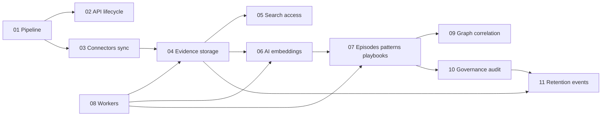

# Plan: codewiki technical blueprint explainers

This document was the **backlog and writing order** for markdown articles in `codewiki/`. The series is **complete**; new edits should follow [EDITORIAL-GUIDE.md](./EDITORIAL-GUIDE.md) and thread the **Acme VPN incident** example.

## Guiding principles

- **Explain the pipeline first**, then vertical slices (search, AI, workers) so readers always know where they are in the flow.
- **Design decisions** must state *why* and *what we gave up* or *what risk remains* (align with “Known Constraints” in the root README where relevant).
- **Function/class level** detail appears in a **Code map** table per article, not buried in prose.
- **Do not duplicate** long command lists from `docs/RUNBOOK.md` or `docs/SETUP_GUIDE.md`; link instead.

## Article map (all published)

| Order | File | Primary focus | Doc + anchor modules |
| --- | --- | --- | --- |
| 1 | [01-end-to-end-pipeline.md](./01-end-to-end-pipeline.md) | Connector → evidence → search → playbook → audit | `main.py`, `api/v1/__init__.py`, `ingestion_persistence.py`, `sync_worker_service.py`, `extraction_tasks.py`, `hybrid_ranker.py`, `celery_app.py` |
| 2 | [02-api-and-request-lifecycle.md](./02-api-and-request-lifecycle.md) | FastAPI, middleware, JWT/service tokens, routing | `main.py`, `middleware/request_context.py`, `middleware/request_audit.py`, `deps.py`, `security_tokens.py`, `api/v1/__init__.py` |
| 3 | [03-ingestion-connectors-and-sync.md](./03-ingestion-connectors-and-sync.md) | Connectors, sync jobs, handoff to normalize | `connectors/base.py`, `connectors/registry.py`, `services/sync_worker_service.py`, `services/sync_ingestion_queue.py`, `api/v1/sync.py`, `api/v1/sources.py` |
| 4 | [04-evidence-normalization-and-storage.md](./04-evidence-normalization-and-storage.md) | Raw offload, `EvidenceItem`, dedupe | `services/object_store.py`, `services/ingestion_persistence.py`, `services/evidence_normalization.py`, `workers/extraction_tasks.py`, `models/evidence.py` |
| 5 | [05-search-hybrid-and-access.md](./05-search-hybrid-and-access.md) | FTS, vectors, hybrid ranker, access, risk | `search/pg_fts.py`, `search/vector_search.py`, `search/hybrid_ranker.py`, `search/access_control.py`, `search/risk_policy.py`, `api/v1/evidence.py` |
| 6 | [06-ai-extraction-and-embeddings.md](./06-ai-extraction-and-embeddings.md) | LiteLLM, embeddings, classifiers, extractors | `ai/provider.py`, `ai/embeddings.py`, `ai/extractors/`, `ai/classifiers/`, `workers/extraction_tasks.py` |
| 7 | [07-episodes-patterns-playbooks.md](./07-episodes-patterns-playbooks.md) | Episodes, patterns, playbook lifecycle | `services/episode_service.py`, `services/pattern_service.py`, `services/playbook_service.py`, `models/episode.py`, `models/pattern.py`, `models/playbook.py`, `api/v1/episodes.py`, `api/v1/patterns.py`, `api/v1/playbooks.py` |
| 8 | [08-workers-celery-queues.md](./08-workers-celery-queues.md) | Queues, tasks, beat | `workers/celery_app.py`, `workers/extraction_tasks.py`, `workers/pattern_tasks.py`, `workers/correlation_tasks.py`, `workers/artifact_tasks.py`, `workers/evaluation_tasks.py`, `workers/hydration_tasks.py` |
| 9 | [09-graph-and-correlation.md](./09-graph-and-correlation.md) | Correlation edges, graph, contradictions | `graph/builder.py`, `graph/queries.py`, `services/correlation_service.py`, `services/contradiction_service.py` |
| 10 | [10-governance-sessions-execution-audit.md](./10-governance-sessions-execution-audit.md) | Sessions, execution, audit, operational events | `services/session_service.py`, `services/execution_service.py`, `middleware/audit.py`, `middleware/request_audit.py`, `services/event_log_service.py`, `api/v1/sessions.py`, `api/v1/execution.py` |
| 11 | [11-retention-and-operational-events.md](./11-retention-and-operational-events.md) | Retention, legal hold, memory class | `services/retention_service.py`, `services/memory_service.py`, `models/events.py`, `schemas/tenant.py` |

## Per-article checklist (for future edits)

```markdown
## Summary
## Business picture
## Technical walkthrough
## Design decisions
## Code map
## Acme VPN incident (this layer)
## Further reading
```

## Cross-linking graph



## Maintenance

- When Alembic head or queue names change, update **01** and **08** and link to `docs/MIGRATIONS.md` or the runbook instead of duplicating procedures.
- If a service is renamed, grep `codewiki/` for the old path and update **Code map** tables.
- When fixing ingestion or worker gaps, update [KNOWN_GAPS.md](./KNOWN_GAPS.md) so it stays accurate.

## Series completion checklist

- [x] Every planned article exists in `codewiki/`.
- [x] [README.md](./README.md) lists each file with a one-line description.
- [x] Mermaid (or equivalent) diagram in **01** and **08**.
