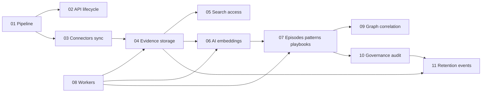

# Plan: codewiki technical blueprint explainers

This document is the **backlog and writing order** for markdown articles in `codewiki/`. Each future file should follow [EDITORIAL-GUIDE.md](./EDITORIAL-GUIDE.md) and thread the **Acme VPN incident** example.

## Guiding principles

- **Explain the pipeline first**, then vertical slices (search, AI, workers) so readers always know where they are in the flow.
- **Design decisions** must state *why* and *what we gave up* or *what risk remains* (align with “Known Constraints” in the root README where relevant).
- **Function/class level** detail appears in a **Code map** table per article, not buried in prose.
- **Do not duplicate** long command lists from `docs/RUNBOOK.md` or `docs/SETUP_GUIDE.md`; link instead.

## Suggested writing order

Order respects dependencies: later articles assume familiarity with earlier ones.

| Order | File | Primary focus | Main code anchors (starting points) |
| --- | --- | --- | --- |
| 1 | `01-end-to-end-pipeline.md` | Single story from connector → evidence → search → playbook → audit; links forward to all other articles | `backend/src/contextedge/main.py`, `backend/src/contextedge/api/v1/__init__.py`, `README.md` architecture snapshot |
| 2 | `02-api-and-request-lifecycle.md` | FastAPI app, middleware (tenant, audit), auth, routing | `main.py`, `middleware/request_context.py`, `middleware/request_audit.py`, `middleware/auth.py`, `api/v1/*.py` |
| 3 | `03-ingestion-connectors-and-sync.md` | Connectors, sync API, pulling external systems into the platform | `connectors/base.py`, `connectors/*`, `services/sync_worker_service.py`, `api/v1/sync.py`, `api/v1/sources.py` |
| 4 | `04-evidence-normalization-and-storage.md` | Raw offload, evidence rows, normalization, dedupe story | `services/object_store.py`, `services/ingestion_persistence.py`, `services/evidence_normalization.py`, `models/evidence.py` |
| 5 | `05-search-hybrid-and-access.md` | FTS, vectors, hybrid ranker, access-aware retrieval | `search/pg_fts.py`, `search/vector_search.py`, `search/hybrid_ranker.py`, `search/access_control.py`, `api/v1/evidence.py` |
| 6 | `06-ai-extraction-and-embeddings.md` | LLM provider, extractors, embeddings, classifiers | `ai/provider.py`, `ai/embeddings.py`, `ai/extractors/*`, `ai/classifiers/*` |
| 7 | `07-episodes-patterns-playbooks.md` | Domain objects and services for operational memory artifacts | `services/episode_service.py`, `services/pattern_service.py`, `services/playbook_service.py`, `models/episode.py`, `models/pattern.py`, `models/playbook.py`, `api/v1/episodes.py`, `api/v1/patterns.py`, `api/v1/playbooks.py` |
| 8 | `08-workers-celery-queues.md` | Queues, tasks, async processing stages | `workers/celery_app.py`, `workers/extraction_tasks.py`, `workers/pattern_tasks.py`, `workers/correlation_tasks.py`, `workers/artifact_tasks.py`, `workers/evaluation_tasks.py`, `workers/hydration_tasks.py` |
| 9 | `09-graph-and-correlation.md` | Graph edges, correlation, contradictions | `graph/builder.py`, `graph/queries.py`, `services/correlation_service.py`, `services/contradiction_service.py` |
| 10 | `10-governance-sessions-execution-audit.md` | Resolution sessions, execution, audit trail | `models/session.py`, `services/session_service.py`, `services/execution_service.py`, `api/v1/sessions.py`, `api/v1/execution.py`, `middleware/audit.py`, `services/audit_service.py`, `services/event_log_service.py` |
| 11 | `11-retention-and-operational-events.md` | Data lifecycle, policies, operational events | `services/retention_service.py`, `models/events.py`, tenant policy schemas in `schemas/tenant.py`, related API if exposed |

## Per-article checklist (copy into each new doc)

```markdown
## Summary
## Business picture
## Technical walkthrough
## Design decisions
## Code map
## Acme VPN incident (this layer)
## Further reading
```

## Cross-linking graph



## Maintenance

- When Alembic head or queue names change, update the **pipeline** and **workers** articles and the root `README.md` only if it is the single source of truth for that fact; otherwise link to `docs/MIGRATIONS.md` or runbook sections.
- If a service is renamed, grep `codewiki/` for the old path and update **Code map** tables.

## Done criteria for the whole series

- Every row in the table above has a corresponding markdown file in `codewiki/`.
- [README.md](./README.md) index marks each file as **Published** with a one-line description.
- At least one diagram (Mermaid or ASCII) in `01-end-to-end-pipeline.md` and one in `08-workers-celery-queues.md`.
