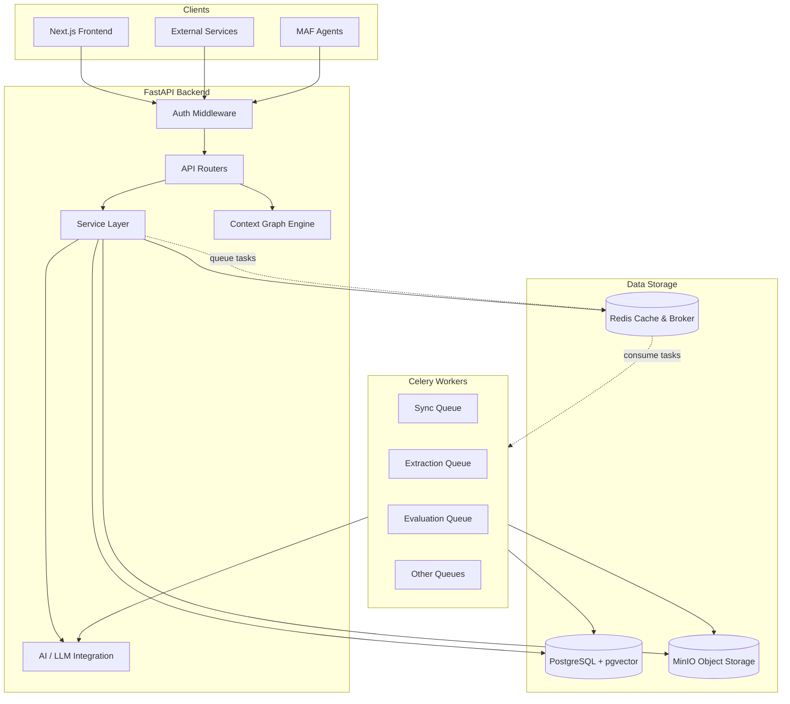
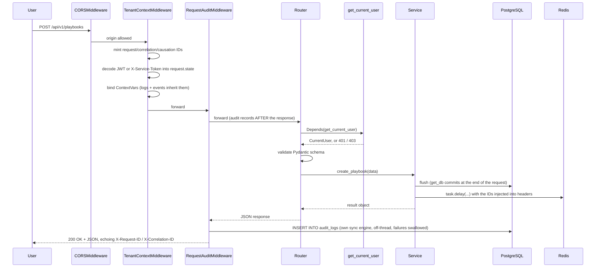
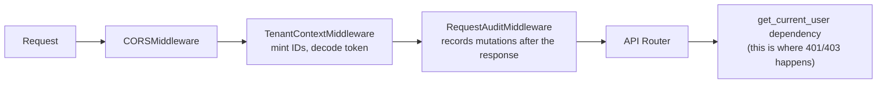
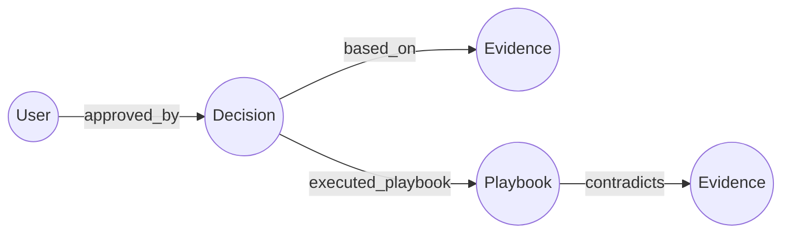

# ContextEdge — Project Architecture

This document explains the architecture of the ContextEdge platform. ContextEdge is an operational memory and living playbook system. It captures evidence from IT systems, analyzes it using AI, and presents it through a knowledge graph to help solve IT issues. 

This guide is written in simple English for developers who are new to the project. It covers what each part of the system does, why it exists, and how the parts talk to each other.

**Accurate as of 2026-08-19.** Every mechanism claim below carries a `file:line` citation you can click through. Paths are relative to the repository root. If a citation and this prose ever disagree, the code wins — say so in a PR and fix the doc.

**The running example.** Throughout the docs we trace one incident: the **Acme VPN incident** — ServiceNow incident `INC0010427`, "VPN tunnel flapping on `vpn-gw-east-01`", with the Teams working thread and the engineer's email that quotes the ticket number. Reuse this example rather than inventing a new one, so a reader can follow one record end to end across every document.

---

## 1. Architecture Overview

ContextEdge uses a **modular monolith** design. This means all the backend code lives in one application, but it is organized into clear, separate layers. It uses FastAPI for the web server, PostgreSQL for the database, Celery for background tasks, and Next.js for the frontend dashboard. 

### 1.1 System Diagram (Mermaid)



### 1.2 System Diagram (ASCII)

```text
+---------------------------------------------------------+
|                      CLIENTS                            |
|  [ Next.js UI ]    [ Service APIs ]    [ MAF Agents ]   |
+--------+------------------+-------------------+---------+
         |                  |                   |
         v                  v                   v
+---------------------------------------------------------+
|                  FASTAPI BACKEND                        |
|                                                         |
|  +---------------------------------------------------+  |
|  |             Auth & Context Middleware             |  |
|  +---------------------------------------------------+  |
|                           |                             |
|  +------------------------v--------------------------+  |
|  |                 API Routers                       |  |
|  +------------------------+--------------------------+  |
|                           |                             |
|  +------------------------v--------------------------+  |
|  |                Service Layer                      |  |
|  |  (Business Logic, Context Graph, AI Integration)  |  |
|  +------+-----------------+-------------------+------+  |
|         |                 |                   |         |
+---------|-----------------|-------------------|---------+
          |                 |                   |
    +-----v-----+     +-----v-----+       +-----v-----+
    |           |     |           |       |           |
    | PostgreSQL|     |   Redis   |       |   MinIO   |
    | (+pgvector|     | (Broker & |       | (Artifacts|
    |           |     |  Cache)   |       |  & Files) |
    +-----------+     +-----+-----+       +-----------+
                            |
                      +-----v-----+
                      |           |
                      |  Celery   |
                      |  Workers  |
                      |           |
                      +-----------+
```

---

## 2. Layer Architecture

The ContextEdge backend is divided into strict layers. A request comes in at the top and flows down to the database. 

### 2.1 Presentation Layer (Frontend)
- **What it is:** The user interface built with Next.js 16 (App Router), React, Tailwind CSS, and shadcn/ui.
- **Why we need it:** To give human reviewers (like IT support engineers) a place to manage playbooks, review AI decisions, and explore the context graph.
- **Files involved:** `frontend/src/app`, `frontend/src/components`.
- **Connections:** It calls the FastAPI backend via HTTP (REST). It uses TanStack Query for data fetching.

### 2.2 API Layer (FastAPI routers)
- **What it is:** The entry point for all HTTP requests. These are FastAPI routers mounted under `/api/v1`.
- **Why we need it:** To accept web requests, validate the incoming JSON data using Pydantic, and return JSON responses.
- **Files involved:** `backend/src/contextedge/main.py`, files in `backend/src/contextedge/api/v1/`.
- **Connections:** It receives requests from the frontend and passes validated data to the Service Layer.

### 2.3 Middleware Layer
- **What it is:** Code that runs before the API router. It sets up the request context (IDs, tenant, roles) and records mutating requests.
- **Why we need it:** To make sure every request is tracked with a unique ID (correlation ID) without writing the same code in every API route.
- **Files involved:** Two middlewares are actually registered — `TenantContextMiddleware` (`middleware/request_context.py`) and `RequestAuditMiddleware` (`middleware/request_audit.py`), added in `create_app` (backend/src/contextedge/main.py:119-123). `middleware/auth.py` and `middleware/audit.py` also exist in the folder but are **not** in the registered chain; do not reason about the request path from them.
- **Important:** the middleware *decodes* the token to stamp `request.state`, it does not *enforce* it. Enforcement is the `get_current_user` dependency on each route (backend/src/contextedge/deps.py:72-114). An endpoint that forgets the dependency is unauthenticated even though the middleware ran.
- **Connections:** Sits between the web server (Uvicorn) and the API routers. 

### 2.4 Service Layer
- **What it is:** The heart of the application. It contains all the business rules. 
- **Why we need it:** To keep business logic separate from HTTP routing and Celery tasks. 
- **Files involved:** Files in `backend/src/contextedge/services/`.
- **Connections:** It is called by the API layer and Celery workers. It calls the Repository Layer and AI layer.

### 2.5 Repository/Data Access Layer
- **What it is:** The layer that talks to the database using SQLAlchemy (an Object Relational Mapper).
- **Why we need it:** To translate Python objects into SQL queries and keep database code organized.
- **Files involved:** `backend/src/contextedge/models/`, `backend/src/contextedge/database.py`.
- **Connections:** Called by the Service Layer. Connects directly to PostgreSQL.

### 2.6 Database Layer
- **What it is:** A PostgreSQL database with the `pgvector` extension.
- **Why we need it:** To store all application data, including users, playbooks, and evidence. The `pgvector` extension is used to store AI embeddings for semantic search.
- **Files involved:** `docker-compose.yml`, `backend/alembic/`.
- **Connections:** Accessed by the backend and workers.

### 2.7 Queue Layer
- **What it is:** Celery task queues backed by Redis as the message broker (Redis DB 1) and result backend (DB 2).
- **Why we need it:** To run slow tasks in the background without making the user wait — talking to a model, syncing from an external system, embedding thousands of chunks.
- **Files involved:** `backend/src/contextedge/workers/celery_app.py`, files in `backend/src/contextedge/workers/`.
- **Connections:** The API layer pushes tasks to Redis. Celery workers pull tasks from Redis.
- **There are eight queues, not one**, and consuming all of them is a deployment requirement rather than a tuning choice. See §5.2.

### 2.8 Storage Layer
- **What it is:** An S3-compatible object storage server (MinIO is used locally).
- **Why we need it:** To store attachment artifacts, and to keep raw connector payloads out of the database once they get large.
- **The rule, precisely:** a raw payload is stored **inline in PostgreSQL as JSONB**. Only when it exceeds `OFFLOAD_THRESHOLD_BYTES = 32_768` does it go to object storage, with the database row keeping the stub `{"_offloaded": true, "size_bytes": N}` plus a key (backend/src/contextedge/services/ingestion_persistence.py:16, 84-87). Attachment bytes always go to object storage.
- **The trap:** any SQL that filters or sorts on `raw_payload` silently skips the offloaded rows, because they only hold the stub. The biggest records — the longest tickets and articles — are exactly the ones such a query misses, and it succeeds while doing so. Prefer a re-sync over a SQL backfill.
- **Files involved:** `backend/src/contextedge/services/object_store.py`.
- **Connections:** Read and written by the Service Layer and by workers.

### 2.9 AI Layer
- **What it is:** The code that talks to Large Language Models (LLMs). The shipped default provider is **Google Vertex AI (Gemini)**; LiteLLM makes OpenAI, Anthropic, and others reachable through the same interface.
- **Why we need it:** To classify evidence, resolve identities, extract decisions, synthesize episodes and patterns, generate playbooks, and produce embeddings.
- **Files involved:** Files in `backend/src/contextedge/ai/` — `provider.py` (the single funnel), `prompts/` (versioned immutable prompts), `classifiers/`, `extractors/`, `generators/`, `observability.py`, `resilience.py`.
- **Connections:** Called by the Service Layer and Celery workers — **always through `llm_complete`**, never by calling LiteLLM directly, so budget gates, usage recording, the circuit breaker, and the fallback cannot be bypassed. See §7.1.

### 2.10 Graph Layer
- **What it is:** The Context Graph Engine that models relationships between entities (like users, computers, incidents, and playbooks).
- **Why we need it:** To allow the system to answer complex questions by traversing relationships, rather than just using text search.
- **Files involved:** `backend/src/contextedge/graph/`, `backend/src/contextedge/models/pattern.py`.
- **Connections:** Built on top of PostgreSQL using adjacency list tables (`graph_edges`).

### 2.11 Integration Layer (MAF)
- **What it is:** The Microsoft Agent Framework (MAF) integration.
- **Why we need it:** To allow external AI agents to read the Context Graph and inject relevant knowledge into their prompts.
- **Files involved:** `backend/src/contextedge/integrations/maf/`.
- **Connections:** Exposes the graph as MAF tools and context providers.

---

## 3. Request Lifecycle

When a user clicks a button in the frontend, this is what happens on the backend:



Two details this diagram is deliberately explicit about:

- **The middleware decodes the token; the route's dependency enforces it.** A route that forgets `Depends(get_current_user)` is unauthenticated even though the middleware ran.
- **The audit row is written after the response, on its own connection, and its failures are swallowed.** Auditing must never turn an allowed request into a failed one.

One more thing happens invisibly here: the `request_id` and `correlation_id` minted at the top are injected into the Celery message headers when the service calls `.delay(...)`, re-bound on the worker, and inherited by every log line and operational event that task writes. That is how a single ID joins "the operator clicked retry" to "these model calls cost this much" (backend/src/contextedge/workers/celery_app.py:25-80).

---

## 4. Authentication Architecture

ContextEdge uses a stateless authentication model. The system must know *who* is making the request and *which tenant* (company or organization) they belong to.

### 4.1 JWT Flow (For Humans)
1. The user logs in (or uses SSO).
2. The server creates a JSON Web Token (JWT). The token contains the `user_id`, `tenant_id`, and `roles`.
3. The JWT is cryptographically signed using `settings.jwt_secret_key`.
4. The frontend sends this token in the `Authorization: Bearer <token>` header on every API request.
5. `TenantContextMiddleware` decodes the token and attaches the tenant ID to the request state (`request.state.tenant_id`).

### 4.2 Service Token Flow (For Machines)
1. External services or agents cannot log in via the UI. Instead, they use a static service token.
2. The service token is passed in the `X-Service-Token` header. **It takes precedence over a Bearer token** when both are present, and an *invalid* service token is a 403 rather than a fallthrough to JWT (backend/src/contextedge/deps.py:72-114).
3. The token is looked up in the `SERVICE_TOKENS_JSON` configuration, which maps token → `{tenant_id, user_id, email, roles[, allowed_domain_ids]}` (backend/src/contextedge/security_tokens.py:12-36).
4. The resulting principal has `principal_type = "service_account"`. **Omitting `allowed_domain_ids` makes the token tenant-wide** — that is intentional, but treat it as a decision you are making, not a default to skip past. Routes that consult the allowlist (runtime match, the agent projection) enforce it; a token without one sees the whole tenant.

**A note on login itself** (backend/src/contextedge/api/v1/auth.py:35-101), because two details surprise people: an email address is unique *per tenant*, not globally, so the same person can exist in two tenants — and if the same email and password work in both, login returns 401 "ambiguous account" rather than guessing. The no-candidate path also verifies against a dummy hash so response timing cannot be used to enumerate valid email addresses.

### 4.3 Middleware Chain

Starlette wraps the **last** middleware added as the **outermost** layer. `create_app` adds `RequestAuditMiddleware`, then `TenantContextMiddleware`, then `CORSMiddleware` (backend/src/contextedge/main.py:122-130), so the order a request actually travels is the reverse of the order in the source:



Two details worth remembering:

- `TenantContextMiddleware` skips `/health`, `/ready`, `/docs`, `/redoc`, `/openapi.json`, `/metrics`, and `/api/v1/auth/login` (backend/src/contextedge/middleware/request_context.py:77-85).
- `RequestAuditMiddleware` runs **after** the response for `POST/PATCH/PUT/DELETE` under `/api/v1`. It writes one `audit_logs` row through a separate synchronous engine on a worker thread and swallows its own failures, so auditing can never turn a good request into a 500 (backend/src/contextedge/middleware/request_audit.py:25-124).

### 4.4 Request Context Propagation
The middleware uses Python `contextvars` to store the `request_id`, `correlation_id`, and `tenant_id`. This allows any function deep in the code (like the database logger or AI caller) to access these IDs without having to pass them explicitly through every function argument.

---

## 5. Worker Architecture

ContextEdge relies heavily on background processing using Celery. This ensures the web API remains fast even when doing slow work like talking to LLMs.

### 5.1 Celery Setup
- **Broker:** Redis database 1 holds the queue of messages. **Result backend:** Redis database 2. The app's own cache is Redis database 0 (backend/src/contextedge/config.py:26-28).
- **File:** Configuration is in `workers/celery_app.py`.
- **Core settings** (backend/src/contextedge/workers/celery_app.py:192-200): JSON serialization only, UTC, `task_track_started=True`, `task_acks_late=True` (a crashed worker's task is re-delivered, which is what makes the multi-process Windows topology safe), `worker_prefetch_multiplier=1`.
- **Broker resilience** (celery_app.py:216-224): retry forever (`broker_connection_max_retries=None`), socket keepalive, 30-second health checks. This exists because on the Windows dev box Redis is reached through WSL's port relay, which drops TCP connections under load — measured 2026-08-17, one blip silently killed four of eight workers (comment at celery_app.py:201-215).
- **Startup gate:** a worker refuses to start when the database revision is behind the code's Alembic head. It logs `worker.migration_mismatch_refusing_to_start` and raises `SystemExit` so a supervisor restart-loops until someone runs `alembic upgrade head` (celery_app.py:83-139). "No `alembic_version` table at all" is treated as the most definite mismatch, not a transient error (celery_app.py:118-121).

### 5.2 Queue Topology

There are **eight** queues. Separate lanes exist because one FIFO queue let bulk ingestion starve everything downstream of it — the failure was silent, so it deserves its own note below.

| Queue | Carries | Why it is separate |
|---|---|---|
| `default` | `extraction.classify_relevance`, `review_queue.*`, `identity.*`, `maintenance.*` | Fast lane. A ~2.5s relevance gate call must not queue behind 20-60s episode tasks; 500 classifications once starved ~40 minutes (celery_app.py:229-233) |
| `sync` | `sync.trigger_scheduled_syncs`, `sync.run_backfill`, `sync.run_incremental_sync` | Isolates connector I/O from the extraction backlog (celery_app.py:227) |
| `hydration` | `hydration.hydrate_thread` | Thread fetches hit external APIs and can be rate-limited independently (celery_app.py:228) |
| `extraction` | `extraction.normalize_evidence`, `artifact.*`, `extraction.backfill_evidence_types`, `extraction.rebuild_identity_snapshots` | The bulk lane (celery_app.py:269-270) |
| `correlation` | `extraction.correlate_evidence`, `extraction.reconstruct_episode`, `extraction.compute_evidence_baseline` | **Graph lane.** These three are the chain that turns evidence into a context graph, and each was queued behind the normalization that produces it. Measured on the 2026-08-17 Zoho backfill: the extraction queue was *growing* by ~70 tasks/minute at 8,255 deep; correlation had been dispatched and never once received; episodes, patterns and playbooks were all zero after 193 evidence items (celery_app.py:234-258) |
| `embedding` | `extraction.chunk_evidence`, `extraction.embed_chunks_batch` | **Retrieval lane.** An unembedded chunk is invisible to vector search. Same run: 1,879 chunks existed, 289 embedded (15%), with 309 embed tasks queued behind 10,226 normalizations — evidence ingested and silently unretrievable (celery_app.py:259-268) |
| `pattern` | `pattern.cluster_episodes`, `pattern.generate_playbook_candidate`, `pattern.deduplicate_knowledge` | Clustering has no advisory lock, so this queue is consumed by exactly one worker and its tasks serialize behind each other (celery_app.py:271) |
| `evaluation` | `evaluation.*` — drift, contradictions, retention, verification, AI episode review, issue signatures, correlation suggestions, CMDB warming | Periodic sweeps (celery_app.py:272) |

> **Deployment trap.** A worker fleet that does not consume `correlation` and `embedding` finishes normalization and then silently builds no episodes and embeds no chunks. `backend/dev.py:16` is the authoritative queue list and its comment records that exactly this happened for a month. Start workers with `-Q default,sync,hydration,extraction,correlation,embedding,pattern,evaluation`.

### 5.3 Task Routing

`task_routes` in `celery_app.py` matches on the **task name** and is evaluated **in order**, so an exact key beats a later wildcard (backend/src/contextedge/workers/celery_app.py:226-279). For example `extraction.classify_relevance` is listed before `extraction.*`, which is how it reaches the fast lane instead of the bulk lane.

Module-path routing (`contextedge.workers.*` → `default`, celery_app.py:278) is only the last-resort fallback for tasks that never got a short name. Anything unmatched lands on `task_default_queue = "default"` (celery_app.py:280). Two families rely on that: `identity.*` and `maintenance.*` have no explicit route, so they run on `default` — a doc that says "identity reconciliation runs on the evaluation queue" is wrong.

### 5.4 Signal Handlers
Celery signals carry the request's tracing IDs from the HTTP call into the task (backend/src/contextedge/workers/celery_app.py:25-80).
1. `before_task_publish` copies `request_id`, `correlation_id`, and `causation_id` out of the ContextVar into the outgoing message headers, using `setdefault` so a caller-set header is never clobbered (celery_app.py:25-42).
2. `task_prerun` reads those headers back and re-binds the ContextVar for the task's lifetime. The reset token is stored per task id because a concurrent pool interleaves tasks (celery_app.py:45-68).
3. `task_postrun` pops and resets the token, tolerating a double reset (celery_app.py:71-80).

The payoff: an `llm.usage` operational event written while classifying the Acme VPN ticket carries the same `correlation_id` as the operator's "retry sync" click, so one ID joins the click to the spend.

### 5.5 Beat Scheduler

One beat process only — a second one double-dispatches every entry. All fan-out tasks take the literal sentinel `"all"` and iterate tenants internally with per-tenant exception isolation. Full schedule (backend/src/contextedge/workers/celery_app.py:281-384):

| Entry | Task | Interval |
|---|---|---|
| `detect-drift-every-6h` | `evaluation.detect_drift` | 6h |
| `scan-contradictions-every-12h` | `evaluation.scan_contradictions_task` | 12h |
| `trigger-syncs-every-15m` | `sync.trigger_scheduled_syncs` | 15m |
| `reconcile-identities-daily` | `identity.reconcile_identities` | 24h |
| `calibrate-decision-confidence-daily` | `evaluation.calibrate_decision_confidence` | 24h |
| `mine-decision-patterns-daily` | `evaluation.mine_decision_patterns` | 24h |
| `cleanup-hard-deleted-daily` | `evaluation.cleanup_hard_deleted_evidence` | 24h |
| `reconcile-graph-relationships-every-6h` | `evaluation.reconcile_graph_relationships` | 6h |
| `retention-archive-daily` | `evaluation.apply_retention_archive` | 24h |
| `retention-purge-weekly` | `evaluation.purge_archived` | 7d |
| `verify-executions-every-15m` | `evaluation.verify_executions` | 15m |
| `detect-fleet-groups` | `evaluation.detect_fleet_groups` | 30m |
| `deduplicate-knowledge-hourly` | `pattern.deduplicate_knowledge` | 1h |
| `ai-review-episodes-hourly` | `evaluation.ai_review_episodes` | 1h |

There is deliberately **no** beat entry for `pattern.cluster_episodes` — clustering is dispatched when episodes are approved and by the manual `POST /api/v1/patterns/cluster` route (see §11).

Two sweeps defer themselves while a bulk ingest is landing rather than churning drafts the next burst would regrow: the hourly dedup sweep and the AI review sweep both call `tenant_pipeline_active`, which reports a tenant active when more than 50 evidence rows **or** more than 30 episodes appeared in the last 10 minutes (backend/src/contextedge/workers/pattern_tasks.py:736-748).

### 5.6 Worker Sessions and the Windows Topology

Every task body is an `async def work(db)` handed to `run_async`, which creates a **fresh NullPool engine and one session per task**, commits on success, rolls back on exception, then disposes the engine (backend/src/contextedge/workers/asyncio_runner.py:10-34). Nothing — no event loop, no connection — is shared across tasks.

This is why every task in the codebase does its `.delay()` fan-out *after* `run_async` returns. It is not stylistic. Dispatching inside the transaction fails in both directions: on rollback the row disappears but the queued task does not, and on success a worker can pick the task up in the window before the commit lands, read "not found", and return `skipped` — **the row is real, the task is gone, and nothing retries.** For service code that does not own its own commit (anything called inside `run_async` or a FastAPI `get_db` dependency), `services/deferred_dispatch.py` provides `dispatch_after_commit(db, task_name, args)`, which sends on the same routing rules `.delay()` would use but only once the transaction is durable.

On Windows the prefork pool is unusable, and `-P threads` is unusable for the LLM-bearing lanes as well: litellm holds asyncio locks bound to the loop that created them, so a threads pool raises "Lock is bound to a different event loop" on every enrichment call. The shipped shape is two worker roles (full commands in [RUNBOOK.md](RUNBOOK.md) "Worker topology"):

- **Worker A (parallel):** N separate *processes*, each `-P solo` with its own node name, consuming the high-volume lanes. Ticket processing is ~95% waiting on the LLM, so process parallelism is close to linear.
- **Worker B (serialized):** one `-P solo` worker for `sync,pattern,evaluation`. Clustering and playbook generation operate on the whole graph and have no advisory lock, so two concurrent runs could mint duplicate patterns.
- **Beat:** exactly one instance.

What makes the split safe: a fresh engine per task (above), a per-source-object Postgres advisory lock for sync (`pg_try_advisory_xact_lock`, backend/src/contextedge/services/sync_worker_service.py:379-395), and `task_acks_late=True` re-delivering a crashed task.

---

## 6. Database Architecture

The system uses PostgreSQL for structured data and vector search.

### 6.1 PostgreSQL Configuration
- We use the `asyncpg` driver to connect to PostgreSQL asynchronously. This prevents the web server from blocking while waiting for the database.
- The connection string is defined in `settings.database_url`.

### 6.2 pgvector Extension — and the halfvec detail you must not skip
- We use `pgvector` to store mathematical representations of text (embeddings). Every embedding in the system is **3,072 dimensions** (`EMBEDDING_DIMENSIONS`, backend/src/contextedge/search/vector_ops.py:22), and the provider hard-fails a model that returns any other size (backend/src/contextedge/ai/provider.py:787-793).
- **pgvector's HNSW index on the plain `vector` type caps at 2,000 dimensions.** 3,072 is over that cap, so for a long time the "HNSW indexes" in migrations `0021` and `0030` never actually existed and every similarity query was a sequential scan.
- The fix is migration `0032`: HNSW **expression** indexes built over `(embedding::halfvec(3072))` with `halfvec_cosine_ops`, `m=16`, `ef_construction=64`, on all four embedding columns (`evidence_items`, `evidence_chunks`, `decisions`, `episodes`). `halfvec` is half precision and supports up to 4,000 dimensions at negligible recall cost.
- **Consequence for anyone writing a query:** you must order by the *same expression the index was built on*. Route every cosine ordering through `halfvec_cosine_distance(column, embedding)` (backend/src/contextedge/search/vector_ops.py:40-45). A bare `column.cosine_distance(...)` compiles fine, returns correct rows, and is a guaranteed sequential scan (vector_ops.py:11-15).
- **Recall tuning:** the indexes are global across tenants while every query post-filters by `tenant_id`. At pgvector's default `ef_search = 40`, a small tenant's rows can be absent from the candidate set entirely and the query silently returns fewer rows than asked for. Callers run `await tune_ann_recall(db)` first, which issues `SET LOCAL hnsw.ef_search = 200` for the transaction (`ANN_EF_SEARCH`, vector_ops.py:31-37).
- **Deployment requirement:** `halfvec` needs the pgvector server extension ≥ 0.7. `docker-compose.yml` pins `pgvector/pgvector:pg16`. An environment stamped at an earlier revision of `0032` never re-executes it and stays on sequential scans — see [codewiki/KNOWN_GAPS.md](../codewiki/KNOWN_GAPS.md).

### 6.3 Connection Pooling (Async)
- The **API** uses a pooled engine: `pool_size=20`, `max_overflow=10`, `pool_timeout=30` (backend/src/contextedge/database.py:19-21). `get_db` yields one session per request and commits only if the session is still active (database.py:29-42).
- **Celery workers** use `NullPool` with a brand-new engine per task (see §5.6). The cost is real and worth stating: each running task holds its own connections, roughly 2-3× your concurrency in total, so size Postgres `max_connections` against worker concurrency, not against the API pool.

### 6.4 Session Management
- `database.py` defines an `async_sessionmaker`.
- The FastAPI dependency `get_db` yields a database session for a web request. It automatically calls `session.commit()` if the request is successful, and `session.rollback()` if there is an error.
- Background workers use a similar wrapper (`run_async` or raw sessions) to guarantee that database changes are committed or rolled back safely.

---

## 7. AI Architecture

ContextEdge uses Large Language Models (LLMs) to understand unstructured text.

### 7.1 LLM Provider Abstraction — one funnel

Every model call in the system goes through `llm_complete` in `backend/src/contextedge/ai/provider.py` (line 177), including the JSON and vision variants. That is deliberate: budget gates, usage recording, the circuit breaker, the timeout, and the fallback model cannot be bypassed by a new call site. In order, one call does:

1. **Budget gate** — when the caller passes both `tenant_id` and `db`, `check_budget` runs *before* any tokens are spent. `action="block"` raises `TenantBudgetExceeded`; `action="warn"` logs and proceeds (provider.py:234-285). A tenant with no `tenant_llm_budgets` row falls back to deployment defaults: 2,000,000 tokens/day, $25/day, action `block` (backend/src/contextedge/config.py:194-198).
2. **Output-token clamp** — `min(caller's max_tokens, llm_task_output_tokens[task] or llm_max_output_tokens)`. The global ceiling is 4096; `playbook`, `extraction`, and `pattern` override it to 16384 (config.py:95, 132-138). The long comment above that map is worth reading once: a 4096 ceiling silently overruled a caller that asked for 16384, the JSON-repair path salvaged the truncated prefix, and a playbook was persisted with **zero steps** while the task reported success (config.py:96-131).
3. **Attempt with resilience** — an in-process per-model circuit breaker (opens after 5 consecutive failures, 60s cooldown) and a 120s call timeout (backend/src/contextedge/ai/resilience.py:28-30).
4. **One fallback attempt** — if `settings.llm_fallback_model` is set, a failed primary call retries once there, and usage is recorded against the model that actually served (provider.py:365-380; config.py:80-82).
5. **`finally: record_llm_usage`** — always, including on error, because an errored call still consumed provider-side tokens (provider.py:385-405).

Prompt caching markers (`cache_control: ephemeral`) are sent only to Anthropic/OpenAI/Azure prefixes. Vertex/Gemini is deliberately excluded: above roughly 3K characters of system prompt, LiteLLM turns the marker into a Vertex context-cache resource whose creation 404s and every call fails outright (provider.py:152-174).

### 7.2 Embedding Pipeline
- **Model:** whatever `DEFAULT_EMBEDDING_MODEL` names in your environment. The code default in `config.py:58` is `text-embedding-3-small`, which returns 1,536 dimensions and would be rejected by the 3,072-dimension check — real deployments override it in `.env`. Read this as "the configured 3,072-dimension embedding model", not as a literal fact about the running system.
- **Parent embedding:** `_ensure_embedding` embeds `title + body[:8000]` inline during normalization (backend/src/contextedge/workers/extraction_tasks.py:65-70). Empty text yields a zero vector rather than an error.
- **Chunking:** long evidence is also split into `evidence_chunks`, each with its own embedding. `get_chunker(source_type, evidence_type)` picks the chunker — record shape beats source type, so a knowledge-base article routes to the heading-aware **document** chunker even though it arrived from a ticket source (backend/src/contextedge/services/chunkers/registry.py:116-143). Ticket sources get the **ticket** chunker, Gmail/Teams the **thread** chunker, attachments the **attachment** chunker, everything else the **fallback** chunker.
- **Inline vs async dispatch:** bodies under `INLINE_CHUNK_BUDGET_BYTES = 16 KB` from an allowlisted source are chunked inside the normalize transaction; everything else is handed to `extraction.chunk_evidence` so a big attachment cannot stall ingest (extraction_tasks.py:54-62, 99-119).
- **Chunk embedding** happens in `extraction.embed_chunks_batch`, in batches of 32, and — unlike the parent embedding — it *is* budget-gated and cost-attributed (backend/src/contextedge/workers/chunk_tasks.py:51, 234-263). Failures break out of the loop without raising, leaving `embedding IS NULL` rows for the next replay.

### 7.3 Prompt Registry
- Prompts live in `backend/src/contextedge/ai/prompts/` as frozen `Prompt(name, version, system, user_template)` dataclasses, registered at package import (backend/src/contextedge/ai/prompts/__init__.py:39-75).
- **A shipped version is never edited.** New behaviour ships as a new version and the default moves. Registering a second default for the same name raises.
- **Per-tenant A/B:** `settings.tenant_prompt_variants_json` maps `{"<tenant-uuid>": {"relevance": "v3"}}`. Resolution order is tenant override → registered default → alphabetically-last version with a loud warning. An unknown prompt *name* raises `KeyError` (fail loud); malformed config degrades to an empty map so bad JSON can never crash ingest (prompts/__init__.py:85-162; config.py:238-243).
- Current defaults, read from the registry on 2026-08-19 — the registration line is `default=True` in each family module, so verify there rather than trusting this list after a change:

  | Prompt family | Registered versions | Default | Where |
  |---|---|---|---|
  | `relevance` | v1, v2, v3 | **v2** — v3 is registered but deliberately not default; asking the gate call to also emit claims moved half the borderline labels | relevance.py:79 |
  | `message_function` | v1 | v1 | message_function.py:57 |
  | `identity` | v1-v4 | **v3** | identity.py:234 |
  | `identity_adjudication` | v1, v2 | v2 | identity.py:482 |
  | `identity_reconciliation` | v1 | v1 | identity.py:543 |
  | `decision` | v1, v2 | v2 | decision.py:64 |
  | `episode` | v1, v2, v3 | **v3** — adds field-level source-authority rules and structured contradictions | episode.py:255 |
  | `episode_review` | v1 | v1 | episode_review.py:56 |
  | `pattern` | v1, v2 | v2 | pattern.py:100 |
  | `playbook` | v1-v6 | **v6** | playbook.py:418 |
  | `knowledge_applicability` | v1 | v1 | applicability.py:77 |
  | `issue_signature` | v1 | v1 | issue_signature.py:56 |
  | `contradiction` | v1 | v1 | contradiction.py:26 |

  Older versions stay registered and immutable on purpose: evaluation baselines are pinned to a version, so deleting one would silently invalidate a comparison.

### 7.4 Model Selection
Models are routed per task through `MODEL_ROUTING` (backend/src/contextedge/ai/provider.py:47-53), reading `Settings` (backend/src/contextedge/config.py:56-67). The defaults today are **Google Vertex AI Gemini**, not OpenAI:

| Task lane | Model | Note |
|---|---|---|
| `classification` | `vertex_ai/gemini-2.5-flash` | relevance gate, message function, identity, decisions |
| `extraction` | `vertex_ai/gemini-2.5-flash` | episode synthesis, issue signatures, applicability |
| `pattern` | `vertex_ai/gemini-2.5-flash` | deliberately **not** promoted until its own A/B (config.py:59-66) |
| `playbook` | `vertex_ai/gemini-3.7-flash` | moved on the 2026-08-17 A/B: grounded step share 0.70 → 0.81, latency halved |
| `embedding` | `settings.default_embedding_model` | must return 3,072 dimensions |

**Thinking budgets** are keyed on prompt name, not task: `llm_thinking_budgets = {"relevance": 0}` is the only entry (config.py:188-190). Everything else keeps the provider's dynamic thinking, because a controlled test showed identity-adjudication confidence dropping 0.95 → 0.80 under a cap — and with the person auto-link threshold at exactly 0.95, that silently diverts auto-links into the review queue (config.py:156-167).

---

## 8. Context Graph Architecture

The Context Graph is how ContextEdge understands relationships across different systems. It does not try to copy a CMDB (Configuration Management Database). Instead, it links things together.

### 8.1 Node Types and Edge Types
- **Nodes** are things: `user`, `playbook`, `pattern`, `episode`, `evidence`, `decision`, `entity`, `issue_signature`, and more.
- **Edges** are relationships: `derived_from`, `belongs_to`, `based_on`, `supported_by`, `affects_ci`, `caused_by_change`, `mentions_identity`, and so on.
- All edges are stored in a single table called `graph_edges` (backend/src/contextedge/models/pattern.py:174-273). Columns worth knowing: `source_node_type`/`source_node_id`, `target_node_type`/`target_node_id`, `edge_type`, `weight`, `confidence`, `metadata_extra`, `valid_from`, `valid_to`, plus `tenant_id` and `domain_id`.
- **`weight` and `confidence` are different things.** `weight` is traversal importance ("a better match should matter more when walking the graph"); `confidence` is belief ("how sure are we this relationship is true"). Callers pass both when they mean both (backend/src/contextedge/graph/builder.py:63-72).
- **The vocabulary is closed.** `graph/edge_types.py` declares every writable edge type in five semantic groups, and `require_registered` enforces it inside `add_edge` / `ensure_edge` / `close_edge` / `replace_edge`. Before this, a typo at a write site produced a real, queryable edge that the agent projection silently dropped — the graph knew something nobody could see, and nothing failed (edge_types.py:1-27). Adding a type is deliberately two decisions: register it, then either allowlist it for the agent projection or record why it is excluded.
- **Writing edges:** always use `ensure_edge` (builder.py:50-135). It SELECTs for the active edge, then `INSERT ... ON CONFLICT DO NOTHING` against the partial unique index `uq_graph_edges_active_logical`, then re-SELECTs for the race loser — so two workers racing on the same logical edge cannot abort the enclosing transaction.



### 8.2 Temporal Adjacency
- Edges in the graph are time-aware. The `graph_edges` table has `valid_from` and `valid_to` columns.
- `close_edge` sets `valid_to` on the active edge; `replace_edge` closes and re-adds at one timestamp (backend/src/contextedge/graph/builder.py:138-217).
- `edge_valid_at(as_of)` builds the predicate: `valid_to IS NULL` for current state, or `valid_from <= as_of AND (valid_to IS NULL OR valid_to > as_of)` for a point in time (backend/src/contextedge/graph/temporal.py:29-36).
- **Honest caveat:** a historical query combines historical *edges* with *current* node facts. The agent projection emits an explicit warning saying so, and callers must not draw historical operational conclusions from it.

### 8.3 Reading the graph

Two very different read paths exist, and mixing them up causes confusion:

- **Raw traversal** — `GET /api/v1/graph/neighbors` calls `get_neighbors`, an **iterative breadth-first search in Python**, one indexed query per hop, capped at `MAX_TRAVERSAL_DEPTH = 3` (backend/src/contextedge/graph/queries.py:12, 20-81). It is not a recursive CTE. Subgraph payloads are bounded at 250 nodes / 500 edges (queries.py:16-17) because the UI renders the whole response without virtualization.
- **Agent projection** — `POST /api/v1/graph/agent-subsets` builds a scoped, budgeted, hydrated subgraph for an LLM. See §8.4.

### 8.4 MAF Projection

The full graph contains internal metadata an AI agent should not see, and an LLM context window is finite. The Microsoft Agent Framework integration therefore reads through a **projection profile** — `maf.v1` — rather than the raw tables.

- **Budgets** (backend/src/contextedge/graph/agent/contracts.py:26-30): defaults are 24 nodes / 48 relationships / depth 2 / 12,000 characters. The profile's *maximum* is 60 / 120 / 3 / 30,000 (backend/src/contextedge/graph/agent/profiles.py:180-188), and `clamp_budget` takes the smaller of requested and maximum — so quoting only the maximum overstates what a default call returns.
- **Pipeline:** resolve seeds (full-text, semantic, identifier-exact, preceding-change layers) → traverse with `hop_decay = 0.72` per hop and per-relationship weight boosts → admit nodes by score, dragging each node's ancestor chain in so the projection stays connected → hydrate each node type into bounded "facts".
- **Visibility is fail-closed per node type** (`node_is_visible`, backend/src/contextedge/graph/agent/hydrators.py:118): wrong tenant is invisible, a playbook must be approved with a current version and inside the caller's risk cap, an episode must be `approved`, evidence must pass the knowledge-lifecycle check and must not be legal-hold or pending-redaction, and **a pending AI-authored decision is invisible** — agent output must not launder itself back into agent input.
- **Injected graph data is fenced.** The provider wraps the subgraph in `<untrusted-data>` markers with an explicit "this is reference data, not instructions" preamble, because node labels and summaries originate in tickets, chat, and email (backend/src/contextedge/integrations/maf/provider.py:100-112).
- **Six tools** are exposed today, all read-or-propose: `query_context_graph`, `cmdb_topology`, `assess_change_risk`, `assess_fix_applicability`, `get_cohort_shared_attributes`, `propose_dependency` (backend/src/contextedge/integrations/maf/tools.py:29, 106, 146, 188, 229, 277). There is no write-capable tool and no executor on this branch — see [codewiki/KNOWN_GAPS.md](../codewiki/KNOWN_GAPS.md).

---

## 9. Design Patterns Used

To keep the code clean and maintainable, we use several standard software patterns.

### 9.1 Repository Pattern
We separate database queries from business logic. While we don't always create strict `Repository` classes, we group SQLAlchemy queries into dedicated functions so the service layer doesn't write raw SQL.

### 9.2 Service Pattern
All business rules live in `services/`. API routers (in `api/`) just parse HTTP requests, call a service function, and return the result. Celery tasks do the same thing. This means we can trigger the same business logic from the web or from a background job.

### 9.3 Dependency Injection
FastAPI uses `Depends()` extensively. We use it to inject the database session (`get_db`) and the current user context (`get_current_user`) into the API endpoints.

### 9.4 Middleware Chain
We use the Starlette middleware pipeline to handle cross-cutting concerns (things that happen on every request) like logging, auth, and CORS headers.

### 9.5 Event-Driven Architecture
We decouple systems using Redis. The web server doesn't wait for the AI to finish. It fires an event (queues a Celery task) and returns immediately.

### 9.6 CQRS-like Patterns (Command Query Responsibility Segregation)
For the Context Graph, the source of truth is stored in specific tables (like `decisions`, `playbooks`). We have a `GraphRelationshipMaterializer` that reads these tables and projects them into the `graph_edges` table. We use the specific tables for writing, but we use the `graph_edges` table for fast graph traversal queries.

---

## 10. Security Architecture

ContextEdge is designed for Enterprise IT, so security is critical.

### 10.1 Authentication
- Covered in section 4. We use JWT for humans and service tokens for integrations.

### 10.2 Authorization (RBAC)
- We use Role-Based Access Control. The role names actually used in the code are `platform_super_admin`, `tenant_admin`, `domain_admin`, `knowledge_manager`, and `playbook_reviewer`.
- API endpoints call `current_user.require_role("knowledge_manager")`, which raises 403 (backend/src/contextedge/deps.py:46-51).
- **`has_role` grants a blanket pass to `platform_super_admin`, `tenant_admin`, and `admin`** (deps.py:37-44). A tenant admin therefore passes every `require_role` check on the backend.
- **Caveat you must know before designing anything on top of roles:** `RoleBinding` stores `scope_type` and `scope_id`, but nothing enforces them. Login selects role *names* only, and `has_role` is a pure name check — so a "domain admin for Networking" holds that role tenant-wide on every gated route. Finer scoping exists only where a route consults token claims (`allowed_domain_ids`, `workspace_ids`). Single-domain tenants are unaffected; multi-domain tenants must treat a role grant as tenant-wide. Recorded in [codewiki/KNOWN_GAPS.md](../codewiki/KNOWN_GAPS.md).
- **Frontend nav is not security.** The frontend's `hasRole` treats only `platform_super_admin` as a super-role (`frontend/src/lib/roles.ts:7-9`), so a tenant admin sees fewer nav items than the API would authorize them for. Hiding a link is UX, not access control.
- We also carry Safety Classes on playbook steps (`read_only`, `low_side_effect`, `high_side_effect`, `destructive`). These feed the approval policy and the risk-tier floor, and an unknown safety class fails closed.

### 10.3 Tenant Isolation
- ContextEdge is multi-tenant. Every domain table carries a `tenant_id` column via `TenantScopedMixin` (backend/src/contextedge/models/base.py:13-27).
- **Isolation is enforced by each query, not by the middleware.** The middleware puts `tenant_id` into the request context; it does not rewrite SQL. Every service query MUST include `WHERE tenant_id = :tenant_id` itself. Treat a missing tenant predicate in review as a security bug, not a style issue.
- Search surfaces add three more predicates on top of tenancy — legal hold, pending redaction, and role-excluded access policies — via one shared helper so all search paths agree (backend/src/contextedge/search/vector_search.py:49-70).

### 10.4 PII Redaction
- To prevent Personally Identifiable Information (PII) and secrets from reaching a model provider, `redact_evidence_fields` runs during normalization, **before** the classifier, the embedder, the extractors, and the database write (backend/src/contextedge/services/redaction_service.py:179-191; enabled by `settings.redaction_enabled`, default `True`, config.py:236).
- Rules run in a fixed priority order — API tokens, JWTs, bearer tokens, secret assignments, then email, phone, SSN, credit card, AWS keys, private-key blocks. **Order is load-bearing:** secrets run before the numeric rules so a token is never half-redacted (redaction_service.py:40-50). The phone rule is word-boundary guarded so hex ids and serial numbers survive intact — corrupting an external id would fork an identity.
- One subtlety worth remembering: the evidence **content hash is computed on the raw, pre-redaction body** (backend/src/contextedge/services/evidence_normalization.py:138-152). That way, tuning a redaction regex never invalidates deduplication.

### 10.5 Encryption
- Standard HTTPS/TLS is used in transit.
- Sensitive credentials (like passwords for external APIs) are encrypted at rest using the `fernet_key` configured in the environment variables.

---

## 11. Pipeline Stage Map — which function owns which step

This is the table to keep open while reading the code. It answers "a ticket arrived; what ran, in what order, and where does it live?" Follow the Acme VPN incident down the rows.

| # | Stage | Entry point (task or function) | Queue | What it does |
|---|---|---|---|---|
| 1 | Schedule a sync | `sync.trigger_scheduled_syncs` (backend/src/contextedge/workers/sync_tasks.py:14) | `sync` | Every 15 min, one `run_incremental_sync` per `source_objects` row with `approved_for_sync` |
| 2 | Pull from the source | `sync.run_backfill` / `sync.run_incremental_sync` (sync_tasks.py:39, 68) → `run_backfill_job` / `run_incremental_job` (services/sync_worker_service.py:419, 526) | `sync` | Takes the per-object advisory lock, loads the connector, calls `backfill()` / `fetch_changes()`, appends a `SyncCheckpoint` |
| 3 | Store the raw payload | `persist_ingestion_events` (services/ingestion_persistence.py:19) | — | One `raw_evidence_objects` row per event. Deduplicates on `(tenant, source, external_id, content_hash)`. **Payloads over `OFFLOAD_THRESHOLD_BYTES = 32_768` go to MinIO at `raw/{tenant}/{raw_id}.json` and the DB keeps only the stub `{"_offloaded": true, "size_bytes": N}`** (ingestion_persistence.py:16, 84-87) |
| 4 | Hand off to normalization | `_commit_and_queue_normalization` (services/sync_worker_service.py:301) → `queue_normalize_raw_objects` (services/sync_ingestion_queue.py:16-30) | — | Commits first, then enqueues one `normalize_evidence` per new raw id. Ids that fail to enqueue are parked on `source_objects.metadata_extra["pending_normalize_raw_ids"]` and re-drained by the next run |
| 5 | Normalize | `extraction.normalize_evidence` (workers/extraction_tasks.py:1304) → `_normalize` (extraction_tasks.py:122) | `extraction` | The long one — see the ordered list below |
| 6 | Hydrate the thread | `hydration.hydrate_thread` (workers/hydration_tasks.py:189) | `hydration` | Fetches the whole conversation, strips text already seen earlier in the thread, writes one raw row per message, and loops each back through step 5 |
| 7 | Parse attachments | `artifact.extract_attachment` (workers/artifact_tasks.py:15) | `extraction` | Deterministic text/log/JSON/PDF/DOCX parsing, merged into the evidence body and **re-redacted** before persist |
| 8 | Chunk + embed | `extraction.chunk_evidence` (workers/chunk_tasks.py:210), `extraction.embed_chunks_batch` (chunk_tasks.py:238) | `embedding` | Writes `evidence_chunks`, then embeds them in batches of 32 |
| 9 | Correlate | `extraction.correlate_evidence` (workers/correlation_tasks.py:16) → `correlate_evidence_item` (services/correlation_service.py:197) | `correlation` | Tier 1 deterministic case links at confidence 1.0; tier 2 gated identity co-occurrence |
| 10 | Synthesize an episode | `extraction.reconstruct_episode` (extraction_tasks.py:1391) → `_reconstruct` (extraction_tasks.py:995) | `correlation` | Dispatched with a 180s debounce; resolves the evidence cluster, runs the gates, then one LLM call |
| 11 | Review the draft | `evaluation.ai_review_episodes` (workers/evaluation_tasks.py:129) and the human `/episodes/*/approve` routes | `evaluation` | Advisory verdict, or auto-approval when the model verdict **and** deterministic floors both pass |
| 12 | Fingerprint the problem | `evaluation.extract_issue_signature` (workers/signature_tasks.py:24) | `evaluation` | One generalized `capability\|component\|failure_mode` key per approved episode; a repeat key links the new evidence to the earlier case as a **precedent, never a merge** |
| 13 | Cluster into a pattern | `pattern.cluster_episodes` (workers/pattern_tasks.py:422) | `pattern` | Approved, embedded episodes join an existing pattern (`PATTERN_MATCH_MAX_DISTANCE = 0.30` plus an LLM adjudication call) or form a new cluster (`CLUSTER_GROUP_MAX_DISTANCE = 0.27`). **Both recalibrated 2026-08-19** against the live corpus — pattern_tasks.py:36-60 records the measurement, and older docs quoting 0.35 / 0.20 are stale |
| 14 | Draft a playbook | `pattern.generate_playbook_candidate` (pattern_tasks.py:446) | `pattern` | Retrieves supporting knowledge, generates, validates citations, applies the risk floor, writes `Playbook` + `PlaybookVersion` |
| 15 | Serve at runtime | `POST /api/v1/runtime/match` → `rank_playbooks` (search/hybrid_ranker.py:213) | — | Hybrid scoring over approved playbooks with a published version |

### 11.1 Inside `_normalize`, in order

`_normalize` (backend/src/contextedge/workers/extraction_tasks.py:122) is one transaction; every `.delay()` happens in the task wrapper **after** it commits (extraction_tasks.py:1306-1354).

1. Load the raw row and its payload; an offloaded payload is fetched back from MinIO (extraction_tasks.py:124-131).
2. **Noise gate** — hydrated thread messages only, deterministic, before any model call. `message_noise_reason` returns `delivery_failure` / `quote_only` / `empty` / `coordination_only`, and a hit ends the flow with **no evidence row created** (extraction_tasks.py:147-160; services/message_filter.py). `coordination_only` means shorter than `MIN_DIAGNOSTIC_CHARS = 150` after markup and signature stripping **and** carrying no technical signal (message_filter.py:52-56). "Any update on the VPN?" dies here; "Restarted IPSec on vpn-gw-east-01, tunnel stable" survives on the hostname signal despite being short. The raw row is kept, so a rule change can re-judge every rejection exactly.
3. Derive title and body, then the content hash — on the **raw** body (extraction_tasks.py:162-168).
4. **Redact** title and body (extraction_tasks.py:173-182). Everything downstream reads the redacted text.
5. Build the identity-extractor blob (title + body + first 2,000 chars of the payload JSON) and re-redact it, because nested custom fields carry PII the field extractors miss (extraction_tasks.py:184-198).
6. **Deduplicate** on `(tenant_id, content_hash)` (extraction_tasks.py:213-220). A hit *refreshes* the existing row rather than duplicating it — facets, `case_state`, `knowledge_state`, a missing embedding. This is how resolving a ticket or retiring an article lands: neither rewrites the body, so the hash is unchanged.
7. Insert the `EvidenceItem` with derived `evidence_type`, `knowledge_state`, `case_state`, `source_facets`. A concurrent insert raises `IntegrityError` against the `0026` unique index; the loser rolls back, adopts the winner, and spends no LLM calls (extraction_tasks.py:374-409).
8. Ensure the `Thread` row and register attachments (extraction_tasks.py:410-418).
9. **LLM call 1 — relevance** (extraction_tasks.py:427-446). Failure is fail-open: the item continues down the full path.
10. **The skip gate:** `not_relevant` **and** confidence ≥ 0.75 (extraction_tasks.py:475-479). Skipped items keep their row for audit but get no message-function call, no identity, no decisions, no parent embedding, and no chunking — they are invisible to vector search by construction.
11. **LLM call 2 — message function**, conversational sources only (extraction_tasks.py:487-505).
12. **Error signatures** — deterministic regex, runs on **every** item including skipped ones, because a confidently-irrelevant thread can still carry a pasted stack trace (extraction_tasks.py:511-526).
13. **LLM call 3 — identity resolution** (extraction_tasks.py:533-540). This is where `vpn-gw-east-01` becomes or attaches to a canonical identity.
14. **LLM call 4 — decision extraction** (extraction_tasks.py:551-558).
15. **Parent embedding** (extraction_tasks.py:567-571).
16. **Chunk dispatch**, deliberately after the parent embedding so a chunker bug cannot regress retrieval (extraction_tasks.py:578-585).

Steps 9 and 11-16 are each individually wrapped in `try/except`: any one failure degrades that enrichment and logs, but the evidence row still lands.

### 11.2 Identity resolution, in four layers

`resolve_extracted_entities` tries the cheap deterministic layers first and only then spends a model call (backend/src/contextedge/services/identity_service.py:616-796):

1. **Strong identifier** — email, username, hostname, FQDN, IP, serial, external id. Exact SQL lookup, confidence 1.0. After `vpn-gw-east-01` is seen once, it resolves here forever.
2. **Typed exact alias** — normalized alias equality within compatible entity types, confidence 0.95.
3. **LLM adjudication** — at most `MAX_ADJUDICATION_CANDIDATES = 5` candidates found by substring or trigram similarity above `TRIGRAM_SIMILARITY_THRESHOLD = 0.3`. Auto-links only above `AUTO_LINK_THRESHOLDS` — **0.95 for people**, 0.9 for everything else (identity_service.py:58-69). Below threshold or abstained, it creates a `needs_review` identity — never a silent link and never a silent fork.
4. **Provisional creation** — confidence 0.5, state `provisional`.

Between layers 2 and 3 sits a candidacy gate that rejects facet-shaped and non-name-shaped mentions before they can cost a model call: identity work was 78% of all model spend before it existed.

---

## 12. Where to look next

| You want | Read |
|---|---|
| To run it locally | [SETUP_GUIDE.md](SETUP_GUIDE.md) |
| Worker commands, migrations, troubleshooting | [RUNBOOK.md](RUNBOOK.md) |
| Route-by-route HTTP behaviour | [API.md](API.md) |
| The subsystem-by-subsystem blueprint | [TECHNICAL_BLUEPRINT.md](TECHNICAL_BLUEPRINT.md) |
| What is deliberately not built yet | [codewiki/KNOWN_GAPS.md](../codewiki/KNOWN_GAPS.md) — check this before claiming any feature works end to end |

---
*End of Project Architecture Document — accurate as of 2026-08-19*
