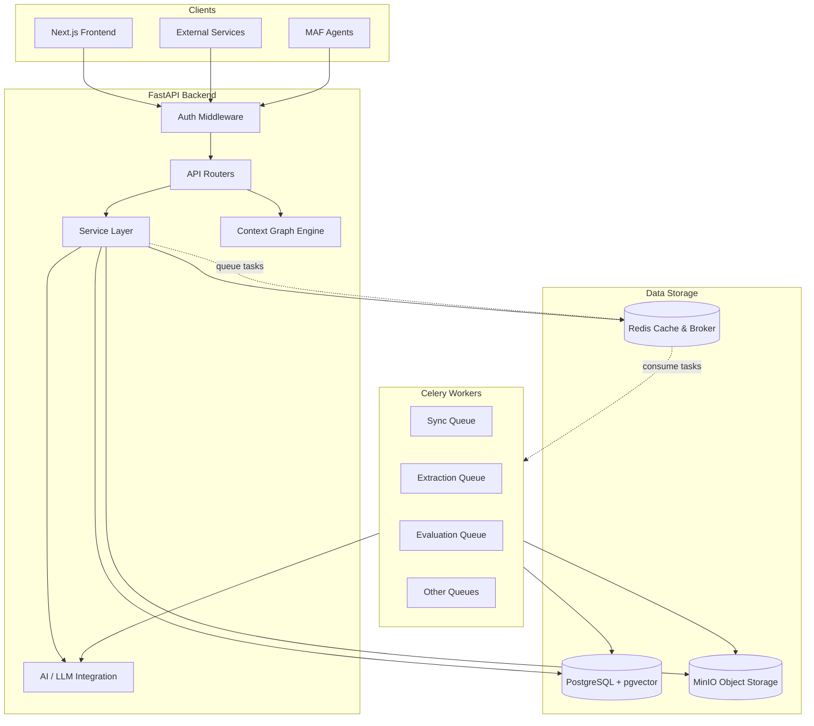
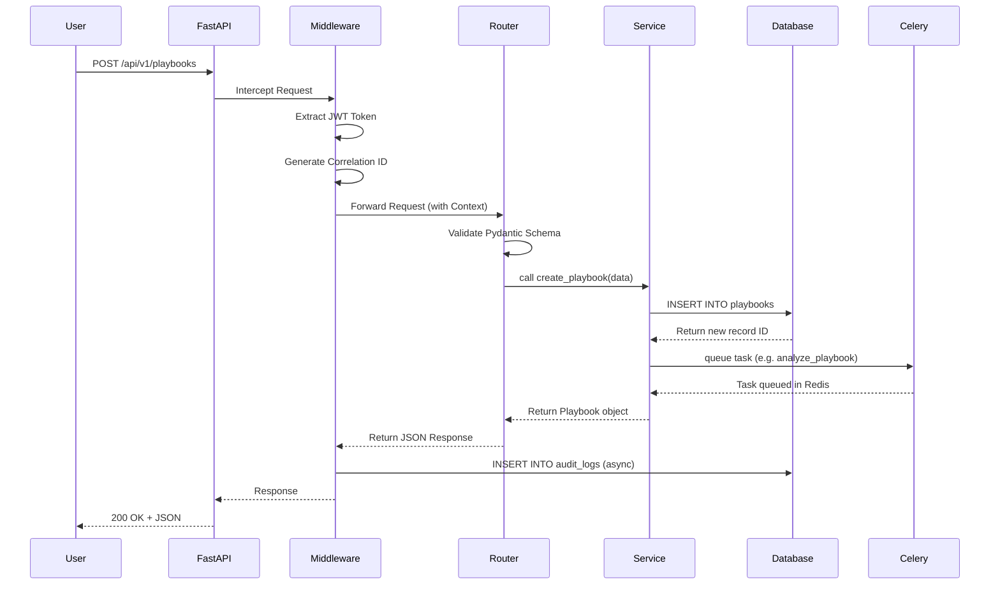
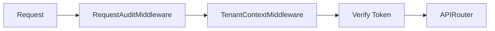
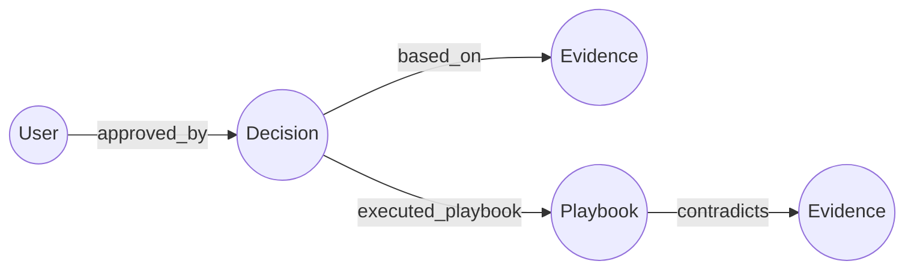

# ContextEdge — Project Architecture

This document explains the architecture of the ContextEdge platform. ContextEdge is an operational memory and living playbook system. It captures evidence from IT systems, analyzes it using AI, and presents it through a knowledge graph to help solve IT issues. 

This guide is written in simple English for developers who are new to the project. It covers what each part of the system does, why it exists, and how the parts talk to each other.

---

## 1. Architecture Overview

ContextEdge uses a **modular monolith** design. This means all the backend code lives in one application, but it is organized into clear, separate layers. It uses FastAPI for the web server, PostgreSQL for the database, Celery for background tasks, and Next.js for the frontend dashboard. 

### 1.1 System Diagram (Mermaid)



### 1.2 System Diagram (ASCII)

```text
+---------------------------------------------------------+
|                      CLIENTS                            |
|  [ Next.js UI ]    [ Service APIs ]    [ MAF Agents ]   |
+--------+------------------+-------------------+---------+
         |                  |                   |
         v                  v                   v
+---------------------------------------------------------+
|                  FASTAPI BACKEND                        |
|                                                         |
|  +---------------------------------------------------+  |
|  |             Auth & Context Middleware             |  |
|  +---------------------------------------------------+  |
|                           |                             |
|  +------------------------v--------------------------+  |
|  |                 API Routers                       |  |
|  +------------------------+--------------------------+  |
|                           |                             |
|  +------------------------v--------------------------+  |
|  |                Service Layer                      |  |
|  |  (Business Logic, Context Graph, AI Integration)  |  |
|  +------+-----------------+-------------------+------+  |
|         |                 |                   |         |
+---------|-----------------|-------------------|---------+
          |                 |                   |
    +-----v-----+     +-----v-----+       +-----v-----+
    |           |     |           |       |           |
    | PostgreSQL|     |   Redis   |       |   MinIO   |
    | (+pgvector|     | (Broker & |       | (Artifacts|
    |           |     |  Cache)   |       |  & Files) |
    +-----------+     +-----+-----+       +-----------+
                            |
                      +-----v-----+
                      |           |
                      |  Celery   |
                      |  Workers  |
                      |           |
                      +-----------+
```

---

## 2. Layer Architecture

The ContextEdge backend is divided into strict layers. A request comes in at the top and flows down to the database. 

### 2.1 Presentation Layer (Frontend)
- **What it is:** The user interface built with Next.js 16 (App Router), React, Tailwind CSS, and shadcn/ui.
- **Why we need it:** To give human reviewers (like IT support engineers) a place to manage playbooks, review AI decisions, and explore the context graph.
- **Files involved:** `frontend/src/app`, `frontend/src/components`.
- **Connections:** It calls the FastAPI backend via HTTP (REST). It uses TanStack Query for data fetching.

### 2.2 API Layer (FastAPI routers)
- **What it is:** The entry point for all HTTP requests. These are FastAPI routers mounted under `/api/v1`.
- **Why we need it:** To accept web requests, validate the incoming JSON data using Pydantic, and return JSON responses.
- **Files involved:** `backend/src/contextedge/main.py`, files in `backend/src/contextedge/api/v1/`.
- **Connections:** It receives requests from the frontend and passes validated data to the Service Layer.

### 2.3 Middleware Layer
- **What it is:** Code that runs before the API router. It handles authentication, sets up the request context, and logs actions.
- **Why we need it:** To make sure every request is authenticated and tracked with a unique ID (correlation ID) without writing the same code in every API route.
- **Files involved:** `middleware/request_context.py`, `middleware/request_audit.py`, `middleware/auth.py`, `middleware/audit.py`.
- **Connections:** Sits between the web server (Uvicorn) and the API routers. 

### 2.4 Service Layer
- **What it is:** The heart of the application. It contains all the business rules. 
- **Why we need it:** To keep business logic separate from HTTP routing and Celery tasks. 
- **Files involved:** Files in `backend/src/contextedge/services/`.
- **Connections:** It is called by the API layer and Celery workers. It calls the Repository Layer and AI layer.

### 2.5 Repository/Data Access Layer
- **What it is:** The layer that talks to the database using SQLAlchemy (an Object Relational Mapper).
- **Why we need it:** To translate Python objects into SQL queries and keep database code organized.
- **Files involved:** `backend/src/contextedge/models/`, `backend/src/contextedge/database.py`.
- **Connections:** Called by the Service Layer. Connects directly to PostgreSQL.

### 2.6 Database Layer
- **What it is:** A PostgreSQL database with the `pgvector` extension.
- **Why we need it:** To store all application data, including users, playbooks, and evidence. The `pgvector` extension is used to store AI embeddings for semantic search.
- **Files involved:** `docker-compose.yml`, `backend/alembic/`.
- **Connections:** Accessed by the backend and workers.

### 2.7 Queue Layer
- **What it is:** Celery task queues backed by Redis as the message broker.
- **Why we need it:** To run slow tasks in the background without making the user wait. For example, talking to the AI or syncing data from external systems.
- **Files involved:** `backend/src/contextedge/workers/celery_app.py`, files in `backend/src/contextedge/workers/`.
- **Connections:** The API layer pushes tasks to Redis. Celery workers pull tasks from Redis.

### 2.8 Storage Layer
- **What it is:** An S3-compatible object storage server (MinIO is used locally).
- **Why we need it:** To store large files like raw logs and attachment artifacts that are too big for the PostgreSQL database.
- **Files involved:** `backend/src/contextedge/services/object_store.py`.
- **Connections:** Read and written by the Service Layer.

### 2.9 AI Layer
- **What it is:** The code that talks to Large Language Models (LLMs) like OpenAI or Anthropic.
- **Why we need it:** To classify evidence, extract decisions, generate embeddings, and build summaries.
- **Files involved:** Files in `backend/src/contextedge/ai/`.
- **Connections:** Called by the Service Layer and Celery workers. 

### 2.10 Graph Layer
- **What it is:** The Context Graph Engine that models relationships between entities (like users, computers, incidents, and playbooks).
- **Why we need it:** To allow the system to answer complex questions by traversing relationships, rather than just using text search.
- **Files involved:** `backend/src/contextedge/graph/`, `backend/src/contextedge/models/pattern.py`.
- **Connections:** Built on top of PostgreSQL using adjacency list tables (`graph_edges`).

### 2.11 Integration Layer (MAF)
- **What it is:** The Microsoft Agent Framework (MAF) integration.
- **Why we need it:** To allow external AI agents to read the Context Graph and inject relevant knowledge into their prompts.
- **Files involved:** `backend/src/contextedge/integrations/maf/`.
- **Connections:** Exposes the graph as MAF tools and context providers.

---

## 3. Request Lifecycle

When a user clicks a button in the frontend, this is what happens on the backend:



---

## 4. Authentication Architecture

ContextEdge uses a stateless authentication model. The system must know *who* is making the request and *which tenant* (company or organization) they belong to.

### 4.1 JWT Flow (For Humans)
1. The user logs in (or uses SSO).
2. The server creates a JSON Web Token (JWT). The token contains the `user_id`, `tenant_id`, and `roles`.
3. The JWT is cryptographically signed using `settings.jwt_secret_key`.
4. The frontend sends this token in the `Authorization: Bearer <token>` header on every API request.
5. `TenantContextMiddleware` decodes the token and attaches the tenant ID to the request state (`request.state.tenant_id`).

### 4.2 Service Token Flow (For Machines)
1. External services or agents cannot log in via the UI. Instead, they use a static service token.
2. The service token is passed in the `X-Service-Token` header.
3. The `TenantContextMiddleware` checks if this token exists in the `SERVICE_TOKENS_JSON` configuration.
4. If it matches, the middleware loads the associated `tenant_id` and `roles` (usually `service_account`).

### 4.3 Middleware Chain
Authentication happens early in the middleware chain so that all downstream code can trust the identity of the caller.



### 4.4 Request Context Propagation
The middleware uses Python `contextvars` to store the `request_id`, `correlation_id`, and `tenant_id`. This allows any function deep in the code (like the database logger or AI caller) to access these IDs without having to pass them explicitly through every function argument.

---

## 5. Worker Architecture

ContextEdge relies heavily on background processing using Celery. This ensures the web API remains fast even when doing slow work like talking to LLMs.

### 5.1 Celery Setup
- **Broker:** Redis is used to hold the queue of messages.
- **Backend:** Redis is also used to store the results of tasks.
- **File:** Configuration is in `workers/celery_app.py`.

### 5.2 Queue Topology
We use multiple separate queues so that a flood of low-priority tasks does not block high-priority tasks.

- `default`: Fast, general-purpose tasks (like cache warming).
- `sync`: Tasks that pull data from external systems (ServiceNow, Jira).
- `hydration`: Tasks that fetch full details for a specific item.
- `extraction`: Heavy AI tasks that run LLMs over evidence to find identities and decisions.
- `pattern`: Tasks that group evidence together to find larger patterns.
- `evaluation`: Periodic cron jobs that run drift detection and contradiction scans.

### 5.3 Task Routing
In `celery_app.py`, the `task_routes` dictionary automatically sends tasks to the correct queue based on their python module name. For example, any task in `contextedge.workers.extraction_tasks` automatically goes to the `extraction` queue.

### 5.4 Signal Handlers
Celery signals are used to pass the `correlation_id` from the HTTP request into the Celery task.
1. `before_task_publish`: When the web server queues a task, it injects the current `correlation_id` into the Celery message headers.
2. `task_prerun`: When the worker starts the task, it reads the header and loads the `correlation_id` back into `contextvars`. This means worker logs will share the same ID as the web request that triggered them.

### 5.5 Beat Scheduler
Celery Beat is used for recurring tasks (cron jobs).
- `detect-drift-every-6h`: Checks if playbooks are drifting from reality.
- `scan-contradictions-every-12h`: Looks for evidence that contradicts approved playbooks.
- `trigger-syncs-every-15m`: Polls external systems for new tickets or logs.

---

## 6. Database Architecture

The system uses PostgreSQL for structured data and vector search.

### 6.1 PostgreSQL Configuration
- We use the `asyncpg` driver to connect to PostgreSQL asynchronously. This prevents the web server from blocking while waiting for the database.
- The connection string is defined in `settings.database_url`.

### 6.2 pgvector Extension
- We use `pgvector` to store mathematical representations of text (embeddings). 
- When an evidence item is processed, the AI layer generates a 3072-dimensional vector.
- We use a HNSW (Hierarchical Navigable Small World) index to make similarity searches extremely fast, even with millions of rows.

### 6.3 Connection Pooling (Async)
- We use SQLAlchemy's connection pooling.
- By default, `pool_size` is 20 and `max_overflow` is 10.
- For Celery workers running on Windows (which can have event loop issues), we configure a `NullPool` so connections are not shared across tasks in problematic ways.

### 6.4 Session Management
- `database.py` defines an `async_sessionmaker`.
- The FastAPI dependency `get_db` yields a database session for a web request. It automatically calls `session.commit()` if the request is successful, and `session.rollback()` if there is an error.
- Background workers use a similar wrapper (`run_async` or raw sessions) to guarantee that database changes are committed or rolled back safely.

---

## 7. AI Architecture

ContextEdge uses Large Language Models (LLMs) to understand unstructured text.

### 7.1 LLM Provider Abstraction
- The AI layer uses the `litellm` library to abstract away the differences between OpenAI, Anthropic, and Google.
- The application code just calls `llm_complete_json` and `litellm` handles the specific API format.

### 7.2 Embedding Pipeline
- When a new piece of evidence arrives, it is embedded using `text-embedding-3-small`.
- Because some evidence (like long email threads) is too big for a single embedding, we use a **Chunking Pipeline**.
- The `EvidenceChunker` splits large text into smaller semantic chunks (like paragraphs or individual log lines). Each chunk gets its own embedding and is stored in the `evidence_chunks` table.

### 7.3 Prompt Registry
- Prompts are not hardcoded inside functions. They are stored in the `ai/prompts/` directory.
- There is a `PromptRegistry` that versions prompts. 
- A tenant can be configured to use `v2` of the extraction prompt while everyone else uses `v1`. This allows for A/B testing of AI instructions.
- We heavily use Prompt Caching (especially with Anthropic) to save money by caching the large system instructions.

### 7.4 Model Selection
- We use different models based on the task difficulty (Model Tiering).
- **Classification:** We use smaller, faster models (like `gpt-4o-mini` or `claude-haiku`) because categorizing a ticket as "relevant" or "noise" is easy.
- **Extraction:** We use larger, smarter models (like `gpt-4o` or `claude-sonnet`) to extract complex decision paths and entity relationships from text.

---

## 8. Context Graph Architecture

The Context Graph is how ContextEdge understands relationships across different systems. It does not try to copy a CMDB (Configuration Management Database). Instead, it links things together.

### 8.1 Node Types and Edge Types
- **Nodes** are things: `user`, `playbook`, `evidence`, `decision`, `incident`.
- **Edges** are relationships: `executed_playbook`, `based_on`, `contradicts`, `approved_by`.
- All edges are stored in a single table called `graph_edges`.



### 8.2 Temporal Adjacency
- Edges in the graph are time-aware.
- The `graph_edges` table has `valid_from` and `valid_to` columns.
- If a relationship changes, the old edge is marked with a `valid_to` date, and a new edge is inserted. This allows the system to look back in time and ask "what did the graph look like last Tuesday?"

### 8.3 MAF Projection
- The full graph contains internal metadata that an AI agent doesn't need to see.
- The MAF (Microsoft Agent Framework) integration uses a **Projection Profile** (like `maf.v1`).
- When an agent asks for context, the system runs the query, filters out private or deleted nodes, drops raw JSON blobs, and returns a clean, compact graph designed specifically for LLM context windows.

---

## 9. Design Patterns Used

To keep the code clean and maintainable, we use several standard software patterns.

### 9.1 Repository Pattern
We separate database queries from business logic. While we don't always create strict `Repository` classes, we group SQLAlchemy queries into dedicated functions so the service layer doesn't write raw SQL.

### 9.2 Service Pattern
All business rules live in `services/`. API routers (in `api/`) just parse HTTP requests, call a service function, and return the result. Celery tasks do the same thing. This means we can trigger the same business logic from the web or from a background job.

### 9.3 Dependency Injection
FastAPI uses `Depends()` extensively. We use it to inject the database session (`get_db`) and the current user context (`get_current_user`) into the API endpoints.

### 9.4 Middleware Chain
We use the Starlette middleware pipeline to handle cross-cutting concerns (things that happen on every request) like logging, auth, and CORS headers.

### 9.5 Event-Driven Architecture
We decouple systems using Redis. The web server doesn't wait for the AI to finish. It fires an event (queues a Celery task) and returns immediately.

### 9.6 CQRS-like Patterns (Command Query Responsibility Segregation)
For the Context Graph, the source of truth is stored in specific tables (like `decisions`, `playbooks`). We have a `GraphRelationshipMaterializer` that reads these tables and projects them into the `graph_edges` table. We use the specific tables for writing, but we use the `graph_edges` table for fast graph traversal queries.

---

## 10. Security Architecture

ContextEdge is designed for Enterprise IT, so security is critical.

### 10.1 Authentication
- Covered in section 4. We use JWT for humans and service tokens for integrations.

### 10.2 Authorization (RBAC)
- We use Role-Based Access Control. 
- Users have roles like `admin`, `reviewer`, or `readonly`.
- API endpoints use the `require_role("admin")` dependency to enforce access.
- We also enforce Safety Classes on playbooks (`read_only`, `low_side_effect`, `destructive`). Users can only execute playbooks up to their permitted safety class.

### 10.3 Tenant Isolation
- ContextEdge is multi-tenant. Every table in the database has a `tenant_id` column.
- Every database query in the service layer MUST include a `WHERE tenant_id = :tenant_id` clause. This prevents data from leaking between different companies.

### 10.4 PII Redaction
- To prevent Personally Identifiable Information (PII) from being sent to OpenAI or Anthropic, we have a Redaction Service (`services/redaction_service.py`).
- Before sending text to an LLM, it runs regex rules to scrub Emails, Phone Numbers, SSNs, and AWS API Keys. The LLM only sees masked data.

### 10.5 Encryption
- Standard HTTPS/TLS is used in transit.
- Sensitive credentials (like passwords for external APIs) are encrypted at rest using the `fernet_key` configured in the environment variables.

---
*End of Project Architecture Document*
