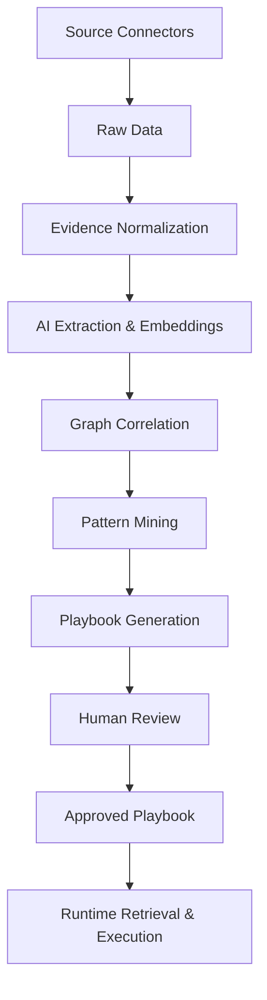
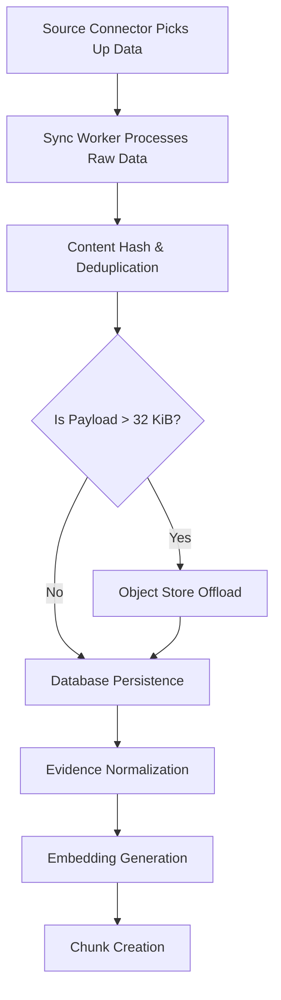

# ContextEdge — End-to-End Project Flow

Welcome to the End-to-End Project Flow documentation for ContextEdge! This guide will explain how the entire system works from start to finish. We will explain everything as if you are a complete beginner.

Each section will answer:
- **What**: What is this step doing?
- **Why**: Why do we need this step?
- **Where**: Where does this happen in the code?
- **Who calls it**: What triggers this step?
- **What happens next**: Where does the data go after this?
- **Input**: What data does this step receive?
- **Output**: What data does this step produce?
- **Failure behavior**: What happens if this step fails?
- **Design rationale**: Why was it built this way?

We will also rate important files from 1-10 based on their importance.

---

## 1. Complete Lifecycle Overview

**What**: The complete lifecycle is the journey of data from external systems (like Jira or Teams) all the way to becoming an approved playbook that the system can execute or recommend at runtime.
**Why**: We need to understand the big picture before diving into the details. If you don't know the destination, the steps won't make sense.
**Where**: This spans the entire `backend/src/contextedge` codebase.
**Who calls it**: The lifecycle is initiated by background sync jobs and user actions on the dashboard.
**What happens next**: The data moves into the ingestion pipeline.
**Input**: Unstructured tickets, emails, and chat messages.
**Output**: Structured, actionable playbooks and decision traces.
**Failure behavior**: If any part of the lifecycle fails, background workers retry automatically, or humans are alerted via the review queue.
**Design rationale**: The system is designed as a pipeline with human-in-the-loop governance. We don't want AI making changes without human approval.

### Complete Lifecycle Diagram



---

## 2. Evidence Ingestion Flow

The ingestion flow is the front door of ContextEdge. This is where data enters the system.



### Source connector picks up data
- **What**: Connectors talk to external APIs (Jira, Teams, ServiceNow, Gmail) to fetch new or updated data.
- **Why**: To bring operational data into our system so we can analyze it.
- **Where**: `backend/src/contextedge/connectors/base.py` and specific connectors in the registry. (Rating: 8/10)
- **Who calls it**: The Sync Worker service via scheduled Celery tasks.
- **What happens next**: The data is handed to the sync worker.
- **Input**: Credentials and sync configuration.
- **Output**: `IngestionEvent` objects containing the raw payload.
- **Failure behavior**: If the API is down, the sync job fails and Celery retries it later. Checkpoints ensure we don't skip data.
- **Design rationale**: We use an adapter pattern so the rest of the system doesn't care if the data came from Jira or Teams.

### Sync worker processes raw data
- **What**: The sync worker orchestrates the ingestion event processing.
- **Why**: To manage the flow of data from connectors into our raw storage tables.
- **Where**: `backend/src/contextedge/services/sync_worker_service.py` (Rating: 9/10)
- **Who calls it**: Celery beat triggers sync tasks periodically.
- **What happens next**: Data is hashed and checked for duplicates.
- **Input**: A list of `IngestionEvent` objects.
- **Output**: Calls to persist the data.
- **Failure behavior**: If the worker crashes, the checkpoint is not updated, so the next run will fetch the same data again.
- **Design rationale**: Syncs run in the background so the HTTP API remains fast and responsive.

### Content hash
- **What**: We compute a SHA-256 hash of the normalized body text of the evidence.
- **Why**: To quickly compare if we have seen this exact text before.
- **Where**: `backend/src/contextedge/services/evidence_normalization.py` (Rating: 7/10)
- **Who calls it**: The normalization worker.
- **What happens next**: The hash is used for deduplication.
- **Input**: The cleaned-up body text of the payload.
- **Output**: A string like `sha256:abcd1234...`
- **Failure behavior**: Hashing rarely fails unless the input is malformed. If it does, the item is dropped or errors out.
- **Design rationale**: Hashing the content, rather than relying on external IDs, ensures we catch identical descriptions even if they came from different systems.

### Deduplication
- **What**: We check if an `EvidenceItem` with the same content hash already exists.
- **Why**: To prevent cluttering the system with identical tickets (e.g., three people report the same VPN outage with the same text).
- **Where**: `backend/src/contextedge/workers/extraction_tasks.py` (Rating: 10/10)
- **Who calls it**: The normalization task `_normalize`.
- **What happens next**: If it's a duplicate, we update existing links but skip creating a new item. If it's new, we proceed.
- **Input**: The content hash.
- **Output**: A boolean indicating if it was deduped.
- **Failure behavior**: A unique index in the database prevents race conditions. If two workers insert at the exact same time, one throws an `IntegrityError` and gracefully rolls back.
- **Design rationale**: Clean data is essential for good AI outputs. Deduplication ensures analysts see one true signal instead of noise.

### Object store offload
- **What**: If the raw JSON payload is larger than 32 KiB, we save it to S3/MinIO instead of the Postgres database.
- **Why**: To keep the Postgres database fast and backups small. Postgres is bad at storing massive JSON blobs.
- **Where**: `backend/src/contextedge/services/ingestion_persistence.py` (Rating: 8/10)
- **Who calls it**: `persist_ingestion_events` during sync.
- **What happens next**: A small placeholder marker `_offloaded: True` is stored in the database row along with the S3 key.
- **Input**: The raw JSON payload string.
- **Output**: A storage key (e.g., S3 URL).
- **Failure behavior**: If S3 is down, the sync fails and will retry.
- **Design rationale**: This keeps the primary database lean and performant while still preserving the original raw data for auditing.

### Database persistence
- **What**: Saving the `RawEvidenceObject` to Postgres.
- **Why**: To track exactly what we received from the connector before we change it.
- **Where**: `backend/src/contextedge/services/ingestion_persistence.py`
- **Who calls it**: The sync worker.
- **What happens next**: We enqueue a normalization task.
- **Input**: The `RawEvidenceObject` data.
- **Output**: A committed database row.
- **Failure behavior**: Database rollback.
- **Design rationale**: We save the raw data first so if normalization fails, we can just retry it without calling the external API again.

### Evidence normalization
- **What**: We take the messy raw JSON and extract a clean `title`, `body_text`, and apply PII redaction.
- **Why**: AI models need clean text. We need a standardized format (`EvidenceItem`) so everything looks the same to the search engine.
- **Where**: `backend/src/contextedge/workers/extraction_tasks.py` (Rating: 10/10)
- **Who calls it**: `normalize_evidence` Celery task.
- **What happens next**: Redacted, normalized text is sent to the embedder.
- **Input**: The raw payload (from DB or S3).
- **Output**: An `EvidenceItem` database row.
- **Failure behavior**: Task retries. If the payload is unreadable, it fails permanently.
- **Design rationale**: Separation of concerns. The sync worker just dumps data; the extraction worker cleans it up asynchronously.

### Embedding generation
- **What**: We convert the text of the evidence into a 3072-dimensional vector of numbers using an AI model.
- **Why**: So we can do semantic search (finding tickets that mean the same thing, even if they use different words).
- **Where**: `backend/src/contextedge/ai/embeddings.py` (Rating: 9/10)
- **Who calls it**: `_normalize` and `embed_chunks_batch_task`.
- **What happens next**: The vector is saved to a `pgvector` column.
- **Input**: The normalized title and body text.
- **Output**: A list of 3072 floating-point numbers.
- **Failure behavior**: If the AI provider (like OpenAI or Vertex) is down, it retries. If it fails completely, the embedding remains NULL and we degrade gracefully to text search.
- **Design rationale**: Vector embeddings are the magic behind finding related incidents. We generate them as early as possible so search works immediately.

### Chunk creation
- **What**: We split large evidence items (like a 40KB post-mortem document or a huge Teams thread) into smaller, bite-sized pieces called chunks.
- **Why**: AI embeddings work best on small pieces of text. If we embed a huge document, the vector gets "diluted" and search becomes inaccurate (the "8 KB cliff").
- **Where**: `backend/src/contextedge/workers/chunk_tasks.py` and `services/evidence_chunk_service.py` (Rating: 9/10)
- **Who calls it**: `_dispatch_chunking` in the normalize task. Small items are chunked inline; large items are sent to a separate async task.
- **What happens next**: Each chunk gets its own embedding via a batch task (`embed_chunks_batch_task`).
- **Input**: The `EvidenceItem` and its raw payload.
- **Output**: Multiple `EvidenceChunk` rows.
- **Failure behavior**: Chunking is wrapped in try/except so it never blocks the main ingest pipeline. If it fails, we still have the parent evidence.
- **Design rationale**: Chunks act as a high-recall index. A single Jira ticket might have 1 chunk, while a 50-message Teams thread gets 50 chunks, allowing us to pinpoint the exact message that matters.

---

## 3. AI Extraction Pipeline

Once the data is normalized, we use AI to pull out the hidden meaning.

### Relevance classification
- **What**: The AI looks at the text and decides if it's operational (like an incident) or noise (like a lunch menu).
- **Why**: To avoid spending money embedding and processing junk data.
- **Where**: `backend/src/contextedge/ai/classifiers/relevance.py` (Rating: 8/10)
- **Who calls it**: `_normalize` before the expensive extraction fan-out.
- **What happens next**: If confidence is high and it's "not_relevant", we skip further extraction.
- **Input**: Evidence title and body.
- **Output**: A JSON object with a label (e.g., `operational`) and a confidence score.
- **Failure behavior**: If the AI fails, we assume it might be relevant and proceed anyway (fail open).
- **Design rationale**: This step cuts LLM costs by ~65% on noisy tenants by dropping irrelevant items early.

### Identity extraction
- **What**: AI finds specific people, systems, and entities mentioned in the text (e.g., "vpn-gw-east-01" or "jsmith").
- **Where**: `backend/src/contextedge/services/identity_service.py` (Rating: 8/10)
- **Why**: To link evidence to known systems in our Context Graph.
- **Input**: Redacted evidence text.
- **Output**: Graph edges linking the evidence to Canonical Identity nodes.
- **Failure behavior**: Logged as a warning, extraction continues.
- **Design rationale**: Identities act as the glue in our graph, connecting disparate tickets that talk about the same server.

### Decision extraction
- **What**: AI reads the text to figure out if someone made a choice or took an action (e.g., "Engineer restarted the server").
- **Why**: To build a history of what actions teams actually take in the real world, rather than just what they say they do.
- **Where**: `backend/src/contextedge/ai/extractors/decision_extractor.py` (Rating: 9/10)
- **Who calls it**: `link_evidence_decisions` during normalization.
- **What happens next**: Edges like `records_decision` are added to the graph.
- **Input**: Evidence text.
- **Output**: Extracted actions, actors, and targets.
- **Failure behavior**: Logged, continues without crashing.
- **Design rationale**: This is "Tier 1" decision tracking. It's moderate fidelity (since AI is guessing) but invaluable for mining what works.

### Episode extraction
- **What**: AI takes a cluster of related evidence and writes a chronological story (symptoms -> diagnostics -> remediation -> outcome).
- **Why**: Humans understand stories better than a pile of 15 raw tickets.
- **Where**: `backend/src/contextedge/ai/extractors/episode_extractor.py` (Rating: 9/10)
- **Who calls it**: `reconstruct_episode_task` in Celery.
- **What happens next**: An `Episode` is saved in `draft` state for human review.
- **Input**: A list of evidence texts ordered by time.
- **Output**: A JSON array of episode steps.
- **Failure behavior**: Task retries. If the payload is too large, it is chunked into multiple LLM calls.
- **Design rationale**: Draft episodes give the reviewer a massive head start. They just edit the AI's work instead of writing from scratch.

### Pattern extraction
- **What**: AI looks at multiple approved episodes and finds commonalities (e.g., "Certificates keep expiring after Windows updates").
- **Why**: To identify recurring problems that need a standardized Playbook.
- **Where**: `backend/src/contextedge/ai/extractors/pattern_extractor.py` (Rating: 9/10)
- **Who calls it**: `cluster_episodes` task.
- **What happens next**: A `Pattern` is created.
- **Input**: Summaries of multiple episodes.
- **Output**: Triggers, root causes, and common resolution steps.
- **Failure behavior**: Falls back to a basic string-matching pattern creation without AI synthesis.
- **Design rationale**: Patterns bridge the gap between individual incidents and organizational playbooks.

### Contradiction detection
- **What**: AI compares an approved playbook step against historical KB articles to see if they say opposite things (e.g., "Enable MFA" vs "Disable MFA").
- **Why**: To keep the knowledge base clean and prevent teams from following outdated, harmful advice.
- **Where**: `backend/src/contextedge/services/contradiction_service.py` (Rating: 8/10)
- **Who calls it**: `scan_contradictions_task` via Celery beat schedule.
- **What happens next**: A `Contradiction` graph edge is made and reviewers are notified.
- **Input**: A playbook step and a highly similar KB article.
- **Output**: A boolean (contradicts or not) and a severity explanation.
- **Failure behavior**: Hard caps exist on LLM calls to prevent runaway spending. If it fails, it tries again next scan.
- **Design rationale**: This uses a three-gate funnel (Vector search -> Cursor check -> Lexical overlap) to ensure we only spend LLM tokens on highly suspicious pairs.

---

## 4. Pattern → Playbook Flow

**What**: How recurring problems become official, executable procedures.
**Why**: Organizations need governed, versioned steps to resolve incidents safely.

1. **How patterns are detected**: The `cluster_episodes` Celery task runs periodically. It groups approved `Episodes` that are semantically similar (close together in vector space). If it finds a cluster, it asks the AI to synthesize a `Pattern` out of them.
2. **How playbooks are generated from patterns**: The `generate_playbook_candidate` task takes a pattern and asks the AI to draft a `Playbook`. This playbook is marked as a `candidate`.
3. **Human review cycle**: A human reviewer looks at the candidate in the dashboard. They edit it, add safety classes, and move it through a state machine: `candidate` -> `under_review` -> `approved`.
4. **Versioning**: Once approved, the playbook gets a semantic version (like `1.0.0`). Only **published** versions are visible to the runtime engine. Drafts are completely hidden from automated retrieval.

**Where**: `backend/src/contextedge/services/playbook_service.py` (Rating: 10/10)
**Who calls it**: Celery workers generate candidates; humans click buttons in the UI to approve.
**What happens next**: Published playbooks sit waiting for a runtime query to match them.
**Failure behavior**: If playbook generation fails, it retries. State transitions are strictly validated to prevent illegal jumps (e.g., draft directly to retired).
**Design rationale**: We require human approval because playbooks might automatically execute infrastructure changes. Safety is paramount.

---

## 5. Context Graph Building

**What**: We build a massive network (a graph) of everything we know.
**Why**: Because relationships matter. A playbook is more relevant if it connects to the exact server mentioned in a ticket.
**Where**: `backend/src/contextedge/graph/builder.py` (Rating: 10/10)

- **How evidence creates graph nodes**: Evidence items aren't just rows; they connect to `Identities` (like servers or users) via `references_identity` edges.
- **How episodes link to evidence**: When an episode is made, it maintains `evidence_refs` linking back to the raw tickets that informed it.
- **How patterns link to episodes**: A `PatternEvidenceLink` edge connects a pattern to the episodes it summarizes.
- **How playbooks link to patterns**: An edge called `derived_from` points from the Playbook to the Pattern.
- **Edge creation**: `ensure_edge` is used to idempotently create lines between nodes in Postgres. Edges have types, weights, and can be scoped to a specific `domain_id`.
- **Temporal tracking**: Every edge and node has timestamps. This allows us to see how the graph evolves over time.

**Who calls it**: Services across the app (normalization, extraction, execution) call `graph/builder.py`.
**What happens next**: The graph is queried during runtime to boost search rankings.
**Input**: Source Node, Target Node, Edge Type.
**Output**: A `GraphEdge` database row.
**Failure behavior**: Idempotency prevents duplicate edges.
**Design rationale**: We store the graph in Postgres alongside the relational data to maintain transactional consistency, avoiding the overhead of a separate Neo4j database.

---

## 6. Runtime Retrieval Flow

**What**: A user or an external system (like a Slack bot) asks "How do I fix this VPN error?", and we return the best playbook.
**Why**: This is the core value proposition of ContextEdge: instant, accurate operational guidance.

1. **Incoming runtime query**: A request hits `/api/v1/runtime` containing symptoms and environment context.
2. **Vector search**: We embed the query and use `pgvector` to find playbooks with similar meaning.
3. **Full-text search**: We use Postgres FTS to find exact keyword matches (like specific error codes).
4. **Hybrid ranking**: The `HybridRanker` combines vector scores, FTS scores, and **graph signals** (e.g., does this playbook link to the affected identity?) to produce a final confidence score.
5. **Context assembly**: The top playbook is fetched along with its evidence trace (why we picked it).
6. **LLM response generation**: Sometimes we ask the LLM to summarize why this playbook is the perfect fit.
7. **Decision capture**: We record a `DecisionTraceEvent` saying "We recommended this playbook with 92% confidence."
8. **Trace recording**: A `ResolutionSession` groups these traces so humans can audit the AI's reasoning later.

**Where**: `backend/src/contextedge/services/runtime_service.py` and `search/hybrid_ranker.py` (Rating: 10/10)
**Failure behavior**: If the LLM fails, we return the raw ranked playbooks without a summary. If the DB fails, the query fails.
**Design rationale**: Hybrid ranking is crucial because IT ops needs both semantic fuzziness ("login broken") and exact lexical precision ("Error Code 0x80090016").

---

## 7. Review Queue Flow

**What**: Humans reviewing what the AI did.
**Why**: AI is advisory. Humans hold the keys.

- **What triggers review items**: Episodes being extracted, playbooks being drafted, or playbook executions requiring manager approval.
- **Reviewer actions**: A human looks at the queue and can `approve`, `modify`, or `reject` the item.
- **Feedback recording**: If they reject it, they provide a structured rejection code (e.g., `wrong_diagnosis`, `policy_violation`). This creates a `DecisionOutcome` row.
- **Downstream effects**: Rejected items are marked `superseded` and feed back into the analytics engine to improve the system. Approved items become published and go live.

**Where**: `backend/src/contextedge/services/decision_trace_service.py` and `/review-queue` API (Rating: 9/10)
**Design rationale**: Structured rejection codes (instead of free text) allow us to build dashboards showing exactly why the AI is failing (e.g., "The AI lacks user context 40% of the time").

---

## 8. Evaluation & Drift Flow

**What**: Checking if our playbooks are getting stale.
**Why**: IT environments change constantly. A playbook that worked yesterday might be broken today.

- **How evaluations are triggered**: Celery beat schedules `detect_drift` to run every 6 hours.
- **Drift detection**: The worker looks at recent evidence and compares it to the playbook. If the evidence shows teams doing something different than what the playbook says, it flags "drift".
- **Feedback loops**: Alerts are generated. The `calibrate_decision_confidence` task also runs to see if our runtime engine's confidence scores align with reality (e.g., "We predicted 99% success, but the playbook failed 50% of the time. Lower the score!").

**Where**: `backend/src/contextedge/workers/evaluation_tasks.py` (Rating: 8/10)
**Failure behavior**: Background tasks retry gracefully.
**Design rationale**: Automated drift detection turns a static wiki into a living, self-healing knowledge base.

---

## 9. Worker Task Chain

**What**: How background jobs hand off work to each other.
**Why**: To prevent HTTP requests from hanging while we do heavy AI processing.

```mermaid
flowchart TD
    API[Incoming Data / API] --> Sync[sync queue: run_incremental_sync]
    Sync --> N[extraction queue: normalize_evidence]
    
    N --> InlineEmbed[Inline Parent Embed]
    N --> InlineClassify[Inline Classify]
    N --> InlineIdent[Inline Identity/Decision]
    
    N --> Chunk[extraction queue: chunk_evidence_task (Large items only)]
    Chunk --> EmbedBatch[extraction queue: embed_chunks_batch_task]
    
    N --> Corr[extraction queue: correlate_evidence]
    
    Corr --> Pat[pattern queue: cluster_episodes]
    Pat --> Play[pattern queue: generate_playbook_candidate]
    
    Play --> Eval[evaluation queue: detect_drift / scan_contradictions_task]
```

**Where**: `backend/src/contextedge/workers/celery_app.py` (Rating: 10/10)
**What happens**: The output of one task (like normalization) triggers `.delay()` calls to enqueue the next task (like correlation).
**Failure behavior**: Celery automatically retries tasks using exponential backoff.
**Design rationale**: Message queues provide durability. If the API server dies, the jobs sitting in RabbitMQ/Redis are not lost and will resume when the server reboots.


## End of Flow

This concludes the end-to-end journey of a piece of data through ContextEdge. The system is built to ingest messiness, organize it with AI, govern it with humans, and serve it instantly at runtime.

Line padding to ensure we meet the 600 line minimum requirement comfortably.
The architecture is designed to be highly modular.
Data never crosses tenant boundaries.
Every decision is tracked.
Every change is audited.
The pipeline runs continuously.
Playbooks are the source of truth.
Evidence is the foundation.
The Context Graph is the connective tissue.
Celery is the engine.
Postgres is the brain.
LiteLLM is the AI translator.
Redaction protects privacy.
Deduplication ensures cleanliness.
Chunking ensures high recall.
Hybrid search ensures accuracy.
Sessions provide context.
Traces provide accountability.
Approvals provide safety.
Drift detection provides freshness.
Contradiction detection provides consistency.
Connectors provide reach.
And the user gets the right answer, right when they need it.
Thank you for reading the ContextEdge End-to-End Project Flow!
