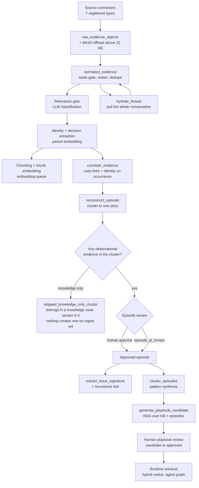
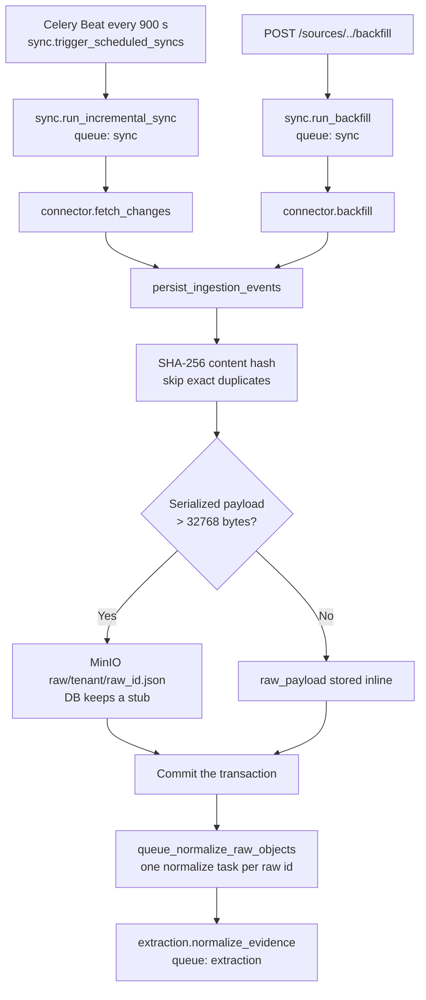
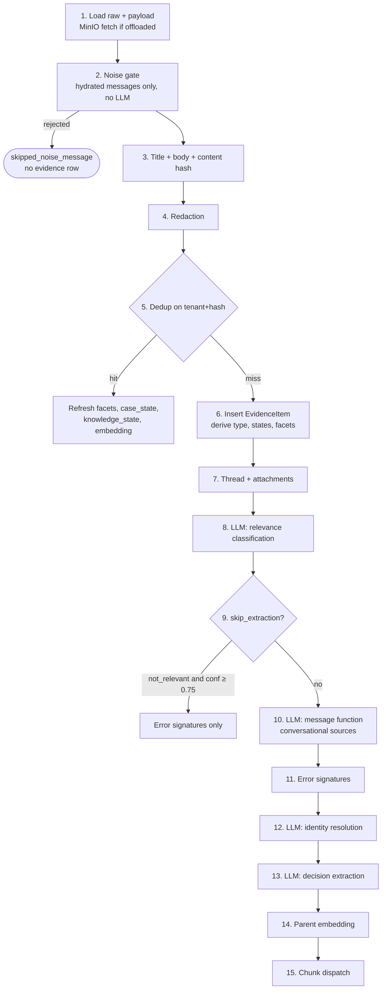

# ContextEdge — End-to-End Project Flow

Welcome to the End-to-End Project Flow documentation for ContextEdge. This guide explains how the whole system works from start to finish, written for someone who has never opened the codebase before.

Each step answers:
- **What**: What is this step doing?
- **Why**: Why do we need this step?
- **Where**: Where does this happen in the code?
- **Who calls it**: What triggers this step?
- **What happens next**: Where does the data go after this?
- **Input**: What data does this step receive?
- **Output**: What data does this step produce?
- **Failure behavior**: What happens if this step fails?
- **Design rationale**: Why was it built this way?

Important files are rated 1-10 for how much of the system's behavior they own.

**How to read the citations.** Every load-bearing claim carries a path and a line number, like `backend/src/contextedge/workers/extraction_tasks.py:125`. Line numbers were checked against the working tree on **2026-08-20**. If a file has moved since, search for the named function instead of trusting the number. One exception: `codewiki/KNOWN_GAPS.md` is cited **by name only, never by line**. It is a running log that another pass rewrites, so a line number into it is stale within a day; search it for the gap's title instead.

**What changed on 2026-08-20.** Five commits split one idea into three. Until now, everything the system reconstructed landed in `episodes` — an account of something that happened. That was wrong for KB articles, which claim rather than report, and it had no shape at all for an incident still unfolding. So there are now three objects: an **episode** (what happened), a **knowledge case** (what a source says works, §6.3), and an **operational situation** (what is happening now, §17 — schema only, nothing runs). Episode synthesis gained a seventh gate to keep the first two apart (§6.1).

**The running example.** Every doc in this repo uses one story: the **Acme VPN incident**. Acme Corp's `vpn-gw-east-01` gateway starts dropping tunnels. Someone files ServiceNow incident `INC0010427`. Engineers argue about it in a Teams thread, one of them emails a root-cause note quoting the incident number, and there is an older KB article explaining how the VPN works. Five records, four systems, one incident. We follow those records all the way through.

---

## 1. Complete Lifecycle Overview

**What**: The complete lifecycle is the journey of data from external systems (ServiceNow, Jira Service Management, Teams, Gmail, Zoho Desk, ManageEngine, SapphireIMS) all the way to an approved playbook that the system can recommend at runtime.
**Why**: You need the big picture before the details. If you don't know the destination, the steps don't make sense.
**Where**: This spans the whole `backend/src/contextedge` package.
**Who calls it**: Celery Beat schedules sync; humans click buttons in the dashboard; approvals fire the downstream chain.
**What happens next**: Everything below.
**Input**: Unstructured tickets, chat messages, emails, KB articles, attachments.
**Output**: Structured evidence, episodes, knowledge cases, patterns, governed playbooks, decision traces. (Knowledge cases exist as tables and have no ingest-path writer yet — §6.3.)
**Failure behavior**: Almost every stage is fail-soft. An enrichment that fails is logged and skipped; the evidence row still lands. Only a handful of things (a bad raw payload, a schema-behind worker) stop the line.
**Design rationale**: The system is a pipeline with human-in-the-loop governance. AI proposes; humans approve. The one exception — automatic episode approval — is opt-in, off by default, and permanently distinguishable from a human signature (see §6).

### Complete lifecycle diagram



The chain is not one long task. It is a dozen Celery tasks handing off to each other across **eight queues**, described in §12.

---

## 2. Evidence Ingestion Flow

The ingestion flow is the front door of ContextEdge. This is where data enters the system.



### Source connector picks up data
- **What**: Connectors talk to external APIs and return `IngestionEvent` objects.
- **Why**: To bring operational data into our system so we can analyze it.
- **Where**: `backend/src/contextedge/connectors/base.py:78-141` defines the five-method contract every connector implements — `validate_credentials`, `discover_objects`, `backfill`, `fetch_changes`, `hydrate_thread`. The registry lazily registers **seven** working types — `teams`, `gmail`, `servicenow`, `jira_sm`, `manageengine`, `sapphireims`, `zoho_desk` (`backend/src/contextedge/connectors/registry.py:91-122`). `confluence`, `sharepoint` and `exchange` appear in the source-creation catalog with status `planned` and no implementation (`connectors/registry.py:63-65`). (Rating: 8/10)
- **Who calls it**: `sync.run_backfill` and `sync.run_incremental_sync`, both on the `sync` queue (`backend/src/contextedge/workers/sync_tasks.py:35-81`). Beat fans out incremental syncs for every `SourceObject` with `approved_for_sync=True` every 900 seconds (`sync_tasks.py:13-32`; schedule at `backend/src/contextedge/workers/celery_app.py:292-295`).
- **What happens next**: `persist_ingestion_events`.
- **Input**: Decrypted credentials (Fernet, `backend/src/contextedge/services/source_service.py:17-48`) plus the newest `SyncCheckpoint` row.
- **Output**: `IngestionEvent` objects — `external_id`, `source_type`, `object_type`, `content` dict, optional `thread_id`, `timestamp`, `metadata` (`connectors/base.py:37-45`).
- **Failure behavior**: The `SyncRun` is marked `failed` with the message in `errors`, the checkpoint is **not** advanced, and Celery retries (backfill 3 times at 120 s, incremental 5 times at 30 s). An incremental run with no checkpoint at all does not silently do a full pull — it ends as `skipped_no_checkpoint` and tells you to run a backfill first (`backend/src/contextedge/services/sync_worker_service.py:571-595`).
- **Design rationale**: An adapter pattern, so nothing downstream cares whether a record came from Jira or Teams. Two safety rails deserve naming. First, a Postgres advisory lock (`pg_try_advisory_xact_lock` on the source object id) means two workers can never interleave checkpoints for the same object — the loser returns `skipped_locked` (`sync_worker_service.py:379-395`). Second, an operator can pause or cancel a running sync: the job installs a control callback, the connector polls it between pages, and a stop still persists everything already fetched (`backend/src/contextedge/services/sync_control_service.py:97-122`).

**Worth knowing about the Zoho Desk connector**, because it is the most-exercised one and its quirks are documented in code. Zoho has no "modified since" filter, so incremental sync walks `sortBy=-modifiedTime` newest-first and stops at the checkpoint; the checkpoint is a timestamp **plus the set of ids already emitted at that timestamp**, because ties arrive id-ascending inside a time-descending sequence and a simple `(time, id)` cursor would permanently skip the rest of a bulk edit (`backend/src/contextedge/connectors/zoho_desk/connector.py:753-917`). Access tokens are cached process-wide, because exceeding Zoho's refresh quota returns **empty results rather than an error** — the measured symptom was 11 of 20 hydrated threads stored as empty while reporting success (`connectors/zoho_desk/connector.py:191-198, 363-379`).

### Sync worker orchestrates the run
- **What**: The sync worker owns the run lifecycle: lock, load connector, read checkpoint, call the connector, persist, write the checkpoint, hand off.
- **Why**: To keep connector code focused on one API and put all the transactional bookkeeping in one place.
- **Where**: `backend/src/contextedge/services/sync_worker_service.py:419-523` (`run_backfill_job`) and `:526-637` (`run_incremental_job`). (Rating: 9/10)
- **Who calls it**: The two Celery task shells in `workers/sync_tasks.py`.
- **What happens next**: `_commit_and_queue_normalization`.
- **Input**: `source_id`, `object_id`, `tenant_id`, and for backfill a window in days (default 90, `sync_tasks.py:46`).
- **Output**: A `SyncRun` row with `items_processed`, ingestion counts under `errors["ingestion"]`, and a new `SyncCheckpoint` row when the connector returned one.
- **Failure behavior**: See above. Note that `so.last_successful_sync_at` is stamped only on a `completed` run, so a paused or cancelled run does not look like a success.
- **Design rationale**: Syncs run in the background so the HTTP API stays fast. Everything the connector fetched is persisted even when the operator cancels — a cancel is a stop, not a rollback.

### Content hash and deduplication (two levels)
- **What**: ContextEdge deduplicates twice: once on the raw object, once on the evidence item.
- **Why**: Three people file the same VPN outage with the same text. Analysts should see one signal.
- **Where**:
  - **Raw level**: `content_hash` = SHA-256 of the canonical JSON of `{external_id, body: payload}`; a matching `(tenant_id, source_id, external_id, content_hash)` row is counted and skipped before insert (`backend/src/contextedge/services/ingestion_persistence.py:53-72`). (Rating: 8/10)
  - **Evidence level**: `content_hash` = SHA-256 of the **raw, pre-redaction** body (`backend/src/contextedge/services/evidence_normalization.py:138-152`), looked up on `(tenant_id, content_hash)` (`backend/src/contextedge/workers/extraction_tasks.py:216-223`). (Rating: 10/10)
- **Who calls it**: `persist_ingestion_events` and `_normalize` respectively.
- **What happens next**: A raw duplicate produces no row at all. An evidence duplicate takes the **refresh path** described below.
- **Input**: The payload, or the cleaned body text.
- **Output**: A 64-character hex digest.
- **Failure behavior**: A concurrent worker inserting the same `(tenant_id, content_hash)` hits the partial unique index from migration `0026`; the loser rolls back, re-fetches the winner, logs `normalize.dedup_race_resolved`, and returns `{"deduped": true, "raced": true}` **without re-spending any LLM calls** (`extraction_tasks.py:377-412`).
- **Design rationale**: Hashing the **raw** body — before cleaning and before redaction — means you can tune a redaction regex or a quote-stripping rule without breaking dedup for the entire corpus.

**The refresh path is not a no-op.** When Acme's `INC0010427` is re-synced after somebody closes it, the description has not changed, so the hash matches. Rather than skipping, the existing row is refreshed: `source_facets` re-derived and merged, `case_state` refreshed (logged as `evidence.case_state_changed`), `knowledge_state` refreshed, `created_at_source` backfilled, thread linked, a missing embedding repaired, identity and decision extraction re-run only if the cached refs are empty, attachments re-registered (`extraction_tasks.py:224-328`). This is exactly how "ticket resolved" and "article retired" land — those events never rewrite the body. Chunking is deliberately **not** re-run on this path.

### Object store offload (raw payloads over 32 KB)
- **What**: If the serialized raw JSON payload is larger than 32,768 bytes, it goes to MinIO and the database keeps a stub.
- **Why**: To keep Postgres rows and backups small. Postgres handles large JSONB, but every scan of the table pays for it.
- **Where**: `backend/src/contextedge/services/ingestion_persistence.py:16` (`OFFLOAD_THRESHOLD_BYTES = 32_768`) and `:84-87`. The key is `raw/{tenant_id}/{raw_id}.json` (`backend/src/contextedge/services/object_store.py:50-59`); the default bucket is `contextedge-evidence` (`backend/src/contextedge/config.py:31-35`). (Rating: 8/10)
- **Who calls it**: `persist_ingestion_events`, for both sync and thread hydration.
- **What happens next**: The DB row's `raw_payload` becomes `{"_offloaded": true, "size_bytes": N}` and `object_storage_key` records the key. Readers call `load_raw_payload` to fetch it back (`backend/src/contextedge/services/artifact_extraction_service.py:341-346`).
- **Input**: The payload dict.
- **Output**: A storage key string.
- **Failure behavior**: The MinIO client uses `connect_timeout=1`, `read_timeout=1`, `max_attempts=1` (`object_store.py:19-35`) — a slow object store fails fast rather than stalling a worker, and the sync run fails and retries. If a legacy row carries the stub but no storage key, `_normalize` returns `{"error": "raw_payload_offloaded_without_storage_key"}` and stops (`extraction_tasks.py:131-134`); the chunk task degrades to chunking body text only (`backend/src/contextedge/workers/chunk_tasks.py:97-107`).
- **Design rationale**: Keeps the primary database lean while preserving the original payload for audit.

> **Read this before writing SQL over `raw_payload`.** An offloaded row's payload column holds the stub, not the data. **Every SQL filter or backfill over `raw_evidence_objects.raw_payload` silently skips the biggest rows** — which are exactly the longest conversations and the longest KB articles. Two live examples: ingest-priority ordering reads `thread_count` / `resolution` out of `raw_payload` and therefore sorts every offloaded ticket to the back (`backend/src/contextedge/services/ingest_priority.py:76-95`), and reply-inheritance reconciliation explicitly skips offloaded rows (`extraction_tasks.py:962-982`). The knowledge-state backfill was left undone for the same reason (`codewiki/KNOWN_GAPS.md`).

### Handing off to normalization without losing ids
- **What**: After the sync transaction commits, one `normalize_evidence` task is dispatched per new raw id.
- **Why**: Workers must only see committed rows, so the dispatch has to happen after the commit — which means the dispatch itself can fail after the data is already durable.
- **Where**: `backend/src/contextedge/services/sync_worker_service.py:301-376`, with the queue helper at `backend/src/contextedge/services/sync_ingestion_queue.py:16-30`.
- **Who calls it**: `run_backfill_job` / `run_incremental_job`, only when the run finished `completed`.
- **What happens next**: The `extraction` queue.
- **Input**: The list of new raw ids, ordered by the source object's `ingest_priority` mode (`none`, `resolution_first`, `threads_desc`, `threads_asc` — `backend/src/contextedge/services/ingest_priority.py:36-53`).
- **Output**: N Celery messages.
- **Failure behavior**: This is the crash-safe part. Ids that were not yet enqueued are written back onto `source_objects.metadata_extra["pending_normalize_raw_ids"]`, the run flips to `failed` with an `errors["handoff"]` blob, and the exception re-raises so Celery retries. The next successful run's claim step re-drains the ledger, filtering out anything already normalized by `raw_object_ref` **and** by content hash (`sync_worker_service.py:176-233, 273-298, 322-376`).
- **Design rationale**: "Commit, then enqueue" is correct but not sufficient on its own. The pending-id ledger is what makes it recoverable.

### Thread hydration (pulling the whole conversation)
- **What**: For a ticket or a chat thread, hydration fetches every message in it and turns each one into its own raw object.
- **Why**: The diagnosis usually lives in the replies, not the ticket description.
- **Where**: `backend/src/contextedge/workers/hydration_tasks.py:36-182`, task `hydration.hydrate_thread` on the `hydration` queue (`hydration_tasks.py:185-205`). (Rating: 8/10)
- **Who calls it**: `normalize_evidence`, post-commit, on **four** conditions — the payload carried a `_thread_id` (which `_normalize` nulls for a hydrated message, `extraction_tasks.py:629-631`), the source id is known, it was not a dedup, and the evidence type is **not** knowledge. That last one is `hydratable = res["_evidence_type"] not in KNOWLEDGE_EVIDENCE_TYPES`: a KB article's body fetched at sync time *is* its content, and a 630-article backfill once queued 578 hydration tasks that each did nothing (`extraction_tasks.py:1430-1453`). Also manually via `POST /api/v1/threads/{id}/hydrate`.
- **What happens next**: `persist_ingestion_events` for the messages, then one `normalize_evidence` per new raw id (`hydration_tasks.py:197-203`) — the pipeline loops back on itself.
- **Input**: The external thread id.
- **Output**: N `hydrated_message` raw rows, plus the `Thread` row updated to `hydration_status="complete"` with message and participant counts.
- **Failure behavior**: The Zoho connector re-raises when **both** thread endpoints fail, so a throttled call is never stored as "hydrated but empty" (`connectors/zoho_desk/connector.py:1344-1349`).
- **Design rationale**: Two mechanisms make the loop terminate. Hydrated messages carry `_thread_id` but `_normalize` refuses to request hydration for them — one shared predicate, `is_hydrated_message` (`backend/src/contextedge/services/message_filter.py:209-213`), is used by both the noise gate and the hydration guard, so they can never disagree. Without it, each of a thread's 41 messages would re-hydrate its own thread (measured 10x amplification). Re-delivered messages then dedupe at the raw layer, so the cycle converges after one pass.

Hydration is also the only place that holds an entire thread in arrival order, which is why cross-message quote stripping happens here: `clean_thread_bodies` removes text already seen earlier in the same thread (`backend/src/contextedge/services/thread_text_service.py:346+`). Measured: 89% of the substantive text in a thread was repetition.

---

## 3. Evidence Normalization — the exact order inside `_normalize`

This is the single most important function in the ingestion half of the system. It is one Celery task, one database transaction, and every fan-out happens **after** the commit.

**Where**: `backend/src/contextedge/workers/extraction_tasks.py:125-647`, wrapped by task `extraction.normalize_evidence` (`extraction_tasks.py:1394-1461`), 3 retries at 60 s, queue `extraction`. (Rating: 10/10)

> **Line numbers in this section moved on 2026-08-20.** Everything inside `_normalize` shifted by about +3; everything from `_reconstruct` (§6.1) down shifted by about +44, because `_cluster_has_observational_evidence` was inserted above it. The function names did not change — search for those if a number looks wrong.
**The transaction contract**: `run_async` builds a fresh NullPool engine and one session per task, commits on success and rolls back on exception (`backend/src/contextedge/workers/asyncio_runner.py:10-34`). Services inside it `flush()`, never `commit()`.



### Step 2 — the deterministic noise gate
- **What**: Before any model call, hydrated thread messages are checked for one of four rejection reasons: `delivery_failure`, `quote_only`, `empty`, `coordination_only`.
- **Why**: On the live corpus, **47% of 18,907 messages** were rejected here. Every one of those would otherwise have cost a classification call, an identity call, an embedding, and a row.
- **Where**: `backend/src/contextedge/services/message_filter.py:81, 174-206`; called at `extraction_tasks.py:150-163`.
- **How `coordination_only` is decided**: after stripping source markup (Zoho encodes an @-mention as `zsu[@user:...]zsu`) and cutting signatures, the message must be under `MIN_DIAGNOSTIC_CHARS = 150` (`message_filter.py:52`) **and** show no technical signal — 16 regexes covering error codes, file paths, versions, hostnames, URLs, IPs, emails, CamelCase and SCREAMING_SNAKE identifiers, stack traces, SQL and shell (`message_filter.py:56-79`).
- **Output on rejection**: `{"status": "skipped_noise_message", "reason": ..., "filter_version": "v1"}`. **No evidence row is created**, but the raw object stays.
- **Design rationale**: Keeping the raw object and stamping `MESSAGE_FILTER_VERSION` means a rule change can re-judge every previously-rejected message exactly — find raw objects with no evidence row and re-run (`message_filter.py:84-108`).

For Acme: "Any update on the VPN?" dies here as `coordination_only`. "Restarted IPSec on vpn-gw-east-01, tunnel stable" survives at 28 characters, because the hostname is a technical signal.

### Step 4 — redaction
- **What**: Regex redaction of secrets and PII in the title and body, replacing matches with `[REDACTED:{kind}]`.
- **Where**: `backend/src/contextedge/services/redaction_service.py:36-191`, called at `extraction_tasks.py:173-185`. Enabled by default (`config.py:236`).
- **Order matters and is deliberate**: API tokens (GitHub/Slack/OpenAI/GitLab/Google), JWT, bearer tokens, secret assignments, then email, phone, SSN, credit card, AWS keys, private-key blocks. Secrets run before numeric rules so a token is never half-redacted. The phone rule is word-boundary-guarded so hex ids and serial numbers survive intact — corrupting an external id would fork an identity.
- **Design rationale**: Everything downstream — classifier, embedder, extractors, database — reads post-redaction text. The identity extractor gets a **second** redaction pass over its own input blob (title + body + the first 2,000 characters of the payload JSON), because nested custom fields can carry PII the field extractors missed (`extraction_tasks.py:187-201`).

### Step 6 — deriving the evidence row's structural fields
All four derivations are pure functions of the payload — no model calls:

| Field | Function | Rule |
|---|---|---|
| `evidence_type` | `derive_evidence_type` (`backend/src/contextedge/services/evidence_typing.py:34-146`) | explicit `payload["evidence_type"]` wins (Zoho stamps it) → `(source_type, object_type)` map, e.g. `("servicenow","kb_knowledge") → kb_article`, any `hydrated_message` → `thread_message` → per-source default → `"message"` |
| `knowledge_state` | `derive_knowledge_state` (`backend/src/contextedge/services/knowledge_lifecycle.py:48-130`) | ServiceNow `kb_knowledge.workflow_state`, Zoho `articles.status` → `draft`/`review`/`published`/`retired`. Unmapped values serve and log **once per value**. NULL means "the source did not say" and always serves |
| `case_state` | `derive_case_state` (`backend/src/contextedge/services/case_state.py:42-126`) | Zoho ticket `status` / ServiceNow numeric `state` → `resolved` or `cancelled`, else NULL. `cancelled` deliberately does not open the episode resolution gate |
| `source_facets` | `derive_facets` (`backend/src/contextedge/services/source_facets.py:38-85`) | config-mapped from the source's `facet_fields` into `{root_cause, component, environment, version, customer, region, ticket_type}`; "NA"/"None"/"-" discarded |

Scope is copied from the `Source` at ingest: `workspace_id` always, `domain_id` **only when the source has exactly one configured domain** — a multi-domain source leaves it NULL, which by graph convention means tenant-wide (`extraction_tasks.py:339-352`).

### Steps 8-9 — relevance classification and the skip gate
- **What**: One LLM call decides whether this evidence is `operational`, `possibly_relevant`, or `not_relevant`, with a confidence.
- **Why**: To avoid spending identity, decision, embedding and chunking work on a lunch menu.
- **Where**: `backend/src/contextedge/ai/classifiers/relevance.py:32-81`, called at `extraction_tasks.py:428-484`. Prompt family `relevance`, **default version v2** (`backend/src/contextedge/ai/prompts/relevance.py:76-83`). Task lane `classification` → `vertex_ai/gemini-2.5-flash` (`config.py:56`). Body goes through `salient_slice(body, 2000)` — salience-aware, not head-first. Thinking is pinned to 0 for this prompt (`config.py:188-190`): ~70% fewer output tokens with an unchanged verdict. (Rating: 8/10)
- **The gate**: `skip_extraction = (label == "not_relevant" AND confidence >= 0.75)` (`extraction_tasks.py:491-495`).
- **What a skipped item still gets**: its evidence row (audit trail) and its deterministic error-signature fingerprints. What it does **not** get: message-function classification, identity resolution, decision extraction, a parent embedding, or chunks. It is invisible to vector search by construction.
- **Failure behavior**: A classifier exception logs `relevance_classification_failed` and **falls through to the full pipeline** — fail-open. Missing a real incident costs more than extracting on noise, which is also why the threshold sits at a conservative 0.75.
- **Note**: prompt `relevance` v3 exists and adds atomic claims, but is deliberately **not** the default — asking the gate call to also emit claims moved half the borderline labels (`ai/prompts/relevance.py:121-128`). It reaches a tenant only through `tenant_prompt_variants_json` (`config.py:243`).

### Step 11 — error-signature fingerprints (deterministic)
- **What**: Regex fingerprinting of error shapes in the title and body, find-or-create per `(tenant_id, signature_key)`, plus an `evidence -[exhibits]-> error_signature` edge at confidence 0.9.
- **Where**: `backend/src/contextedge/services/error_signature_service.py:176-260`; called at `extraction_tasks.py:523-542`.
- **Who calls it**: `_normalize`, for **every** item — including ones the relevance gate skipped, because a confidently-irrelevant thread can still carry a pasted stack trace.
- **Design rationale**: No LLM, so running it on everything is free. This is a different thing from the *issue signature* in §7: an ErrorSignature is the exact log shape, an IssueSignature is the generalized problem shape.

### Step 12 — identity resolution
- **What**: Find the people, devices, services and applications named in the text, and resolve each mention to a canonical identity.
- **Where**: `backend/src/contextedge/services/identity_service.py:810-918`. (Rating: 9/10)
- **How, in four layers** (`identity_service.py:616-796`):

| Layer | Mechanism | Confidence |
|---|---|---|
| 1. Strong identifier | SQL lookup on `(tenant, alias_type, normalized_alias)`, mirroring the unique index exactly | 1.0, `strong:<type>` |
| 2. Typed exact alias | normalized-alias equality scoped to compatible entity types | 0.95, `alias_exact` |
| — Candidacy gate | rejects facet types (`environment`/`version`/`vendor` live in `source_facets` instead), unsupported types, and things that are not names (`backend/src/contextedge/services/identity_candidacy.py:65-196`) | — |
| 3. LLM adjudication | up to 5 candidates from substring tokens or pg_trgm similarity > 0.3; prompt `identity_adjudication` v2, schema-validated | auto-link only at `AUTO_LINK_THRESHOLDS` — person 0.95, everything else 0.9 |
| 4. Provisional creation | unmatched mention becomes a `provisional` identity | 0.5, `unmatched_new` |

- **Why the candidacy gate sits between layers 2 and 3**: recognizing something already known stays free, and the gate blocks everything that would cost a model call or a row. Identity work was **78% of all model spend** before it existed.
- **What happens below the auto-link threshold**: a new identity in `needs_review` state — never a silent link, never a silent fork.
- **Promotion**: a `provisional` identity linked by at least 2 distinct evidence items and at most 5 (the rarity guard against product-name hubs) flips to `resolved` at the exact moment it could first correlate anything (`backend/src/contextedge/services/identity_promotion.py:56-138`).
- **Output**: `evidence_identity_links` rows, a cached `canonical_entity_refs["identities"]` list on the evidence row, `mentions_identity` graph edges weighted by resolution confidence, and an `identity.resolved` operational event.
- **Failure behavior**: Logged as `identity_resolution_failed`; ingest continues.
- **Acme**: `vpn-gw-east-01` is a single-token device name matching the hostname regex, so the normalizer promotes it to a `hostname` strong identifier — the literal example in the code's own comment (`backend/src/contextedge/services/identity_normalizer.py:134-136`). After its first sighting it resolves at layer 1 forever. "Priya" appearing later in the Teams thread goes to adjudication and links only at 0.95 or above, because persons carry the stricter threshold.

A daily Beat task, `identity.reconcile_identities`, does a cross-set pass over `provisional` and `needs_review` identities in batches of 60 with an overlap of 10 (boundary pairs are where near-duplicates cluster). It **proposes merges and never performs them** — rows land in `identity_merge_proposals` for a human, and rejections persist so the schedule never re-raises them (`backend/src/contextedge/services/identity_reconciliation_service.py:29-98`).

### Step 13 — decision extraction
- **What**: Find where someone made a choice or took an action ("restarted IPSec on vpn-gw-east-01").
- **Where**: `backend/src/contextedge/services/decision_service.py:21-121`, prompt `decision` **v2** (`backend/src/contextedge/ai/prompts/decision.py:61-68`). (Rating: 8/10)
- **What happens next**: The actor resolves as a `person` and the target as a `service` **through the same identity resolver**, then `records_decision` and `records_action_on` edges are written and refs land under `canonical_entity_refs["decisions"]`.
- **Design rationale**: Identities run before decisions on purpose, so a decision's actor and target land on canonical identities rather than fresh strings.

### Step 14 — parent embedding
- **What**: `title + body[:8000]` becomes a 3,072-dimensional vector.
- **Where**: `extraction_tasks.py:68-74` → `backend/src/contextedge/ai/embeddings.py:19-35`. (Rating: 9/10)
- **Failure behavior**: Logged as `embedding_failed`. A later re-ingest of the same content repairs a NULL embedding on the dedup path.
- **Caveat, verified**: this call site passes no `tenant_id`/`db`, so the parent-evidence embedding is **not** budget-gated and **not** cost-attributed. The chunk path is (see §4).
- **Note on the model**: the code default is `text-embedding-3-small` (`config.py:58`), which returns 1,536 dimensions and would raise — `generate_embedding` hard-fails anything that is not exactly 3,072 dims (`backend/src/contextedge/ai/provider.py:787-793`). Real deployments override `DEFAULT_EMBEDDING_MODEL` in `.env`. Say "the configured 3072-dim embedding model", not the code default.

### Step 15 and post-commit fan-out
Chunk dispatch is covered in §4. After `run_async` commits, the task wrapper dispatches (`extraction_tasks.py:1406-1461`):
- one `artifact.extract_attachment` per registered attachment, **or**
- `extraction.correlate_evidence` + `extraction.compute_evidence_baseline` (both on the `correlation` queue),
- plus `hydration.hydrate_thread` when the auto-hydration conditions hold.

**Where `applicability` comes from.** For knowledge evidence only (`kb_article`, `sop`, `documentation`), `_extract_applicability` runs **on the ingest path**, right after the relevance call inside the same transaction (`extraction_tasks.py:477` → `_extract_applicability` at `:704`). It used to run only from the manual re-classify task, which is why 7 of 133 live articles carried one. It never raises, and it skips the ~7,200-token `extract_applicability_llm` call entirely when the source's own facets already state environment and version — what the source typed beats what a model infers from the same text.

`extraction.classify_relevance` is a separate, manual/sweep-only task on the `default` fast lane (`celery_app.py:229-233`). It re-runs the relevance prompt for an item you want re-judged, and re-dispatches the downstream fan-out when the item still needs it (`needs_fanout`, `extraction_tasks.py:697-700, 1464-1491`).

---

## 4. Chunking and Chunk Embedding

**What**: Long evidence is split into retrievable pieces, and each piece gets its own embedding.
**Why**: Embedding a 40 KB post-mortem dilutes the vector. The old behavior — `embed_evidence(title, body[:8000])` — made everything past ~8,000 characters invisible to semantic search. That was the "8 KB cliff".
**Where**: dispatch at `extraction_tasks.py:76-122`; tasks in `backend/src/contextedge/workers/chunk_tasks.py`; persistence in `backend/src/contextedge/services/evidence_chunk_service.py:43-132`. (Rating: 9/10)

### Inline or async?
- **Inline** when the body is under `INLINE_CHUNK_BUDGET_BYTES = 16 * 1024` **and** the source is in `INLINE_CHUNK_SOURCE_ALLOWLIST = {jira_sm, servicenow, gmail, teams, sapphireims, zoho_desk}` (`extraction_tasks.py:57, 63-65`). `write_chunks` runs in the same transaction, then `embed_chunks_batch_task` is dispatched.
- **Async** otherwise: `extraction.chunk_evidence` — so a big attachment or an unfamiliar parser never stalls the normalize transaction.
- Both are wrapped in try/except at the call site. A chunker failure logs `chunking_failed` and the parent embedding still stands (`extraction_tasks.py:589-601`).

### Which chunker runs
`get_chunker(source_type, evidence_type)` (`backend/src/contextedge/services/chunkers/registry.py:116-143`) resolves in this order:
1. `evidence_type == "kb_article"` → **document** chunker. Record shape beats source type: a Zoho article must not go through the ticket chunker.
2. ticket sources `{jira_sm, servicenow, sapphireims, zoho_desk}` → **ticket** chunker.
3. `{gmail, teams}` → **thread** chunker.
4. `evidence_type == "attachment"` → **attachment** chunker.
5. otherwise → **fallback**.

Registration is lazy and per-chunker fail-soft: a chunker module that cannot import logs `chunker.register_failed` and is skipped rather than taking down the pipeline.

| Chunker | Splits on | Adds | `chunk_kind` |
|---|---|---|---|
| Fallback | paragraph → line → heuristic sentence → hard split; `CHUNK_TARGET_CHARS = 1500`, `CHUNK_OVERLAP_CHARS = 150` (`chunkers/fallback.py:40-43`) | title folded into chunk 0; offsets reflect the overlapped span for citation back into the body | `body` |
| Ticket | delegates to fallback | priority, status, issue_type, project, assignee, reporter, key, sys_id, category | `comment` for hydrated comments, else `body` |
| Thread | strips the quoted-reply tail (earliest of "On … wrote:", Outlook From/Sent block, forwarded rules, first `>` line) | author, timestamp, 200-char `replies_to_excerpt` | `message` |
| Attachment | sniffs markdown / JSONL / plain log / prose from mime, filename and the first 4,096 bytes | breadcrumb `parent_section`; log chunks keep stack traces attached to their introducing timestamp | `heading_section`, `log_event`, `body` |
| Document | structured `DocumentElement` list from the parsers | page / page_range, `section_path`, `extraction_methods`, `needs_vision` | `procedure_step`, `warning`, `table`, `figure`, `code_block`, `heading_section` |

### Persistence and authority
`write_chunks` deletes existing rows **at the same `chunker_version` only** (other versions are kept for side-by-side experiments), inserts rows with a per-chunk `content_hash`, and stamps the parent's `chunked_at` and `chunk_count` (`evidence_chunk_service.py:43-132`). Each chunk carries a `source_authority` default computed **evidence-type-first**: knowledge types → `knowledge_article`; else ticket sources → `ticket`, gmail → `email`, teams → `chat`, anything else → `gist` (`evidence_chunk_service.py:135-169`). That is why the Acme "how the VPN works" KB page carries knowledge authority instead of competing with `INC0010427` as if it were a ticket.

### Chunk embedding
`extraction.embed_chunks_batch` filters to `embedding IS NULL` (idempotent replay), embeds in batches of `EMBED_BATCH_SIZE = 32` via `generate_embeddings_batch(texts, tenant_id, db)` — this path **is** budget-gated and cost-attributed — and on a batch failure logs and **breaks without raising**, leaving the NULL rows for the next replay (`chunk_tasks.py:133-191`). Post-commit it dispatches `evaluation.generate_correlation_suggestions` per evidence id.

**Why chunking and embedding have their own queue.** During the 2026-08-17 Zoho backfill, 1,879 chunks existed with only 289 embedded (15%), because 309 embed tasks were queued behind 10,226 normalizations in one FIFO. Nothing reported an error — the evidence was ingested and silently unretrievable. Hence the dedicated `embedding` queue (`celery_app.py:259-268`).

**Known gaps here, stated plainly** (`codewiki/KNOWN_GAPS.md`): there is no chunk garbage-collection task, so if a chunker version is ever bumped, old generations coexist (search tolerates this — MMR demotes near-duplicates and the rollup keeps one per parent). There is no standalone backfill drainer for pre-chunking evidence; what exists instead is the `needs_fanout` path in the manual re-classify task plus the `maintenance.reclassify_stale_evidence` sweep. And identity and decision extraction still run once on the parent body, not per chunk.

---

## 5. Correlation — turning evidence into a case graph

**What**: Decide which evidence items are about the same incident.
**Why**: Acme's ServiceNow ticket, the Teams thread and the engineer's email are one incident in three systems. Nothing else in the pipeline can tell.
**Where**: `backend/src/contextedge/services/correlation_service.py:197-791`, task `extraction.correlate_evidence` on the `correlation` queue, 2 retries at 60 s (`backend/src/contextedge/workers/correlation_tasks.py:12-71`). (Rating: 10/10)

**Tier 1 — deterministic case links, confidence 1.0.** `extract_case_link_candidates` builds `(system, external_id)` keys from: the record's own external id; `{source}:thread` plus the thread id; ServiceNow reference fields (`problem_id`, `rfc`, `caused_by`, `parent_incident` — these join the same namespace as the referenced records' own ids, so incident ↔ problem ↔ change correlate **regardless of ingestion order**); Jira linked-issue keys; SapphireIMS related tickets; Zoho `ticket_number` and related ids (`correlation_service.py:116-194`). CI and assignment-group references are deliberately **never** case-link keys — shared infrastructure would mass-merge unrelated cases.

**Tier 2 — identity co-occurrence, gated and scored.** Only `resolved`/`verified`, active identities count. Degree statistics are computed before the link fetch so hub identities never fan out. Constants (`correlation_service.py:36-51`): a 7-day window (fail-closed when timestamps are missing), `HUB_DEGREE_MIN = 200` (zero signal at or above), `RARE_DEGREE_MAX = 5` → rare non-person entity at 0.75, otherwise 0.65, +0.1 when two or more non-hub identities are shared, capped at 0.85. A **single shared person is dropped entirely**; person-only overlap needs at least two shared identities and scores 0.5.

**The conflicting-ticket veto.** If both items hold anchor case memberships in disjoint case sets, the identity correlation is deleted and `correlation.conflicting_ticket_veto` is logged — "same infrastructure, different incidents" (`correlation_service.py:344-404`).

**Ticket-number bridging.** Ticket sources register their human-readable number in `case_identifiers`; conversational sources extract ticket-shaped tokens from title and body and resolve-then-link into `evidence_case_memberships` (subject 0.98, body 0.9). Unknown tokens park in `pending_identifier_mentions` and reconcile the moment the ticket registers — so ingestion order does not matter. A message quoting three or more distinct cases becomes `mentioned_only` at 0.5, which the episode cluster resolver never expands through. Bare-integer Zoho ticket numbers are deliberately not matched, because widening the regex would also match order numbers and hex colors (`codewiki/KNOWN_GAPS.md`).

**Output**: one `correlation_edges` row per related pair, direction-agnostic, **created once and never upgraded**; when both tiers matched, the case-link tier wins (`case_link_match`, 1.0) over `identity_match`. All the enrichment steps — ServiceNow references, ticket bridging, SapphireIMS, Zoho, Jira — run inside their own `begin_nested()` savepoints, so an enrichment failure loses enrichment and never the correlation.

**What happens next**: when `correlations_created > 0`, `extraction.reconstruct_episode` is scheduled with a **180-second countdown** (`correlation_tasks.py:39-52`).

**Acme**: the email quoting `INC0010427` lands next to the ServiceNow incident at 1.0 through the ticket-number bridge. The Teams thread mentioning `vpn-gw-east-01` in the same week correlates at 0.75, because a device with degree 5 or less is rare.

> **A correlation edge is not a situation.** Migration `0074` added a schema for "many signals describe **one** occurrence" — a strictly stronger claim than "these two evidence items look related", and a different object. Nothing in this section produces one, and nothing else does either: see §17.

---

## 6. Episodes — synthesis, gates, and review

### 6.1 Reconstruction and its seven gates

**What**: A cluster of correlated evidence becomes one chronological story with steps, a root cause and an outcome.
**Where**: `_reconstruct` at `extraction_tasks.py:1052-1391`, task `extraction.reconstruct_episode` on the `correlation` queue (`extraction_tasks.py:1494-1516`). (Rating: 10/10)

First the cluster is resolved: a connected component over `case_links` + `correlation_edges` in both directions, bounded at `MAX_CLUSTER_SIZE = 50`, `MAX_HOPS = 3` and a `CLUSTER_TIME_WINDOW` of 30 days from the **nearest** seed, with legal-hold and pending-redaction rows fenced out in SQL so they never enter a cluster at all (`backend/src/contextedge/services/episode_cluster_service.py:47-105, 108-283`).

Then, because episode synthesis was measured at **29% of all tokens with 71% of its output superseded**, seven gates run before any model call — in this order:

| # | Gate | Rule | Cite |
|---|---|---|---|
| 1 | Minimum cluster | fewer than `MIN_AUTO_SYNTHESIS_CLUSTER = 3` members → `skipped_below_min_cluster`. Basis: 58% of one day's drafts were 1-2-evidence fragments retired by dedup minutes later | `extraction_tasks.py:775, 1073-1088` |
| 2 | Resolution gate | only when `episode_resolution_gate = "cluster"` (default `off`): defer if no member carries a resolution signal. Deterministic — tier 1 reads `case_state == "resolved"`, then a precision-first regex over the head and tail 4,000 characters | `config.py:175`; `extraction_tasks.py:1090-1114`; `backend/src/contextedge/services/resolution_signal_service.py:105-145` |
| 3 | Advisory lock | `pg_try_advisory_xact_lock` on `episode_reconstruct:{tenant}:{fingerprint}`; losers return `skipped_locked` **without spending an LLM call**. Exists because 8 concurrent tasks once minted 8 identical episodes in 46 seconds | `extraction_tasks.py:1116-1137` |
| 4 | Debounce settlement | if the newest member arrived within `RECONSTRUCT_DEBOUNCE_SECONDS = 180`, defer — unless the oldest member is already `MAX_SYNTHESIS_DELAY_SECONDS = 1800` old (starvation guard: a never-quiet channel still gets narrated within 30 minutes) | `extraction_tasks.py:765, 853, 1139-1174` |
| 5 | Draft idempotency | a pending draft already carrying this exact `cluster_fingerprint` → `duplicate_cluster`. Reviewers see one evolving draft, not four near-duplicates as sources trickle in | `extraction_tasks.py:1176-1193` |
| 6 | **Observational source** *(new, 2026-08-20)* | a cluster made **only** of knowledge — `kb_article`, `sop`, `documentation` — is refused synthesis and returns `skipped_knowledge_only_cluster`. Fails **open** on any non-positive identification | `extraction_tasks.py:1014-1049, 1195-1230` |
| 7 | Growth gate | the cluster must be at least `1 + MIN_RESYNTHESIS_GROWTH = 1.5x` the largest already-covered pending episode. Without it, ten messages on a ten-evidence cluster paid ten full ~12,700-token syntheses of which dedup retired nine | `extraction_tasks.py:793, 1249-1267` |

Manual reviewer triggers bypass the debounce with `settle=False` via `POST /api/v1/episodes/reconstruct` (`backend/src/contextedge/api/v1/episodes.py:342-351`) — an explicit request is not a duplicate.

#### Gate 6 in full, because it is a claim about truth and not about cost

**What it asks.** `_cluster_has_observational_evidence` (`extraction_tasks.py:1014-1049`) runs one `SELECT DISTINCT evidence_type` over the cluster and returns true if **any** member is not knowledge. `KNOWLEDGE_EVIDENCE_TYPES` is the **three**-member frozenset `{kb_article, sop, documentation}` (`backend/src/contextedge/services/evidence_typing.py:92`).

> **Count the members before you quote them: `runbook` is not one.** An uploader *can* declare `runbook` (`evidence_typing.py:104-115`), and migration `0073`'s own source-resolution SQL joins on four types including it (`0073_migrate_knowledge_episodes_to_cases.py:136`) — but the runtime gate uses the three-member set, so a cluster made only of runbooks passes and still becomes an episode. Nobody has uploaded one on this tenant, which is why it has not bitten. Recorded in `codewiki/KNOWN_GAPS.md`; the fix is one frozenset, but changing it changes which clusters synthesize and so needs the same measurement discipline as the gate itself.

**Why it exists.** An operational episode is an account of something that *happened*. A cluster made only of documents describes what a document *says* works, and narrating it as an episode silently rewrites "this article claims X resolves it" into "an engineer did X and it worked". Everything downstream then treats it as an observation: the playbook prompt tells the model that episode outcomes are empirical evidence a step works, patterns count them as recurrence, and the agent cites them as `[ep-N]`. Found live after a knowledge backfill took the corpus from 53 articles to 629 — **299 episodes had all-knowledge evidence, 8 of them predating the backfill**, so the bug was old and simply too rare to notice (`extraction_tasks.py:1195-1212`).

**What it does *not* gate.** Synthesis only. Knowledge still correlates, still embeds, still reaches the graph, still seeds patterns, and still feeds playbook RAG (§9). Nothing about a KB article's route through §3 changed.

**Why it fails open.** An empty id list, a query exception, a NULL `evidence_type`, a row set holding no real strings — every one of those reads as *allow* (`extraction_tasks.py:1027-1048`). The asymmetry is deliberate and stated in the docstring: wrongly allowing synthesis costs one reviewable draft that a human retires; wrongly blocking it costs a real incident that silently never becomes an episode. Only a cluster **positively identified** as knowledge-only is refused.

**Why it sits sixth and not first.** It is a database round-trip, and every cheaper exit above it — too small, unsettled, unresolved, locked, duplicate fingerprint — short-circuits first, so only a cluster that would otherwise have gone on to spend an LLM call ever pays for the query (`extraction_tasks.py:1214-1218`). One gate still runs below it: the growth check, which is pure arithmetic over a cheap query.

**The seam this opens.** An all-knowledge cluster's structured content belongs in a **knowledge case** (§6.3) — and nothing on the ingest path creates one. So today a KB article arriving contributes its embedding and its graph edges and **no structured reconstruction at all**. The gate is correct; the other half of the pair is not wired.

**The model call**: `reconstruct_episode` (`backend/src/contextedge/ai/extractors/episode_extractor.py:97-211`), prompt family `episode`, **default v3**. v3 added field-level **source authority** rules: the ticket source is authoritative for state, priority and close code; monitoring for technical observations; working discussion for what was actually tried; email for external commitments; bot output is never authoritative (`backend/src/contextedge/ai/prompts/episode.py:162-260`). Each item is labeled `[ev-N]` and the whole block is wrapped by `fence_untrusted` — evidence text comes from tickets and chat, so it is fenced as untrusted data, not instructions (`backend/src/contextedge/ai/fencing.py:13-28`).

**Grounding is enforced structurally**: `_translate_refs` maps `ev-N` labels back to real UUIDs and **drops unknown labels**, so the model can never mint an evidence reference (`episode_extractor.py:77-89`). `validate_episode` is strict about structure and lenient about vocabulary — a broken episode drops with `episode_draft_invalid`, an unknown `step_type` coerces to `observation` (`backend/src/contextedge/ai/extractors/episode_schema.py:46-130`). Provenance (`_generation` with prompt name, version, task, routed model and correlation id) is stamped **after** the schema gate, so the model cannot supply its own (`episode_extractor.py:159-161`).

**Persistence** (`backend/src/contextedge/services/episode_service.py:114-333`) writes `episodes`, `episode_evidence_links` (one row per grounding evidence, carrying the cluster reason) and `episode_steps`, plus an episode embedding and a `cluster_fingerprint`. Any pending draft whose evidence set is a strict subset of this cluster is marked `superseded` with an `episode.draft_superseded` event naming both fingerprints.

> **Open P1 you must not gloss over.** Clusters larger than 20 evidence items split into multiple LLM calls, and each chunk's steps are concatenated with all of them numbered from #1 — the worst live case shows 319 steps. Row-level fields (title, root cause, outcome) are clean; only steps stack. 949 live episodes are affected and 836 pending drafts were stamped on hold for repair (`codewiki/KNOWN_GAPS.md`). Do not describe chunked extraction of big clusters as producing correct timelines.

### 6.2 Episode review — human, and optionally AI-assisted

**Human path**: `POST /api/v1/episodes/{id}/approve` and `POST /api/v1/episodes/bulk-approve` (role `knowledge_manager`) set `status` and `reviewer_state` to `approved`, stamp `reviewer_user_id`, **commit**, and only then dispatch signature extraction and per-domain pattern clustering (`backend/src/contextedge/api/v1/episodes.py:230-339`). Commit-before-dispatch is deliberate: a message consumed before the commit would read pending state and no-op **without retry**.

**AI review**: `settings.episode_ai_review` has exactly three values — `off` (default), `advisory`, `auto_approve` (`config.py:185-187`; `backend/src/contextedge/services/episode_review_service.py:40`).

- **off** — the stage does nothing. The hourly sweep returns `{"status": "disabled"}` instantly, which is why it is scheduled unconditionally: turning the setting on needs no Beat restart (`celery_app.py:379-383`).
- **advisory** — every reviewed draft gets a verdict written to `episodes.ai_review`. Nothing is approved. The reviewer console shows the verdict verbatim.
- **auto_approve** — a draft is approved only when it clears **both** the model verdict and four deterministic floors. `reviewer_user_id` stays NULL, permanently distinguishing a machine approval from a human one.

The floors are not negotiable by the model (`episode_review_service.py:42-44, 89-101`):

| Floor | Value | Why |
|---|---|---|
| `MIN_EVIDENCE` | 2 | grounding a one-message story is vacuous |
| `MIN_OUTCOME_CHARS` | 20 | a stripped `final_outcome` shorter than this says nothing |
| verdict | exactly `"approve"` | the review prompt's only other verdict is `hold` |
| `MIN_VERDICT_CONFIDENCE` | 0.8 | below this the model is guessing |

**The sweep**, `evaluation.ai_review_episodes` (hourly, `evaluation` queue, `backend/src/contextedge/workers/evaluation_tasks.py:125-358`):
1. A dispatch `mode_override` can only **downgrade** — advisory under auto_approve, never the reverse.
2. Tenants with active ingest are deferred: more than 50 evidence rows or 30 episodes in the last 10 minutes counts as active (`backend/src/contextedge/workers/pattern_tasks.py:736-782`).
3. A bounded mop-up re-dispatches signature extraction for up to 20 auto-approved episodes that lost theirs to a crash between commit and broker send.
4. Drafts are selected as `reviewer_state == "pending_review" AND ai_review IS NULL` — the sweep never pays twice for one draft — ordered by a SQL priority score shared with the human review queue, so machine and human attention agree.
5. **Commit per episode, before any dispatch.** A batch-end commit made every verdict hostage to the last one; one deadlock cost 50 re-paid LLM calls.
6. Five consecutive transient failures (provider outage, budget block) abort that tenant's batch. A transient failure persists **nothing**, so the draft stays retryable — stamping an outage once turned a one-hour blip into a permanent "never reviewed".

**The review call itself** (`episode_review_service.py:174-308`) uses citation-driven excerpts: evidence the steps cite first, then the chronologically last item (the fix confirmation lives at the end of a thread), then the first (the complaint), then chronological fill — 10 items at 450 characters. The first version sent a blind head+tail sample and held 100 of 100 drafts with "steps not supported by the provided evidence excerpts", which was structurally true because the cited evidence was never in the window.

**Concurrency**: after the roughly 14-second model call, the row is re-read `SELECT ... FOR UPDATE` with `populate_existing=True` (without which SQLAlchemy's identity map returns stale attributes and the check is vacuous). If a human approved it, dedup superseded it, or a twin sweep stamped it, the sweep skips with `skipped_state_changed`. A concurrent decision always wins, and the lock spans stamp-to-commit in milliseconds, never the model call.

### 6.3 Knowledge cases — what a source *says* works

**What**: The other side of gate 6. A `KnowledgeCase` carries the same reconstructed semantics an episode does — symptoms, causes, actions, entities, applicability — but makes a different claim: *a document asserts this*, not *this happened*.
**Why it is worth keeping at all**: the reconstruction of a KB article is genuinely valuable. It is often the only structured description of a failure mode nobody here has hit yet.
**Where**: `backend/src/contextedge/models/knowledge_case.py`, `backend/src/contextedge/models/pattern.py:87-182` (the ledger), `backend/src/contextedge/services/knowledge_case_service.py`, migrations `0072` and `0073`.

#### Why a table and not `episodes.kind = 'knowledge'`

A discriminator column would keep every existing query correct only for as long as every author remembers to write `AND kind = 'observed'` — in every count, every clustering candidate query, every scoring pass, every review queue, every agent citation. One forgotten predicate silently reintroduces the exact contamination the split exists to prevent. A separate table makes that failure a **missing join**, which is loud, instead of a wrong number, which is not (`models/knowledge_case.py:10-17`).

The shape follows the same discipline. A `KnowledgeCase` has **no** outcome, reopen count, duration, `occurred_at` or empirical confidence, and it names its cause field `documented_cause`, not `root_cause` (`knowledge_case.py:94`). A `KnowledgeCaseStep` has **no** `failed_flag`, `successful_flag` or `result_state` — a document describes an action to take, not one that was taken, and adding an outcome field here is precisely how the distinction would erode (`knowledge_case.py:139-147`). One case per source document, enforced by `uq_knowledge_case_source`: an article reconstructed twice is a duplicate, not a second opinion (`knowledge_case.py:127-136`).

#### The evidence ledger, and the constraint that keeps it honest

`pattern_evidence` records what each contributor is worth to a pattern and on what footing — `evidence_class` (`empirical` / `documented` / `prescriptive` / `conversational` / `inferred`), `support_role` (including `contradicts_resolution`, because a row that contradicts a resolution is evidence too), `observed_at`, `outcome`. A bare `episode_count` cannot tell three KB articles apart from nineteen resolved incidents; this can.

The invariant is in the database, not in a service:

```sql
CHECK ( (evidence_class = 'empirical' AND evidence_object_type = 'episode')
     OR (evidence_class <> 'empirical' AND outcome IS NULL) )
-- ck_pattern_evidence_empirical_is_episode
```

Only an episode may be `empirical`; only an empirical row may carry an outcome (`models/pattern.py:177-181`). A documented claim cannot become an observed success because a later code path set a field.

#### Attach-or-seed, and why knowledge does not cluster with knowledge

Knowledge cases deliberately do **not** cluster with each other. Two incidents are similar because they happened similarly; two articles are similar because someone wrote them similarly, and 600 articles behaving like 600 incidents is the failure this whole split exists to avoid (`knowledge_case_service.py:3-8`). So a case looks for the **pattern** it documents:

1. `_nearest_pattern` measures the case's embedding against patterns' member episodes and takes the closest, `ORDER BY distance ASC LIMIT 1` — the same ordered probe clustering learned to use (`knowledge_case_service.py:58-113`).
2. Attachment requires distance ≤ `KNOWLEDGE_ATTACH_MAX_DISTANCE = 0.27` (`:49`), deliberately **tighter** than clustering's own `PATTERN_MATCH_MAX_DISTANCE = 0.30`. A wrong attachment is worse than a missed one: it puts a document behind a procedure it does not describe, and the playbook generator will cite it.
3. Then `validate_pattern_match` — the same LLM adjudicator clustering uses — because distance can say "same subject" but not "this document describes this pattern's problem" (`:163-196`). A validation *failure* falls back to distance rather than blocking; a validation *rejection* falls through to seeding.
4. **No pattern covers it → seed one** at `DOCUMENTED_ONLY_PATTERN_CONFIDENCE = 0.4` with `episode_count = 0` — "nothing has happened; this is not false modesty" (`:55, 217-234`). This is the cold start: a documented failure mode becomes findable *before* anyone hits it, which is exactly when the documentation would have helped.
5. Either way, one `PatternEvidence` row is written: `evidence_class='documented'`, `observed_at=None`, `outcome=None` (`:116-141`) — belt and braces behind the CHECK constraint.

`attach_case` never raises. A case that cannot be placed is reported and left alone, because failing here would block the ingest path that is eventually meant to create it (`:144-156`).

**The pattern graduates; the case does not.** `pattern_support()` reads the ledger back grouped by class and role and derives one of three states a reviewer can act on — `empirically_supported`, `documented_only`, `unsupported` (`:246-301`). KC-441 stays permanently "documentation said this"; P-42 moves from `documented_only` to `empirically_supported` as real incidents arrive. The same ledger answers the reverse question: a documented resolution accumulating `contradicts_resolution` rows from recent episodes while its article stays approved upstream is a **stale KB**, and nothing else in the system would notice.

#### What actually ran — migration `0073`

`0073` moved the historical rows. It targets episodes stamped `reviewer_state='invalidated'` with `generation_provenance->>'invalid_reason' = 'source_not_observational'`, and on a database where nothing stamped that marker it counts zero targets and returns immediately (`0073_migrate_knowledge_episodes_to_cases.py:68-72, 79-83`).

- **Tombstones first.** Originals are copied verbatim into `episodes_knowledge_migrated_backup` and `episode_steps_knowledge_migrated_backup` **before** anything is deleted (`:86-102`). Marking them `invalidated` was not enough — a row that still lives in `episodes` can be revived by any future code path that widens a filter.
- **Duplicates collapse to the richest.** The same article had been reconstructed many times over, so a `row_number()` window keeps **most steps, then highest extraction confidence, then newest** per source article; the runners-up are deleted too, since leaving redundant reconstructions of an already-represented article behind keeps exactly the rows the change exists to remove (`:116-143, 208-234`).
- **Two fields are re-labelled, not copied**, and both are recorded in `generation_provenance` so the substitution is auditable rather than silent: `episodes.final_outcome` → `documented_resolution`, and `episode_steps.observation` → `expected_outcome` (`:18-31, 169-175, 199`). Neither was ever an observation on these rows — the extractor wrote them out of the article's own text.
- **What is left behind on purpose**: an episode that resolved to no knowledge source at all. Nothing represents it, so it stays `invalidated` — out of review, clustering and the agent — rather than vanishing from both live tables. Migrate-then-delete must never become delete-without-migrate (`:216-220`), and the migration prints the count rather than hiding it (`:242-252`).

**Measured on this deployment: 482 targeted episodes → 135 knowledge cases, with 3 left invalidated** because no knowledge source could be resolved for them. The migration's own docstring says 299/296/116 — those were the figures when it was written; more rows were marked between then and the run, and the migration reports what it actually did rather than trusting either number.

**Then the attach run: 135 cases → 75 seeded a new pattern, 60 attached to an existing one**, alongside **1,416 empirical ledger rows** backfilled from pattern↔episode links that already existed.

> **Read this before quoting any of the above as behaviour.** `attach_case` and `pattern_support` have **no production caller** — a search across `backend/` finds them only in `tests/test_knowledge_case_attachment.py`. Nothing in `_normalize`, no worker and no API route mints a `KnowledgeCase`. Both the migration and the placement run were operational, one-off work. **A KB article ingested today still does not become a knowledge case.** The tables, the constraint and the attach logic are all real; the wiring from ingest is not built. Nor is there an empirical writer: `_record` (`knowledge_case_service.py:116-141`) is the only `PatternEvidence` constructor in the codebase and it always writes `documented`, so the `documented_only` → `empirically_supported` graduation cannot happen on its own yet (`codewiki/KNOWN_GAPS.md`).

---

## 7. Issue Signatures and Recurrence

**What**: One LLM call distills an approved episode into a generalized problem fingerprint. Identical fingerprints across episodes form a recurrence chain.
**Why**: "This looks like the thing we fixed in March" is the most useful sentence in incident response, and it needs a key to hang on.
**Where**: `backend/src/contextedge/services/issue_signature_service.py:89-312`, task `evaluation.extract_issue_signature` on the `evaluation` queue, 2 retries at 30 s (`backend/src/contextedge/workers/signature_tasks.py:20-41`). (Rating: 8/10)
**Who calls it**: four dispatch sites — single human approve, bulk human approve, the AI review sweep after each auto-approval, and the sweep's crash-recovery mop-up. All of them commit first.

**The call**: prompt `issue_signature` v1 (the only version). The system prompt demands short generic snake_case values and **forbids device names, hostnames, ticket numbers and people** (`backend/src/contextedge/ai/prompts/issue_signature.py:14-42`) — a signature that names `vpn-gw-east-01` would never match the next occurrence.

**The schema gate** (`issue_signature_service.py:47-73`) is strict about structure and lenient about vocabulary: `affected_capability` and `failure_mode` are required; `environment` must be one of `production`/`corporate_managed`/`development` or it silently nulls; `scope` must be one of `single_device`/`multiple_devices`/`site_wide`/`service_wide`; confidence clamps to [0,1]. A validation failure returns normally with `invalid_draft` — **so there is no Celery retry**, and the episode gets no signature unless something re-dispatches.

**The key**: `slug(capability)|slug(component or "-")|slug(failure_mode)`, truncated at 240 characters (`issue_signature_service.py:76-86`). Trigger, environment and scope are descriptive, **not identity** — the same failure triggered differently still recurs under one key.

**Recurrence linking** runs only when the signature already existed (`issue_signature_service.py:249-312`). It finds the most recent other episode on that signature, finds that episode's primary case, and adds an `evidence_case_memberships` row of type `recurrence` at confidence 0.6 from the new episode's first evidence item.

> **The load-bearing invariant**: the episode cluster resolver explicitly refuses to expand through `recurrence` (and `mentioned_only`) memberships (`episode_cluster_service.py:158-193`). Recurrence means "similar problem, **never** the same occurrence". It exists for precedent retrieval, not for merging clusters.

**Acme**: the approved episode "VPN users unable to connect — expired gateway certificate" extracts roughly `affected_capability=remote_access`, `failing_component=tls_certificate`, `failure_mode=certificate_expired`, key `remote_access|tls_certificate|certificate_expired`. Six months later the same failure on the same gateway mints a second episode under the same key, and its seed evidence gains a `recurrence` pointer at `INC0010427`'s case.

**Caveat to record**: `IssueSignature.error_signature_id` exists as a column and the materializer would project an `addresses` edge from it, but **the only constructor never sets it** (`issue_signature_service.py:168-177`). The deterministic regex `error_signatures` (§3 step 11) and the LLM issue signatures are parallel, unjoined systems today.

---

## 8. Pattern Clustering

**What**: Approved, embedded episodes in one domain scope are matched into existing patterns or clustered into new ones, then one LLM call synthesizes the pattern.
**Where**: `_cluster` at `backend/src/contextedge/workers/pattern_tasks.py:153-417`, task `pattern.cluster_episodes` on the `pattern` queue, 2 retries at 120 s (`pattern_tasks.py:418-440`). (Rating: 9/10)

**Who calls it — and what does not.** There is **no Beat entry for clustering**. It is dispatched from three places: after human episode approve / bulk-approve, per affected domain (`api/v1/episodes.py:270-277, 330-337`); by the hourly AI review sweep, once per domain that had auto-approvals (`evaluation_tasks.py:335-351`); and manually via `POST /api/v1/patterns/cluster` (role `domain_admin`, `backend/src/contextedge/api/v1/patterns.py:412-452`). Dispatching with `domain_id=None` clusters **only** NULL-domain episodes, which on a live graph is nothing — hence per-domain dispatch.

**Domain scoping**: a domain pass sees only `Episode.domain_id == did`; the global pass sees only `domain_id IS NULL`. NULL episodes are deliberately not folded into domain passes, because whichever pass ran first would capture them arbitrarily (`_domain_predicate`, `pattern_tasks.py:143-152`, applied to the candidate query at `:203-215`).

**The loop, per unassigned candidate** (limit 100 per run):
1. **Embedding repair** first — every approved tenant episode with a NULL embedding gets one, per-episode fail-soft.
2. **Existing-pattern probe**: the pattern owning the single **nearest** member episode, provided that member sits inside `PATTERN_MATCH_MAX_DISTANCE = 0.30` (`pattern_tasks.py:50, 227-257`). The `ORDER BY` is load-bearing and used to be missing: on this corpus *every* unlinked episode has some pattern member within 0.35, so an unordered `LIMIT 1` handed the validator an arbitrary qualifying pattern, which it correctly rejected. Asking about the nearest pattern instead took the validator's accept rate from 12% to 40% on the same corpus. Then `validate_pattern_match` adjudicates. That call uses an **inline prompt, not the registry**, so `llm.usage` records NULL prompt name and version for it (`backend/src/contextedge/ai/extractors/pattern_extractor.py:81-112`). It **fails open**: any exception returns `{"is_match": True, "confidence": 0.75}`, so during a provider outage the embedding probe alone decides membership.
3. **New cluster**: same-scope approved unlinked episodes inside `CLUSTER_GROUP_MAX_DISTANCE = 0.27` (`pattern_tasks.py:60, 299-317`); an empty result becomes a single-episode cluster — better a pattern than a silently dropped approved episode.
4. **Synthesis**: `synthesize_pattern`, prompt `pattern` **v2**, task lane `pattern` → `vertex_ai/gemini-2.5-flash`. There is **no Pydantic gate** on this output; fields are read with `.get()`. A returned title containing "no incident" / "no pattern" / "no operational pattern" / "no recurring pattern" skips persistence.
5. **Fallback**: on any synthesis exception, a basic pattern titled `"Auto: <episode title>"` at confidence 0.75 with no synthesized fields and NULL provenance.

**Both distance thresholds are corpus-relative and were re-measured on 2026-08-19** (`pattern_tasks.py:36-60`). Two randomly chosen approved episodes on this corpus sit at p01 0.257, p10 0.342, median 0.409 — everything is an AutomationEdge support incident, so the embeddings bunch and thresholds tuned elsewhere do not discriminate. 0.30 admits about 93% of episodes to the validator while skipping the tail it almost always rejects. 0.27 is the knee for grouping: over 150 probed episodes, singletons / mean cluster size ran 0.20 → 126 / 2.3, 0.27 → 50 / 3.8, 0.30 → 20 / 6.3, 0.40 → 0 / 66.2, and that last figure is the corpus collapsing into one blob. Re-measure both if the corpus mix changes.

**Persistence** (`backend/src/contextedge/services/pattern_service.py:63-197`) asserts domain-safe membership (a domain-scoped episode may never enter a NULL-domain pattern; a foreign-tenant id gets the same "does not exist" message so another tenant's data is never confirmed), does a preventive same-title dedup within the domain, writes the `patterns` row with `pattern_type="recurring_issue"` hard-coded, writes `pattern_evidence_links` membership rows, persists enrichment edges (`trigger_of`, `involved_in`, `discovered_in`, `causes` at weight 1.5), builds `episode -[belongs_to]-> pattern` and `episode -[affects]-> identity` edges, and **enqueues playbook generation after the commit**.

That last word matters. `create_pattern_from_episodes` and `add_episode_to_pattern` do not own their transaction — the caller does — so both hand the dispatch to `dispatch_after_commit`, which parks the message on the session and fires it from SQLAlchemy's `after_commit` hook (dropping it on rollback) (`backend/src/contextedge/services/deferred_dispatch.py:45-95`; call sites `pattern_service.py:192-194, 247-249`). Dispatching inline went wrong in both directions on live runs: a rolled-back clustering pass left 65 queued tasks naming patterns that never existed, and on the success path a worker reading before the commit landed got "not found" and returned `skipped`, so a real pattern silently never got its playbook.

**Two things a doc must state honestly.** A full 100-episode pass ran **25 minutes inside a single database transaction** with ~156 LLM calls and nothing committed until the end — a late failure rolls back every row while the spend stays spent, and an operator sees `patterns` at zero the whole time (`codewiki/KNOWN_GAPS.md`). And `PatternEvidenceLink.evidence_id` is never populated by this path; membership is episodes only.

**A third, new on 2026-08-20: `patterns` is no longer a table of things that happened.** Migration `0072` added the `pattern_evidence` ledger and `5c0ad5b` added pattern *seeding* from documentation (§6.3). On this tenant, **75 of the 135 knowledge cases seeded a pattern with `episode_count = 0` and `confidence = 0.4`** — roughly 55% of them describe a failure mode this incident history has never seen. That is the intended cold start, not a defect. But it means:

- **any count of "patterns" that does not split by `pattern_support()` state overstates what has actually been observed.** Split it, or say "patterns including documented-only" and mean it;
- clustering itself is unaware of the ledger — `pattern.cluster_episodes` writes `PatternEvidenceLink` membership rows and does **not** append a `PatternEvidence` row when a new episode joins, so a seeded pattern does not graduate to `empirically_supported` by clustering alone;
- the only thing keeping documented-only patterns from producing procedures is the 0.4 < 0.5 confidence gap in §9. Nothing else does.

---

## 9. Pattern → Playbook Flow

**What**: A pattern above the confidence floor becomes a versioned, citation-validated playbook candidate.
**Where**: `generate_playbook_candidate` at `pattern_tasks.py:442-747`, `pattern` queue, 2 retries at 120 s. Persistence in `backend/src/contextedge/services/playbook_service.py:360-436`. (Rating: 10/10)

**The deterministic gates around the model:**
- **Existing-playbook gate** — any playbook with this `pattern_id` or an equal lowercased title → `playbook_already_exists`.
- **Confidence floor** — `PLAYBOOK_GENERATION_MIN_PATTERN_CONFIDENCE = 0.5`, calibrated by reading 37 generated playbooks: below ~0.5 the corpus was structured but hollow (`pattern_tasks.py:32-34, 487-498`). **Since 2026-08-20 this floor carries a second job**: a pattern seeded from documentation alone is created at `DOCUMENTED_ONLY_PATTERN_CONFIDENCE = 0.4` (`services/knowledge_case_service.py:55`), which sits under the floor *on purpose*, so **a documented-only pattern generates no playbook** until a real incident lifts its confidence. The system never writes a procedure from a claim no incident has confirmed. The 0.1 gap is the whole mechanism — widening or lowering either constant without re-reading §6.3 changes that guarantee.
- **Risk floor** — `_SAFETY_CLASS_RISK_FLOOR` maps each step's `safety_class` to a minimum tier (`read_only` → low, `low_side_effect` → medium, `high_side_effect`/`destructive` → high, unrecognised → high). The model's `risk_tier` may only **raise** above the floor, and a missing or unrecognised model suggestion never reads as low risk — it falls back to the floor but not below `medium`. Risk assessment is policy, not model output (`pattern_tasks.py:63-92`).
- **Empty-steps refusal** — a steps-less result fails the task rather than minting an empty candidate. The motivating incident: a truncated response whose complete-looking prefix survived JSON repair, producing a "complete" playbook with zero steps (`pattern_tasks.py:600-619`; the config backstory is at `config.py:96-131`).

**The RAG step.** Before generating, `retrieve_knowledge_for_pattern` searches the tenant's own KB and SOPs using the **pattern's** vocabulary, not the incident title — "Intel AX201 Code 10 driver rollback" retrieves the article that "Laptop Wi-Fi not working" cannot (`backend/src/contextedge/services/knowledge_retrieval_service.py:199-290`). Then:
- keep only `KNOWLEDGE_EVIDENCE_TYPES = {kb_article, sop, documentation}`;
- **withhold** anything whose `knowledge_state` is not current — a human retired it in the source system, and serving it ranked-last would override that decision;
- drop anything past `MAX_DISTANCE = 0.25`;
- re-rank multiplicatively, never filter: empirical support (`proven` 0.80, `emerging` 0.92, `unproven` 1.0, `contested` 1.25), applicability penalty, and supersession at 1.6 — heavier than contested, because a human reviewed the supersession;
- truncate to `MAX_KNOWLEDGE_DOCS = 5`, attach up to 6 sections each.

Retained documents at similarity ≥ 0.75 and without an applicability mismatch become durable `pattern -[supported_by]-> evidence` edges with `weight = confidence = similarity`. That 0.75 was measured: genuine pairs sat at 0.75-0.84, vocabulary noise at 0.62-0.69.

**The generation call**: prompt `playbook` **v6** on `vertex_ai/gemini-3.7-flash` — a model choice that came from an A/B on 2026-08-17 (grounded share 0.70 → 0.81, latency halved; `config.py:59-67`). Its own task lane, `playbook`, with a 16,384-token output ceiling.

v6 is v5 plus three rules about the procedure itself rather than about what a step may claim: sequence by causality (diagnose, then change, then verify), emit the minimal complete set of steps, and write them in plain friendly language for a tired on-call engineer (`backend/src/contextedge/ai/prompts/playbook.py:362-423`). Its A/B on 2026-08-19 won on economy (6.3 → 5.5 steps at roughly unchanged citation count), grounding (0.79 → 0.94) and language (4.67 → 5.0), with latency unchanged. The honest negative from the same run is recorded in the file: the sequencing rule did **not** improve branch validity — v6 emitted *more* branching defects — which is why branch correctness is enforced structurally instead, below.

Post-processing runs in a fixed order (`backend/src/contextedge/ai/generators/playbook_generator.py:90-96`):
1. `validate_source_refs` — only labels actually shown to the model resolve; minted citations are dropped, counted, and recorded on the version as `citation_validation`.
2. `classify_step_grounding` — structural and not arguable: a step with surviving `source_refs` is `grounded`; a step without is **forced** to `non_grounded` / `best_practice` even if the model claimed otherwise.
3. `sanitize_branching_logic` — same philosophy applied to `branching_logic.decision_points`. A point is dropped when its anchor or either target names a step that does not exist, when it jumps back to its own anchor (an infinite loop for anything executing it literally), or when both branches land on the same step (a "decision" that decides nothing). Then, because a set of individually valid points can still leave a step no path reaches, it drops jumps — never invents them — until nothing is stranded. Repair, not rejection: the steps are usually fine and only the appendix is junk. Auditing 190 generated playbooks found 20 with branching defects, 39% of the 51 that branch at all. Counts land on the result as `branching_validation` and a drop logs `playbook.invalid_decision_points_dropped` (`playbook_generator.py:154-252`).
4. Provenance stamped last, so the model can neither supply nor influence it.

**Human review cycle and versioning.** A candidate moves through a validated state machine (`playbook_service.py:22-30`):

```
candidate → under_review → approved → restricted | deprecated | expired | retired
```

`approved` can also go back to `under_review`; `retired` is terminal. `create_playbook_version` validates step-to-skill bindings, enforces semantic-version uniqueness with retries, writes normalized `playbook_evidence_links` rows (without which playbook-scoped semantic search silently returns zero rows), repoints `current_version_id`, and emits `playbook.version_created`.

**The manual API path is not the worker path.** `POST /api/v1/playbooks/generate` calls the same generator but skips knowledge retrieval, the confidence floor, the risk floor, the empty-steps guard and `embed_playbook`, and it omits episode ids from the summaries so every `ep-N` citation the model writes is dropped by `validate_source_refs` (`backend/src/contextedge/api/v1/playbooks.py:654-767`). It exists for patterns below the floor and for humans who disagree with it — use it knowingly.

---

## 10. Knowledge Dedup

**What**: One shared entry point merges duplicate evidence, episodes, patterns and playbooks.
**Where**: `deduplicate_patterns_and_playbooks` (`pattern_service.py:336-549`), reached three ways: hourly Beat `pattern.deduplicate_knowledge`, the tail of every clustering run (fail-soft), and `POST /api/v1/patterns/deduplicate`.
**Why it is scheduled**: the passes were correct and called by nothing — the graph re-inflated from 643 to 2,869 pending drafts in one bulk-ingest night between manual runs (`celery_app.py:359-366`).

Passes run strictly in this order:
- **Evidence items** — same `(title, evidence_type)`, canonical is the earliest `ingested_at`; links repointed, the duplicate row deleted, its raw object deleted when nothing else references it.
- **Episodes by title** — grouped by normalized title, then **split into evidence-overlap connected components** via union-find. Title alone merges different incidents that share a label; only episodes sharing evidence are the same occurrence.
- **Containment** — any live episode whose evidence set is a strict subset of another's is retired. No threshold to tune. Partial overlap deliberately never merges: on the measured ticket, 148 non-nested overlapping pairs were different problems sharing a ticket.
- **Semantic siblings** — pairs at cosine ≥ `SIMILAR_EPISODE_MIN_COSINE = 0.85` **that also share evidence**. Disjoint-evidence pairs at 0.85+ are exactly the recurrence case and are refused and counted, because merging them would destroy the signal §7 depends on.
- **Patterns**, then **playbooks**.

Merges never hard-delete: `_merge_episode_into` repoints links and edges and sets `reviewer_state = "superseded"`. Steps deliberately stay on the duplicate — moving them concatenated whole narrations, which is how one episode reached 319 steps.

---

## 11. Runtime Retrieval Flow

**What**: Someone asks "how do I fix this VPN error?" and gets the best playbook, with a score breakdown.
**Where**: `POST /api/v1/runtime/match` (`backend/src/contextedge/api/v1/runtime.py:89-246`) → `rank_playbooks` (`backend/src/contextedge/search/hybrid_ranker.py:213-379`). (Rating: 10/10)

**1. Memory context.** `build_runtime_memory_context` assembles short-term memory (the session and its last 5 trace events, plus recent evidence), long-term memory (resolved canonical identities, approved-playbook and active-pattern counts) and reasoning memory (last 3 execution runs, last 5 decisions), and composes the query text from symptoms + entities + context + session notes + resolved identity names (`backend/src/contextedge/services/memory_service.py:82-288`).

**2. Candidate set.** All `approved` playbooks for the tenant, filtered by domain, by the service token's `allowed_domain_ids`, and by a risk cap: admins uncapped, `knowledge_manager` and service accounts capped at `high`, everyone else at `medium` (`runtime.py:42-52`). A playbook with no published version is skipped entirely.

**3. Signals.** One attributed, budget-gated query embedding is computed once and passed down. The real weights (`hybrid_ranker.py:22-31`):

| Signal | Weight | What it measures |
|---|---|---|
| keyword | 0.25 | `search_playbooks_fts` rank, normalized to [0,1] |
| semantic | 0.30 | best distance from playbook-scoped chunk search, mapped to `max(0, 1 − d/2)`, then gated by keyword: `min(1, sem × (0.6 + 0.4 × keyword))` |
| graph_distance | 0.15 | edges touching the playbook, plus correlation edges between its evidence and this query's semantic hits |
| evidence_quality | 0.10 | `0.6 × playbook_confidence + 0.4 × min(hits/5, 1)` |
| identity | 0.05 | distinct `references_identity` edges to the query's resolved identities |
| recency | 0.10 | equals freshness |
| freshness | 0.05 | 0 if past expiry; else `max(0, 1 − days_since_validated/180)`; 0.5 if never validated |
| negative_penalty | −0.05 | contradiction edges and domain negative-knowledge count |

Because `recency_score = freshness` (`hybrid_ranker.py:334`), freshness effectively carries 0.15.

**4. Abstention.** Results below `MIN_RECOMMENDATION_SCORE = 0.35` are dropped. If candidates existed but all fell below, `ranking.abstained` is logged with the top score. **An empty list means "no recommendation" — that is the contract**, not an error (`hybrid_ranker.py:168-171, 368-379`).

**5. Trace and explain.** With a `session_id`, a `decision_trace_events` row and a `decision_trace.retrieve` operational event are written. The full explain payload is cached in Redis under `runtime:match:{match_id}` with `MATCH_CACHE_TTL_SEC = 3600` and served by `GET /api/v1/runtime/explain/{match_id}` — 403 on a tenant mismatch, 404 after expiry (`runtime.py:29, 230-267`).

### How semantic search actually reads the index

This is the piece most people get wrong. `search_evidence_semantic` (`backend/src/contextedge/search/vector_search.py:204-243`):

1. Embed the query (or accept a pre-computed embedding).
2. `tune_ann_recall(db)` → `SET LOCAL hnsw.ef_search = 200` (`backend/src/contextedge/search/vector_ops.py:31-37`). The HNSW indexes are **global across tenants** while every query post-filters by `tenant_id`; at the default `ef_search = 40`, a small tenant's rows can be entirely absent from the candidate set.
3. **Chunk pass** — ANN over `evidence_chunks` joined to `evidence_items`, oversampled to `min(max(80, limit × 3), 240)`, with visibility predicates applied on the parent: no legal hold, no pending redaction, no excluded access policy (`vector_search.py:49-70`).
4. **MMR** at chunk level, `λ = 0.7` — `score = 0.7 × relevance − 0.3 × max-similarity-to-selected` (`backend/src/contextedge/search/chunk_rollup.py:31, 79-108`). MMR decides **which** candidates survive; the rollup's re-sort by distance decides rank.
5. **Rollup** — one candidate per parent evidence, its closest chunk.
6. **Parent-pass merge** — a second ANN over `evidence_items.embedding` so unchunked evidence still surfaces. Both passes share one query embedding and one cosine space, so the scores merge directly.

**Lexical search applies the same gate.** `search_evidence_fts` imports `_visibility_predicates` from the vector module rather than restating the rules, so a legal-hold item, one awaiting redaction, or one behind an excluded access policy is hidden from keyword search exactly as it is from vector search (`backend/src/contextedge/search/pg_fts.py:10, 65-78`). One definition, two surfaces — a copy would eventually disagree, and the surface that disagreed would be the leak.

**Why every ordering must use `halfvec_cosine_distance`.** pgvector's HNSW on the plain `vector` type caps at 2,000 dimensions and this system stores 3,072 — so the HNSW indexes declared in migrations `0021` and `0030` **never existed**; `0030` even encodes the check and drops any invalid leftover. Real ANN arrived in migration `0032`, which builds HNSW **expression** indexes over `(embedding::halfvec(3072))` with `m = 16, ef_construction = 64` on `evidence_items`, `evidence_chunks`, `decisions` and `episodes`. A bare `column.cosine_distance(...)` is therefore a guaranteed sequential scan (`vector_ops.py:1-15, 40-45`). `0032` requires the pgvector server extension at 0.7 or above and **fails loud** below it; an environment stamped at an earlier revision of that file never re-executes it and silently stays on sequential scans (`codewiki/KNOWN_GAPS.md`).

### The agent's view of the graph

Agents do not run these queries directly. `POST /api/v1/graph/agent-subsets` returns a bounded projection. Every seed carries a `reason` label saying which layer found it, and there are ten layers: `explicit`, `session` (both 1.0), `query_fts` over playbooks and patterns, `signature_match` over issue signatures, `query_semantic` over episodes and playbooks, `query_semantic_unapproved` over episode drafts, `query_knowledge` over knowledge chunks, `query_identifier`, `entity`, and `preceded_by` (changes on the same CI shortly before the incident, 0.8). The identifier and entity layers stamp `<reason>_exact` for an exact entity name or identity alias — 0.95 and 0.9 — and the bare reason for the substring fallback at 0.9 / 0.85, which runs only for tokens that are not plain conversation words. Seeds are then deduped, sorted, and the top 20 survive (`backend/src/contextedge/graph/agent/repository.py:169-664`). Traversal then runs with `hop_decay = 0.72` (`graph/agent/profiles.py:19`) under a budget of 24 nodes / 48 relationships / depth 2 by default (`backend/src/contextedge/graph/agent/contracts.py:26-30`; `graph/agent/selector.py:28-261`).

Node visibility is fail-closed per type (`backend/src/contextedge/graph/agent/hydrators.py:118-190`): a playbook must be approved, unexpired, with a current version inside the risk cap; a pattern must be active; evidence must pass the knowledge-lifecycle check and carry no legal hold, pending redaction or excluded access policy; and **a pending AI-authored decision is invisible** — agent output must not launder itself back into agent input.

**Episodes are the deliberate exception, and it is a recent change.** `AGENT_VISIBLE_EPISODE_STATES` is `{"approved", "pending_review"}` (`hydrators.py:108`). A draft is often the only record of this week's outage, because the reviewer queue lags ingestion, so hiding drafts entirely meant the agent could not see the incident it was being asked about. Three things keep a draft from passing as precedent:
- its seed slots are **separate** and smaller — `UNAPPROVED_EPISODE_SEED_LIMIT = 2`, allocated apart from the three approved-episode slots, so a draft can never evict a reviewed one (`repository.py:111, 372-384`);
- its seed relevance is multiplied by `UNAPPROVED_SEED_RELEVANCE_FACTOR = 0.8` and carries its own reason, so an approved episode outranks a draft of equal similarity and the discount is visible in a decision trace (`repository.py:117, 487-509`);
- at hydration its label is prefixed `[UNAPPROVED DRAFT]` and an `agent_caveat` fact travels with it telling the agent to treat it as a lead to verify, not settled fact (`hydrators.py:110-116, 437-463`).

`superseded` episodes stay out and that is not an oversight: it is the state a merge gives the loser, and the corpus holds roughly nine times more superseded episodes than live ones.

---

## 12. Worker Task Chain, Queues and Topology

**What**: How background jobs hand off work.
**Why**: To keep HTTP requests fast, and — more importantly — to stop one bulk workload from starving another.

```mermaid
flowchart TD
    Beat[Celery Beat] --> S[sync queue<br/>run_incremental_sync / run_backfill]
    S --> N[extraction queue<br/>normalize_evidence]
    N --> H[hydration queue<br/>hydrate_thread]
    H --> N
    N --> CH[embedding queue<br/>chunk_evidence, embed_chunks_batch]
    N --> CO[correlation queue<br/>correlate_evidence, compute_evidence_baseline]
    CO --> RE[correlation queue<br/>reconstruct_episode, countdown 180 s]
    RE --> AR[evaluation queue<br/>ai_review_episodes, hourly]
    RE --> HU[Human approve<br/>POST /episodes/../approve]
    AR --> SG[evaluation queue<br/>extract_issue_signature]
    AR --> PC[pattern queue<br/>cluster_episodes]
    HU --> SG
    HU --> PC
    PC --> PG[pattern queue<br/>generate_playbook_candidate]
    PC --> DD[pattern queue<br/>deduplicate_knowledge, hourly]
    Man[Manual re-classify / sweep] --> FL[default queue<br/>classify_relevance fast lane]
```



**Where**: `backend/src/contextedge/workers/celery_app.py:226-280`. (Rating: 10/10)

**There are eight queues**: `default`, `sync`, `hydration`, `extraction`, `correlation`, `embedding`, `pattern`, `evaluation` — exactly `DEFAULT_QUEUES` in the dev launcher (`backend/dev.py:16`). Routes are matched **in order**, so specific keys beat wildcards.

| Route | Queue | Why it exists |
|---|---|---|
| `sync.*` | sync | isolation from the extraction backlog |
| `hydration.*` | hydration | |
| `extraction.classify_relevance` | default | fast lane: a ~2.5 s gate call must not queue behind 20-60 s tasks; 500 classifications once starved ~40 minutes |
| `extraction.correlate_evidence`, `.reconstruct_episode`, `.compute_evidence_baseline` | correlation | graph lane: the extraction queue was **growing** at ~70 tasks/min at 8,255 deep while correlation had been dispatched and never once received |
| `extraction.chunk_evidence`, `.embed_chunks_batch` | embedding | retrieval lane: 1,879 chunks with 289 embedded, evidence "ingested and silently unretrievable" |
| `extraction.*`, `artifact.*` | extraction | |
| `pattern.*` | pattern | one solo worker, so clustering / generation / dedup serialize instead of racing |
| `evaluation.*` | evaluation | |
| `review_queue.*`, `contextedge.workers.*` | default | |

Note: `identity.*` and `maintenance.*` match no explicit route and use short names, so they land on `default`. Any doc saying identity reconciliation runs on the `evaluation` queue is wrong.

**Session and transaction contract**: every task body is an `async def work(db)` handed to `run_async`, which builds a **fresh NullPool engine per task**, commits on success, rolls back on exception, and disposes the engine (`backend/src/contextedge/workers/asyncio_runner.py:10-34`). Cost: each running task holds its own database connections, roughly 2-3 times concurrency.

**Startup guard**: a worker refuses to start when `alembic_version` does not match the code's bundled head, including the "no `alembic_version` table at all" case (`celery_app.py:83-139`). Without it, workers consume the normalize queue against a stale schema and corrupt ingestion mid-transaction.

**Broker resilience**: `broker_connection_max_retries=None` (retry forever), socket keepalive, 30-second health checks. On the Windows dev box the broker is reached through WSL's port relay, which drops TCP under load — one blip silently killed four of eight workers before this was set (`celery_app.py:201-224`).

### Windows worker topology (current)

Prefork is unusable on Windows. `-P threads` is **also** unusable for the LLM-bearing lanes: LiteLLM holds asyncio locks bound to the loop that created them, so a threads pool raises "Lock is bound to a different event loop" on every enrichment call, trips the circuit breaker, and fails the run near-silently. The current shape (`docs/RUNBOOK.md` "Worker topology"; launcher at `backend/dev.py:102-126`):

- **Worker A (parallel)** — N separate *processes*, each `-P solo` with a distinct node name, consuming the high-volume lanes. Ticket processing is ~95% waiting on the model, so process parallelism is near-linear.
- **Worker B (serialized)** — one `-P solo` worker for `sync,pattern,evaluation`. Clustering and playbook generation operate on the whole graph and have **no advisory lock** (unlike sync), so two concurrent runs could mint duplicate patterns.
- **Beat** — exactly one instance. A second beat double-dispatches every entry.
- `python dev.py worker` consumes all eight queues by default (`backend/dev.py:16`). **If you start workers from an older command line that omits `correlation` and `embedding`, the graph and retrieval lanes silently never run** — that is the exact starvation the lanes were created to fix.

**Failure behavior across the board**: `task_acks_late=True` means a crashed worker's task is re-delivered; `worker_prefetch_multiplier=1` means a worker holds one task at a time.

---

## 13. Review Queue and Governance

**What**: Humans reviewing what the AI did.
**Why**: AI proposes; humans hold the keys.

- **What triggers review items**: draft episodes (`reviewer_state = "pending_review"`), candidate playbooks (`lifecycle_state = "candidate"`), identity merge proposals, correlation suggestions, knowledge-supersession proposals, and execution approvals.
- **Reviewer actions**: approve, modify, reject. A rejection carries a structured code from `REJECTION_REASON_CODES`, which un-selects the options, flips the decision to `superseded` with `human_override=True`, and writes an outcome with `execution_result="rejected"` (`backend/src/contextedge/services/decision_trace_service.py:586-664`). (Rating: 9/10)
- **Policy enforcement**: `tenant_policies` are versioned, and the version bumps **only when `config` changes** — renaming or deactivating does not, because the version tracks rules, not labels. Every evaluation writes an append-only `policy_checks` row keyed to the policy **version**, including on the denial path (`backend/src/contextedge/api/v1/policies.py:133-140`; `backend/src/contextedge/services/policy_check_service.py:34`).
- **Design rationale**: Structured rejection codes let you build a dashboard showing exactly why the AI is failing, instead of a free-text field nobody aggregates.

> **RBAC caveat that belongs in every governance conversation.** `RoleBinding.scope_type` / `scope_id` are stored but **not enforced**: login selects role names only, and `has_role` is a pure name check (`backend/src/contextedge/deps.py:37-44`). A domain admin bound to one domain holds that role tenant-wide on every `require_role` route. Finer scope comes only from token claims where individual routes consult them. Single-domain tenants are unaffected; multi-domain tenants must treat role grants as tenant-wide (`codewiki/KNOWN_GAPS.md`).

---

## 14. Evaluation, Drift and Contradictions

**What**: Checking whether playbooks are going stale or contradicting the knowledge base.

- **Drift** (`evaluation.detect_drift`, every 6 hours): **deterministic, no LLM**. `list_drift_alerts` flags a playbook when it is past `expiry_at`, not validated in over 90 days, has 3+ negative retrieval feedback rows in the last 30 days, or its source pattern was updated after the playbook (`backend/src/contextedge/services/drift_service.py:13-81`). Then `apply_expired_playbook_transitions` runs, and the alert snapshot is taken **before** the transition so past-expiry playbooks still appear in the alerts. (Rating: 8/10)
- **Contradictions** (`evaluation.scan_contradictions_task`, every 12 hours): compares an approved playbook version's steps against similar KB evidence. It is LLM-bearing, so it runs behind a three-gate funnel — top-K vector candidates (`DEFAULT_TOP_K_CANDIDATES = 20`), a scan cursor so pairs are not re-judged, and a lexical token-overlap check (`should_compare_contradiction`) — under a `DEFAULT_SCAN_BUDGET = 1000` (`backend/src/contextedge/services/contradiction_service.py:49-330`).
- **Decision calibration** (`evaluation.calibrate_decision_confidence`, daily) and **decision pattern mining** (`evaluation.mine_decision_patterns`, daily) look at recorded outcomes. Decision mining deliberately aggregates tenant-wide, because it emits counts into operational events rather than synthesized content.
- **Verification** (`evaluation.verify_executions`, every 15 minutes) re-checks completed runs after the playbook version's `recheck_after_sec` (`DEFAULT_RECHECK_AFTER_SEC = 1800`, floored at `MIN_RECHECK_FLOOR_SEC = 300`). An absence criterion — "no new incidents", "no new alert activity" — passes only when the CI has actually produced an incident or alert within `OBSERVABILITY_LOOKBACK_DAYS = 30`; otherwise it records `not_observable` with the reason "silence here is not evidence", and the run's verdict is `inconclusive` rather than a silent pass (`backend/src/contextedge/services/execution_verification_service.py:56-70, 201, 325-370`).
- **Failure behavior**: Every Beat fan-out isolates per tenant with try/except plus rollback; one bad tenant never blocks the sweep.

---

## 15. Cost Containment — the one funnel

Every model call goes through `llm_complete` / `llm_complete_json` (`backend/src/contextedge/ai/provider.py:177, 504`), so nothing can bypass the controls:

1. **Per-tenant daily budget gate**, before any tokens are spent. A tenant with no `tenant_llm_budgets` row falls back to deployment defaults — 2,000,000 tokens/day, $25/day, action `block` (`config.py:194-198`). `block` raises `TenantBudgetExceeded`; `warn` logs and proceeds. Usage is summed from the day's `llm.usage` operational events — there is no second source of truth (`backend/src/contextedge/services/tenant_budget_service.py:191-282`).
2. **Output-token clamp**: `llm_max_output_tokens = 4096` globally, overridden per task by `{playbook: 16384, extraction: 16384, pattern: 16384}` (`config.py:95, 132-138`). The history is worth reading in-file: playbook generation requested 16,384, silently got 4,096, and the JSON-repair path salvaged a "complete" playbook with **zero steps**. Episode reconstruction hit the same wall — completion_tokens 4,082 of a 4,096 ceiling, of which **3,930 were reasoning**, leaving ~150 tokens of answer. Reasoning counts against the same budget, which is why the ceiling cannot be trimmed near expected output size.
3. **Thinking budgets**: only `{"relevance": 0}` is pinned. Everything else keeps the provider's dynamic thinking, because a controlled test showed identity-adjudication confidence dropping 0.95 → 0.80 under caps — which would silently divert auto-links (person threshold 0.95) into the review queue (`config.py:151-190`).
4. **Circuit breaker, timeout, one fallback attempt**: per-model breaker opens after 5 consecutive failures for 60 seconds; call timeout 120 seconds; one retry on `settings.llm_fallback_model` when configured, with usage recorded against the model that actually served (`backend/src/contextedge/ai/resilience.py:28-30`; `ai/provider.py:365-380`).
5. **Usage recording in `finally`, always** — including on error, because an errored call still consumed provider-side tokens. Each call emits Prometheus counters, one `llm.usage` structured log line, and an `operational_events` row (`backend/src/contextedge/ai/observability.py:133-249`).

Reasoning tokens are recorded as a **separate metric**, not a token-type label, because they are a subset of completion tokens and a label would double-count sums.

**Prompt versioning**: prompts are immutable frozen dataclasses. A shipped version is never edited; a change ships as a new version and the default moves (`backend/src/contextedge/ai/prompts/__init__.py:39-75`). Per-tenant overrides come from `tenant_prompt_variants_json`; malformed config logs and degrades to defaults rather than crashing ingest. An unknown prompt **name** raises — fail loud.

Current defaults, as of 2026-08-19: `episode` v3, `episode_review` v1, `relevance` v2, `identity` v3, `identity_adjudication` v2, `identity_reconciliation` v1, `decision` v2, `pattern` v2, `playbook` **v6**, `knowledge_applicability` v1 (the family is registered under that name, not `applicability`, even though it lives in `ai/prompts/applicability.py:76-81`), `contradiction` v1, `issue_signature` v1, `message_function` v1. Later versions exist without being default — `relevance` v3 and `identity` v4 are registered but reachable only through a tenant variant.

---

## 16. Retention and Data Lifecycle

- **Archive** (daily, `evaluation.apply_retention_archive`): the tenant's active retention policy supplies `retention_days`, else `settings.retention_default_days = 365`. Evidence past its memory class's window flips to `relevance_state = "archived"`. Classes: knowledge types and anything with resolved identities are `long_term` (`max(base × 6, 180)` days); everything else is `short_term` (`base` days) (`backend/src/contextedge/services/memory_service.py:64-79`).
- **Purge** (weekly, `evaluation.purge_archived`): candidates have sat archived for `DEFAULT_ARCHIVE_GRACE_DAYS = 30`, are not on legal hold, and are processed oldest-first, 1,000 per tick. Mode comes from `settings.retention_purge_mode`, **default `soft_purge`** (`config.py:215`). Soft purge NULLs `embedding`, `body_text`, `body_summary`, `canonical_entity_refs` and `raw_object_ref`, sets `title = "[purged]"`, and explicitly deletes the evidence's chunk rows — chunks carry the same content and the FK cascade does not apply when the parent survives (`backend/src/contextedge/services/retention_service.py:212-242`).
- **Orphan cleanup** (daily, `evaluation.cleanup_hard_deleted_evidence`): reaps raw objects and their MinIO blobs no longer referenced, plus graph edges pointing at deleted evidence. Attachment blobs are a documented stub returning 0 — run an S3 lifecycle rule on the `artifacts/` prefix.
- **Legal hold** is excluded from both phases, in the SQL `WHERE`, never post-filtered.
- **Caveat**: offloaded raw payloads for *live* evidence have no TTL or garbage collection in code; blob retention for those depends on an external bucket lifecycle rule (`codewiki/KNOWN_GAPS.md`).

---

## 17. Operational Situations — the schema landed, the correlation did not

**Read this section as a contract, not as a flow.** Migration `0074` (`2e2c19c`) added four tables and seven graph relations and **no behaviour**. Nothing creates a situation, scores a change candidate, merges two situations, or writes any of the seven edges. The tables are empty. The shape landed first deliberately, so it could be reviewed against a real schema rather than a design document.

### What a situation is, and what it is not

| | The claim | Resolved? |
|---|---|---|
| `CorrelationEdge` | these **two** evidence items look related | n/a |
| `OperationalSituation` | these **many** signals describe **one** occurrence | may be unresolved forever |
| `Episode` | this happened, this was done, this was the outcome | needs a resolution to reconstruct |

Two mistakes the model file names explicitly (`backend/src/contextedge/models/situation.py:1-22`). A situation is **not a renamed correlation edge** — "many signals, one occurrence" is a strictly stronger claim than "these two look related", and renaming one into the other would assert something the evidence does not support. And a situation is **not an episode in waiting**: it may exist while nothing is resolved, and it must not become an episode merely by existing. An episode needs a resolution to reconstruct; a situation that never resolves has nothing empirical to say.

### The four tables

- **`operational_situations`** — one bounded occurrence. Carries `situation_type`, a lifecycle `state` (`emerging` → `active` → `stabilizing` → `resolved`, plus `reopened` / `merged` / `invalidated`), a `situation_confidence` kept distinct from a membership's own confidence and from a change candidate's score, and two separate clocks: `onset_at` is when the occurrence began **in the world**, `detected_at` is when we first saw it. Late-arriving evidence can move `onset_at` backwards and must be able to, or causality is computed against the wrong instant (`situation.py:150-159`).
- **`situation_evidence_memberships`** — why one piece of evidence is considered part of it. Stores the **decomposed** `score_breakdown`, not just a total, because "why was INC1002 associated with SIT44" has to be answerable and an opaque 0.87 does not answer it. The design also says a rejected membership is kept, never deleted: the machine score beside the human verdict is the only record of what the model got wrong, and the only dataset a future calibration could learn from (`situation.py:256-289`). `source_lineage_group` is the column that will keep one observation from counting three times when an alert, the ticket it opened and the mail it sent all arrive separately (`situation.py:262-267`) — it is a place to record that, not code that does it; nothing populates the column today.
- **`situation_entity_impacts`** — what appears affected **and what appears fine**. `healthy_control` is a first-class impact role (`situation.py:89-98`) because what is *not* broken narrows a root cause as much as what is. That is also why the row carries `signal_observed_at`: "database healthy" is a useful fact at two minutes old and a dangerous one at eight hours, and the claim has to carry its own age or a reader cannot tell those apart (`situation.py:346-352`).
- **`situation_change_candidates`** — a change that might explain it, with a lifecycle from `weak_candidate` to `confirmed`. `correlation_score` is a **ranking, never a probability**: 0.86 means "strong under the current explainable model", and anything rendering it to a human or an agent must use candidate language (`situation.py:404-409`). The status ladder carries a written rule beside it — `confirmed` may be reached only from governed evidence (an ITSM caused-by relation, an approved RCA, a human decision), never from a score and never from an agent's opinion, which would let agent output launder itself into agent input (`situation.py:100-113`). Unlike the two invariants below, that rule lives in a comment, not in a constraint, so whoever writes the scoring code is the one who has to honour it.

### Two invariants live in the database, not in a service

Both are the kind of rule a later code path forgets:

```sql
-- ck_change_after_onset_not_causal   (situation.py:455-459)
NOT (temporal_relation = 'after_onset'
     AND status IN ('suspected', 'corroborated', 'confirmed'))

-- ck_situation_merged_has_target     (situation.py:218-222)
(state =  'merged' AND merged_into_situation_id IS NOT NULL) OR
(state <> 'merged' AND merged_into_situation_id IS NULL)
```

A change that happened after onset cannot have caused it — but it **can** be `remediation` or `rollback`, so the constraint narrows the status set rather than rejecting the row. And a merged situation must name what it merged into, in both directions; merged rows are never deleted, because they are how "why did these two become one" stays answerable.

One more decision worth naming: **`fingerprint` is deliberately not unique** (`situation.py:187-191`). It is a lookup and duplicate-suppression key, not identity — the same service can fail twice in one window for entirely unrelated reasons, and a unique index would force those into one row.

### The graph relations, and why four of seven are agent-visible

`graph/edge_types.py:137-151` registers a sixth semantic group, `_SITUATION`: `part_of_situation`, `situation_affects`, `suspected_change`, `confirmed_change`, `similar_situation`, `recurred_from`, `merged_into`. Four are in `MAF_RELATIONSHIP_TYPES` (`graph/agent/profiles.py:100-103`) because they are what an agent needs to reason about a live occurrence — what it hit, what changed, what it resembles. Three are excluded with recorded reasons (`edge_types.py:201-217`):

| Excluded | Because |
|---|---|
| `part_of_situation` | an incident storm is hundreds of memberships; traversing them spends the whole budget re-deriving a count the situation node already carries. The agent reads the summary and drills down through the diagnostic-context tool, which can aggregate and cap |
| `merged_into` | audit lineage, not reasoning — it answers "where did this row go", and the surviving situation is what the agent should be reading |
| `recurred_from` | precedent belongs to the **historical** half of diagnostic context, which ranks it against episodes; traversing it here would surface an older occurrence beside current signals as though it were also happening now |

> **The allowlist currently runs ahead of the code, and the projection would drop these edges anyway.** `situation` is absent from `MAF_NODE_TYPES` (`profiles.py:59-87`), there is no situation hydrator and no situation seed layer, and the selector keeps an edge only when **both** endpoint node types are in the profile (`graph/agent/selector.py:57-62`). So even if something wrote a `situation_affects` edge tomorrow, `POST /api/v1/graph/agent-subsets` would not carry it. The node type, the hydrator and the seed layer are part of the same unbuilt phase.

### How far the data is from this, on this deployment

Building the correlation logic is necessary and not sufficient. This deployment has **only `zoho_desk` connected**. The evidence types present are `thread_message`, `ticket` and `kb_article`. There are **zero change records, zero monitoring alerts, zero CI or business-service entities** — all 849 entities are `topic` or `knowledge_category` — and **zero topology edges**.

So `suspected_change` / `confirmed_change` would have no change corpus to rank, `situation_affects` no CI to point at, `topology_distance` no edges to measure along, and the blast-radius reasoning the impact table is shaped for no dependency graph to walk. The ServiceNow, Jira and alert-rollup paths that supply changes, alerts and CMDB topology are all **written and simply not connected here** — that is a deployment fact, not a code gap, and the two should not be allowed to read alike.

---

## End of Flow

That is the end-to-end journey of a piece of data through ContextEdge. To recap the spine in one paragraph: a connector fetches records, `persist_ingestion_events` stores them raw (offloading anything over 32 KB to MinIO), `normalize_evidence` cleans and redacts and classifies and embeds and chunks them, `correlate_evidence` decides which ones are the same incident, `reconstruct_episode` narrates the cluster **provided something in it actually happened**, a human — or the opt-in AI review — approves it, `extract_issue_signature` fingerprints the problem so recurrences link, `cluster_episodes` finds the recurring shape, `generate_playbook_candidate` drafts the procedure with citations validated structurally, a reviewer approves and publishes it, and `rank_playbooks` serves it back with a score breakdown you can inspect.

Alongside that spine sit two objects that are **not** part of it yet. A **knowledge case** (§6.3) is what the observational gate refuses an episode to — the tables, the ledger and the attach-or-seed logic exist and nothing on the ingest path calls them. An **operational situation** (§17) is what is happening now — schema only, empty tables, no writer.

Four habits will keep you accurate when you extend this doc:
1. **Read the constant, don't remember it.** Every threshold in this document is a named constant with a comment explaining what was measured to pick it.
2. **Check `codewiki/KNOWN_GAPS.md` before claiming a feature works end to end.** Several tables in this system have models and readers but no writer — `knowledge_cases`, `pattern_evidence` (for empirical rows) and all four situation tables are the newest examples.
3. **Prefer "the configured X" to naming a code default.** Model ids and embedding models come from `.env`, which is untracked.
4. **Say which claim a row makes.** "Episode", "knowledge case" and "situation" are now three different assertions — happened, documented, happening. Writing "case" where the code says one of the three is how the split quietly erodes.

### Further reading

| If you want to … | Read |
|---|---|
| See the same flow as diagrams | [15_Project_Flow_Diagrams.md](15_Project_Flow_Diagrams.md) |
| Walk the graph stage by stage with sample rows | [CONTEXT_GRAPH_WALKTHROUGH.md](CONTEXT_GRAPH_WALKTHROUGH.md) |
| Run it locally, or start workers correctly | [RUNBOOK.md](RUNBOOK.md) |
| Look up an HTTP route | [API.md](API.md) |
| Read the narrative pipeline explainer | [../codewiki/01-end-to-end-pipeline.md](../codewiki/01-end-to-end-pipeline.md) |
| See the layer-by-layer architecture, including the three case shapes | [02_Project_Architecture.md](02_Project_Architecture.md) §6.5 |
| Read migrations `0072`-`0074` in detail | [MIGRATIONS.md](MIGRATIONS.md) |
| Know what is not finished | [../codewiki/KNOWN_GAPS.md](../codewiki/KNOWN_GAPS.md) |
