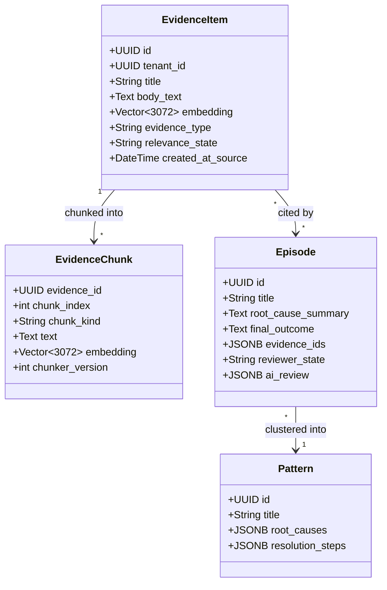
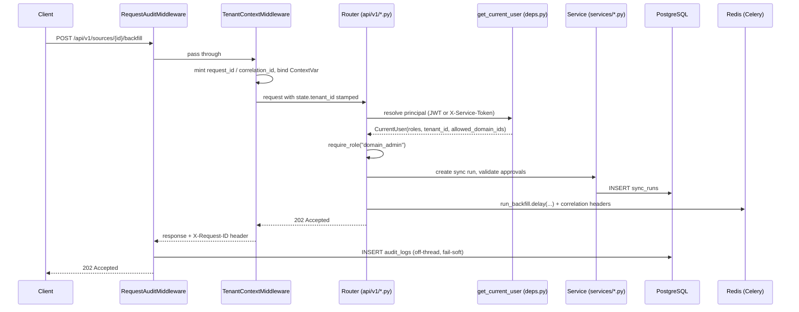

# ContextEdge Backend Knowledge Transfer (KT)

> **Important**: This is the most important documentation file for the backend. It walks the `contextedge` Python package folder by folder, names the real functions that do the work, and cites `file:line` so you can click straight through to the code.
>
> **Verified against the working tree on 2026-08-19.** Line numbers move when files are edited — if a citation looks off by a few lines, search for the named symbol instead.

## Table of Contents
1. [Introduction](#introduction)
2. [The one pipeline you must understand](#the-one-pipeline-you-must-understand)
3. [Folder 1: Root files](#folder-1-root-files)
4. [Folder 2: API v1 routers](#folder-2-api-v1-routers)
5. [Folder 3: Models](#folder-3-models)
6. [Folder 4: Schemas](#folder-4-schemas)
7. [Folder 5: Services](#folder-5-services)
8. [Folder 6: Workers](#folder-6-workers)
9. [Folder 7: AI module](#folder-7-ai-module)
10. [Folder 8: Graph module](#folder-8-graph-module)
11. [Folder 9: Search module](#folder-9-search-module)
12. [Folder 10: Connectors](#folder-10-connectors)
13. [Folder 11: Middleware](#folder-11-middleware)
14. [Folder 12: Integrations (MAF)](#folder-12-integrations-maf)
15. [Deep dives](#deep-dives)

---

## Introduction

The ContextEdge backend is a Python 3.12 application built on **FastAPI** (the web layer) and **Celery** (the background-work layer). It ingests tickets, chats and email from customer IT-ops systems, turns them into searchable **evidence**, links that evidence into a **context graph**, and uses that graph to recommend **playbooks** when a new incident arrives.

Three plain-English definitions, because they are used constantly below:

- **Backend** — the server-side program. It answers HTTP requests from the web UI, reads and writes the database, and hands slow jobs to background workers.
- **API** — Application Programming Interface. The set of URLs the frontend (or another system) calls, for example `POST /api/v1/runtime/match`.
- **Database** — we use **PostgreSQL 16 with the `pgvector` extension** for *everything*: relational rows, full-text search, and AI vector embeddings. There is no separate vector database and no separate graph database.

Three corrections to assumptions people usually arrive with:

| Common assumption | What is actually true |
| --- | --- |
| "There is a vector DB like Pinecone or Qdrant." | No. Embeddings live in `vector(3072)` columns in Postgres, indexed by pgvector HNSW over a `halfvec(3072)` cast (`backend/alembic/versions/0032_halfvec_hnsw_indexes.py`). |
| "The graph is Neo4j." | No. The graph is the `graph_edges` table in the same Postgres database, written through `backend/src/contextedge/graph/builder.py:50`. |
| "MAF is some internal module framework." | MAF is **Microsoft Agent Framework**. `backend/src/contextedge/integrations/maf/` adapts our context graph into the shape an MAF agent consumes. |

**Package root:** `backend/src/contextedge/`. Every path below is relative to the repository root, so `backend/src/contextedge/main.py` is a real, copy-pasteable path.

**Our running example everywhere in the docs** is the *Acme VPN incident*: tenant Acme Corp, a corporate VPN outage traced to gateway `vpn-gw-east-01`, ticket `INC0010427`, plus duplicate tickets, a Teams thread and an engineer's root-cause email. Every stage below is illustrated with that one incident so you can follow a single record end to end.

---

## The one pipeline you must understand

Almost everything in this backend is one long chain: **connector → raw object → evidence → chunks + embeddings → correlation → episode → pattern → playbook**. If you know which function owns each hop, the folder tour below becomes a lookup table instead of a reading assignment.

```
API call or Beat tick
  └─ sync.run_backfill / sync.run_incremental_sync          [queue: sync]
       connector.backfill() / fetch_changes()
       → persist_ingestion_events()  (raw rows; >32 KB payload → MinIO)
       → commit, then one normalize task per new raw id
  └─ extraction.normalize_evidence                          [queue: extraction]
       noise gate → redact → dedupe → relevance (LLM) → gate
       → message function (LLM) → error signatures
       → identities (LLM) → decisions (LLM) → parent embedding
       → chunk dispatch
       post-commit fan-out:
         ├─ hydration.hydrate_thread                        [queue: hydration]
         ├─ artifact.extract_attachment                     [queue: extraction]
         ├─ extraction.correlate_evidence                   [queue: correlation]
         │    └─ extraction.reconstruct_episode (+180 s)    [queue: correlation]
         ├─ extraction.compute_evidence_baseline            [queue: correlation]
         └─ extraction.chunk_evidence → embed_chunks_batch  [queue: embedding]
  └─ human or AI approves the episode
       └─ evaluation.extract_issue_signature                [queue: evaluation]
       └─ pattern.cluster_episodes                          [queue: pattern]
            └─ pattern.generate_playbook_candidate          [queue: pattern]
```

Stage-by-stage, with the function that owns it:

| Stage | Entry point | Where |
| --- | --- | --- |
| Pull records from a source | `run_backfill_job` / `run_incremental_job` | `backend/src/contextedge/services/sync_worker_service.py:419`, `:526` |
| Store the raw payload | `persist_ingestion_events` | `backend/src/contextedge/services/ingestion_persistence.py:19` |
| Offload payloads over 32 KB to MinIO | `OFFLOAD_THRESHOLD_BYTES = 32_768` | `backend/src/contextedge/services/ingestion_persistence.py:16`, applied at `:84` |
| Turn a raw payload into evidence | `_normalize` | `backend/src/contextedge/workers/extraction_tasks.py:122` |
| Pull the rest of a conversation | `_hydrate` | `backend/src/contextedge/workers/hydration_tasks.py:36` |
| Split evidence into retrievable chunks | `write_chunks` | `backend/src/contextedge/services/evidence_chunk_service.py:43` |
| Embed chunks in batches of 32 | `embed_chunks_batch` | `backend/src/contextedge/workers/chunk_tasks.py:234` |
| Link related evidence into a case | `correlate_evidence_item` | `backend/src/contextedge/services/correlation_service.py:197` |
| Narrate a cluster into an episode | `_reconstruct` | `backend/src/contextedge/workers/extraction_tasks.py:995` |
| Machine first-pass review of a draft | `ai_review_episode` | `backend/src/contextedge/services/episode_review_service.py:174` |
| Fingerprint an approved episode | `extract_issue_signature` | `backend/src/contextedge/services/issue_signature_service.py:89` |
| Cluster episodes into a pattern | `_cluster` | `backend/src/contextedge/workers/pattern_tasks.py:127` |
| Draft a playbook from a pattern | `pattern.generate_playbook_candidate` | `backend/src/contextedge/workers/pattern_tasks.py:403` |
| Rank playbooks for a live incident | `rank_playbooks` | `backend/src/contextedge/search/hybrid_ranker.py:213` |

**Acme VPN, one sentence per hop:** the ServiceNow connector fetches `INC0010427`; `persist_ingestion_events` writes the raw JSON; `_normalize` cleans and classifies it, resolves `vpn-gw-east-01` as a device identity, and chunks it; hydration pulls the work-notes thread and each substantive message becomes its own evidence row; correlation ties the duplicate tickets and the Teams thread into one canonical case; reconstruction narrates them into a draft episode; a reviewer approves it; a signature fingerprints it as `remote_access|tls_certificate|certificate_expired`; clustering folds it into a pattern; playbook generation drafts the fix.

---

## Folder 1: Root files
**Path:** `backend/src/contextedge/`

### Why this folder exists
It bootstraps the application: the FastAPI app object, typed settings, database engines, request dependencies, and the seed scripts.

### What files are inside
`main.py`, `config.py`, `database.py`, `deps.py`, `security_tokens.py`, `migration_support.py`, `seed.py`, `seed_guard.py`, `reset_db_and_seed.py`, `demo_maf_seed.py`.

### File details

#### `main.py` — importance 10
- **Purpose:** builds and exports the FastAPI application (`create_app()` at `backend/src/contextedge/main.py:109`, exported as `app` at `:215`).
- **Middleware order added:** `RequestAuditMiddleware`, `TenantContextMiddleware`, `CORSMiddleware` (`main.py:122-130`). Starlette runs added middleware outermost-last, so the audit layer wraps everything.
- **Global exception handler** (`main.py:132-166`): logs the full traceback server-side but returns only `{"detail": "Internal server error", "request_id": ...}`. It re-adds CORS headers by hand, because it runs *outside* `CORSMiddleware` — without that, a browser could not read the very `request_id` the handler exists to hand you.
- **Metrics:** `Instrumentator().instrument(app).expose(app)` publishes `/metrics` (`main.py:168`).
- **Routers:** everything mounts under `/api/v1` (`main.py:171`).
- **Lifespan** (`main.py:44-59`): opens the Redis client onto `app.state.redis` and calls MinIO `ensure_bucket` on a worker thread. A MinIO failure only degrades (`object_store_ok=False`); it does not stop startup.
- **Health contract:** `/health` is pure liveness (`main.py:173-177`). `/ready` probes the database, the Alembic head, and Redis with a 5 s timeout each and returns **503** on any failure (`main.py:179-210`). The object store is reported as `ok|degraded` but deliberately does **not** gate readiness.

#### `config.py` — importance 10
- **Purpose:** one `pydantic-settings` class holding every setting. Reads the repo-root `.env` first, then `backend/.env`, ignoring unknown keys (`config.py:10-15`).
- **Fail-fast guards run at import time.** Outside `APP_ENV=development`, a default `JWT_SECRET_KEY` raises `RuntimeError` (`config.py:248-252`), and a missing or placeholder `FERNET_KEY` raises too (`config.py:254-264`) — because encrypted source credentials become unrecoverable if that key changes.
- **Settings you will meet constantly:** model routing (`config.py:53-67`), per-task output-token ceilings `{"playbook": 16384, "extraction": 16384, "pattern": 16384}` (`config.py:132-138`), thinking budgets `{"relevance": 0}` (`config.py:188`), default per-tenant daily budget of 2,000,000 tokens / $25 with action `block` (`config.py:191-198`), `episode_resolution_gate` (`config.py:175`), `episode_ai_review` (`config.py:185-187`), `redaction_enabled = True` (`config.py:236`).
- The full annotated list lives in [13_Developer_Guide.md](13_Developer_Guide.md#11-configuration-reference) and `.env.example`.

#### `database.py` — importance 10
- **Purpose:** the async SQLAlchemy engine and session factory (`database.py:9-26`).
- **Two engine shapes.** The API uses a pooled engine (`pool_size=20, max_overflow=10, pool_timeout=30`, `database.py:19-21`). Workers call `create_db_engine(use_null_pool=True)` so each Celery task gets a fresh `NullPool` engine — this is what avoids the Windows "Event loop is closed" failure at connection check-in.
- `get_db()` (`database.py:29-42`) is the FastAPI dependency. It commits only if the session is still active, rolls back on exception, and always closes.

#### `deps.py` — importance 9
- **Purpose:** request-scoped dependencies, above all `get_current_user` (`deps.py:72-114`).
- **Two kinds of principal.** An `X-Service-Token` header wins when present and valid (403 if invalid); otherwise the Bearer JWT is decoded into a `CurrentUser` carrying `user_id`, `tenant_id`, `email`, `roles`, `workspace_ids`, `principal_type`, `allowed_domain_ids`.
- **Role checks:** `has_role` returns True unconditionally for `platform_super_admin`, `tenant_admin` or `admin` (`deps.py:37-44`); `require_role` raises 403 (`deps.py:46-51`).
- **Caveat you must know:** `RoleBinding.scope_type` / `scope_id` exist in the schema but are **not enforced**. Login flattens role *names* into the JWT, so a domain admin bound to one domain holds that role tenant-wide on every `require_role` route. Finer scoping only comes from `allowed_domain_ids` / `workspace_ids` where an individual route consults them. This is a documented architectural gap, not an oversight (`codewiki/KNOWN_GAPS.md:187-191`).

#### `security_tokens.py` — importance 9
Parses `settings.service_tokens_json` into service-account contexts (`security_tokens.py:12-36`). A service token without `allowed_domain_ids` is tenant-wide.

#### `migration_support.py` — importance 6
Holds `widen_alembic_version_column` (`migration_support.py:58-80`), the idempotent `ALTER COLUMN ... TYPE VARCHAR(255)` that Alembic's `env.py` runs before any migration. Six revision ids in this chain exceed 32 characters, and databases created by Alembic older than 1.10 sized `alembic_version.version_num` at `VARCHAR(32)` — those upgrades died on the *stamp*, which reads like a broken migration.

#### `seed.py`, `seed_guard.py`, `reset_db_and_seed.py`, `demo_maf_seed.py` — importance 5–8
`seed.py` inserts the local dev tenant, users, workspaces and domains. `seed_guard.require_destructive_reset_allowed` (`seed_guard.py:20-60`) blocks `reset_db_and_seed` and `demo_maf_seed` — both TRUNCATE tenant-global tables — unless `APP_ENV=development` or `CONTEXTEDGE_ALLOW_DB_RESET=1`.

---

## Folder 2: API v1 routers
**Path:** `backend/src/contextedge/api/v1/`

### Why this folder exists
These are the HTTP endpoints the Next.js frontend and any external caller use. Routers stay thin: validate, authorize, call a service, serialize.

### What is inside
**33 routers**, all mounted under `/api/v1` (`backend/src/contextedge/api/v1/__init__.py:41-83`):

`auth`, `tenants`, `workspaces`, `domains`, `users`, `audit` (`/audit-logs`), `sources`, `sync` (`/sync-runs`), `evidence`, `threads`, `episodes`, `patterns`, `playbooks`, `sessions`, `runtime`, `evaluations`, `policies`, `action_policies`, `drift`, `execution`, `decisions`, `contradictions`, `notifications`, `negative_knowledge`, `identities`, `correlations`, `policy_assignments`, `knowledge_supersessions`, `skills`, `graph`, `inventory`, `review_queue`, `admin_cost` (`/admin`).

### Representative routers

#### `auth.py` — importance 10
`POST /api/v1/auth/login` (`api/v1/auth.py:35-101`). Three details worth knowing because they look odd until you know why:
- It fetches **up to 5** active users matching the email, because `email` is unique per tenant, not globally — `scalar_one_or_none` would 500 on a cross-tenant duplicate, and the cap bounds attacker-triggered bcrypt work.
- With no candidate it still verifies against a dummy bcrypt hash, so response timing cannot enumerate valid emails (`auth.py:16-18, 58-64`).
- Same email *and* same password in two tenants returns 401 "Ambiguous account" instead of guessing (`auth.py:76-89`).
The JWT carries `{sub, tenant_id, email, roles, exp}` (`auth.py:21-32`), expiring after `jwt_access_token_expire_minutes` (60).

#### `sources.py` — importance 9
Source CRUD, credential upload, discovery, and the ingest controls. `POST .../backfill` dispatches `run_backfill.delay(...)` (`api/v1/sources.py:408-410`); sync-now dispatches `run_incremental_sync.delay(...)` (`:281-282`). `POST /api/v1/sources/{id}/sync/control` with `{action: pause|resume|cancel}` is `domain_admin`-gated (`:295-312`) and writes a cooperative stop signal onto the running `sync_runs` row (`:329-352`), then audits it as `sync.<action>` (`:354-363`).

#### `episodes.py` — importance 9
Episode listing, detail (which exposes `ai_review` verbatim, `api/v1/episodes.py:145`), single approve (`:230-268`) and bulk approve (`:282-339`). Both approval paths follow the same rule: **commit first, dispatch after** — a signature or clustering task consumed before the commit would read a still-pending episode and no-op without retry. `POST /api/v1/episodes/ai-review` (`:556-604`) dispatches the machine review sweep on demand, `knowledge_manager`-gated.

#### `runtime.py` — importance 10
`POST /api/v1/runtime/match` (`api/v1/runtime.py:89-246`) is the product's highest-value call: it assembles memory context, ranks playbooks, records a decision-trace event and an operational event, and caches the full explain payload in Redis for one hour (`:29, 230-238`) so `GET /api/v1/runtime/explain/{match_id}` can serve it back.

#### `admin_cost.py` — importance 8
`GET /admin/llm-usage`, `GET/PUT /admin/tenant-budget`, `GET /admin/tenant-budget/status`, `GET /admin/pipeline-health` (`api/v1/admin_cost.py:33, 102, 113, 137, 166`). The last one is the operator's single best diagnostic; see [Folder 5](#folder-5-services).

---

## Folder 3: Models
**Path:** `backend/src/contextedge/models/`

### Why this folder exists
SQLAlchemy 2.0 declarative classes: one Python class per database table. They define the schema that Alembic migrations create.

### Base classes
`backend/src/contextedge/models/base.py`:
- `Base` — the declarative base (`base.py:9-10`).
- `TimestampMixin` — server-default `created_at` / `updated_at` (`base.py:13-19`).
- `TenantScopedMixin` — inherits `TimestampMixin` and adds an indexed `tenant_id` (`base.py:22-27`). **Every tenant-scoped table uses this.** Forgetting it is how a table ends up leaking across tenants.

### The model files that matter most

| File | Tables it defines |
| --- | --- |
| `models/tenant.py` | `tenants`, `workspaces`, `domains`, `users`, `role_bindings`, `tenant_llm_budgets` (`tenant.py:12-143`) |
| `models/source.py` | `sources`, `source_objects`, `source_credentials`, `sync_checkpoints`, `sync_runs` (`source.py:11-164`) |
| `models/evidence.py` | `raw_evidence_objects` (`:25`), `evidence_items` (`:47`), `evidence_chunks` (`:189`), `threads` (`:223`), `attachment_artifacts` (`:248`) |
| `models/episode.py` | `canonical_identities` (`:48`), `identity_aliases` (`:91`), `evidence_identity_links` (`:152`), `correlation_edges` (`:187`), `episodes` (`:213`) |
| `models/pattern.py` | `patterns` (`:23`), `graph_edges` (`:174`) |
| `models/playbook.py` | `playbooks`, `playbook_versions`, `playbook_evidence_links` |
| `models/issue_signature.py` | `issue_signatures` (`:30`), `episode_issue_signatures` (`:66`) |
| `models/policy.py` | `tenant_policies` (`:31`), `policy_checks` (`:70`) |
| `models/events.py` | `operational_events` (`:13`), `notifications` (`:64`) |
| `models/audit.py` | `audit_logs` (`:11`) |

### Columns you will keep meeting

On `evidence_items` (`models/evidence.py:47-170`): `title`, `body_text`, `body_summary`, `content_hash`, `evidence_type`, `source_type`, `relevance_state`, `relevance_score`, `message_function`, `canonical_entity_refs` (a JSONB cache of resolved identities and decisions), `embedding Vector(3072)` (`:91`), `search_tsvector` (`:108`), `chunked_at` / `chunk_count`, `applicability` (`:139`), `knowledge_state` (`:146`), `case_state` (`:153`), `source_facets` (`:159`), `knowledge_support` (`:170`), plus `workspace_id` / `domain_id` scope.

On `graph_edges` (`models/pattern.py:174-273`): `source_node_type`/`id`, `target_node_type`/`id`, `edge_type`, **`weight` (traversal importance) and `confidence` (belief) — these are different things and callers pass both when they mean both**, `metadata_extra`, `valid_from`, `valid_to`. The partial unique index `uq_graph_edges_active_logical` covers the full logical key `WHERE valid_to IS NULL` with `NULLS NOT DISTINCT` (`:187-199`); that index is what makes `ensure_edge` race-safe.



---

## Folder 4: Schemas
**Path:** `backend/src/contextedge/schemas/`

### Why this folder exists
Pydantic models used for request validation and response serialization. They are the API's contract; SQLAlchemy models are the database's contract, and the two deliberately do not have to match.

### What is inside
`admin_cost.py`, `audit.py`, `common.py`, `decision.py`, `evidence.py`, `execution.py`, `playbook.py`, `review.py`, `review_queue.py`, `session.py`, `source.py`, `tenant.py`.

Note that the schema layer is **thinner than the model layer** on purpose. Many routers return plain dicts assembled in the router or service, because response shapes for the graph, projection and pipeline-health surfaces are dynamic. Add a schema when the shape is stable and shared; do not add one just for symmetry.

---

## Folder 5: Services
**Path:** `backend/src/contextedge/services/` (about 90 modules, plus `services/chunkers/` and `services/documents/`)

### Why this folder exists
This is where the actual business logic lives. Routers are thin; workers are thin; services are where the thinking happens. A service function takes an `AsyncSession` and does one job.

### The services grouped by what they do

**Ingest and normalization**
- `ingestion_persistence.py` — `persist_ingestion_events` (`:19`) writes raw rows, dedupes on `(tenant_id, source_id, external_id, content_hash)`, and offloads any payload over `OFFLOAD_THRESHOLD_BYTES = 32_768` (`:16`) to MinIO, leaving the stub `{"_offloaded": true, "size_bytes": N}` in the column (`:84-87`).
- `message_filter.py` — the deterministic pre-LLM noise gate for hydrated messages. `MIN_DIAGNOSTIC_CHARS = 150` (`:52`) plus 15 technical-signal regexes; a message under the floor with no technical signal is `coordination_only` and **no evidence row is created**. `MESSAGE_FILTER_VERSION = "v1"` (`:108`) is stamped on the skip so a rule change can re-judge exactly which messages were dropped. Measured: 47 % of 18,907 live messages rejected.
- `evidence_normalization.py` — title/body extraction and thread creation (`:14-198`). The body extractor strips quoted history and trailing boilerplate structurally and never returns empty or a dict repr.
- `redaction_service.py` — ordered regex redaction, secrets before numerics so a token is never half-redacted (`:36-191`). Runs before embedding and before any LLM call.
- `evidence_typing.py`, `knowledge_lifecycle.py`, `case_state.py`, `source_facets.py` — the four pure derivations `_normalize` applies to a payload. `knowledge_lifecycle.is_current` treats **NULL as current** (`knowledge_lifecycle.py:133-139`): "the source did not say" must serve, or every non-ServiceNow corpus empties.
- `ingest_priority.py` — optional per-source-object ordering of the normalize queue. Fail-soft: an ordering error returns the original list unchanged (`:63-67`).
- `thread_text_service.py` — cross-message quote stripping during hydration; measured 89 % of substantive text was repetition.

**Identity**
- `identity_service.py` — the four-layer resolver (`resolve_extracted_entities`, `:616-796`): strong identifier → typed exact alias → LLM adjudication → provisional creation. Auto-link thresholds are `{"person": 0.95}` with a 0.9 default (`:58-59`); below threshold the system mints a `needs_review` identity rather than guessing.
- `identity_candidacy.py` — the gate that rejects non-identity mentions before they cost an LLM call. Identity work was 78 % of all model spend before this existed.
- `identity_normalizer.py`, `identity_promotion.py`, `identity_reconciliation_service.py` — normalization, corroboration promotion (≥2 linked evidence items and ≤5, `identity_promotion.py:58-65`), and the daily merge-proposal pass that **proposes but never merges**.

**Retrieval feed**
- `evidence_chunk_service.py` — `write_chunks` (`:43-132`) persists chunk rows and stamps `chunked_at` / `chunk_count`.
- `chunkers/` — `registry.py` resolves a chunker from `(source_type, evidence_type)` (`:116-143`), and `fallback.py`, `ticket.py`, `thread.py`, `attachment.py`, `document.py` implement them. Record shape beats source type: a Zoho `kb_article` goes to the document chunker, not the ticket chunker.
- `knowledge_retrieval_service.py` — the RAG path that feeds retrieved KB/SOP text into playbook generation.

**Correlation and episodes**
- `correlation_service.py` — `correlate_evidence_item` (`:197`) runs two tiers: deterministic case links at confidence 1.0, and gated identity co-occurrence inside a 7-day window (`IDENTITY_CORRELATION_WINDOW`, `:38`) with rarity weighting and a hub cutoff.
- `ticket_bridge_service.py`, `servicenow_reference_service.py`, `jira_reference_service.py`, `zoho_desk_reference_service.py`, `sapphireims_reference_service.py` — per-source enrichment that turns vendor reference fields into case-link keys, typed edges and entity rows. Each runs inside a SAVEPOINT so a failure loses enrichment, never the correlation.
- `episode_cluster_service.py` — `resolve_episode_cluster` materializes the connected component before any LLM sees it, bounded by `MAX_CLUSTER_SIZE = 50`, `MAX_HOPS = 3`, `CLUSTER_TIME_WINDOW = 30 days` (`:47-49`) and fenced in SQL against legal hold and pending redaction.
- `episode_service.py` — persistence of extracted episodes with per-episode evidence membership from validated citations.
- `episode_review_service.py` — the machine first-pass reviewer. Modes `off | advisory | auto_approve`; deterministic auto-approve floors `MIN_EVIDENCE = 2`, `MIN_OUTCOME_CHARS = 20`, `MIN_VERDICT_CONFIDENCE = 0.8` (`:42-44`).

**Knowledge**
- `issue_signature_service.py` — `extract_issue_signature` (`:89`) distills an approved episode into a generalized fingerprint like `remote_access|tls_certificate|certificate_expired`, then `_link_recurrence` (`:249-312`) adds a low-confidence `recurrence` pointer from the new episode's seed evidence to the earlier occurrence's case at `RECURRENCE_CONFIDENCE = 0.6` (`:37`). **Recurrence never merges clusters** — the episode cluster resolver explicitly refuses to expand through it.
- `pattern_service.py` — `create_pattern_from_episodes` (`:62-197`), with a domain-safety assertion so one domain's episode text can never land inside another domain's pattern.
- `playbook_service.py`, `playbook_embedding.py`, `knowledge_supersession_service.py`, `knowledge_validation_service.py`.

**Platform**
- `tenant_budget_service.py` — `check_budget` (`:234-282`) is called before every LLM spend. A tenant with no `tenant_llm_budgets` row gets the deployment defaults through the identical evaluation path.
- `event_log_service.py` — `append_operational_event` (`:32-61`); correlation, causation and actor default from the request context automatically.
- `pipeline_health_service.py` — `get_pipeline_health` (`:87`) reads Redis `LLEN` per lane plus `HLEN unacked` for in-flight work, and one SQL statement that counts the whole chain end to end so the **first zero in the sequence is the diagnosis**. `BACKLOG_ALERT_DEPTH = 500` (`:55`).
- `retention_service.py`, `notification_service.py`, `policy_check_service.py`, `approval_policy_service.py`, `action_policy_service.py`, `object_store.py`, `sync_control_service.py`, `sync_worker_service.py`.

### Function detail: `write_chunks` (in `evidence_chunk_service.py`)
- **Purpose:** turn one evidence row into retrievable chunk rows.
- **Parameters:** `db`, `evidence`, `payload`, plus the resolved chunker.
- **Steps** (`services/evidence_chunk_service.py:43-132`):
  1. `get_chunker(source_type, evidence_type)` then `chunker.chunk(title=, body=, payload=)` — pure and deterministic, no I/O.
  2. `DELETE FROM evidence_chunks WHERE evidence_id = :e AND chunker_version = :v` — re-run safety **at the same version only**; other versions are kept so two chunker generations can be compared side by side.
  3. Insert rows with a per-chunk SHA-256 `content_hash` and a defaulted `source_authority`.
  4. Stamp the parent's `chunked_at` and `chunk_count`, then log `evidence.chunked`.
- **`_default_authority`** (`:135-169`) checks **evidence type before source type**: a `kb_article` gets `knowledge_article` authority so the Acme VPN KB page does not compete with `INC0010427` as if it were a ticket.
- **Failure behavior:** a chunker that fails to import is skipped at registry load and resolution falls through to `fallback`; a chunking failure in `_normalize` is caught, logged as `chunking_failed`, and the parent embedding still stands.

---

## Folder 6: Workers
**Path:** `backend/src/contextedge/workers/`

### Why this folder exists
Background work. LLM calls take seconds to a minute; a 1,000-ticket backfill takes hours. None of that can happen inside an HTTP request.

### The Celery app
`celery_app.py:142-190` builds the app: broker Redis DB 1, result backend Redis DB 2 (`config.py:26-28`), 19 task modules in `include`. Two more are pulled in indirectly — `chunk_tasks` via an import in `extraction_tasks.py:43`, and `evidence_typing_tasks` which registers `extraction.backfill_evidence_types`.

Core configuration (`celery_app.py:192-200`): JSON-only serialization, UTC, `task_track_started=True`, `task_acks_late=True` (a crashed worker's task is re-delivered — this is what makes the multi-process Windows topology safe), `worker_prefetch_multiplier=1`.

Broker resilience (`celery_app.py:216-224`): retry forever with `broker_connection_max_retries=None`, socket keepalive, 30 s health checks. The reason is recorded in the file: on the Windows dev box Redis is reached through WSL's port relay, which drops TCP connections under load — one blip previously killed four of eight workers silently.

### Queues (this is the part people get wrong)

`task_routes` is **order-matched**; an earlier key beats a later wildcard (`celery_app.py:226-279`):

| Route key | Queue | Why |
| --- | --- | --- |
| `sync.*` | `sync` | isolated from the extraction backlog |
| `hydration.*` | `hydration` | source rate limits are its own problem |
| `extraction.classify_relevance` | `default` | fast lane — a ~2.5 s gate call must not queue behind 20–60 s episode tasks |
| `extraction.correlate_evidence`, `extraction.reconstruct_episode`, `extraction.compute_evidence_baseline` | `correlation` | graph lane |
| `extraction.chunk_evidence`, `extraction.embed_chunks_batch` | `embedding` | retrieval lane |
| `extraction.*`, `artifact.*` | `extraction` | |
| `pattern.*` | `pattern` | |
| `evaluation.*` | `evaluation` | |
| `review_queue.*`, `contextedge.workers.*` | `default` | |

**The full queue set is eight: `default, sync, hydration, extraction, correlation, embedding, pattern, evaluation`** — exactly `DEFAULT_QUEUES` in `backend/dev.py:16`. The `correlation` and `embedding` lanes were added on 2026-08-17 because FIFO starvation was measurable and severe: the extraction queue grew ~70 tasks/min at 8,255 deep, correlation tasks were dispatched but never consumed, and 1,879 chunks existed with only 289 (15 %) embedded — evidence that was ingested and silently unretrievable. `backend/dev.py:12-16` records that those two lanes were missing from the consumed set for a month.

> Note: `identity.*` and `maintenance.*` use short task names that match no explicit route and no `contextedge.workers.*` module path, so they land on `task_default_queue = "default"` (`celery_app.py:280`). Any doc claiming identity reconciliation runs on `evaluation` is wrong.

### How a task touches the database
Every task body is an `async def work(db)` handed to `run_async` (`workers/asyncio_runner.py:31-34`). `_with_session` creates a **fresh NullPool engine per task**, opens one session, commits on success, rolls back on exception, and disposes the engine (`asyncio_runner.py:10-28`). The cost is that each running task holds its own connections (roughly 2–3 × concurrency); the benefit is that no loop or connection is ever shared across worker threads.

### Workers refuse to start behind the schema
The `worker_ready` signal `_require_migrations_at_head` (`celery_app.py:83-139`) compares `alembic_version.version_num` to the bundled scripts' head and calls `SystemExit` on a **definite** mismatch — including "no `alembic_version` table at all". Transient DB errors and installed layouts without the alembic directory are skipped with `worker.migration_check_skipped`. Without this, workers consume the normalize queue against a stale schema and corrupt ingestion mid-transaction.

### Registered tasks

| Task name | Module | Queue |
| --- | --- | --- |
| `sync.trigger_scheduled_syncs` / `run_backfill` / `run_incremental_sync` | `sync_tasks.py:14, 39, 68` | sync |
| `hydration.hydrate_thread` | `hydration_tasks.py:189` | hydration |
| `extraction.normalize_evidence` | `extraction_tasks.py:1304` | extraction |
| `extraction.classify_relevance` | `extraction_tasks.py:1361` | default |
| `extraction.reconstruct_episode` | `extraction_tasks.py:1391` | correlation |
| `extraction.correlate_evidence` | `correlation_tasks.py:16` | correlation |
| `extraction.compute_evidence_baseline` | `evidence_baseline_tasks.py:26` | correlation |
| `extraction.chunk_evidence` / `embed_chunks_batch` | `chunk_tasks.py:210, 238` | embedding |
| `extraction.backfill_evidence_types` | `evidence_typing_tasks.py:100` | extraction |
| `extraction.rebuild_identity_snapshots` | `identity_tasks.py:72` | extraction |
| `artifact.extract_attachment` | `artifact_tasks.py:15` | extraction |
| `pattern.cluster_episodes` / `generate_playbook_candidate` / `deduplicate_knowledge` | `pattern_tasks.py:379, 403, 791` | pattern |
| `evaluation.ai_review_episodes` | `evaluation_tasks.py:129` | evaluation |
| `evaluation.extract_issue_signature` | `signature_tasks.py:24` | evaluation |
| `evaluation.generate_correlation_suggestions` | `suggestion_tasks.py:26` | evaluation |
| `evaluation.detect_drift` / `scan_contradictions_task` | `evaluation_tasks.py:41, 88` | evaluation |
| `evaluation.apply_retention_archive` / `purge_archived` | `retention_tasks.py:72, 104` | evaluation |
| `evaluation.cleanup_hard_deleted_evidence` | `cleanup_tasks.py:165` | evaluation |
| `evaluation.reconcile_graph_relationships` | `graph_tasks.py:33` | evaluation |
| `evaluation.verify_executions` | `verification_tasks.py:112` | evaluation |
| `evaluation.detect_fleet_groups` | `fleet_tasks.py:41` | evaluation |
| `evaluation.warm_cmdb_topology` | `cmdb_tasks.py:74` | evaluation |
| `evaluation.calibrate_decision_confidence` / `mine_decision_patterns` | `decision_tasks.py:130, 34` | evaluation |
| `evaluation.backfill_playbook_embeddings` | `playbook_tasks.py:74` | evaluation |
| `identity.reconcile_identities` | `identity_tasks.py:147` | default (fallback) |
| `maintenance.infer_ci_relatedness` / `reclassify_stale_evidence` | `maintenance_tasks.py:46, 71` | default (fallback) |
| `review_queue.prefetch_review_context` | `review_queue_tasks.py:33` | default |

### Beat schedule
14 entries (`celery_app.py:281-384`). **Exactly one beat process** — a second one double-dispatches everything. Every fan-out task takes the literal sentinel `"all"` and iterates tenants with per-tenant exception isolation, so one bad tenant never stops a sweep.

Highlights: `trigger-syncs-every-15m` (900 s), `detect-drift-every-6h`, `scan-contradictions-every-12h`, `reconcile-identities-daily`, `reconcile-graph-relationships-every-6h`, `retention-archive-daily`, `retention-purge-weekly`, `cleanup-hard-deleted-daily`, `verify-executions-every-15m`, `detect-fleet-groups` (1800 s), `deduplicate-knowledge-hourly`, `ai-review-episodes-hourly`.

Two of those hourly sweeps share a **defer gate**: `tenant_pipeline_active` (`pattern_tasks.py:705-742`) counts fresh evidence (>50) or fresh episodes (>30) in the last 10 minutes and skips the tenant rather than churning against an active ingest. The episode threshold exists because a 12:29 sweep once retired 446 drafts mid-reconstruction-tail while watching only evidence inflow.

`ai-review-episodes-hourly` is scheduled **unconditionally** even though `EPISODE_AI_REVIEW` defaults to `off` — the task returns `{"status": "disabled"}` instantly, so turning the feature on needs no beat restart (`evaluation_tasks.py:171-173`).

---

## Folder 7: AI module
**Path:** `backend/src/contextedge/ai/`

### Why this folder exists
Everything that talks to a language model, and everything that decides whether it should.

### What is inside
`provider.py`, `prompts/`, `extractors/`, `classifiers/`, `generators/`, `embeddings.py`, `observability.py`, `resilience.py`, `fencing.py`, `text_salience.py`, `provenance.py`.

#### `provider.py` — importance 10
The one funnel. `llm_complete` (`:177`) and `llm_complete_json` (`:504`) wrap LiteLLM and add, in order:
1. **Budget gate** — `check_budget(db, tenant_id)` before spending. `block` raises `TenantBudgetExceeded`; `warn` proceeds and writes an `llm.budget_warning` event (`provider.py:231-279`).
2. **Output-token clamp** — `ceiling = settings.llm_task_output_tokens.get(task, settings.llm_max_output_tokens)` (`provider.py:290-291`). This matters: the old flat 4096 ceiling silently truncated playbook JSON mid-array, and the repair path then persisted a playbook with **zero steps while reporting success**.
3. **Circuit breaker and timeout** — 120 s per call, 5 consecutive failures opens the breaker for 60 s (`ai/resilience.py:28-30`), with one optional fallback-model attempt.
4. **JSON repair ladder** for truncated output (`provider.py:549-597`).
5. **Usage recording in a `finally` block**, even on error.

Embeddings: `generate_embedding` (`:739`) and `generate_embeddings_batch` (`:814`). Both **hard-fail any model that does not return exactly 3,072 dimensions** (`:787-793`). The batch path re-checks the budget per sub-batch, so a long ingest stops at the cap instead of finishing past it.

#### `prompts/` — importance 10
Eleven prompt families: `applicability`, `contradiction`, `decision`, `episode`, `episode_review`, `identity`, `issue_signature`, `message_function`, `pattern`, `playbook`, `relevance` (`ai/prompts/__init__.py:189-201`).

**Prompts are immutable once shipped.** New behavior means a new version, never an edit — old versions stay registered so evaluation baselines keep working. `get_prompt(name, tenant_id)` resolves tenant override → registered default; an unknown prompt name raises `KeyError` on purpose (fail loud), while an unregistered *override* falls back with a `prompt_variant_not_registered_falling_back` log (`ai/prompts/__init__.py:124-162`). Current defaults include `relevance` v2 (v3 registered but deliberately not default), `identity` v3, `identity_adjudication` v2, `decision` v2, `episode` v3, `pattern` v2, `message_function` v1, `issue_signature` v1, `episode_review` v1.

#### `extractors/` and `classifiers/`
`extractors/`: `identity_extractor.py`, `decision_extractor.py`, `episode_extractor.py`, `episode_schema.py`, `pattern_extractor.py`.
`classifiers/`: `relevance.py`, `message_function.py`, `episode_review.py`.

Both families wrap untrusted evidence text in `fence_untrusted` markers (`ai/fencing.py`) before it reaches a prompt, and slice input with `salient_slice` (`ai/text_salience.py`) so a 40 KB thread does not become a 40 KB prompt.

#### `observability.py` — importance 9
`record_llm_usage` (`:133`) is the single recorder. Per call it: increments three Prometheus counters — `contextedge_llm_tokens_total`, `contextedge_llm_requests_total`, `contextedge_llm_reasoning_tokens_total` (`:39-60`); writes one structured `llm.usage` log line; and inserts one `OperationalEvent(event_type="llm.usage")` carrying model, tokens, `prompt_name`, `prompt_version`, `duration_ms` and optional `subject_type` / `subject_id` anchoring. **That operational-events table is the source of truth for budgets and the cost dashboard** — there is no second aggregation column to drift out of sync.

#### `provenance.py`
Stamps `generation_provenance` onto episodes, patterns and playbook versions after their schema gate, so the model cannot supply its own provenance. It records `model_requested`; the circuit breaker can substitute the fallback model mid-call, and only the `llm.usage` event observes that, joined by `correlation_id`.

---

## Folder 8: Graph module
**Path:** `backend/src/contextedge/graph/`

### Why this folder exists
The context graph — which incident touched which CI, which decision was based on which evidence, which episode belongs to which pattern. It is stored in Postgres (`graph_edges`), not in a graph database.

### What is inside
`builder.py`, `edge_types.py`, `queries.py`, `temporal.py`, and `agent/` (`contracts.py`, `profiles.py`, `repository.py`, `selector.py`, `hydrators.py`, `materializer.py`, `service.py`).

#### `builder.py` — importance 9
- `add_edge` (`:16-47`) validates the type then inserts with `valid_from = now()`.
- `ensure_edge` (`:50-135`) is the idempotent create used almost everywhere: SELECT first, then `INSERT ... ON CONFLICT DO NOTHING` against `uq_graph_edges_active_logical`, then a re-select for the race loser. Two workers cannot abort each other's transaction.
- `close_edge` (`:138-173`) sets `valid_to`. The edge type is validated even here, because a typo would "close nothing and report success".
- `persist_pattern_enrichment_edges` (`:477-518`) creates deterministic virtual nodes (uuid5) for triggers, entities, errors and root causes and links them to a pattern at weight 1.5.

#### `edge_types.py` — importance 8
Declares **69 edge types** in five semantic groups; `require_registered` is enforced in every writer and raises `UnknownEdgeType` (`:1-33`). Adding a type is two decisions: register it, then either allowlist it in `MAF_RELATIONSHIP_TYPES` or record the reason in `PROJECTION_EXCLUSIONS`. `backend/tests/test_edge_type_registry.py` enforces the pairing, so you cannot register a type and forget the projection decision.

#### `agent/` — the MAF projection
This is what an agent actually sees. `AgentGraphBudget` defaults to 24 nodes / 48 relationships / depth 2 / 12,000 characters, with hard caps at 100 / 250 / 3 / 50,000 (`agent/contracts.py:26-30`). Profile `maf.v1` (`agent/profiles.py`) declares 20 node types and 50+ relationship types, with **deliberate exclusions carrying their reasons in comments** — `mentions_identity` is excluded because it fans out 40–70 edges per handful of tickets and would spend the whole budget on identity hubs.

`materializer.py` — `GraphRelationshipMaterializer.reconcile_tenant` (`:54-359`) streams relational rows and calls `ensure_edge` for each. It is additive-only and idempotent, scheduled every 6 hours on the `evaluation` queue. There is no event-driven materialization yet.

---

## Folder 9: Search module
**Path:** `backend/src/contextedge/search/`

### Why this folder exists
Hybrid retrieval: keyword (Postgres full-text search) plus vector similarity, filtered by tenant, access policy and knowledge lifecycle, then ranked.

### What is inside
`vector_ops.py`, `vector_search.py`, `chunk_rollup.py`, `pg_fts.py`, `hybrid_ranker.py`, `access_control.py`, `risk_policy.py`.

#### `vector_ops.py` — importance 10 for its size
Two functions, both load-bearing:
- `halfvec_cosine_distance(column, embedding)` (`:40-45`) casts **both sides** to `halfvec(3072)`. This is not optional styling: pgvector's HNSW on the plain `vector` type caps at 2,000 dimensions and we store 3,072, so migration `0032` built HNSW **expression** indexes over `(embedding::halfvec(3072))`. A bare `column.cosine_distance(...)` is a guaranteed sequential scan.
- `tune_ann_recall(db)` (`:34-37`) runs `SET LOCAL hnsw.ef_search = 200` (`ANN_EF_SEARCH`, `:31`). The indexes are global across tenants while every query post-filters by `tenant_id`; at pgvector's default `ef_search = 40` a small tenant's rows can be absent from the candidate set entirely.

#### `vector_search.py` + `chunk_rollup.py` — importance 10
`search_evidence_semantic` (`vector_search.py:204-243`) runs a five-step pipeline:
1. Embed the query, then `tune_ann_recall`.
2. **Chunk pass** — one ANN query over `evidence_chunks` joined to `evidence_items`, oversampled to `min(max(80, limit*3), 240)` (`:40-46`), with visibility predicates applied on the parent (legal hold, pending redaction, excluded access policies).
3. **MMR** at chunk level — `mmr_order` with `MMR_LAMBDA = 0.7` (`chunk_rollup.py:31`), so near-duplicate chunks from the same thread cannot crowd out a distinct thread.
4. **Rollup** — one candidate per parent evidence, its closest chunk (`chunk_rollup.py:111-121`).
5. **Parent-pass merge** — a second ANN over `evidence_items.embedding` in the same cosine space, so evidence with no chunks still surfaces.

Result shape is `(EvidenceItem, distance, best_chunk | None)`, and `best_chunk` carries a `parent_section` breadcrumb, `chunk_kind` and a 240-character snippet.

Degradation is deliberate: a malformed chunk vector makes MMR fall back to pure distance ordering rather than failing the request.

#### `hybrid_ranker.py` — importance 10
`rank_playbooks` (`:213-379`) is the scorer behind `/runtime/match`. Weights (`:22-31`): keyword 0.25, semantic 0.30, graph 0.15, evidence quality 0.10, identity 0.05, recency 0.10, freshness 0.05, negative penalty −0.05. It abstains below `MIN_RECOMMENDATION_SCORE = 0.35` (`:168`) and logs `ranking.abstained` — **an empty list means "no recommendation", by contract**, not "search failed".

#### `pg_fts.py`
`search_evidence_fts` (`:12-81`) — `plainto_tsquery` over `evidence_items.search_tsvector`, OR-ed with two fallbacks: a ticket-number lookup into `raw_evidence_objects` (so a reviewer can find `INC0010427` by typing the number) and a `title ILIKE` match. By default it excludes `evidence_type = 'thread_message'` unless a type is requested, because hydrated replies belong under their parent's thread view.

---

## Folder 10: Connectors
**Path:** `backend/src/contextedge/connectors/`

### Why this folder exists
Integrations with the external systems whose records become evidence.

### The contract every connector implements
`BaseConnector` (`connectors/base.py:78-141`) has **five abstract methods** — note these names, the older docs had them wrong:

| Method | Returns | What it does |
| --- | --- | --- |
| `validate_credentials()` | `CredentialStatus` | can we talk to this system, and to which modules |
| `discover_objects()` | `list[DiscoveredObject]` | what can be synced (tables, mailboxes, modules) |
| `backfill(object_id, object_type, window, checkpoint)` | `BackfillResult` | historical pull; carries `has_more` for budgeted resumption |
| `fetch_changes(object_id, object_type, checkpoint)` | `ChangeResult` | incremental pull; the checkpoint is **non-optional** |
| `hydrate_thread(thread_ref)` | `HydratedThread` | fetch the rest of a conversation |

The unit handed to persistence is `IngestionEvent` — `external_id`, `source_type`, `object_type`, `content` dict, optional `thread_id`, `timestamp`, `metadata` (`connectors/base.py:37-45`).

Connectors also honour a **cooperative stop**: the sync job installs a callback via `set_control_check()`, and connectors call `await self._check_control()` inside their loops (`base.py:82-107`). A backfill can spend fifteen minutes inside one `backfill()` call, so a signal checked only between invocations would do nothing for that whole time.

### The registry
`get_connector(source_type, source_config, credentials)` (`connectors/registry.py:113-122`) lazily registers seven classes via `_register_connectors` (`:91-110`) — `teams`, `gmail`, `servicenow`, `jira_sm`, `manageengine`, `sapphireims`, `zoho_desk` — and raises `ValueError("Unknown source type: …")` for anything else.

The source-creation UI catalog is **computed from the registry**, not written by hand: `source_type_catalog()` (`:69-88`) sets `connector_available` from `supported_source_types()` and only falls back to the declared `status_when_no_connector` when no class is registered. That coupling exists because the two lists had silently drifted **in both directions** — the picker offered Confluence, SharePoint and Exchange, none of which have a connector (creating one succeeded, then died at sync with "Unknown source type"), while SapphireIMS and Zoho Desk had working, tested connectors that could not be selected at all. Today `confluence`, `sharepoint` and `exchange` resolve to status `planned` (`:63-65`), and `local_file` to `manual` (upload, no connector by design). `backend/tests/test_source_type_catalog.py` asserts the catalog and the registry agree.

### Per-connector notes worth knowing on day one
- **ServiceNow** — table-driven (`incident`, `problem`, `change_request`, `kb_knowledge`, `sc_req_item`, `sc_task`, `em_alert` rolled up per CI/day), compound `(sys_updated_on, sys_id)` keyset checkpoint. It refuses `sysparm_offset` for incremental because ascending-offset paging can skip records.
- **Jira SM** — kind-prefixed thread ids (`incident:PROJ-123`), a JQL minute cursor with a 30-minute overlap rewind, bounded pagination.
- **Zoho Desk** — the most instructive one to read (`connectors/zoho_desk/connector.py`, ~1,700 lines). Two record families from one source (`tickets`, `articles`). Page size is hard-capped at 50. There is **no modified-since filter**, so incremental sync walks `sortBy=-modifiedTime` newest-first and stops at a checkpoint of `{last_updated, last_ids}` — a timestamp plus the ids already emitted at it, because ties arrive id-ascending inside a time-descending sequence. Access tokens are cached process-wide because Zoho's quota failure mode is **empty results, not errors**.
- **SapphireIMS** — endpoint paths and field names are config-mapped from `source_config["api"]` / `["fields"]` because the vendor contract is not public. Verify the defaults against the instance before the first sync.
- **Gmail / Teams** — conversational sources. Teams messages carry `message_id`, `reply_to_id`, `is_bot`, edit and delete metadata, which the reply-inheritance correlation tier depends on.

### Adding a connector
See [13_Developer_Guide.md §6.5](13_Developer_Guide.md#65-add-a-new-connector). Short version: new package under `connectors/`, subclass `BaseConnector`, implement all five methods, add it to the registry map, and add a reference service if the source exposes relationship fields.

---

## Folder 11: Middleware
**Path:** `backend/src/contextedge/middleware/`

### What is inside
`request_context.py`, `request_audit.py`, `audit.py`, `auth.py`.

#### `request_context.py` — importance 9
`TenantContextMiddleware.dispatch` (`:87-146`) mints or parses three ids per request — `request_id` (header `x-request-id`, else uuid4), `correlation_id`, `causation_id` — and binds them into a ContextVar (`:88-104`). It also decodes the Bearer JWT or service token **without enforcing** so `request.state.tenant_id/user_id/roles` are available to logging. Responses echo `X-Request-ID` and `X-Correlation-ID` (`:145-146`).

**The chain that makes one click traceable to one dollar of spend:**
1. Middleware binds the ids into a ContextVar.
2. Celery's `before_task_publish` signal `_inject_correlation_headers` copies them into the outgoing task message with `headers.setdefault`, so a caller-set header is never clobbered (`workers/celery_app.py:25-42`).
3. On the worker, `task_prerun` re-binds them for the task's duration, keyed per task id because concurrent pools interleave (`celery_app.py:45-68`); `task_postrun` resets (`:71-80`).
4. `append_operational_event` defaults `correlation_id` and `actor_id` from the ContextVar (`services/event_log_service.py:54-56`).

So the `llm.usage` events for classifying `INC0010427` carry the same `correlation_id` as the operator's "retry sync" click.

#### `request_audit.py` — importance 8
`RequestAuditMiddleware` (`:25-124`) fires **after** the response for every `POST/PATCH/PUT/DELETE` under `/api/v1` except `/auth/login`. It always writes one structlog `http.mutating_request` line, and additionally inserts an `audit_logs` row when the tenant is known, with `action = "http.<method>.<path-slug>"` and an outcome derived from status. The insert runs on a lazily-created **sync** engine off-thread and swallows its own failures as `audit_db_error` — auditing must never break the request.

Scope note baked into the code: unauthenticated 401 probes never resolve a tenant and therefore exist only in structlog. Alert on `http.mutating_request` with status 401 for those.

---

## Folder 12: Integrations (MAF)
**Path:** `backend/src/contextedge/integrations/maf/`

### What MAF is
**Microsoft Agent Framework.** This folder adapts ContextEdge into the shape an MAF agent consumes: a scoped, budgeted subgraph plus a small set of tools.

### What is inside
`client.py`, `tools.py`, `plugin.py`, `provider.py`, `_compat.py`. Client-only imports work without installing the optional MAF extra; framework-backed objects load lazily on first use (`integrations/maf/__init__.py:1-6`).

- **`client.py`** — transport protocols and implementations. `InProcessContextGraphClient` (`:105`) calls the projection service directly; `HttpContextGraphClient` (`:128`) goes over REST. Same for `InProcessCmdbTopologyClient` (`:30`), `InProcessChangeRiskClient` (`:66`), `InProcessFixApplicabilityClient` (`:81`), `InProcessCohortClient` (`:182`), `InProcessEdgeProposalClient`.
- **`tools.py`** — six tool classes: `ContextGraphTools.query_context_graph` (`:25-30`), `CohortTools.get_cohort_shared_attributes` (`:102-107`), `EdgeProposalTools.propose_dependency` (`:142-147`), `CmdbTopologyTools.cmdb_topology` (`:184-189`), `ChangeRiskTools.assess_change_risk` (`:225-230`), `FixApplicabilityTools.assess_fix_applicability` (`:273-278`).
- **`plugin.py`** — `ContextGraphMAFPlugin` (`:26`) bundles the tools for an agent.
- **`provider.py`** — `ContextGraphProvider` (`:28`) is a proactive context provider: `before_run` (`:50`) injects a scoped subgraph into the conversation, `after_run` (`:114`) writes decisions back.

### The honest limitation
**Every MAF tool on this branch is read-or-propose. There is no write-capable agent tool and no executor** (`codewiki/KNOWN_GAPS.md:34`). `execution_service` is a ledger driven by external callers, not an engine that runs steps. The autonomy-safety machinery (skills registry, approval binding, attempt ledger, trust profiles) is a prerequisite, not live exposure.

---

## Deep dives

### Deep dive 1: how an API request flows



### Deep dive 2: what `_normalize` actually does, in order

`backend/src/contextedge/workers/extraction_tasks.py:122-628`. This is the single densest function in the backend; knowing its order saves hours.

1. Load the raw object and its payload; an offloaded stub with no storage key returns `{"error": "raw_payload_offloaded_without_storage_key"}` (`:122-131`).
2. **Noise gate** for hydrated messages only — deterministic, pre-LLM. Rejection creates **no evidence row**; the raw object stays so a rule change can re-judge it (`:147-160`).
3. Title and body extraction, then `content_hash` over the **raw** body — pre-cleaning and pre-redaction, so tuning a regex never breaks dedupe (`:162-168`).
4. **Redaction** of title and body (`:170-182`). Everything downstream reads post-redaction text.
5. Build the identity-extractor input (title + body + first 2,000 chars of payload JSON), then re-redact it as one blob (`:184-198`).
6. **Dedupe** on `(tenant_id, content_hash)` (`:213-220`). A hit *refreshes* the existing row — facets, `case_state`, `knowledge_state`, missing embedding, attachments — and returns `{"deduped": true}`; the wrapper then skips the correlation/baseline/hydration fan-out.
7. Insert the new `EvidenceItem` with derived `evidence_type`, `knowledge_state`, `case_state`, `source_facets` and inherited scope (`:327-372`).
8. Insert race → `IntegrityError` → rollback, adopt the winner, **no repeated LLM spend** (`:374-409`).
9. Thread row and attachment artifacts (`:410-418`).
10. **LLM call 1 — relevance** (`:425-461`). Failure is fail-open: log and continue into the full pipeline.
11. **Extraction gate:** `skip_extraction = label == "not_relevant" AND confidence >= 0.75` (`:475-479`). Skipped items keep their evidence row for audit but get no further enrichment and no embedding — they are invisible to vector search by construction.
12. **LLM call 2 — message function**, conversational sources only (`:487-505`).
13. **Error-signature fingerprints** — deterministic, and it runs even for skipped items, because a confidently-irrelevant thread can still carry a pasted stack trace (`:507-526`).
14. **LLM call 3 — identities** (`:528-549`), fail-soft.
15. **LLM call 4 — decisions** (`:550-566`), fail-soft. Identities run before decisions; both merge into `canonical_entity_refs` under separate keys.
16. **Parent embedding** (`:567-571`).
17. **Chunk dispatch** (`:573-585`): inline when the body is under 16 KB *and* the source is in the inline allowlist; otherwise async.
18. **Post-commit fan-out** in the task wrapper (`:1306-1354`): attachments, or correlation + baseline; plus auto-hydration when the payload carried a `_thread_id` and the record is not itself a hydrated message.

Each enrichment step is individually try/except'd. A blocked tenant's evidence still lands as a row — un-embedded and un-linked, but present and repairable.

### Deep dive 3: the failure map

| Failure | What happens | Where |
| --- | --- | --- |
| Worker starts against a stale schema | worker exits at startup; supervisor restart-loops until `alembic upgrade head` | `workers/celery_app.py:83-139` |
| Second sync for the same source object | returns `skipped_locked` via a transaction-scoped advisory lock | `services/sync_worker_service.py:379-395` |
| Incremental with no checkpoint | run completes as `skipped_no_checkpoint`, never a surprise full pull | `services/sync_worker_service.py:571-595` |
| Normalize enqueue fails after commit | un-enqueued raw ids parked on `source_objects.metadata_extra["pending_normalize_raw_ids"]`; the next run re-drains them | `services/sync_worker_service.py:322-376` |
| Raw payload over 32 KB | offloaded to MinIO, DB keeps a stub — **SQL that reads `raw_payload` silently sees the stub** | `services/ingestion_persistence.py:84-87` |
| MinIO slow or down | boto3 timeouts of 1 s each with one attempt, so it fails fast rather than stalling a worker | `services/object_store.py:28-33` |
| Concurrent normalize of the same content | `IntegrityError` → rollback → adopt the winner | `workers/extraction_tasks.py:374-409` |
| Chunk-embedding batch fails | log and `break` without raising; `embedding IS NULL` rows retry on the next replay | `workers/chunk_tasks.py:172-181` |
| Tenant hits the LLM budget with action `block` | `TenantBudgetExceeded` raised **before** spend; chunks stay unembedded | `ai/provider.py:242-245` |
| Primary model fails | one attempt on `llm_fallback_model`; usage recorded against whichever model served | `ai/provider.py:365` |
| Broker connection reset | retry forever plus keepalive — the worker pauses instead of dying | `workers/celery_app.py:216-224` |
| Audit insert fails | `audit_db_error` warning; the request is unaffected | `middleware/request_audit.py:115-122` |

### Where to go next

- **Set up and extend:** [13_Developer_Guide.md](13_Developer_Guide.md)
- **Something is broken:** [14_Debugging_Guide.md](14_Debugging_Guide.md)
- **Operate a running system:** [RUNBOOK.md](RUNBOOK.md)
- **Design rationale, chapter by chapter:** `codewiki/`
- **What is *not* finished:** `codewiki/KNOWN_GAPS.md` — read this before claiming any feature works end to end.
