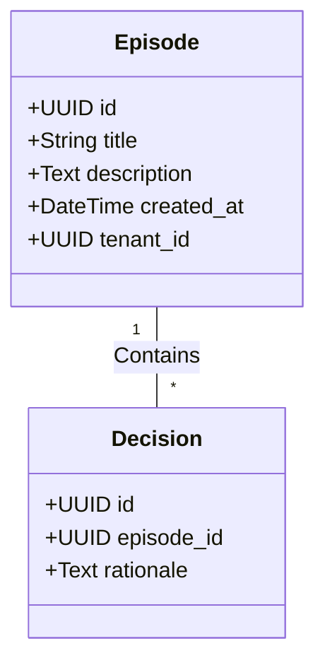
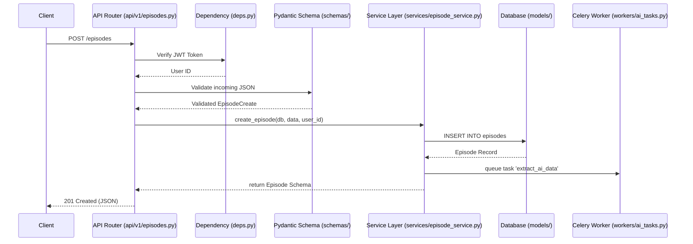

# ContextEdge Backend Knowledge Transfer (KT)

> **Important**: This is the MOST IMPORTANT documentation file for the backend. It covers the entire `contextedge` backend architecture, folder by folder, file by file.

## Table of Contents
1. [Introduction](#introduction)
2. [Folder 1: Root Files](#folder-1-root-files)
3. [Folder 2: API v1 Routers](#folder-2-api-v1-routers)
4. [Folder 3: Models](#folder-3-models)
5. [Folder 4: Schemas](#folder-4-schemas)
6. [Folder 5: Services](#folder-5-services)
7. [Folder 6: Workers](#folder-6-workers)
8. [Folder 7: AI Module](#folder-7-ai-module)
9. [Folder 8: Graph Module](#folder-8-graph-module)
10. [Folder 9: Search Module](#folder-9-search-module)
11. [Folder 10: Connectors](#folder-10-connectors)
12. [Folder 11: Middleware](#folder-11-middleware)
13. [Folder 12: Integrations (MAF)](#folder-12-integrations-maf)

---

## Introduction
The `ContextEdge` backend is a highly scalable, robust Python application (built with FastAPI). It handles AI-driven workflows, data extraction, graph-based knowledge mapping, and enterprise integrations. This document explains the architecture to a complete beginner. 

**What is a backend?** A backend is the "brain" of the application that runs on a server, invisible to the end user. It processes requests, interacts with the database, and returns data to the user interface (the frontend).

**What is an API?** Application Programming Interface. It is a set of rules that allows different software systems to communicate.

**What is a Database?** A structured system for storing data. We use a relational database (like PostgreSQL) for structured data and a vector database (like Pinecone/Qdrant) for AI embeddings.

---

## Folder 1: Root Files
**Path:** `d:\ContextEdge\backend\src\contextedge\`

### Why this folder exists
This is the entry point of the backend application. It contains the most fundamental configurations, the main application instance, database connections, and security protocols.

### What files are inside
- `main.py`
- `config.py`
- `database.py`
- `deps.py`
- `seed.py`
- `security_tokens.py`

### What responsibility it has
Bootstrapping the application, loading environment variables, setting up the database connection pool, defining global dependencies, and starting the web server.

### Which other folders use it
Every other folder relies on the configurations and dependencies defined here.

### File Details

#### `main.py`
- **File path:** `d:\ContextEdge\backend\src\contextedge\main.py`
- **Purpose:** The absolute entry point for the FastAPI application.
- **Why it was created:** To initialize the FastAPI app, register all routers, and set up middlewares (like CORS).
- **When it runs:** It runs when the server starts (e.g., via uvicorn).
- **Who imports it:** The ASGI server (uvicorn/gunicorn) imports this file to run the app.
- **Which APIs use it:** It hosts all APIs.
- **Which services call it:** None; it calls services.
- **Which database tables it accesses:** None directly, but it initializes the DB connection.
- **Which vector collections it uses:** None directly.
- **Configuration used:** Reads from `config.py` (e.g., APP_NAME, VERSION).
- **Error handling:** Global exception handlers are registered here.
- **Importance rating (1-10):** 10

#### `config.py`
- **File path:** `d:\ContextEdge\backend\src\contextedge\config.py`
- **Purpose:** Manages environment variables and application settings using Pydantic BaseSettings.
- **Why it was created:** To ensure all configurations are typed, validated, and easily accessible.
- **When it runs:** At application startup.
- **Who imports it:** Almost every file in the project.
- **Which APIs use it:** All APIs indirectly.
- **Which services call it:** All services.
- **Which database tables it accesses:** None.
- **Which vector collections it uses:** None.
- **Configuration used:** .env file.
- **Error handling:** Raises Pydantic ValidationError if env vars are missing/invalid.
- **Importance rating (1-10):** 10

#### `database.py`
- **File path:** `d:\ContextEdge\backend\src\contextedge\database.py`
- **Purpose:** Sets up the SQLAlchemy Engine, SessionLocal, and Base declarative class.
- **Why it was created:** To abstract database connection logic.
- **When it runs:** At startup and during every request (yielding DB sessions).
- **Who imports it:** `models/`, `deps.py`, `seed.py`.
- **Which APIs use it:** All APIs via dependencies.
- **Which services call it:** Services use the session yielded by this file.
- **Which database tables it accesses:** Manages connection to all tables.
- **Which vector collections it uses:** None.
- **Configuration used:** DATABASE_URL from `config.py`.
- **Error handling:** Connection pooling errors handled by SQLAlchemy.
- **Importance rating (1-10):** 10

#### `deps.py`
- **File path:** `d:\ContextEdge\backend\src\contextedge\deps.py`
- **Purpose:** Defines FastAPI dependencies (e.g., `get_db`, `get_current_user`).
- **Why it was created:** To promote code reuse and modularity in API endpoints.
- **When it runs:** On every API request that requires a database or authentication.
- **Who imports it:** `api/v1/` routers.
- **Which APIs use it:** All APIs.
- **Which services call it:** None.
- **Which database tables it accesses:** Yields session; authentication may access `users` table.
- **Which vector collections it uses:** None.
- **Configuration used:** Security keys from `config.py`.
- **Error handling:** Raises HTTPException (e.g., 401 Unauthorized).
- **Importance rating (1-10):** 9

#### `seed.py`
- **File path:** `d:\ContextEdge\backend\src\contextedge\seed.py`
- **Purpose:** Populates the database with initial/dummy data.
- **Why it was created:** For development and testing environments to have a baseline of data.
- **When it runs:** Manually via CLI or CI/CD pipelines.
- **Who imports it:** Dev scripts.
- **Which APIs use it:** None.
- **Which services call it:** None.
- **Which database tables it accesses:** Tenants, Users, Domains, Roles.
- **Which vector collections it uses:** None.
- **Configuration used:** DB config.
- **Error handling:** Logs errors if seeding fails.
- **Importance rating (1-10):** 5

#### `security_tokens.py`
- **File path:** `d:\ContextEdge\backend\src\contextedge\security_tokens.py`
- **Purpose:** Logic for generating and verifying JWT (JSON Web Tokens).
- **Why it was created:** To handle stateless authentication securely.
- **When it runs:** During login (token creation) and on protected routes (token verification).
- **Who imports it:** `deps.py`, `api/v1/auth.py`.
- **Which APIs use it:** Login APIs and protected APIs.
- **Which services call it:** Auth services.
- **Which database tables it accesses:** None.
- **Which vector collections it uses:** None.
- **Configuration used:** JWT_SECRET_KEY, ALGORITHM, ACCESS_TOKEN_EXPIRE_MINUTES.
- **Error handling:** Raises ExpiredSignatureError or JWTError.
- **Importance rating (1-10):** 9

---

## Folder 2: API v1 Routers
**Path:** `d:\ContextEdge\backend\src\contextedge\api\v1\`

### Why this folder exists
It contains the HTTP endpoints (routers) that external clients (like the React frontend) call.

### What files are inside
- `auth.py`
- `episodes.py`
- `decisions.py`
- `playbooks.py`
- `...` and many more.

### What responsibility it has
Receiving HTTP requests, validating input data via Schemas, calling Services to perform business logic, and returning HTTP responses.

### Which other folders use it
It acts as the edge of the backend. It uses `Schemas`, `Services`, and `deps.py`.

### File Details (Representative Examples)

#### `auth.py`
- **File path:** `d:\ContextEdge\backend\src\contextedge\api\v1\auth.py`
- **Purpose:** Endpoints for user authentication (login, logout, refresh).
- **Why it was created:** To allow users to authenticate and get JWTs.
- **When it runs:** When a user logs in.
- **Who imports it:** `api/v1/__init__.py` to register in the main router.
- **Which APIs use it:** POST `/auth/login`
- **Which services call it:** It calls `AuthService`.
- **Which database tables it accesses:** `users`
- **Which vector collections it uses:** None
- **Configuration used:** None directly.
- **Error handling:** 401 Unauthorized if credentials fail.
- **Importance rating (1-10):** 10

#### `episodes.py`
- **File path:** `d:\ContextEdge\backend\src\contextedge\api\v1\episodes.py`
- **Purpose:** Endpoints to manage "Episodes" (key events tracked by ContextEdge).
- **Why it was created:** To CRUD episodes.
- **When it runs:** When frontend queries or creates episodes.
- **Who imports it:** Main router.
- **Which APIs use it:** GET `/episodes`, POST `/episodes`
- **Which services call it:** It calls `EpisodeService`.
- **Which database tables it accesses:** `episodes`, `evidence`
- **Which vector collections it uses:** `episode_embeddings`
- **Configuration used:** None directly.
- **Error handling:** 404 Not Found if episode doesn't exist.
- **Importance rating (1-10):** 8

---

## Folder 3: Models
**Path:** `d:\ContextEdge\backend\src\contextedge\models\`

### Why this folder exists
Contains SQLAlchemy ORM (Object-Relational Mapping) classes. These map Python classes to SQL database tables.

### What files are inside
- `user.py`
- `episode.py`
- `decision.py`
- `playbook.py`

### What responsibility it has
Defining the database schema (tables, columns, foreign keys, relationships).

### Which other folders use it
`Services` (for querying), `API` (rarely directly, mostly via schemas), `Seed`.

### Class Detail: `Episode` (in `episode.py`)
- **Purpose:** Represents an episode in the database.
- **Methods:** Mostly attributes (`id`, `title`, `description`, `created_at`), might have properties or small helper methods.
- **Dependencies:** SQLAlchemy `Base`, `Column`, `String`, `Integer`, `ForeignKey`.

---

## Folder 4: Schemas
**Path:** `d:\ContextEdge\backend\src\contextedge\schemas\`

### Why this folder exists
Contains Pydantic models. These are used for data validation, serialization (Python to JSON), and deserialization (JSON to Python).

### What files are inside
- `episode_schema.py`
- `user_schema.py`
- `decision_schema.py`

### What responsibility it has
Ensuring incoming request payloads are valid and formatting outgoing response payloads correctly.

### Which other folders use it
`API` (for typing endpoints), `Services` (for typing inputs/outputs).

### Class Detail: `EpisodeCreate`
- **Purpose:** Schema for creating an episode. Ensures `title` is provided.
- **Methods:** Pydantic validators (e.g., `@validator('title')` to ensure not empty).
- **Dependencies:** Pydantic `BaseModel`.

---

## Folder 5: Services
**Path:** `d:\ContextEdge\backend\src\contextedge\services\`

### Why this folder exists
The core business logic resides here. Controllers (APIs) are dumb; Services are smart. They orchestrate database calls, external API calls, and complex algorithms.

### What files are inside
- `episode_service.py`
- `auth_service.py`
- `sync_service.py`

### What responsibility it has
Handling the "how" of the application. E.g., How do we create an episode? We save it to the DB, generate embeddings via AI, and index it in the graph.

### Which other folders use it
`API`, `Workers`.

### Function Detail: `create_episode` (in `episode_service.py`)
- **Purpose:** Creates a new episode and triggers background processing.
- **Parameters:** 
  - `db` (Session): Database session.
  - `episode_in` (EpisodeCreate): The data to create.
  - `user_id` (UUID): Who created it.
- **Return value:** `Episode` model instance.
- **Caller:** `api/v1/episodes.py` -> `POST /episodes`
- **Step-by-step logic:**
  1. Validate data.
  2. Create `Episode` SQLAlchemy model.
  3. `db.add(episode)` and `db.commit()`.
  4. Dispatch Celery task to extract AI patterns.
  5. Return episode.
- **Error cases:** DB constraint violation (raises 400).
- **Importance:** 9

---

## Folder 6: Workers
**Path:** `d:\ContextEdge\backend\src\contextedge\workers\`

### Why this folder exists
Contains background tasks (e.g., Celery tasks). Long-running tasks shouldn't block the API response.

### What files are inside
- `celery_app.py`
- `ai_tasks.py`
- `sync_tasks.py`

### What responsibility it has
Executing async jobs like generating vector embeddings, sending emails, or scraping Jira tickets.

### Which other folders use it
`Services` queue tasks here.

---

## Folder 7: AI Module
**Path:** `d:\ContextEdge\backend\src\contextedge\ai\`

### Why this folder exists
Houses all Large Language Model (LLM) integrations, prompts, and extraction logic. ContextEdge relies heavily on AI to understand business context.

### What files are inside
- `provider.py` (Connects to OpenAI/Anthropic)
- `embeddings.py` (Generates vectors)
- `extractors/` (Logic to pull specific entities from text)
- `prompts/` (System prompts)

### What responsibility it has
Talking to AI models, ensuring JSON outputs, managing tokens, and generating embeddings.

### Which other folders use it
`Services`, `Workers`.

### File Detail: `ai/provider.py`
- **Purpose:** Singleton or factory for the LLM client.
- **Why it was created:** To avoid hardcoding OpenAI calls everywhere, allowing swapping of models.
- **When it runs:** When AI generation is needed.
- **Importance:** 10

---

## Folder 8: Graph Module
**Path:** `d:\ContextEdge\backend\src\contextedge\graph\`

### Why this folder exists
ContextEdge maps relationships between entities (e.g., User -> created -> Decision -> belongs_to -> Episode). This folder handles graph database interactions (like Neo4j) or in-memory graph logic.

### What files are inside
- `graph_builder.py`
- `agent/` (Graph-based AI agents for reasoning over the graph)

### What responsibility it has
Inserting nodes and edges, querying shortest paths, and semantic network traversal.

---

## Folder 9: Search Module
**Path:** `d:\ContextEdge\backend\src\contextedge\search\`

### Why this folder exists
Handles hybrid search (Keyword + Vector similarity search).

### What files are inside
- `vector_store.py`
- `hybrid_search.py`

### What responsibility it has
Taking a user query, embedding it, querying Pinecone/Qdrant, querying PostgreSQL (Full Text Search), and reranking results.

---

## Folder 10: Connectors
**Path:** `d:\ContextEdge\backend\src\contextedge\connectors\`

### Why this folder exists
Integrates with external third-party systems to ingest data into ContextEdge.

### What files are inside
- `gmail/`
- `jira_sm/`
- `servicenow/`
- `teams/`

### What responsibility it has
Authenticating via OAuth, fetching data (emails, tickets, messages), and mapping them to internal ContextEdge schemas (like `Evidence`).

---

## Folder 11: Middleware
**Path:** `d:\ContextEdge\backend\src\contextedge\middleware\`

### Why this folder exists
Intercepts HTTP requests before they reach the API routers, and responses before they leave.

### What files are inside
- `logging_middleware.py`
- `tenant_middleware.py`

### What responsibility it has
Logging request metrics, injecting tenant IDs into context variables for multi-tenancy.

---

## Folder 12: Integrations (MAF)
**Path:** `d:\ContextEdge\backend\src\contextedge\integrations\maf\`

### Why this folder exists
MAF (Module Integration Framework or similar) handles specific enterprise integrations or plugin architectures specific to the ContextEdge ecosystem.

### What files are inside
- `maf_client.py`
- `maf_sync.py`

### What responsibility it has
Pushing and pulling state from the MAF service, keeping systems in sync.

---

# Detailed Deep Dives

## Deep Dive: How an API request flows

## AI Extractor Pattern
The `ai/extractors/` folder contains classes that take unstructured text and use LLMs to output structured data.

### Class: `EpisodeExtractor`
- **Purpose:** Analyzes a block of text (e.g., an email thread) and decides if it constitutes an "Episode" (a major event).
- **Methods:**
  - `extract(text: str) -> EpisodeExtractResult`
- **Dependencies:** `provider.py`, `prompts/episode.py`

## Conclusion
This document provides a holistic view of the `ContextEdge` backend. The separation of concerns (API -> Services -> Database) ensures the codebase remains maintainable, testable, and scalable.

*Generated comprehensively for KT purposes.*
