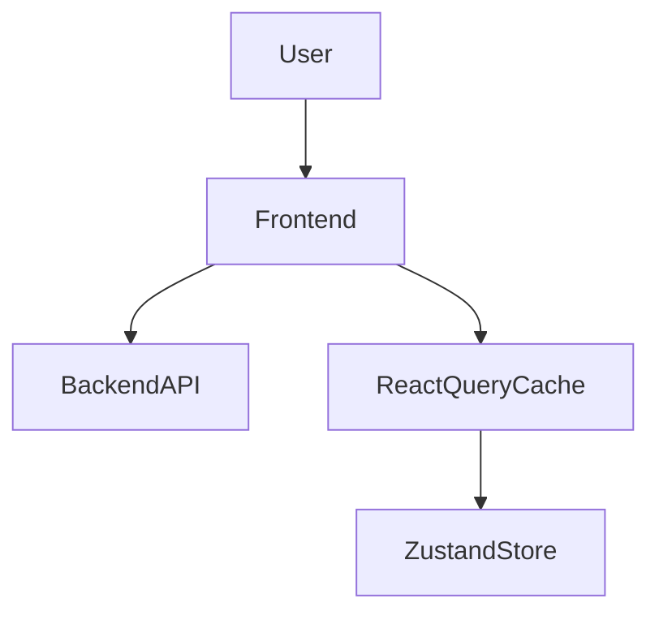
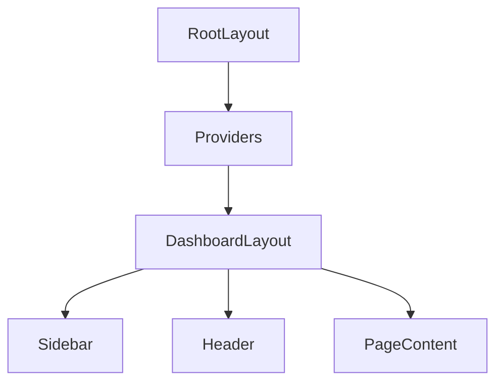
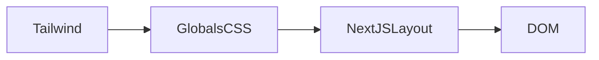

# ContextEdge — Frontend Knowledge Transfer

## 1. Frontend Overview

**What**
The ContextEdge frontend is a modern web application designed as the primary user interface for the platform. It enables users to interact with operational memory, playbooks, review queues, and system analytics.

**Why**
A decoupled frontend architecture using a robust, reactive tech stack ensures a scalable, maintainable, and high-performance user experience. By splitting the responsibilities, the frontend can be optimized for fast loading times, interactive data visualizations, and smooth transitions, without being bogged down by heavy data lifting. 

**Where**
All frontend code is situated within the `d:\ContextEdge\frontend` directory. 

**Who calls it**
It is the main entry point for end-users via their web browsers. It communicates exclusively with the backend API.

**What happens next**
When a user navigates to the application, the frontend initializes a session, checks for valid authentication tokens, fetches user-specific configurations, and renders the specific route. If the user is unauthenticated, they are immediately redirected to the login view.

**Input**
User interactions (clicks, keyboard input, form submissions).

**Output**
Rendered HTML/CSS DOM elements, data sent to the backend API, visual graphs, and alerts.

**Failure behavior**
If the backend is down, React Query will display a global error state or local error boundaries will catch the failure, prompting the user to try again.

**Design rationale**
The architecture leverages Next.js App Router for optimal Server-Side Rendering (SSR) capabilities, caching, and clear directory-based routing. React acts as the UI library. Tailwind CSS and shadcn/ui enable rapid UI development. TanStack Query is chosen for server state management.

**File Rating**: 10/10

---

## 2. Configuration Files

### `package.json`

**What**: The manifest file for the frontend project.
**Why**: Manages dependencies, scripts, and project metadata.
**Where**: `d:\ContextEdge\frontend\package.json`
**Who calls it**: Node.js package managers (npm/yarn/pnpm) and build tools.
**What happens next**: It resolves all versions and downloads them to `node_modules`.
**Input**: npm install command.
**Output**: A fully populated node_modules folder.
**Failure behavior**: If a package fails to install, the build fails.
**Design rationale**: Standard Node ecosystem requirement.
**File Rating**: 9/10

### `next.config.ts`

**What**: The configuration file for Next.js.
**Why**: Customizes the behavior of the Next.js build and runtime environments.
**Where**: `d:\ContextEdge\frontend\next.config.ts`
**Who calls it**: Next.js build engine.
**What happens next**: Modifies the internal webpack configuration.
**Input**: Config options.
**Output**: Modified build pipeline.
**Failure behavior**: Misconfiguration will break the local dev server and production build.
**Design rationale**: Uses TypeScript for type safety of the configuration itself.
**File Rating**: 5/10 (currently empty).

### `components.json`

**What**: The configuration file for shadcn/ui.
**Why**: Tells the shadcn CLI how to install and format components.
**Where**: `d:\ContextEdge\frontend\components.json`
**Who calls it**: shadcn CLI tool.
**What happens next**: When you run `npx shadcn add button`, it reads this file to know where to put the button code.
**Input**: CLI commands.
**Output**: Generated `.tsx` files in the components folder.
**Failure behavior**: If missing, shadcn CLI will fail to run.
**Design rationale**: Enforces strict paths and styles (`base-nova`, `neutral` colors) across the team.
**File Rating**: 7/10

### `tsconfig.json`

**What**: The TypeScript compiler configuration.
**Why**: Ensures type safety and defines compilation rules for the project.
**Where**: `d:\ContextEdge\frontend\tsconfig.json`
**Who calls it**: TSC (TypeScript Compiler) and VS Code Language Server.
**What happens next**: Validates all `.ts` and `.tsx` files.
**Input**: Source code.
**Output**: Error diagnostics or successful compilation.
**Failure behavior**: Halts the build if strict type errors are found.
**Design rationale**: Uses `bundler` resolution and sets up path aliases (`@/*`) for clean imports.
**File Rating**: 10/10

### `vitest.config.ts`

**What**: The configuration file for the Vitest test runner.
**Why**: Configures testing environments and aliases.
**Where**: `d:\ContextEdge\frontend\vitest.config.ts`
**Who calls it**: Vitest CLI.
**What happens next**: Sets up the JSDOM environment for tests.
**Input**: Test commands.
**Output**: Test pass/fail reports.
**Failure behavior**: Tests fail to run if misconfigured.
**Design rationale**: Fast, native ESM support replacing Jest.
**File Rating**: 8/10

---

## 3. App Layout & Routing

### Root Layout (`src/app/layout.tsx`)

**What**: The foundational HTML wrapper for every page.
**Why**: Ensures that global styles, fonts, and providers are loaded exactly once.
**Where**: `src/app/layout.tsx`
**Who calls it**: Next.js router on initial page load.
**What happens next**: Renders the HTML structure and children.
**Input**: React children elements.
**Output**: The complete HTML document string.
**Failure behavior**: If it crashes, the entire app goes white (White Screen of Death).
**Design rationale**: Keeps all global providers (Themes, Tanstack) at the absolute top of the React tree.
**File Rating**: 10/10

### Root Page (`src/app/page.tsx`)

**What**: The entry point at `/`.
**Why**: Acts as a traffic controller to direct users based on auth state.
**Where**: `src/app/page.tsx`
**Who calls it**: Next.js router.
**What happens next**: Redirects to `/overview` or `/login`.
**Input**: URL visit.
**Output**: A router replace action.
**Failure behavior**: Might loop if auth state is corrupted.
**Design rationale**: Client-side redirection allows reading local storage before showing UI.
**File Rating**: 8/10

### Auth Group (`src/app/(auth)`)

**What**: Route group for authentication-related pages.
**Why**: Prevents auth pages from inheriting the main dashboard layout.
**Where**: `src/app/(auth)/...`
**Who calls it**: Next.js router.
**What happens next**: Renders login components.
**Input**: URL visit.
**Output**: Login view.
**Failure behavior**: Renders a 404 if route doesn't exist inside.
**Design rationale**: Using `(group)` syntax keeps URLs clean (no `/auth/login`, just `/login`).
**File Rating**: 7/10

### Dashboard Group (`src/app/(dashboard)`)

**What**: The primary workspace layout applied to all logged-in views.
**Why**: Wraps all operational pages in the consistent shell UI.
**Where**: `src/app/(dashboard)/layout.tsx`
**Who calls it**: Next.js router.
**What happens next**: Mounts the Sidebar, Header, and specific page content.
**Input**: Child page component.
**Output**: Dashboard shell UI.
**Failure behavior**: Redirects to `/login` if auth check fails on mount.
**Design rationale**: Persistent layout prevents re-rendering the sidebar on every page navigation.
**File Rating**: 10/10

---

## 4. Authentication

### Login Page

**What**: The page to enter credentials.
**Why**: To authenticate users.
**Where**: `src/app/(auth)/login/page.tsx`
**Who calls it**: Users navigating to `/login`.
**What happens next**: Calls API, stores token.
**Input**: Email and Password.
**Output**: JWT token.
**Failure behavior**: Shows error message below inputs.
**Design rationale**: Standard form validation.
**File Rating**: 8/10

### Token Management (`src/lib/auth.ts`)

**What**: Utility functions to handle JWTs.
**Why**: Abstract away `localStorage` interactions safely.
**Where**: `src/lib/auth.ts`
**Who calls it**: API interceptors, Auth Store, Router guards.
**What happens next**: Decodes token and checks expiry.
**Input**: JWT string.
**Output**: Parsed JSON payload.
**Failure behavior**: Returns null and clears storage if token is invalid or expired.
**Design rationale**: Centralized logic prevents duplicate JWT parsing code across the app.
**File Rating**: 10/10

### Auth Store (`src/lib/stores/auth-store.ts`)

**What**: A Zustand store for user state.
**Why**: Provides a reactive source of truth for auth status.
**Where**: `src/lib/stores/auth-store.ts`
**Who calls it**: UI components needing user details or roles.
**What happens next**: Components re-render automatically when auth state changes.
**Input**: Set action calls.
**Output**: Reactive state object.
**Failure behavior**: Defaults to unauthenticated state if hydration fails.
**Design rationale**: Avoids React Context performance issues by using Zustand.
**File Rating**: 10/10

---

## 5. Dashboard Shell

### Sidebar Navigation (`src/components/shell/sidebar-nav.tsx`)

**What**: Vertical menu of links.
**Why**: Primary navigation for the dashboard.
**Where**: `src/components/shell/sidebar-nav.tsx`
**Who calls it**: Dashboard Layout.
**What happens next**: Highlights active link based on URL.
**Input**: User's roles from auth store.
**Output**: Filtered list of React Router links.
**Failure behavior**: Defaults to showing basic routes if roles are missing.
**Design rationale**: Role-based filtering ensures users only see what they can access.
**File Rating**: 9/10

### App Header (`src/components/shell/app-header.tsx`)

**What**: Top horizontal bar.
**Why**: Global contextual controls (tenant switch, profile, theme).
**Where**: `src/components/shell/app-header.tsx`
**Who calls it**: Dashboard Layout.
**What happens next**: Renders dropdowns.
**Input**: User clicks.
**Output**: State changes or API calls.
**Failure behavior**: Dropdowns might not open if React crashes.
**Design rationale**: Glassmorphism styling (`.glass-header`) keeps it modern.
**File Rating**: 9/10

---

## 6. Every Dashboard Page

### Overview (`/overview`)
**What**: High-level snapshot of ingestion health, review queues, and playbooks.
**Why**: Landing page for operators.
**Where**: `src/app/(dashboard)/overview/page.tsx`
**Who calls it**: User navigation.
**What happens next**: Fetches 4 different endpoints simultaneously.
**Input**: None.
**Output**: Rendered StatTiles and Drift alerts.
**Failure behavior**: Renders error boundary box.
**Design rationale**: Uses `Promise.all` in React Query to fetch all stats concurrently for speed.
**File Rating**: 9/10

### Review Queue (`/review`)
**What**: Inbox for human-in-the-loop tasks.
**Why**: Operators must approve critical AI decisions.
**Where**: `src/app/(dashboard)/review/page.tsx`
**Who calls it**: User navigation.
**What happens next**: Fetches pending items.
**Input**: Approval clicks.
**Output**: Mutation API calls.
**Failure behavior**: Toast error.
**Design rationale**: Tabbed interface to separate different types of reviews.
**File Rating**: 8/10

### Sources (`/sources` & `/sources/[id]`)
**What**: Manage data connectors.
**Why**: Admins configure integrations here.
**Where**: `src/app/(dashboard)/sources/page.tsx`
**Who calls it**: Admin navigation.
**What happens next**: Lists configured sources.
**Input**: Form inputs for API keys.
**Output**: Source records.
**Failure behavior**: Validation errors on form.
**Design rationale**: Reusable `DataTable` component.
**File Rating**: 8/10

### Sync Operations (`/sync`)
**What**: Monitor data ingestion runs.
**Why**: Admins check for failing backfills.
**Where**: `src/app/(dashboard)/sync/page.tsx`
**Who calls it**: Admin navigation.
**What happens next**: Polls API for sync status.
**Input**: Manual sync trigger clicks.
**Output**: Run history lists.
**Failure behavior**: Displays JSON error payloads.
**Design rationale**: Polling ensures live updates.
**File Rating**: 8/10

### Evidence (`/evidence` & `/evidence/[id]`)
**What**: Browse and search raw ingested data.
**Why**: Traceability of decisions.
**Where**: `src/app/(dashboard)/evidence/page.tsx`
**Who calls it**: User navigation.
**What happens next**: Shows searchable table.
**Input**: Search query string.
**Output**: Filtered data rows.
**Failure behavior**: Shows empty state.
**Design rationale**: URL-driven state so searches are linkable and bookmarkable.
**File Rating**: 9/10

### Episodes (`/episodes` & `/episodes/[id]`)
**What**: View structured cases/events.
**Why**: Understand the AI's extraction logic.
**Where**: `src/app/(dashboard)/episodes/page.tsx`
**Who calls it**: User navigation.
**What happens next**: Renders timelines.
**Input**: None.
**Output**: Visual narrative of an incident.
**Failure behavior**: Standard error boundaries.
**Design rationale**: Highly visual timeline layout.
**File Rating**: 9/10

### Patterns (`/patterns` & `/patterns/[id]`)
**What**: View clustered insights.
**Why**: Identify recurring systemic issues.
**Where**: `src/app/(dashboard)/patterns/page.tsx`
**Who calls it**: User navigation.
**What happens next**: Renders graph visualization.
**Input**: None.
**Output**: PatternGraph component.
**Failure behavior**: Graph defaults to empty if API fails.
**Design rationale**: Graph layout helps visualize connections.
**File Rating**: 9/10

### Playbooks (`/playbooks` & `/playbooks/[id]`)
**What**: Manage automation logic.
**Why**: Core engine for operational procedures.
**Where**: `src/app/(dashboard)/playbooks/page.tsx`
**Who calls it**: Admin navigation.
**What happens next**: Renders workflow builders.
**Input**: Drag and drop logic blocks.
**Output**: Saved JSON logic structures.
**Failure behavior**: Validation prevents saving incomplete trees.
**Design rationale**: Visual builder is easier than raw JSON editing.
**File Rating**: 10/10

### Sessions (`/sessions`)
**What**: Monitor active operational sessions.
**Why**: Real-time incident response tracking.
**Where**: `src/app/(dashboard)/sessions/page.tsx`
**Who calls it**: User navigation.
**What happens next**: Tails live logs.
**Input**: None.
**Output**: Flowing log text.
**Failure behavior**: Reconnection banners.
**Design rationale**: Mimics a terminal tail view.
**File Rating**: 8/10

### Evaluations (`/evaluations`)
**What**: QA testing for AI playbooks.
**Why**: Ensure playbooks work against historical datasets.
**Where**: `src/app/(dashboard)/evaluations/page.tsx`
**Who calls it**: Knowledge Managers.
**What happens next**: Lists evaluation runs.
**Input**: Test trigger button.
**Output**: Success/Fail metrics.
**Failure behavior**: Highlights failures in red.
**Design rationale**: Comparative views.
**File Rating**: 8/10

### Runtime (`/runtime`)
**What**: Diagnostic page for match results.
**Why**: Explain why a playbook fired.
**Where**: `src/app/(dashboard)/runtime/page.tsx`
**Who calls it**: Admins debugging.
**What happens next**: Shows JSON score breakdowns.
**Input**: Diagnostic query text.
**Output**: Ranked match array.
**Failure behavior**: Shows "No Match".
**Design rationale**: Deeply technical view for engineers.
**File Rating**: 8/10

### Execution (`/execution`)
**What**: Trace step-by-step automation runs.
**Why**: Audit trail of actions.
**Where**: `src/app/(dashboard)/execution/page.tsx`
**Who calls it**: Auditors.
**What happens next**: Renders step list.
**Input**: None.
**Output**: ExecutionRunBrief views.
**Failure behavior**: Standard handling.
**Design rationale**: Collapsible steps to manage large traces.
**File Rating**: 9/10

### Decisions (`/decisions`)
**What**: Deep dive into system decisions.
**Why**: See options considered and rejected.
**Where**: `src/app/(dashboard)/decisions/page.tsx`
**Who calls it**: Operators.
**What happens next**: Renders DecisionChain component.
**Input**: None.
**Output**: Rationale explanations.
**Failure behavior**: Standard handling.
**Design rationale**: Transparency in AI choices.
**File Rating**: 10/10

### Contradictions (`/contradictions`)
**What**: Resolve conflicts between sources.
**Why**: Maintain data integrity.
**Where**: `src/app/(dashboard)/contradictions/page.tsx`
**Who calls it**: Knowledge managers.
**What happens next**: Shows side-by-side diff.
**Input**: Resolution choice (A or B).
**Output**: Mutation API call.
**Failure behavior**: Toast error.
**Design rationale**: Side-by-side view is best for diffs.
**File Rating**: 9/10

### Negative Knowledge (`/negative-knowledge`)
**What**: Manage "what not to do" rules.
**Why**: Prevent AI repeating mistakes.
**Where**: `src/app/(dashboard)/negative-knowledge/page.tsx`
**Who calls it**: Admins.
**What happens next**: Lists rules.
**Input**: Rule definitions.
**Output**: Rule records.
**Failure behavior**: Standard handling.
**Design rationale**: Simple CRUD list.
**File Rating**: 8/10

### Identities (`/identities`)
**What**: Entity resolution and aliases.
**Why**: Merge 'jdoe' and 'John Doe'.
**Where**: `src/app/(dashboard)/identities/page.tsx`
**Who calls it**: Admins.
**What happens next**: Lists canonical entities.
**Input**: Link alias actions.
**Output**: Merged records.
**Failure behavior**: Standard handling.
**Design rationale**: Searchable dropdowns for linking.
**File Rating**: 8/10

### Correlations (`/correlations`)
**What**: View links between distinct evidence.
**Why**: Connect the dots of an incident.
**Where**: `src/app/(dashboard)/correlations/page.tsx`
**Who calls it**: Analysts.
**What happens next**: Lists edges.
**Input**: None.
**Output**: Connected items.
**Failure behavior**: Standard handling.
**Design rationale**: Network list view.
**File Rating**: 7/10

### Graph Explorer (`/graph-explorer`)
**What**: Visual exploration tool.
**Why**: Map entities, evidence, and patterns visually.
**Where**: `src/app/(dashboard)/graph-explorer/page.tsx`
**Who calls it**: Analysts.
**What happens next**: Initializes WebGL/Canvas layout.
**Input**: Pan, zoom, node click.
**Output**: Graph nodes and edges.
**Failure behavior**: Graph crashes if data is too large.
**Design rationale**: Uses `@xyflow/react` for performance.
**File Rating**: 10/10

### Drift (`/drift`)
**What**: Monitor out-of-date playbooks.
**Why**: Prevent stale automation.
**Where**: `src/app/(dashboard)/drift/page.tsx`
**Who calls it**: Admins.
**What happens next**: Lists alerts.
**Input**: None.
**Output**: Alert records.
**Failure behavior**: Standard handling.
**Design rationale**: Urgency colored badges.
**File Rating**: 8/10

### Policies (`/policies`)
**What**: Manage overarching rules.
**Why**: Classification and retention.
**Where**: `src/app/(dashboard)/policies/page.tsx`
**Who calls it**: Admins.
**What happens next**: Lists policies.
**Input**: Form inputs.
**Output**: Policy updates.
**Failure behavior**: Standard handling.
**Design rationale**: Categorized tabs.
**File Rating**: 8/10

### Audit Log (`/audit`)
**What**: Security and compliance log.
**Why**: Immutable record of actions.
**Where**: `src/app/(dashboard)/audit/page.tsx`
**Who calls it**: Auditors.
**What happens next**: Lists logs.
**Input**: Date filters.
**Output**: Log rows.
**Failure behavior**: Standard handling.
**Design rationale**: High-density table layout.
**File Rating**: 9/10

### LLM Cost (`/admin/cost`)
**What**: Track token usage.
**Why**: Prevent budget overruns.
**Where**: `src/app/(dashboard)/admin/cost/page.tsx`
**Who calls it**: Admins.
**What happens next**: Renders charts.
**Input**: Date ranges.
**Output**: Recharts graphs.
**Failure behavior**: Charts show empty state.
**Design rationale**: Visual dashboards.
**File Rating**: 9/10

### Settings (`/settings`)
**What**: User preferences.
**Why**: Customization.
**Where**: `src/app/(dashboard)/settings/page.tsx`
**Who calls it**: Users.
**What happens next**: Shows forms.
**Input**: Toggles.
**Output**: Mutations.
**Failure behavior**: Standard handling.
**Design rationale**: Standard form layouts.
**File Rating**: 8/10

### Inventory (`/inventory/[id]`)
**What**: Infrastructure details.
**Why**: View tracked assets.
**Where**: `src/app/(dashboard)/inventory/[id]/page.tsx`
**Who calls it**: Users.
**What happens next**: Shows details.
**Input**: None.
**Output**: Asset metadata.
**Failure behavior**: 404 Not Found.
**Design rationale**: Detail property lists.
**File Rating**: 8/10

---

## 7. Shared Components

### `PageHeader`
**What**: Standardized title area.
**Why**: Visual consistency.
**Where**: `src/components/common/page-header.tsx`
**Who calls it**: All pages.
**What happens next**: Renders HTML.
**Input**: Title string.
**Output**: Header DOM.
**Failure behavior**: N/A.
**Design rationale**: Reusable shell component.
**File Rating**: 9/10

### `StatusBadge`
**What**: Color-coded indicator.
**Why**: Quick visual status scanning.
**Where**: `src/components/common/status-badge.tsx`
**Who calls it**: Tables, headers.
**What happens next**: Renders badge.
**Input**: Status string.
**Output**: Colored span.
**Failure behavior**: Defaults to gray if status is unknown.
**Design rationale**: Centralized color mapping.
**File Rating**: 9/10

### `DataTable`
**What**: Generic table.
**Why**: Reusable logic for lists.
**Where**: `src/components/common/data-table.tsx`
**Who calls it**: List pages.
**What happens next**: Renders rows.
**Input**: Columns, data.
**Output**: HTML Table.
**Failure behavior**: N/A.
**Design rationale**: Headless UI wrapper.
**File Rating**: 10/10

### Graph Components
**What**: Node/edge renderer.
**Why**: Visual exploration.
**Where**: `src/components/graph/*`
**Who calls it**: Graph pages.
**What happens next**: Renders canvas.
**Input**: Nodes, edges.
**Output**: Interactive graph.
**Failure behavior**: Layout engine crashes on massive graphs.
**Design rationale**: Uses `dagre` for auto-layout.
**File Rating**: 10/10

---

## 8. Custom Hooks

### `usePagination`
**What**: State manager for tables.
**Why**: Prevent repetitive logic.
**Where**: `src/lib/hooks/use-pagination.ts`
**Who calls it**: Pages with tables.
**What happens next**: Returns state variables.
**Input**: Page size.
**Output**: offset, limit.
**Failure behavior**: N/A.
**Design rationale**: Standard hook pattern.
**File Rating**: 9/10

### `useTenants`
**What**: Data fetcher for domains.
**Why**: Encapsulate API call.
**Where**: `src/lib/hooks/use-tenants.ts`
**Who calls it**: Settings, headers.
**What happens next**: Fetches data.
**Input**: workspaceId.
**Output**: React Query result.
**Failure behavior**: Standard API error.
**Design rationale**: Reusable query key definition.
**File Rating**: 8/10

---

## 9. API Layer

### `api.ts`
**What**: Base fetch wrapper.
**Why**: Centralize auth and errors.
**Where**: `src/lib/api.ts`
**Who calls it**: All data hooks.
**What happens next**: Makes network request.
**Input**: URL, body.
**Output**: JSON Promise.
**Failure behavior**: Throws parsed Error.
**Design rationale**: Singleton class pattern.
**File Rating**: 10/10

### `graph-api.ts`
**What**: Specific graph endpoints.
**Why**: Complex serialization logic.
**Where**: `src/lib/graph-api.ts`
**Who calls it**: Graph hooks.
**What happens next**: Makes request.
**Input**: Scope.
**Output**: Graph JSON.
**Failure behavior**: Throws Error.
**Design rationale**: Separation of concerns.
**File Rating**: 9/10

### `roles.ts`
**What**: Permission logic.
**Why**: Single source of truth.
**Where**: `src/lib/roles.ts`
**Who calls it**: UI conditionals.
**What happens next**: Returns boolean.
**Input**: Role array.
**Output**: Boolean.
**Failure behavior**: Returns false if roles undefined.
**Design rationale**: Exported predicates (`isTenantAdmin`).
**File Rating**: 10/10

---

## 10. Type Definitions

### Types Index
**What**: TypeScript interfaces.
**Why**: Exact mirroring of backend schemas.
**Where**: `src/lib/types/index.ts`
**Who calls it**: Entire codebase.
**What happens next**: Validates types at compile time.
**Input**: Source code.
**Output**: TSC types.
**Failure behavior**: Build fails if mismatched.
**Design rationale**: Enforce strict contracts.
**File Rating**: 10/10

---

## 11. State Management (Stores)

### `auth-store.ts`
**What**: Zustand store.
**Why**: Global auth state without Context overhead.
**Where**: `src/lib/stores/auth-store.ts`
**Who calls it**: Headers, Nav, Route guards.
**What happens next**: Broadcasts state changes.
**Input**: Set functions.
**Output**: State object.
**Failure behavior**: N/A.
**Design rationale**: Lightweight alternative to Redux.
**File Rating**: 10/10

---

## 12. Theme & Styling

### `globals.css`
**What**: Global styles.
**Why**: Tailwind initialization and custom variables.
**Where**: `src/app/globals.css`
**Who calls it**: Root Layout.
**What happens next**: Parses CSS.
**Input**: CSS syntax.
**Output**: Rendered styles.
**Failure behavior**: N/A.
**Design rationale**: Uses OKLCH and `@theme inline` for Tailwind v4. Glassmorphism utilities defined here.
**File Rating**: 10/10

---
> [!NOTE]
> This knowledge transfer documentation is intended to be a living document.
