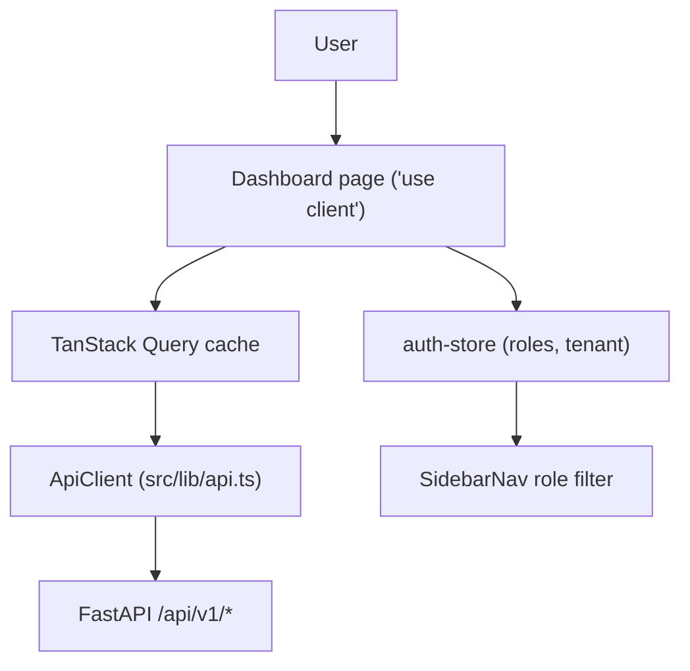
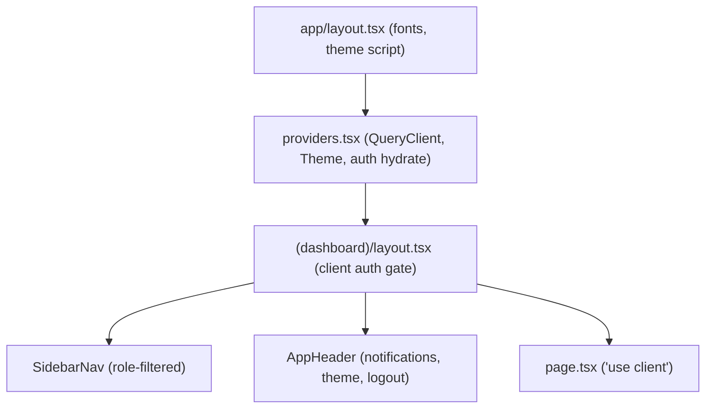
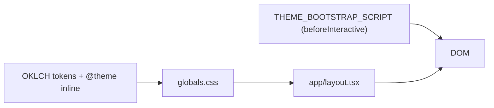

# ContextEdge — Frontend Knowledge Transfer

> **Accurate as of 2026-08-19.** Every claim below was checked against the code in `frontend/`
> and `backend/src/contextedge/`. Paths are relative to the repository root
> (`D:/Projects/github/ContextEdge/ContextEdge`). Citations look like
> `frontend/src/lib/api.ts:76` and point at a real line you can open.
>
> Running example throughout: the **Acme VPN incident** — Acme Corp's corporate VPN gateway
> `vpn-gw-east-01` fails, ServiceNow ticket `INC0010427` is filed, people duplicate it in Teams,
> and an engineer emails a root-cause note. Every screen in this document is described in terms of
> what an Acme operator sees while working that incident.

---

## 1. Frontend Overview

**What**
A Next.js App Router web app. It is the operator console for ContextEdge: browse ingested
evidence, review AI-drafted episodes and patterns, govern playbooks, watch the ingest pipeline,
and audit what the system decided.

**Why**
The frontend does no data lifting of its own. Every number on screen comes from a FastAPI
endpoint, and every heavy computation (embedding, clustering, ranking) happens in Celery workers.
Keeping the browser thin means retrieval-quality work can land in the backend without a UI
release.

**Where**
`frontend/` at the repository root. Source under `frontend/src`.

**Who calls it**
End users in a browser. It talks to exactly one backend, `NEXT_PUBLIC_API_URL`, defaulting to
`http://localhost:8000` (`frontend/src/lib/api.ts:1`).

**What happens next**
`/` is a client redirect: authenticated users go to `/overview`, everyone else to `/login`
(`frontend/src/app/page.tsx:9-11`). The dashboard layout re-checks the token on mount and
`router.replace("/login")` when it is missing or expired
(`frontend/src/app/(dashboard)/layout.tsx:17-21`).

**Input**
Clicks, form submissions, search strings. Most list pages keep their filters in React state; the
Review Queue also pushes its selection into the URL with a `router.replace` onto
`/review?session=<id>`, so a reviewer can share a link to the exact item they are looking at
(`frontend/src/app/(dashboard)/review/page.tsx:866-875`). That page reads the param with
`useSearchParams`, which forces a client-side bailout during prerender, so the whole page body sits
inside a `<Suspense>` boundary just to let `next build` succeed on the route
(`review/page.tsx:848-858`).

**Output**
Rendered DOM plus `fetch` calls to `/api/v1/*`, all carrying a Bearer token and a fresh
`X-Request-ID` (`frontend/src/lib/api.ts:24-29`).

**Failure behavior**
A `401` anywhere clears the token and hard-navigates to `/login`
(`frontend/src/lib/api.ts:36-42`). Other non-2xx responses are turned into an `Error` carrying the
backend's `detail` string — including FastAPI's array-of-validation-errors shape, which is joined
with `"; "` (`frontend/src/lib/api.ts:44-66`). Pages surface that either as an inline error panel
or a `sonner` toast.

**Design rationale**
App Router for file-based routing and route groups, but note the correction below: this app is not
server-rendered in any meaningful way. TanStack Query owns all server state; Zustand owns the tiny
bit of client state (who is logged in). Tailwind v4 plus shadcn/ui (`base-nova` style, `neutral`
base colour — `frontend/components.json:3-11`) for the component layer.

**Correction to a long-standing claim in this document:** every dashboard page starts with
`"use client"`. The root layout is a server component only insofar as it renders fonts and the
`<Providers>` boundary (`frontend/src/app/layout.tsx:26-52`); there is no server-side data
fetching, no `fetch` caching, and no React Server Component doing real work. Treat this as a
client-rendered SPA that happens to be routed by Next.js.

**File Rating**: 10/10



---

## 2. Configuration Files

### `package.json`

**What**: Manifest for the frontend package.
**Why**: Pins the runtime and the toolchain.
**Where**: `frontend/package.json`
**Who calls it**: npm, and the CI `frontend vitest` job (`codewiki/KNOWN_GAPS.md:119`).
**What happens next**: `npm ci` installs the locked tree.
**Input**: `npm install` / `npm ci`.
**Output**: `node_modules`.
**Failure behavior**: Build fails on a resolution error.
**Design rationale**: The versions matter, because several of them are ahead of common training
data — Next **16.2.2**, React **19.2.4**, TanStack Query **5.96**, TanStack Table **8.21**,
Zustand **5.0**, `@xyflow/react` **12.10** with `dagre` for graph layout, `recharts` **3.8** for the
cost charts, `sonner` for toasts, `@base-ui/react` (not Radix) under shadcn
(`frontend/package.json:13-37`). `frontend/AGENTS.md` exists precisely because this Next.js differs
from older releases; read `node_modules/next/dist/docs/` before writing routing code.
**File Rating**: 9/10

### `next.config.ts`

**What**: Next.js build/runtime config.
**Why**: One deliberate override.
**Where**: `frontend/next.config.ts`
**Who calls it**: The Next build and dev server.
**What happens next**: Sets `distDir` from `NEXT_DIST_DIR`, defaulting to `.next`
(`frontend/next.config.ts:4-7`).
**Input**: Env var.
**Output**: A per-instance build directory.
**Failure behavior**: Two dev servers sharing one `distDir` fight over the lock.
**Design rationale**: Documented in the file — it lets a second dev instance pointed at an isolated
database via `NEXT_PUBLIC_API_URL` run beside the primary one.
**File Rating**: 7/10 — **not empty**, contrary to earlier versions of this document.

### `components.json`

**What**: shadcn/ui CLI configuration.
**Why**: Keeps generated components consistent.
**Where**: `frontend/components.json`
**Who calls it**: `npx shadcn add …`.
**What happens next**: New components land in `frontend/src/components/ui`.
**Input**: CLI commands.
**Output**: Generated `.tsx` files.
**Failure behavior**: CLI refuses to run without it.
**Design rationale**: `style: "base-nova"`, `baseColor: "neutral"`, `iconLibrary: "lucide"`, CSS
variables on, aliases `@/components`, `@/lib`, `@/components/ui`
(`frontend/components.json:3-25`).
**File Rating**: 7/10

### `tsconfig.json`

**What**: TypeScript compiler configuration.
**Why**: Type safety and the `@/*` path alias.
**Where**: `frontend/tsconfig.json`
**Who calls it**: `tsc`, the Next build, and the editor language server.
**What happens next**: Validates all `.ts`/`.tsx`.
**Input**: Source code.
**Output**: Diagnostics.
**Failure behavior**: `next build` fails on a type error.
**Design rationale**: `strict: true` (line 11), `moduleResolution: "bundler"` (line 15),
`paths: { "@/*": ["./src/*"] }` (lines 25-29) — `frontend/tsconfig.json:11-29`.
**File Rating**: 10/10

### `vitest.config.ts`

**What**: Vitest configuration.
**Why**: Unit tests for the pure logic that would otherwise only be exercised by clicking.
**Where**: `frontend/vitest.config.ts`
**Who calls it**: `npm test` locally and the CI frontend job.
**What happens next**: jsdom environment, `./src/test/setup.ts` preloaded, `@` alias mirrored from
tsconfig (`frontend/vitest.config.ts:5-15`).
**Input**: `vitest run`.
**Output**: Pass/fail.
**Failure behavior**: Non-zero exit blocks the CI gate.
**Design rationale**: Tests cluster around logic that must not drift:
`frontend/src/lib/roles.test.ts`, `frontend/src/lib/graph-api.test.ts`,
`frontend/src/components/common/applicability.test.tsx`,
`frontend/src/components/common/playbook-steps.test.tsx`,
`frontend/src/components/common/thread-conversation.test.tsx`,
`frontend/src/components/graph/graph-constants.test.ts`,
`frontend/src/components/graph/graph-query-controls.test.tsx`.
**Note**: `codewiki/KNOWN_GAPS.md:266` still says "no test runner is configured for the frontend
package" — that entry is stale. The runner exists and CI runs it (`codewiki/KNOWN_GAPS.md:119`).
**File Rating**: 8/10

---

## 3. App Layout & Routing

There are exactly **two** layout files and **no** `loading.tsx` anywhere:
`frontend/src/app/layout.tsx` and `frontend/src/app/(dashboard)/layout.tsx`. Per-route
`layout.tsx` / `loading.tsx` files do **not** exist; pages render their own skeletons instead (for
example `OverviewSkeleton` at `frontend/src/app/(dashboard)/overview/page.tsx:77-103`, and the
shared `DataTableSkeleton` / `DetailPageSkeleton` in `frontend/src/components/common/`).

### Root Layout (`frontend/src/app/layout.tsx`)

**What**: The `<html>`/`<body>` wrapper.
**Why**: Loads fonts, the theme bootstrap, and the provider tree exactly once.
**Where**: `frontend/src/app/layout.tsx`
**Who calls it**: Next on first render.
**What happens next**: Google fonts Poppins and Geist Mono are bound to CSS variables
(`layout.tsx:9-19`); a `beforeInteractive` `<Script>` runs `THEME_BOOTSTRAP_SCRIPT` so the stored
theme is applied before paint and there is no light-mode flash (`layout.tsx:41-45`, script in
`frontend/src/lib/theme-storage.ts`); `<Providers>` and the `sonner` `<Toaster position="top-right"
richColors />` wrap the tree (`layout.tsx:46-49`).
**Input**: React children.
**Output**: The HTML document.
**Failure behavior**: A throw here blanks the app.
**Design rationale**: `suppressHydrationWarning` on both `<html>` and `<body>` is deliberate — the
theme script mutates the DOM before React hydrates.
**File Rating**: 10/10

### Providers (`frontend/src/components/providers.tsx`)

**What**: The client boundary holding `ThemeProvider` and `QueryClientProvider`.
**Why**: One `QueryClient` per browser session, created inside `useState` so it survives re-renders
but is not shared across requests (`providers.tsx:9-16`).
**Where**: `frontend/src/components/providers.tsx`
**Who calls it**: Root layout.
**What happens next**: Query defaults are `staleTime: 30_000, retry: 1` (`providers.tsx:13`), so a
list you navigate away from and back to within 30 seconds does not refetch, and a failed call is
retried exactly once. It also calls `useAuthStore().hydrate()` on mount (`providers.tsx:18-19`),
which is what fills roles into the Zustand store from the JWT.
**Input**: Children.
**Output**: Context providers.
**Failure behavior**: If hydration finds no valid token the store stays unauthenticated and the
sidebar shows only the unrestricted items.
**Design rationale**: A 30-second `staleTime` is why several pages set their own
`refetchInterval` when they need to be live (see §6).
**File Rating**: 10/10

### Root Page (`frontend/src/app/page.tsx`)

**What**: Traffic controller at `/`.
**Why**: Decide where an arriving user lands.
**Where**: `frontend/src/app/page.tsx`
**What happens next**: `router.replace(isAuthenticated() ? "/overview" : "/login")` inside
`useEffect` (`page.tsx:9-11`).
**Failure behavior**: A corrupt token is treated as absent — `parseToken` catches and returns
`null` (`frontend/src/lib/auth.ts:51-53`).
**Design rationale**: Client-side, because the token lives in `localStorage` and is unreadable on
the server.
**File Rating**: 8/10

### Auth Group (`frontend/src/app/(auth)/login/page.tsx`)

**What**: The only route in the auth group.
**Why**: Keeps `/login` out of the dashboard shell.
**Design rationale**: The `(group)` syntax keeps the URL `/login`, not `/auth/login`.
**File Rating**: 7/10

### Dashboard Group (`frontend/src/app/(dashboard)/layout.tsx`)

**What**: The workspace shell for every logged-in page.
**Why**: One persistent sidebar and header across navigations.
**What happens next**: `useEffect` checks `isAuthenticated()` and replaces to `/login` on failure
(`layout.tsx:17-21`); renders a `w-64` `<aside>` — hidden below the `md` breakpoint, so there is no
sidebar at all on a phone — carrying the ContextEdge wordmark and a scrollable `<SidebarNav>`, then
`<AppHeader>` above a scrollable `<main>` capped at `max-w-[1600px]` (`layout.tsx:23-45`).
**Failure behavior**: Redirects to `/login`.
**Design rationale — and the load-bearing caveat**: this gate is **UX only**. It runs after mount,
in the browser, against a token the browser itself holds. Real enforcement is the API's 401/403.
Never treat "the page rendered" as "the user was authorized".
**File Rating**: 10/10



---

## 4. Authentication

### Login Page

**What**: Email/password form at `/login`.
**Where**: `frontend/src/app/(auth)/login/page.tsx`
**What happens next**: Calls `login()`, which `POST`s `/api/v1/auth/login` and writes
`access_token` into `localStorage` (`frontend/src/lib/auth.ts:17-26`).
**Output**: A JWT carrying `{sub, tenant_id, email, roles, exp}`
(`backend/src/contextedge/api/v1/auth.py:21-32`), valid for `jwt_access_token_expire_minutes`
(60 minutes, `backend/src/contextedge/config.py:38-41`).
**Failure behavior**: The backend returns 401 for bad credentials and — worth knowing — also
returns 401 "Ambiguous account; contact your administrator" when the same email plus the same
password matches users in more than one tenant, rather than guessing
(`backend/src/contextedge/api/v1/auth.py:76-89`). The reason that case exists: `users.email` carries
only a plain non-unique index, with no unique constraint at all — not global, not per tenant
(`backend/src/contextedge/models/tenant.py:78`). Login therefore fetches every user with that
address and verifies the password against each one (`auth.py:39-41, 65-75`).
**File Rating**: 8/10

### Token Management (`frontend/src/lib/auth.ts`)

**What**: The only place the JWT is read or written.
**Where**: `frontend/src/lib/auth.ts`
**Who calls it**: `ApiClient`, the auth store, the two route guards.
**What happens next**: `parseToken` base64-decodes the payload segment, and if `exp * 1000` is in
the past it calls `logout()` — which removes the token and hard-navigates to `/login`
(`auth.ts:40-54`, `auth.ts:28-33`).
**Input**: The stored JWT string.
**Output**: The decoded payload, or `null`.
**Failure behavior**: Any parse error returns `null` (`auth.ts:51-53`).
**Design rationale**: Expiry is checked client-side purely so the UI does not flash a dashboard it
cannot populate. Signature verification happens on the API.
**File Rating**: 10/10

### Auth Store (`frontend/src/lib/stores/auth-store.ts`)

**What**: A Zustand store holding `isAuthenticated, userId, tenantId, email, roles`.
**Where**: `frontend/src/lib/stores/auth-store.ts:15-56`
**Who calls it**: `SidebarNav` (`sidebar-nav.tsx:74`), `AppHeader`, and every page that gates a
button on a role — for example the Sessions page's outcome-assertion control
(`frontend/src/app/(dashboard)/sessions/page.tsx:222`).
**What happens next**: `hydrate()` reads the token via `parseToken()` and fans the claims into
state; `setAuthenticated(token)` writes the token then re-parses; `clearAuth()` wipes both.
**Failure behavior**: No token means the default unauthenticated state, so role-gated nav items
simply do not render.
**Design rationale**: Roles come from the JWT, not from an extra `/me` call.
**File Rating**: 10/10

---

## 5. Dashboard Shell

### Sidebar Navigation (`frontend/src/components/shell/sidebar-nav.tsx`)

**What**: The 25-item vertical menu.
**Where**: `frontend/src/components/shell/sidebar-nav.tsx:44-70`
**Who calls it**: Dashboard layout.
**What happens next**: `visibleItems` keeps an item when it has no `requiredRoles` **or** the user
holds at least one of them (`sidebar-nav.tsx:76-78`); active state is `pathname === href ||
pathname.startsWith(href + "/")` (`sidebar-nav.tsx:83-84`), which is why `/episodes/{id}` keeps
"Episodes" lit.
**Input**: `roles` from the auth store.
**Output**: A filtered list of `<Link>`s.
**Failure behavior**: Empty roles means only the unrestricted items appear.
**Design rationale and the asymmetry you must not gloss over**: the frontend's `hasRole` treats
**only** `platform_super_admin` as a super-role (`frontend/src/lib/roles.ts:7-9`), while the backend
also short-circuits `tenant_admin` and `admin`
(`backend/src/contextedge/deps.py:37-44`). A `tenant_admin` therefore sees only the nav items that
name `tenant_admin` explicitly, even though the API would authorize them for
`knowledge_manager`-gated calls. **Nav visibility is UX filtering, not security.**

A second caveat, from `codewiki/KNOWN_GAPS.md:187-191`: `RoleBinding.scope_type` / `scope_id` are
stored but not enforced. Login selects role *names* only, so a domain admin bound to one domain
holds that role tenant-wide on every `require_role` route. Multi-domain tenants must treat role
grants as tenant-wide.
**File Rating**: 9/10

Nav items in order, with their gates (`sidebar-nav.tsx:45-69`):

| Label | Route | Required roles |
|---|---|---|
| Overview | `/overview` | — |
| Sources | `/sources` | — |
| Sync Operations | `/sync` | — |
| Evidence | `/evidence` | — |
| Sessions | `/sessions` | — |
| Runtime | `/runtime` | — |
| Review Queue | `/review` | — |
| Execution | `/execution` | — |
| Decisions | `/decisions` | — |
| Episodes | `/episodes` | — |
| Patterns | `/patterns` | — |
| Playbooks | `/playbooks` | — |
| Neg. Knowledge | `/negative-knowledge` | knowledge_manager, domain_admin, tenant_admin |
| Identities | `/identities` | knowledge_manager, domain_admin, tenant_admin |
| Correlations | `/correlations` | knowledge_manager, domain_admin, tenant_admin |
| Review Queues | `/suggestions` | knowledge_manager, domain_admin, tenant_admin |
| Graph Explorer | `/graph-explorer` | — |
| Contradictions | `/contradictions` | — |
| Drift | `/drift` | — |
| Evaluations | `/evaluations` | — |
| Policies | `/policies` | tenant_admin |
| Audit Log | `/audit` | tenant_admin, domain_admin |
| LLM Cost | `/admin/cost` | tenant_admin |
| Pipeline Health | `/admin/pipeline` | tenant_admin |
| Settings | `/settings` | — |

`/inventory/[id]` exists as a page but has no nav entry — it is reached from Sources.

### App Header (`frontend/src/components/shell/app-header.tsx`)

**What**: The top bar: notification bell, theme toggle, user menu.
**Where**: `frontend/src/components/shell/app-header.tsx`
**What happens next**: `NotificationBell` polls
`GET /api/v1/notifications?unread_only=true&limit=20` every 60 seconds
(`app-header.tsx:23-27`) and shows an unread badge capped at `9+` (`app-header.tsx:46-50`).
"Mark all read" loops `PATCH /notifications/{id}/read` one row at a time
(`app-header.tsx:31-40`) — fine for a handful, deliberately not a bulk endpoint.
**Input**: Clicks.
**Output**: Mutations and a logout.
**Failure behavior**: A failed poll leaves the previous list in the cache; the bell does not error
out the page.
**Design rationale**: `codewiki/KNOWN_GAPS.md:205-207` is explicit that this dropdown *is* the whole
notification experience — no inbox page, no push transport — even though the backend
`notification_service` already supports email and webhook channels.
**File Rating**: 9/10

---

## 6. Every Dashboard Page

Each entry below names the page file, the endpoints it actually calls, and the backend machinery
behind those endpoints. Where a screen is showing you the output of a Celery task, the task name is
given so you can trace it.

### Overview (`/overview`)
**What**: Six stat tiles plus a "Drift & freshness signals" list.
**Where**: `frontend/src/app/(dashboard)/overview/page.tsx`
**Who calls it**: Everyone; it is the post-login landing page.
**What happens next**: One React Query key, `["overview-stats"]`, runs `Promise.all` over four
plain list endpoints — `/sources`, `/evidence`, `/episodes`, `/playbooks`, each with `limit=200`
(`overview/page.tsx:106-117`). **There is no `/api/v1/overview` endpoint.** All the numbers are
derived in the browser from those four arrays: connected sources by `auth_status === "connected"`,
pending episodes by `reviewer_state === "pending_review"`, approved and candidate playbooks by
`lifecycle_state` (`overview/page.tsx:122-131`).
**Input**: None.
**Output**: `StatTile` cards and up to eight flagged playbooks.
**Failure behavior**: Any of the four failing shows one inline error panel
(`overview/page.tsx:148-151`).
**Design rationale and the honest limitation**: because each list is capped at 200 rows, the tiles
are **counts of the first 200**, not tenant totals — the UI says so with the "(up to 200 each)" hint
(`overview/page.tsx:120`). The drift list is a client-side heuristic in `playbookNeedsAttention`
(`overview/page.tsx:55-75`): candidate/under_review → "Awaiting governance"; approved and past
`expiry_at` → "Past expiry"; within 60 days of expiry → countdown; `last_validated_at` older than
90 days → "Stale validation"; never validated → "Never validated". The server-side drift job
(`evaluation.detect_drift`, every 6 hours) is a different, richer signal — see `/drift`.
**File Rating**: 9/10

### Review Queue (`/review`)
**What**: The human-in-the-loop console for pending decisions.
**Where**: `frontend/src/app/(dashboard)/review/page.tsx` (898 lines — the densest page in the app)
**What happens next**: Lists pending decisions from `GET /decisions` with a 30-second
`refetchInterval` (`review/page.tsx:109-116`). Selecting one loads
`GET /review-queue/{session_id}/context` (`review/page.tsx:782-783`), a single composed response
built by `review_queue_service.build_review_context` that bundles session, top pending decision,
similar-decision aggregate, scoped decisions, execution runs, and operational events so the reviewer
renders in one round trip (`codewiki/KNOWN_GAPS.md:246`). The `top_decision_badge.level` is computed
server-side (green ≥ 0.8, amber 0.5–0.8, red < 0.5) so thresholds cannot drift between consumers.
It also pulls `GET /decisions/similar/aggregate` for precedent (`review/page.tsx:788-791`).
**Input**: Approve / Modify / Reject.
**Output**: `POST /decisions/{id}/reject`,
`POST /execution/runs/{runId}/approvals/{approvalId}/decide`, and
`.../modify` (`review/page.tsx:438, 553, 690`).
**Failure behavior**: Toast, and the two query keys `["review-queue", "pending-decisions"]` and
`["review-queue-context", sessionId]` are invalidated after every mutation
(`review/page.tsx:443-444`).
**Design rationale**: The Modify editor is a raw JSON textarea for step `inputs`. That is a
deliberate trade — it preserves the backend's schema-less step shape at the cost of reviewer
ergonomics; typed per-step forms are a named follow-up (`codewiki/KNOWN_GAPS.md:258`).
**File Rating**: 8/10

### Sources (`/sources`, `/sources/[id]`)
**What**: Connector inventory and configuration.
**Where**: `frontend/src/app/(dashboard)/sources/page.tsx`, `sources/[id]/page.tsx`
**What happens next**: `GET /sources` paginated (`sources/page.tsx:118-119`); the detail page adds
`GET /sources/{id}/sync-runs` and `POST /sources/{id}/discover`. `AddSourceDialog` and
`EditSourceDialog` live in `frontend/src/components/sources/`.
**Input**: Connector config and credentials.
**Output**: Source rows; credentials are Fernet-encrypted server-side into `source_credentials`.
**Failure behavior**: Inline form validation; the API returns 403 without `domain_admin`
(`backend/src/contextedge/api/v1/sources.py` uses `require_role("domain_admin")` on eight routes).
**Design rationale**: Sync pause/resume/cancel is a real backend feature —
`POST /sources/{id}/sync/control` with `{action: pause|resume|cancel, source_object_id?}` flips
`source_objects.metadata_extra["sync_paused"]` and, when a run is live, writes `sync_runs.control`
(`backend/src/contextedge/api/v1/sources.py:295-365`). The connector reads that signal on a *fresh*
connection, because the sync job's own transaction predates the operator's write and cannot see it
(`backend/src/contextedge/services/sync_control_service.py:97-122`).
**The caveat that matters**: honouring the signal is per-connector, and today only Zoho Desk does —
it checks between pages and every `CONTROL_CHECK_EVERY = 25` detail records
(`backend/src/contextedge/connectors/zoho_desk/connector.py:128, 818, 946`). ServiceNow, Gmail,
Teams, Jira SM, ManageEngine and SapphireIMS never call the `_check_control` hook
(`backend/src/contextedge/connectors/base.py:92-105`), so for them a pause only gates the *next*
scheduled run; the one in flight finishes.
**File Rating**: 8/10

### Sync Operations (`/sync`)
**What**: Sync run history and cleanup.
**Where**: `frontend/src/app/(dashboard)/sync/page.tsx`
**What happens next**: `GET /sync-runs` plus `GET /sources?limit=200` for name resolution
(`sync/page.tsx:93-98`). `DELETE /sync-runs/{id}` removes one row; `DELETE /sync-runs/purge` clears
history (`sync/page.tsx:78, 122`).
**Input**: Delete/purge clicks.
**Output**: Run rows with status, counts, and the `errors` JSONB blob.
**Failure behavior**: Errors render as the raw payload — useful, because that blob carries both
ingestion counts and the crash-recovery `handoff` record.
**Design rationale correction**: this page does **not** poll. It relies on the global 30-second
`staleTime` and manual refetch. For live pipeline state use `/admin/pipeline`, which polls every
5 seconds.
**File Rating**: 8/10

### Evidence (`/evidence`, `/evidence/[id]`)
**What**: The evidence explorer — search and browse normalized records.
**Where**: `frontend/src/app/(dashboard)/evidence/page.tsx`, `evidence/[id]/page.tsx`
**What happens next**: `GET /evidence` with `query`, `evidence_type`, `relevance_state`,
`source_type`, and pagination (`evidence/page.tsx:207-214`).
**The important mechanism**: when `query` is non-empty the backend runs **Postgres full-text
search**, not vector search — `search_evidence_fts` over the generated `search_tsvector` column
(`backend/src/contextedge/api/v1/evidence.py:44-59`). Semantic/vector retrieval lives in the runtime
ranker, not here. Lexical search is not a privacy hole either: `search_evidence_fts` applies the
same `_visibility_predicates` helper the vector path uses, imported straight from
`vector_search` (`backend/src/contextedge/search/pg_fts.py:10`). With no query it is an ordered
`SELECT` that additionally **hides `evidence_type = "thread_message"` rows** by default, because
hydrated thread replies belong under their parent ticket's conversation view served by
`GET /threads/{thread_id}/evidence` (`backend/src/contextedge/api/v1/evidence.py:75-81`).
Access control is applied first: `resolve_excluded_access_policy_ids` filters out evidence whose
`access_policy_id` the caller may not see (`evidence.py:42`).
The detail page pulls `/evidence/{id}`, `/evidence/{id}/attachments`, `/evidence/{id}/context`, the
parent `/threads/{thread_id}` and its messages, and lets a `domain_admin` **or**
`knowledge_manager` set `/evidence/{id}/access-policy`
(`backend/src/contextedge/api/v1/evidence.py:271-277`) — matching the frontend predicate
`canEditEvidenceAccessPolicy` (`frontend/src/lib/roles.ts`).
**Output**: Rows with provenance, plus the thread conversation.
**Failure behavior**: Empty state.
**Design rationale**: Destructive routes (`POST /evidence/bulk-delete`, `DELETE /evidence/purge`,
`DELETE /evidence/{id}`) resolve-and-authorize **before** any delete statement, 404 the whole
request if any supplied id is foreign, and refuse legal-hold items with 409
(`codewiki/KNOWN_GAPS.md:46`).
**File Rating**: 9/10

### Episodes (`/episodes`, `/episodes/[id]`)
**What**: AI-reconstructed incident narratives awaiting human approval.
**Where**: `frontend/src/app/(dashboard)/episodes/page.tsx`, `episodes/[id]/page.tsx`
**What happens next**: `GET /episodes?sort=…` (`episodes/page.tsx:206-207`). Four action buttons,
each of which dispatches real backend work:
- `POST /episodes/{id}/approve` and `POST /episodes/bulk-approve` — set `status`/`reviewer_state`,
  stamp `reviewer_user_id`, **commit**, and only then dispatch
  `evaluation.extract_issue_signature` per episode plus one `pattern.cluster_episodes` per domain
  (`backend/src/contextedge/api/v1/episodes.py:230-268, 282-339`). Commit-before-dispatch is
  deliberate: a task consumed before the commit reads pending state and no-ops without retry.
- `POST /episodes/reconstruct` — queues `extraction.reconstruct_episode` work.
- `POST /episodes/ai-review` — dispatches `evaluation.ai_review_episodes`
  (`backend/src/contextedge/api/v1/episodes.py:556-607`, role `knowledge_manager`).
- `POST /patterns/cluster` — dispatches `pattern.cluster_episodes`.
**Input**: Approve / bulk approve / dispatch clicks.
**Output**: Episode rows carrying `ai_review`, exposed verbatim to the UI
(`backend/src/contextedge/api/v1/episodes.py:145`).
**Failure behavior**: Mutations invalidate `["episodes"]`, `["patterns"]`, `["playbooks"]` together
(`episodes/page.tsx:32-34`), because an approval can cascade into new patterns and playbooks.
**Design rationale — read the AI-review tooltip carefully.** The page's own tooltip says it
(`episodes/page.tsx:319`): approval only happens when `EPISODE_AI_REVIEW=auto_approve` **and**
deterministic floors pass; otherwise verdicts are advisory annotations. The three modes are exactly
`off | advisory | auto_approve` (`backend/src/contextedge/config.py:185-187`). In advisory mode a
verdict dict is stamped onto `episodes.ai_review` and nothing is approved. In auto-approve mode the
draft must clear all four floors: at least 2 evidence ids, a `final_outcome` of at least 20
characters, verdict exactly `"approve"`, and confidence ≥ 0.8
(`backend/src/contextedge/services/episode_review_service.py:89-101`). Auto-approvals leave
`reviewer_user_id` NULL forever, so they stay distinguishable from human ones.
The sort control uses a shared SQL priority expression so machine and human attention agree: +40 for
a substantive outcome, +20 for a root cause, +3 per evidence item capped at 10, +10 × extraction
confidence (`backend/src/contextedge/services/episode_review_service.py:57-86`).
**File Rating**: 9/10

### Patterns (`/patterns`, `/patterns/[id]`)
**What**: Recurring structure mined from clusters of approved episodes.
**Where**: `frontend/src/app/(dashboard)/patterns/page.tsx`, `patterns/[id]/page.tsx`
**What happens next**: `GET /patterns` paginated (`patterns/page.tsx:189-190`);
`POST /patterns/deduplicate` runs the same
`pattern_service.deduplicate_patterns_and_playbooks` entry point the hourly
`pattern.deduplicate_knowledge` beat job uses; `POST /playbooks/generate` with `{pattern_id}` mints
a playbook candidate (`patterns/page.tsx:36, 193-194`). The detail page adds
`GET /patterns/{id}/graph` and evidence-link CRUD.
**Output**: `PatternGraph` (`frontend/src/components/patterns/pattern-graph.tsx`).
**Failure behavior**: Graph renders empty rather than throwing.
**Design rationale**: Clustering itself is `pattern.cluster_episodes` on the `pattern` queue, which
runs on the single serialized Worker B — clustering and playbook generation touch the whole graph
and hold **no** advisory lock, so two concurrent runs could mint duplicate patterns
(`docs/RUNBOOK.md` "Worker topology"). That is why the dedup sweep deliberately rides the same
queue: it serializes behind clustering.
**How an episode finds its pattern**: two named, measured thresholds, not magic numbers. Joining an
existing pattern prefilters on `PATTERN_MATCH_MAX_DISTANCE = 0.30` and then orders by distance and
takes the **nearest** member — the `ORDER BY` is the point, because on this corpus almost every
episode has *some* member within 0.35, so an unordered `LIMIT 1` handed the LLM validator a
near-random pattern (accept rate 12% → 40% once nearest was used). Forming a brand-new cluster is
stricter, `CLUSTER_GROUP_MAX_DISTANCE = 0.27`, chosen as the knee of a measured
singletons/cluster-size curve (`backend/src/contextedge/workers/pattern_tasks.py:44-60, 228-257,
309`). Generation itself is dispatched **after commit** through
`services/deferred_dispatch.dispatch_after_commit`, so a worker can never pick the task up before
the row it needs exists (`backend/src/contextedge/services/pattern_service.py:11`).
**File Rating**: 9/10

### Playbooks (`/playbooks`, `/playbooks/[id]`)
**What**: Governed, versioned operational procedures.
**Where**: `frontend/src/app/(dashboard)/playbooks/page.tsx` (a 125-line list),
`playbooks/[id]/page.tsx` (1,049 lines — where all the work is)
**What happens next**: The list is `GET /playbooks` with search and pagination
(`playbooks/page.tsx:71-72`). The detail page loads the playbook (`playbooks/[id]/page.tsx:838`),
its `/versions` (`:844`), `/references` (`:61`), and per-version `/versions/{id}/diff` (`:334`),
and offers `POST /{id}/transition` (`:243`), `POST /{id}/rollback` (`:850`), and a governance panel
that `PATCH`es `automation_mode` (`:480`) after listing `/policies` for the approval-policy
selector (`:464`).
**Input**: Lifecycle transitions and automation-mode changes.
**Output**: New `playbook_versions` rows and `playbook.version_created` /
`playbook.version_transitioned` operational events.
**Failure behavior**: The API rejects an invalid transition; the UI toasts.
**Design rationale correction**: **there is no drag-and-drop workflow builder.** No such component
exists in `frontend/src/components/`. The detail page is a structured reader plus a governance
form: lifecycle badge, automation mode select, versions with diff and rollback, "Approved knowledge
used" provenance, and a "Documented vs. observed" comparison. Changing automation mode is gated to
`tenant_admin` alone (`frontend/src/lib/roles.ts` `canEditAutomationMode`), deliberately narrower
than editing the playbook text — automation mode is what makes every other approval gate
load-bearing.
**File Rating**: 9/10

### Sessions (`/sessions`)
**What**: Resolution sessions — the per-incident working record.
**Where**: `frontend/src/app/(dashboard)/sessions/page.tsx`
**What happens next**: `GET /sessions` paginated (`sessions/page.tsx:627-628`); expanding one loads
`GET /decisions?session_id=…&limit=50` and `GET /sessions/{id}/history`
(`sessions/page.tsx:437-445`). `POST /sessions` opens one; `PATCH /sessions/{id}/close` closes it.
**Input**: Create and close forms.
**Output**: Session rows plus their decision trail.
**Failure behavior**: Standard error panels.
**Design rationale correction**: **this page does not tail live logs.** It is a paginated table with
expandable history; there is no streaming transport anywhere in the frontend. Asserting a session
outcome is role-gated in the UI (`sessions/page.tsx:222`, with the explanatory copy at line 316:
asserting facts requires the knowledge-manager role), while opening a session is available to any
authenticated user (`sessions/page.tsx:621`).
**File Rating**: 8/10

### Evaluations (`/evaluations`)
**What**: Replay historical cases against the current retrieval ranker.
**Where**: `frontend/src/app/(dashboard)/evaluations/page.tsx`
**What happens next**: `GET /evaluations/runs` and `GET /evaluations/datasets`
(`evaluations/page.tsx:182-188`); `POST` on either creates
(`evaluations/page.tsx:201, 218`). A created run dispatches `evaluation.run_evaluation` on the
`evaluation` queue.
**Output**: Run rows with scores.
**Failure behavior**: Failures highlighted in the run list.
**Design rationale**: `knowledge_manager` gates creation
(`backend/src/contextedge/api/v1/evaluations.py`, two `require_role` calls). Evaluation as a
release gate is still a roadmap item (`codewiki/KNOWN_GAPS.md:57`).
**File Rating**: 8/10

### Runtime (`/runtime`)
**What**: A sandbox over the production retrieval ranker.
**Where**: `frontend/src/app/(dashboard)/runtime/page.tsx`
**What happens next**: `POST /runtime/match` with symptoms, entities, optional `session_id` and
`domain_id` (`runtime/page.tsx:197`). Server-side that call assembles a three-class memory context
(short-term session + recent evidence, long-term identities and counts, reasoning-class recent
executions and decisions), computes an effective risk cap from your roles — `platform_super_admin`, `tenant_admin` and
`domain_admin` uncapped, `knowledge_manager` and service accounts capped at `high`, everyone else at
`medium` (`backend/src/contextedge/api/v1/runtime.py:42-52`) — then runs `rank_playbooks`
(`backend/src/contextedge/search/hybrid_ranker.py:213-379`). That ranker blends keyword 0.25,
semantic 0.30, graph distance 0.15, evidence quality 0.10, identity 0.05, recency 0.10, freshness
0.05, minus a negative-knowledge penalty of 0.05, and **abstains** below
`MIN_RECOMMENDATION_SCORE = 0.35` — an empty result means "no recommendation", by contract.
`GET /runtime/explain/{matchId}` replays the full breakdown from a Redis cache with a one-hour TTL
(`MATCH_CACHE_TTL_SEC = 3600` at `backend/src/contextedge/api/v1/runtime.py:29`; write at
`runtime.py:230-238`, read at `runtime.py:249-267`; `runtime/page.tsx:208`), which is exactly what
the page's own description warns about: "Explain requires Redis to have cached the match"
(`runtime/page.tsx:236`).
**Input**: Symptom text, entity terms, domain and session selectors
(`GET /domains`, `GET /sessions?limit=50` at `runtime/page.tsx:131-137`).
**Output**: Ranked playbooks with per-signal breakdowns; `POST /runtime/feedback` records a thumbs
verdict into `retrieval_feedback`.
**Failure behavior**: No results, plus `fallback_guidance` when the top confidence is under 0.3.
**File Rating**: 8/10

### Execution (`/execution`)
**What**: Pending human approvals for higher-risk automated steps.
**Where**: `frontend/src/app/(dashboard)/execution/page.tsx`
**What happens next**: `GET /execution/approvals/pending` with a 30-second `refetchInterval`
(`execution/page.tsx:122-124`); deciding posts
`/execution/runs/{runId}/approvals/{id}/decide` (`execution/page.tsx:36`).
**Output**: Approval decisions, each of which writes a `policy_checks` row recording both allow and
deny (`codewiki/KNOWN_GAPS.md:14`).
**Failure behavior**: Toast.
**Design rationale**: Approval policy config keys the executor enforces are `approver_roles`,
`forbid_self_approval`, `require_approval_min_safety_class`, and `max_automation_mode`
(`backend/src/contextedge/services/approval_policy_service.py:12-19`). Separation of duties is
enforced initiator↔approver only, never recommender↔approver — an open residual
(`codewiki/KNOWN_GAPS.md:12`).
**File Rating**: 9/10

### Decisions (`/decisions`)
**What**: First-class decision traces with evidence, options, reasoning, and outcomes.
**Where**: `frontend/src/app/(dashboard)/decisions/page.tsx`
**What happens next**: `GET /decisions` with type/step/session/review filters
(`decisions/page.tsx:151-152`); selecting one loads `GET /decisions/{id}/chain`
(`decisions/page.tsx:156-157`) rendered by
`frontend/src/components/decisions/decision-chain.tsx`.
**Output**: The option set considered and the one chosen, plus outcomes.
**Design rationale**: `Decision`, `DecisionOption`, and `DecisionOutcome` are graph-connected with
typed edges (`based_on`, `considered`, `chose`, `applied_policy`, `required_approval`,
`resulted_in`, `followed_by`); the older flat `decision_trace_events` table is kept as a compact
audit trail (`codewiki/KNOWN_GAPS.md:352`).
**File Rating**: 10/10

### Contradictions (`/contradictions`)
**What**: Conflicts between approved playbooks and knowledge-base evidence.
**Where**: `frontend/src/app/(dashboard)/contradictions/page.tsx`
**What happens next**: `GET /contradictions` filtered by status
(`contradictions/page.tsx:140-144`); `PATCH /contradictions/{id}/status` records the resolution
(`contradictions/page.tsx:41`).
**Output**: Status transitions and a `contradiction.status_updated` operational event.
**Design rationale**: Detection is the 12-hourly `evaluation.scan_contradictions_task` beat job,
which is LLM-bearing and therefore has a real cost note in the runbook.
**File Rating**: 9/10

### Negative Knowledge (`/negative-knowledge`)
**What**: Steps and approaches recorded as ineffective, conditional, deprecated, or prohibited.
**Where**: `frontend/src/app/(dashboard)/negative-knowledge/page.tsx`
**What happens next**: Straight CRUD against `/negative-knowledge`
(`negative-knowledge/page.tsx:49-60, 133, 170-174`), all `knowledge_manager`-gated.
**Why it matters downstream**: these rows feed the ranker's negative penalty —
`min(1, contradicts_edges × 0.3 + negative_knowledge_in_domain × 0.1)`, weighted −0.05
(`backend/src/contextedge/search/hybrid_ranker.py:140-163`). Writing one here demonstrably lowers a
playbook's runtime score.
**File Rating**: 8/10

### Identities (`/identities`)
**What**: Entity resolution — the page where `jdoe`, `John Doe`, and `john.doe@acme.com` become one
canonical identity.
**Where**: `frontend/src/app/(dashboard)/identities/page.tsx`
**What happens next**: `GET /identities` with search and `resolution_state` filters
(`identities/page.tsx:195-199`); `PATCH /identities/{id}` edits aliases and state;
`POST /identities/merge` merges (`identities/page.tsx:41, 134`). Uses
`frontend/src/components/common/searchable-select.tsx` for the merge target.
**Design rationale**: The daily `identity.reconcile_identities` beat job **proposes** merges only —
a human decides here (`backend/src/contextedge/workers/identity_tasks.py:147-195`).
**File Rating**: 8/10

### Correlations (`/correlations`)
**What**: Links between distinct evidence items.
**Where**: `frontend/src/app/(dashboard)/correlations/page.tsx`
**What happens next**: `GET /correlations` paginated plus `GET /evidence?limit=200` to populate the
link pickers (`correlations/page.tsx:313-319`); `POST /correlations` creates an edge,
`POST /correlations/{id}/decision` records a verdict, `DELETE` removes one
(`correlations/page.tsx:111, 223, 325`).
**Design rationale**: The automated half of this lives on the `correlation` queue —
`extraction.correlate_evidence` — which was starving behind normalization until it got its own lane
on 2026-08-17 (`backend/src/contextedge/workers/celery_app.py:234-258`).
**File Rating**: 7/10

### Review Queues (`/suggestions`)
**What**: Three human decision queues in one page — this is the nav item labelled "Review Queues",
distinct from "Review Queue" at `/review`.
**Where**: `frontend/src/app/(dashboard)/suggestions/page.tsx`
**What happens next**: Three independent queries —
`GET /correlations/suggestions?status=pending` (semantic evidence pairs),
`GET /correlations/fleet-suggestions?status=pending` (fleet incident groups), and
`GET /identities?resolution_state=needs_review` (identities the resolver parked)
(`suggestions/page.tsx:37, 127, 206`). Accept/reject post to
`/correlations/suggestions/{id}/{action}` and `/correlations/fleet-suggestions/{id}/{action}`
(`suggestions/page.tsx:43, 133`).
**Design rationale, stated in the page's own copy** (`suggestions/page.tsx:287`): accepting a
suggestion creates a correlation edge and **rejection is permanent for that pair**; accepting a
fleet suggestion mints a parent case. Correlation suggestions are produced by
`evaluation.generate_correlation_suggestions`, dispatched right after chunk embeddings land
(`backend/src/contextedge/workers/chunk_tasks.py:261-262`); fleet groups come from the half-hourly
`evaluation.detect_fleet_groups`.
This queue closed the identity-review-UI gap on 2026-08-03 (`codewiki/KNOWN_GAPS.md:159`).
**File Rating**: 8/10

### Graph Explorer (`/graph-explorer`)
**What**: Read-only exploration of the context graph.
**Where**: `frontend/src/app/(dashboard)/graph-explorer/page.tsx` plus
`frontend/src/components/graph/*`
**What happens next**: **Five** tabs, not three (`graph-explorer/page.tsx:113-127`):
*Statistics* (`GET /graph/stats`), *Subgraph* (`GET /graph/subgraph/{type}/{id}?max_depth=`),
*Neighbors* (`GET /graph/neighbors`), *Agent Context*
(`POST /graph/agent-subsets` — the maf.v1 projection the agent actually sees), and *Proposals*
(`GET /graph/edge-proposals` with approve/reject). All calls go through
`frontend/src/lib/graph-api.ts:18-50`. Scope params `domain_id` and `as_of` ride every request
(`graph-api.ts:11-16`), which is what makes the temporal "as of" view work.
**Input**: Node picker, depth, edge-type filter, pan/zoom.
**Output**: React Flow nodes and edges, laid out by `dagre`
(`frontend/src/components/graph/graph-layout.ts`).
**Failure behavior**: Empty graph on error.
**Design rationale**: `codewiki/KNOWN_GAPS.md:226` is explicit — the page visualizes and traverses
but **cannot create, edit, or delete edges**. Every graph mutation happens in backend services:
pattern discovery, playbook generation, contradiction scans, identity linking, decision extraction,
episode construction, and the 6-hourly `evaluation.reconcile_graph_relationships` materializer.
**File Rating**: 10/10

### Drift (`/drift`)
**What**: Playbook-level staleness signals.
**Where**: `frontend/src/app/(dashboard)/drift/page.tsx`
**What happens next**: `GET /drift/alerts` — the router's only route
(`backend/src/contextedge/api/v1/drift.py:19`) — read at `drift/page.tsx:95-96`. Acting on an alert
posts `/playbooks/generate` with the pattern id (`drift/page.tsx:23`).
**Output**: Alert rows.
**Design rationale**: The page describes its own inputs precisely (`drift/page.tsx:103`):
"validation age, pattern node additions, expiry, and negative retrieval feedback". Production of
those alerts is the 6-hourly `evaluation.detect_drift` beat job →
`drift_service.check_playbook_drift`.
**File Rating**: 8/10

### Policies (`/policies`)
**What**: Tenant policies — retention, classification, access, approval.
**Where**: `frontend/src/app/(dashboard)/policies/page.tsx`
**What happens next**: `GET /policies` returns them already grouped by type
(`policies/page.tsx:355-356`; `PoliciesGroupedResponse` at
`backend/src/contextedge/api/v1/policies.py:57`). Create/update/delete are `tenant_admin`-only
(three `require_role("tenant_admin")` calls in that router).
**Design rationale worth knowing**: `PATCH /policies/{id}` bumps `version` **only when `config`
changes** — renaming or deactivating does not
(`backend/src/contextedge/api/v1/policies.py:133-140`). The version tracks rules, not labels, so a
`policy_checks` row always points at the exact rule set that was evaluated.
**Known gap**: generic policy-assignment and playbook approval-policy assignment have backend
surfaces but no first-class dashboard workflow (`codewiki/KNOWN_GAPS.md:201-203`).
**File Rating**: 8/10

### Audit Log (`/audit`)
**What**: Who did what.
**Where**: `frontend/src/app/(dashboard)/audit/page.tsx`
**What happens next**: `GET /audit-logs` with filters and pagination
(`audit/page.tsx:78-84`). Note the endpoint prefix is `/audit-logs`, not `/audit`
(`backend/src/contextedge/api/v1/__init__.py:46`).
**Where the rows come from**: `RequestAuditMiddleware` writes one row **after** every
`POST/PATCH/PUT/DELETE` under `/api/v1` except `/auth/login`
(`backend/src/contextedge/middleware/request_audit.py:25-124`). The action is
`"http.<method>.<path-slug>"` where the slug is the *whole* path with slashes turned into dots — so
`POST /api/v1/episodes/ai-review` lands as `http.post.api.v1.episodes.ai-review`
(`request_audit.py:70-71`). Middleware rows always carry `resource_type = "http_request"` and a NULL
`resource_id`; the status code becomes `success` / `denied` (401, 403) / `failed` inside `details`
(`request_audit.py:72-87, 100`). Explicit `log_audit_event` calls add semantic rows on top with real
resource types — `sync.pause` (`api/v1/sources.py:359`), `episode.ai_review_dispatched`
(`api/v1/episodes.py:598`), and so on.
**Failure behavior**: The audit insert runs off-thread on a separate sync engine and swallows its
own failures — auditing never breaks a request (`request_audit.py:89-119`).
**Scope caveat**: unauthenticated 401 probes never resolve a tenant, so they exist only in
structlog and **will not appear on this page** (`request_audit.py:59-64`).
**File Rating**: 9/10

### LLM Cost (`/admin/cost`)
**What**: Per-tenant model spend and the budget control.
**Where**: `frontend/src/app/(dashboard)/admin/cost/page.tsx` (893 lines)
**What happens next**: `GET /admin/tenant-budget/status` polled every 60 seconds
(`admin/cost/page.tsx:193-195`); `PUT /admin/tenant-budget` writes the limits
(`admin/cost/page.tsx:200`); `GET /admin/llm-usage` with a window and an optional `sync_run_id`
scope, polled every **5 seconds while a sync run is active** and every 60 otherwise
(`admin/cost/page.tsx:581-593`) — the run list itself comes from `GET /sync-runs?limit=20`
(`admin/cost/page.tsx:573-574`).
**Output**: Recharts charts of spend by model and task.
**The mechanism behind the numbers**: usage is not a separate counter. It is the sum of the current
UTC day's `llm.usage` operational events, so there is no second aggregation column to drift
(`backend/src/contextedge/services/tenant_budget_service.py:191-231`). The `action_on_exceed`
select offers exactly "warn (allow, log event)" and "block (raise exception)"
(`admin/cost/page.tsx:525-526`), matching the backend gate: `block` raises `TenantBudgetExceeded`
before spending, `warn` proceeds and writes an `llm.budget_warning` event
(`backend/src/contextedge/ai/provider.py:231-279`). A tenant with **no** budget row falls back to
deployment defaults — 2,000,000 tokens/day, $25/day, action `block`
(`backend/src/contextedge/config.py:191-198`).
**Operator tip**: the classic symptom of a hit budget is chunks stuck at `embedding IS NULL` while the
tenant's `llm.usage` events **stop arriving entirely** — a `block` raises before the usage recorder
runs, so there is no error row to find (`outcome` only ever takes `ok` or `error`). Confirm with
`GET /api/v1/admin/tenant-budget/status`.
**File Rating**: 9/10

### Pipeline Health (`/admin/pipeline`)
**What**: The live view of the ingest and enrichment queues. Missing from earlier versions of this
document.
**Where**: `frontend/src/app/(dashboard)/admin/pipeline/page.tsx` (549 lines)
**What happens next**: `GET /admin/pipeline-health` polled every **5 seconds**
(`admin/pipeline/page.tsx:140-142`).
**What it reads**: Redis `LLEN` per lane across all eight queues in pipeline order —
`extraction, correlation, embedding, hydration, pattern, evaluation, sync, default` — plus
`HLEN unacked` for in-flight work, which is where **all** remaining work lives during the episode
reconstruction phase (`backend/src/contextedge/services/pipeline_health_service.py:43-84`). Alert
threshold is a backlog depth of 500 (`pipeline_health_service.py:55`). One SQL read counts every
stage (`pipeline_health_service.py:89-139`), and five of those counts are assembled into the graph
chain — **evidence → correlations → episodes → patterns → playbooks** — whose **first zero is the
diagnosis**, returned as `stalled_at` alongside the chain itself
(`pipeline_health_service.py:214-231`). The response also carries LLM latency percentiles, a
per-prompt call breakdown, and the last hour's spend, so the page can project cost to completion
(`pipeline_health_service.py:141-205, 310-322`).
**Failure behavior**: A broker failure returns empty depths rather than raising
(`pipeline_health_service.py:82-84`).
**Design rationale**: The module docstring records the founding incident — every per-task metric
read healthy while `extraction.correlate_evidence` starved behind 8,000 normalizations and episodes
stayed at zero (`pipeline_health_service.py:1-27`).
**File Rating**: 9/10

### Settings (`/settings`)
**What**: Tenant, workspace, domain, user, and retention configuration.
**Where**: `frontend/src/app/(dashboard)/settings/page.tsx`
**What happens next**: Five tabs — **General, Workspaces, Domains, Users, Retention**
(`settings/page.tsx:280-284`) — backed by `GET /tenants/{tenantId}`, `GET /workspaces`,
`GET /domains`, `GET /users` (`settings/page.tsx:244-263`), with `POST /workspaces` and
`POST /domains` for creation (`settings/page.tsx:46, 114`).
**Design rationale and the gap**: `codewiki/KNOWN_GAPS.md:199` states it plainly — this is **not**
a complete admin console. Role-binding CRUD, edit/deactivate flows for workspaces and domains, and
the retention console remain mostly API-led or placeholder UI.
**File Rating**: 8/10

### Source Object Inventory (`/inventory/[id]`)
**What**: The per-source object inventory — which tickets/queues/tables to sync and backfill.
**Where**: `frontend/src/app/(dashboard)/inventory/[id]/page.tsx`
**Important correction**: the `[id]` is a **source id**, not an inventory-item id, and this page
does not touch the `/api/v1/inventory` router at all (that router has exactly one route,
`POST /inventory/report`, for agent inventory reporting —
`backend/src/contextedge/api/v1/inventory.py:56`). The page calls `GET /sources/{id}`,
`GET /sources/{id}/objects`, `POST /sources/{id}/discover`,
`PATCH /sources/{id}/objects/{objectId}`, and `POST /sources/{id}/backfill`
(`inventory/[id]/page.tsx:49-101`).
**What happens next**: Toggling `approved_for_sync` on an object is what makes the 15-minute
`sync.trigger_scheduled_syncs` beat job pick it up — that job selects
`source_objects WHERE approved_for_sync IS TRUE` and fans out one `sync.run_incremental_sync` per
object (`backend/src/contextedge/workers/sync_tasks.py:16-32`). Backfill additionally requires
`approved_for_backfill`.
**Failure behavior**: Discovery errors surface inline; a backfill invalidates `["sync-runs"]`
(`inventory/[id]/page.tsx:101`).
**Design rationale**: This is the human gate between "we found 4,000 objects" and "we are going to
spend LLM budget on them".
**File Rating**: 8/10

---

## 7. Shared Components

The real inventory is `frontend/src/components/`. There is **no** `FilterBar` and **no**
`MetricsCard`; pages compose shadcn primitives from `components/ui` directly.

### `PageHeader` — `frontend/src/components/common/page-header.tsx`
Title, description, and an optional action slot. Used by every page.
**File Rating**: 9/10

### `StatusBadge` — `frontend/src/components/common/status-badge.tsx`
One centralized status→colour map, so `approved` looks the same on Episodes, Playbooks, and
Overview. Unknown statuses fall back to a neutral badge.
**File Rating**: 9/10

### `DataTable` + `DataTableSkeleton`
`frontend/src/components/common/data-table.tsx` and `data-table-skeleton.tsx`. A generic TanStack
Table v8 wrapper plus its matching loading shape.
**File Rating**: 10/10

### `PaginationControls` — `frontend/src/components/common/pagination-controls.tsx`
Pairs with the `usePagination` hook.

### `SearchableSelect` — `frontend/src/components/common/searchable-select.tsx`
`cmdk`-backed combobox; used for identity merge targets and node pickers.

### `ThreadConversation` — `frontend/src/components/common/thread-conversation.tsx`
Renders hydrated thread messages under a parent ticket. This is the consumer of
`GET /threads/{thread_id}/evidence`, and the reason the Evidence list hides
`evidence_type = "thread_message"` by default. Covered by `thread-conversation.test.tsx`.

### `PlaybookSteps` — `frontend/src/components/common/playbook-steps.tsx`
Renders a playbook version's step list. Covered by `playbook-steps.test.tsx`.

### `Applicability` — `frontend/src/components/common/applicability.tsx`
Renders the `applicability` JSONB an evidence item carries. Covered by `applicability.test.tsx`.

### `DetailPageSkeleton` — `frontend/src/components/common/detail-page-skeleton.tsx`
Standard loading shape for the `[id]` pages.

### Graph components — `frontend/src/components/graph/`
`graph-stats.tsx`, `graph-subgraph.tsx`, `graph-neighbors.tsx`, `graph-node-picker.tsx`,
`graph-query-controls.tsx`, `agent-context-preview.tsx`, `edge-proposals.tsx`, plus
`graph-layout.ts` (dagre auto-layout) and `graph-constants.ts` (node/edge type colours and labels,
unit-tested so the legend cannot drift from the renderer).
**File Rating**: 10/10

### Decision components — `frontend/src/components/decisions/`
`decision-chain.tsx` and `decision-detail.tsx`.

### Pattern components — `frontend/src/components/patterns/pattern-graph.tsx`

### Source components — `frontend/src/components/sources/`
`add-source-dialog.tsx` and `edit-source-dialog.tsx`.

### Shell — `frontend/src/components/shell/`
`sidebar-nav.tsx`, `app-header.tsx`. Plus `providers.tsx`, `theme-provider.tsx`,
`theme-toggle.tsx` at the components root.

---

## 8. Custom Hooks

### `usePagination` — `frontend/src/lib/hooks/use-pagination.ts`
**What**: Page-index state plus a ready-made query-param object.
**What happens next**: Returns `{page, pageSize, offset, params: {limit, offset}, nextPage,
prevPage, reset}` with `pageSize` defaulting to **50** (`use-pagination.ts:15-27`). Pages spread
`pg.params` straight into `api.get`.
**Failure behavior**: `prevPage` clamps at 0.
**File Rating**: 9/10

### `useWorkspaces` / `useDomains` — `frontend/src/lib/hooks/use-tenants.ts`
**Correction**: despite the filename, this module exports **no** `useTenants`. It exports
`useWorkspaces()` (`GET /workspaces`, key `["workspaces"]`) and `useDomains(workspaceId?)`
(`GET /domains`, key `["domains", workspaceId]`, passing `workspace_id` only when supplied) —
`use-tenants.ts:5-18`. Consumers: Settings and the Runtime domain selector.
**File Rating**: 8/10

---

## 9. API Layer

### `api.ts` — `frontend/src/lib/api.ts`
**What**: A single `ApiClient` instance, exported as `api` (`api.ts:105`).
**Why**: One place for the base URL, the token, error shaping, and the 401 rule.
**What happens next**: Every verb helper prefixes `/api/v1` — `get`, `post`, `patch`, `put`,
`delete` (`api.ts:72-102`). `get` serializes params through `URLSearchParams`. Each request adds
`Content-Type: application/json`, `Authorization: Bearer <token>` when a token exists, and a fresh
`X-Request-ID` from `crypto.randomUUID()` (`api.ts:20-29`).
**Why the request id matters**: the backend's `TenantContextMiddleware` picks it up, binds it into a
ContextVar, and Celery's `before_task_publish` signal copies it into every task message header — so
one browser click's id follows the work all the way into `operational_events` and the `llm.usage`
rows it produces (`backend/src/contextedge/middleware/request_context.py:88-104`;
`backend/src/contextedge/workers/celery_app.py:25-42`). That is the single most useful debugging
affordance in the system.
**Failure behavior**: 401 → clear token, hard navigate to `/login`, throw `"Unauthorized"`
(`api.ts:36-42`). Other errors → parse `detail`, joining FastAPI's validation array with `"; "`
(`api.ts:44-66`). `204` returns `undefined` (`api.ts:68`).
**File Rating**: 10/10

### `graph-api.ts` — `frontend/src/lib/graph-api.ts`
**What**: Four typed wrappers over the `/graph` router: `stats`, `subgraph`, `neighbors`,
`agentSubset` (`graph-api.ts:18-50`).
**Why**: Every graph call needs the same scope params, so `scopeParams(scope)` builds
`{domain_id?, as_of?}` once (`graph-api.ts:11-16`) and each method merges its own on top.
**Failure behavior**: Delegates to `api`, so the same error rules apply.
**Tested by**: `frontend/src/lib/graph-api.test.ts`.
**File Rating**: 9/10

### `roles.ts` — `frontend/src/lib/roles.ts`
**What**: The permission predicates the UI actually uses.
**What happens next**: `hasRole(roles, role)` is true when the array contains the role **or**
`platform_super_admin` (`roles.ts:7-9`). Named predicates: `isTenantAdmin`, `isDomainAdmin`,
`isKnowledgeManager`, `isPlaybookReviewer`, `isAnalyst`. Composites: `canApproveEpisode`
(knowledge_manager), `canManageEval` (knowledge_manager), `canTransitionPlaybook`
(playbook_reviewer | knowledge_manager | tenant_admin), `canEditAutomationMode` (**tenant_admin
only**, with a long in-file comment on why it is narrower than editing), `canDiscoverSources`
(domain_admin), `canListPoliciesForSource`, `canListPoliciesForEvidence`,
`canEditEvidenceAccessPolicy`.
**Note**: `frontend/src/lib/auth.ts:60-67` also exports a `hasRole`, but it takes no roles argument
— it re-parses the token itself. New code should use the `roles.ts` version with the store's roles.
**Tested by**: `frontend/src/lib/roles.test.ts`.
**File Rating**: 10/10

---

## 10. Type Definitions

### `frontend/src/lib/types/index.ts` and `types/graph.ts`
**What**: Hand-maintained TypeScript interfaces mirroring the backend Pydantic response models.
**Why**: There is no generated client. The contract is maintained by hand.
**Failure behavior**: Drift is caught at build time only where a field is actually read — a renamed
field the UI never touches will not fail the build. **When you change a response model in
`backend/src/contextedge/api/v1/*.py`, update these files in the same change.**
**File Rating**: 9/10

---

## 11. State Management (Stores)

### `auth-store.ts` — the only store
Covered in §4. There is exactly one Zustand store in the app; everything else is React Query cache
or local component state. That is deliberate: server state has an owner (React Query) and client
state is tiny.
**File Rating**: 10/10

---

## 12. Theme & Styling

### `globals.css` — `frontend/src/app/globals.css`
**What**: Tailwind v4 entry point, OKLCH design tokens, and the glassmorphism utilities that the
shell and most cards use — `.glass-panel`, `.glass-panel-strong`, `.glass-sidebar`, `.glass-header`,
`.glass-nav-item`, `.glass-nav-item-active`, `.glass-tabs-list`, each with an
`html:not(.dark)` light-mode override (`globals.css:191-300`).
**Why**: `@theme inline` is how Tailwind v4 consumes CSS variables; there is no `tailwind.config.js`
(`components.json:6-7` leaves `tailwind.config` empty on purpose).
**Who calls it**: Root layout (`app/layout.tsx:4`).
**Design rationale**: The theme is applied before paint by `THEME_BOOTSTRAP_SCRIPT`
(`frontend/src/lib/theme-storage.ts`, injected at `app/layout.tsx:41-45`), which is why both
`<html>` and `<body>` carry `suppressHydrationWarning`.
**File Rating**: 10/10



---

## 13. How a screen maps to the backend pipeline

This section exists because the most common onboarding mistake is assuming a page "does" the thing
it displays. It does not. Every screen is a read of state produced by a Celery task. Here is the
chain for the Acme VPN incident, in order, with the task that owns each step.

| Stage | Who does it | Task / function | Queue | Where you see it |
|---|---|---|---|---|
| Pull `INC0010427` from ServiceNow | Beat, every 15 min | `sync.trigger_scheduled_syncs` → `sync.run_incremental_sync` (`backend/src/contextedge/workers/sync_tasks.py:16-32, 68`) | `sync` | `/sync`, `/inventory/[id]` |
| Store the raw payload | `persist_ingestion_events` (`backend/src/contextedge/services/ingestion_persistence.py:19-91`) | — | — | not directly visible |
| Offload big payloads | Same function: payloads over **32,768 bytes** go to MinIO at `raw/{tenant}/{raw_id}.json`, and the DB row keeps only the stub `{"_offloaded": true, "size_bytes": N}` (`ingestion_persistence.py:84-87`) | — | — | not visible; matters because SQL filters over `raw_payload` silently skip these rows |
| Normalize into an evidence item | `extraction.normalize_evidence` (`backend/src/contextedge/workers/extraction_tasks.py:1317`, body `_normalize` at `:122-642`) — noise gate → redact → dedupe → relevance classify (LLM) → message function (LLM) → error signatures → identity (LLM) → decisions (LLM) → embed → chunk dispatch | `extraction` | `/evidence` |
| Split into retrievable chunks | `extraction.chunk_evidence` (`backend/src/contextedge/workers/chunk_tasks.py:210`), or inline inside normalize when the body is under `INLINE_CHUNK_BUDGET_BYTES = 16 KB` **and** the source type is on `INLINE_CHUNK_SOURCE_ALLOWLIST` — jira_sm, servicenow, gmail, teams, sapphireims, zoho_desk (`extraction_tasks.py:54, 60-62, 99-103`) | `embedding` | `evidence_chunks` behind `/evidence/[id]` |
| Embed the chunks | `extraction.embed_chunks_batch` (`chunk_tasks.py:238`), `EMBED_BATCH_SIZE = 32` per batch (`chunk_tasks.py:51`), budget-gated | `embedding` | `/admin/cost`, `/admin/pipeline` |
| Correlate with the Teams thread and the email | `extraction.correlate_evidence` (`backend/src/contextedge/workers/correlation_tasks.py:16`) | `correlation` | `/correlations`, `/suggestions` |
| Reconstruct the episode | `extraction.reconstruct_episode` (`extraction_tasks.py:1404`) | `correlation` | `/episodes` |
| First-pass AI review of the draft | `evaluation.ai_review_episodes`, hourly (`backend/src/contextedge/workers/evaluation_tasks.py:129`); stamps `episodes.ai_review` in advisory mode, approves only under `auto_approve` **and** the four floors | `evaluation` | `/episodes` (the AI-review column) |
| Distil an issue signature | `evaluation.extract_issue_signature` (`backend/src/contextedge/workers/signature_tasks.py:24`), dispatched after every approval commits | `evaluation` | episode detail; graph explorer |
| Link the recurrence | `_link_recurrence` inside the same service — a second VPN-certificate outage six months later gets a `recurrence` membership at `RECURRENCE_CONFIDENCE = 0.6` pointing at the original case (`backend/src/contextedge/services/issue_signature_service.py:36, 249-312`) | — | evidence context |
| Cluster approved episodes into a pattern | `pattern.cluster_episodes` (`backend/src/contextedge/workers/pattern_tasks.py:422`), one dispatch **per domain** | `pattern` | `/patterns` |
| Generate a playbook candidate | `pattern.generate_playbook_candidate` (`pattern_tasks.py:446`) | `pattern` | `/playbooks` |
| Rank playbooks for a live query | `rank_playbooks` over the halfvec HNSW index | synchronous HTTP | `/runtime` |
| Watch all of the above | `pipeline_health_service.get_pipeline_health` | — | `/admin/pipeline` |

Two backend facts a frontend developer will eventually trip over:

1. **The ANN index is a halfvec expression index, not a plain HNSW.** Embeddings are 3,072
   dimensions and pgvector's HNSW tops out at 2,000, so migration `0032` builds
   `USING hnsw ((embedding::halfvec(3072)) halfvec_cosine_ops)` on `evidence_items`,
   `evidence_chunks`, `decisions`, and `episodes`. Every query must order by the *same* cast
   expression (`backend/src/contextedge/search/vector_ops.py:40-45`) or it silently degrades to a
   sequential scan. Recall is tuned per transaction with `SET LOCAL hnsw.ef_search = 200`
   (`vector_ops.py:26-37`). Anything before `0032` had no working ANN index at all.
2. **Workers on Windows run a two-worker topology.** Prefork is unusable and `-P threads` breaks
   the LLM lanes (litellm holds asyncio locks bound to their creating loop). Worker A is N separate
   `-P solo` processes on the high-volume lanes; Worker B is one `-P solo` process on
   `sync,pattern,evaluation` because clustering and playbook generation hold no advisory lock; beat
   runs exactly once. The full queue set is
   `default, sync, hydration, extraction, correlation, embedding, pattern, evaluation`
   (`backend/dev.py:16`). If someone reports "patterns never appear", check that the fleet consumes
   `correlation` and `embedding` — an older runbook block omits both.

---

## 14. Local development

```bash
cd frontend
npm ci
npm run dev            # http://localhost:3000, expects the API on :8000
npm test               # vitest run (jsdom)
npm run lint
```

`NEXT_PUBLIC_API_URL` repoints the client at another backend; `NEXT_DIST_DIR` lets a second dev
server run beside the first. Backend CORS allows `http://localhost:3000` by default
(`backend/src/contextedge/config.py:200-206`). Sign in with users stored in
the database (Settings or `SEED_*` env vars when seeding). Passwords are hashed
and are not hardcoded in the frontend.

**Known CI caveat**: frontend lint is listed among the open CI-depth items in
`codewiki/KNOWN_GAPS.md:57`. The vitest job is a required gate; treat a lint failure as real work,
not noise.

---

> [!NOTE]
> This is a living document. When you change a page's endpoints, its role gate, or a response
> model, update the matching entry in §6 and the tab entry in `docs/11_UI_Tabs_Explanation.md` in
> the same change. Cross-references: `docs/RUNBOOK.md` for worker topology and operations,
> `codewiki/KNOWN_GAPS.md` before claiming any feature works end to end.
