# ContextEdge — Database Design

## 1. Database Overview

The ContextEdge database is built on **PostgreSQL 16**. It makes heavy use of advanced PostgreSQL extensions, primarily **pgvector** for managing and querying high-dimensional vector embeddings, which power semantic search and retrieval across the platform.

- **Connection Setup:** The application uses SQLAlchemy 2 with the asyncpg driver for fully asynchronous database operations. 
- **Configuration:** The connection string is managed via `settings.database_url`. The engine is configured with a connection pool (size 20, max overflow 10, timeout 30s) for standard API operations, while worker tasks on Windows might optionally use `NullPool` to avoid event loop conflicts.
- **ORM & Migrations:** SQLAlchemy is used as the ORM, with models inheriting from a DeclarativeBase. Alembic is used for schema migrations, tracking changes chronologically.

## 2. Entity Relationship Diagram

```mermaid
erDiagram
    TENANTS ||--o{ WORKSPACES : "has"
    TENANTS ||--o{ DOMAINS : "has"
    TENANTS ||--o{ USERS : "has"
    TENANTS ||--o{ SOURCES : "has"
    TENANTS ||--o{ EVIDENCE_ITEMS : "has"
    TENANTS ||--o{ EPISODES : "has"
    TENANTS ||--o{ PLAYBOOKS : "has"
    TENANTS ||--o{ RESOLUTION_SESSIONS : "has"
    TENANTS ||--o{ DECISIONS : "has"
    TENANTS ||--o{ TENANT_POLICIES : "has"
    TENANTS ||--o{ ENTITIES : "has"
    TENANTS ||--o{ CLAIMS : "has"
    TENANTS ||--o{ CASE_OUTCOMES : "has"
    TENANTS ||--o{ ACTION_POLICIES : "has"
    TENANTS ||--o{ ERROR_SIGNATURES : "has"
    TENANTS ||--o| TENANT_LLM_BUDGETS : "has"

    USERS ||--o{ ROLE_BINDINGS : "has roles"
    
    SOURCES ||--o{ SOURCE_OBJECTS : "syncs from"
    SOURCES ||--o{ SOURCE_CREDENTIALS : "auth via"
    SOURCES ||--o{ SYNC_RUNS : "runs"
    
    SOURCE_OBJECTS ||--o{ SYNC_CHECKPOINTS : "has checkpoints"
    SOURCE_OBJECTS ||--o{ RAW_EVIDENCE_OBJECTS : "produces"
    
    THREADS ||--o{ EVIDENCE_ITEMS : "contains"
    
    EVIDENCE_ITEMS ||--o{ EVIDENCE_CHUNKS : "chunked into"
    EVIDENCE_ITEMS ||--o{ ATTACHMENT_ARTIFACTS : "has attachments"
    EVIDENCE_ITEMS ||--o{ EVIDENCE_IDENTITY_LINKS : "linked to"
    EVIDENCE_ITEMS ||--o{ CORRELATION_EDGES : "correlates"
    
    CANONICAL_IDENTITIES ||--o{ IDENTITY_ALIASES : "known as"
    CANONICAL_IDENTITIES ||--o{ EVIDENCE_IDENTITY_LINKS : "found in"
    
    EPISODES ||--o{ EPISODE_STEPS : "has steps"
    
    PATTERNS ||--o{ PATTERN_EVIDENCE_LINKS : "based on"
    
    PLAYBOOKS ||--o{ PLAYBOOK_VERSIONS : "has versions"
    PLAYBOOKS ||--o{ PLAYBOOK_APPROVALS : "requires"
    PLAYBOOK_VERSIONS ||--o{ PLAYBOOK_EVIDENCE_LINKS : "cites"
    
    RESOLUTION_SESSIONS ||--o{ DECISION_TRACE_EVENTS : "traces"
    RESOLUTION_SESSIONS ||--o{ DECISIONS : "contains"
    RESOLUTION_SESSIONS ||--o{ CASE_OUTCOMES : "results in"
    RESOLUTION_SESSIONS ||--o{ CASE_STATE_TRANSITIONS : "transitions"
    
    DECISIONS ||--o{ DECISION_OPTIONS : "has options"
    DECISIONS ||--o{ DECISION_OUTCOMES : "results in"
    DECISIONS ||--o{ DECISION_EVIDENCE : "cites"
    DECISIONS ||--o{ DECISION_CLAIMS : "evaluates"
    DECISIONS ||--o{ DECISION_ACTION_POLICIES : "governed by"
    DECISIONS ||--o{ DECISIONS : "parent/child"
    
    EXECUTION_RUNS ||--o{ EXECUTION_STEP_RUNS : "runs steps"
    EXECUTION_RUNS ||--o{ APPROVAL_REQUESTS : "needs approval"
    EXECUTION_STEP_RUNS ||--o{ TOOL_INVOCATIONS : "calls tools"
    
    EVALUATION_DATASETS ||--o{ EVALUATION_RUNS : "evaluated by"
    
    CLAIMS ||--o{ CLAIM_EVIDENCE : "supported by"
    
    CASE_OUTCOMES ||--o{ CASE_OUTCOME_FIX_PATTERNS : "applies"
    FIX_PATTERNS ||--o{ CASE_OUTCOME_FIX_PATTERNS : "used in"
    ERROR_SIGNATURES ||--o{ FIX_PATTERNS : "resolved by"
```



## 3. Every Table Documented

### `tenants`
- **Purpose**: Represents an isolated customer account. All business logic is segmented by tenant.
- **Columns**: `id` (UUID), `name` (String), `slug` (String, unique), `config` (JSONB), `sso_config` (JSONB), `retention_defaults` (JSONB), `is_active` (Bool), `created_at`, `updated_at`.
- **Primary Key**: `id`
- **Unique Constraints**: `slug`
- **Indexes**: `slug`
- **Relationships**: `workspaces`, `domains`, `users`
- **CRUD**: Created during onboarding. Read on every API request.
- **APIs**: Auth APIs, Tenant Admin APIs.
- **Importance**: 10
- **Sample Record**:
```json
{
  "id": "123e4567-e89b-12d3-a456-426614174000",
  "name": "Acme Corp",
  "slug": "acme-corp",
  "config": {},
  "is_active": true
}
```

### `workspaces`
- **Purpose**: Logical grouping within a tenant (e.g., departments).
- **Columns**: `id` (UUID), `tenant_id` (UUID), `name` (String), `description` (Text), `config` (JSONB), `is_active` (Bool), `created_at`, `updated_at`.
- **Primary Key**: `id`
- **Foreign Keys**: `tenant_id` -> `tenants.id`
- **Indexes**: `tenant_id`
- **Importance**: 8

### `domains`
- **Purpose**: Boundaries for context scoping (e.g., specific domains of knowledge).
- **Columns**: `id` (UUID), `tenant_id` (UUID), `workspace_id` (UUID), `name` (String), `description` (Text), `is_active` (Bool), `created_at`, `updated_at`.
- **Primary Key**: `id`
- **Foreign Keys**: `tenant_id`, `workspace_id`
- **Importance**: 7

### `users`
- **Purpose**: Represents human operators or admins in the system.
- **Columns**: `id`, `tenant_id`, `external_id`, `email`, `display_name`, `password_hash`, `status`, `sso_provider`, timestamps.
- **Primary Key**: `id`
- **Foreign Keys**: `tenant_id` -> `tenants.id`
- **Importance**: 10

### `role_bindings`
- **Purpose**: Maps users to roles (RBAC) at the tenant or workspace scope.
- **Columns**: `id`, `tenant_id`, `user_id`, `role`, `scope_type`, `scope_id`, timestamps.
- **Primary Key**: `id`
- **Foreign Keys**: `tenant_id`, `user_id`
- **Importance**: 9

### `tenant_llm_budgets`
- **Purpose**: Per-tenant daily cap on LLM spend to prevent cost overruns.
- **Columns**: `tenant_id`, `daily_token_limit`, `daily_cost_cap_usd`, `action_on_exceed` ('block', 'warn'), `updated_at`.
- **Primary Key**: `tenant_id`
- **Foreign Keys**: `tenant_id` -> `tenants.id`
- **Importance**: 8

### `sources`
- **Purpose**: Configured external integrations (e.g., ServiceNow, Slack).
- **Columns**: `id`, `tenant_id`, `workspace_id`, `domain_ids`, `source_type`, `display_name`, `owner_user_id`, `auth_type`, `sync_mode`, `config`, etc.
- **Primary Key**: `id`
- **Foreign Keys**: `tenant_id`, `workspace_id`, `owner_user_id`, `classification_policy_id`, `retention_policy_id`
- **Importance**: 9

### `source_objects`
- **Purpose**: Specific entities tracked within a source (e.g., a specific Slack channel).
- **Columns**: `id`, `tenant_id`, `source_id`, `object_type`, `external_id`, `display_name`, `approved_for_sync`, `last_successful_sync_at`, etc.
- **Primary Key**: `id`
- **Foreign Keys**: `tenant_id`, `source_id`
- **Importance**: 8

### `source_credentials`
- **Purpose**: Encrypted credentials for sources.
- **Columns**: `id`, `source_id`, `auth_type`, `encrypted_credentials`, `status`, `rotated_at`, `created_at`.
- **Primary Key**: `id`
- **Importance**: 9

### `sync_checkpoints` / `sync_runs`
- **Purpose**: Track the state and history of synchronization jobs pulling data from external sources.
- **Importance**: 6

### `raw_evidence_objects`
- **Purpose**: Immutable raw payload data as ingested from a source.
- **Columns**: `id`, `tenant_id`, `source_id`, `source_object_id`, `external_id`, `raw_payload`, `content_hash`, `stored_at`, `object_storage_key`.
- **Primary Key**: `id`
- **Importance**: 8

### `evidence_items`
- **Purpose**: Normalized, searchable evidence extracted from raw data.
- **Columns**: `id`, `tenant_id`, `source_id`, `thread_id`, `evidence_type`, `title`, `body_text`, `body_summary`, `relevance_score`, `embedding` (Vector), `search_tsvector` (FTS), `chunked_at`, `chunk_count`, etc.
- **Primary Key**: `id`
- **Indexes**: GIN on `search_tsvector`, BRIN on `(tenant_id, ingested_at)`, partial B-trees for queue operations.
- **Importance**: 10

### `evidence_chunks`
- **Purpose**: High-recall chunks of large evidence items for vector search. Avoids context truncation.
- **Columns**: `id`, `tenant_id`, `evidence_id`, `chunk_index`, `chunk_kind`, `text`, `embedding` (Vector(3072)), `content_hash`, `chunk_metadata`.
- **Primary Key**: `id`
- **Importance**: 9

### `threads`
- **Purpose**: Grouping of related evidence (e.g., a Slack thread or email chain).
- **Importance**: 7

### `attachment_artifacts`
- **Purpose**: Files or documents attached to evidence. Includes extracted text and parsed metadata.
- **Importance**: 6

### `canonical_identities` / `identity_aliases` / `evidence_identity_links`
- **Purpose**: Entity resolution spine. Maps external usernames or mentions to a single canonical identity.
- **Importance**: 7

### `correlation_edges`
- **Purpose**: Defines relationships between two pieces of evidence.
- **Importance**: 5

### `episodes`
- **Purpose**: An aggregation of evidence detailing a specific incident or scenario.
- **Columns**: `id`, `tenant_id`, `title`, `status`, `embedding` (Vector), `root_cause_summary`, `evidence_ids`.
- **Importance**: 8

### `episode_steps`
- **Purpose**: Specific timeline events within an episode.
- **Importance**: 7

### `patterns`
- **Purpose**: Recurring issues identified across multiple episodes.
- **Columns**: `id`, `tenant_id`, `title`, `description`, `trigger_conditions`, `root_causes`, `resolution_steps`.
- **Importance**: 8

### `contradictions` / `contradiction_scan_state`
- **Purpose**: Tracks conflicts between evidence or playbooks to highlight areas needing human review.
- **Importance**: 7

### `graph_edges`
- **Purpose**: Adjacency table for the context graph, supporting "what was true at incident time" temporal queries.
- **Columns**: `id`, `tenant_id`, `source_node_type`, `source_node_id`, `target_node_type`, `target_node_id`, `edge_type`, `weight`, `valid_from`, `valid_to`.
- **Importance**: 9

### `playbooks` / `playbook_versions`
- **Purpose**: Actionable runbooks. Playbooks hold the stable identity, while PlaybookVersions hold the immutable execution steps and configurations.
- **Importance**: 10

### `resolution_sessions`
- **Purpose**: Represents an active troubleshooting or remediation session (a Case).
- **Columns**: `id`, `tenant_id`, `case_number`, `status`, `symptoms`, `user_entity_id`, etc.
- **Importance**: 10

### `decisions`
- **Purpose**: A specific step or branch taken by the AI or human during a resolution session.
- **Columns**: `id`, `tenant_id`, `session_id`, `decision_type`, `rationale_summary`, `embedding` (Vector(3072)), `status`.
- **Importance**: 10

### `decision_options` / `decision_outcomes`
- **Purpose**: Options generated during a decision point, and the final outcome of the chosen action.
- **Importance**: 9

### `execution_runs` / `execution_step_runs`
- **Purpose**: Tracks the actual execution of a playbook or automated action, detailing steps, status, and idempotency keys.
- **Importance**: 10

### `approval_requests`
- **Purpose**: Tracks human-in-the-loop approvals needed for high-risk executions.
- **Importance**: 9

### `tool_invocations`
- **Purpose**: Logs specific tools called during an execution step (e.g., API calls, scripts).
- **Importance**: 8

### `tenant_policies`
- **Purpose**: Config bucket for retention, classification, access, and approval policies.
- **Importance**: 8

### `action_policies`
- **Purpose**: Action-keyed policies (e.g., "allowed_auto", "approval_required") for governance.
- **Importance**: 8

### `entities`
- **Purpose**: Operational-noun graph nodes (workflows, agent_machines, databases) distinct from human identities.
- **Importance**: 9

### `claims` / `claim_evidence`
- **Purpose**: Evidence-backed assertions with validation lifecycles (unverified -> machine_verified -> human_validated).
- **Importance**: 8

### `case_outcomes` / `case_state_transitions`
- **Purpose**: Final resolution summary of a case and its transition history.
- **Importance**: 9

### `error_signatures` / `fix_patterns`
- **Purpose**: Normalized log error fingerprints mapped to statistical fixes (what works to resolve the error).
- **Importance**: 8

## 4. Vector Columns

The application relies heavily on embeddings for semantic retrieval.
- **Extension:** `pgvector`
- **Dimensions:** 3072
- **Index Type:** Exact search (Cosine) is currently used as pgvector's HNSW has a 2000-dimension limit. A future migration may project vectors to lower dimensions or use half-precision to enable HNSW.

**Tables with Vectors:**
- `evidence_items.embedding`: Embeddings of the evidence text (up to ~8k chars).
- `evidence_chunks.embedding`: Embeddings of chunked evidence for high-recall semantic search on large documents.
- `episodes.embedding`: Embeddings of the episode summary/timeline.
- `decisions.embedding`: Embeddings of the decision rationale and context for finding similar past decisions.

## 5. Full-Text Search Columns

PostgreSQL's built-in full-text search is used for keyword matching.
- **Columns:** `evidence_items.search_tsvector`, `playbooks.search_tsvector`.
- **Indexes:** GIN indexes are applied to the `tsvector` columns for rapid keyword lookups.
- **How it works:** A generated column combines title and body/description text using `to_tsvector('english', ...)`. Queries use the `@@` operator with `plainto_tsquery` or `websearch_to_tsquery`.

## 6. Migration History

Migrations are managed via Alembic (`d:\ContextEdge\backend\alembic.ini`). The migration strategy strictly relies on chronologically ordered revision files rather than `Base.metadata.create_all()`.

**Notable Migrations:**
1. `0001_initial_schema.py` - Bootstraps the baseline tables.
2. `0016_first_class_decisions.py` - Adds decisions and outcome tables.
3. `0020_decision_embedding.py` - Adds the 3072-dim Vector column to decisions.
4. `0023_tenant_llm_budgets.py` - Adds LLM spending limits to protect against cost overruns.
5. `0024_evidence_scale_indexes.py` - Adds BRIN and partial B-tree indexes optimized for enterprise scale.
6. `0025_jsonb_gin_indexes.py` - Adds GIN indexes using `jsonb_path_ops` for fast JSON containment queries on `graph_edges` and `evidence_items`.
7. `0029_ae_ops_concept_alignment.py` - A massive schema update bringing in Context Graph design concepts: `entities`, `claims`, `action_policies`, `error_signatures`, `fix_patterns`, and `case_outcomes`.
8. `0030_evidence_chunks.py` - Introduces `evidence_chunks` to overcome the 8KB limit of single evidence embeddings.
9. `0031_maf_context_graph_hardening.py` - Hardens the Context Graph with idempotency keys, tenant safety, and complex unique constraints.

## 7. Multi-Tenancy

- **Isolation:** Strong tenant isolation is enforced by having a `tenant_id` UUID column on nearly every operational table via the `TenantScopedMixin`.
- **Query Scoping:** Every API request validates the user's `tenant_id` and all database queries append `.filter_by(tenant_id=...)` to ensure cross-tenant data spillage is impossible.
- **Domain Scoping:** `domain_id` allows further partitioning within a tenant for different operational environments or business units.

## 8. Soft Deletes & Timestamps

- **Timestamps:** Tables inherit from `TimestampMixin`, providing `created_at` and `updated_at` (auto-updated via `server_default=func.now()` and `onupdate=func.now()`).
- **Soft Deletes:** Represented primarily via `is_active = False` or `status = 'archived'` rather than row deletion. 
- **Hard Deletion (Cleanup):** For regulatory compliance (e.g. data retention policies), automated workers run hard deletes on archived evidence, with strict foreign key policies (like `ON DELETE SET NULL` for playbook evidence links) to ensure audit histories aren't corrupted when raw data is purged.
