# ContextEdge — Database Design

## 1. Database Overview

The ContextEdge database is built on **PostgreSQL 16**. It makes heavy use of advanced PostgreSQL extensions, primarily **pgvector** for managing and querying high-dimensional vector embeddings, which power semantic search and retrieval across the platform. The Docker image is pinned to `pgvector/pgvector:pg16` (`docker-compose.yml:3`) because migration `0032` needs the `halfvec` type from pgvector 0.7+ (see §4).

- **Connection Setup:** SQLAlchemy 2 with the asyncpg driver, fully asynchronous. Two very different engine configurations exist, and the difference matters when you are debugging:
  - **API process:** one pooled engine — `pool_size=20, max_overflow=10, pool_timeout=30` (`backend/src/contextedge/database.py:19-21`). Each HTTP request gets one `AsyncSession` from `get_db`, which commits only if the session is still active and rolls back on any exception (`backend/src/contextedge/database.py:29-42`). Endpoints therefore `flush()` and let the dependency commit.
  - **Celery workers:** every task body is an `async def work(db)` handed to `run_async`, which creates a **fresh `NullPool` engine per task**, opens one session, commits on success or rolls back on exception, then closes and disposes the engine (`backend/src/contextedge/workers/asyncio_runner.py:10-34`). This is what stops the "Event loop is closed" failures that appear when a connection is checked back in on a different loop; no loop and no connection is ever shared across tasks. The cost is that total database connections scale with the number of *concurrently running tasks* rather than with a pool size — see [RUNBOOK — Worker topology](RUNBOOK.md) before adding worker processes.
- **Configuration:** `settings.database_url` (asyncpg) for the app, `settings.database_url_sync` for Alembic and for the audit-log writer (`backend/src/contextedge/config.py:18-23`).
- **ORM & Migrations:** SQLAlchemy models inherit from a shared `DeclarativeBase`; almost every operational table also picks up `TenantScopedMixin`, which carries `TimestampMixin` — indexed `tenant_id`, plus `created_at`/`updated_at` server defaults (`backend/src/contextedge/models/base.py:13-27`). Alembic owns schema change; see [MIGRATIONS.md](MIGRATIONS.md).
- **Schema/code drift is guarded at runtime:** workers refuse to start when `alembic_version` is behind the bundled head (`backend/src/contextedge/workers/celery_app.py:83-139`) and `GET /ready` returns 503 on the same mismatch (`backend/src/contextedge/main.py:89-106, 180-209`).

## 2. Entity Relationship Diagram

```mermaid
erDiagram
    TENANTS ||--o{ WORKSPACES : "has"
    TENANTS ||--o{ DOMAINS : "has"
    TENANTS ||--o{ USERS : "has"
    TENANTS ||--o{ SOURCES : "has"
    TENANTS ||--o{ EVIDENCE_ITEMS : "has"
    TENANTS ||--o{ EPISODES : "has"
    TENANTS ||--o{ PLAYBOOKS : "has"
    TENANTS ||--o{ RESOLUTION_SESSIONS : "has"
    TENANTS ||--o{ DECISIONS : "has"
    TENANTS ||--o{ TENANT_POLICIES : "has"
    TENANTS ||--o{ ENTITIES : "has"
    TENANTS ||--o{ CLAIMS : "has"
    TENANTS ||--o{ CASE_OUTCOMES : "has"
    TENANTS ||--o{ ACTION_POLICIES : "has"
    TENANTS ||--o{ ERROR_SIGNATURES : "has"
    TENANTS ||--o| TENANT_LLM_BUDGETS : "has"

    USERS ||--o{ ROLE_BINDINGS : "has roles"
    
    SOURCES ||--o{ SOURCE_OBJECTS : "syncs from"
    SOURCES ||--o{ SOURCE_CREDENTIALS : "auth via"
    SOURCES ||--o{ SYNC_RUNS : "runs (pause/cancel via control)"
    
    SOURCE_OBJECTS ||--o{ SYNC_CHECKPOINTS : "has checkpoints"
    SOURCE_OBJECTS ||--o{ RAW_EVIDENCE_OBJECTS : "produces"
    
    THREADS ||--o{ EVIDENCE_ITEMS : "contains"
    
    EVIDENCE_ITEMS ||--o{ EVIDENCE_CHUNKS : "chunked into"
    EVIDENCE_ITEMS ||--o{ ATTACHMENT_ARTIFACTS : "has attachments"
    EVIDENCE_ITEMS ||--o{ EVIDENCE_IDENTITY_LINKS : "linked to"
    EVIDENCE_ITEMS ||--o{ CORRELATION_EDGES : "correlates"
    
    CANONICAL_IDENTITIES ||--o{ IDENTITY_ALIASES : "known as"
    CANONICAL_IDENTITIES ||--o{ EVIDENCE_IDENTITY_LINKS : "found in"
    
    EPISODES ||--o{ EPISODE_STEPS : "has steps (unique per step_order)"
    EPISODES ||--o{ EPISODE_EVIDENCE_LINKS : "grounded by"
    EPISODES ||--o{ EPISODE_ISSUE_SIGNATURES : "fingerprinted as"
    ISSUE_SIGNATURES ||--o{ EPISODE_ISSUE_SIGNATURES : "recurs across"
    
    EVIDENCE_ITEMS ||--o{ EVIDENCE_CASE_MEMBERSHIPS : "belongs to case"
    
    PATTERNS ||--o{ PATTERN_EVIDENCE_LINKS : "based on"
    
    PLAYBOOKS ||--o{ PLAYBOOK_VERSIONS : "has versions"
    PLAYBOOKS ||--o{ PLAYBOOK_APPROVALS : "requires"
    PLAYBOOK_VERSIONS ||--o{ PLAYBOOK_EVIDENCE_LINKS : "cites"
    
    RESOLUTION_SESSIONS ||--o{ DECISION_TRACE_EVENTS : "traces"
    RESOLUTION_SESSIONS ||--o{ DECISIONS : "contains"
    RESOLUTION_SESSIONS ||--o{ CASE_OUTCOMES : "results in"
    RESOLUTION_SESSIONS ||--o{ CASE_STATE_TRANSITIONS : "transitions"
    
    DECISIONS ||--o{ DECISION_OPTIONS : "has options"
    DECISIONS ||--o{ DECISION_OUTCOMES : "results in"
    DECISIONS ||--o{ DECISION_EVIDENCE : "cites"
    DECISIONS ||--o{ DECISION_CLAIMS : "evaluates"
    DECISIONS ||--o{ DECISION_ACTION_POLICIES : "governed by"
    DECISIONS ||--o{ DECISIONS : "parent/child"
    
    EXECUTION_RUNS ||--o{ EXECUTION_STEP_RUNS : "runs steps"
    EXECUTION_RUNS ||--o{ APPROVAL_REQUESTS : "needs approval"
    EXECUTION_RUNS ||--o{ VERIFICATION_ASSESSMENTS : "verified by"
    EXECUTION_RUNS ||--o{ ROLLBACK_PLANS : "undone by"
    EXECUTION_STEP_RUNS ||--o{ TOOL_INVOCATIONS : "calls tools"
    EXECUTION_STEP_RUNS ||--o{ EXECUTION_ATTEMPTS : "one row per try"
    EXECUTION_RUNS ||--o{ ESCALATIONS : "escalates to human"
    VERIFICATION_ASSESSMENTS ||--o{ VERIFICATION_OBSERVATIONS : "per criterion"
    EXECUTION_CONTRACTS ||--o{ SKILLS : "governs invocation of"
    TENANT_POLICIES ||--o{ POLICY_CHECKS : "evaluated as"
    
    EVALUATION_DATASETS ||--o{ EVALUATION_RUNS : "evaluated by"
    
    CLAIMS ||--o{ CLAIM_EVIDENCE : "supported by"
    
    CASE_OUTCOMES ||--o{ CASE_OUTCOME_FIX_PATTERNS : "applies"
    FIX_PATTERNS ||--o{ CASE_OUTCOME_FIX_PATTERNS : "used in"
    ERROR_SIGNATURES ||--o{ FIX_PATTERNS : "resolved by"
```



## 3. Table-by-Table Reference

### `tenants`
- **Purpose**: Represents an isolated customer account. All business logic is segmented by tenant.
- **Columns**: `id` (UUID), `name` (String), `slug` (String, unique), `config` (JSONB), `sso_config` (JSONB), `retention_defaults` (JSONB), `is_active` (Bool), `created_at`, `updated_at`.
- **Primary Key**: `id`
- **Unique Constraints**: `slug`
- **Indexes**: `slug`
- **Relationships**: `workspaces`, `domains`, `users`
- **CRUD**: Created during onboarding. Read on every API request.
- **APIs**: Auth APIs, Tenant Admin APIs.
- **Importance**: 10
- **Sample Record**:
```json
{
  "id": "123e4567-e89b-12d3-a456-426614174000",
  "name": "Acme Corp",
  "slug": "acme-corp",
  "config": {},
  "is_active": true
}
```

### `workspaces`
- **Purpose**: Logical grouping within a tenant (e.g., departments).
- **Columns**: `id` (UUID), `tenant_id` (UUID), `name` (String), `description` (Text), `config` (JSONB), `is_active` (Bool), `created_at`, `updated_at`.
- **Primary Key**: `id`
- **Foreign Keys**: `tenant_id` -> `tenants.id`
- **Indexes**: `tenant_id`
- **Importance**: 8

### `domains`
- **Purpose**: Boundaries for context scoping (e.g., specific domains of knowledge).
- **Columns**: `id` (UUID), `tenant_id` (UUID), `workspace_id` (UUID), `name` (String), `description` (Text), `is_active` (Bool), `created_at`, `updated_at`.
- **Primary Key**: `id`
- **Foreign Keys**: `tenant_id`, `workspace_id`
- **Importance**: 7

### `users`
- **Purpose**: Represents human operators or admins in the system.
- **Columns**: `id`, `tenant_id`, `external_id`, `email`, `display_name`, `password_hash`, `status`, `sso_provider`, timestamps.
- **Primary Key**: `id`
- **Foreign Keys**: `tenant_id` -> `tenants.id`
- **Importance**: 10

### `role_bindings`
- **Purpose**: Maps users to roles (RBAC) at the tenant or workspace scope.
- **Columns**: `id`, `tenant_id`, `user_id`, `role`, `scope_type`, `scope_id`, timestamps.
- **Primary Key**: `id`
- **Foreign Keys**: `tenant_id`, `user_id`
- **Importance**: 9

### `tenant_llm_budgets`
- **Purpose**: Per-tenant daily cap on LLM spend to prevent cost overruns (`backend/src/contextedge/models/tenant.py:111-143`).
- **Columns**: `tenant_id`, `daily_token_limit` (bigint, nullable), `daily_cost_cap_usd` (numeric(12,4), nullable), `action_on_exceed` (CHECK: `block` \| `warn`), `updated_at`.
- **Primary Key**: `tenant_id`
- **Foreign Keys**: `tenant_id` -> `tenants.id` (CASCADE)
- **A missing row does not mean unlimited.** A tenant with no row is evaluated against deployment defaults — 2,000,000 tokens/day, $25/day, action `block` (`backend/src/contextedge/config.py:191-198`) — through a stand-in that takes the identical code path and is deliberately not persisted. This is the single most common surprise during a bulk backfill: a thread-heavy ticket can cost ~100k tokens, so a large onboarding run needs a real row (or action `warn`) provisioned first.
- **Usage is derived, not stored**: the check sums today's `llm.usage` operational events rather than reading a counter column, with a 60-second per-tenant cache — `USAGE_CACHE_TTL_SECONDS = 60.0` (`backend/src/contextedge/services/tenant_budget_service.py:46-50`, read in `get_current_day_usage`, lines 191-231). A per-tenant `asyncio.Lock` serialises the check so two concurrent callers cannot both read the same stale total and both proceed, and the cache lag means at most one over-cap call slips through per minute. The lock is keyed **per event loop** — Celery's threaded pool gives every task its own loop — so across worker threads and across processes the overshoot is bounded only by concurrency, pending a Redis-backed counter (`tenant_budget_service.py:52-76`).
- **Importance**: 8

### `sources`
- **Purpose**: Configured external integrations (e.g., ServiceNow, Slack).
- **Columns**: `id`, `tenant_id`, `workspace_id`, `domain_ids`, `source_type`, `display_name`, `owner_user_id`, `auth_type`, `sync_mode`, `config`, etc.
- **Primary Key**: `id`
- **Foreign Keys**: `tenant_id`, `workspace_id`, `owner_user_id`, `classification_policy_id`, `retention_policy_id`
- **Importance**: 9

### `source_objects`
- **Purpose**: Specific entities tracked within a source (e.g., a specific Slack channel).
- **Columns**: `id`, `tenant_id`, `source_id`, `object_type`, `external_id`, `display_name`, `approved_for_sync`, `last_successful_sync_at`, etc.
- **Primary Key**: `id`
- **Foreign Keys**: `tenant_id`, `source_id`
- **Importance**: 8

### `source_credentials`
- **Purpose**: Encrypted credentials for sources.
- **Columns**: `id`, `source_id`, `auth_type`, `encrypted_credentials`, `status`, `rotated_at`, `created_at`.
- **Primary Key**: `id`
- **Importance**: 9

### `sync_checkpoints` / `sync_runs`
- **Purpose**: Track the state and history of synchronization jobs pulling data from external sources.
- **Control columns (migration `0069`)**: `sync_runs.control VARCHAR(20)` carries an operator's cooperative `pause` / `cancel` signal, and `sync_runs.celery_task_id VARCHAR(120)` lets an operator revoke a wedged worker by id (`backend/src/contextedge/models/source.py:157-159`). A partial index `ix_sync_runs_active ON sync_runs (source_object_id, status) WHERE status = 'running'` keeps the running job's poll a lookup rather than a scan.
- **How the signal is honoured**: `POST /api/v1/sources/{source_id}/sync/control` (role `domain_admin`) writes it; the running job polls it through a callback installed at `backend/src/contextedge/services/sync_worker_service.py:476`, and the read happens on a **fresh connection** because the job's own transaction started before the operator's write and cannot see it (`backend/src/contextedge/services/sync_control_service.py:97-122`). Both stops persist what was already fetched plus the checkpoint — cancel is not a rollback.
- **Single-flight**: `acquire_sync_lock` takes `pg_try_advisory_xact_lock(hashtext('sync:<object_id>'))`, so a second worker on the same object returns `skipped_locked` instead of racing the checkpoint (`backend/src/contextedge/services/sync_worker_service.py:379-395`).
- **Importance**: 6

### `raw_evidence_objects`
- **Purpose**: Immutable raw payload data as ingested from a source.
- **Columns**: `id`, `tenant_id`, `source_id`, `source_object_id`, `external_id` (500), `raw_payload` (JSONB, **nullable**), `content_hash` (64), `stored_at`, `object_storage_key` (500) — `backend/src/contextedge/models/evidence.py:25-44`.
- **The 32 KB offload — read this before writing any SQL against `raw_payload`**: when a serialized payload exceeds `OFFLOAD_THRESHOLD_BYTES = 32_768` it is uploaded to MinIO and the DB column is replaced with the stub `{"_offloaded": true, "size_bytes": N}`, with the object key in `object_storage_key` (`backend/src/contextedge/services/ingestion_persistence.py:16, 85-87`). Consequence: **every SQL filter or backfill that reads `raw_payload` silently skips the biggest rows** — which are exactly the longest tickets and the real SOPs. Code that needs the payload calls `load_raw_payload`, which downloads it back (`backend/src/contextedge/services/artifact_extraction_service.py:341-346`); an offloaded row with no storage key is legacy corruption and surfaces as `{"error": "raw_payload_offloaded_without_storage_key"}` (`backend/src/contextedge/workers/extraction_tasks.py:128-131`).
- **Primary Key**: `id`
- **Importance**: 8

### `evidence_items`
- **Purpose**: Normalized, searchable evidence extracted from raw data. This is the spine of retrieval.
- **Columns** (`backend/src/contextedge/models/evidence.py:47-170`): `id`, `tenant_id`, `workspace_id`, `domain_id`, `source_id`, `thread_id`, `raw_object_ref`, `evidence_type`, `title` (500), `body_text`, `body_summary`, `content_hash` (64), `created_at_source`, `ingested_at`, `evidence_time`, `relevance_state`, `relevance_score`, `message_function`, `sensitivity_label`, `access_policy_id`, `redaction_status`, `canonical_entity_refs` (JSONB), `baseline_ref` / `delta_signal`, `embedding` Vector(3072) (line 91), `search_tsvector` (generated, line 108), `chunked_at` / `chunk_count` (lines 130-131).
- **Newer columns worth knowing** — all nullable, all "silence means unknown, and unknown serves":
  - `applicability` JSONB (`0051`) — where a knowledge article applies (component, environment, version range); read once at ingest instead of per retrieval.
  - `knowledge_state` VARCHAR(20) (`0067`, line 146) — what the *source system* says about an article's currency (`draft` / `review` / `published` / `retired`). NULL means the source has no lifecycle, and NULL is served. `draft`, `review` and `retired` are **withheld** from retrieval (`backend/src/contextedge/services/knowledge_lifecycle.py:48-51, 133-152`).
  - `case_state` VARCHAR(20) (`0068`, line 153) — what the source says the case *ended* as: `resolved`, `cancelled`, or NULL while it runs. `cancelled` deliberately is not `resolved`.
  - `source_facets` JSONB NOT NULL default `{}` (`0068`, line 159) — structured labels the source already carries (human-assigned root cause, environment, product version). A stated environment/version becomes `applicability` directly and skips an LLM call.
  - `knowledge_support` JSONB (`0057`, line 170) — has this procedure ever actually worked, computed from playbook→knowledge links and *verified* execution outcomes. NULL ranks exactly like `unproven`: neutral.
- **Primary Key**: `id`
- **Indexes**: GIN on `search_tsvector`; BRIN on `(tenant_id, ingested_at)` (`0024`); partial B-trees for the reviewer queue and the purge sweep (`0024`); GIN `jsonb_path_ops` on `canonical_entity_refs` (`0025`); partial unique `(tenant_id, content_hash) WHERE content_hash IS NOT NULL` (`0026`) which is what makes the normalize dedup race safe; partial B-tree `(tenant_id, ingested_at DESC) WHERE chunked_at IS NULL` (`0030`); halfvec HNSW expression index on `embedding` (`0032`, see §4).
- **Importance**: 10

### `evidence_chunks`
- **Purpose**: High-recall chunks of large evidence items for vector search. Without them, a 50-page runbook is one averaged vector and the error code on page 34 is unfindable.
- **Columns** (`backend/src/contextedge/models/evidence.py:173-221`): `id`, `tenant_id`, `evidence_id` (FK → `evidence_items.id` **ON DELETE CASCADE**), `chunk_index`, `chunk_kind` (40), `text`, `char_offset_start` / `char_offset_end`, `parent_section` (heading breadcrumb), `embedding` Vector(3072) nullable (line 212), `content_hash` (64), `metadata` JSONB (ORM attribute `chunk_metadata`), `chunker_version` (line 215), `created_at`, and `updated_at` from migration `0049`.
- **Unique key**: `(evidence_id, chunk_index, chunker_version)` — a re-chunk at a **new** chunker version writes alongside the old generation rather than replacing it, so two generations can be compared side by side. Re-running the *same* version deletes and rewrites (`backend/src/contextedge/services/evidence_chunk_service.py:81-86`).
- **`chunk_kind` vocabulary**: `body`, `comment`, `message`, `log_event`, `heading_section`, `code_block`, `ocr_text`, plus the document chunker's `procedure_step`, `warning`, `table`, `figure`.
- **Who writes it**: `write_chunks` (`backend/src/contextedge/services/evidence_chunk_service.py:43-132`), called inline from `_normalize` for small bodies or from the Celery task `extraction.chunk_evidence`; embeddings arrive later from `extraction.embed_chunks_batch`. Both tasks run on the dedicated `embedding` queue. Full mechanism: [07 — Vector Search & Embeddings](07_Vector_Search_and_Embeddings.md).
- **Caveat**: there is no chunk garbage-collection task despite the docstrings mentioning one, so old chunker generations would accumulate after a version bump.
- **Importance**: 9

### `threads`
- **Purpose**: Grouping of related evidence (e.g., a Slack thread or email chain).
- **Importance**: 7

### `attachment_artifacts`
- **Purpose**: Files or documents attached to evidence. Includes extracted text and parsed metadata.
- **Importance**: 6

### `canonical_identities` / `identity_aliases` / `evidence_identity_links`
- **Purpose**: Entity resolution spine. Maps external usernames or mentions to a single canonical identity.
- **Importance**: 7

### `correlation_edges`
- **Purpose**: Defines relationships between two pieces of evidence.
- **Importance**: 5

### `episodes`
- **Purpose**: An aggregation of correlated evidence narrating one incident — what happened, in order, and how it ended.
- **Columns** (`backend/src/contextedge/models/episode.py:213-266`): `id`, `tenant_id`, `primary_case_ref` (line 229 — the openable ticket, e.g. `INC0010427`), `title`, `status`, `extraction_confidence`, `root_cause_summary`, `final_outcome`, `reviewer_state` (line 235, default `pending_review`), `evidence_ids` JSONB (241), `cluster_fingerprint` (244), `entity_refs`, `contradictions` JSONB, `embedding` Vector(3072) (249), `generation_provenance` JSONB (254, migration `0055`), `ai_review` JSONB (261, migration `0070`).
- **`cluster_fingerprint`** is a SHA-256 of the sorted member set of the evidence cluster the episode was synthesized from. It powers draft idempotency and supersede-on-growth: the same cluster does not mint a second draft, and a materially bigger cluster supersedes the old one.
- **`ai_review`** holds the AI reviewer's verdict for exactly this row, written by the hourly Celery task `evaluation.ai_review_episodes` (`backend/src/contextedge/workers/evaluation_tasks.py:125-358`). It exists so the sweep never re-pays for an episode it already reviewed, the human reviewer can see why a draft was held, and an auto-approval stays distinguishable from a human approval forever. The review **mode** is configuration, not schema: `EPISODE_AI_REVIEW` is exactly one of `off` \| `advisory` \| `auto_approve` (`backend/src/contextedge/config.py:185-187`), and a dispatch-time override may only downgrade, never escalate.
- **Importance**: 8

### `episode_steps`
- **Purpose**: The ordered timeline inside an episode — one row per narrated step, with `result_state`, `failed_flag` / `successful_flag`, `observation` and `evidence_refs` (`backend/src/contextedge/models/episode.py:269-290`).
- **Uniqueness (migration `0071`, current head)**: `UNIQUE (episode_id, step_order)` as `uq_episode_step_order`. A 2026-08-18 run left 949 episodes with several narrations' step lists stacked onto one episode, all numbered from step 1; the writer could not be found by reading code, so the invariant is enforced at the database and the next bad append raises `IntegrityError` with a stack trace naming the culprit. Note the constraint lives in the database only — the ORM class declares no `__table_args__`.
- **Importance**: 7

### `episode_evidence_links`
- **Purpose**: Normalized episode↔evidence provenance (migration `0037`) — which evidence grounds which episode and why (`link_reason` is the cluster reason, or `model_attribution` when the extractor assigned it). `Episode.evidence_ids` stays as a cheap JSONB read; this table is the queryable version.
- **Importance**: 7

### `issue_signatures` / `episode_issue_signatures`
- **Purpose**: The structured problem fingerprint (migration `0045`) — `affected_capability`, `failing_component`, `failure_mode`, optional `trigger_change`, `environment`, `scope`, a nullable `error_signature_id`, plus `episode_count` (`IssueSignature`, `backend/src/contextedge/models/issue_signature.py:30-63`; the join table `EpisodeIssueSignature` is lines 66-95, unique on `(episode_id, issue_signature_id)`). Broader than an `error_signatures` exact error shape, narrower than embedding similarity.
- **Identity**: deduped per tenant on a normalized `signature_key` = `slug(capability)|slug(component or "-")|slug(failure_mode)`, capped at 240 chars, `UniqueConstraint("tenant_id", "signature_key")` (line 33). Trigger, environment and scope are descriptive, not identity — the same failure triggered differently still recurs under one key.
- **Who writes it**: Celery task `evaluation.extract_issue_signature` (`backend/src/contextedge/workers/signature_tasks.py:20-26` → `backend/src/contextedge/services/issue_signature_service.py:89`), dispatched **only for approved episodes** — human approve, bulk approve, the AI-review sweep's auto-approvals, and a bounded crash-recovery re-dispatch in the same sweep.
- **Recurrence**: when the signature already existed, `_link_recurrence` adds a low-confidence `recurrence` row in `evidence_case_memberships` pointing at the previous occurrence's case (`RECURRENCE_CONFIDENCE = 0.6`, `issue_signature_service.py:36`). It is a precedent pointer, never a merge — merging recurrences would destroy the very signal that makes recurrence visible.
- **Importance**: 8

### `evidence_case_memberships` / `case_identifiers` / `pending_identifier_mentions`
- **Purpose**: The ticket-number bridge (migration `0038`). Ticket sources register their quotable number in `case_identifiers`; conversational sources (Teams, email) that quote a number get an `evidence_case_memberships` row tying that message to the case, with a confidence that reflects where the number appeared (subject ≈ 0.98, body ≈ 0.9) and an `extraction_location`. Mentions that cannot be resolved yet park in `pending_identifier_mentions`, reconciled the moment the ticket registers, so ingestion order does not matter. All three models live in `backend/src/contextedge/models/case_bridge.py`; the confidences are `SUBJECT_CONFIDENCE = 0.98` and its body counterpart in `backend/src/contextedge/services/ticket_bridge_service.py:121`.
- **Importance**: 8

### `case_links`
- **Purpose**: Deterministic case membership at confidence 1.0 — `(system, external_id)` keys resolved to one `canonical_case_id`, written by the correlation task (`backend/src/contextedge/models/session.py:148-181`). Shared infrastructure (a CI, an assignment group) is deliberately **never** a case-link key: that would mass-merge every ticket touching the same gateway.
- **Importance**: 8

### `patterns`
- **Purpose**: Recurring issues identified across multiple episodes.
- **Columns**: `id`, `tenant_id`, `title`, `description`, `pattern_type` (default `recurring_issue`), `confidence`, `episode_count`, `active_flag`, `contradiction_score`, `freshness_score`, `trigger_conditions`, `core_entities`, `observed_errors`, `root_causes`, `resolution_steps`, `evidence_summary`, `generation_provenance` (`backend/src/contextedge/models/pattern.py:23-57`).
- **No embedding column.** Patterns are reached by full-text search (the agent's seed resolver builds a `tsvector` over title + description on the fly) and by graph traversal from episodes — not by vector search. Any doc claiming a `patterns.embedding` is wrong.
- **Who writes it**: the Celery task `pattern.cluster_episodes`, routed to the `pattern` queue by the `pattern.*` rule (`backend/src/contextedge/workers/celery_app.py:271`). The documented worker topology gives that queue one `-P solo` process ([RUNBOOK — Worker topology](RUNBOOK.md)), so clustering, playbook generation and the hourly dedup sweep serialize instead of racing. That is a deployment convention, not a code guarantee: there is no advisory lock here, unlike sync, so two concurrent clustering runs could mint duplicate patterns.
- **Importance**: 8

### `negative_knowledge_items`
- **Purpose**: What is known *not* to work, per domain. Injected into playbook generation so a candidate does not re-propose a known dead end (`workers/pattern_tasks.py:538-540, 589`), and read by the ranker as a penalty signal. Be precise about that second use: `_negative_penalty_for_playbook` counts every negative-knowledge row in the playbook's **domain**, not rows tied to that playbook, and folds it in as `contradictions × 0.3 + negatives × 0.1` capped at 1.0 (`search/hybrid_ranker.py:140-163`). Two playbooks in the same domain therefore carry the same negative-knowledge component; only the `contradicts` edge count separates them.
- **Importance**: 7

### `contradictions` / `contradiction_scan_state`
- **Purpose**: Tracks conflicts between evidence or playbooks to highlight areas needing human review.
- **Importance**: 7

### `graph_edges`
- **Purpose**: Adjacency table for the context graph, supporting "what was true at incident time" temporal queries.
- **Columns** (`backend/src/contextedge/models/pattern.py:174-273`): `id`, `tenant_id`, `domain_id`, `source_node_type`/`source_node_id`, `target_node_type`/`target_node_id`, `edge_type`, `weight` (Float, ≥ 0), `confidence` (nullable, 0..1 CHECK), `metadata_extra` JSONB, `valid_from`, `valid_to`.
- **`weight` and `confidence` are different things**: weight is traversal importance, confidence is belief. Writers that mean both pass both.
- **Race safety**: the partial unique index `uq_graph_edges_active_logical` covers the full logical key `WHERE valid_to IS NULL` with `NULLS NOT DISTINCT`, which is what lets `ensure_edge` do `INSERT ... ON CONFLICT DO NOTHING` and re-select instead of aborting the caller's transaction (`backend/src/contextedge/graph/builder.py:50-135`).
- **Temporal semantics**: current state is `valid_to IS NULL`; a point-in-time read uses `valid_from <= as_of AND (valid_to IS NULL OR valid_to > as_of)`. One caveat the agent projection states out loud in a warning: **historical edges are combined with current node facts**, so an `as_of` query is not a full time machine.
- **Vocabulary is closed on the write side**: 69 registered edge types (`backend/src/contextedge/graph/edge_types.py`), and `add_edge` / `ensure_edge` / `close_edge` raise `UnknownEdgeType` for anything else — a typo would otherwise create an edge nothing ever reads.
- **Reconciliation**: `evaluation.reconcile_graph_relationships` every 6 hours rebuilds edges from relational rows; it is additive-only and idempotent, and there is no event-driven materialization.
- **Importance**: 9

### `playbooks` / `playbook_versions`
- **Purpose**: Actionable runbooks. Playbooks hold the stable identity, while PlaybookVersions hold the immutable execution steps and configurations.
- **Importance**: 10

### `resolution_sessions`
- **Purpose**: Represents an active troubleshooting or remediation session (a Case).
- **Columns**: `id`, `tenant_id`, `case_number`, `status`, `symptoms`, `user_entity_id`, etc.
- **Importance**: 10

### `decisions`
- **Purpose**: A specific step or branch taken by the AI or a human during a resolution session.
- **Columns**: `id`, `tenant_id`, `session_id`, `decision_type`, `decision_intent`, `rationale_summary`, `compact_trace`, `context_snapshot` JSONB, `evidence_summary` JSONB, `confidence`, `uncertainty_notes`, `approval_required`, `policy_refs`, `risk_level`, `policy_result`, `human_override`, `embedding` Vector(3072), `status` (default `pending`).
- **Two field semantics that matter**: `risk_level` comes from the **selected** option only, never the riskiest one considered; and `policy_result = NULL` means "no rule existed", which is deliberately distinct from `allowed_auto`.
- **Write path**: `create_decision` (`backend/src/contextedge/services/decision_trace_service.py:51-243`) inserts the row and its options, writes `based_on` / `considered` / `chose` / `applied_policy` graph edges, appends a session trace event and a `decision.created` operational event, then embeds inline. An embedding failure logs `decision.embed_failed` and leaves the row usable — it simply falls back to `created_at DESC` ordering in similar-decision search, and no backfill task exists to repair it later.
- **Importance**: 10

### `decision_options` / `decision_outcomes`
- **Purpose**: Options generated during a decision point, and the final outcome of the chosen action.
- **Importance**: 9

### `execution_runs` / `execution_step_runs`
- **Purpose**: Tracks the actual execution of a playbook or automated action, detailing steps, status, and idempotency keys.
- **`execution_step_runs.idempotency_key`** has a partial unique index from `0029`. It guarded a column nothing wrote until `0060` made it live: the key is derived from the approved artifact hash scoped to the case, and is **hashed** rather than concatenated because the unique index is global and a readable key would put tenant ids into a structure other tenants' rows share (`backend/src/contextedge/services/idempotency_service.py`).
- **`execution_runs.rolls_back_run_id`** (`0063`) is the entire difference between a rollback and any other run — which means a rollback is verified like anything else instead of trusted because it was called a rollback.
- **Importance**: 10

### `execution_attempts`
- **Purpose**: One row per try (migration `0060`). Before it, a step that timed out and was retried overwrote its own history and "did this run twice?" was unanswerable. `attempt_number` is derived from what is already recorded, so a caller cannot renumber history. The `deduplicated` status is the load-bearing one: durable evidence that a replay arrived and was recognised. `timeout` and `cancelled` are kept distinct from `failed` because a timeout is an *unknown* outcome, not a failure, and conflating them tells retry logic the wrong thing (`backend/src/contextedge/models/attempt.py:53-90`).
- **Importance**: 9

### `approval_requests`
- **Purpose**: Tracks human-in-the-loop approvals needed for high-risk executions.
- **Artifact binding (`0059`)**: `artifact_version`, `artifact_hash`, `policy_snapshot`, `expires_at`. The hash is an RFC 8785 (JCS) canonicalization of the step *in its version*, so key order and whitespace cannot cause a false mismatch, and a `BEFORE UPDATE` trigger makes a **published** version's `steps` immutable — hashing a mutable row would prove nothing. It is re-checked in `record_tool_invocation`, the last moment before a tool runs; a violation is recorded as an `approval.binding_violated` operational event. Approvals granted before the mechanism existed keep NULL hashes and are allowed through.
- **Importance**: 9

### `tool_invocations`
- **Purpose**: Logs specific tools called during an execution step (e.g., API calls, scripts).
- **Importance**: 8

### `skills` / `execution_contracts`
- **Purpose**: The registry behind `PlaybookStep.tool_ref` (migration `0058`). `Skill` says **what** can be invoked (interface type, endpoint, input/output JSON Schemas, reversibility, rollback skill, allowed principal roles, safety class, stable `skill_key` + `version`); `ExecutionContract` says **how** it must be invoked (idempotency mode, dedup window, timeout, max attempts, retry backoff, cancellation, dry-run, concurrency policy, rate limit, credential scope).
- **Why two tables**: one operational envelope governs many skills; folding it in would make every skill restate the same constants. `skills.execution_contract_id` is `ON DELETE RESTRICT` (`backend/src/contextedge/models/skill.py:204`) — deleting the contract a live skill runs under would silently strip its timeout and idempotency guarantees.
- **Importance**: 8

### `verification_assessments` / `verification_observations`
- **Purpose**: Per-criterion verification of an execution (migration `0061`). The old sweep asked one question — "did an incident or alert reappear?" — and its worst case was silent: a CI that had *stopped reporting* looked exactly like a service that recovered. Now each criterion is evaluated and recorded separately (type, name, parameters as evaluated, status, observed value, window) and the assessment aggregates them plus the routing flags (rollback / retry / escalation).
- **Behaviour worth knowing**: an absence check only passes when the CI has actually produced an incident or alert in the last 30 days; otherwise the criterion is `not_observable` and the verdict is `inconclusive`, not `verified`. `not_observable` ("could not apply") and `inconclusive` ("applied, could not decide") are deliberately distinct.
- **Importance**: 9

### `trust_profiles`
- **Purpose**: Scoped, measured autonomy (migration `0062`) — one row per (agent × action type × resource class × environment × business criticality), which is the composite unique key. Unknown dimensions store the literal `'unspecified'` rather than NULL, because NULLs in a unique key would let two "unknown environment" profiles coexist and split the record in half.
- **`confidence_lower_bound` is a Wilson score interval, not a success rate**: 3/3 is a rate of 1.0 and means almost nothing, while 340/350 is 0.97 and means a great deal. Storing the bound means there is no separate minimum-sample rule for anyone to tune away.
- **Trust vetoes, never grants**: a `suspended` scope blocks `start_execution` and records a `trust_scope` policy check; `autonomous` merely stops trust being the reason to block — policy still decides.
- **Importance**: 8

### `rollback_plans` / `escalations`
- **Purpose**: Migration `0063`. A plan is derived when verification sets `rollback_recommended`: one action per completed step that can be undone, in **reverse order** (the order *is* the plan), sourced from the bound skill's registered rollback skill or, failing that, the step's free-text hint. Steps with no way back are listed in `irreversible_steps` rather than omitted, and a plan with no actions is stored as `infeasible`, because "we cannot undo this" is the most important thing to learn early and a missing row reads as "nobody checked". `escalations.evidence_bundle` holds **refs, never copies**, so it cannot age away from the truth it points at.
- **Importance**: 8

### `tenant_policies`
- **Purpose**: Config bucket for retention, classification, access, and approval policies. `policy_type` is a plain `VARCHAR(30)` with no CHECK behind it; the vocabulary the application actually reads is the four keys of `TenantPolicy.TYPE_TO_RESPONSE_KEY` — `retention`, `classification`, `access`, `approval` (`backend/src/contextedge/models/policy.py:31-67`).
- **Versioning (`0056`)**: `version`, `effective_from`, `effective_to`. `version` is bumped **only when `config` changes** — renaming or deactivating a policy does not bump it, because the version tracks the rules, not the labels (`backend/src/contextedge/api/v1/policies.py:133-140`).
- **Importance**: 8

### `policy_checks`
- **Purpose**: Append-only, one row per evaluation of one policy **version** against one artifact (migration `0056`): policy id, policy version, `check_name` (e.g. `max_automation_mode`, `forbid_self_approval`), evaluated entity, `result` in `('pass','fail','not_applicable')`, reason, `input_snapshot` JSONB, evaluator, timestamp.
- **Design notes**: keyed to the policy *version* so editing a policy cannot rewrite the history of what a past run was judged under; `policy_id` is `ON DELETE SET NULL` because "evaluated against a policy that has since been deleted" is a real audit record. Three result values because each maps to a distinct executor action — a policy that warns has already allowed. The writer, `record_policy_check`, is **fail-soft by design**: the gate has already decided, and an audit write must not turn an allowed action into a failed one.
- **Importance**: 8

### `knowledge_supersession_proposals`
- **Purpose**: Migration `0065`. A filename heuristic can tell that "VPN SOP v2.docx" probably supersedes "VPN SOP.docx" — but a filename is not grounds for retiring an SOP, so the finding is stored as a **proposal a human decides on**, and rejection is durable per pair so a scheduled pass never re-raises a declined one. Acceptance writes a `superseded_by` graph edge, and retrieval reads the **edge**, not a column, so a supersession later closed stops demoting its predecessor without anyone remembering to undo a flag. Retrieval demotes rather than drops (factor 1.6) and labels the block.
- **Importance**: 7

### `action_policies`
- **Purpose**: Action-keyed policies whose verdict is one of `allowed_auto` / `approval_required` / `recommendation_only` / `restricted` / `manual_only` — separate from the generic `tenant_policies` config bucket.
- **Now actually enforced**: `0029` created the table, but nothing wrote the lookup key it is designed around until `ExecutionStepRun.action_name` was populated. `0064` then added `version` / `effective_from` / `effective_to` (matching `tenant_policies`, so a `policy_checks` row keys on the policy **version** and editing a policy cannot rewrite the history of what a past execution was judged under), and the evaluation engine shipped alongside: scope filter → specificity → conflict resolution, defaulting to **most restrictive**, with unknown verdicts ranked most restrictive (`backend/src/contextedge/services/action_policy_service.py`, authored through `/api/v1/action-policies`).
- **Importance**: 8

### `entities`
- **Purpose**: Operational-noun graph nodes (workflows, agent_machines, databases) distinct from human identities.
- **Importance**: 9

### `claims` / `claim_evidence`
- **Purpose**: Evidence-backed assertions with validation lifecycles (unverified -> machine_verified -> human_validated).
- **Importance**: 8

### `case_outcomes` / `case_state_transitions`
- **Purpose**: Final resolution summary of a case and its transition history.
- **Importance**: 9

### `error_signatures` / `fix_patterns`
- **Purpose**: Normalized log error fingerprints mapped to statistical fixes (what works to resolve the error).
- **Status check before you build on it**: `fix_patterns` has **no constructor anywhere in the codebase** — nothing populates it today, so the `validated_fix` / `invalidated_fix` graph edges and the fix-applicability joins that read it are dormant (`codewiki/KNOWN_GAPS.md:10`). Distinct from `issue_signatures`, which is the *broader* structured fingerprint and is populated.
- **Importance**: 8

### `operational_events`
- **Purpose**: The append-only event log everything observable is built on (migration `0010`) — `tenant_id`, `entity_type` (80), `entity_id`, `session_id`, `event_type` (120), `occurred_at`, `recorded_at`, `correlation_id`, `causation_id`, `actor_id`, `payload` JSONB (`backend/src/contextedge/models/events.py:13-61`).
- **Why it matters more than it looks**: daily LLM spend is *derived* from `llm.usage` rows here rather than from a second counter column, so the budget gate and the cost dashboard can never disagree with each other (`backend/src/contextedge/services/tenant_budget_service.py:191-231`). Correlation and causation ids are filled in automatically from the request context, so one HTTP `x-request-id` joins an operator's click to the worker task and to the model spend it caused.
- **Importance**: 9

### `audit_logs`
- **Purpose**: Who did what through the API — `tenant_id`, `actor_id`, `actor_email`, `action` (100), `resource_type`, `resource_id`, `details` JSONB, `ip_address`, `timestamp` (`backend/src/contextedge/models/audit.py:11-31`).
- **How rows appear**: `RequestAuditMiddleware` fires *after* the response for every `POST/PATCH/PUT/DELETE` under `/api/v1` except `/auth/login`, with `action = "http.<method>.<path-slug>"` and an outcome derived from the status code. The insert runs on a lazily created **sync** engine off-thread and swallows its own failures — auditing must never break the request. One consequence to know: an unauthenticated 401 probe never resolves a tenant, so it exists only in the structured log, not in this table (`backend/src/contextedge/middleware/request_audit.py:25-124`).
- **Importance**: 9

### `notifications`
- **Purpose**: In-app messages. `user_id` is nullable — NULL means a tenant-wide broadcast (`backend/src/contextedge/models/events.py:64-88`). Email and webhook delivery are best-effort and log an explicit `*_skipped_unconfigured` line when SMTP or the webhook URL is not set, rather than failing the flow that triggered them.
- **Importance**: 6

### Tables not individually documented above

The ORM defines 84 tables (count the distinct `__tablename__` declarations under `backend/src/contextedge/models/`). The ones below are real and queried, but their design story lives with the subsystem that owns them:

| Table | One-line purpose | Model |
| --- | --- | --- |
| `entity_classes`, `fix_applicability_rules`, `fix_cohort_stats` | CI classification, the applicability ladder, and per-cohort fix statistics | `models/entity_class.py`, `models/fix_applicability.py`, `models/fix_cohort.py` |
| `identity_merge_proposals` | Proposed identity merges — reconciliation proposes, a human decides on `/identities` | `models/episode.py` |
| `correlation_suggestions`, `fleet_group_suggestions` | Review-queue suggestions; rejection is permanent per change ref | `models/correlation_suggestion.py`, `models/fleet_group.py` |
| `thread_topics` | Detected topic shifts inside a long chat thread | `models/thread_topic.py` |
| `decision_evidence`, `decision_claims`, `decision_action_policies` | Relational links that supplement the JSONB caches on `decisions` | `models/claim.py`, `models/action_policy.py` |
| `evaluation_datasets`, `evaluation_runs`, `retrieval_feedback` | The evaluation harness and thumbs-up/down on ranked results | `models/evaluation.py` |
| `playbook_approvals`, `playbook_evidence_links` | Playbook governance and provenance (`evidence_id` is `ON DELETE SET NULL` on purpose — the link is a compliance record) | `models/playbook.py` |
| `pattern_evidence_links`, `contradictions`, `contradiction_scan_state` | Pattern provenance and the incremental contradiction scanner's cursor | `models/pattern.py` |
| `case_outcomes`, `case_state_transitions`, `case_outcome_fix_patterns` | Case-level outcome, its lifecycle history, and which fix was applied | `models/case_outcome.py` |

### Write-path map (which function or task writes what)

For a developer tracing a row back to the code that made it:

| Table | Written by | When |
| --- | --- | --- |
| `raw_evidence_objects` | `persist_ingestion_events` (`services/ingestion_persistence.py`) | during `sync.run_backfill` / `sync.run_incremental_sync` |
| `evidence_items` | `_normalize` (`workers/extraction_tasks.py:122`, wrapped by task `extraction.normalize_evidence` at lines 1313-1319, queue `extraction`) | once per new raw object; the dedup path refreshes an existing row instead |
| `evidence_items.embedding` | `_ensure_embedding` → `embed_evidence` (`workers/extraction_tasks.py:65-70`) | inline inside `_normalize`, before chunk dispatch |
| `evidence_chunks` | `write_chunks` (`services/evidence_chunk_service.py:43-132`) via inline dispatch or task `extraction.chunk_evidence` (queue `embedding`) | after the parent embedding lands |
| `evidence_chunks.embedding` | task `extraction.embed_chunks_batch` (queue `embedding`), 32 chunks per LLM call | after chunks are written |
| `correlation_edges`, `case_links` | `correlate_evidence_item` (`services/correlation_service.py:197-791`) via task `extraction.correlate_evidence` (queue `correlation`) | fanned out post-commit from `_normalize` |
| `episodes`, `episode_steps` | `_reconstruct` via task `extraction.reconstruct_episode` (queue `correlation`, 180s debounce) | when correlation created links |
| `issue_signatures` | task `evaluation.extract_issue_signature` (queue `evaluation`) | on episode approval only |
| `patterns` | task `pattern.cluster_episodes` (queue `pattern`, solo worker) | dispatched per domain that had approvals |
| `playbooks` / `playbook_versions` | task `pattern.generate_playbook_candidate` (queue `pattern`) | after clustering |
| `graph_edges` | `ensure_edge` (`graph/builder.py:50-135`) from many writers, plus `evaluation.reconcile_graph_relationships` every 6h | continuously; reconciliation is additive-only |
| `operational_events` | `append_operational_event` (`services/event_log_service.py:32-61`) | everywhere |
| `audit_logs` | `RequestAuditMiddleware` + explicit `log_audit_event` calls | after each mutating API request |

The queue names above are not decoration: `correlation` and `embedding` exist as separate lanes because those tasks used to sit in one FIFO behind bulk normalization and starved — 1,879 chunks written with 289 embedded, and episodes at zero after 193 evidence items. A worker fleet that does not consume all eight queues (`default, sync, hydration, extraction, correlation, embedding, pattern, evaluation` — `backend/dev.py:16`) reproduces exactly that failure.

### The Acme VPN incident, as rows

Acme Corp's corporate VPN fails. ServiceNow incident `INC0010427` names the CI `vpn-gw-east-01`; people also chat in Teams and one engineer emails a root-cause note. Here is the same story as database rows, in order:

1. `sources` / `source_objects` — the ServiceNow connection and its `incident` table, `approved_for_sync = true`.
2. `sync_runs` — one row per pull, `status = 'running'` while it works; an operator who clicks pause writes `control = 'pause'` on this row.
3. `raw_evidence_objects` — the incident JSON exactly as ServiceNow returned it. A long ticket with a full comment history easily crosses 32 KB, at which point `raw_payload` is the offload stub and the real JSON lives in MinIO.
4. `evidence_items` — one normalized row: title, body, `evidence_type = 'ticket'`, `case_state` once the ticket closes, `embedding` written inline.
5. `evidence_chunks` — the description and each comment as separate rows, so a query for "certificate expired" can hit the one comment that says it rather than an averaged whole-ticket vector.
6. `case_links` + `correlation_edges` — the email quoting `INC0010427` joins the same canonical case at confidence 1.0; a Teams message mentioning `vpn-gw-east-01` the same week correlates at 0.75 through identity co-occurrence.
7. `episodes` + `episode_steps` — the narrated timeline, `primary_case_ref = 'INC0010427'`, `reviewer_state = 'pending_review'` until a human (or the AI reviewer, recording its verdict in `ai_review`) approves it.
8. `issue_signatures` — on approval, roughly `remote_access|tls_certificate|certificate_expired`. When the same failure recurs six months later, the second episode lands on the same key and the new evidence gains a `recurrence` membership pointing back at this case.
9. `patterns` → `playbooks` / `playbook_versions` — clustering and generation turn repeated occurrences into a reviewed procedure.
10. `operational_events` — `llm.usage`, `correlation.case_linked`, `episode.ai_approved` and the rest, all carrying the `correlation_id` that started at the operator's click.

## 4. Vector Columns

The application relies heavily on embeddings for semantic retrieval.

- **Extension:** `pgvector` (server extension **0.7 or newer** is required — see below).
- **Column type:** `vector(3072)` in every case. The dimension is not a soft convention: `generate_embedding` raises `ValueError` if a model returns anything other than 3,072 floats (`backend/src/contextedge/ai/provider.py:787-793`).
- **Index type — corrected:** **HNSW *expression* indexes over `(embedding::halfvec(3072))`**, built by migration `0032_halfvec_hnsw_indexes` with `m = 16, ef_construction = 64`.

Why the cast: pgvector's HNSW supports at most 2,000 dimensions on the `vector` type, so migrations `0021` and `0030` could never build the indexes they described — every similarity query was a sequential scan until `0032` landed. `halfvec` is half precision and supports up to 4,000 dimensions, with negligible recall loss for cosine ordering. The columns themselves stay `vector(3072)`; only the *index expression* is halfvec.

**Two consequences a developer must internalise:**

1. **Every cosine ordering must use the same expression the index was built on.** Route it through `halfvec_cosine_distance` (`backend/src/contextedge/search/vector_ops.py:40-45`). A plain `Model.embedding.cosine_distance(...)` compiles fine, returns correct results, and is a guaranteed sequential scan.
2. **Raise recall before a tenant-filtered ANN query.** The indexes are global across tenants while every query post-filters by `tenant_id`; at pgvector's default `ef_search = 40`, a small tenant's rows can be absent from the candidate set entirely and the query silently returns fewer rows than asked for. Callers run `await tune_ann_recall(db)` first, which issues `SET LOCAL hnsw.ef_search = 200` for the transaction (`backend/src/contextedge/search/vector_ops.py:31-37`).

**Deployment caveat:** `0032` raises a `RuntimeError` on pgvector < 0.7 rather than degrading, because the query side casts to halfvec unconditionally. But an environment already stamped at an *earlier* revision of that file never re-executes it and stays on sequential scans — check for the index names, not the stamp (`codewiki/KNOWN_GAPS.md:40`).

**Tables with vectors** (all `Vector(3072)`, all nullable):

| Column | What is embedded | ANN index |
| --- | --- | --- |
| `evidence_items.embedding` | title + `body_text[:8000]` (`backend/src/contextedge/ai/embeddings.py:19-35`) | `ix_evidence_items_embedding_halfvec_hnsw` (`0032`) |
| `evidence_chunks.embedding` | the chunk text verbatim | `ix_evidence_chunks_embedding_halfvec_hnsw` (`0032`) |
| `episodes.embedding` | the episode narrative | `ix_episodes_embedding_halfvec_hnsw` (`0032`) |
| `decisions.embedding` | `decision_type` + `compact_trace[:2000]` + `rationale_summary[:6000]` (`backend/src/contextedge/ai/embeddings.py:38-64`) | `ix_decisions_embedding_halfvec_hnsw` (`0032`) |
| `playbooks.embedding` | title + description + the **current** version's triggers and step titles, capped at 4,000 characters (`services/playbook_embedding.py:25, 54-76`) — "current" means the latest-created version, which `create_playbook_version` repoints to immediately, before review | `ix_playbooks_embedding_halfvec_hnsw` (`0035`) |

`patterns` has **no** embedding column. Rows written before their column existed stay NULL: pre-`0035` playbooks until the one-off `evaluation.backfill_playbook_embeddings` task is run, and pre-existing decisions indefinitely — no backfill task exists for those, and they fall back to `created_at DESC` ordering in similar-decision search.

## 5. Full-Text Search Columns

PostgreSQL's built-in full-text search is used for keyword matching.

- **Columns:** `evidence_items.search_tsvector` (`backend/src/contextedge/models/evidence.py:108-115`) and `playbooks.search_tsvector` (`backend/src/contextedge/models/playbook.py:78-85`). Both are **generated, persisted, deferred** columns, so nothing in application code has to remember to refresh them and they are not loaded unless a query asks for them. The two expressions are **not** the same: evidence indexes `to_tsvector('english', coalesce(title,'') || ' ' || coalesce(body_text,''))`, playbooks index `coalesce(title,'') || ' ' || coalesce(description,'')` — a playbook's steps live in `playbook_versions.steps` and are not in the lexical index at all.
- **Indexes:** GIN indexes `ix_evidence_items_fts` and `ix_playbooks_fts` on those columns (migration `0007_fts_gin_indexes`).
- **How queries use it:** `search_evidence_fts` matches `plainto_tsquery('english', query)` and ranks by `ts_rank` descending (`backend/src/contextedge/search/pg_fts.py:13-84`). `search_playbooks_fts` does the same over approved playbooks only, default limit 20 (lines 87-108).
- **Two fallbacks OR-ed into the same statement**, which is why searching a ticket number works: the raw payload's `ticket_number` / `ticketNumber` / `number` fields and the source `external_id` are matched with `ILIKE`, and so is `evidence_items.title` (`backend/src/contextedge/search/pg_fts.py:50-63`). Remember the 32 KB offload caveat from `raw_evidence_objects` — that first fallback cannot see an offloaded payload.
- **Lexical search answers to the same visibility rules as vector search.** `search_evidence_fts` calls the very same `_visibility_predicates` helper the semantic path uses, from `search/vector_search.py`, so legal hold, pending redaction and role-excluded access policies are filtered in the `WHERE` clause (`pg_fts.py:78`). This matters more here than it looks: the ILIKE fallbacks reach a withheld record by substring, not just by embedding neighbourhood.
- **Default filter:** `evidence_type != 'thread_message'` unless a specific type is requested, because hydrated thread replies belong under their parent's thread view rather than as standalone results.
- **Patterns get a `tsvector` computed on the fly** in the agent's seed resolver rather than a stored column. The query there is OR-composed with `websearch_to_tsquery` from identifier tokens plus up to the last 16 four-letter-or-longer words of the recent conversation, capped at 24 terms in total (`backend/src/contextedge/graph/agent/repository.py:196-206`) — AND-ing a whole conversation's lexemes matches nothing.

## 6. Migration History

Migrations are managed via Alembic (`backend/alembic.ini`). Every schema change after the first revision is an explicit, chronologically ordered revision file. As of 2026-08-19 the chain holds **72 revisions** and the head is `0071_episode_step_uniqueness` — but do not trust that number from a document: run `alembic heads`. One revision id in the chain is not numbered (`a4ccd43dcf94_enrich_pattern_data`, between `0006` and `0007`), so tooling that assumes a `NNNN_` prefix will trip.

The per-revision narrative lives in [MIGRATIONS.md](MIGRATIONS.md); operational procedure (including the pre-migration dedupe steps `0026` and `0027` require) lives in [RUNBOOK.md](RUNBOOK.md#5-database-migrations).

**Notable Migrations:**
1. `0001_initial_schema.py` - Bootstraps the baseline tables **from the models**, using `Base.metadata.create_all()`. This is why a fresh install never reproduces an upgrade bug: it skips the historical path entirely.
2. `0016_first_class_decisions.py` - Adds decisions and outcome tables.
3. `0020_decision_embedding.py` - Adds the 3072-dim Vector column to decisions.
4. `0023_tenant_llm_budgets.py` - Adds LLM spending limits to protect against cost overruns.
5. `0024_evidence_scale_indexes.py` - Adds BRIN and partial B-tree indexes optimized for enterprise scale.
6. `0025_jsonb_gin_indexes.py` - Adds GIN indexes using `jsonb_path_ops` for fast JSON containment queries on `graph_edges` and `evidence_items`.
7. `0029_ae_ops_concept_alignment.py` - A massive schema update bringing in Context Graph design concepts: `entities`, `claims`, `action_policies`, `error_signatures`, `fix_patterns`, and `case_outcomes`.
8. `0030_evidence_chunks.py` - Introduces `evidence_chunks` to overcome the ~8,000-character cliff on single evidence embeddings.
9. `0031_maf_context_graph_hardening.py` - Makes the entity, case-number and playbook natural keys tenant-safe, adds missing domain scope, and hardens temporal graph-edge ownership and constraints — including `uq_graph_edges_active_logical`, the partial unique index that lets `ensure_edge` use `ON CONFLICT DO NOTHING`. It refuses to run if a preflight finds duplicate entity keys or duplicate case numbers within a tenant. (Idempotency keys are `0029`'s column and `0060`'s writer, not this one.)
10. `0032_halfvec_hnsw_indexes.py` - The first migration that actually produced a working vector index (halfvec expression HNSW; see §4). Requires pgvector ≥ 0.7 and fails loud below it.
11. `0035_playbook_embeddings.py` - Adds `playbooks.embedding` plus its own halfvec HNSW index, so playbooks can be reached semantically rather than only by keyword.
12. `0045_issue_signatures.py` - Adds `issue_signatures` / `episode_issue_signatures`, the recurrence spine.
13. `0056_policy_versioning_and_checks.py` - Versions `tenant_policies` and adds append-only `policy_checks`.
14. `0058`-`0063` - The execution-governance wave: skill registry, approval↔artifact binding, per-attempt ledger, per-criterion verification, trust profiles, rollback plans and escalations.
15. `0067_knowledge_lifecycle_state.py` / `0068_case_state_and_source_facets.py` - Teach evidence what the *source system* already knew: article currency, how a case ended, and human-typed facets.
16. `0069_sync_run_control.py` - Cooperative pause / cancel / resume for a running sync.
17. `0070_episode_ai_review.py` - `episodes.ai_review`, where the AI reviewer's verdict is recorded on the row it assessed.
18. `0071_episode_step_uniqueness.py` - Current head. `UNIQUE (episode_id, step_order)` on `episode_steps`, added to convert silent timeline corruption into a loud `IntegrityError`.

## 7. Multi-Tenancy

- **Isolation:** Every operational table carries an indexed `tenant_id` via `TenantScopedMixin` (`backend/src/contextedge/models/base.py:13-27`).
- **Query Scoping:** Tenant isolation is enforced **in application code**, not by row-level security. Each request resolves a `CurrentUser` carrying `tenant_id` (`backend/src/contextedge/deps.py:72-114`) and every query filters on it. There is no database-level backstop, so a query written without the filter would leak — treat the `tenant_id` predicate as mandatory in review, not as a convention.
- **Domain Scoping:** `domain_id` partitions further within a tenant. Service-account principals may additionally carry `allowed_domain_ids`; routes that care consult it.
- **Known scoping caveats — do not gloss these:**
  - `role_bindings.scope_type` / `scope_id` are stored but **not enforced**. Login selects role *names* only, and `has_role` is a pure name check, so a "domain admin of one domain" holds that role tenant-wide on every `require_role` route (`codewiki/KNOWN_GAPS.md:187-191`). Single-domain tenants are unaffected; multi-domain tenants must treat role grants as tenant-wide.
  - The backend treats `platform_super_admin`, `tenant_admin` and `admin` as blanket super-roles (`backend/src/contextedge/deps.py:37-44`), while the frontend's nav filter only recognises `platform_super_admin`. Nav visibility is user-experience filtering, never authorization.
  - `GET /graph/neighbors` and `GET /graph/subgraph/...` filter by `tenant_id` only, while the agent-subset projection applies full domain/workspace/risk scoping — a documented open inconsistency (`codewiki/KNOWN_GAPS.md:56`).
  - `users.email` is **not** globally unique: two tenants can hold the same address, which is why login fetches candidates and refuses ambiguous same-password matches with a 401 instead of guessing a tenant (`backend/src/contextedge/api/v1/auth.py:35-101`).

## 8. Soft Deletes & Timestamps

- **Timestamps:** Tables inherit from `TimestampMixin`, providing `created_at` and `updated_at` (`server_default=func.now()`, `onupdate=func.now()`). Three migrations exist purely because a hand-written `create_table` forgot them (`0034`, `0049`, `0066`); `backend/tests/test_orm_migration_column_parity.py` now fails the build when a model declares a column no revision creates.
- **Soft Deletes:** Represented via `is_active = False` or `relevance_state = 'archived'` rather than row deletion.
- **Retention runs on Celery Beat, in two phases:**
  1. **Archive, daily** — `evaluation.apply_retention_archive` walks each tenant, reads the retention window from the newest active `TenantPolicy(policy_type="retention")` (else `RETENTION_DEFAULT_DAYS`, 365), classifies each evidence row's memory class, and flips rows past their window to `relevance_state = "archived"` (`backend/src/contextedge/services/retention_service.py:71-116`). Knowledge types and rows carrying resolved identities are long-term (`max(base*6, 180)` days); everything else is short-term. A boolean policy value is explicitly rejected, because `true` is an `int` in Python and a config typo would silently mean a one-day window.
  2. **Purge, weekly** — `evaluation.purge_archived` takes archived rows older than a 30-day grace period, oldest first, never touching anything with `sensitivity_label = 'legal_hold'`, in one of two modes from `RETENTION_PURGE_MODE` (default `soft_purge`).
- **`soft_purge` vs `hard_delete`:**
  - `soft_purge` NULLs `embedding`, `body_text`, `body_summary`, `canonical_entity_refs` and `raw_object_ref`, sets `title = "[purged]"`, and then **explicitly deletes the row's `evidence_chunks`** — the chunks carry the same content and embeddings, and the FK cascade does not fire while the parent row survives (`backend/src/contextedge/services/retention_service.py:226-242`).
  - `hard_delete` deletes the row; FKs cascade to `attachment_artifacts`, `correlation_edges`, `evidence_chunks` and `contradiction_scan_state`, while `playbook_evidence_links.evidence_id` is `ON DELETE SET NULL` so the link survives as an audit record ("this playbook version was built with support from evidence since removed").
- **Orphan sweep:** `evaluation.cleanup_hard_deleted_evidence` (daily) reaps what hard delete deliberately leaves — unreferenced `raw_evidence_objects` rows and their MinIO blobs, and `graph_edges` whose evidence endpoint no longer exists (edge node ids are plain UUIDs with no FK). Artifact blobs are a documented stub returning 0; use an S3 lifecycle rule on the `artifacts/` prefix. Offloaded raw payloads belonging to *live* evidence have no TTL in code either — that is bucket-lifecycle territory (`codewiki/KNOWN_GAPS.md:222`).

---

## Where to go next

| If you want to… | Read |
| --- | --- |
| The revision-by-revision history and how to run the chain | [MIGRATIONS.md](MIGRATIONS.md) |
| How the vector columns are actually queried | [07_Vector_Search_and_Embeddings.md](07_Vector_Search_and_Embeddings.md) |
| Why the `0029` governance columns exist, and which are still unwritten | [../codewiki/17-ae-ops-context-graph-alignment.md](../codewiki/17-ae-ops-context-graph-alignment.md) |
| Retention and purge as an operator runs them | [RUNBOOK.md](RUNBOOK.md) §7.10 |
| What is *not* finished before you claim a table is live | [../codewiki/KNOWN_GAPS.md](../codewiki/KNOWN_GAPS.md) |

---
*Verified against the working tree on 2026-08-19. Where a line number and a symbol name disagree, trust the symbol name.*
