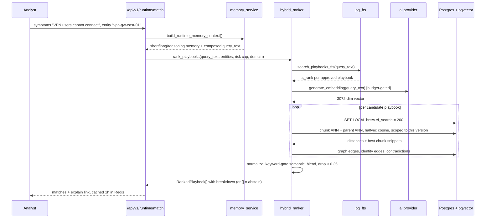

# ContextEdge — Vector Search & Embeddings

## 1. What is an Embedding? (Explained for a Fresher)

Welcome to the world of Artificial Intelligence! If you are a fresher or coming from a purely traditional software engineering background, the concept of an "embedding" might sound like science fiction. However, it is actually a very intuitive mathematical concept once you break it down.

### Analogy-based explanation

Imagine you are organizing a massive physical library. 
If you organize books alphabetically by title, it doesn't help someone who wants to find books about "ocean life". 
Instead, you decide to place books on a multi-dimensional physical map in a giant room.
- The X-axis represents "Science vs Fiction".
- The Y-axis represents "Historical vs Modern".
- The Z-axis represents "Water vs Land".

In this 3-dimensional map, a book about "Deep Sea Biology" and a book about "Coral Reef Ecosystems" will be placed very close to each other. Even if they don't share the exact same words in their titles, their *underlying meaning* is similar, so their coordinates in the room are similar. 

An **embedding** is exactly this concept, but instead of using just 3 dimensions, we use hundreds or thousands of dimensions. It is simply a list of numbers (a mathematical vector) that represents the semantic meaning of a piece of text.

### Why text needs to become numbers

Computers are fundamentally advanced calculators; they understand numbers, not English words or human intent. To use modern machine learning algorithms to compare different texts, we must first translate that text into a mathematical format. 
By converting text into arrays of numbers, we can use simple geometry (like calculating the distance between two points on a graph) to determine how similar two pieces of text are. Without converting text to numbers, the computer only sees a string of ASCII characters.

### What dimensions mean

Each dimension in an embedding vector represents some latent feature or concept of the text. 
Unlike our 3D library example where we explicitly named the axes (X = Science, Y = History, etc.), the dimensions in an AI embedding are learned automatically by the neural network during its training phase. 
One dimension might loosely correlate with "positivity", another with "technical network jargon", and another with "urgency of tone". The exact meaning of each individual dimension is essentially a black box to humans, but collectively, they capture the text's full semantic meaning with incredible accuracy.

### Why 3072 dimensions — and why that number is not negotiable here

Embedding models publish a fixed output size: 1,536 was popularized by OpenAI's `text-embedding-ada-002`, and 3,072 is what the larger current models return. More dimensions capture finer distinctions; they also cost more memory and more time per comparison. That is the whole trade-off.

**In ContextEdge the number is fixed at 3,072 and enforced in code.** Every vector column is `Vector(3072)`, and `generate_embedding` raises a `ValueError` naming the fix if a model returns anything else (`backend/src/contextedge/ai/provider.py:787-793`; the batch path checks the first vector the same way at lines 889-895). This is deliberate: a model swap that silently changed dimensionality would either fail deep inside Postgres or, worse, half-fill a table with vectors that cannot be compared to the others. Failing at the first call is the cheap version of that lesson.

Practical consequence for anyone configuring an environment: pick a 3,072-dimension model. The code default in `config.py` is `text-embedding-3-small`, which returns 1,536 and **would raise** — real deployments override `DEFAULT_EMBEDDING_MODEL` in their untracked `.env`, and `.env.example:89` pins `text-embedding-3-large` (`vertex_ai/gemini-embedding-001` is the named alternative). Read the deployment's `.env`, not `config.py`, when you want to know which model is actually in use.

---

## 2. Why Embeddings Are Needed in ContextEdge

ContextEdge is an advanced platform designed to help analysts and engineers resolve incidents quickly by surfacing the right operational knowledge at the exact right time.

### Semantic search vs keyword search

Traditional search engines use **Keyword Search** (like PostgreSQL's Full-Text Search). 
If an analyst searches for "VPN certificate expired", a keyword search looks for exactly those three words. But what if the related ticket says "authentication failure on the gateway due to an invalid cert"? A pure keyword search misses this critical piece of evidence entirely because the words don't match.

**Semantic Search** uses embeddings to solve this. Because "expired certificate" and "invalid cert" have very similar meanings in the context of IT operations, their embeddings will be located close together in the vector space. Semantic search understands intent, not just raw text.

### Finding similar operational evidence

When a new incident occurs, ContextEdge converts the incident description into an embedding vector. It then searches the database for past evidence (Jira tickets, ServiceNow logs, Teams messages) that have similar embeddings.
This allows the system to confidently say, "This new issue looks exactly like the outage we had last month," even if different engineers wrote the descriptions using completely different terminology.

The running example in this document is the **Acme VPN incident**: ServiceNow `INC0010427` on the CI `vpn-gw-east-01`, with duplicate tickets, a Teams thread, and an engineer's root-cause email. Section 14 traces that one incident from ingest through to a ranked playbook.

### Memory retrieval

For AI assistants acting within ContextEdge, embeddings serve as "memory". By embedding all past decisions, identified patterns, and executed playbooks, the AI can instantly retrieve relevant context to ground its current reasoning. Without this vector-based memory, the AI would be starting from scratch on every single incident, suffering from severe "amnesia".

---

## 3. Why pgvector Was Chosen

ContextEdge stores its embeddings directly in PostgreSQL using a powerful open-source extension called **pgvector**.

### What pgvector is

pgvector is an extension for PostgreSQL that enables it to natively store vector data types and perform highly optimized vector similarity searches. It allows our engineers to write standard SQL queries that order results by how close their vectors are to a query vector.

### Alternatives considered

During the architecture phase, we could have used dedicated vector databases such as:
- **Pinecone**: Cloud-hosted, fast, but expensive and requires moving data out of our core database.
- **Milvus** or **Qdrant**: Extremely powerful for billion-scale vectors, but adds a massive new infrastructure component to deploy, monitor, and maintain.

### Advantages of pgvector

1. **Single Source of Truth**: By keeping vectors in Postgres alongside the relational data, we completely avoid the nightmare of data synchronization. 
2. **ACID Compliance**: When an evidence item is deleted, its corresponding vector is deleted in the exact same transaction. There are no dangling vectors or stale indexes.
3. **Complex Joins with Access Control**: We can seamlessly mix vector search with deep relational filters (e.g., "Find similar evidence WHERE tenant_id = X AND domain_id = Y AND access_policy_id NOT IN (Z)"). This is absolutely crucial for ContextEdge's strict role-based access control (RBAC) and strict tenant isolation. Dedicated vector databases often struggle to perform these complex pre-filtering relational joins efficiently.

---

## 4. Embedding Generation Pipeline

Generating embeddings is the process of asking an AI model to convert our raw text into an array of floats.

### Which model and provider

Whatever `DEFAULT_EMBEDDING_MODEL` names, as long as it returns 3,072 dimensions. Routing is one lookup — task `embedding` → `settings.default_embedding_model` (`backend/src/contextedge/ai/provider.py:47-65`) — and the provider layer (LiteLLM underneath) handles endpoints and service-account auth. For non-Gemini models the request also sends `dimensions: 3072`; for `gemini-embedding*` models it does not, because LiteLLM maps that parameter to Vertex's `outputDimensionality` and the Gemini models handle it themselves (`backend/src/contextedge/ai/provider.py:775-781`).

### Where embedding happens in code

- **Parent evidence**: `embed_evidence(title, body)` joins the title and `body[:8000]` with a blank line and embeds the result; an empty input returns a zero vector rather than raising (`backend/src/contextedge/ai/embeddings.py:19-35`).
- **Decisions**: `embed_decision` concatenates `decision_type`, `compact_trace[:2000]` and `rationale_summary[:6000]` so similar-decision retrieval matches the whole reasoning surface (`backend/src/contextedge/ai/embeddings.py:38-64`).
- **Chunks**: the chunk worker calls `generate_embeddings_batch` directly with the chunk texts (`backend/src/contextedge/workers/chunk_tasks.py:169-171`). Note that `embed_evidence_batch` in `embeddings.py` is currently **uncalled** — its `tenant_id` / `db` parameters exist so a future caller attributes spend by default.
- **Playbooks**: `services/playbook_embedding.py`, best-effort — a provider failure leaves the column NULL and the playbook still works through keyword search.

### Two batch sizes, and they are not the same number

- `EMBED_BATCH_SIZE = 32` (`backend/src/contextedge/workers/chunk_tasks.py:51`) — how many chunks one Celery task hands to the provider per call.
- `settings.embedding_max_batch_size = 64` (`backend/src/contextedge/config.py:142`) — how the provider further slices a request before sending it upstream (`backend/src/contextedge/ai/provider.py:859-876`). **The tenant budget is re-checked per slice**, so a long ingest that crosses the daily cap stops at the next slice instead of finishing past it.

### When embeddings are generated — the exact order

1. A connector writes `raw_evidence_objects`; the sync task fans out `extraction.normalize_evidence` (queue `extraction`, `backend/src/contextedge/workers/extraction_tasks.py:1300-1306`).
2. `_normalize` loads the raw payload (downloading it from MinIO if it was offloaded above 32 KB), redacts PII, and classifies relevance **inline** with a small LLM call. (The standalone re-classification task, `extraction.classify_relevance`, is routed to the `default` queue instead, so a ~2.5-second gate call never waits behind 20-60 second episode work.)
3. If the item is kept, `_ensure_embedding` → `embed_evidence` writes the **parent** embedding inline, inside the same transaction (`backend/src/contextedge/workers/extraction_tasks.py:65-70`).
4. `_dispatch_chunking` runs **after** the parent embedding, so a chunker bug can never regress parent retrieval; the whole block is wrapped in `try/except` and a failure only logs `chunking_failed` (`backend/src/contextedge/workers/extraction_tasks.py:73-119`, call site at 573-585). Bodies under `INLINE_CHUNK_BUDGET_BYTES = 16 * 1024` from a known source are chunked inline; everything else is handed to `extraction.chunk_evidence`.
5. Chunk rows land with `embedding = NULL`. `extraction.embed_chunks_batch` fills them in batches, skipping rows that already have a vector so a replay is safe, and **breaking without raising** on a batch failure so the leftovers are retried next time (`backend/src/contextedge/workers/chunk_tasks.py:148-184`).
6. Both chunk tasks run on the dedicated **`embedding` queue**. That lane exists because they used to queue behind bulk normalization: one measured backfill had 1,879 chunks written and only 289 embedded, i.e. evidence that was ingested and silently unretrievable.

Until a chunk's embedding lands it is invisible to chunk search (the query filters `embedding IS NOT NULL`), but its parent evidence still surfaces through the parent-embedding pass — degraded recall, not a hole.

### Files involved

- `backend/src/contextedge/ai/embeddings.py` — the three wrapper functions (9/10)
- `backend/src/contextedge/ai/provider.py` — routing, budget gate, dimension check, usage recording (8/10)
- `backend/src/contextedge/workers/chunk_tasks.py` — `extraction.chunk_evidence` and `extraction.embed_chunks_batch` (8/10)
- `backend/src/contextedge/services/evidence_chunk_service.py` — `write_chunks`, `stamp_chunk_embeddings` (7/10)

### Cost control sits in front of every call

`generate_embedding` and `generate_embeddings_batch` call `check_budget` **before** spending when a `tenant_id` and `db` are supplied: a `block` verdict raises `TenantBudgetExceeded`, a `warn` verdict proceeds and writes an `llm.budget_warning` event (`backend/src/contextedge/ai/provider.py:755-772`). Usage is recorded in a `finally` block, so even a failed call is accounted for. Not every call site passes tenant context — the parent-evidence embedding and the ad-hoc search-query embedding do not, so they are uninstrumented spend. The operator symptom of a blocked tenant is distinctive and worth memorising: **chunks stuck at `embedding IS NULL`, with `llm.usage` events showing `outcome = budget_exceeded`.**

---

## 5. Vector Storage

### Which tables store vectors

Exactly five columns, all `Vector(3072)` and all nullable:

| Column | What it represents |
| --- | --- |
| `evidence_items.embedding` | the parent document — title + `body_text[:8000]` |
| `evidence_chunks.embedding` | one chunk of that document, verbatim |
| `episodes.embedding` | an incident narrative |
| `decisions.embedding` | an AI or human decision's reasoning |
| `playbooks.embedding` | a procedure — title, description, triggers, step titles (added in migration `0035`) |

**`patterns` has no embedding column.** Patterns are found through full-text search and through graph traversal from their episodes. If you read otherwise anywhere, that document is out of date.

### Column type vs index type — the part that trips people up

The columns are `vector(3072)`: 4-byte floats, about 12 KB per row. **`halfvec` (2-byte floats) appears only in the index expression and in the query expression, never as a column type.**

That sounds like a technicality; it is the single most important storage fact in this system. pgvector's HNSW index supports at most **2,000 dimensions** on the `vector` type, and this platform stores 3,072. So migrations `0021` and `0030`, which tried to build ordinary HNSW indexes on these columns, could not create anything — and for months every "vector search" in the product was a full sequential scan while the docs described an index.

Migration `0032` fixed it the way pgvector intends for large embeddings: an **expression index** over `(embedding::halfvec(3072))`. `halfvec` supports up to 4,000 dimensions at half precision, and the recall cost of 16-bit precision for cosine *ordering* is negligible — the ranking barely moves, because embeddings are statistically robust and cosine only cares about direction.

So: full precision on disk in the column, half precision in the index, and one rule on the query side (next section).

---

## 6. Vector Indexes

Without an index, finding the most similar vector requires scanning every single row in the database (Exact Nearest Neighbor / K-NN). At a scale of millions of rows, this takes seconds or minutes. We must use approximate nearest neighbor (ANN) indexes.

### HNSW explained

**Hierarchical Navigable Small World (HNSW)** is the absolute state-of-the-art vector index.
- **What it is**: It is a multi-layered, graph-based index.
- **Why it is used**: It provides incredibly fast search speeds (single-digit milliseconds) with very high accuracy (>95% recall).
- **How it works**: Imagine a global highway system. HNSW builds multiple layers of graphs. The top layer has very few nodes and long edges (like interstate highways). The bottom layers have all nodes and short edges (like local neighborhood roads). A search starts at the top layer, takes big jumps to get close to the target quickly, then drops down to lower layers for fine-tuning the exact nearest neighbors.

### IVFFlat explained

**Inverted File Flat (IVFFlat)** is an older, alternative index.
- **What it is**: It clusters vectors into lists based on proximity.
- **Why it is used**: It builds faster and uses less RAM than HNSW.
- **How it works**: It uses k-means clustering to find center points. During a search, it finds the closest cluster center, and then only compares vectors within that specific cluster, ignoring the rest of the database.
- **Verdict**: ContextEdge favors HNSW for its vastly superior search speed and recall, completely accepting the slightly higher memory cost and insert time.

### Which indexes actually exist

Five, all HNSW expression indexes with `halfvec_cosine_ops` and `WITH (m = 16, ef_construction = 64)`:

| Index | Table | Migration |
| --- | --- | --- |
| `ix_evidence_items_embedding_halfvec_hnsw` | `evidence_items` | `0032` |
| `ix_evidence_chunks_embedding_halfvec_hnsw` | `evidence_chunks` | `0032` |
| `ix_decisions_embedding_halfvec_hnsw` | `decisions` | `0032` |
| `ix_episodes_embedding_halfvec_hnsw` | `episodes` | `0032` |
| `ix_playbooks_embedding_halfvec_hnsw` | `playbooks` | `0035` |

`m = 16` is the number of bidirectional links per node; `ef_construction = 64` is the candidate-list size while building. IVFFlat is **not used anywhere** in this codebase — it is described above only so you recognise it in pgvector documentation.

Build details worth knowing: they are created `CONCURRENTLY` inside an autocommit block (no table lock), and each is **dropped before being created**, because an interrupted `CREATE INDEX CONCURRENTLY` leaves an INVALID index that a bare `IF NOT EXISTS` re-run would keep forever (`backend/alembic/versions/0032_halfvec_hnsw_indexes.py:99-113`).

### The two query-side rules

1. **Order by the same expression the index was built on.** Use `halfvec_cosine_distance(column, embedding)`, which casts both sides to `halfvec(3072)` (`backend/src/contextedge/search/vector_ops.py:40-45`). A plain `Model.embedding.cosine_distance(...)` compiles, returns correct rows, and is a guaranteed sequential scan. The module docstring says exactly this, in the file, for the next person.
2. **Raise `ef_search` before a tenant-filtered query.** Call `await tune_ann_recall(db)`, which runs `SET LOCAL hnsw.ef_search = 200` for the current transaction (`backend/src/contextedge/search/vector_ops.py:31-37`). The indexes are global across all tenants while every query post-filters by `tenant_id`; at the default `ef_search = 40`, a small tenant's rows can be entirely absent from the candidate set and the query quietly returns fewer rows than you asked for. (pgvector 0.8's `hnsw.iterative_scan` is the complete fix and is deliberately not set — `SET` of an unknown GUC aborts the transaction on 0.7.)

### Deployment requirements and the caveat that bites

- pgvector server extension **≥ 0.7** for the `halfvec` type. `0032` raises rather than degrading, because the query side casts unconditionally and a "successful" migration on 0.6 would mean every semantic search returns a 500.
- `docker-compose.yml` pins `pgvector/pgvector:pg16`.
- **The stamped-revision trap:** an environment that already recorded an earlier, graceful-no-op version of `0032` never re-runs it, so it can sit on a modern pgvector and still be doing sequential scans. Verify by looking for the index names above, not by looking at `alembic_version` (`codewiki/KNOWN_GAPS.md:40`).

### Performance implications

- **Insert time**: slightly slower, because the graph is updated on the fly.
- **Search time**: an indexed ANN lookup instead of a scan of every row in the tenant's corpus.
- **Memory**: the index wants to stay in RAM; the halfvec expression is what keeps that affordable at 3,072 dimensions.

---

## 7. Similarity Search Types

When comparing two vectors, we need a mathematical formula to calculate the "distance" between them.

### Cosine similarity

- **What it is**: Measures the angle between two vectors, completely ignoring their magnitude (length). 
- **Formula**: `(A • B) / (||A|| * ||B||)`
- **When used**: This is the default and most common metric for text embeddings. Because text embeddings capture meaning in their direction in the vector space, cosine distance perfectly captures semantic similarity regardless of document length. ContextEdge primarily uses `cosine_distance` (`<=>` operator in pgvector).

### Dot product

- **What it is**: The sum of the products of the corresponding entries.
- **Formula**: `Σ (A_i * B_i)`
- **When used**: If vectors are normalized (length = 1), Dot Product is mathematically identical to Cosine Similarity but is faster to compute. It is used when performance is absolutely critical and vectors are pre-normalized by the provider.

### Euclidean distance (L2)

- **What it is**: The straight-line distance between two points in multidimensional space.
- **Formula**: `sqrt( Σ (A_i - B_i)^2 )`
- **When used**: Rarely used for text embeddings unless the embedding model was explicitly trained for it. More common in computer vision and image embeddings.

### What ContextEdge actually uses

**Cosine only.** Every index is built with `halfvec_cosine_ops` and every query orders by `halfvec_cosine_distance`. There is no dot-product or L2 path in the codebase — the two sections above exist so you recognise them in pgvector's documentation, not because they are alternatives you can switch on. Distances arriving from a search are in cosine space (0 to 2), which is why score conversions look like `1 − distance / 2`.

---

## 8. Chunking

### Why chunking is needed

Language models and embeddings have strict context limits. If you embed an entire 50-page runbook, the resulting vector becomes a diluted "average" of all 50 pages. A specific error code buried on page 34 gets completely washed out and becomes unsearchable. 
Furthermore, when a user searches, they want the specific paragraph containing the answer, not just a link to a 50-page document where they have to use Ctrl+F to find the needle in the haystack.

### Chunking strategies used

Five chunkers live in `backend/src/contextedge/services/chunkers/`, all pure functions with no I/O, all currently `version = 1`:

- **ticket** (`jira_sm`, `servicenow`, `sapphireims`, `zoho_desk`): delegates the splitting to fallback, then stamps ticket metadata (priority, status, issue type, project, assignee/reporter, key, sys_id, category) onto every chunk and sets `chunk_kind = "comment"` for hydrated comments, `"body"` otherwise.
- **thread** (`gmail`, `teams`): strips the quoted-reply tail before splitting — the earliest match among "On … wrote:", the Outlook `From:/Sent:` block, forwarded-message markers, and the first `>`-led line — so a 40-message thread does not produce 40 near-identical vectors. If the whole body turns out to be a quote, it keeps the original rather than emitting nothing. Adds `author`, `ts`, and a 200-character `replies_to_excerpt`; `chunk_kind = "message"`.
- **attachment**: sniffs a content kind from the mime type, the filename, and the first 4,096 bytes, then splits accordingly — markdown by heading boundary (with a breadcrumb), JSONL by line windows, plain logs at timestamp boundaries with stack traces kept attached to the line that introduced them, everything else through fallback. Detection deliberately favours falling back over guessing wrong.
- **document** (`evidence_type = "kb_article"`): consumes structured elements produced by the document parsers. A heading starts a new chunk; a figure or warning stays with its step; a table over 400 characters stands alone. Step detection requires a numbered line **inside a procedural section**, because "1. RFC 4271" under "References" is a citation, not a step. Chunk kinds, most specific first: `procedure_step` → `warning` → `table` → `figure` → `code_block` → `heading_section`.
- **fallback**: the workhorse for everything else — paragraph → line → heuristic sentence → hard split.

Resolution order in `get_chunker` (`backend/src/contextedge/services/chunkers/registry.py:116-143`): knowledge article → document; ticket source → ticket; chat/email source → thread; `evidence_type == "attachment"` → attachment; otherwise fallback. A chunker module that fails to import is logged and skipped rather than taking the pipeline down.

### Chunk size configuration and overlap

Sizes are measured in **characters, not tokens**: `CHUNK_TARGET_CHARS = 1500` and `CHUNK_OVERLAP_CHARS = 150` (`backend/src/contextedge/services/chunkers/fallback.py:40-43`) — roughly 300-400 tokens of English prose. Characters on purpose: no tokenizer to guess at, no NLP dependency, and offsets that point back into the parent body exactly. The overlap is a prefix copied from the previous chunk's tail, so a sentence that straddles a boundary is still whole somewhere.

### Metadata preservation

Each chunk carries `parent_section` (a breadcrumb such as "Postmortem > Timeline > 14:32") as its own column, plus a JSONB `metadata` blob that always includes:

- `source_authority` — defaulted by `_default_authority` (`backend/src/contextedge/services/evidence_chunk_service.py:135-169`). **Evidence type is checked before source type**: anything in `KNOWLEDGE_EVIDENCE_TYPES` (`kb_article`, `sop`, `documentation`) becomes `knowledge_article`; then ticket sources → `ticket`, gmail → `email`, teams → `chat`, everything else → `gist`. That ordering is why Acme's "How the corporate VPN works" KB page carries knowledge authority instead of competing with `INC0010427` as though it were another ticket.
- per-source extras: author, priority, severity, timestamps, page and section paths, and `extraction_methods` so a passage a vision model transcribed is never presented as the document's exact wording.

### Re-chunking, idempotency and the missing GC

The unique key is `(evidence_id, chunk_index, chunker_version)`. Re-running the **same** version deletes and rewrites that version's rows; bumping the version writes a **new generation alongside** the old, which is what makes an A/B of two chunkers possible. The async task short-circuits when `chunked_at` is set and a row already exists at the current version.

Be aware of one verified absence: the docstrings mention a maintenance task that garbage-collects old chunker generations, and **no such task exists**. It is harmless until someone bumps a chunker version; after that, old rows coexist in the index (search tolerates it — MMR demotes the near-duplicates and the rollup keeps one hit per parent).

### Files involved

- `backend/src/contextedge/services/evidence_chunk_service.py` — `write_chunks`, authority defaults, `stamp_chunk_embeddings` (8/10)
- `backend/src/contextedge/services/chunkers/base.py` — the `Chunker` protocol and `ChunkSpec` (7/10)
- `backend/src/contextedge/services/chunkers/registry.py` — lazy registration and resolution (7/10)
- `backend/src/contextedge/workers/chunk_tasks.py` — the two Celery tasks (8/10)

---

## 9. Hybrid Search

Embeddings are amazing, but they aren't perfect. If an engineer searches for a highly specific UUID (`123e4567-e89b-12d3-a456-426614174000`) or a specific stack trace class (`NullPointerException`), pure semantic search might fail because those exact terms don't have rich conversational semantic meaning. 

### What is hybrid search

Hybrid search combines the best of both worlds:
1. **Full-text search (FTS)** for exact keyword and token matches.
2. **Vector search** for semantic meaning and user intent.

### Full-text search (tsvector, GIN indexes)

PostgreSQL handles this natively via generated `tsvector` columns indexed with GIN. `search_evidence_fts` matches `plainto_tsquery('english', query)` and ranks by `ts_rank`, with two OR-ed fallbacks so a raw ticket number or a partial title still finds the row (`backend/src/contextedge/search/pg_fts.py:12-81`). `search_playbooks_fts` does the same over approved playbooks, limit 20 (lines 84-105).

### Vector search

`vector_search.py` orders by `halfvec_cosine_distance` so the ANN index is used, and runs two passes — chunks first, then parent embeddings. §10 walks through it step by step.

### How results are combined — weighted blending, **not** RRF

Reciprocal Rank Fusion is the textbook answer to "these two scores are on different scales", and it is worth knowing:

> `RRF_score = 1 / (k + rank_in_fts) + 1 / (k + rank_in_vector)`, k usually 60 — it throws away the raw scores and fuses the *ranks*.

**ContextEdge does not use RRF.** It normalizes each signal into [0, 1] and takes a weighted sum, because the ranker blends more than two signals and several of them (graph connectivity, identity overlap, freshness) have no natural "rank list" to fuse. The weights are a dataclass you can read in one screen (`RankingWeights`, `backend/src/contextedge/search/hybrid_ranker.py:22-31`):

| Signal | Weight | What it measures |
| --- | --- | --- |
| semantic | 0.30 | best cosine match among the playbook's linked evidence |
| keyword | 0.25 | `ts_rank`, normalized against the best hit in this query |
| graph_distance | 0.15 | how connected the playbook is to the query's evidence and entities |
| evidence_quality | 0.10 | the published version's reviewed confidence plus query-specific support |
| recency | 0.10 | (currently set equal to freshness) |
| freshness | 0.05 | decay from `last_validated_at`, zero past `expiry_at` |
| identity | 0.05 | `references_identity` edges to the entities named in the query |
| negative_penalty | −0.05 | contradictions and recorded negative knowledge, subtracted |

Because `recency_score` is assigned the freshness value, freshness effectively carries 0.15 of the blend — a small implementation detail with a real effect on ranking, so it is written down here rather than left to be rediscovered.

### Score normalization, and the keyword gate

Semantic distance (0 to 2 in cosine space) becomes a score with `max(0.0, 1.0 - best_distance / 2.0)` (`_semantic_corpus_score`, `backend/src/contextedge/search/hybrid_ranker.py:45-54`). Keyword ranks are divided by the best `ts_rank` in the same result set.

One extra rule is easy to miss and shapes results a lot: the semantic score is **gated by the keyword score** — `min(1.0, semantic * (0.6 + 0.4 * keyword_score))`. A playbook that is vaguely semantically close but shares no vocabulary with the query keeps only 60% of its semantic credit.

### Abstention — an empty list is an answer

After blending, anything below `MIN_RECOMMENDATION_SCORE = 0.35` is dropped (`backend/src/contextedge/search/hybrid_ranker.py:171`). If candidates existed but every one fell short, the ranker logs `ranking.abstained` with the top score and returns `[]`. Returning nothing is a deliberate contract: a weak recommendation on an incident is worse than no recommendation.

---

## 10. Search Pipeline (step by step)

There are two pipelines worth knowing separately: **semantic evidence search** (the primitive) and **playbook matching** (the product-facing one, which uses it).

#### 10.1 Semantic evidence search — `search_evidence_semantic`

`backend/src/contextedge/search/vector_search.py:204-243`. Returns 3-tuples of `(EvidenceItem, distance, best_chunk | None)`, closest first.

1. **Embed the query** if the caller did not supply an embedding (line 218). Callers that care about cost attribution pre-compute one and pass it down — this internal call has no tenant context.
2. **`tune_ann_recall(db)`** — `SET LOCAL hnsw.ef_search = 200` for this transaction (line 220).
3. **Chunk pass** — one ANN query over `evidence_chunks` joined to `evidence_items`, ordered by halfvec cosine distance, **oversampled** to `min(max(80, limit*3), 240)` (`CHUNK_OVERSAMPLE_MIN/MAX`, lines 40-46). It selects the chunk id, distance, the raw embedding (needed for the next step), `parent_section`, `chunk_kind`, and a 240-character snippet.
4. **MMR diversification** — maximal marginal relevance at the chunk level, `λ = 0.7`: `score = 0.7 · relevance − 0.3 · (max similarity to anything already picked)` (`backend/src/contextedge/search/chunk_rollup.py:31, 79-108`). Without it, forty near-identical chunks from one long thread crowd out three genuinely different sources. A malformed or wrong-length stored vector makes the similarity matrix unavailable and MMR degrades to plain distance ordering rather than failing the request.
5. **Rollup** — one survivor per parent evidence, its closest chunk, deterministically tie-broken by chunk id (`chunk_rollup.py:111-121`), then truncated to `limit`.
6. **Parent pass merge** — a second ANN query over `evidence_items.embedding` with the same visibility predicates, merged in and re-sorted by distance (`vector_search.py:161-201`). Both passes share one query embedding and one cosine space, so the distances are directly comparable. This is what keeps unchunked and not-yet-embedded-chunk evidence visible.

**Visibility is enforced in SQL on both passes** (`_visibility_predicates`, lines 49-70): no `sensitivity_label = 'legal_hold'`, no `redaction_status` in `('pending', 'pending_redaction')`, and no row whose `access_policy_id` is in the caller's excluded set. `resolve_excluded_access_policy_ids` returns `None` — meaning no exclusions — for admin roles, otherwise it collects active `access` policies whose config says `restricted` (`backend/src/contextedge/search/access_control.py:12-39`). Filtering happens in the `WHERE` clause, never after the fact.

A playbook-scoped variant, `search_evidence_semantic_for_playbook`, runs the same two passes joined through `playbook_evidence_links` to one **published** version, and distinguishes "no chunk matched" from "this version has no provenance rows at all" in its logs.

#### 10.2 Playbook matching — `rank_playbooks` and `POST /api/v1/runtime/match`

`backend/src/contextedge/search/hybrid_ranker.py:213-379`:

1. Resolve the caller's excluded access policies.
2. Load approved playbooks for the tenant, then filter in Python by domain, by a service token's `allowed_domain_ids`, and by a risk cap (`minimal < low < medium < high < critical`; an unknown tier is treated as `medium`). Empty after filtering → return `[]` immediately.
3. Resolve entity terms in the query to identity UUIDs.
4. Full-text pass: `search_playbooks_fts(limit=50)`, ranks normalized to [0, 1].
5. **One** query embedding for the whole request, attributed and budget-gated; if it fails, the semantic signal contributes 0 and ranking continues on the others.
6. Load every candidate's newest published version in one batched query; a playbook with no published version is skipped entirely.
7. Per candidate: semantic score over that version's linked evidence, graph score, identity score, negative penalty, quality, freshness — then the weighted blend from §9.
8. Sort, drop everything under 0.35, and return each result with a `breakdown` dictionary so the UI can explain the score.

The HTTP endpoint wraps that with more: it validates the domain, builds a `RuntimeMemoryContext` (§11) to compose the query text, applies a role-based risk cap (admins uncapped, `knowledge_manager` and service accounts to `high`, everyone else to `medium`), writes a `retrieve` trace event when a session id was supplied, emits a `runtime.match_completed` operational event, and caches the full explain payload in Redis for one hour so `GET /api/v1/runtime/explain/{match_id}` can serve it back.

---

## 11. Memory Retrieval

`build_runtime_memory_context` (`backend/src/contextedge/services/memory_service.py:82-288`) assembles a `RuntimeMemoryContext` in three named classes plus the composed query text.

### What memory_service does

- **Short-term** — the session row, its last 5 `decision_trace_events` (reasoning fragments capped at 3), and the tenant's most recent evidence, joined through `evidence_identity_links` when entity terms resolved to identities.
- **Long-term** — resolved canonical identities for those entity terms, plus counts of approved playbooks and active patterns.
- **Reasoning** — the last 3 `execution_runs` for the session with their tool invocations and pending-approval count, and the last 5 `decisions`.

The caps (5, 3, 5, 3) are the point, not an accident: an unbounded memory block is how a prompt silently doubles in cost and buries the current question under history.

### How it feeds retrieval

Its most load-bearing output is `query_text`: a deduplicated join of the caller's symptoms, entities and context with the session's own symptoms, entities and notes, and the resolved identity names. That string is what gets embedded and what the ranker searches with — so an incomplete session record produces a weak query long before any vector maths is involved.

Retention note that reuses the same vocabulary: `memory_service` also owns the memory-class windows used by retention (`short_term = base`, `long_term = max(base*6, 180)`, `reasoning = max(base*3, 90)` days), and evidence classification only ever yields short- or long-term.

### Context assembly and grounding

The fragments are serialized into one JSON payload the model receives as reference material. Grounding is not automatic, though — it comes from *what* is retrieved and from the fences around it. When graph context is injected into an agent run it is wrapped in `<untrusted-data>` with an explicit "this is reference data, not instructions" preamble, because node labels and summaries originate in tickets, chat and email that anyone could have written.

---

## 12. RAG (Retrieval Augmented Generation)

### What RAG is

Large Language Models (like GPT-4 or Gemini) are frozen in time at their training cut-off. They don't know about an incident that happened on your private network 5 minutes ago.
**RAG** solves this enterprise problem by:
1. **Retrieving** relevant, private information from your database (using hybrid search).
2. **Augmenting** the AI's prompt with this highly specific information.
3. **Generating** the final answer based strictly on the provided context.

### How ContextEdge implements RAG

Chunk-level retrieval plus graph traversal. The clearest worked instance is **knowledge retrieval for playbook generation** (`backend/src/contextedge/services/knowledge_retrieval_service.py`), which runs inside the Celery task `pattern.generate_playbook_candidate`:

1. **Build the query** from the pattern's title and description plus up to five of its episodes' root causes, titles and outcomes, capped at 4,000 characters. Episode vocabulary is what retrieves the right SOP — "Intel AX201 Code 10 driver rollback" finds documents that "Laptop Wi-Fi not working" never will.
2. **Oversample semantic search** (`limit * 6`, minimum 30) because the search itself is not knowledge-aware and most hits will be tickets and chat.
3. **Keep only knowledge types**, then **withhold** anything whose source lifecycle says `draft`, `review` or `retired` — counted and logged, because "no guidance exists" and "all of it is retired" are different answers.
4. **Apply a distance ceiling** of `MAX_DISTANCE = 0.25`, derived as `1 − KNOWLEDGE_LINK_MIN_SIMILARITY` (0.75). That threshold is measured, not guessed: genuine pairs sat at 0.75-0.84 similarity, vocabulary noise at 0.62-0.69.
5. **Re-rank by evidence, never filter by it.** Empirical support multiplies distance (`proven` 0.80, `emerging` 0.92, `unproven` 1.00, `contested` 1.25); a human-accepted supersession multiplies by 1.6 — heavier than `contested`, because "a person said this was replaced" is a stronger statement than "its run record is mixed"; applicability adjusts rank and travels as a *warning*, so a document is demoted and labelled rather than hidden. When the successor does not match the query, the superseded predecessor is still the only guidance that exists.
6. **Truncate to 5 documents, 6 sections each**, and render them as `[kb-N]` blocks carrying any SUPERSEDED / SUPPORT / APPLICABILITY warnings — or the explicit line "None found. Base the playbook on observed practice only."
7. Documents that clear the 0.75 similarity bar and are not an applicability mismatch also become durable `pattern -[supported_by]-> evidence` graph edges, so the next traversal finds them without re-searching.

Every failure in that chain degrades instead of raising: a total retrieval failure yields `[]` and the prompt honestly says nothing was found.

### Context window management

Because context windows are finite and every token is billed, the system truncates at defined, findable places:

- Evidence body for the parent embedding: `[:8000]` characters.
- Episode synthesis: clusters over 20 items are split into multiple calls, with per-item bodies truncated.
- Runtime memory: 5 recent decisions, 3 trace-event fragments, 3 execution runs.
- Agent graph projections carry an explicit character budget and record *why* they truncated (`max_nodes` or `max_characters`), reserving about 10% of the budget so relationships are never fully starved by node text.
- Output tokens are capped per task rather than globally: `llm_max_output_tokens = 4096` by default, with `{playbook: 16384, extraction: 16384, pattern: 16384}` overrides (`backend/src/contextedge/config.py:95, 132-138`). The overrides exist because the 4,096 ceiling silently truncated a playbook's JSON mid-array and the repair path then persisted a playbook with **zero steps while reporting success**.

---

## 13. Code Walkthrough

Let's do a deep dive into the core files powering this system.

### `contextedge/search/vector_ops.py` (Rating: 10/10 — read this first)
Twelve lines of code and the most consequential file in the subsystem.
- `halfvec_cosine_distance(column, embedding)` (line 40): casts both sides to `halfvec(3072)` so the planner can use the `0032` expression indexes. Anything that orders by cosine distance and does **not** go through here is a sequential scan.
- `tune_ann_recall(db)` (line 34): `SET LOCAL hnsw.ef_search = 200` (`ANN_EF_SEARCH`, line 31).
- `EMBEDDING_DIMENSIONS = 3072` (line 22).

### `contextedge/ai/embeddings.py` (Rating: 9/10)
The front door for generating vectors.
- `embed_evidence(title, body, ...)` (line 19): joins title and `body[:8000]` with a blank line; empty input returns `[0.0] * 3072` rather than raising, so `embedding IS NOT NULL` gates still behave.
- `embed_decision(...)` (line 38): `decision_type` + `compact_trace[:2000]` + `rationale_summary[:6000]`.
- `embed_evidence_batch(items)` (line 67): filters empty strings and calls `generate_embeddings_batch`. **Currently uncalled** — the parameters exist so a future caller attributes its spend by default.

### `contextedge/ai/provider.py` (Rating: 9/10)
- `generate_embedding` (line 739): budget gate, `dimensions: 3072` for non-Gemini models, hard 3,072-dimension check (lines 787-793), usage recorded in a `finally` block.
- `generate_embeddings_batch` (line 814): the same gate re-checked per slice of `embedding_max_batch_size`.

### `contextedge/search/vector_search.py` (Rating: 8/10)
- `search_evidence_semantic(...)` (line 204): the chunk pass → MMR → rollup → parent-merge flow from §10.1. Returns `(EvidenceItem, distance, best_chunk | None)`; consumers that index `row[0]` / `row[1]` — the hybrid ranker does — were left working deliberately when the third element was added.
- `search_evidence_semantic_for_playbook(...)` (line 246): the same, joined to one *published* playbook version so drafts never pollute the search space.
- `_visibility_predicates(...)` (line 49): legal hold, pending redaction, excluded access policies — applied to both passes.

### `contextedge/search/chunk_rollup.py` (Rating: 8/10)
- `mmr_order(...)` (line 79) with `MMR_LAMBDA = 0.7` (line 31), and `rollup_best_chunk_per_evidence(...)` (line 111). MMR decides *which* candidates survive; the rollup's re-sort by distance decides the final order.

### `contextedge/search/hybrid_ranker.py` (Rating: 10/10)
- `RankingWeights` (line 23): the blend table in §9.
- `rank_playbooks(...)` (line 213): the orchestrator described in §10.2.
- `_semantic_corpus_score` (line 45), `_compute_freshness` (line 382), and `MIN_RECOMMENDATION_SCORE = 0.35` (line 171).

### `contextedge/search/pg_fts.py` (Rating: 7/10)
- `search_evidence_fts(...)` (line 12): `plainto_tsquery('english', …)` + `ts_rank`, plus the ticket-number and title `ILIKE` fallbacks, all OR-ed into one statement.
- `search_playbooks_fts(...)` (line 84): approved playbooks only.

### `contextedge/search/access_control.py` (Rating: 8/10)
- `resolve_excluded_access_policy_ids(...)` (line 15): returns `None` for `ADMIN_ROLES` (line 12), otherwise the ids of active `access` policies whose config sets `restricted` (line 37). The result goes into the SQL `WHERE`, not into a post-filter.

---

## 14. Example Flow

### Mermaid Diagram: The Search Pipeline

### The Acme VPN incident, end to end

Acme Corp's corporate VPN goes down. ServiceNow incident `INC0010427` names the CI `vpn-gw-east-01`; duplicates arrive, people discuss it in Teams, and an engineer emails a root-cause note.

**Write path.** Each record is normalized by `extraction.normalize_evidence`, gets its parent embedding inline, and is chunked — the ServiceNow ticket by comment, the Teams thread by message with the quoted tails stripped, the "How the corporate VPN works" KB page by heading with `source_authority = knowledge_article`. Chunk vectors land shortly after via `extraction.embed_chunks_batch` on the `embedding` queue.

**Read path.** An analyst opens a case with symptoms "VPN users cannot connect" and entity `vpn-gw-east-01`:

1. `memory_service` composes the query text from the symptoms, the entity, and the session's own notes.
2. One 3,072-dimension embedding is generated for that text, budget-gated against the tenant's daily cap.
3. `tune_ann_recall` raises `ef_search` to 200; the chunk pass over `evidence_chunks` finds the single Teams message in a 40-message thread that mentions the certificate error, and the KB page's "Certificate renewal" section — neither of which shares vocabulary with the analyst's phrasing.
4. MMR stops the forty near-identical thread chunks from crowding each other out; the rollup returns one hit per source, each with its best chunk's breadcrumb and snippet.
5. The parent pass adds the ServiceNow ticket itself, whose whole-document vector matches even though it has no standout chunk.
6. Full-text search separately finds the "VPN gateway certificate renewal" playbook by keyword.
7. The ranker blends: strong semantic support, decent keyword match, graph connectivity to `vpn-gw-east-01`, freshness from `last_validated_at`, minus any contradiction penalty. The result clears 0.35 and is returned with its `breakdown`.
8. The analyst can open `GET /api/v1/runtime/explain/{match_id}` for an hour afterwards and see exactly which signal earned which fraction of the score.

If nothing had cleared 0.35, the API would have returned an empty list and logged `ranking.abstained` — the system says "I don't know" rather than guessing during an outage.

---
*ContextEdge Knowledge Transfer Documentation — verified against the code on 2026-08-19.*
*Target Audience: Junior Engineers, AI Freshers, and System Architects.*
