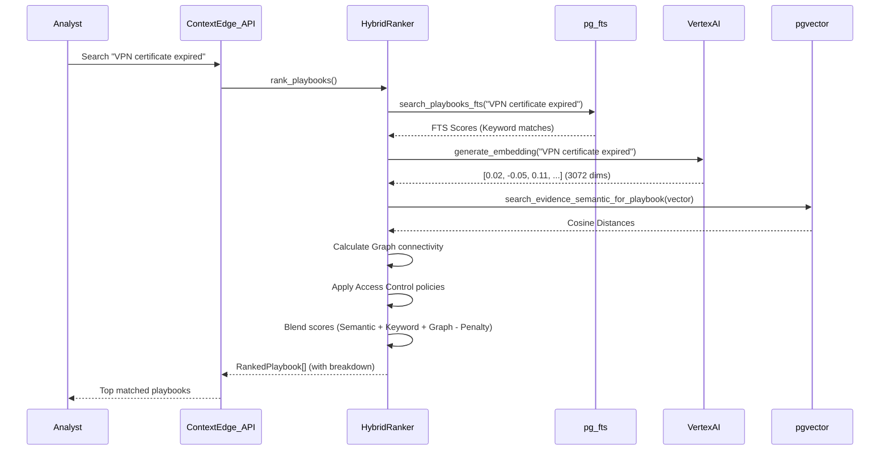

# ContextEdge — Vector Search & Embeddings

## 1. What is an Embedding? (Explained for a Fresher)

Welcome to the world of Artificial Intelligence! If you are a fresher or coming from a purely traditional software engineering background, the concept of an "embedding" might sound like science fiction. However, it is actually a very intuitive mathematical concept once you break it down.

### Analogy-based explanation

Imagine you are organizing a massive physical library. 
If you organize books alphabetically by title, it doesn't help someone who wants to find books about "ocean life". 
Instead, you decide to place books on a multi-dimensional physical map in a giant room.
- The X-axis represents "Science vs Fiction".
- The Y-axis represents "Historical vs Modern".
- The Z-axis represents "Water vs Land".

In this 3-dimensional map, a book about "Deep Sea Biology" and a book about "Coral Reef Ecosystems" will be placed very close to each other. Even if they don't share the exact same words in their titles, their *underlying meaning* is similar, so their coordinates in the room are similar. 

An **embedding** is exactly this concept, but instead of using just 3 dimensions, we use hundreds or thousands of dimensions. It is simply a list of numbers (a mathematical vector) that represents the semantic meaning of a piece of text.

### Why text needs to become numbers

Computers are fundamentally advanced calculators; they understand numbers, not English words or human intent. To use modern machine learning algorithms to compare different texts, we must first translate that text into a mathematical format. 
By converting text into arrays of numbers, we can use simple geometry (like calculating the distance between two points on a graph) to determine how similar two pieces of text are. Without converting text to numbers, the computer only sees a string of ASCII characters.

### What dimensions mean

Each dimension in an embedding vector represents some latent feature or concept of the text. 
Unlike our 3D library example where we explicitly named the axes (X = Science, Y = History, etc.), the dimensions in an AI embedding are learned automatically by the neural network during its training phase. 
One dimension might loosely correlate with "positivity", another with "technical network jargon", and another with "urgency of tone". The exact meaning of each individual dimension is essentially a black box to humans, but collectively, they capture the text's full semantic meaning with incredible accuracy.

### Why 1536 dimensions

You might wonder why embeddings often use exactly 1536 dimensions (a standard popularized by OpenAI's text-embedding-ada-002) or 3072 dimensions (used by newer models like Vertex AI's embeddings). 
1536 is a carefully chosen number that balances **expressiveness** and **efficiency**. 
- Too few dimensions (e.g., 100): The model cannot capture complex nuances, synonyms, or subtle contextual differences.
- Too many dimensions (e.g., 10000): The vectors take up too much memory (RAM/Disk) and distance calculations become extremely slow without significantly improving the actual accuracy of the search.
1536 dimensions hit the sweet spot for capturing rich semantic meaning while remaining computationally practical for real-time databases. In ContextEdge, we often use 3072 dimensions because we leverage Vertex AI's latest embedding models, which offer even higher precision for technical operational data.

---

## 2. Why Embeddings Are Needed in ContextEdge

ContextEdge is an advanced platform designed to help analysts and engineers resolve incidents quickly by surfacing the right operational knowledge at the exact right time.

### Semantic search vs keyword search

Traditional search engines use **Keyword Search** (like PostgreSQL's Full-Text Search). 
If an analyst searches for "VPN certificate expired", a keyword search looks for exactly those three words. But what if the related ticket says "authentication failure on the gateway due to an invalid cert"? A pure keyword search misses this critical piece of evidence entirely because the words don't match.

**Semantic Search** uses embeddings to solve this. Because "expired certificate" and "invalid cert" have very similar meanings in the context of IT operations, their embeddings will be located close together in the vector space. Semantic search understands intent, not just raw text.

### Finding similar operational evidence

When a new incident occurs, ContextEdge converts the incident description into an embedding vector. It then searches the database for past evidence (Jira tickets, ServiceNow logs, Slack messages) that have similar embeddings. 
This allows the system to confidently say, "This new issue looks exactly like the outage we had last month," even if different engineers wrote the descriptions using completely different terminology.

### Memory retrieval

For AI assistants acting within ContextEdge, embeddings serve as "memory". By embedding all past decisions, identified patterns, and executed playbooks, the AI can instantly retrieve relevant context to ground its current reasoning. Without this vector-based memory, the AI would be starting from scratch on every single incident, suffering from severe "amnesia".

---

## 3. Why pgvector Was Chosen

ContextEdge stores its embeddings directly in PostgreSQL using a powerful open-source extension called **pgvector**.

### What pgvector is

pgvector is an extension for PostgreSQL that enables it to natively store vector data types and perform highly optimized vector similarity searches. It allows our engineers to write standard SQL queries that order results by how close their vectors are to a query vector.

### Alternatives considered

During the architecture phase, we could have used dedicated vector databases such as:
- **Pinecone**: Cloud-hosted, fast, but expensive and requires moving data out of our core database.
- **Milvus** or **Qdrant**: Extremely powerful for billion-scale vectors, but adds a massive new infrastructure component to deploy, monitor, and maintain.

### Advantages of pgvector

1. **Single Source of Truth**: By keeping vectors in Postgres alongside the relational data, we completely avoid the nightmare of data synchronization. 
2. **ACID Compliance**: When an evidence item is deleted, its corresponding vector is deleted in the exact same transaction. There are no dangling vectors or stale indexes.
3. **Complex Joins with Access Control**: We can seamlessly mix vector search with deep relational filters (e.g., "Find similar evidence WHERE tenant_id = X AND domain_id = Y AND access_policy_id NOT IN (Z)"). This is absolutely crucial for ContextEdge's strict role-based access control (RBAC) and strict tenant isolation. Dedicated vector databases often struggle to perform these complex pre-filtering relational joins efficiently.

---

## 4. Embedding Generation Pipeline

Generating embeddings is the process of asking an AI model to convert our raw text into an array of floats.

### Which model and provider

Based on our design, ContextEdge targets **text-embedding-004** / **gemini-embedding-004** via **Google Vertex AI**. This state-of-the-art model produces 3072-dimensional vectors. The provider abstraction (`contextedge.ai.provider`) handles routing the request to the correct endpoint and authenticating via service accounts.

### Where embedding happens in code

- **Parent Evidence**: `embed_evidence` (in `ai/embeddings.py`) creates a single vector for the title + body of an evidence item.
- **Decisions**: `embed_decision` creates a vector capturing the rationale and trace of an AI decision, allowing us to find similar past reasoning.
- **Chunks**: `embed_evidence_batch` handles multiple smaller chunks at once for deep-document search.

### Batch vs single processing

- **Single (Synchronous)**: When a new piece of evidence arrives, the `_normalize` worker generates the parent embedding synchronously because it's needed immediately for baseline matching and initial correlation.
- **Batch (Asynchronous)**: Chunking produces dozens of texts per evidence (e.g., splitting a 50-page runbook into 100 chunks). Generating embeddings one by one would be too slow and would quickly hit Vertex AI rate limits. Instead, the `embed_chunks_batch_task` sends them in efficient batches of 32 (`EMBED_BATCH_SIZE`).

### When embeddings are generated

1. Raw evidence is ingested into the system from a connector (Jira, Slack, etc.).
2. The `_normalize` Celery task redacts PII and uses a lightweight LLM call to classify if the item is relevant (operational) or noise.
3. If relevant, it synchronously generates the parent embedding.
4. If eligible for chunking, it writes chunks to the database (with `embedding = NULL`).
5. An async Celery task (`embed_chunks_batch_task`) picks up the chunks and populates their embeddings in batches.

### Files involved

- `backend/src/contextedge/ai/embeddings.py` (Importance Rating: 9/10)
- `backend/src/contextedge/ai/provider.py` (Importance Rating: 8/10)
- `backend/src/contextedge/workers/chunk_tasks.py` (Importance Rating: 8/10)
- `backend/src/contextedge/services/evidence_chunk_service.py` (Importance Rating: 7/10)

---

## 5. Vector Storage

### Which tables store vectors

- `evidence_items`: Stores the parent embedding for the entire document (truncated to 8000 chars).
- `evidence_chunks`: Stores detailed chunk embeddings for highly granular search.
- `episodes`: Stores incident narrative embeddings.
- `patterns`: Stores extracted recurring patterns for root-cause analysis.
- `playbooks`: Stores playbook vectors for automated recommendation.
- `decisions`: Stores AI reasoning trace vectors.

### Column types (HalfVec)

In pgvector, vectors are traditionally stored using the `vector(DIM)` type, which uses standard 4-byte floating-point numbers (float32). 
However, **HalfVec** (half-precision vector, float16) is a critical architectural optimization. 

### Why HalfVec (memory optimization)

For 3072 dimensions, a standard float32 vector takes about 12 KB of storage. When you have millions of chunks across many tenants, this consumes massive amounts of RAM (since vector indexes need to fit entirely in memory for fast querying).
**HalfVec** reduces the storage requirement by exactly 50% (to ~6 KB per vector) by using 2-byte floats. 
- **Memory optimization**: Cutting memory usage in half allows the PostgreSQL database to hold twice as many vectors in RAM, delaying the need for expensive vertical scaling.
- **Negligible recall loss**: AI embeddings are statistically robust and highly fault-tolerant. Dropping from 32-bit to 16-bit precision barely affects the actual similarity rankings. The recall loss (missed search results) is typically < 1%, which is an incredible trade-off for a 50% memory savings.

*(Note: While the codebase currently uses `Vector(3072)` in SQLAlchemy models as a starting point, HalfVec is the architectural target for scale optimization as data volume grows).*

---

## 6. Vector Indexes

Without an index, finding the most similar vector requires scanning every single row in the database (Exact Nearest Neighbor / K-NN). At a scale of millions of rows, this takes seconds or minutes. We must use approximate nearest neighbor (ANN) indexes.

### HNSW explained

**Hierarchical Navigable Small World (HNSW)** is the absolute state-of-the-art vector index.
- **What it is**: It is a multi-layered, graph-based index.
- **Why it is used**: It provides incredibly fast search speeds (single-digit milliseconds) with very high accuracy (>95% recall).
- **How it works**: Imagine a global highway system. HNSW builds multiple layers of graphs. The top layer has very few nodes and long edges (like interstate highways). The bottom layers have all nodes and short edges (like local neighborhood roads). A search starts at the top layer, takes big jumps to get close to the target quickly, then drops down to lower layers for fine-tuning the exact nearest neighbors.

### IVFFlat explained

**Inverted File Flat (IVFFlat)** is an older, alternative index.
- **What it is**: It clusters vectors into lists based on proximity.
- **Why it is used**: It builds faster and uses less RAM than HNSW.
- **How it works**: It uses k-means clustering to find center points. During a search, it finds the closest cluster center, and then only compares vectors within that specific cluster, ignoring the rest of the database.
- **Verdict**: ContextEdge favors HNSW for its vastly superior search speed and recall, completely accepting the slightly higher memory cost and insert time.

### Which tables use which index

The `evidence_items` and `evidence_chunks` tables use HNSW (`ix_evidence_chunks_embedding_hnsw`).
The index uses the vector cosine operator class (`vector_cosine_ops`) with parameters like `m=16` (number of bi-directional links created for every new element) and `ef_construction=64` (size of the dynamic candidate list when constructing the graph).

### Performance implications

- **Insert time**: HNSW makes inserts slightly slower because it has to update the graph structure on the fly.
- **Search time**: Searches drop from hundreds of milliseconds (linear scan) to single-digit milliseconds.
- **Memory**: The index must stay in RAM to be fast. If it swaps to disk, performance falls off a cliff.

---

## 7. Similarity Search Types

When comparing two vectors, we need a mathematical formula to calculate the "distance" between them.

### Cosine similarity

- **What it is**: Measures the angle between two vectors, completely ignoring their magnitude (length). 
- **Formula**: `(A • B) / (||A|| * ||B||)`
- **When used**: This is the default and most common metric for text embeddings. Because text embeddings capture meaning in their direction in the vector space, cosine distance perfectly captures semantic similarity regardless of document length. ContextEdge primarily uses `cosine_distance` (`<=>` operator in pgvector).

### Dot product

- **What it is**: The sum of the products of the corresponding entries.
- **Formula**: `Σ (A_i * B_i)`
- **When used**: If vectors are normalized (length = 1), Dot Product is mathematically identical to Cosine Similarity but is faster to compute. It is used when performance is absolutely critical and vectors are pre-normalized by the provider.

### Euclidean distance (L2)

- **What it is**: The straight-line distance between two points in multidimensional space.
- **Formula**: `sqrt( Σ (A_i - B_i)^2 )`
- **When used**: Rarely used for text embeddings unless the embedding model was explicitly trained for it. More common in computer vision and image embeddings.

---

## 8. Chunking

### Why chunking is needed

Language models and embeddings have strict context limits. If you embed an entire 50-page runbook, the resulting vector becomes a diluted "average" of all 50 pages. A specific error code buried on page 34 gets completely washed out and becomes unsearchable. 
Furthermore, when a user searches, they want the specific paragraph containing the answer, not just a link to a 50-page document where they have to use Ctrl+F to find the needle in the haystack.

### Chunking strategies used

ContextEdge uses intelligent, source-aware chunking (`services/chunkers/`):
- **ticket**: Jira/ServiceNow. Splits by comments, so each engineer's update is its own searchable unit.
- **thread**: Teams/Gmail. Splits by individual messages, deliberately stripping out quoted text to avoid massive vector duplication.
- **attachment**: Markdown runbooks. Splits intelligently by heading boundaries (`heading_section`), keeping ~300-500 tokens together. Log files are split by individual log events.
- **fallback**: For plain text without recognizable structure. Uses recursive character splitting (`\n\n` -> `\n` -> sentence).

### Chunk size configuration and Overlap

Chunks are typically kept to around 300-500 tokens.
For the fallback chunker, an overlap of ~50 tokens is used. Overlap is critical because it prevents a crucial sentence from being split awkwardly in half across two chunks, ensuring context is preserved across boundaries.

### Metadata preservation

When a chunk is created, it retains vital context in a JSONB column:
- `parent_section`: A breadcrumb string (e.g., "Postmortem > Timeline > 14:32") so the LLM knows where the chunk came from.
- `source_authority`: Tagged as `runbook`, `ticket`, `email`, `chat`, or `gist`. This helps the reranker prioritize official runbooks over random, noisy chat messages during search.

### Files involved

- `backend/src/contextedge/services/evidence_chunk_service.py` (Importance Rating: 8/10)
- `backend/src/contextedge/services/chunkers/base.py` (Importance Rating: 7/10)
- `backend/src/contextedge/services/chunkers/registry.py` (Importance Rating: 7/10)

---

## 9. Hybrid Search

Embeddings are amazing, but they aren't perfect. If an engineer searches for a highly specific UUID (`123e4567-e89b-12d3-a456-426614174000`) or a specific stack trace class (`NullPointerException`), pure semantic search might fail because those exact terms don't have rich conversational semantic meaning. 

### What is hybrid search

Hybrid search combines the best of both worlds:
1. **Full-text search (FTS)** for exact keyword and token matches.
2. **Vector search** for semantic meaning and user intent.

### Full-text search (tsvector, GIN indexes)

PostgreSQL handles this natively via `tsvector` columns, indexed with GIN (Generalized Inverted Index). The `pg_fts.py` file uses `ts_rank` to score how well the document matches the keywords.

### Vector search

`vector_search.py` calculates the cosine distance between the query embedding and document embeddings using pgvector.

### How results are combined and RRF

To combine a keyword score (e.g., 0.85) and a vector score (e.g., 0.94), we can't just add them together because they operate on completely different statistical scales.
**Reciprocal Rank Fusion (RRF)** is the mathematical solution.
Instead of using the raw scores, RRF looks at the *rank* of the documents.
Formula: `RRF_Score = 1 / (k + rank_in_fts) + 1 / (k + rank_in_vector)` (where k is usually 60).
If a document is rank #1 in both lists, it gets a massive RRF score, pushing it to the absolute top of the combined list.

### Score normalization

In the codebase (`hybrid_ranker.py`), semantic distance (0 to 2) is normalized to a [0, 1] scale using: `max(0.0, 1.0 - (best_distance / 2.0))`. It then mathematically applies weights: `weights.keyword * keyword_score + weights.semantic * semantic_score`.

---

## 10. Search Pipeline (step by step)

When an analyst triggers a playbook or evidence search, the pipeline executes carefully:

1. **Query embedding**: The user's query text is sent to Vertex AI to obtain the query vector.
2. **FTS retrieval**: The database runs `search_playbooks_fts` or `search_evidence_fts` to find fast keyword matches.
3. **Access control filtering**: `resolve_excluded_access_policy_ids` generates a list of forbidden policies based on the user's roles. These are securely passed to the SQL WHERE clauses to silently exclude unauthorized rows at the database level.
4. **Vector retrieval**: The database runs `search_evidence_semantic` using the HNSW index to quickly find the closest vectors.
5. **Hybrid ranking**: Scores are normalized and weighted (Semantic, Keyword, Graph connectivity, Identity hints).
6. **Re-ranking / Penalty**: Freshness scores boost recently validated playbooks. Negative penalties proactively drop playbooks associated with known contradictions or deprecated knowledge.
7. **Result assembly**: The top-K results are returned with a transparent `breakdown` dictionary explaining exactly why the item scored the way it did.

---

## 11. Memory Retrieval

ContextEdge uses a highly sophisticated `memory_service.py` (Importance Rating: 9/10) to build a `RuntimeMemoryContext` for the AI.

### What memory_service does

It constructs a comprehensive snapshot of the current operational situation for the AI. It divides memory into:
- **Short-term memory**: The active user session, recent trace events, recent evidence count.
- **Long-term memory**: Resolved identity entities (servers, users), approved playbooks, active patterns, and authoritative KB articles.
- **Reasoning memory**: Past AI decisions, exact tool invocations, and confidence levels.

### How it uses vector search

It pulls the most recent and semantically relevant evidence related to the user's provided symptoms and entities. It aggressively dedupes terms and builds a rich, unified context text string.

### Context assembly and Grounding

All these memory fragments are packaged into a JSON payload. This provides the AI with ultimate "grounding" — it doesn't hallucinate because its prompt is tightly constrained by the exact contextual memory retrieved securely from the vector database.

---

## 12. RAG (Retrieval Augmented Generation)

### What RAG is

Large Language Models (like GPT-4 or Gemini) are frozen in time at their training cut-off. They don't know about an incident that happened on your private network 5 minutes ago.
**RAG** solves this enterprise problem by:
1. **Retrieving** relevant, private information from your database (using hybrid search).
2. **Augmenting** the AI's prompt with this highly specific information.
3. **Generating** the final answer based strictly on the provided context.

### How ContextEdge implements RAG

ContextEdge doesn't just do vanilla text RAG. It performs advanced **Graph-RAG** and **Chunk-level RAG**. 
It finds relevant chunks, identifies the source playbook, queries the graph database to see what identities (servers, users) are linked, and feeds this rich topology into the `RuntimeMemoryContext`.

### Context window management

Because LLMs have finite context windows (e.g., 128k tokens) and cost money per token, ContextEdge truncates context carefully:
- Evidence bodies are sliced (`[:8000]` characters for embeddings).
- Episodes are batched (clusters > 20 items are explicitly split).
- Memory strictly keeps only the top 5 recent decisions and top 3 trace events to prevent context bloat.

---

## 13. Code Walkthrough

Let's do a deep dive into the core files powering this system.

### `contextedge/ai/embeddings.py` (Rating: 9/10)
This file is the front door for generating AI vectors.
- `embed_evidence(title, body, ...)`: Combines title and body (truncated to 8000 chars), joins with `\n\n`, and calls the provider. If the input is completely empty, it safely returns a zero-vector (`[0.0] * 3072`) to prevent downstream crashes.
- `embed_decision(...)`: Similar logic, but concatenates `decision_type`, `compact_trace`, and `rationale_summary`. 
- `embed_evidence_batch(items)`: Loops over a list of items, intelligently filters out empty strings, and calls `generate_embeddings_batch` to save massive API overhead.

### `contextedge/search/vector_search.py` (Rating: 8/10)
Contains the SQLAlchemy queries for pgvector.
- `search_evidence_semantic(...)`: Builds a pure SQLAlchemy `select` statement using the pgvector extension method `EvidenceItem.embedding.cosine_distance(emb)`. It strictly filters by `tenant_id`, enforces `exclude_policy_ids`, and limits to `top_k`.
- `search_evidence_semantic_for_playbook(...)`: A complex JOIN that searches only evidence linked to a *published* version of a specific playbook, ensuring draft playbooks don't pollute the search space.

### `contextedge/search/hybrid_ranker.py` (Rating: 10/10)
The absolute crown jewel of the search engine.
- `RankingWeights`: A dataclass defining the blend (Semantic: 30%, Keyword: 25%, Graph: 15%, Quality: 10%, Recency: 10%, etc.).
- `rank_playbooks(...)`: The main orchestrator. It fetches all approved playbooks, runs FTS, generates the query embedding, runs vector search, calculates graph proximity (`_graph_score_for_playbook`), checks negative penalties (`_negative_penalty_for_playbook`), and mathematically blends them into a final `total` score.
- `_compute_freshness(...)`: Computes a freshness score based on `last_validated_at` and `expiry_at`, heavily penalizing stale playbooks.

### `contextedge/search/pg_fts.py` (Rating: 7/10)
Handles the keyword side.
- `search_evidence_fts(...)`: Uses `func.plainto_tsquery("english", query)` and `func.ts_rank` to score documents based on Postgres GIN indexes.

### `contextedge/search/access_control.py` (Rating: 8/10)
- `resolve_excluded_access_policy_ids(...)`: Fetches all policies that have `restricted` set to true, and returns them as an exclusion list unless the caller has admin roles. This guarantees secure search.

---

## 14. Example Flow

### Mermaid Diagram: The Search Pipeline

### Complete Example
1. **Query**: An analyst types "VPN users cannot connect post-patch".
2. **Embedding**: `embeddings.py` sends this exactly string to Vertex AI, receiving a 3072-dimensional vector back.
3. **Vector Search**: `vector_search.py` queries `evidence_items` using the HNSW index `ORDER BY embedding <=> query_vector`. It instantly finds ticket `ev-a1b2c3` because its vector represents "AUTH_CERT_EXPIRED", even though the exact words don't match.
4. **FTS**: `pg_fts.py` finds runbook `pb-r1s2t3` because the title contains the keyword "VPN".
5. **Hybrid Rank**: `hybrid_ranker.py` evaluates `pb-r1s2t3`. FTS gives it a decent keyword score. Vector search gives it a massively high semantic score. Graph search sees it's heavily connected to the "vpn-gw" identity. 
6. **Result**: `pb-r1s2t3` is returned at the very top of the list with a 92% confidence score, and the analyst resolves the incident in minutes instead of hours.

---
*Generated for ContextEdge Knowledge Transfer Documentation.*
*Target Audience: Junior Engineers, AI Freshers, and System Architects.*
