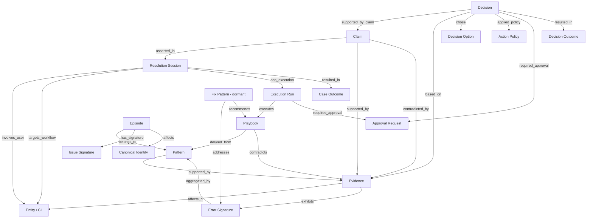
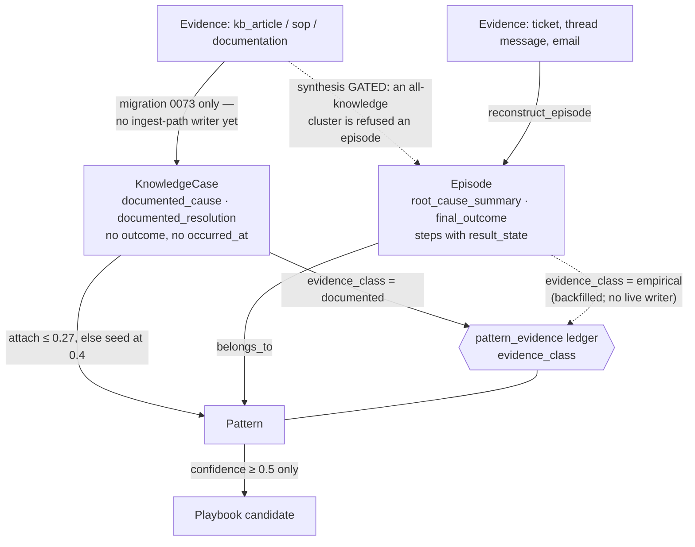
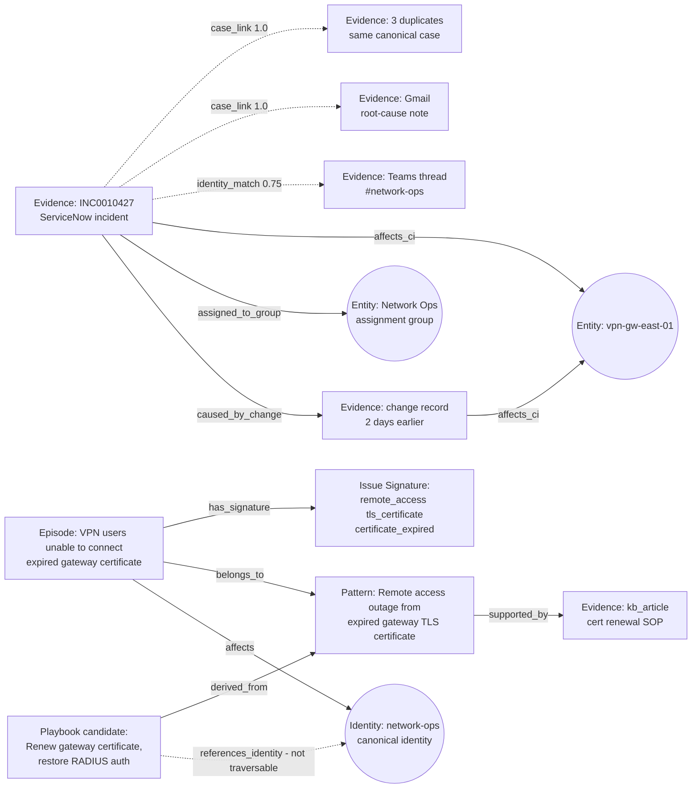
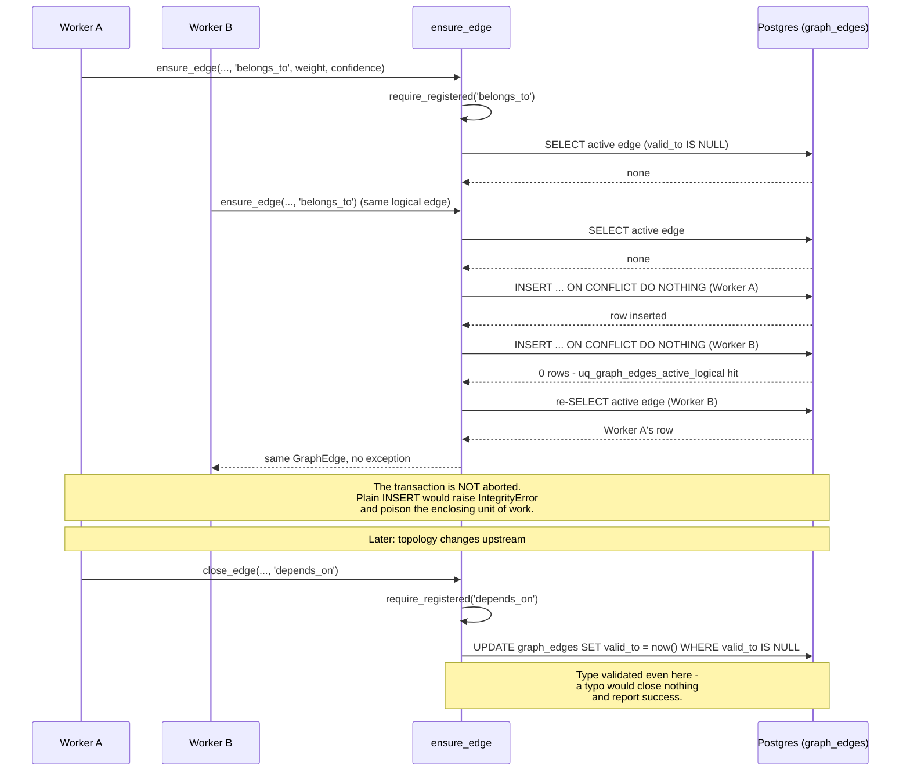

# ContextEdge — Context Graph

## 1. What is a Context Graph?

**What it is:**
A Context Graph is a type of knowledge graph. At its simplest, a graph is made of **nodes** (things) and **edges** (relationships between things). In ContextEdge, a node might be a user, a computer, an error log, or a playbook. An edge might say that the user "owns" the computer, or that the error log "indicates" a specific problem. 

**Why knowledge graphs matter:**
In IT and operations, information is scattered. You have incidents in ServiceNow, issues in Jira Service Management, discussions in MS Teams, root-cause notes in email, and KB articles in whichever system owns them. A knowledge graph links these disconnected pieces into a single web of information. When an incident happens, the graph lets you traverse from a symptom to a root cause, and from a root cause to a known fix.

**How ContextEdge's graph differs from generic knowledge graphs:**
Most knowledge graphs only store facts (like "Server A is in Data Center B"). The ContextEdge graph stores **operational memory** and **reasoning**. It tracks not just what exists, but what happened, why it happened, what decisions were made, and whether those decisions worked. It includes "claims" (hypotheses about what's wrong) and "decisions" (what the AI or human decided to do about it), along with "temporal" awareness (what was true at a specific point in time).

---

## 2. Why ContextEdge Uses a Context Graph

### Business Reasons
- **Faster Resolution:** support teams don't have to manually correlate a ServiceNow incident with a Teams chat and an engineer's email. The graph does it automatically — deterministically where the source systems give it a shared reference, and cautiously scored where they don't.
- **Continuous Learning:** approved episodes become issue signatures, similar episodes become patterns, and patterns become playbook candidates grounded in the SOPs that back them. The next occurrence of the same failure shape arrives with its own precedent already attached.
- **Audit and Governance:** every decision is backed by evidence and policies. If an auditor asks "why did we restart this service?", the graph can point at the evidence it was based on, the options that were considered, the option that was chosen, the policy that was applied, and the approval that gated it.

> **One honesty note on "learning".** The *knowledge* loop above is live: episodes → signatures → patterns → playbooks all run today. The *outcome* loop — "this fix worked, so rank it higher next time" — is only partly live. Decision outcomes and post-action verification are written; the fix-pattern side of it is not, because nothing in the codebase constructs a `FixPattern` row (`codewiki/KNOWN_GAPS.md:10`). Read cohort-level "the system knows which fix works" claims as design intent until Epic B populates that table.
>
> **And a second one on "grounded in the SOPs that back them".** Since migration `0072` the graph distinguishes what *happened* from what a document *says* happens, and stores them in different tables — see §3. That is a correctness win, and it has a counterpart worth saying out loud: on this deployment roughly **55% of knowledge cases seeded a pattern that no incident has ever confirmed**. Those patterns are real rows with real titles; they carry `confidence = 0.4` and `episode_count = 0` and are barred from generating playbooks. Any statement of the form "we have N patterns" needs to say how many of the N anyone has actually seen.

### Technical Reasons
- **Bounded traversal instead of open-ended JOINs:** to answer "all past incidents on the CI mentioned in this ticket", a relational query would chain several joins whose cost depends on how popular that CI is. A graph hop is one indexed query per level, and each level can be capped — this codebase caps at 200 edges per frontier node and 5,000 per hop (`backend/src/contextedge/graph/agent/repository.py:155-157`).
- **A schema that can absorb a new source without a migration:** `graph_edges` stores `(node_type, node_id)` pairs as loose references, so a new connector's relationships become traversable by registering an edge type, not by altering tables. The trade is that referential integrity is *not* enforced by the database on those columns — which is exactly why the edge-type registry in §4 exists.
- **One database, one transaction:** the graph lives beside the relational tables it describes, so a pattern row and its `belongs_to` edges commit or fail together. No sync process to own, and no window where the two stores disagree.

### What problems it solves
- **The "Silo" Problem:** Breaks down barriers between monitoring, ticketing, and chat systems.
- **The "Lost Knowledge" Problem:** Captures implicit operational knowledge (e.g., "whenever Error X happens, Jane always runs Script Y") and formalizes it into patterns and playbooks.
- **The "Hallucination" Problem:** By grounding AI decisions in hard graph links (evidence → claim → decision), it prevents the AI from making up unverified fixes.

---

## 3. Node Types

In ContextEdge, nodes represent the nouns of the system.

Two vocabularies matter here and they are not the same size. The **storage** vocabulary is open — `graph_edges` records `source_node_type` / `target_node_type` as plain strings, so anything with a UUID can be an endpoint. The **agent projection** vocabulary is closed: the `maf.v1` profile lists exactly **20** node types it will hydrate, and anything else is silently not traversed (`backend/src/contextedge/graph/agent/profiles.py:59-87`; the type→ORM-model map is `backend/src/contextedge/graph/agent/hydrators.py:33-54`). Where a node type below is *not* one of the 20, this doc says so.

**One line now runs through the middle of this list, and it is worth stating before the entries.** Three objects look similar and make three different claims:

| Object | The claim it makes | Table |
|---|---|---|
| **Episode** | *this happened, and this is what worked* | `episodes` |
| **Knowledge case** | *a curated source says this is what works* | `knowledge_cases` |
| **Operational situation** | *this is happening right now* | `operational_situations` |

Only the first of the three is a `maf.v1` node type. The knowledge case and the situation are new relational objects (migrations `0072` and `0074`) with no hydrator, so an agent does not see either directly — it sees the KB article the case was built from, and, for situations, nothing at all, because nothing writes them yet. Both are described below anyway, because the graph's shape now depends on the distinction even where the projection does not.

### Evidence
- **What it represents:** A piece of raw information — a ticket description, a chat message, an email, a KB article, an alert rollup.
- **Database table:** `evidence_items` (`backend/src/contextedge/models/evidence.py:48`)
- **Key attributes:** `evidence_type`, `source_type`, `evidence_time`, `relevance_score`, `redaction_status`, `sensitivity_label`, `knowledge_state`, `case_state`, `applicability`, `knowledge_support`, `embedding Vector(3072)`, `chunked_at` / `chunk_count`.
- **When created:** When a connector's sync emits a record and `extraction.normalize_evidence` normalizes it.
- **Who creates it:** `extraction.normalize_evidence` (`backend/src/contextedge/workers/extraction_tasks.py:1398`), on the `extraction` queue.
- **In the projection:** yes. Budgeted by kind — 400 characters of summary for a ticket or chat message, 1,600 for a `kb_article` / `sop` / `documentation` row (caps at `hydrators.py:273-274`), which also carries `knowledge: true` (`hydrators.py:521-522`).

### Evidence chunk
- **What it represents:** One retrievable slice of an evidence item's text, with its own embedding.
- **Database table:** `evidence_chunks` (`models/evidence.py:189`)
- **Key attributes:** `chunk_index`, `chunk_kind`, `text`, `parent_section`, `char_offset_start` / `_end`, `embedding Vector(3072)`, `content_hash`, `chunker_version`.
- **When created:** Right after the parent embedding. Inline chunking needs **two** conditions, not one: the body must be strictly under `INLINE_CHUNK_BUDGET_BYTES = 16 KB` **and** the source type must be in `INLINE_CHUNK_SOURCE_ALLOWLIST` — `jira_sm`, `servicenow`, `gmail`, `teams`, `sapphireims`, `zoho_desk` (`extraction_tasks.py:57, 63-65`, gate at `:102-106`). A short body from a source outside that set still goes async, so an unfamiliar parser can never stall the normalize transaction. Everything else goes to `extraction.chunk_evidence` on the `embedding` queue (`workers/chunk_tasks.py:210`), which hands batches to `extraction.embed_chunks_batch` (`chunk_tasks.py:238`).
- **Who creates it:** the chunker the registry picks for `(source_type, evidence_type)` — document, ticket, thread, attachment, or fallback (`backend/src/contextedge/services/chunkers/registry.py`).
- **In the projection:** **no.** Chunks are a *retrieval* structure, not a graph node. They matter to the graph indirectly: the agent's knowledge seed layer runs its ANN query over chunks and then groups back to one document per best chunk.

### Episode
- **What it represents:** A reconstructed, ordered story of an incident (Observation → Hypothesis → Action → Verification), stitched together from multiple pieces of evidence.
- **Database table:** `episodes` (`backend/src/contextedge/models/episode.py:214`), steps in `episode_steps` (`episode.py:270`), membership in `episode_evidence_links` (`episode.py:301`).
- **Key attributes:** `title`, `status`, `reviewer_state`, `root_cause_summary`, `final_outcome`, `evidence_ids`, `cluster_fingerprint`, `contradictions`, `embedding`, `generation_provenance`, `ai_review`.
- **When created:** After correlation, on a 180-second debounce — `extraction.reconstruct_episode` (`workers/extraction_tasks.py:1498`, `correlation` queue).
- **Who creates it:** the reconstruction task, using the `episode` prompt family (current default **v3**).
- **What can no longer become one:** a cluster made *only* of knowledge. `_cluster_has_observational_evidence` (`workers/extraction_tasks.py:1014-1049`) refuses synthesis when every member's `evidence_type` is in `KNOWLEDGE_EVIDENCE_TYPES` — `kb_article`, `sop`, `documentation` (`services/evidence_typing.py:92`). An episode asserts that something happened; a KB article did not happen. See §3.1 Step 3.
- **Lifecycle:** a new episode is `reviewer_state="pending_review"`. It becomes `approved` either when a human approves it (`POST /api/v1/episodes/{id}/approve` or `/bulk-approve`) or when the hourly AI review sweep is running in `auto_approve` mode and the draft clears both the model's verdict and the deterministic floors. See §3.1 Step 3.
- **In the projection:** yes — and uniquely, **`pending_review` drafts are projectable too**, in a small separate allocation, labelled `[UNAPPROVED DRAFT]` (`hydrators.py:108-115`).

### Knowledge case
- **What it represents:** The reconstruction of *one* curated document — a KB article, an SOP — into the same structured shape an episode has: symptom, cause, resolution, ordered steps, entity refs, applicability. What it does **not** carry is the truth claim. An episode says an engineer did this and it worked; a knowledge case says a document claims this works.
- **Database table:** `knowledge_cases` (`backend/src/contextedge/models/knowledge_case.py:46`), steps in `knowledge_case_steps` (`knowledge_case.py:139`). Migration `0072`.
- **Key attributes:** `source_evidence_id`, `source_kind`, `source_authority`, `source_state`, `title`, `symptom_summary`, `documented_cause`, `documented_resolution`, `validation_guidance`, `entity_refs`, `applicability`, `embedding Vector(3072)`, `migrated_from_episode_id`.
- **What it deliberately does not have,** because every one of these would re-blur the line the table exists to draw: no outcome, no reopen count, no duration, no `occurred_at`, no empirical confidence, and `documented_cause` rather than `root_cause` (`knowledge_case.py:19-25, 92-94`). Its steps have no `failed_flag` / `successful_flag` / `result_state` — a document describes an action to take, not one that was taken (`knowledge_case.py:139-147`).
- **Why a separate table and not `episodes.kind = 'knowledge'`:** with a discriminator column, every query that counts, clusters, scores, reviews or cites an episode is correct only while every author remembers `AND kind = 'observed'`. One forgotten predicate silently reintroduces exactly the contamination the split exists to prevent. A separate table turns that mistake into a missing join, which is loud, instead of a wrong number, which is not (`knowledge_case.py:10-17`).
- **One case per source document,** enforced by `uq_knowledge_case_source` (`knowledge_case.py:127-136`). An article reconstructed twice is a duplicate, not a second opinion.
- **When created:** today, **only by migration `0073`**. There is no `KnowledgeCase(...)` constructor anywhere under `backend/src/contextedge` and no ingest-path writer, so a KB article synced this morning gets an evidence row, chunks, an embedding and graph edges — and no case. Treat the table as populated-by-backfill, not as a live pipeline.
- **In the projection:** **no.** `knowledge_case` is not one of the 20 `maf.v1` node types and has no hydrator. What an agent sees is the underlying `kb_article` evidence item, at 1,600 characters with `authority: "documented procedure"`.

### Issue signature
- **What it represents:** A generalized problem fingerprint distilled from an approved episode: "what capability broke, in what component, in what way". Broader than an error signature's exact error text, narrower than embedding similarity.
- **Database table:** `issue_signatures` (`backend/src/contextedge/models/issue_signature.py:31`), joined to episodes by `episode_issue_signatures` (`issue_signature.py:67`).
- **Key attributes:** `signature_key` (unique per tenant), `affected_capability`, `failing_component`, `failure_mode`, `trigger_change`, `environment`, `scope`, `episode_count`.
- **When created:** One LLM call per episode *approval* — task `evaluation.extract_issue_signature` (`backend/src/contextedge/workers/signature_tasks.py:24`, `evaluation` queue).
- **Who creates it:** `services/issue_signature_service.extract_issue_signature`.
- **In the projection:** yes, added deliberately — signature-first entry (symptom → signature → episode history) is how an experienced engineer works, and until this node type shipped the tenant's 50+ populated signatures were invisible to the agent (`profiles.py:80-85`).

### Error signature
- **What it represents:** A deterministic regex fingerprint of an error string seen in evidence — no LLM involved.
- **Database table:** `error_signatures` (`backend/src/contextedge/models/error_signature.py:40`)
- **Who creates it:** `services/error_signature_service.py`, at normalization time.
- **In the projection:** yes; reached by the `exhibits` edge from evidence.
- **Caveat worth knowing:** `IssueSignature.error_signature_id` exists as a column but **nothing writes it** (`models/issue_signature.py:49-53` versus the only constructor at `services/issue_signature_service.py:168-177`). Deterministic error signatures and LLM issue signatures are two parallel, currently unjoined systems.

### Pattern
- **What it represents:** A recurring operational issue, synthesized from one or more similar episodes.
- **Database table:** `patterns` (`backend/src/contextedge/models/pattern.py:24`), membership in `pattern_evidence_links` (`pattern.py:61`).
- **Key attributes:** `title`, `pattern_type`, `confidence`, `episode_count`, and the JSONB enrichment fields `trigger_conditions` / `core_entities` / `observed_errors` / `root_causes` / `resolution_steps` / `evidence_summary`, plus `generation_provenance`.
- **When created:** `pattern.cluster_episodes` (`backend/src/contextedge/workers/pattern_tasks.py:422`, `pattern` queue), dispatched after episode approvals or run manually. See §3.1 Step 5. **A second origin now exists:** `services/knowledge_case_service.attach_case` seeds a pattern from a knowledge case when no existing pattern covers the document, at `DOCUMENTED_ONLY_PATTERN_CONFIDENCE = 0.4` with `episode_count = 0` (`knowledge_case_service.py:55, 217-234`).
- **Who creates it:** `services/pattern_service.create_pattern_from_episodes`, or `knowledge_case_service.attach_case` for the documented-only seed.
- **In the projection:** yes. Note that a documented-only pattern is projectable like any other, and carries `generation_provenance.support = "documented_only"` — read that field before treating a pattern as something anyone has ever observed.

### Pattern evidence (the support ledger)
- **What it represents:** *Why* a pattern believes what it believes, one row per contributor. `pattern_evidence_links` records **that** an episode belongs to a pattern; `pattern_evidence` records what a contribution is worth and on what epistemic footing.
- **Database table:** `pattern_evidence` (`backend/src/contextedge/models/pattern.py:87`). Migration `0072`.
- **Key attributes:** `(evidence_object_type, evidence_object_id)` — polymorphic on purpose, because the set of contributors is expected to grow — plus `support_role` (`supports_resolution`, `contradicts_resolution`, …), `evidence_class` (`empirical` | `documented` | `prescriptive` | `conversational` | `inferred`), `strength`, `confidence`, `observed_at`, `outcome`.
- **The invariant, and it lives in the database:** `ck_pattern_evidence_empirical_is_episode` (`pattern.py:177-181`; `alembic/versions/0072_knowledge_case_and_pattern_evidence.py:222-226`) allows `evidence_class = 'empirical'` **only** when `evidence_object_type = 'episode'`, and allows a non-NULL `outcome` only on empirical rows. A documented claim cannot become an observed success because some later code path set a field.
- **Why it exists:** a pattern supported by three KB articles and a pattern supported by nineteen resolved incidents are not the same pattern, and one `episode_count` cannot tell them apart. With the ledger, `pattern_support()` (`services/knowledge_case_service.py:246-301`) reads it back by class and returns one of three words a reviewer can act on — `empirically_supported`, `documented_only`, `unsupported`.
- **Honest state:** the only inserter in the codebase is `_record` in `knowledge_case_service` (`:116-141`), which always writes `evidence_class = 'documented'`. Nothing appends an empirical row as episodes arrive. The empirical rows on this deployment (1,416 of them) were backfilled operationally from existing episode links, so the `documented_only` → `empirically_supported` graduation the ledger was built for cannot happen on its own yet.
- **In the projection:** **no** — it is a relational ledger, not a node type and not an edge type.

### Playbook
- **What it represents:** Official, ordered steps to resolve a specific issue.
- **Database table:** `playbooks` (`backend/src/contextedge/models/playbook.py:49`), versions in `playbook_versions` (`playbook.py:126`), evidence provenance in `playbook_evidence_links` (`playbook.py:178`).
- **Key attributes:** `title`, `stable_key`, `lifecycle_state`, `risk_tier`, `automation_mode`, `embedding`, `current_version_id`.
- **When created:** Generated from a pattern by `pattern.generate_playbook_candidate` (`workers/pattern_tasks.py:446`), or generated on demand by `POST /api/v1/playbooks/generate`, or authored by a human. A generated candidate lands `lifecycle_state="candidate"`, `automation_mode="suggest_only"`.
- **In the projection:** yes, but only when it is `approved`, has a current version, is unexpired, and sits within the caller's risk cap (`hydrators.py:143-149`).

### Decision
- **What it represents:** An operational choice made during an incident, by a human or by an agent.
- **Database table:** `decisions` (`backend/src/contextedge/models/decision.py:76`), options in `decision_options` (`decision.py:176`), outcomes in `decision_outcomes` (`decision.py:209`).
- **Key attributes:** `decision_intent`, `risk_level`, `policy_result`, `approval_required`, `status`, `human_override`, `context_snapshot`, `embedding`.
- **When created:** `services/decision_trace_service.create_decision` — from the reviewer console, from execution gating, or from a MAF agent's `after_run` write-back.
- **In the projection:** yes, **except** when superseded, reverted, or a pending AI-authored decision. That last exclusion is the anti-echo-chamber rule: agent output must not launder itself into agent input (`hydrators.py:172-180`).

### Session
- **What it represents:** A specific support case being actively worked on.
- **Database table:** `resolution_sessions` (`backend/src/contextedge/models/session.py:12`); its audit trail is `decision_trace_events` (`session.py:102`).
- **Key attributes:** `case_number`, `case_type`, `issue_type`, `status`.
- **In the projection:** yes.

### Entity
- **What it represents:** An operational noun — a configuration item (`vpn-gw-east-01`), a business service, an assignment group, a workflow, a Zoho product or team.
- **Database table:** `entities` (`backend/src/contextedge/models/entity.py:66`)
- **Key attributes:** `entity_type`, `external_system`, `external_id`, `name`, `attributes` JSONB, `last_synced_at`.
- **When created:** By each connector's reference-enrichment service during correlation (ServiceNow `cmdb_ci` / `assignment_group`, Jira components and services, Zoho products / teams / categories), and by `cmdb_topology_service` write-through caching a live ServiceNow lookup.
- **In the projection:** yes; hydration surfaces selected `attributes` keys only — `criticality`, `support_group`, `ci_class`, `monitoring_sources`.
- **On this deployment, none of those attributes are populated.** Only `zoho_desk` is connected, so all **849** entity rows are `topic` or `knowledge_category` — no configuration items, no business services, no assignment groups, and no topology edges between them. The ServiceNow and Jira enrichment paths above are written and simply not turned on here; read them as the shape, not the contents. See §4 and §13.

### Claim
- **What it represents:** A hypothesis or assertion, like "The RADIUS service did not restart cleanly."
- **Database table:** `claims` (`backend/src/contextedge/models/claim.py:58`)
- **Key attributes:** `claim_type`, `claim_text`, `validation_status`, `confidence`.
- **In the projection:** yes, but only when `validation_status` is `machine_verified` or `human_validated` (`hydrators.py:167-171`).
- **Caveat:** `claim_service` creates claims, but **nothing constructs `claim_evidence` or `decision_claims`**, and nothing moves a claim past `unverified` — so the validation lifecycle is currently unreachable (`codewiki/KNOWN_GAPS.md:11`). Read the claim chain as designed, not exercised.

### Policy (TenantPolicy / ActionPolicy)
- **What it represents:** Rules governing actions — "restarting a production DB requires L2 approval".
- **Database tables:** `tenant_policies` (`backend/src/contextedge/models/policy.py:34`), `action_policies` (`backend/src/contextedge/models/action_policy.py:55`). Every evaluation is appended to `policy_checks` (`policy.py:82`), keyed to the policy **version** so a later edit cannot rewrite what a past run was judged under.
- **Who creates it:** human administrators, through `/api/v1/action-policies` and the tenant-policy surface.
- **In the projection:** both types, yes.

### Identity
- **What it represents:** A person or system actor, resolving aliases ("J. Smith" and "jsmith" are the same person).
- **Database table:** `canonical_identities` (`backend/src/contextedge/models/episode.py:49`), aliases in `identity_aliases` (`episode.py:92`), evidence links in `evidence_identity_links` (`episode.py:153`).
- **In the projection:** the identity **node** is projectable, and so is the `affects` edge an episode writes to it (`builder.build_episode_graph`). The two hub edges are what is deliberately **excluded** from `maf.v1` traversal — `mentions_identity` (evidence → identity) and `references_identity` (pattern/playbook → identity), whose measured fan-out of 40-70 edges per handful of tickets would spend the whole budget on identity hubs (`backend/src/contextedge/graph/edge_types.py:161-167`).

### Contradiction
- **What it represents:** A detected conflict between an approved playbook and reality — the playbook says do X, recent evidence shows X failing.
- **Database table:** `contradictions` (`backend/src/contextedge/models/pattern.py:203`); scan bookkeeping in `contradiction_scan_state` (`pattern.py:221`).
- **When created:** By the `evaluation.scan_contradictions_task` beat sweep, every 12 hours.
- **In the projection:** **no** — `contradiction` is not one of the 20 `maf.v1` node types. What the agent sees instead is the `contradicts` **edge** from the playbook to the offending evidence (`backend/src/contextedge/graph/builder.py:290-325`), which is traversable and carries a 0.95 relationship factor on `contradicted_by`.

### Operational situation — **schema only**
- **What it represents:** One bounded real-world occurrence that is *still unfolding*. An episode says what happened and what worked; a knowledge case says what a source claims works; a situation says what is happening now.
- **Database tables:** `operational_situations` (`backend/src/contextedge/models/situation.py:118`), `situation_evidence_memberships` (`:226`), `situation_entity_impacts` (`:317`), `situation_change_candidates` (`:379`). Migration `0074`.
- **It is not a renamed `CorrelationEdge`.** A correlation edge says *these two pieces of evidence appear related*. A situation says *these many signals collectively describe one occurrence*, which is a stronger claim about the world and therefore a different object (`situation.py:18-21`; `graph/edge_types.py:137-140`). And it is not an episode: a situation may exist while nothing is resolved, and must not become an episode merely by existing — an episode needs a resolution to reconstruct (`situation.py:13-16`).
- **Two invariants the database enforces, not a service:**
  - `ck_change_after_onset_not_causal` (`situation.py:455-459`) refuses `suspected` / `corroborated` / `confirmed` on a change whose `temporal_relation` is `after_onset`. A change that happened after onset cannot have caused it — but it can still be `remediation` or `rollback`, so the status *set* is narrowed rather than the row rejected.
  - `ck_situation_merged_has_target` (`:218-222`) makes `state = 'merged'` and `merged_into_situation_id` inseparable in both directions. Merged rows are never deleted; they are how "why did these two become one" stays answerable.
- **`fingerprint` is deliberately NOT unique** (`:187-191`) — it is a lookup and duplicate-suppression key, not identity. The same service can fail twice in one window for unrelated reasons.
- **`healthy_control` is a first-class impact role** (`:89-98`), because what appears fine narrows a root cause as much as what is broken; and impacts carry `signal_observed_at` (`:346-352`), because "database healthy" is useful at two minutes old and dangerous at eight hours.
- **In the projection:** there is no `situation` node type in `maf.v1` (the list is still exactly 20, and `situation` is not on it), so even the four traversable situation relations in §4 have no hydratable endpoint today.
- **State it plainly: nothing writes any of this.** `OperationalSituation` and its three companions are referenced by exactly two files under `backend/src` — `models/situation.py` and `models/__init__.py` — plus one schema test, `tests/test_situation_model.py`. No service creates a situation, scores a change candidate, merges two situations, or writes any of the seven registered edges. The tables are empty. Everything above describes what the database *will* enforce when something writes to it.

### Execution run, approval request, case outcome, fix pattern
These four are projectable node types too (`profiles.py:59-87`) and are covered in [09 MAF](./09_Microsoft_Agent_Framework_MAF.md) §11. One honest caveat: **`fix_patterns` has no constructor anywhere in the codebase** — it is read in five services and written by none — so the `validated_fix` / `invalidated_fix` learning loop is dormant rather than merely unexercised (`codewiki/KNOWN_GAPS.md:10`).

---

## 3.1 How ContextEdge Builds Knowledge (Step by Step)

Think of ContextEdge like a detective who reads thousands of incident tickets, finds which problems keep repeating, and writes a manual so the next person can fix it faster.

We will follow **one** incident the whole way through — the same Acme VPN incident used in every ContextEdge doc, so you can trace one record end to end.

> **The Acme VPN incident.** Tenant **Acme Corp** runs ServiceNow, MS Teams, and Gmail. On the morning of the outage, remote users stop being able to connect through `vpn-gw-east-01`. ServiceNow raises **INC0010427**; three more people file duplicates; engineers argue in a Teams channel; and an engineer emails a root-cause note. The cause turns out to be an expired TLS certificate on the gateway, and the fix is to renew the certificate and restart RADIUS.

Here is how it works, step by step.

---

### Step 1: Evidence Collection, Normalization & Storage

**What happens here?**
ContextEdge connects to your company's tools and pulls in raw data automatically. Each piece of raw data becomes an **Evidence Item**.

**Which connectors actually exist today** (`backend/src/contextedge/connectors/registry.py`, `_register_connectors`): **MS Teams, Gmail, ServiceNow, Jira Service Management, ManageEngine ServiceDesk Plus, SapphireIMS, and Zoho Desk** — seven. The source picker renders from the same registry rather than a hand-written list, so a connector cannot exist without being offerable, and a label cannot claim a connector that does not exist. Confluence, SharePoint, and Exchange appear in the catalog marked `planned`: the API accepts the type and creating one succeeds, but sync would fail.

**What arrives for Acme:**

| Tool | What gets created | Example |
|------|------------------|---------|
| ServiceNow | The incident record | `INC0010427 — "Remote users cannot connect to VPN"` |
| ServiceNow | Three duplicate incidents | filed by three different people over 40 minutes |
| MS Teams | A channel discussion | `#network-ops — "anyone else seeing vpn-gw-east-01 refuse auth?"` |
| Gmail | An engineer's root-cause note | `"cert on vpn-gw-east-01 expired at 06:00 UTC; renewed + restarted radiusd"` |

**What normalization actually does** — `extraction.normalize_evidence` (`backend/src/contextedge/workers/extraction_tasks.py:1398`), on the `extraction` queue:

1. **The raw payload is stored first**, in `raw_evidence_objects`. If the JSON is larger than `OFFLOAD_THRESHOLD_BYTES = 32,768` it is written to MinIO object storage and the database row keeps a **stub** plus an `object_storage_key` (`backend/src/contextedge/services/ingestion_persistence.py:16, 85`). Downstream readers call `load_raw_payload`, which transparently re-reads from MinIO. **This has a consequence worth remembering:** any SQL query that filters on `raw_payload->>'...'` silently skips the biggest records, so one-off backfill scripts written that way quietly miss the longest articles and the richest tickets (`codewiki/KNOWN_GAPS.md:36`).
2. **Redaction** runs before anything else reads the text — email addresses, phone numbers, card numbers, AWS keys, private-key blocks.
3. **Relevance classification** runs inline, before embedding. An item scored `not_relevant` at confidence ≥ 0.75 skips the whole downstream LLM fan-out. This ordering is deliberate cost control: classify first, then spend.
4. **The parent embedding** is written to `evidence_items.embedding` (3,072 dimensions).
5. **Chunking** runs after the parent embedding, so a chunker bug can never regress parent-embedding retrieval. Bodies under `INLINE_CHUNK_BUDGET_BYTES = 16 KB` are chunked inline (`extraction_tasks.py:57, 102-106`); anything larger is handed to `extraction.chunk_evidence` on the dedicated `embedding` queue (`workers/chunk_tasks.py:210`), which batches embeddings through `extraction.embed_chunks_batch` (`chunk_tasks.py:238`). The registry picks a chunker per `(source_type, evidence_type)`: heading-aware for KB articles and documents, ticket-aware (metadata overlay, comment vs body) for tickets, quote-stripping for email threads, sniffing for attachments, and a plain 1,500-character sliding window with 150 characters of overlap as the fallback.
6. **Correlation and baseline** tasks are dispatched **after the commit**, onto the `correlation` queue.

So the engineer's email does not enter the graph as one 40 KB blob. It enters as an evidence row with its own embedding, plus a handful of `evidence_chunks` — one per paragraph-ish slice, each independently searchable, each carrying a `parent_section` breadcrumb back to where it came from.

**In simple words:** Evidence = the raw proof that something happened, cleaned up, fingerprinted, and cut into retrievable slices. Like collecting witness statements at a crime scene, then indexing them by paragraph.

---

### Step 2: Correlation — deciding what belongs together

**What happens here?**
ContextEdge now has one incident, three duplicates, a Teams thread, and an email. They are about the same event. `extraction.correlate_evidence` (`backend/src/contextedge/workers/correlation_tasks.py:16`) decides that, in two tiers.

**Tier 1 — deterministic case links, confidence 1.0.** The service extracts `(system, external_id)` keys: the record's own external id, its thread, ServiceNow's typed reference fields (`problem_id`, `rfc`, `caused_by`, `parent_incident`), Jira linked-issue keys, Zoho related tickets. Each key resolves to a `canonical_case_id`; the first existing link wins the case id. So all four ServiceNow records land under one canonical case regardless of the order they were ingested.

Separately, conversational sources get **ticket-number bridging**: a Teams message or email that quotes `INC0010427` gets an `evidence_case_memberships` row pointing at that case — 0.98 confidence from a subject line, 0.9 from a body. This is the mechanism that puts Acme's email in the incident's cluster deterministically rather than hoping the embeddings agree.

Two guards are worth knowing because they prevent large, silent damage:
- **CI and assignment-group references are never case-link keys.** If they were, every incident touching `vpn-gw-east-01` would merge into one giant case.
- **A message quoting three or more distinct cases** is a digest, and its memberships drop to `mentioned_only` at 0.5 — a relationship type the episode cluster resolver refuses to expand through.

**Tier 2 — identity co-occurrence, gated and scored** (`backend/src/contextedge/services/correlation_service.py:38-50`). Only `resolved` or `verified`, active identities count. Constants: a 7-day window (`IDENTITY_CORRELATION_WINDOW`, line 38) with **fail-closed** behavior on missing timestamps; identities appearing on 200+ evidence rows are hubs and carry **zero** signal (`HUB_DEGREE_MIN`, line 48); a rare non-person entity (degree ≤ 5) is worth 0.75 (`RARE_ENTITY_CONFIDENCE`, line 49), a common one 0.65 (line 50), +0.1 when two or more non-hub identities are shared, capped at 0.85. **A single shared person never links two incidents** — two engineers touching two tickets is not evidence the tickets are related.

There is also a veto: if both items already hold *anchor* case memberships in **disjoint** case sets, the identity correlation is deleted and `correlation.conflicting_ticket_veto` is logged. Same infrastructure, different incidents.

Each accepted pair writes a `correlation_edges` row. Edges are created once and never upgraded, and when both tiers matched, the case-link tier wins with `correlation_type="case_link_match"` at confidence 1.0.

**For Acme:** the email quoting INC0010427 lands next to the incident at 1.0 via the ticket-number bridge. A Teams message that only says `vpn-gw-east-01` correlates at 0.75, because the gateway is a rare non-person entity.

---

### Step 3: AI Episode Reconstruction, and its review gate

**What happens here?**
Correlation produced a web of related evidence. Reconstruction turns it into one ordered story: an **Episode**.

**The debounce.** When correlation creates at least one edge, it schedules `extraction.reconstruct_episode` with a **180-second countdown** (`RECONSTRUCT_DEBOUNCE_SECONDS`, `workers/extraction_tasks.py:765`). At run time the task re-checks whether the cluster went quiet; if more evidence arrived inside the window it defers **on SQL alone, spending no LLM call**, and the later-scheduled task takes over. A channel that never goes quiet still gets narrated within `MAX_SYNTHESIS_DELAY_SECONDS = 1,800` of its oldest evidence (line 853). Duplicates arriving over 40 minutes therefore cost one synthesis, not four.

**Cluster resolution before any model sees anything.** `resolve_episode_cluster` materializes the connected component over case links and correlation edges, with hard fences: `MAX_CLUSTER_SIZE = 50`, `MAX_HOPS = 3`, and a `CLUSTER_TIME_WINDOW` of 30 days from the nearest seed (`backend/src/contextedge/services/episode_cluster_service.py:47-49`). Legal-hold and pending-redaction evidence is excluded in SQL, not filtered afterwards. The member set is hashed into a `cluster_fingerprint`, which powers two things: the same cluster never produces a duplicate draft, and a pending draft whose evidence is a strict subset of a newer cluster is marked `superseded`.

**Automatic synthesis floors.** A cluster under `MIN_AUTO_SYNTHESIS_CLUSTER = 3` members is not narrated automatically (line 775), and re-synthesis needs the cluster to be at least 50% larger than the biggest already-covered episode (`MIN_RESYNTHESIS_GROWTH = 0.5`, line 793). Both exist because episode synthesis is the single largest LLM cost line in the system.

**And one gate about *what an episode is allowed to claim*.** An episode is an account of something that happened. A cluster made only of knowledge — KB articles, SOPs, documentation — is not that. Narrating one turns *"this article claims X resolves it"* into *"an engineer did X and it worked"*, and everything downstream reads the second sentence: the playbook prompt treats episode outcomes as empirical evidence that a step works, pattern clustering counts them as recurrence, and the agent cites them as `[ep-N]`.

`_cluster_has_observational_evidence` (`workers/extraction_tasks.py:1014-1049`) asks the only question that matters — does this cluster contain any evidence type that is not knowledge? — and the caller refuses synthesis when the answer is no (`extraction_tasks.py:1219-1230`, returning `skipped_knowledge_only_cluster`). Four things about it are worth knowing:

- **It is placed late, on purpose — sixth of seven gates.** Every cheaper exit runs first: too small (`:1073`), no resolution signal (`:1090-1114`), advisory lock lost (`:1116-1137`), unsettled debounce (`:1139-1174`), duplicate fingerprint (`:1176-1193`). Only the re-synthesis growth check sits between it and the model call (`:1249`), so only a cluster that would otherwise go on to spend an LLM call ever pays for the query.
- **It fails OPEN on every non-answer** — an empty id list, a database error, a NULL evidence type, a row set containing no real type strings (`:1027-1048`). The docstring states the trade: wrongly allowing synthesis costs one reviewable draft; wrongly blocking it costs a real incident that silently never becomes an episode.
- **Only synthesis is gated.** Knowledge still correlates, still embeds, still reaches the graph through its edges, and still seeds patterns. Nothing about a KB article's participation changed except that it can no longer, alone, be narrated as an event.
- **One narrow seam, so it is not discovered later.** `KNOWLEDGE_EVIDENCE_TYPES` holds three types, while migration `0073`'s own SQL joins on four, adding `runbook` (`0073_migrate_knowledge_episodes_to_cases.py:136`). `runbook` is a type an uploader may declare (`services/evidence_typing.py:104-114`), so a cluster made only of runbooks passes this gate and still becomes an episode. Nobody has uploaded one on this tenant, which is why it has not bitten.

It was found at a scale nobody expected: **299 episodes had all-knowledge evidence**, 8 of them predating the knowledge backfill that took this corpus from 53 articles to 629 — so the bug predates the backfill and was simply too rare to notice. Those rows were migrated out by `0073`; see Step 5.

> **One seam this opens, stated now rather than discovered later.** An all-knowledge cluster is correctly refused an episode, and **nothing is created in its place**. The object that should catch it — a `KnowledgeCase` — has no ingest-path writer yet. So a KB article ingested today contributes an embedding and graph edges, and no structured reconstruction at all.

**What comes out for Acme:**

```
Episode: "VPN users unable to connect — expired gateway certificate"
reviewer_state: pending_review
cluster_fingerprint: sha256(...)

Root cause:
  The TLS certificate on vpn-gw-east-01 expired at 06:00 UTC. RADIUS
  authentication began rejecting sessions. Renewing the certificate and
  restarting radiusd restored service.

Evidence (5 items):
  ├── ServiceNow INC0010427  (the incident of record)
  ├── ServiceNow INC0010431/32/33  (duplicates, same canonical case)
  ├── Teams #network-ops thread  (working discussion)
  └── Gmail root-cause note  (external communication)
```

**Then it needs approval — and there are exactly three ways that happens.**

The review mode is one setting, `episode_ai_review`, with exactly three legal values — `off`, `advisory`, `auto_approve` (`backend/src/contextedge/config.py:185-187`). Default is `off`.

1. **A human approves it.** `POST /api/v1/episodes/{id}/approve` or `/bulk-approve` (role `knowledge_manager`) sets `status` and `reviewer_state` to `approved` with the reviewer's user id recorded.
2. **Advisory mode.** The hourly sweep `evaluation.ai_review_episodes` (`backend/src/contextedge/workers/evaluation_tasks.py:129`, `evaluation` queue) asks a model to judge each pending draft and **stamps the verdict onto `episodes.ai_review`** — verdict, confidence, reasons, prompt version, mode, `auto_approved`, `failed_floors`, `reviewed_at`. Nothing is approved. A reviewer sees the opinion in the console and decides.
3. **Auto-approve mode.** Same sweep, but a draft that clears **both** the model's verdict **and** a set of deterministic floors is approved with `reviewer_user_id` left **NULL** — permanently distinguishable from a human approval, forever, in the data. A per-dispatch override can only ever *downgrade* auto-approve to advisory; it can never escalate (`evaluation_tasks.py:174-181`).

The sweep also defers a whole tenant while it is mid-ingest — more than 50 new evidence rows or more than 30 new episodes in the last 10 minutes means "come back next hour" rather than reviewing a moving target. And it commits **per episode before dispatching anything**, so one deadlock cannot re-cost fifty LLM calls.

> **A note on terminology, because it comes up.** You may see the string `bulk_content_gate` in `episodes.ai_review` on some rows in a live database. That is **not a code path and not a review mode.** It is a marker written by a one-off operational DB script on 2026-08-19. The code's modes are exactly `off` / `advisory` / `auto_approve`.

---

### Step 4: Issue signatures and recurrence

**What happens here?**
The moment an episode is approved — by any of the three routes above — one LLM call distills it into a generalized problem fingerprint. Task: `evaluation.extract_issue_signature` (`backend/src/contextedge/workers/signature_tasks.py:24`, `evaluation` queue).

For Acme, the model is asked to describe the problem *without* device names, hostnames, ticket numbers, or people, and returns roughly:

```json
{
  "affected_capability": "remote_access",
  "failing_component":   "tls_certificate",
  "failure_mode":        "certificate_expired",
  "trigger_change":      null,
  "environment":         "production",
  "scope":               "service_wide",
  "confidence":          0.86
}
```

which slugs into the key `remote_access|tls_certificate|certificate_expired`. If a signature with that key already exists for the tenant, its `episode_count` increments instead of a second row being created.

**Recurrence.** When the signature already existed, the service links the *new* episode's first evidence item to the *previous* occurrence's case, as an `evidence_case_memberships` row with `relationship_type="recurrence"` at confidence 0.6. Six months later, when the certificate on that gateway expires again, the new episode gets a low-confidence pointer back to INC0010427.

**The load-bearing rule:** `recurrence` means *similar problem, never the same occurrence*. The episode cluster resolver explicitly refuses to expand through `recurrence` (and `mentioned_only`) memberships. It exists for precedent retrieval — so an engineer or an agent can find "we have seen this shape before" — not for merging clusters.

Dispatch is deliberately **commit-then-dispatch**: the approval is committed before the task is queued, because the task no-ops without retry on an episode that is not yet approved. If the broker is down, the failure is logged and the approval still succeeds; the next hourly sweep re-dispatches for up to 20 auto-approved episodes that are missing a signature.

---

### Step 5: Pattern Detection

**What happens here?**
Over weeks and months, similar incidents pile up. `pattern.cluster_episodes` (`backend/src/contextedge/workers/pattern_tasks.py:422`, `pattern` queue) asks, per episode: *have I seen this shape before?*

**What triggers it — and what does not.** There is **no Celery Beat entry for pattern clustering**; verified by reading the whole beat schedule. It runs when:
1. an episode is approved through the API (`/episodes/{id}/approve` or `/bulk-approve`) — one dispatch per affected domain, after commit;
2. the hourly AI review sweep auto-approved something — again one dispatch per domain that had approvals, because passing `None` would cluster only the NULL-domain episodes and on a live graph every episode is domain-scoped;
3. an operator calls `POST /api/v1/patterns/cluster` (role `domain_admin`).

**Domain scoping is strict.** A domain pass sees only that domain's episodes; the global pass sees only tenant-global ones. NULL-domain episodes are deliberately not folded into domain passes, because whichever pass ran first would capture them arbitrarily — which is how domain B's episode text once ended up inside domain-A-visible pattern content.

**The mechanism, per candidate episode** (`pattern_tasks.py` `_cluster`):
- **Repair pass first.** Any approved episode with a NULL embedding gets `title + "\n\n" + root_cause_summary` embedded, per-episode fail-soft. Without an embedding, an episode is invisible to everything below.
- **Existing-pattern probe.** Take the pattern that owns the **single nearest** member episode within `PATTERN_MATCH_MAX_DISTANCE = 0.30` cosine distance, in the same scope (`pattern_tasks.py:50, 243-257`). The `ORDER BY distance` is the load-bearing part: without it, `LIMIT 1` returned an arbitrary qualifying pattern, and because everything in this corpus is an AutomationEdge support incident the embeddings bunch — 0.35 is roughly the 10th percentile of the distance between two *random* episodes, so the old gate admitted nearly everyone and then handed the validator a near-random pattern. Asking about the nearest one instead took the validator's accept rate from 12% to 40% on the same corpus. If a candidate is found, a second LLM call (`validate_pattern_match`) adjudicates whether it is really the same pattern. It is **fail-open**: if the model is unreachable or the tenant is over budget, the answer defaults to "match, confidence 0.75" and the embedding probe alone decides (`ai/extractors/pattern_extractor.py:108-112`).
- **New cluster.** Otherwise, gather the episode's neighbors within the tighter `CLUSTER_GROUP_MAX_DISTANCE = 0.27` — approved, embedded, unlinked, same scope (`pattern_tasks.py:60, 299-312`). That number was measured, not assumed: at 0.20 (the old value, below the random-pair 1st percentile) 126 of 150 probed episodes could group with nothing and became single-episode "patterns"; at 0.40 the corpus collapses into one blob. 0.27 is the knee — real groups of about four, no runaway merge. An empty neighborhood is still fine: a single strong episode can seed a pattern.
- **Synthesis.** One LLM call (`synthesize_pattern`, prompt family `pattern`, current default v2) reads each episode's title, root cause, outcome, and first five steps, and returns the pattern's title, description, triggers, entities, observed errors, root causes, resolution steps, and confidence. If synthesis fails for any reason, a **fallback pattern** is still created — titled `"Auto: <episode title>"` at confidence 0.75, with no synthesized fields and NULL provenance. The pattern forms; the enrichment does not.
- A returned title containing "no incident" / "no pattern" / "no operational pattern" / "no recurring pattern" is treated as a refusal and nothing is persisted.
- Each run processes at most 100 candidate episodes.

**For Acme**, six certificate-expiry episodes across four gateways over a year converge on one pattern:

```
Pattern: "Remote access outage from expired gateway TLS certificate"
pattern_type: recurring_issue
confidence: 0.88
episode_count: 6

trigger_conditions: ["certificate reaches expiry", "no renewal automation on the gateway"]
core_entities:      ["vpn gateway", "tls certificate", "radius"]
observed_errors:    ["authentication rejected", "tls handshake failure"]
root_causes:        ["gateway certificate expired"]
resolution_steps:   ["confirm certificate expiry", "renew certificate",
                     "install on gateway", "restart radius", "verify a test login"]
```

Persistence writes a lot more than the row: `pattern_evidence_links` membership, `episode -belongs_to-> pattern` edges, `episode -affects-> identity` edges, and virtual enrichment nodes for each trigger / entity / error / root cause, each edged to the pattern at weight 1.5. It then **auto-enqueues playbook generation — after the commit**, through `services/deferred_dispatch.dispatch_after_commit` (`services/pattern_service.py:192-194`). That indirection is not decoration: `create_pattern_from_episodes` does not own its transaction, so dispatching inline sent the task while the pattern was still invisible to every other connection. Both ends of that went wrong live — a rolled-back clustering pass left 65 queued tasks naming patterns that never existed, and on the success path a worker reading too early got "pattern not found" and returned `skipped`, so a real pattern silently never got its playbook. `add_episode_to_pattern` follows the same rule when a new member arrives (`pattern_service.py:247-249`).

**The other way into a pattern: documented knowledge.** Clustering above is the *empirical* route — episodes converge, a pattern forms. Since migration `0072` a pattern can also come from a document, through `services/knowledge_case_service.attach_case`.

Knowledge cases deliberately do **not** cluster with each other. Two incidents are similar because they happened similarly; two articles are similar because someone wrote them similarly, and 600 articles behaving like 600 incidents is precisely the failure the observed/documented split exists to avoid (`knowledge_case_service.py:3-8`). So a case looks for a **pattern** instead, and there are exactly two outcomes:

- **Attach.** `_nearest_pattern` (`:58-113`) measures the case's embedding against pattern *member episodes* — patterns carry no embedding of their own — and takes the closest, `ORDER BY distance` (the ordering that clustering had to learn the hard way). Attachment needs distance ≤ `KNOWLEDGE_ATTACH_MAX_DISTANCE = 0.27` (`:49`), **tighter** than clustering's own `PATTERN_MATCH_MAX_DISTANCE = 0.30`, and the reason is asymmetric cost: a wrong attachment puts a document behind a procedure it does not describe, and the playbook generator will cite it. Distance is then adjudicated by the same `validate_pattern_match` call clustering uses (`:169-196`) — distance can say "same subject", it cannot say "this document describes this pattern's problem". A validation failure falls back to distance rather than blocking.
- **Seed.** When nothing covers the document, the case seeds a new pattern at `DOCUMENTED_ONLY_PATTERN_CONFIDENCE = 0.4` with `episode_count = 0` — "nothing has happened; this is not false modesty" (`:217-234`). That 0.4 sits deliberately below the **0.5** playbook-generation floor (`workers/pattern_tasks.py:34`, checked at `:487`), so **a documented-only pattern generates no playbooks** until a real incident lifts it. This is the cold start: a documented failure mode becomes visible before anyone hits it, which is exactly when the documentation would have helped.

Either way one `pattern_evidence` row is written with `evidence_class = 'documented'`, `observed_at = NULL`, `outcome = NULL` (`:116-141`) — belt and braces behind the CHECK constraint that would have refused anything else.

**Measured on this deployment: 135 knowledge cases → 75 seeded a new pattern, 60 attached to an existing one.** Roughly 55% of them therefore created a pattern nothing has ever observed. That is the intended behaviour, but it means the `patterns` table on this tenant is now majority-documented, and **any count of "patterns" that does not split by `pattern_support()` state overstates what has actually been seen**. The 0.4/0.5 gap keeps playbooks out of those rows; nothing else does.

> **Honest state of this path.** `attach_case` and `pattern_support` have **no production caller** — grep across `backend/` finds them only in `services/knowledge_case_service.py` and `tests/test_knowledge_case_attachment.py`. The 135 cases were created by migration `0073`, and the attach/seed pass was run operationally, not by a worker. The mechanism is real and tested; the wiring is not there yet.

Two known caveats to state plainly. A full 100-episode pass runs as **one long database transaction** — a measured run took 25 minutes and ~156 LLM calls with nothing committed until the end, so a late failure rolls back every row while the model spend stays spent (`codewiki/KNOWN_GAPS.md:528-539`). And upstream, 949 live episodes carry stacked steps from an older chunk-merge bug, with 836 pending drafts held back as `timeline_corrupted_pending_repair` — synthesis quality claims should be read with that in mind (`KNOWN_GAPS.md:462-478`).

---

### Step 6: Playbook Creation

**What happens here?**
`pattern.generate_playbook_candidate` (`workers/pattern_tasks.py:446`, `pattern` queue) turns a pattern into a versioned, citation-validated playbook candidate, using the `playbook` prompt family (current default **v6**, `ai/prompts/playbook.py:418-422`).

**Deterministic gates around the model, not inside it:**
- **Confidence floor.** A pattern below confidence **0.5** is skipped (`PLAYBOOK_GENERATION_MIN_PATTERN_CONFIDENCE`, `workers/pattern_tasks.py:34`). The number was calibrated by reading 37 generated playbooks: below roughly 0.5 the output was structured but hollow. It now does a second job for free — a documented-only pattern seeded at 0.4 sits below it by construction, so a pattern that exists because somebody wrote the failure mode down, and which nobody has ever observed, **cannot produce a playbook**. If you raise this floor or that seed confidence, check them together.
- **Knowledge retrieval, then generation.** Before the prompt runs, the pattern's own vocabulary (title + description + up to five episodes' root cause / title / outcome) is used to retrieve up to **5** knowledge documents — `kb_article`, `sop`, `documentation` only. Articles a human retired in the source system are **withheld, not demoted**; contested ones are demoted (distance × 1.25) and carry a SUPPORT WARNING into the prompt; superseded ones are demoted harder (× 1.6) and labelled. Each surviving document contributes up to six of its **chunks**, chosen by chunk-embedding distance to the query.
- **Citation validation.** The prompt shows documents as `[kb-N]` and episodes as `[ep-N]`. After generation, every citation the model wrote is translated back to a real id; any label the model **invented** is dropped and counted, and the count is persisted on the version as `citation_validation`.
- **Grounding classification is structural, not asserted.** A step that still has a surviving `source_ref` is `grounded`; a step without one is *forced* to `non_grounded` / `best_practice`, whatever the model claimed about itself.
- **Branching is repaired structurally too.** `sanitize_branching_logic` drops decision points that cannot execute — targets naming steps that do not exist, points whose true and false paths are identical, and steps no path can reach — in place, counting and logging what it removed (`ai/generators/playbook_generator.py:93, 154-171`). An audit of 190 generated playbooks found 20 with branching defects, 39% of the 51 that branch at all. It repairs rather than rejects: the steps of such a playbook are usually fine and only `decision_points` is junk, so failing the whole generation would discard good work over a bad appendix.
- **Risk floor.** The step's `safety_class` sets a minimum risk tier (`read_only` → low, `low_side_effect` → medium, `high_side_effect` / `destructive` → high, unknown → high). The model's suggested `risk_tier` may only **raise** it. Risk assessment is policy, not model output.
- **Empty steps are a failure, not a candidate.** A result with no steps returns `no_steps_generated` and persists nothing — the documented incident behind that guard is a truncated response whose complete-looking prefix survived JSON repair.

**For Acme:**

```
Playbook: "Renew an expired VPN gateway certificate and restore RADIUS auth"
lifecycle_state: candidate          risk_tier: high (floored from a destructive step)
automation_mode: suggest_only       semantic_version: 0.1.0
derived_from: the certificate-expiry pattern

Steps:
  1. Confirm expiry: openssl s_client against the gateway            [grounded, kb-1]
  2. Back up the current certificate and key                          [grounded, kb-1]
  3. Renew and install the replacement certificate                    [grounded, kb-1]
  4. Restart radiusd                                                  [grounded, ep-2]
  5. Verify with a test login from an external network                [best practice]

conflicts: ["The approved SOP requires a certificate backup before replacement
             (kb-1); observed practice in ep-2 and ep-4 skipped it."]
```

That `conflicts` entry is the point of retrieving knowledge separately from episodes. Episodes record what people *did*; KB articles and SOPs record what they were *supposed to* do. The playbook keeps the SOP's backup step and hands the disagreement to the reviewer rather than resolving it silently.

**One difference worth knowing:** the manual route `POST /api/v1/playbooks/generate` calls the same generator but is deliberately leaner — **no knowledge retrieval, no confidence floor, no risk floor, no empty-steps guard**. It exists for patterns below the floor and for humans who disagree with it. Do not read a manually generated candidate as having had the same guards applied.

A candidate is not usable by an agent until a human moves it to `approved` — the projection refuses to show anything else (`hydrators.py:143-149`).

---

### How It All Connects (The Complete Picture)

```text
STEP 1: Raw data comes in, is redacted, classified, embedded, chunked
  ServiceNow INC0010427 ─┐
  3 duplicate incidents  ─┼──► EVIDENCE items (+ EVIDENCE CHUNKS)
  Teams #network-ops     ─┤
  Gmail root-cause note  ─┘

STEP 2: Correlation decides what belongs together
  case links (1.0) + ticket-number bridging + identity co-occurrence (0.5-0.85)
                            ──► CASE LINKS and CORRELATION EDGES

STEP 3: Reconstruction narrates the cluster, review approves it
  Evidence cluster ──► EPISODE (pending_review ──► approved)
  ...unless the cluster is ALL knowledge, in which case nothing is
     narrated (a KB article did not happen)

STEP 4: Approval distills a fingerprint
  Episode ──► ISSUE SIGNATURE (+ recurrence pointer to the last occurrence)

STEP 5: Clustering finds the repeating shape
  Episode + Episode + ... ──► PATTERN         (empirical route)
  KNOWLEDGE CASE ──attach ≤0.27 / seed at 0.4──► PATTERN  (documented route)
                              └─ writes a pattern_evidence ledger row

STEP 6: Generation drafts the fix manual
  Pattern (confidence ≥ 0.5) + retrieved SOPs/KB
                        ──► PLAYBOOK candidate ──► human approval
  A documented-only pattern sits at 0.4 and never reaches this step.
```

Or visually, the chain the agent actually traverses:

```text
[ PLAYBOOK ] ◄─derived_from─ [ PATTERN ] ◄─belongs_to─ [ EPISODE ] ─has_signature─► [ ISSUE SIGNATURE ]
   (fix guide)                 (repeating                (one incident
                                problem)                  story)
                                                              │
                                                        evidence_ids
                                                              ▼
                                                        [ EVIDENCE ] ─affects_ci─► [ ENTITY ]
                                                       (ticket, chat,             (vpn-gw-east-01)
                                                        email, KB article)
```

---

## 4. Edge Types

Edges define how nodes relate. They are stored in `graph_edges` — and, since the edge-registry work, `edge_type` is **not** free text.

### The registry (read this first)

`backend/src/contextedge/graph/edge_types.py` declares the canonical vocabulary: **76 edge types in six semantic groups** — evidence/identity/correlation (15), operational topology (18), incident causality (5), learning (15), decision/governance/execution (16), and **situations (7)**, the group migration `0074` added (`edge_types.py:36-155`). `require_registered` is enforced by `add_edge`, `ensure_edge`, `close_edge`, **and** `replace_edge`, and raises `UnknownEdgeType` (`edge_types.py:220-234`).

The reason it exists is worth reading, because it is the failure mode this repo actually hit: `edge_type` was written from 26 modules and the only vocabulary that existed was `MAF_RELATIONSHIP_TYPES` — a **read-side** allowlist. A typo at a write site therefore produced a real, queryable row that the agent projection silently dropped. The graph knew something the agent could never see, and nothing failed (`edge_types.py:3-13`). Closing is validated too, because `close_edge` with a typo silently closes nothing, which is the harder bug to notice.

**Adding a type is deliberately two decisions, not one** (`edge_types.py:15-25`):
1. Register it here, in the group that describes what it means.
2. Decide whether the agent should traverse it — add it to `MAF_RELATIONSHIP_TYPES` in `graph/agent/profiles.py`, **or** give it an entry in `PROJECTION_EXCLUSIONS` stating why not. The reason is data, not a comment: `tests/test_edge_type_registry.py` requires one.

Today that split is **57 traversable, 19 excluded** (`profiles.py:89-189`; `edge_types.py:160-217`). Exclusion is a normal answer, not a failure — budget is finite and a hub relation spends it on fan-out instead of on topology the agent can reason over. The registry test's set equality is what keeps `76 − 19 = 57 = len(MAF_RELATIONSHIP_TYPES)` true after every change.

**Two edge types this document previously listed do not exist:** `part_of` and `evidence_for`. Neither is in `EDGE_TYPES`, so `ensure_edge` would refuse both. (`part_of_situation` *is* registered and is a different relation — evidence to a situation — see below.) Evidence chunks are related to their parent by the `evidence_chunks.evidence_id` foreign key, not by a graph edge; playbook steps live inside `playbook_versions.steps` JSONB, not as nodes.

### The ones you will meet most

#### `derived_from`
- **Connects:** a derived artifact to its source — in practice `playbook → pattern`.
- **Written by:** playbook candidate generation (`workers/pattern_tasks.py`, after `create_playbook_version`).
- **Projection:** traversable, boosted to **1.2** so the playbook survives two hops of decay from an episode seed.

#### `belongs_to`
- **Connects:** `episode → pattern` — the membership edge written by `build_episode_graph` (`backend/src/contextedge/graph/builder.py:255-287`).
- **Projection:** traversable, boosted to **1.2**. Together with `derived_from` this is the episode → pattern → playbook chain the diagnosis loop rides on.

#### `clusters`
- **Connects:** `pattern → episode`, the reverse direction.
- **Projection:** **excluded** — the pattern subgraph endpoint synthesizes this relation from `PatternEvidenceLink` rows, so projecting it would double-count (`edge_types.py:185-188`).

#### `supported_by`
- **Connects:** a claim or hypothesis to supporting evidence — **and**, since the knowledge-linking work, a **pattern to the knowledge document** (SOP / KB article) that supports its procedure.
- **Written by:** `persist_knowledge_links` at playbook-generation time, and only for matches at similarity **≥ 0.75** with no applicability mismatch. That threshold was measured on a live tenant: genuine pairs sat at 0.75-0.84 and vocabulary noise at 0.62-0.69. An edge, unlike a seed, is a durable assertion read back as fact by every later projection, so the bar is higher than for ranking.
- **Metadata:** `{source: "knowledge_retrieval", evidence_type, applicability}`.
- **Weight and confidence:** both set to the similarity, deliberately. `weight` is traversal importance (a better match should matter more when the budget bites) and `confidence` is belief (how sure we are the link is real). Conflating them was a real defect, fixed by giving `ensure_edge` a `confidence` parameter.
- **Projection:** traversable, boosted to **1.15**.

#### `contradicts`
- **Connects:** a **Playbook** to Evidence showing the playbook is wrong.
- **Direction:** Playbook → Evidence (`backend/src/contextedge/graph/builder.py:290-325`).
- **Written by:** the contradiction scanner (`evaluation.scan_contradictions_task`, every 12 hours).
- **Projection:** traversable. The related `contradicted_by` type carries a **0.95** factor — a demotion, not a filter.

#### `references_identity` / `mentions_identity`
- **Connects:** a pattern or playbook to an identity (`references_identity`), or evidence to an identity (`mentions_identity`).
- **Written by:** `link_node_to_identities` (`builder.py:220-253`) and identity resolution during normalization.
- **Projection:** **both excluded.** Measured fan-out is 40-70 edges per handful of tickets, and identity hubs would eat the budget that `affects_ci` spends on topology an agent can reason over (`edge_types.py:161-167`).

#### `affects_ci` / `assigned_to_group`
- **Connects:** evidence to a configuration item, and evidence to the assignment group that owns it.
- **Written by:** every ticket connector's reference-enrichment service.
- **Projection:** traversable — added after review, because an agent holding a CI seed could previously not discover which incidents affected it or which team owned it. The graph knew; the projection didn't.

#### `has_signature`
- **Connects:** `episode → issue_signature` (`services/issue_signature_service.py`, fail-soft — an edge write failure never fails extraction, because the relational link is authoritative).
- **Projection:** traversable, boosted to **1.15** — this is the hop that makes a signature seed reach its episode history.

#### `caused_by_change`, `related_problem`, `remediated_by_change`, `child_of_incident`, `preceded_incident`
- **Connects:** evidence to evidence, from the source system's own **human-written** reference fields (ServiceNow `caused_by` / `problem_id` / `rfc` / `parent_incident`; Jira link types; alert rollup → promoted incident).
- **Projection:** all traversable; `caused_by_change` is boosted to **1.2** because "which change caused this incident" is the join the diagnosis loop pivots on. These are references a human made, not inferences the system drew.

#### `based_on`
- **Connects:** a Decision to the Evidence, Episode, or Pattern that informed it (`builder.py:328-377`).
- **Written by:** `create_decision`, one edge per typed evidence ref.
- **Projection:** traversable.

#### `depends_on`, `runs_on`, `hosted_on`, `contains`, `uses`, `connected_to`, `related_to`
- **Connects:** CI to CI, cached from ServiceNow's `cmdb_rel_ci` by `cmdb_topology_service`.
- **Projection:** the first six are traversable. **`related_to` is excluded** — it is the CMDB catch-all for relationship labels we could not map, and unknown semantics with hub fan-out is exactly what a traversal budget dies on.

#### `proposed_depends_on`
- **Connects:** entity → entity, written **by an agent** through the `propose_dependency` MAF tool at confidence 0.3 with `origin: "agent_discovered"`.
- **Projection:** **excluded, on purpose** — projecting it would let the agent read back its own guess as evidence (`edge_types.py:176-179`). It becomes authored topology only when a `knowledge_manager` approves it through `POST /api/v1/graph/edge-proposals/{edge_id}/approve`, which promotes it to `depends_on` and closes the proposal rather than deleting it.

#### `executed_playbook`
- **Connects:** a Session to the Playbook that was run.
- **Projection:** **excluded** — the projection reaches the playbook the long way, via `session -has_execution-> execution_run -executes-> playbook`, which carries the run's status and verification with it (`edge_types.py:189`).

#### `trigger_of`, `involved_in`, `discovered_in`, `causes`
- **Connects:** virtual **enrichment nodes** — one deterministic UUID per trigger string, entity term, observed error, or root-cause string on a pattern — to that pattern, at weight 1.5 (`builder.py:472-518`).
- **Projection:** all four **excluded**. They are scaffolding that makes pattern search work; `causes` in particular points at a root-cause *string*, not a causal claim between real entities, which is what `caused_by_change` carries (`edge_types.py:194-200`).

### The situation group — registered, **written by nothing**

Migration `0074` added a sixth semantic group, `_SITUATION` (`edge_types.py:141-151`). It is registered here because the registry is the write-side contract and a relation without a home in it cannot be written at all — not because any of it is live.

| Edge type | Connects | Projection |
|---|---|---|
| `situation_affects` | situation → entity (including healthy controls) | traversable |
| `suspected_change` | situation → change evidence, a ranked candidate | traversable |
| `confirmed_change` | situation → change evidence, from governed evidence only | traversable |
| `similar_situation` | situation → situation, precedent rather than membership | traversable |
| `part_of_situation` | evidence → situation membership | **excluded** |
| `merged_into` | situation → surviving situation | **excluded** |
| `recurred_from` | situation → an earlier situation of the same failure | **excluded** |

The four traversable ones are what an agent would need to reason about a live occurrence: what it hit, what changed, and what it resembles (`profiles.py:91-103`). The three exclusions each carry their argument in `PROJECTION_EXCLUSIONS` (`edge_types.py:201-217`):

- `part_of_situation` — an incident storm is hundreds of memberships. Traversing them would spend the whole budget re-deriving a count the situation node already carries; the agent reads the summary and drills down through a tool that can aggregate and cap.
- `merged_into` — audit lineage, not reasoning. It answers "where did this row go", and the surviving situation is what should be read anyway.
- `recurred_from` — precedent belongs to the historical half of diagnostic context, which ranks it against episodes. Traversing it here would surface an older occurrence *beside current signals* as though it were also happening now.

> **Read the whole table as design, not behaviour.** Nothing writes any of these seven edges, because nothing writes a situation. And there is no `situation` node type in `maf.v1`, so even the four allowed relations have no endpoint the projection could hydrate. When the correlation service exists, this is the vocabulary it will use; today the count of situation edges in `graph_edges` is zero.
>
> **The signals such a service would need are also absent from this deployment.** Only `zoho_desk` is connected. The evidence types present are `thread_message`, `ticket` and `kb_article`; there are **zero change records, zero monitoring alerts, zero CI or business-service entities** (all 849 entities are `topic` or `knowledge_category`) and **zero topology edges**. So `suspected_change` / `confirmed_change` would have no change corpus to rank, and `situation_affects` no CI to point at. The ServiceNow, Jira and alert-rollup paths that supply changes, alerts and CMDB topology are all written and simply not connected here — a deployment fact, not a code gap, and the two should not read alike.

---

## 5. Graph Storage

### `graph_edges` table
- The primary storage for all relationships (`backend/src/contextedge/models/pattern.py:272`).
- A PostgreSQL adjacency list. Each row is one directed edge.
- Columns: `tenant_id`, `domain_id`, `source_node_type`, `source_node_id`, `target_node_type`, `target_node_id`, `edge_type`, `weight`, `confidence`, `metadata_extra`, `valid_from`, `valid_to`.
- **`weight` and `confidence` are not the same thing.** `weight` is traversal importance — how much this edge should matter when the projection budget bites. `confidence` is belief — how sure we are the relationship is real. A high-confidence but low-importance edge is a normal thing to want, and collapsing the two was a real defect in this codebase before `ensure_edge` gained a `confidence` parameter (`backend/src/contextedge/graph/builder.py:63-71`). Both carry CHECK constraints: weight ≥ 0, confidence in [0, 1].

### The index that makes concurrency safe
`uq_graph_edges_active_logical` is a **partial** unique index over the full logical key `(tenant_id, domain_id, source_node_type, source_node_id, target_node_type, target_node_id, edge_type)` with `WHERE valid_to IS NULL` and `NULLS NOT DISTINCT` (`models/pattern.py:285-297`).

Three things follow from that shape, and all three matter:
- Only the **active** edge is constrained, so a closed historical edge and a re-opened current one coexist happily.
- `NULLS NOT DISTINCT` means two NULL-domain edges collide as expected. Without it, Postgres would treat every NULL domain as distinct and the constraint would never fire on exactly the rows it exists for.
- Because the constraint exists, `ensure_edge` can use `INSERT ... ON CONFLICT DO NOTHING` — which is why two workers racing on the same edge do **not** abort the enclosing transaction.

The corollary is a rule every edge writer must obey: **there is one canonical domain-derivation rule per edge type** (migration `0031`; encoded in `graph/agent/materializer.py`). If two writers disagree about which row owns an edge's domain, the constraint treats the same logical edge with different domains as two distinct edges, and you get silent duplicates.

### `metadata_extra`
A JSONB column for flexible per-edge metadata — why a link was made, contextual labels, the raw CMDB relationship string that did not map to a known type. It has a `jsonb_path_ops` GIN index (`ix_graph_edges_metadata_extra_gin`, migration `0025`) so containment filters on it are indexed.

The projection does **not** pass this through wholesale. Each profile declares a per-relationship metadata allowlist, and an unlisted relationship type projects `{}` (`graph/agent/profiles.py:48-56, 227-236`). For example `co_fails_with` may show `shared_cases` and `origin`; `denied_by` may show `status` and `reason_code`.

### PostgreSQL adjacency list — why not Neo4j?
Using PostgreSQL keeps graph data transactionally consistent with the relational tables it describes. When a pattern row and its `belongs_to` edges are written in one transaction, they either both land or neither does; with a separate graph database you would be maintaining a sync process and its failure modes forever. Deep graph algorithms (PageRank, community detection) are genuinely harder here — but the workload is bounded traversal to 3 hops, which Postgres does well with the right indexes.

### Temporal tracking
`valid_from` and `valid_to` make edges append-only rather than mutable. `close_edge` sets `valid_to = now()`; `replace_edge` closes and re-adds at one timestamp. This allows point-in-time questions ("what did the graph look like when this decision was made?") without evaluating a past decision using knowledge that arrived afterwards.

**State the limit honestly:** `as_of` reconstructs **edge topology only**. Node facts are read at current state, because there are no immutable node snapshots yet. The selector emits that as an explicit warning on every `as_of` projection — "Relationship topology is point-in-time; node facts reflect current state" (`graph/agent/selector.py:236-242`) — and callers must not draw historical operational conclusions from a mixed view (`codewiki/KNOWN_GAPS.md:66`). Also: `replace_edge` has no production callers today.

### A note on vector indexes
Embeddings are on the node tables (`evidence_items`, `evidence_chunks`, `episodes`, `decisions`, `playbooks`), not on edges — but the graph depends on them for seed resolution, so the indexing story belongs here.

pgvector's HNSW index on the plain `vector` type caps at **2,000 dimensions**, and this application stores **3,072**. Migration `0021` therefore could never have built the indexes it claimed to; every similarity query was a sequential scan for months while the docs said otherwise. Real ANN landed in migration `0032`, which builds HNSW **expression** indexes over `(embedding::halfvec(3072))` — half precision, up to 4,000 dimensions, negligible recall cost (`codewiki/KNOWN_GAPS.md:275`).

The consequence for anyone writing a query: **every cosine ordering must go through `halfvec_cosine_distance`** (`backend/src/contextedge/search/vector_ops.py:40-45`), because a raw `column.cosine_distance(...)` does not match the index expression and is a guaranteed sequential scan (`vector_ops.py:11-15`). Callers also run `tune_ann_recall(db)` first, which issues `SET LOCAL hnsw.ef_search = 200` (`vector_ops.py:31-37`) — the indexes are global across tenants while every query post-filters by `tenant_id`, so at the default `ef_search = 40` a small tenant's rows can be absent from the candidate set entirely.

Deployment caveat: `0032` fails loudly below pgvector 0.7, but an environment already stamped at an earlier revision of that file never re-executes it and stays on sequential scans. `docker-compose.yml` pins `pgvector/pgvector:pg16` (`codewiki/KNOWN_GAPS.md:40`).

---

## 6. Graph Builder (`builder.py`)

**File Rating:** 9/10 - Core mutation logic for the graph.

**What:** Functions to insert, update, and close edges in the Postgres adjacency table.
**Why:** Provides a clean, typed API so other services don't write raw SQL for graph updates — and one place where the edge-type registry is enforced.
**Where:** `backend/src/contextedge/graph/builder.py`
**Who calls it:** more than two dozen modules (27 import it today; the registry's own docstring still says 26) — pattern workers, decision trace service, episode reconstruction, connector reference-enrichment services, the CMDB topology cache, the relational→graph materializer, and the MAF edge-proposal client.
**What happens next:** Edges are **flushed**, not committed. Services flush; the enclosing unit of work commits — `run_async` for Celery tasks, the `get_db` dependency for HTTP requests.
**Input:** Source node info, target node info, edge type, optional weight, confidence, metadata, domain, and temporal bounds.
**Output:** A `GraphEdge` SQLAlchemy model instance.
**Failure behavior — corrected:** an unregistered `edge_type` raises `UnknownEdgeType` *before* anything is written (`builder.py:73`). A **concurrent duplicate does not raise**: `ensure_edge` inserts with `ON CONFLICT DO NOTHING` against `uq_graph_edges_active_logical` and then re-selects, so the race loser gets the winner's row rather than an aborted transaction (`builder.py:91-131`). Other database errors do propagate and roll back.
**Design rationale:** Idempotency, and specifically idempotency that survives concurrency. A SELECT-then-INSERT alone is not enough when two workers race; the partial unique index plus `ON CONFLICT` is what makes retrying a Celery task free.

**Function Walkthrough** (all line numbers in `builder.py`):
- `add_edge` (**16**): raw insert of a new edge with `valid_from = now()`. Validates the type first.
- `ensure_edge` (**50**): the idempotent create described above. Takes both `weight` (traversal importance) and `confidence` (belief) — pass both when you mean both (`builder.py:63-71`).
- `close_edge` (**138**): sets `valid_to` on the active edge. The edge type is validated **even here**, because a typo would close nothing and report success.
- `replace_edge` (**176**): close plus re-add at one timestamp — temporal versioning. No production callers yet.
- `link_node_to_identities` (**220**): links a node (episode, pattern, playbook) to a list of identity UUIDs.
- `build_episode_graph` (**255**): writes `episode -belongs_to-> pattern` plus `episode -affects-> identity` edges for the episode's entity refs.
- `add_contradicts_edge` (**290**): `playbook -contradicts-> evidence`, from the contradiction scanner.
- Decision linkers (**328-469**): `based_on` to evidence / episodes / patterns, `considered` and `chose` for options, `applied_policy`, `required_approval`, `resulted_in`, `followed_by`.
- `persist_pattern_enrichment_edges` (**477**): converts a pattern's JSONB enrichment (triggers, entity terms, observed errors, root causes) into real graph edges pointed at **virtual nodes** whose UUIDs are `uuid5` derived from the pattern id, node type, and value (`builder.py:13, 472-474`). Deterministic ids mean re-running enrichment updates the same nodes instead of multiplying them. Weight 1.5, and the value is carried in `metadata["label"]`.

---

## 7. Graph Queries (`queries.py`)

**File Rating:** 9/10 - Core read paths for the graph.

**What:** Functions to traverse the graph and fetch subgraphs — the **operator-facing** read path, distinct from the agent projection in §9.
**Why:** To power the Graph Explorer UI.
**Where:** `backend/src/contextedge/graph/queries.py`
**Who calls it:** the API endpoints in `api/v1/graph.py` (`/neighbors`, `/subgraph/{type}/{id}`, `/stats`).
**What happens next:** Returns a JSON-serializable dictionary of nodes and edges, or a list of neighbors.
**Input:** Starting node, max depth, timestamp.
**Output:** Lists of neighbors or subgraph dictionaries.
**Failure behavior:** Gracefully returns empty results if nodes don't exist.
**Design rationale:** Iterative breadth-first search in Python over SQLAlchemy rather than one recursive SQL CTE — easier to bound, easier to debug, and each hop is a query you can read in a log.

**Bounds (all in `queries.py`):**
- `MAX_TRAVERSAL_DEPTH = 3` (line **12**)
- `MAX_SUBGRAPH_NODES = 250`, `MAX_SUBGRAPH_EDGES = 500` (lines **16-17**)
- **No per-hop edge cap** on this path — unlike the agent projection, which caps at 200 edges per frontier node.

**Traversal functions:**
- `get_neighbors` (**20**): iterative BFS up to `max_depth`, returning per-edge dicts with direction and depth. Both incoming and outgoing edges.
- `get_pattern_subgraph` (**84**): specialized fetch around a Pattern, including the virtual enrichment nodes.
- `get_entity_subgraph` (**375**): generic BFS for a visualizable subgraph around any node.
- `get_graph_stats` (**587**): aggregates edge and node type counts for the dashboard.

> **Known scope gap, open (P1-6).** These three routes filter by **`tenant_id` only** — they do not apply the domain, workspace, risk-cap and lifecycle scoping that `/graph/agent-subsets` builds. The same is true of `/graph/cmdb-topology`, `/graph/change-risk` and `/graph/fix-applicability`. A domain-limited principal can therefore read wider through the raw graph routes than through its own agent projection (`codewiki/KNOWN_GAPS.md:56`). Treat this as a real limitation when deciding who gets Graph Explorer access.

---

## 8. Temporal Graph (`temporal.py`)

**File Rating:** 7/10 - Small but critical for auditability.

**What:** Two shared functions for time-travel queries.
**Why:** To ensure we only traverse edges that were active at a specific point in time.
**Where:** `backend/src/contextedge/graph/temporal.py`
**Who calls it:** `queries.py`, `graph/agent/repository.py` (edge loading), the graph API, and the MAF in-process client.
**Input:** An `as_of` datetime, or `None`.
**Output:** A SQLAlchemy filter condition.

**`edge_valid_at(as_of)`** (`temporal.py:29-36`):
- `as_of is None` → `valid_to IS NULL`, i.e. current state.
- otherwise → `valid_from <= as_of AND (valid_to IS NULL OR valid_to > as_of)`.

**`normalize_graph_as_of(as_of)`** (`temporal.py:12-26`) is the input gate, and it refuses two things rather than guessing:
- a **naive** datetime (no timezone) — 422. There is no correct default timezone to assume for an audit query.
- anything more than **five minutes** in the future — 422. A future `as_of` is a clock-skew bug or a typo, and answering it would look like a working feature.

**Design rationale:** security and accuracy. If someone is auditing a past decision, they must not see relationships formed after that decision was made.

**And the limit, stated again because it is easy to forget:** this reconstructs **edges**, not nodes. A projection with `as_of` set combines historical topology with **current** node facts, and says so in its warnings (`selector.py:236-242`). Do not draw historical operational conclusions from it (`codewiki/KNOWN_GAPS.md:66`).

---

## 9. Agent Subgraph (`graph/agent/`)

This module generates specialized, bounded projections of the graph strictly for LLM consumption, ensuring budgets (token limits) and security (access control) are respected.

Order of operations, so the file list below reads as a pipeline rather than a directory:

```text
POST /graph/agent-subsets  or  MAF client
        │
        ▼
service.build_agent_graph_scope   → who is asking, what may they see   (404/403 here)
        │
        ▼
service.AgentGraphProjectionService.project  → resolve profile (422 on unknown)
        │
        ▼
selector.AgentGraphSelector.select
        ├─ repository.resolve_seeds     → nine seed layers, top 20 survive
        ├─ loop 1..max_depth:
        │    ├─ repository.load_edges   → one batched query per hop
        │    ├─ profile filter          → drop unlisted relationship / node types
        │    └─ repository.hydrate_nodes → hydrators.node_is_visible + fact allowlists
        ├─ score propagation            → hop decay × weight × confidence × boost
        ├─ node admission               → score order, ancestor chains, budgets
        └─ relationship emission        → both endpoints selected, metadata allowlisted
        │
        ▼
AgentGraphSubset  (+ agent_graph_projection log, agent_graph.projected event)
```

### `contracts.py`
**File Rating:** 8/10
**What:** Pydantic models defining requests and responses.
**Why:** Strict typing for the API and internal functions — and the first line of defense against model-supplied garbage.
**The limits it enforces** (`contracts.py:26-69`): `AgentGraphBudget` defaults to 24 nodes / 48 relationships / depth 2 / 12,000 characters, with hard field ceilings of 100 / 250 / 3 / 50,000. `AgentGraphRequest` caps `query` at 4,000 chars (whitespace-normalized), `seeds` at 20, `entities` at 20 of ≤500 chars each with case-folded dedupe, and `max_depth` at 1-3. `as_of` must be timezone-aware.
**Design rationale:** explicit budgets keep the LLM from being flooded, and validation at the contract boundary means every entry point — HTTP, MAF tool, MAF provider — inherits the same rules without repeating them.

### `hydrators.py`
**File Rating:** 9/10
**What:** Converts raw SQLAlchemy ORM models into clean `HydratedGraphNode` objects, and decides whether a row may be seen at all.
**Why:** We only want to expose specific, safe fields to the LLM, not the whole database row.
**Design rationale:** `node_is_visible` (`hydrators.py:118-190`) **fails closed**. A row whose model has no `tenant_id` attribute at all is invisible, rather than assumed to belong to the caller (`hydrators.py:124-127`). Then, per type: domain and workspace scope (129-141); playbooks must be `approved`, have a `current_version_id`, be unexpired, and sit within the caller's risk cap (143-149); patterns must be active (150-151); episodes must be `approved` or `pending_review` (152-153); evidence must clear the source system's knowledge lifecycle, legal hold, pending redaction, and access-policy exclusions (154-166); claims must be `machine_verified` or `human_validated` (167-171); decisions must not be superseded or reverted, **and a pending AI-authored decision is invisible** so agent output cannot launder itself into agent input (172-180). If a node fails, it is dropped silently — and because visibility is checked *inside* hydration, traversal simply cannot continue through it.

**What each node type carries (the parts that shape answer quality):**

- **Episodes** project their **steps** (`steps_taken`, capped `EPISODE_STEPS_CAP = 6` × `EPISODE_STEP_CHARS = 180`, successful-first, failed ones labelled `[did not work]`, `hydrators.py:267-268`) plus `primary_case_ref` — the ticket number an engineer can open to verify a citation — and `extraction_confidence`. Before steps were projected, an agent received the diagnosis and the outcome but not what anyone *did*, and filled the gap with generic troubleshooting shape. The caps are measured, not guessed: at 12 × 220, eight episodes consumed 57% of a 25k-character projection and crowded out everything ranked below them.
- **Unapproved episode drafts** carry two extra things: the label is prefixed `[UNAPPROVED DRAFT]`, and `facts.agent_caveat` spells out what that means — reconstructed automatically, no reviewer has confirmed it, treat it as a lead to verify, prefer approved episodes where they disagree, and say it is unconfirmed if you cite it (`hydrators.py:110-115, 442-463`).
- **Evidence** is budgeted by *kind*: ticket / chat / log summaries cap at `EVIDENCE_SUMMARY_CHARS = 400` (they corroborate; they are not the procedure), while knowledge evidence (`kb_article` / `sop` / `documentation`) renders at `KNOWLEDGE_SUMMARY_CHARS = 1,600` (`hydrators.py:273-274`, applied at `:507`) and carries `knowledge: true` / `authority: "documented procedure"` (`hydrators.py:521-522`). In a node list an SOP section and a Teams message are both "evidence", and an agent weighing them needs to know one is normative and the other is hearsay. Applicability constraints travel with the node too — product, versions, version floor/ceiling, environments, components — so a fix for a different firmware revision is visibly a fix for a different firmware revision.
- **Playbooks** carry their current version's steps (`PLAYBOOK_STEPS_CAP = 15` × `PLAYBOOK_STEP_CHARS = 200`, `hydrators.py:198-201`), flattened trigger conditions within a 600-character budget, rollback notes at 300, the semantic version, and the true `steps_total` so a truncated list is visibly truncated. The label precedence is `title` / `text` / `action` / `instruction` — the last covers seeded playbooks, whose steps otherwise projected as an empty list on exactly the approved playbooks an agent is allowed to see. Non-grounded steps carry a `[best practice]` marker. A `current_version_id` pointing at *another* playbook's version is never surfaced.
- **Execution runs** project `verification_status` and `verified_at`, because "completed" and "completed, then verified stable" are different precedents and collapsing them lost the distinction. The unbounded `verification_details` JSONB stays out.
- **Entities** surface selected `attributes` keys only — `criticality`, `support_group`, `ci_class`, `monitoring_sources`.
- **Issue signatures** render as a `"component: failure mode"` label — about 60 characters that tell an engineer or an agent what kind of problem this is.

**Caution:** episode step text is raw operational narrative and can carry customer identifiers (company names, hostnames, people). The `maf.v1` profile is therefore **internal-facing**; a partner- or customer-facing agent needs a profile that excludes episodes rather than a redaction pass over them.

### `materializer.py`
**File Rating:** 8/10
**What:** `GraphRelationshipMaterializer.reconcile_tenant(tenant_id, batch_size=500)` streams relational rows and calls `ensure_edge` for each, turning foreign keys into traversable edges.
**Why:** A lot of relationships are *implied* by relational structure — a run points at a playbook, an approval points at a run, a claim points at a session — and the projection can only traverse what is in `graph_edges`.
**What it derives:** `ResolutionSession` → `involves_user` / `targets_workflow` / `tracks_request` / `runs_on_agent`; `ExecutionRun` → `has_execution` and `executes`; `ApprovalRequest` → `requires_approval`; `Claim` → `asserted_in` and `superseded_by`; `ClaimEvidence.support_type` → `supported_by` / `contradicted_by` / `weakened_by`; `DecisionEvidence` → `based_on`; `DecisionClaim` → `supported_by_claim`; `DecisionActionPolicy` → `applied_policy`; `ActionPolicy` → `governs`; `ErrorSignature` → `aggregated_by`; `FixPattern` → `addresses` / `applies_to` / `recommends`; `CaseOutcome` → `resulted_in`; and `CaseOutcomeFixPattern.result` → `validated_fix` / `invalidated_fix` / `partially_validated_fix`.
**Who calls it:** the beat task `evaluation.reconcile_graph_relationships` (`backend/src/contextedge/workers/graph_tasks.py:33`), **every 6 hours**, on the `evaluation` queue. It is idempotent because `ensure_edge` is `ON CONFLICT`-safe.
**Two caveats:** reconciliation is **additive only** — it never closes an edge whose source row went away, and there is no event-driven materialization, so a relationship written now becomes traversable up to six hours later (`codewiki/KNOWN_GAPS.md:66`). And the `FixPattern` / `CaseOutcomeFixPattern` branches are dormant, because nothing constructs a `FixPattern` (`KNOWN_GAPS.md:10`).

### `profiles.py`
**File Rating:** 8/10
**What:** Server-controlled configuration for graph projections — the closed vocabulary and the ranking knobs.
**What `maf.v1` declares** (`profiles.py:59-237`): 20 node types — unchanged by the situation work, so `situation` and `knowledge_case` are **not** hydratable; 57 traversable relationship types out of the 76 registered; `hop_decay = 0.72`; a maximum budget of 60 nodes / 120 relationships / depth 3 / 30,000 characters; per-relationship boosts (`belongs_to` and `derived_from` at 1.2, `caused_by_change` 1.2, `validated_fix` 1.2, `supported_by` 1.15, `supported_by_claim` 1.15, `has_signature` 1.15, `chose` 1.1, `partially_validated_fix` 1.05, `contradicted_by` 0.95, `invalidated_fix` 0.9, every other type 1.0); and a per-relationship metadata allowlist where unlisted types project `{}`.
**Why the numbers are what they are:** the `belongs_to` / `derived_from` pair is the clearest case. A semantic episode seed is only useful if the proven playbook two hops behind it survives the budget, and at plain 0.72 decay that playbook lands at roughly 0.39-0.47 relevance — last in the projection and first truncated. The 1.2 boost lifts the chain to about 0.56-0.67, and because the selector clamps each hop factor at 1.0, relevance still decays monotonically (`profiles.py:212-220`).
**`clamp_budget` takes the minimum** of requested and maximum on every field (`profiles.py:23-43`), so a request can narrow the budget but never widen it. An unknown profile name raises and becomes a 422.

### `repository.py`
**File Rating:** 9/10
**What:** The data-access layer: resolve seeds, load edges per hop, hydrate nodes.
**Why:** All the SQL that touches the agent path lives in one place, which is also where the scope predicates are applied.

**Seed layers** — nine of them, each fail-soft and each scope-checked (`repository.py:169-575`):

| # | Layer | Source | Relevance | Reason tag |
|---|---|---|---|---|
| 0 | Explicit seeds and the session | the request itself | 1.0 | `explicit` / `session` |
| A | **Playbooks and patterns** by full-text search | `search_tsvector`, LIMIT 3 each | 0.6-0.9, rank-mapped | `query_fts` |
| A2 | **Issue signatures** | tsvector over capability + component + failure mode + trigger, LIMIT 3 | 0.6-0.9 | `signature_match` |
| B | **Approved episodes** by embedding | halfvec HNSW, LIMIT 3, similarity floor **0.5** | `0.6 + 0.3 × sim` | `query_semantic` |
| B | **Unapproved episode drafts** | separate allocation, LIMIT 2, same 0.5 floor | `(0.6 + 0.3 × sim) × 0.8` | `query_semantic_unapproved` |
| B | **Playbooks** by embedding | approved only, LIMIT 3, floor 0.5 | `0.6 + 0.3 × sim` | `query_semantic` |
| B | **Knowledge documents** by **chunk** embedding | grouped per document on best chunk, LIMIT 3, floor **0.6** | `0.6 + 0.3 × sim` | `query_knowledge` |
| C | **Operational identifiers** from the query | exact match on entities / identity aliases, then substring fallback | 0.95 / 0.9 exact, 0.9 / 0.85 substring | `query_identifier[_exact]` |
| D | **Preceding changes** | change/event evidence on the same CI within 7 days before an incident seed, cap 4 | 0.8 | `preceded_by` |

Mechanics worth knowing:

- **Identifier extraction is deterministic — no LLM on the hot path.** A regex matches emails, digit-bearing tokens, dotted/dashed/underscored compounds (`vpn-gw-east-01`, `INC0010427`, `ORDERS_DB`), and 3-12 character ALL-CAPS words, filtered through a stopword list, capped at `MAX_QUERY_IDENTIFIER_TOKENS = 8` (`repository.py:63`). The substring fallback deliberately does **not** run for plain ALL-CAPS words — "VPN" or "HELP" gets exact matching only, because substring-matching a common word against every entity name is how a projection fills with noise.
- **Layer A's tsquery is OR-composed**, not AND-composed: identifier tokens plus up to 16 words of four or more letters from the query's last 400 characters, capped at 24 terms. AND-ing a whole conversation's lexemes matches nothing, ever.
- **FTS rank maps to relevance on a curve** (`_fts_seed_relevance`, `repository.py:120-126`): linear from 0.6 up to 0.9, saturating at `ts_rank = 0.04` — roughly three distinct query terms landing. A one-common-word match therefore sits *below* the semantic band, which is the intent: a playbook sharing one stemmed word should not outrank a semantically matched precedent.
- **Layer A2 de-slugs before matching.** Signature fields are stored as slugs (`tls_certificate`), so the tsvector replaces underscores with spaces — otherwise nothing a human types could ever match.
- **The knowledge floor is 0.6, not 0.5**, deliberately: a manual shares vocabulary with everything else in its product, and a weak match hands the agent normative-sounding text about the wrong procedure. A weak match is worse than none. Without this layer at all, a documentation question could only reach a document by traversing from some other seed — and on a measured corpus, 17 of 18 KB articles had no edge to any pattern, so there usually was no path.
- **The semantic layers run inside one SAVEPOINT** (`begin_nested()`), so a database error in an ANN query cannot poison the whole session; the failure logs `agent_graph.semantic_seed_unavailable` and the layer simply contributes nothing.
- **Layer D is a hypothesis generator, never a verdict.** It surfaces the change that touched the same CI shortly before the incident, with its `evidence_time` as a fact, and lets the agent argue the temporal case itself. It writes no causal edge.

**Edge loading** (`repository.py:782-848`): one query per hop, endpoint pairs matched with `tuple_(...).in_(...)`, temporal predicate applied, domain predicate applied, and a `row_number()` window per frontier endpoint ordered by `weight DESC, id` that keeps the strongest `EDGES_PER_FRONTIER_NODE = 200` edges per node, with `MAX_EDGES_PER_HOP = 5_000` as an absolute backstop (`repository.py:155-157`). One hub CI cannot swamp a hop.

### `selector.py`
**File Rating:** 10/10
**What:** The budget-aware, relevance-scored traversal that decides what actually gets sent.
**How it scores:** `hop_factor = min(hop_decay × max(edge.weight, 0) × (edge.confidence or 1.0) × profile_factor(edge.type), 1.0)`, then `candidate_score = parent_score × hop_factor` (`selector.py:108-118`). A better path overwrites both the score and the parent pointer. **The clamp at 1.0 is load-bearing** — without it a weight-1.5 enrichment edge or a 1.2 relationship boost would let a three-hop node outrank the seed it descended from.
**How it prunes before hydrating:** candidates above `budget.max_nodes × MAX_HYDRATION_FACTOR` (factor 5, `selector.py:26`) are dropped first, keeping the best incoming edge weight — so a wide hop does not turn into hundreds of pointless hydration queries.
**How it admits nodes:** in score order, and **each admitted node drags its ancestor chain in with it** (`chain_for`, `selector.py:149-157`). This is what keeps the output a connected subgraph instead of a bag of high-scoring orphans. A chain that would blow `max_nodes` or the character budget is skipped **whole**, and the reason recorded once. Character accounting is the literal `len(node.model_dump_json())`.
**The 10% reserve:** when there are edges to emit, nodes may spend only `max_characters − max_characters // 10` (`selector.py:139-147`). Without it, a node-rich selection left zero characters for relationships and the "graph" degraded into a flat list. Relationships still draw from the full budget, so the reserve is only ever idle when nothing selected is connected.
**Relationship emission:** edges whose *both* endpoints were selected, ordered by the lower of the two endpoint scores, capped by `max_relationships` and the full character budget, with metadata passed through the profile allowlist.

### `service.py`
**File Rating:** 9/10
**What:** Orchestrates: build the access scope, resolve the profile, run the selector, log, emit the event.
**The authorization it does before any data is read** (`service.py:39-94`): the requested domain must exist, be active, and belong to the tenant (404 otherwise); a service account must have it in its allowlist (403); a non-tenant-admin must be able to see its workspace (403). It also fixes `playbook_risk_cap` — `high` for platform/tenant/domain admins, `knowledge_manager`, and service accounts; `medium` for everyone else (`service.py:27-36`).
**The overwrite:** the request's `domain_id` is replaced with the scope's before selection runs (`service.py:124-126`), so nothing a caller or a model asked for can widen the scope.
**Telemetry:** `agent_graph_projection` structlog line (`service.py:134`) plus an `agent_graph.projected` operational event (`service.py:154`) carrying profile, schema version, seed / node / relationship / character counts, truncation, and `invocation_mode` (`api`, `maf`). The projection id in that event is the join key an agent's decision write-back cites.

---

## 10. Graph API

**File Rating:** 8/10 (`api/v1/graph.py`)

**What:** The HTTP interface for the context graph. All routes live under `/api/v1/graph` (`backend/src/contextedge/api/v1/graph.py`).

**Endpoints, with the line each is defined on:**

| Route | Line | What it does | Auth note |
|---|---|---|---|
| `POST /agent-subsets` | **18** | The ranked, bounded, authorization-filtered agent projection. `as_of` is normalized, the scope is built, `invocation_mode="api"`. | fully scoped |
| `GET /cmdb-topology` | **34** | Live ±1-hop ServiceNow neighborhood for a CI, write-through cached; falls back to the cached view marked stale when ServiceNow is unreachable. | tenant only |
| `POST /fix-outcomes` | **53** | Records whether a fix worked, feeding the cohort counters. | `knowledge_manager`; tenant-scoped |
| `GET /fix-applicability` | **79** | Which known fixes clear a CI's preconditions, with the applicability level. | `knowledge_manager`; tenant-scoped |
| `GET /change-risk` | **100** | Deterministic change-risk profile for a CI, with an explaining `factors` list. | tenant only |
| `GET /edge-proposals` | **120** | Lists agent-proposed `proposed_depends_on` edges awaiting review. | `knowledge_manager` |
| `POST /edge-proposals/{edge_id}/approve` | **142** | Promotes a proposal to `depends_on` and **closes** the proposal — supersede, never delete. | `knowledge_manager` |
| `POST /edge-proposals/{edge_id}/reject` | **167** | Closes the proposal without promoting it. | `knowledge_manager` |
| `GET /neighbors` | **190** | Iterative BFS neighbors for a node, to `MAX_TRAVERSAL_DEPTH = 3`. | tenant only |
| `GET /subgraph/{entity_type}/{entity_id}` | **220** | A visualizable subgraph, bounded at 250 nodes / 500 edges. | tenant only |
| `GET /stats` | **242** | Node and edge type counts for the dashboard. | tenant only |

**Request/response format:** standard JSON, typed with Pydantic. The `/subgraph` route returns `{nodes: [], edges: []}`, which maps directly onto React Flow.

**What has no HTTP surface at all:** knowledge cases, the `pattern_evidence` ledger, and every situation table. Nothing under `backend/src/contextedge/api/` mentions any of them, so `pattern_support()` cannot be read from the UI and a knowledge case cannot be reviewed, attached or corrected through the product. Both are backfill-and-service objects today.

**Read the "Auth note" column carefully.** Only `/agent-subsets` builds the full `AgentGraphAccessScope`. The rest pass `tenant_id` alone, which is the open P1-6 scope inconsistency (`codewiki/KNOWN_GAPS.md:56`). A role check is a different axis and does not close it: `/fix-outcomes` and `/fix-applicability` do demand `knowledge_manager`, but once a principal has the role nothing narrows what they read to its own domain or workspace. The edge-proposal routes are the exception that proves the shape — they pass the caller's `allowed_domain_ids` down to the service (`api/v1/graph.py:137, 160, 183`).

---

## 11. Graph Explorer Tab

**What:** The operator UI for exploring the graph — `frontend/src/app/(dashboard)/graph-explorer/page.tsx`.

**Five tabs**, all sharing one domain filter and one Current / As-of scope selector (`page.tsx:89-149`):

1. **Statistics** — node and edge type counts from `GET /stats`.
2. **Subgraph** — the visual neighborhood around a chosen node, from `GET /subgraph/{type}/{id}`.
3. **Neighbors** — the tabular hop-by-hop view, from `GET /neighbors`.
4. **Agent context** — sends the **same `maf.v1` request contract the MAF adapter uses**, and renders the effective budgets, actual usage, warnings, truncation reasons, and the safe facts that came back. This is how you see what an agent would have seen, without running an agent.
5. **Proposals** — the review queue for agent-proposed `proposed_depends_on` edges: approve promotes to `depends_on`, reject closes the proposal.

**Deep links:** `tab`, `node_type`, `node_id`, `domain_id`, and a timezone-aware `as_of` are all reflected in the URL and read back on load (`page.tsx:33-107`), so a specific view is shareable in a ticket. Both are validated on the way in: an unknown tab name falls back to `subgraph` when a node was named and `stats` otherwise, a `node_id` that is not a UUID is dropped, and a `node_type` outside the picker's option list is ignored.

**Interactions:** click a node to expand its neighbors; click an edge to see its metadata; selecting a node or relationship opens the inspector, which becomes a side sheet on narrow viewports.

---

## 12. How Each UI Tab Relates to the Graph

- **Sessions:** backed by `resolution_sessions`. Reaches entities through `involves_user` / `targets_workflow` / `tracks_request` / `runs_on_agent`, execution through `has_execution`, and outcomes through `resulted_in`.
- **Evidence:** views `evidence_items`. Shows `correlation_edges` to other evidence (a separate table from `graph_edges`), case membership through `case_links` and `evidence_case_memberships`, and `affects_ci` / `assigned_to_group` edges to entities.
- **Episodes:** views `episodes` and their `episode_steps`. Shows `belongs_to` to a pattern, `has_signature` to an issue signature, and — for anything the AI review sweep has touched — the `ai_review` verdict verbatim.
- **Patterns:** views `patterns`. Membership is `pattern_evidence_links` (episodes, not evidence — `PatternEvidenceLink.evidence_id` is never populated by the clustering path: both link constructions in `services/pattern_service.py:132-136` and `:223-227` set `pattern_id`/`episode_id`/`link_type` and nothing else. The **only** writer that sets `evidence_id` is the manual route `POST /patterns/{id}/evidence-links`, `api/v1/patterns.py:227-233`, which requires one of `episode_id` or `evidence_id`). Shows the virtual enrichment nodes for triggers, entities, errors and root causes, and `supported_by` edges to the KB articles and SOPs that back the procedure. Since migration `0072` there is a second membership story beside the links: the `pattern_evidence` ledger, which is what `pattern_support()` reads to say whether a pattern is `empirically_supported`, `documented_only` or `unsupported`. On this deployment a majority of patterns are `documented_only`, so a pattern list that shows only titles and counts is showing you less than it looks like.
- **Playbooks:** views `playbooks` and `playbook_versions`. The graph matters here for showing *where* a playbook came from (`derived_from` to its pattern), *who and what it touches* (`references_identity`), and *whether it still holds* (`contradicts` edges to evidence that disagrees with it).
- **Decisions / Governance:** views `decisions`, `decision_options`, `decision_outcomes`, and `approval_requests`. Shows the full trace — `based_on` to evidence / episodes / patterns, `considered` and `chose` over options, `applied_policy`, `required_approval`, `resulted_in`, and `followed_by` up and down the chain.
- **Contradictions:** views the `contradictions` table. Note this is a *table view*, not a graph node type — the agent sees the `contradicts` edge, not a contradiction node.
- **Graph Explorer:** see §11.

---

## 13. Mermaid Diagrams

### Complete Graph Type Hierarchy

Edge directions below are the ones actually written by `builder.py` and the materializer, not the ones that read most naturally in English. Where they differ, the code wins.



Five things this diagram will not show you, so they are written out instead:

- **An episode's evidence membership is not a graph edge.** It lives in `episode_evidence_links` and in `episodes.evidence_ids`. The projection reads it relationally.
- **`fix_pattern` has no writer.** The two edges leaving it are real code that has never had a row to run on (`codewiki/KNOWN_GAPS.md:10`).
- **`mentions_identity` and `references_identity` are missing on purpose.** They exist and are written constantly; they are simply not traversable by `maf.v1`, so drawing them here would misrepresent what an agent can walk.
- **A knowledge case's support for a pattern is not an edge either.** It is a `pattern_evidence` row with `evidence_class = 'documented'`. Drawing it as a graph edge would put it on the same footing as `belongs_to`, which is exactly the conflation migration `0072` exists to prevent.
- **The seven situation relations are absent because there is nothing to draw.** They are registered in `edge_types.py` and four of them are traversable in `maf.v1`, but no row of any of them exists.

### The observed / documented split, as one picture



The dashed edge from `kb_article` to `Episode` is the one `5dcfeca` cut. The dashed edge into the ledger is the one nothing writes yet. The `0.4` seed and the `0.5` playbook floor are the same number pair read from two sides: a pattern that exists only because a document described it is visible, searchable, and not allowed to author a procedure.

### The Acme VPN incident as a graph

What the graph actually holds after INC0010427 has been ingested, correlated, narrated, approved, signed, clustered, and turned into a playbook candidate.



One detail the diagram encodes deliberately: `affects` and `references_identity` both target an **identity** node, never an entity — `link_node_to_identities` hardcodes `"identity"` as the target type (`backend/src/contextedge/graph/builder.py:244`), whatever the calling parameter is named. The CI relationship is `affects_ci`, from evidence, and that is the one the agent walks.

Reading it as the agent does, starting from the query "why can't remote users connect through vpn-gw-east-01?":

- `vpn-gw-east-01` resolves as an **entity seed at 0.95** by exact identifier match.
- The issue signature resolves as a **signature seed** by full text.
- One hop from the entity reaches INC0010427 and the change record through `affects_ci` — and the change also arrives independently as a **`preceded_by` seed at 0.8**, because it touched the same CI within seven days before the incident.
- Two hops from the episode reach the pattern (`belongs_to`, boost 1.2) and then the playbook (`derived_from`, boost 1.2) — the boosts are exactly why that chain survives the budget.
- The SOP arrives through `supported_by` (boost 1.15) and renders at 1,600 characters with `authority: "documented procedure"`, while the Teams messages render at 400.
- The dashed correlation links are **not** `graph_edges` — they live in `case_links` and `correlation_edges`, and they shape which evidence the episode was built from rather than being traversed at projection time.

Two parts of that picture are shapes this deployment cannot currently produce, and it is better to say so than to let the diagram imply otherwise. **The change record and its `caused_by_change` edge require a change source; there are zero change records here.** The `affects_ci` edges require CI entities; all 849 entities on this tenant are `topic` or `knowledge_category`, because only `zoho_desk` is connected. The connectors that supply CIs, changes, alerts and CMDB topology are written and unconnected — read this diagram as the shape the graph takes when they are, not as a description of the current rows.

The `kb_article` in the diagram is worth one more sentence. It reaches the graph, it is chunked and embedded, it can be retrieved as a knowledge seed, and it can back the pattern through `supported_by`. What it can no longer do is be narrated into an episode of its own (§3.1 Step 3), and the object that should hold its reconstruction — a `KnowledgeCase` — is not yet written on the ingest path.

### Graph Building Sequence Diagram

The interesting case is not the happy path; it is two workers racing on the same edge, which happens constantly because Celery retries and because `ensure_edge` is called from many places for the same relationship.



---

## 14. Further reading

- [09 Microsoft Agent Framework (MAF)](./09_Microsoft_Agent_Framework_MAF.md) — how an agent consumes this graph, the six tools, and the decision write-back.
- [MAF_CONTEXT_GRAPH_INTEGRATION.md](./MAF_CONTEXT_GRAPH_INTEGRATION.md) — the terse integration reference: install, clients, projection contract, security, extension points.
- [RUNBOOK.md](./RUNBOOK.md) — worker topology and queues. Note that graph work rides two queues the older worker commands omitted: `correlation` (correlate, reconstruct, baseline) and `embedding` (chunk, embed). A fleet started without those two lanes ingests evidence and never builds the graph. The current authority for the queue list is `backend/dev.py:16`, which consumes all eight: `default, sync, hydration, extraction, correlation, embedding, pattern, evaluation`. Clustering, playbook generation, and the hourly dedup sweep all ride `pattern`, deliberately on a **single solo worker**, because they operate on the whole graph and hold no advisory lock — two concurrent runs could mint duplicate patterns.
- [codewiki/KNOWN_GAPS.md](../codewiki/KNOWN_GAPS.md) — check this before asserting any part of the graph works end to end.
