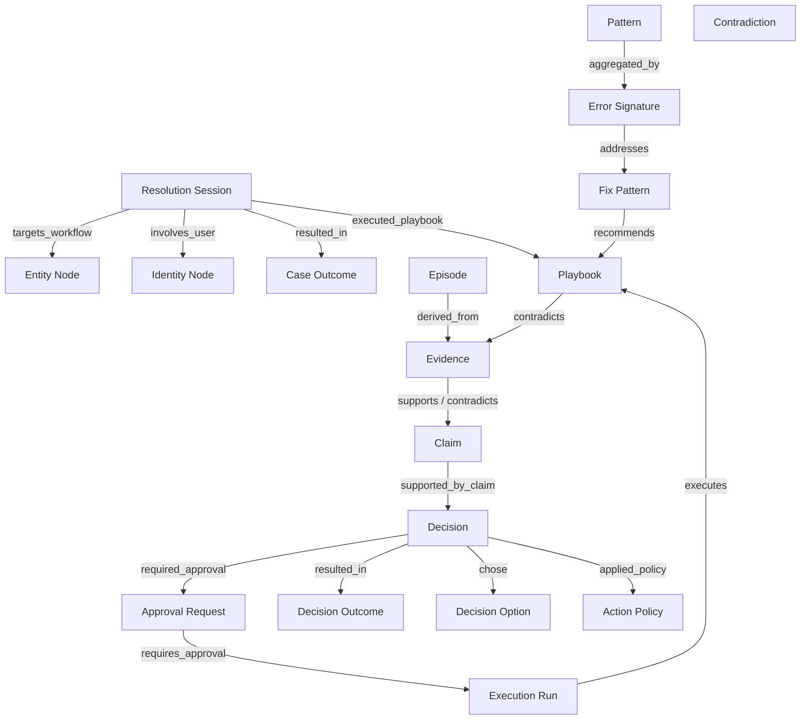
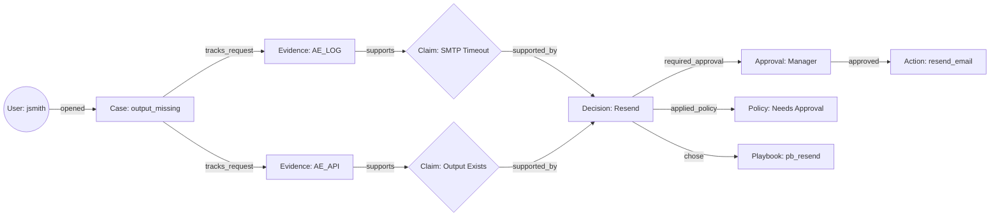
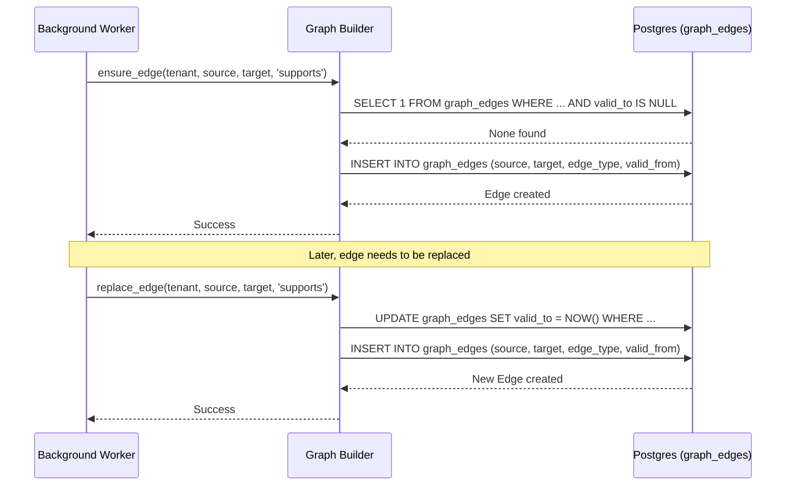

# ContextEdge — Context Graph

## 1. What is a Context Graph?

**What it is:**
A Context Graph is a type of knowledge graph. At its simplest, a graph is made of **nodes** (things) and **edges** (relationships between things). In ContextEdge, a node might be a user, a computer, an error log, or a playbook. An edge might say that the user "owns" the computer, or that the error log "indicates" a specific problem. 

**Why knowledge graphs matter:**
In IT and operations, information is scattered. You have tickets in Jira, messages in Teams, logs in Splunk, and workflows in AutomationEdge. A knowledge graph links these disconnected pieces into a single, unified web of information. When an incident happens, the graph lets you traverse from a symptom to a root cause, and from a root cause to a known fix, instantly.

**How ContextEdge's graph differs from generic knowledge graphs:**
Most knowledge graphs only store facts (like "Server A is in Data Center B"). The ContextEdge graph stores **operational memory** and **reasoning**. It tracks not just what exists, but what happened, why it happened, what decisions were made, and whether those decisions worked. It includes "claims" (hypotheses about what's wrong) and "decisions" (what the AI or human decided to do about it), along with "temporal" awareness (what was true at a specific point in time).

---

## 2. Why ContextEdge Uses a Context Graph

### Business Reasons
- **Faster Resolution:** Support teams don't have to manually correlate a Jira ticket with a Teams chat and an AutomationEdge log. The graph does it automatically.
- **Continuous Learning:** When a fix works, the graph updates counters for that pattern. The next time the same error happens, the system knows exactly which playbook to recommend based on past success.
- **Audit and Governance:** Every automated decision is backed by evidence and policies. If auditors ask "Why did the AI restart this server?", the graph can point exactly to the log, the policy, and the human approval that justified the action.

### Technical Reasons
- **Graph Traversal over JOINs:** To find "all past incidents related to the server mentioned in this error log," a traditional relational database would require massive, slow JOIN operations. In a graph, finding neighbors is a fast, bounded traversal (Breadth-First Search).
- **Flexible Schema:** Operational data doesn't fit neatly into rigid tables. The graph allows linking any two nodes with rich metadata, making it easy to adapt to new systems or concepts without database migrations.

### What problems it solves
- **The "Silo" Problem:** Breaks down barriers between monitoring, ticketing, and chat systems.
- **The "Lost Knowledge" Problem:** Captures implicit operational knowledge (e.g., "whenever Error X happens, Jane always runs Script Y") and formalizes it into patterns and playbooks.
- **The "Hallucination" Problem:** By grounding AI decisions in hard graph links (evidence → claim → decision), it prevents the AI from making up unverified fixes.

---

## 3. Node Types

In ContextEdge, nodes represent the nouns of the system. 

### Evidence
- **What it represents:** A piece of raw information, like a log line, a chat message, or a ticket description.
- **Database table:** `evidence_items`
- **Key attributes:** `evidence_type`, `source_type`, `evidence_time`, `relevance_score`, `redaction_status`.
- **When created:** When the system ingests data from external sources (Teams, Jira, AE).
- **Who creates it:** Ingestion workers and parsers.

### Episode
- **What it represents:** A reconstructed, ordered story of an incident (e.g., Observation → Hypothesis → Action → Verification), stitched together from multiple pieces of evidence.
- **Database table:** `episodes`
- **Key attributes:** `title`, `status`, `root_cause_summary`, `final_outcome`.
- **When created:** After evidence is ingested and correlated.
- **Who creates it:** The `episode_extractor` worker.

### Pattern
- **What it represents:** A recurring operational issue, aggregated from multiple similar episodes or cases.
- **Database table:** `patterns`
- **Key attributes:** `title`, `pattern_type`, `confidence`, `episode_count`.
- **When created:** When the Pattern aggregator worker notices multiple cases closing with similar root causes.
- **Who creates it:** The Pattern worker (`pattern_tasks.py`).

### Playbook
- **What it represents:** Official, ordered steps to resolve a specific issue.
- **Database table:** `playbooks`
- **Key attributes:** `title`, `lifecycle_state`, `risk_tier`, `automation_mode`.
- **When created:** Drafted by an SRE or generated based on a successful Pattern.
- **Who creates it:** Human operators or AI playbook generators.

### Decision
- **What it represents:** An operational choice made during an incident, either governed (by ContextEdge) or observed (extracted from chat).
- **Database table:** `decisions`
- **Key attributes:** `decision_intent`, `risk_level`, `policy_result`, `approval_required`.
- **When created:** When a remediation plan is generated, or when an action is extracted from evidence.
- **Who creates it:** The planner agent, or the decision extractor.

### Session
- **What it represents:** A specific support case or incident being actively worked on.
- **Database table:** `resolution_sessions`
- **Key attributes:** `case_number`, `case_type`, `issue_type`, `status`.
- **When created:** When a user opens a ticket or reports an issue.
- **Who creates it:** The triage agent or API caller.

### Entity
- **What it represents:** An operational noun, like a specific workflow (MG22), a server (vpn-gw-01), or a schedule.
- **Database table:** `entities`
- **Key attributes:** `entity_type`, `external_system`, `external_id`, `name`.
- **When created:** During catalog ingestion or seed.
- **Who creates it:** Connectors or seed scripts.

### Claim
- **What it represents:** A hypothesis or assertion, like "The SMTP relay is down."
- **Database table:** `claims`
- **Key attributes:** `claim_type`, `claim_text`, `validation_status`, `confidence`.
- **When created:** During diagnostic analysis of evidence.
- **Who creates it:** Diagnostic agents.

### Policy (TenantPolicy / ActionPolicy)
- **What it represents:** Rules governing actions, like "Restarting a DB requires L2 approval."
- **Database table:** `tenant_policies`, `action_policies`
- **Key attributes:** `action_name`, `risk_level`, `policy_result`.
- **When created:** Configured by admins.
- **Who creates it:** Human administrators.

### Identity
- **What it represents:** A person or system actor, resolving aliases (e.g., "J. Smith" and "jsmith" are the same person).
- **Database table:** `canonical_identities`
- **Key attributes:** `canonical_name`, `is_active`.
- **When created:** During identity resolution of mentions in evidence.
- **Who creates it:** The identity resolution service.

### Contradiction
- **What it represents:** A detected conflict between approved playbooks and reality (e.g., a playbook says to do X, but recent cases show X fails).
- **Database table:** `contradictions`
- **Key attributes:** `description`, `severity`.
- **When created:** During scheduled contradiction scans.
- **Who creates it:** The contradiction scanner worker.

---

## 4. Edge Types

Edges define how nodes relate. They are stored in `graph_edges`.

### `part_of`
- **What it connects:** A smaller component to a larger one (e.g., a chunk to an evidence item, or a step to a playbook).
- **Direction:** Child → Parent
- **Metadata:** Index or order.
- **When created:** When the child is created.

### `derived_from`
- **What it connects:** A generalized concept to its specific sources (e.g., Pattern → Episode).
- **Direction:** Target → Source
- **Metadata:** Confidence, extraction method.
- **When created:** During pattern aggregation.

### `evidence_for` / `supported_by`
- **What it connects:** Evidence supporting a Claim or Decision.
- **Direction:** Evidence → Claim/Decision (or vice versa depending on query perspective).
- **Metadata:** Weight, support type.
- **When created:** When a claim is formed or a decision is justified.

### `contradicts`
- **What it connects:** A Playbook to Evidence that shows the playbook is wrong.
- **Direction:** Playbook → Evidence
- **Metadata:** Description of the conflict.
- **When created:** By the contradiction scanner.

### `references_identity` / `mentions_identity`
- **What it connects:** Evidence or Playbooks to a specific Identity.
- **Direction:** Document → Identity
- **Metadata:** Context of mention.
- **When created:** During Named Entity Recognition (NER) on text.

### `based_on`
- **What it connects:** A Decision to the Evidence or Pattern that informed it.
- **Direction:** Decision → Source
- **Metadata:** Weight.
- **When created:** When a decision is generated.

### `executed_playbook`
- **What it connects:** A Session to the Playbook that was run to resolve it.
- **Direction:** Session → Playbook
- **Metadata:** Execution mode, run ID.
- **When created:** When execution starts.

---

## 5. Graph Storage

### `graph_edges` table
- The primary storage for all relationships.
- Uses a PostgreSQL Adjacency List model. Each row represents one directed edge.
- Columns: `source_node_type`, `source_node_id`, `target_node_type`, `target_node_id`, `edge_type`, `weight`, `confidence`.

### `graph_edge_meta` (or `metadata_extra` column)
- A JSONB column on the edge to store flexible metadata (like why a link was made, or contextual labels).

### PostgreSQL Adjacency List
- **Why not Neo4j?** Using PostgreSQL simplifies operations. It keeps graph data transactionally consistent with the relational tables (like `playbooks` or `evidence_items`). We don't have to sync data between a relational DB and a graph DB. While deep graph algorithms (like PageRank) are harder, Breadth-First Search (BFS) up to 3 hops (which is all we need) is very fast in Postgres.

### Temporal tracking
- The `graph_edges` table has `valid_from` and `valid_to` columns.
- This allows point-in-time queries ("What did the graph look like on Tuesday when the incident happened?"), ensuring that we don't evaluate past decisions using future knowledge.

---

## 6. Graph Builder (`builder.py`)

**File Rating:** 9/10 - Core mutation logic for the graph.

**What:** Functions to insert, update, and close edges in the Postgres adjacency table.
**Why:** Provides a clean, typed API so other services don't write raw SQL for graph updates.
**Where:** `backend/src/contextedge/graph/builder.py`
**Who calls it:** Pattern workers, decision trace services, episode extractors.
**What happens next:** Edges are flushed to the database, becoming immediately available for traversal.
**Input:** Source node info, target node info, edge type, optional metadata and temporal bounds.
**Output:** A `GraphEdge` SQLAlchemy model instance.
**Failure behavior:** Database errors (like constraint violations) bubble up and roll back the transaction.
**Design rationale:** Idempotency is key. Functions like `ensure_edge` check if an active edge already exists before creating a new one, preventing duplicate edges when workers retry tasks.

**Function Walkthrough:**
- `add_edge`: Raw insert of a new edge.
- `ensure_edge`: Checks for an existing open edge. If it exists, returns it; otherwise, creates it.
- `close_edge`: Sets `valid_to = now()` to expire a relationship without deleting it.
- `replace_edge`: Closes the old edge and opens a new one (temporal versioning).
- `link_node_to_identities`: Utility to link a node (like an episode) to a list of identity UUIDs.
- `persist_pattern_enrichment_edges`: Converts JSON enrichment data on Patterns (triggers, root causes) into real graph edges using deterministic UUIDs, so they can be queried just like normal nodes.

---

## 7. Graph Queries (`queries.py`)

**File Rating:** 9/10 - Core read paths for the graph.

**What:** Functions to traverse the graph and fetch subgraphs.
**Why:** To power the Graph Explorer UI and context retrieval for AI agents.
**Where:** `backend/src/contextedge/graph/queries.py`
**Who calls it:** API endpoints (`api/v1/graph.py`), Hybrid Ranker, AI context builders.
**What happens next:** Returns a JSON-serializable dictionary of nodes and edges, or a list of neighbors.
**Input:** Starting node, max depth, domain scope, timestamp.
**Output:** Lists of neighbors or subgraph dictionaries.
**Failure behavior:** Gracefully returns empty results if nodes don't exist.
**Design rationale:** Iterative Breadth-First Search (BFS) implemented in Python over SQLAlchemy. Instead of a massive recursive SQL CTE which can be hard to optimize and debug, it fetches neighbors hop-by-hop. Max depth is strictly capped (e.g., 3) to prevent runaway queries.

**Traversal patterns:**
- `get_neighbors`: Iterative BFS up to `max_depth`. Returns incoming and outgoing edges.
- `get_pattern_subgraph`: Specialized fetch around a Pattern, including virtual enrichment edges.
- `get_entity_subgraph`: Generic BFS to get a visualizable subgraph around any entity.
- `get_graph_stats`: Aggregates edge types and node types for dashboards.

---

## 8. Temporal Graph (`temporal.py`)

**File Rating:** 7/10 - Small but critical for auditability.

**What:** Shared predicates for time-travel queries.
**Why:** To ensure we only traverse edges that were active at a specific point in time.
**Where:** `backend/src/contextedge/graph/temporal.py`
**Who calls it:** `queries.py`, `selector.py`.
**Input:** An `as_of` datetime.
**Output:** A SQLAlchemy filter condition.
**Design rationale:** Security and accuracy. If an agent is auditing a past decision, it must not see relationships that were formed *after* the decision was made. `edge_valid_at` handles the logic of checking `valid_from` and `valid_to`.

---

## 9. Agent Subgraph (`graph/agent/`)

This module generates specialized, bounded projections of the graph strictly for LLM consumption, ensuring budgets (token limits) and security (access control) are respected.

### `contracts.py`
**File Rating:** 8/10
**What:** Pydantic models defining requests and responses.
**Why:** Strict typing for the API and internal functions.
**Design rationale:** Explicit budgets (`AgentGraphBudget`) ensure the LLM doesn't get flooded with too much context.

### `hydrators.py`
**File Rating:** 9/10
**What:** Converts raw SQLAlchemy ORM models into clean `HydratedGraphNode` dictionaries.
**Why:** We only want to expose specific, safe fields to the LLM, not the whole database row.
**Design rationale:** Includes a crucial `node_is_visible` check that enforces Role-Based Access Control (RBAC), domain scoping, and legal-hold exclusions. If a node is secret, it is silently dropped from the graph projection.

### `materializer.py`
**File Rating:** 8/10
**What:** Reconciles implicit relational links (like foreign keys) into explicit `GraphEdge` rows.
**Why:** Sometimes data is inserted relationally, but we need it in the graph for traversal.
**Who calls it:** Maintenance workers.

### `profiles.py`
**File Rating:** 8/10
**What:** Configuration for graph projections.
**Why:** Defines what node types and edge types are allowed for a specific use case (e.g., the `maf.v1` profile). It defines edge weights (e.g., a "supported_by" edge is more important than a "mentions" edge) and hop-decay (how much relevance drops per hop).

### `repository.py`
**File Rating:** 9/10
**What:** Data access layer for the agent graph.
**Why:** Handles the actual SQL queries to resolve seeds (starting points based on text search) and load edges.

### `selector.py`
**File Rating:** 10/10
**What:** The core algorithm for selecting which parts of the graph to send to the LLM.
**Why:** The graph is too big. The selector runs a budget-aware, relevance-scored BFS. It scores nodes based on distance from seeds, edge weights, and profile weights, then greedily selects the top nodes until the character/token budget is exhausted.

### `service.py`
**File Rating:** 9/10
**What:** Orchestrates the process: builds the access scope, calls the selector, and logs the projection event.
**Why:** Ties everything together for the API endpoint.

---

## 10. Graph API

**File Rating:** 8/10 (`api/v1/graph.py`)

**What:** The HTTP interface for the context graph.
**Endpoints:**
- `POST /agent-subsets`: Generates a budget-constrained subgraph for AI consumption.
- `GET /neighbors`: Fetch direct neighbors for a node.
- `GET /subgraph/{type}/{id}`: Fetch a visualizable subgraph around a node.
- `GET /stats`: Get total counts of nodes and edges.
**Request/response format:** Standard JSON, heavily typed via Pydantic.
**Frontend visualization:** The `/subgraph` endpoint is specifically designed to return data in a `{nodes: [], edges: []}` format that maps directly to libraries like React Flow.

---

## 11. Graph Explorer Tab

**What:** The UI component where operators can visually explore the graph.
**How it renders:** Uses a visualization library (like React Flow or Cytoscape) consuming the `/subgraph` endpoint.
**User interactions:**
- Click a node to expand its neighbors.
- Click an edge to see metadata (why these nodes are linked).
- Double-click to focus the view on a new node.
**Filters:** Users can filter by node type (e.g., "hide evidence, only show playbooks and entities") or by domain (e.g., "only show network-related edges").

---

## 12. How Each UI Tab Relates to the Graph

- **Cases / Sessions:** Backed by the `resolution_sessions` node. Shows edges to the affected `entities` and the resulting `case_outcomes`.
- **Evidence / Logs:** Views the `evidence_items` nodes. Shows correlation edges to other evidence, and `supported_by` edges to claims.
- **Patterns:** Views `patterns` nodes. Shows `derived_from` edges linking back to past episodes.
- **Playbooks:** Views `playbooks` nodes. The graph is crucial here for showing *where* a playbook is used (edges to entities) and *whether* it works (edges to contradictions or successful outcomes).
- **Decisions / Governance:** Views `decisions` and `approval_requests`. Shows the full trace: Evidence → Claim → Decision → Approval → Outcome.

---

## 13. Mermaid Diagrams

### Complete Graph Type Hierarchy

### Example Graph for a Typical Operational Incident

### Graph Building Sequence Diagram

