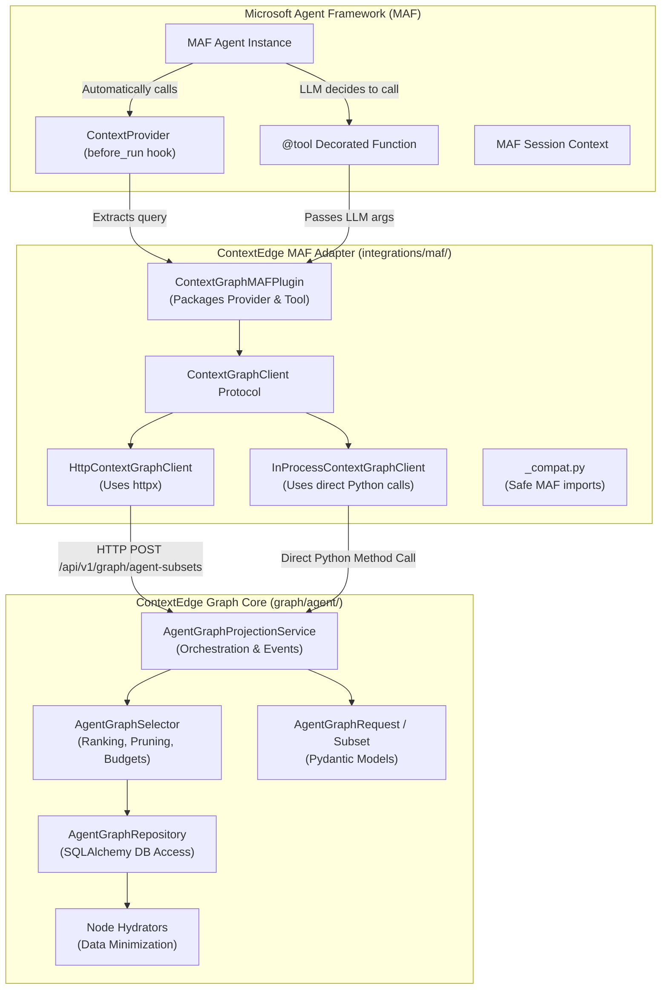
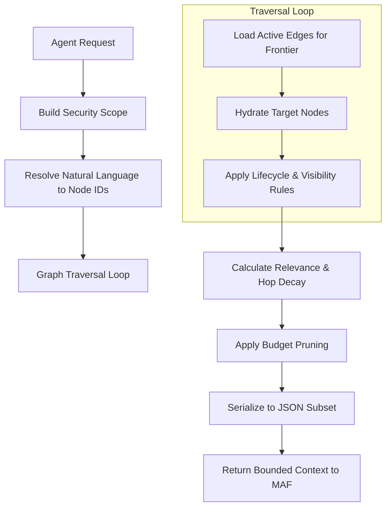
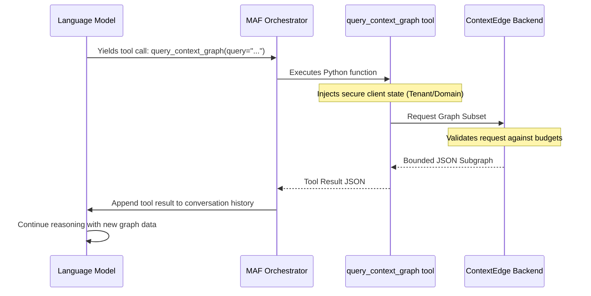
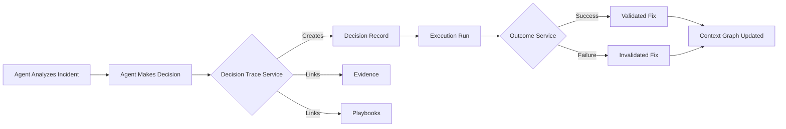

# ContextEdge — Microsoft Agent Framework (MAF) Integration

## 1. What is MAF?

### What is it?
Microsoft Agent Framework (MAF) is a robust, extensible Python library developed to help engineers build, run, test, and manage artificial intelligence agents. But what exactly is an "agent"? In the world of AI, an agent is a software program powered by a Large Language Model (LLM) that goes beyond simply chatting. An agent can:
- Observe its environment.
- Formulate a plan of action.
- Call external tools (like APIs, databases, or scripts).
- Evaluate the results of those tools.
- Keep iterating until it achieves a defined goal.

MAF provides the foundational building blocks required to connect an LLM (like GPT-4) with real-world tools and real-time context. It acts as the orchestrator, sitting between the AI model and your business logic.

### Why do agent frameworks exist?
Building an AI agent completely from scratch is incredibly difficult and error-prone. If you try to build one without a framework, you have to write custom code to handle many low-level concerns:
- **Conversation History:** Keeping track of every message, tool call, and response in the chat history, and formatting it correctly for the specific LLM provider.
- **Prompt Engineering and Injection:** Dynamically injecting instructions and system prompts before sending requests to the model.
- **Tool Parsing:** Extracting JSON payloads from the model's output to determine if it wants to call a function, and then mapping that JSON to actual Python function arguments.
- **Execution and Feedback:** Actually executing the Python function safely, capturing errors, and sending the result back to the model in a way it understands.
- **Loop Management:** Preventing the model from getting stuck in infinite loops (e.g., repeatedly calling a tool that fails).

Agent frameworks like MAF exist to handle all of this complicated plumbing. They provide a standardized, battle-tested orchestration layer so developers can focus purely on what the agent should *do* (business logic) rather than how it communicates with the underlying LLM.

### What problems do they solve?
1. **Tool Calling (Function Calling):** Frameworks make it trivial to give AI models real-world capabilities. By simply adding a `@tool` decorator to a Python function, the framework automatically handles exposing the function's schema to the LLM, parsing the LLM's request, executing the code, and returning the result.
2. **Context Injection:** AI models have limited memory (the "context window"). They don't inherently know about your private company data. Frameworks provide standard ways (like `ContextProvider`) to inject the right background information just in time, ensuring the AI has the facts it needs to reason accurately.
3. **Session Management:** They keep track of ongoing workflows, memory, and state, ensuring the AI remembers what happened earlier in the task without requiring you to manually manage databases of chat transcripts.

## 2. Why ContextEdge Uses MAF

### Business Reasons
ContextEdge is a platform designed to help enterprise organizations resolve operational incidents (like IT outages or security alerts) automatically and safely. It achieves this by supplying AI with governed, approved evidence, policies, and playbooks.

By integrating with an industry-standard framework like Microsoft Agent Framework, ContextEdge enables businesses to build highly customized AI agents quickly. Organizations do not have to reinvent the wheel or build their own fragile agent orchestration layers. They can use MAF to define their agents, and simply plug ContextEdge in to provide the safety, governance, and institutional memory required for enterprise use. It accelerates time-to-market for enterprise automation while reducing risk.

### Technical Reasons
- **Standardized Interfaces:** MAF provides standard, clean interfaces. For proactive context injection, it offers the `ContextProvider` base class. For on-demand function calls, it provides the `@tool` decorator. This means ContextEdge can integrate cleanly without hacking into the LLM logic.
- **Decoupled Architecture:** ContextEdge's core graph projection logic (which calculates what data an agent is allowed to see) remains completely independent of any specific AI framework. The MAF adapter is just a thin translation layer.
- **Deployment Flexibility:** The integration supports both HTTP-backed clients (for agents running on remote servers or different language runtimes) and In-process clients (for agents co-located in the same Python process as the ContextEdge backend).

### What it enables
- **Proactive Context:** Agents automatically receive highly relevant subsets of the ContextEdge Graph before they even start processing a user's prompt. The agent wakes up already knowing the state of the system.
- **On-Demand Queries:** Agents can actively query the Context Graph during their reasoning process. If they need to know more about a specific error signature, they can ask the graph for it.
- **Bounded and Safe Execution:** ContextEdge ensures the agent only sees what it is strictly authorized to see. The data is capped by budgets (max node counts, depth limits, character limits) to prevent overwhelming the LLM's context window and causing hallucinations or excessive API costs.

## 3. MAF Architecture in ContextEdge

The integration utilizes a classic Adapter pattern. The Context Graph core does not know that MAF exists. The MAF integration layer translates between MAF's runtime concepts and ContextEdge's internal contracts.

### Mermaid Architecture Diagram

## 4. File-by-File Walkthrough

Here is a detailed, simple English explanation of every file in the MAF integration module. 

### `__init__.py`
- **Where:** `backend/src/contextedge/integrations/maf/__init__.py`
- **What:** The public entry point for the MAF integration module. It defines what developers can import when they use `from contextedge.integrations.maf import ...`.
- **Why:** To provide a clean, documented public API and hide internal implementation details.
- **Who calls it:** External scripts, background workers, or MAF applications that are importing the integration to build an agent.
- **What happens next:** When a developer imports a class, `__init__.py` resolves it.
- **Design rationale:** It utilizes Python's `__getattr__` for lazy loading. By lazy-loading classes like `ContextGraphMAFPlugin`, it ensures that simply importing the module doesn't crash the application if the optional MAF dependencies aren't installed. Client-only imports (like `HttpContextGraphClient`) are always available immediately.
- **Rating:** 6/10. Important for module structure, but contains no heavy business logic.

### `_compat.py`
- **Where:** `backend/src/contextedge/integrations/maf/_compat.py`
- **What:** A compatibility shim that attempts to import required MAF classes (`ContextProvider`, `FunctionInvocationContext`, `SessionContext`, `tool`).
- **Why:** MAF is an optional dependency in ContextEdge (installed via `pip install ".[maf]"`). We need a safe place to attempt the import and handle failures gracefully.
- **Who calls it:** Other files within the `maf` directory (e.g., `provider.py`, `tools.py`).
- **Failure behavior:** If MAF is not installed on the system, it catches the standard `ImportError` and raises a clear, highly actionable custom error: `"Microsoft Agent Framework support requires pip install contextedge[maf]."`.
- **Design rationale:** Fail fast and provide a helpful error message to the developer rather than throwing a cryptic, generic "missing module" error deep inside the application logic.
- **Rating:** 5/10. Crucial for developer experience, simple implementation.

### `client.py`
- **Where:** `backend/src/contextedge/integrations/maf/client.py`
- **What:** Defines the `ContextGraphClient` protocol and two concrete implementations: `InProcessContextGraphClient` and `HttpContextGraphClient`.
- **Why:** To completely abstract *how* the MAF adapter connects to the core ContextEdge graph projection service.
- **Who calls it:** The `ContextGraphProvider` (for proactive injection) and `ContextGraphTools` (for on-demand querying).
- **Input:** An `AgentGraphRequest` object containing the query, seeds, budget, requested depth, and profile.
- **Output:** An `AgentGraphSubset` object containing the safe, bounded, and ranked graph facts ready for the LLM.
- **Failure behavior:** For the HTTP client, it will raise standard `httpx` exceptions (timeouts, connection errors) if the remote service is down. For the in-process client, it will raise standard Python exceptions.
- **Design rationale:** By defining a protocol, it allows the exact same MAF plugin code to run in two vastly different deployment topologies. You can run the agent inside the ContextEdge backend process (direct database calls) or externally over the network (HTTP calls) without changing the agent's logic.
- **Rating:** 8/10. Key abstraction layer that enables enterprise deployment flexibility.

### `plugin.py`
- **Where:** `backend/src/contextedge/integrations/maf/plugin.py`
- **What:** A composable bundle class (`ContextGraphMAFPlugin`) that packages the provider and the toolset together.
- **Why:** It drastically simplifies agent initialization for the developer. Instead of manually instantiating providers and tools and wiring them up, the developer creates one plugin and passes its properties directly to the MAF Agent constructor.
- **Who calls it:** The developer's agent initialization script (e.g., `agent = Agent(..., context_providers=graph.context_providers, tools=graph.tools)`).
- **Input:** A `ContextGraphClient` instance and boolean flags (`enable_provider`, `enable_tool`) to toggle features.
- **Output:** Exposes `.context_providers` and `.tools` lists that can be directly consumed by MAF.
- **Design rationale:** Composition over inheritance. It provides a clean, single-line integration experience while retaining the ability to disable parts of the integration if the developer only wants tools or only wants proactive context.
- **Rating:** 7/10. Excellent developer-experience wrapper.

### `provider.py`
- **Where:** `backend/src/contextedge/integrations/maf/provider.py`
- **What:** Implements `ContextGraphProvider`, which inherits from MAF's base `ContextProvider`.
- **Why:** To proactively inject relevant graph context into the agent *before* it begins its reasoning loop for a new user message.
- **Who calls it:** The Microsoft Agent Framework calls the `before_run` method automatically whenever the agent is invoked to handle a turn.
- **What happens next:**
  1. It inspects the conversation history, extracting the text from the last 4 messages to build a query string representing the current context.
  2. It calls the `ContextGraphClient.get_agent_subset()` using this query.
  3. It receives the `AgentGraphSubset`.
  4. It serializes the subset into a compact JSON string (stripping out internal telemetry fields like usage metrics and projection IDs to save tokens).
  5. It calls `context.extend_instructions()` to append this JSON directly into the agent's system instructions.
- **Input:** The MAF runtime context, the current session state, and conversation messages.
- **Output:** Modifies the agent's instructions in-place; returns `None`.
- **Failure behavior:** It is designed to be strictly "fail-soft". If the graph projection fails (e.g., due to a network timeout or database error), it catches the exception, logs a warning (`maf_context_graph_provider_unavailable`), and returns silently. The agent will continue running without the extra context, rather than crashing the user's entire workflow.
- **Design rationale:** Proactive injection ensures the agent doesn't have to waste time and LLM tokens calling tools just to discover basic facts about the current incident. The fail-soft design ensures high availability for the agent itself.
- **Rating:** 9/10. A critical piece of the integration that drives immediate AI contextual awareness.

### `tools.py`
- **Where:** `backend/src/contextedge/integrations/maf/tools.py`
- **What:** Defines `ContextGraphTools`, a class containing MAF `@tool` decorated functions. Specifically, `query_context_graph`.
- **Why:** To allow the agent to explicitly ask for more, specific context if the proactive injection wasn't enough, or if the conversation pivots to a new topic.
- **Who calls it:** The LLM decides to call this tool during its reasoning loop. MAF parses the LLM's JSON and executes the Python function.
- **What happens next:** The tool receives the LLM's parameters, constructs an `AgentGraphRequest`, calls the client to get the subset, and returns the JSON representation back to MAF (which then sends it to the LLM).
- **Input:** Arguments generated by the LLM: `query` (what to search for), `seeds` (optional specific node IDs to start the search from), `entities` (operational entity names), and `max_depth` (how far to traverse the graph, capped at 3).
- **Output:** A JSON dictionary representation of the `AgentGraphSubset`.
- **Failure behavior:** Unlike the provider, the tool propagates API and client errors. If the graph is unreachable, the tool fails, and MAF reports the tool failure to the LLM. The LLM can then decide to apologize to the user or try a different tool.
- **Design rationale:** The tool does *not* accept sensitive parameters like tenant ID, domain ID, or user roles from the LLM. The LLM cannot be trusted with authorization data. Security boundaries are strictly maintained outside the tool schema.
- **Rating:** 9/10. Empowers the agent with active exploration capabilities.

## 5. Agent Context Flow

How is context assembled for a MAF agent? It goes through a strict, deterministic pipeline designed to ensure safety, relevance, and token efficiency.

1. **Request Initiation:** The agent (either proactively via the provider or on-demand via the tool) sends an `AgentGraphRequest` containing a query and optional seeds.
2. **Seed Resolution:** The `AgentGraphRepository` attempts to resolve natural language terms (like "payment workflow" or a playbook name) into specific database node IDs. It does this using text search, strictly limiting the search to domains the user is authorized to access.
3. **Graph Traversal:** The `AgentGraphSelector` begins exploring the graph outward from the resolved seeds, level by level, up to the requested `max_depth`.
4. **Visibility Filtering:** As raw database rows are discovered, they are passed through `node_is_visible` (in `hydrators.py`). This applies strict lifecycle and security rules. For example: Is the playbook published and approved? Is the evidence under legal hold? Does the user's role have a high enough risk cap to see this action policy? If any check fails, the node is dropped entirely.
5. **Node Hydration:** Raw database rows are converted into safe `HydratedGraphNode` objects. This strips away all internal database columns, raw evidence bodies, passwords, and arbitrary JSON blobs, keeping only safe, allowlisted facts (Data Minimization).
6. **Ranking and Decay:** The selector ranks nodes by relevance. Relevance decays the further a node is from the original seed (hop decay). Certain relationship types boost relevance (e.g., a "validated_fix" edge is weighted higher than a generic "considered" edge).
7. **Budget Pruning:** The ranked graph is pruned to fit strictly within the requested budgets. The system stops adding nodes if it exceeds the maximum node count, relationship count, or total character limit. If pruning occurs, it sets `truncated=True` and lists the reasons.
8. **Projection Delivery:** The final `AgentGraphSubset` is returned to the MAF adapter, serialized, and injected into the LLM prompt.

## 6. Agent Execution Pipeline

ContextEdge is not just a knowledge base; it is an action engine. When an agent acts, ContextEdge captures the execution pipeline to ensure accountability and auditability.

1. **Trigger:** A system event (like a Datadog alert) or a human user starts an agent session.
2. **Context Injection:** The MAF Provider injects the graph subset, giving the agent a map of the environment and known playbooks.
3. **Reasoning Loop:** The LLM evaluates the context and the prompt to decide what to do.
4. **Tool Use:** If the LLM determines an action is needed (e.g., restarting a service), it calls a corresponding tool.
5. **Decision Capture:** Before taking a risky action, the integration interfaces with `decision_trace_service.py`. It records a `Decision` object capturing *why* the agent chose this action, what options it considered, and what evidence it relied on.
6. **Execution:** The action is passed to the execution service (represented by `execution_run` nodes).
7. **Outcome Recording:** Once the action finishes, the execution service records the result (success, failure). The outcome is linked back to the original decision trace, closing the loop. This creates an institutional memory of what worked and what didn't.

## 7. Agent Profiles

### What are profiles?
A projection profile is a server-controlled configuration that defines exactly what an agent is allowed to see and how much data it can request. It is the ultimate safeguard against LLM context bloat and data leakage.

### Available Profiles
Currently, the system defines one primary profile in `profiles.py`: **`maf.v1`**.

### Profile Selection Logic
- The MAF client hardcodes requests to use `profile="maf.v1"`.
- The server receives the request and validates it in `get_projection_profile()`.
- The profile defines strict boundaries:
  - **Allowed Node Types:** Only specific concepts like `session`, `playbook`, `evidence`, `decision`, `error_signature`. (It explicitly excludes internal system nodes).
  - **Allowed Relationship Types:** Only specific semantic edges like `supported_by`, `executes`, `governs`.
  - **Budget Caps:** A maximum of 60 nodes, 120 relationships, a depth of 3, and a total payload size of 30,000 characters. No matter what the LLM requests, it cannot exceed these limits.
  - **Relationship Weights:** Multipliers used during the ranking phase (e.g., a `validated_fix` edge boosts relevance by 1.2x, while an `invalidated_fix` edge penalizes relevance by 0.9x).

## 8. Graph Projection for MAF

### What does 'projection' mean?
Projection means taking a complex, highly normalized relational database (dozens of tables, foreign keys, timestamps) and projecting it into a simplified, read-only, point-in-time graph view (`Nodes` and `Edges`). This flattened format is heavily optimized for LLMs, which struggle to understand raw SQL schemas but easily understand JSON graphs.

### Bounded Subsets
To prevent LLM context limits from being exceeded (which causes errors or massive API bills), the projection is strictly bounded. The `AgentGraphSelector` acts as an accountant, tracking character counts as it builds the response. If it runs out of budget, it immediately stops, returns what it has, and flags `truncated=True`.

### Security Considerations
- **No LLM Control:** The LLM cannot bypass the profile. It cannot request raw database tables or arbitrary SQL queries.
- **Data Minimization:** Raw evidence bodies, passwords, embeddings, full audit logs, and arbitrary JSON fields are rigorously excluded. Only high-level summaries and safe facts are projected.
- **Fail Closed:** If there is any doubt about authorization or a missing visibility rule, the node is excluded. The system fails closed.

### Tenant and Domain Safety
- Every single node and edge queried during traversal is checked against the user's `tenant_id`. Multi-tenancy is enforced at the lowest level.
- If the user's authentication token includes a `domain_id` restriction, the graph traversal immediately stops at boundaries that belong to unauthorized domains, cleanly enforcing departmental silos (e.g., HR data vs. IT data).

## 9. Tool Execution

### How MAF agents call ContextEdge tools
The `@tool` decorator in MAF registers a Python function with the LLM's function-calling API. It automatically generates a JSON Schema describing the function's arguments and purpose. The LLM reads this schema and, if it decides the tool is useful, generates a JSON payload matching the arguments. MAF intercepts this JSON, calls the Python function, and returns the result to the LLM.

### Security Constraints
As previously noted, tool arguments are strictly limited. The `FunctionInvocationContext` (which MAF securely injects into the tool behind the scenes) or the client's internal initialized state holds the secure credentials, tenant IDs, and user roles. The LLM is never trusted to provide its own authorization context.

## 10. Decision Trace Integration

### What is it?
The `decision_trace_service.py` acts as the institutional memory layer. When an agent decides to act, it doesn't just execute the action; it creates a `Decision` record explaining its reasoning.

### How it works
1. **Create Decision:** `create_decision()` is called with the agent's rationale, the options it considered, and the evidence references it used.
2. **Link Graph:** It links the decision into the Context Graph, creating edges to the evidence, playbooks, and policies used (`link_decision_evidence`, `link_decision_policy`).
3. **Record Outcome:** Later, `record_outcome()` logs whether the agent's action succeeded or failed.
4. **Trace Events:** It emits operational events (`decision.created`, `decision.outcome_recorded`) for compliance audit trails.

### Audit Trail and Provenance
Every decision has a `parent_decision_id` if it's part of a chain, building a complete tree of *why* an incident was resolved a certain way. If a human reviewer overrides the AI, `reject_decision()` is called, marking the AI's choice as superseded and logging the human's feedback code. This creates a provable audit trail of AI behavior.

## 11. Execution Engine Integration

### Execution Service
While the MAF agent decides *what* to do, the actual doing often happens via execution runs handled by external systems or background workers.

### Step Runs and Feedback Loops
Execution attempts (`execution_run`) are materialized into the Context Graph. This means an agent can literally see its own past execution attempts. For example, the agent can query the graph and realize, "I tried this restart script 5 minutes ago and it failed with a timeout, so I should try escalating instead."

### Error Handling & Recovery
If an execution fails, a `case_outcome` with a failed result is recorded. The graph materializer (`materializer.py`) links this back to the `fix_pattern` as an `invalidated_fix`. The next time the agent queries the graph for a similar issue, the failed fix is de-prioritized by the ranking algorithm, helping the agent organically learn and try a different approach.

## 12. Security Summary

### Tenant Isolation
Multi-tenancy is hardcoded into every database query within the `AgentGraphRepository`. The `AgentGraphAccessScope` mandates a valid `tenant_id`. No cross-tenant data leakage is possible at the database layer.

### Domain Scoping
Domains represent boundaries within a tenant (e.g., HR vs. IT). If a service account is restricted to the IT domain, the `_domain_predicate` in the repository explicitly filters out HR nodes, even if they are linked in the graph topology.

### Authentication for Agent Calls
The `HttpContextGraphClient` uses service tokens (`X-Service-Token`) or Bearer tokens to authenticate remote agents. The server resolves these tokens into a concrete `AgentGraphAccessScope` containing the exact privileges of the caller before executing any graph projection.

## 13. Mermaid Diagrams

### Agent Context Assembly Flow

### Tool Calling Flow

### Institutional Memory Flow

