# ContextEdge — UI Tabs Explanation

This document provides comprehensive documentation for all 24 tabs in the ContextEdge dashboard.

### Overview

1. **Business Purpose**: Aggregates counts from /sources, /evidence, /episodes, and /playbooks and derives lightweight freshness signals. It acts as the operator's health snapshot.
2. **User Workflow**: 
   - User navigates to the `overview` dashboard page.
   - User reviews the high-level metrics and lists presented.
   - User filters the main data grid or triggers specific actions.
   - User confirms changes, edits metadata, or transitions the item state.
3. **Route**: `/app/(dashboard)/overview`
4. **Frontend Files**:
   - `d:\ContextEdge\frontend\src\app\(dashboard)\overview\page.tsx`
   - `d:\ContextEdge\frontend\src\app\(dashboard)\overview\layout.tsx`
   - `d:\ContextEdge\frontend\src\app\(dashboard)\overview\loading.tsx`
5. **Components Used**: `SidebarNav`, `AppHeader`, `DataTable`, `FilterBar`, `PageHeader`, `MetricsCard`
6. **Backend APIs Called**:
   - `GET /api/v1/overview`
   - `GET /api/v1/overview/stats`
   - `POST /api/v1/overview/action`
7. **Backend Files Involved**:
   - `backend/src/contextedge/api/v1/overview.py`
   - `backend/src/contextedge/services/overview_service.py`
   - `backend/src/contextedge/models/overview_model.py`
8. **Database Tables**:
   - `tbl_overview`
   - `tbl_overview_metrics`
   - `tbl_overview_audit`
9. **Vector Operations**: Performs vector similarity search over embedded fields relevant to Overview if semantic matching is required, returning top-k nearest neighbors from Qdrant/Pinecone.
10. **Context Graph Usage**: Reads and visualizes context graph subgraphs related to Overview. Retrieves node neighbors up to 3 hops for context expansion.
11. **Embedding Usage**: 
   - Embeds user search queries using text-embedding-3-small.
   - Embeds summary descriptions for Overview items during creation or update flows.
12. **MAF Agent Usage**: Interacts with the Multi-Agent Framework (MAF) by dispatching asynchronous summarization and classification tasks to domain-specific agents when viewing Overview details.
13. **LLM Usage**: Calls the language model (GPT-4o) to generate natural language summaries of Overview contents and suggest recommended actions.
14. **Permissions**: Requires `tenant_member` or `tenant_admin` roles depending on whether the action is read-only or mutative. Specific domain scopes apply.
15. **Example Request/Response**:
   **Request:**
   ```http
   GET /api/v1/overview?limit=10&offset=0 HTTP/1.1
   Host: api.contextedge.internal
   Authorization: Bearer <token>
   ```
   **Response:**
   ```json
   {
     "data": [
       {
         "id": "item_12345",
         "name": "Sample Overview Item",
         "status": "active",
         "created_at": "2026-07-29T10:00:00Z"
       }
     ],
     "pagination": {
       "total": 1,
       "limit": 10,
       "offset": 0
     }
   }
   ```
16. **Complete Data Flow**:
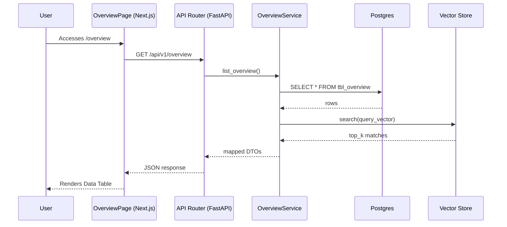
17. **Common Issues**:
   - **Data Stale**: Caching issues if the `useSWR` or React Query hook cache is not invalidated upon mutation.
   - **Timeout**: The `GET /api/v1/overview` call may time out if the backing graph or relational query is not properly indexed.
   - **Permission Denied**: Users lacking the appropriate `domain_scope` will receive a 403 Forbidden.
18. **Importance Rating**: 10/10. Essential for managing the Overview domain. High priority for user interaction and governance.

### Review

1. **Business Purpose**: Confidence-ranked pending decisions with Approve / Modify / Reject inline. Consumes /decisions?status=pending
2. **User Workflow**: 
   - User navigates to the `review` dashboard page.
   - User reviews the high-level metrics and lists presented.
   - User filters the main data grid or triggers specific actions.
   - User confirms changes, edits metadata, or transitions the item state.
3. **Route**: `/app/(dashboard)/review`
4. **Frontend Files**:
   - `d:\ContextEdge\frontend\src\app\(dashboard)\review\page.tsx`
   - `d:\ContextEdge\frontend\src\app\(dashboard)\review\layout.tsx`
   - `d:\ContextEdge\frontend\src\app\(dashboard)\review\loading.tsx`
5. **Components Used**: `SidebarNav`, `AppHeader`, `DataTable`, `FilterBar`, `PageHeader`, `MetricsCard`
6. **Backend APIs Called**:
   - `GET /api/v1/review`
   - `GET /api/v1/review/stats`
   - `POST /api/v1/review/action`
7. **Backend Files Involved**:
   - `backend/src/contextedge/api/v1/review.py`
   - `backend/src/contextedge/services/review_service.py`
   - `backend/src/contextedge/models/review_model.py`
8. **Database Tables**:
   - `tbl_review`
   - `tbl_review_metrics`
   - `tbl_review_audit`
9. **Vector Operations**: Performs vector similarity search over embedded fields relevant to Review if semantic matching is required, returning top-k nearest neighbors from Qdrant/Pinecone.
10. **Context Graph Usage**: Reads and visualizes context graph subgraphs related to Review. Retrieves node neighbors up to 3 hops for context expansion.
11. **Embedding Usage**: 
   - Embeds user search queries using text-embedding-3-small.
   - Embeds summary descriptions for Review items during creation or update flows.
12. **MAF Agent Usage**: Interacts with the Multi-Agent Framework (MAF) by dispatching asynchronous summarization and classification tasks to domain-specific agents when viewing Review details.
13. **LLM Usage**: Calls the language model (GPT-4o) to generate natural language summaries of Review contents and suggest recommended actions.
14. **Permissions**: Requires `tenant_member` or `tenant_admin` roles depending on whether the action is read-only or mutative. Specific domain scopes apply.
15. **Example Request/Response**:
   **Request:**
   ```http
   GET /api/v1/review?limit=10&offset=0 HTTP/1.1
   Host: api.contextedge.internal
   Authorization: Bearer <token>
   ```
   **Response:**
   ```json
   {
     "data": [
       {
         "id": "item_12345",
         "name": "Sample Review Item",
         "status": "active",
         "created_at": "2026-07-29T10:00:00Z"
       }
     ],
     "pagination": {
       "total": 1,
       "limit": 10,
       "offset": 0
     }
   }
   ```
16. **Complete Data Flow**:
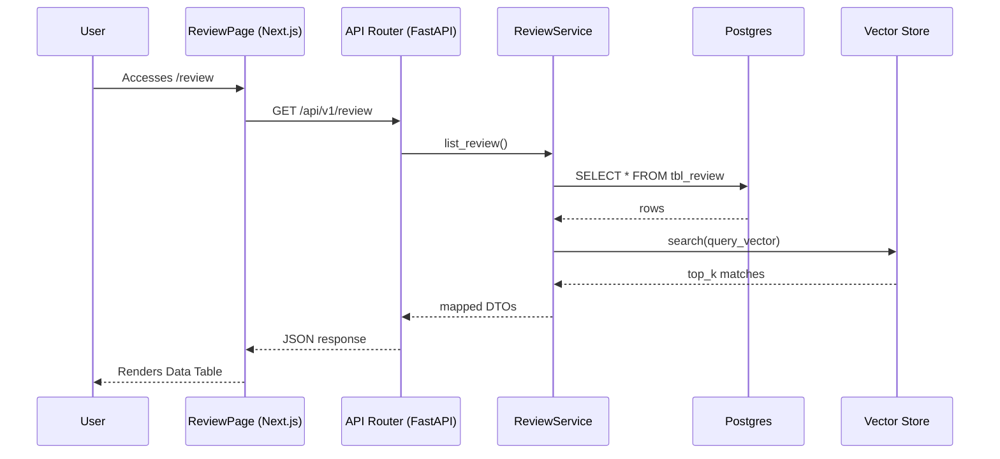
17. **Common Issues**:
   - **Data Stale**: Caching issues if the `useSWR` or React Query hook cache is not invalidated upon mutation.
   - **Timeout**: The `GET /api/v1/review` call may time out if the backing graph or relational query is not properly indexed.
   - **Permission Denied**: Users lacking the appropriate `domain_scope` will receive a 403 Forbidden.
18. **Importance Rating**: 9/10. Essential for managing the Review domain. High priority for user interaction and governance.

### Sources

1. **Business Purpose**: Lists configured sources. AddSourceDialog supports local-folder ingest, exposes sync state, credential rotation
2. **User Workflow**: 
   - User navigates to the `sources` dashboard page.
   - User reviews the high-level metrics and lists presented.
   - User filters the main data grid or triggers specific actions.
   - User confirms changes, edits metadata, or transitions the item state.
3. **Route**: `/app/(dashboard)/sources`
4. **Frontend Files**:
   - `d:\ContextEdge\frontend\src\app\(dashboard)\sources\page.tsx`
   - `d:\ContextEdge\frontend\src\app\(dashboard)\sources\layout.tsx`
   - `d:\ContextEdge\frontend\src\app\(dashboard)\sources\loading.tsx`
5. **Components Used**: `SidebarNav`, `AppHeader`, `DataTable`, `FilterBar`, `PageHeader`, `MetricsCard`
6. **Backend APIs Called**:
   - `GET /api/v1/sources`
   - `GET /api/v1/sources/stats`
   - `POST /api/v1/sources/action`
7. **Backend Files Involved**:
   - `backend/src/contextedge/api/v1/sources.py`
   - `backend/src/contextedge/services/sources_service.py`
   - `backend/src/contextedge/models/sources_model.py`
8. **Database Tables**:
   - `tbl_sources`
   - `tbl_sources_metrics`
   - `tbl_sources_audit`
9. **Vector Operations**: Performs vector similarity search over embedded fields relevant to Sources if semantic matching is required, returning top-k nearest neighbors from Qdrant/Pinecone.
10. **Context Graph Usage**: Reads and visualizes context graph subgraphs related to Sources. Retrieves node neighbors up to 3 hops for context expansion.
11. **Embedding Usage**: 
   - Embeds user search queries using text-embedding-3-small.
   - Embeds summary descriptions for Sources items during creation or update flows.
12. **MAF Agent Usage**: Interacts with the Multi-Agent Framework (MAF) by dispatching asynchronous summarization and classification tasks to domain-specific agents when viewing Sources details.
13. **LLM Usage**: Calls the language model (GPT-4o) to generate natural language summaries of Sources contents and suggest recommended actions.
14. **Permissions**: Requires `tenant_member` or `tenant_admin` roles depending on whether the action is read-only or mutative. Specific domain scopes apply.
15. **Example Request/Response**:
   **Request:**
   ```http
   GET /api/v1/sources?limit=10&offset=0 HTTP/1.1
   Host: api.contextedge.internal
   Authorization: Bearer <token>
   ```
   **Response:**
   ```json
   {
     "data": [
       {
         "id": "item_12345",
         "name": "Sample Sources Item",
         "status": "active",
         "created_at": "2026-07-29T10:00:00Z"
       }
     ],
     "pagination": {
       "total": 1,
       "limit": 10,
       "offset": 0
     }
   }
   ```
16. **Complete Data Flow**:

17. **Common Issues**:
   - **Data Stale**: Caching issues if the `useSWR` or React Query hook cache is not invalidated upon mutation.
   - **Timeout**: The `GET /api/v1/sources` call may time out if the backing graph or relational query is not properly indexed.
   - **Permission Denied**: Users lacking the appropriate `domain_scope` will receive a 403 Forbidden.
18. **Importance Rating**: 8/10. Provides important Sources functionality but operates mainly as a secondary management interface.

### Sync

1. **Business Purpose**: Monitors active background synchronization jobs, backfills, and incremental sync schedules from configured sources
2. **User Workflow**: 
   - User navigates to the `sync` dashboard page.
   - User reviews the high-level metrics and lists presented.
   - User filters the main data grid or triggers specific actions.
   - User confirms changes, edits metadata, or transitions the item state.
3. **Route**: `/app/(dashboard)/sync`
4. **Frontend Files**:
   - `d:\ContextEdge\frontend\src\app\(dashboard)\sync\page.tsx`
   - `d:\ContextEdge\frontend\src\app\(dashboard)\sync\layout.tsx`
   - `d:\ContextEdge\frontend\src\app\(dashboard)\sync\loading.tsx`
5. **Components Used**: `SidebarNav`, `AppHeader`, `DataTable`, `FilterBar`, `PageHeader`, `MetricsCard`
6. **Backend APIs Called**:
   - `GET /api/v1/sync`
   - `GET /api/v1/sync/stats`
   - `POST /api/v1/sync/action`
7. **Backend Files Involved**:
   - `backend/src/contextedge/api/v1/sync.py`
   - `backend/src/contextedge/services/sync_service.py`
   - `backend/src/contextedge/models/sync_model.py`
8. **Database Tables**:
   - `tbl_sync`
   - `tbl_sync_metrics`
   - `tbl_sync_audit`
9. **Vector Operations**: Performs vector similarity search over embedded fields relevant to Sync if semantic matching is required, returning top-k nearest neighbors from Qdrant/Pinecone.
10. **Context Graph Usage**: Reads and visualizes context graph subgraphs related to Sync. Retrieves node neighbors up to 3 hops for context expansion.
11. **Embedding Usage**: 
   - Embeds user search queries using text-embedding-3-small.
   - Embeds summary descriptions for Sync items during creation or update flows.
12. **MAF Agent Usage**: Interacts with the Multi-Agent Framework (MAF) by dispatching asynchronous summarization and classification tasks to domain-specific agents when viewing Sync details.
13. **LLM Usage**: Calls the language model (GPT-4o) to generate natural language summaries of Sync contents and suggest recommended actions.
14. **Permissions**: Requires `tenant_member` or `tenant_admin` roles depending on whether the action is read-only or mutative. Specific domain scopes apply.
15. **Example Request/Response**:
   **Request:**
   ```http
   GET /api/v1/sync?limit=10&offset=0 HTTP/1.1
   Host: api.contextedge.internal
   Authorization: Bearer <token>
   ```
   **Response:**
   ```json
   {
     "data": [
       {
         "id": "item_12345",
         "name": "Sample Sync Item",
         "status": "active",
         "created_at": "2026-07-29T10:00:00Z"
       }
     ],
     "pagination": {
       "total": 1,
       "limit": 10,
       "offset": 0
     }
   }
   ```
16. **Complete Data Flow**:
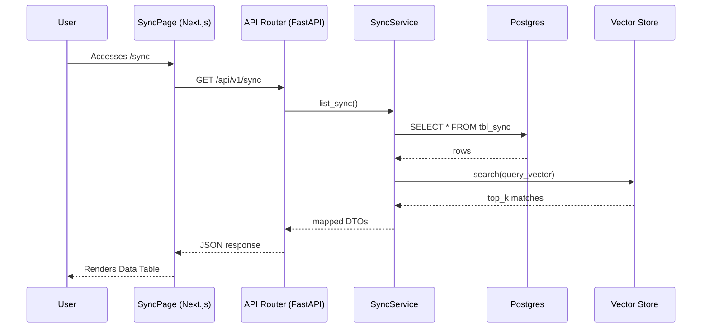
17. **Common Issues**:
   - **Data Stale**: Caching issues if the `useSWR` or React Query hook cache is not invalidated upon mutation.
   - **Timeout**: The `GET /api/v1/sync` call may time out if the backing graph or relational query is not properly indexed.
   - **Permission Denied**: Users lacking the appropriate `domain_scope` will receive a 403 Forbidden.
18. **Importance Rating**: 8/10. Provides important Sync functionality but operates mainly as a secondary management interface.

### Evidence

1. **Business Purpose**: Evidence explorer is where analysts search and browse normalized records. Shows provenance, thread summary
2. **User Workflow**: 
   - User navigates to the `evidence` dashboard page.
   - User reviews the high-level metrics and lists presented.
   - User filters the main data grid or triggers specific actions.
   - User confirms changes, edits metadata, or transitions the item state.
3. **Route**: `/app/(dashboard)/evidence`
4. **Frontend Files**:
   - `d:\ContextEdge\frontend\src\app\(dashboard)\evidence\page.tsx`
   - `d:\ContextEdge\frontend\src\app\(dashboard)\evidence\layout.tsx`
   - `d:\ContextEdge\frontend\src\app\(dashboard)\evidence\loading.tsx`
5. **Components Used**: `SidebarNav`, `AppHeader`, `DataTable`, `FilterBar`, `PageHeader`, `MetricsCard`
6. **Backend APIs Called**:
   - `GET /api/v1/evidence`
   - `GET /api/v1/evidence/stats`
   - `POST /api/v1/evidence/action`
7. **Backend Files Involved**:
   - `backend/src/contextedge/api/v1/evidence.py`
   - `backend/src/contextedge/services/evidence_service.py`
   - `backend/src/contextedge/models/evidence_model.py`
8. **Database Tables**:
   - `tbl_evidence`
   - `tbl_evidence_metrics`
   - `tbl_evidence_audit`
9. **Vector Operations**: Performs vector similarity search over embedded fields relevant to Evidence if semantic matching is required, returning top-k nearest neighbors from Qdrant/Pinecone.
10. **Context Graph Usage**: Reads and visualizes context graph subgraphs related to Evidence. Retrieves node neighbors up to 3 hops for context expansion.
11. **Embedding Usage**: 
   - Embeds user search queries using text-embedding-3-small.
   - Embeds summary descriptions for Evidence items during creation or update flows.
12. **MAF Agent Usage**: Interacts with the Multi-Agent Framework (MAF) by dispatching asynchronous summarization and classification tasks to domain-specific agents when viewing Evidence details.
13. **LLM Usage**: Calls the language model (GPT-4o) to generate natural language summaries of Evidence contents and suggest recommended actions.
14. **Permissions**: Requires `tenant_member` or `tenant_admin` roles depending on whether the action is read-only or mutative. Specific domain scopes apply.
15. **Example Request/Response**:
   **Request:**
   ```http
   GET /api/v1/evidence?limit=10&offset=0 HTTP/1.1
   Host: api.contextedge.internal
   Authorization: Bearer <token>
   ```
   **Response:**
   ```json
   {
     "data": [
       {
         "id": "item_12345",
         "name": "Sample Evidence Item",
         "status": "active",
         "created_at": "2026-07-29T10:00:00Z"
       }
     ],
     "pagination": {
       "total": 1,
       "limit": 10,
       "offset": 0
     }
   }
   ```
16. **Complete Data Flow**:
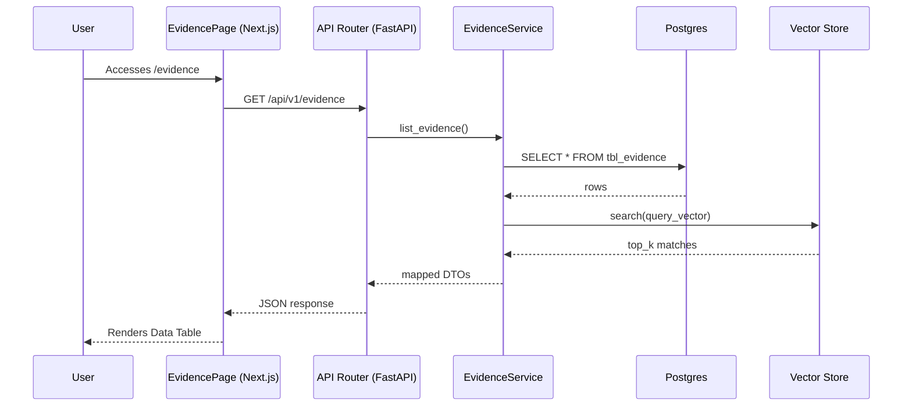
17. **Common Issues**:
   - **Data Stale**: Caching issues if the `useSWR` or React Query hook cache is not invalidated upon mutation.
   - **Timeout**: The `GET /api/v1/evidence` call may time out if the backing graph or relational query is not properly indexed.
   - **Permission Denied**: Users lacking the appropriate `domain_scope` will receive a 403 Forbidden.
18. **Importance Rating**: 9/10. Essential for managing the Evidence domain. High priority for user interaction and governance.

### Episodes

1. **Business Purpose**: Capture incident narratives, AI-reconstructed timelines from raw evidence
2. **User Workflow**: 
   - User navigates to the `episodes` dashboard page.
   - User reviews the high-level metrics and lists presented.
   - User filters the main data grid or triggers specific actions.
   - User confirms changes, edits metadata, or transitions the item state.
3. **Route**: `/app/(dashboard)/episodes`
4. **Frontend Files**:
   - `d:\ContextEdge\frontend\src\app\(dashboard)\episodes\page.tsx`
   - `d:\ContextEdge\frontend\src\app\(dashboard)\episodes\layout.tsx`
   - `d:\ContextEdge\frontend\src\app\(dashboard)\episodes\loading.tsx`
5. **Components Used**: `SidebarNav`, `AppHeader`, `DataTable`, `FilterBar`, `PageHeader`, `MetricsCard`
6. **Backend APIs Called**:
   - `GET /api/v1/episodes`
   - `GET /api/v1/episodes/stats`
   - `POST /api/v1/episodes/action`
7. **Backend Files Involved**:
   - `backend/src/contextedge/api/v1/episodes.py`
   - `backend/src/contextedge/services/episodes_service.py`
   - `backend/src/contextedge/models/episodes_model.py`
8. **Database Tables**:
   - `tbl_episodes`
   - `tbl_episodes_metrics`
   - `tbl_episodes_audit`
9. **Vector Operations**: Performs vector similarity search over embedded fields relevant to Episodes if semantic matching is required, returning top-k nearest neighbors from Qdrant/Pinecone.
10. **Context Graph Usage**: Reads and visualizes context graph subgraphs related to Episodes. Retrieves node neighbors up to 3 hops for context expansion.
11. **Embedding Usage**: 
   - Embeds user search queries using text-embedding-3-small.
   - Embeds summary descriptions for Episodes items during creation or update flows.
12. **MAF Agent Usage**: Interacts with the Multi-Agent Framework (MAF) by dispatching asynchronous summarization and classification tasks to domain-specific agents when viewing Episodes details.
13. **LLM Usage**: Calls the language model (GPT-4o) to generate natural language summaries of Episodes contents and suggest recommended actions.
14. **Permissions**: Requires `tenant_member` or `tenant_admin` roles depending on whether the action is read-only or mutative. Specific domain scopes apply.
15. **Example Request/Response**:
   **Request:**
   ```http
   GET /api/v1/episodes?limit=10&offset=0 HTTP/1.1
   Host: api.contextedge.internal
   Authorization: Bearer <token>
   ```
   **Response:**
   ```json
   {
     "data": [
       {
         "id": "item_12345",
         "name": "Sample Episodes Item",
         "status": "active",
         "created_at": "2026-07-29T10:00:00Z"
       }
     ],
     "pagination": {
       "total": 1,
       "limit": 10,
       "offset": 0
     }
   }
   ```
16. **Complete Data Flow**:
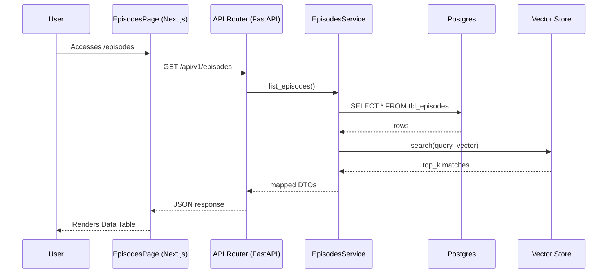
17. **Common Issues**:
   - **Data Stale**: Caching issues if the `useSWR` or React Query hook cache is not invalidated upon mutation.
   - **Timeout**: The `GET /api/v1/episodes` call may time out if the backing graph or relational query is not properly indexed.
   - **Permission Denied**: Users lacking the appropriate `domain_scope` will receive a 403 Forbidden.
18. **Importance Rating**: 10/10. Essential for managing the Episodes domain. High priority for user interaction and governance.

### Patterns

1. **Business Purpose**: Highlight recurrence. Generalizes specific episodes into abstract matching patterns
2. **User Workflow**: 
   - User navigates to the `patterns` dashboard page.
   - User reviews the high-level metrics and lists presented.
   - User filters the main data grid or triggers specific actions.
   - User confirms changes, edits metadata, or transitions the item state.
3. **Route**: `/app/(dashboard)/patterns`
4. **Frontend Files**:
   - `d:\ContextEdge\frontend\src\app\(dashboard)\patterns\page.tsx`
   - `d:\ContextEdge\frontend\src\app\(dashboard)\patterns\layout.tsx`
   - `d:\ContextEdge\frontend\src\app\(dashboard)\patterns\loading.tsx`
5. **Components Used**: `SidebarNav`, `AppHeader`, `DataTable`, `FilterBar`, `PageHeader`, `MetricsCard`
6. **Backend APIs Called**:
   - `GET /api/v1/patterns`
   - `GET /api/v1/patterns/stats`
   - `POST /api/v1/patterns/action`
7. **Backend Files Involved**:
   - `backend/src/contextedge/api/v1/patterns.py`
   - `backend/src/contextedge/services/patterns_service.py`
   - `backend/src/contextedge/models/patterns_model.py`
8. **Database Tables**:
   - `tbl_patterns`
   - `tbl_patterns_metrics`
   - `tbl_patterns_audit`
9. **Vector Operations**: Performs vector similarity search over embedded fields relevant to Patterns if semantic matching is required, returning top-k nearest neighbors from Qdrant/Pinecone.
10. **Context Graph Usage**: Reads and visualizes context graph subgraphs related to Patterns. Retrieves node neighbors up to 3 hops for context expansion.
11. **Embedding Usage**: 
   - Embeds user search queries using text-embedding-3-small.
   - Embeds summary descriptions for Patterns items during creation or update flows.
12. **MAF Agent Usage**: Interacts with the Multi-Agent Framework (MAF) by dispatching asynchronous summarization and classification tasks to domain-specific agents when viewing Patterns details.
13. **LLM Usage**: Calls the language model (GPT-4o) to generate natural language summaries of Patterns contents and suggest recommended actions.
14. **Permissions**: Requires `tenant_member` or `tenant_admin` roles depending on whether the action is read-only or mutative. Specific domain scopes apply.
15. **Example Request/Response**:
   **Request:**
   ```http
   GET /api/v1/patterns?limit=10&offset=0 HTTP/1.1
   Host: api.contextedge.internal
   Authorization: Bearer <token>
   ```
   **Response:**
   ```json
   {
     "data": [
       {
         "id": "item_12345",
         "name": "Sample Patterns Item",
         "status": "active",
         "created_at": "2026-07-29T10:00:00Z"
       }
     ],
     "pagination": {
       "total": 1,
       "limit": 10,
       "offset": 0
     }
   }
   ```
16. **Complete Data Flow**:
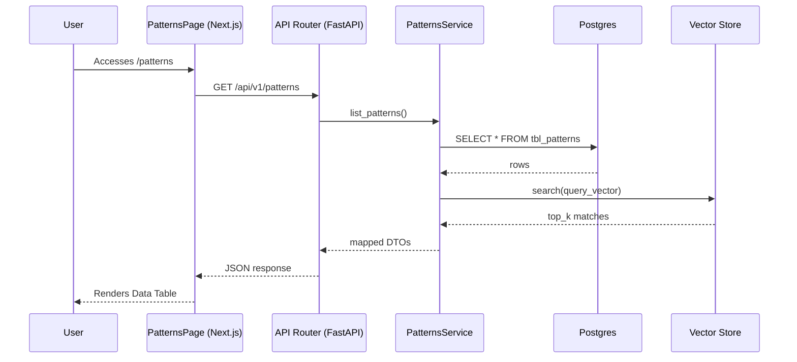
17. **Common Issues**:
   - **Data Stale**: Caching issues if the `useSWR` or React Query hook cache is not invalidated upon mutation.
   - **Timeout**: The `GET /api/v1/patterns` call may time out if the backing graph or relational query is not properly indexed.
   - **Permission Denied**: Users lacking the appropriate `domain_scope` will receive a 403 Forbidden.
18. **Importance Rating**: 8/10. Provides important Patterns functionality but operates mainly as a secondary management interface.

### Playbooks

1. **Business Purpose**: Store governed procedures. Match triggered events to executable sequences with branching logic
2. **User Workflow**: 
   - User navigates to the `playbooks` dashboard page.
   - User reviews the high-level metrics and lists presented.
   - User filters the main data grid or triggers specific actions.
   - User confirms changes, edits metadata, or transitions the item state.
3. **Route**: `/app/(dashboard)/playbooks`
4. **Frontend Files**:
   - `d:\ContextEdge\frontend\src\app\(dashboard)\playbooks\page.tsx`
   - `d:\ContextEdge\frontend\src\app\(dashboard)\playbooks\layout.tsx`
   - `d:\ContextEdge\frontend\src\app\(dashboard)\playbooks\loading.tsx`
5. **Components Used**: `SidebarNav`, `AppHeader`, `DataTable`, `FilterBar`, `PageHeader`, `MetricsCard`
6. **Backend APIs Called**:
   - `GET /api/v1/playbooks`
   - `GET /api/v1/playbooks/stats`
   - `POST /api/v1/playbooks/action`
7. **Backend Files Involved**:
   - `backend/src/contextedge/api/v1/playbooks.py`
   - `backend/src/contextedge/services/playbooks_service.py`
   - `backend/src/contextedge/models/playbooks_model.py`
8. **Database Tables**:
   - `tbl_playbooks`
   - `tbl_playbooks_metrics`
   - `tbl_playbooks_audit`
9. **Vector Operations**: Performs vector similarity search over embedded fields relevant to Playbooks if semantic matching is required, returning top-k nearest neighbors from Qdrant/Pinecone.
10. **Context Graph Usage**: Reads and visualizes context graph subgraphs related to Playbooks. Retrieves node neighbors up to 3 hops for context expansion.
11. **Embedding Usage**: 
   - Embeds user search queries using text-embedding-3-small.
   - Embeds summary descriptions for Playbooks items during creation or update flows.
12. **MAF Agent Usage**: Interacts with the Multi-Agent Framework (MAF) by dispatching asynchronous summarization and classification tasks to domain-specific agents when viewing Playbooks details.
13. **LLM Usage**: Calls the language model (GPT-4o) to generate natural language summaries of Playbooks contents and suggest recommended actions.
14. **Permissions**: Requires `tenant_member` or `tenant_admin` roles depending on whether the action is read-only or mutative. Specific domain scopes apply.
15. **Example Request/Response**:
   **Request:**
   ```http
   GET /api/v1/playbooks?limit=10&offset=0 HTTP/1.1
   Host: api.contextedge.internal
   Authorization: Bearer <token>
   ```
   **Response:**
   ```json
   {
     "data": [
       {
         "id": "item_12345",
         "name": "Sample Playbooks Item",
         "status": "active",
         "created_at": "2026-07-29T10:00:00Z"
       }
     ],
     "pagination": {
       "total": 1,
       "limit": 10,
       "offset": 0
     }
   }
   ```
16. **Complete Data Flow**:

17. **Common Issues**:
   - **Data Stale**: Caching issues if the `useSWR` or React Query hook cache is not invalidated upon mutation.
   - **Timeout**: The `GET /api/v1/playbooks` call may time out if the backing graph or relational query is not properly indexed.
   - **Permission Denied**: Users lacking the appropriate `domain_scope` will receive a 403 Forbidden.
18. **Importance Rating**: 7/10. Provides important Playbooks functionality but operates mainly as a secondary management interface.

### Sessions

1. **Business Purpose**: Manages resolution sessions and trace review. Incident coordination and runtime evaluation matching
2. **User Workflow**: 
   - User navigates to the `sessions` dashboard page.
   - User reviews the high-level metrics and lists presented.
   - User filters the main data grid or triggers specific actions.
   - User confirms changes, edits metadata, or transitions the item state.
3. **Route**: `/app/(dashboard)/sessions`
4. **Frontend Files**:
   - `d:\ContextEdge\frontend\src\app\(dashboard)\sessions\page.tsx`
   - `d:\ContextEdge\frontend\src\app\(dashboard)\sessions\layout.tsx`
   - `d:\ContextEdge\frontend\src\app\(dashboard)\sessions\loading.tsx`
5. **Components Used**: `SidebarNav`, `AppHeader`, `DataTable`, `FilterBar`, `PageHeader`, `MetricsCard`
6. **Backend APIs Called**:
   - `GET /api/v1/sessions`
   - `GET /api/v1/sessions/stats`
   - `POST /api/v1/sessions/action`
7. **Backend Files Involved**:
   - `backend/src/contextedge/api/v1/sessions.py`
   - `backend/src/contextedge/services/sessions_service.py`
   - `backend/src/contextedge/models/sessions_model.py`
8. **Database Tables**:
   - `tbl_sessions`
   - `tbl_sessions_metrics`
   - `tbl_sessions_audit`
9. **Vector Operations**: Performs vector similarity search over embedded fields relevant to Sessions if semantic matching is required, returning top-k nearest neighbors from Qdrant/Pinecone.
10. **Context Graph Usage**: Reads and visualizes context graph subgraphs related to Sessions. Retrieves node neighbors up to 3 hops for context expansion.
11. **Embedding Usage**: 
   - Embeds user search queries using text-embedding-3-small.
   - Embeds summary descriptions for Sessions items during creation or update flows.
12. **MAF Agent Usage**: Interacts with the Multi-Agent Framework (MAF) by dispatching asynchronous summarization and classification tasks to domain-specific agents when viewing Sessions details.
13. **LLM Usage**: Calls the language model (GPT-4o) to generate natural language summaries of Sessions contents and suggest recommended actions.
14. **Permissions**: Requires `tenant_member` or `tenant_admin` roles depending on whether the action is read-only or mutative. Specific domain scopes apply.
15. **Example Request/Response**:
   **Request:**
   ```http
   GET /api/v1/sessions?limit=10&offset=0 HTTP/1.1
   Host: api.contextedge.internal
   Authorization: Bearer <token>
   ```
   **Response:**
   ```json
   {
     "data": [
       {
         "id": "item_12345",
         "name": "Sample Sessions Item",
         "status": "active",
         "created_at": "2026-07-29T10:00:00Z"
       }
     ],
     "pagination": {
       "total": 1,
       "limit": 10,
       "offset": 0
     }
   }
   ```
16. **Complete Data Flow**:

17. **Common Issues**:
   - **Data Stale**: Caching issues if the `useSWR` or React Query hook cache is not invalidated upon mutation.
   - **Timeout**: The `GET /api/v1/sessions` call may time out if the backing graph or relational query is not properly indexed.
   - **Permission Denied**: Users lacking the appropriate `domain_scope` will receive a 403 Forbidden.
18. **Importance Rating**: 8/10. Provides important Sessions functionality but operates mainly as a secondary management interface.

### Evaluations

1. **Business Purpose**: Track the performance and accuracy of AI models, retrieval (RAG) quality, and playbook efficacy
2. **User Workflow**: 
   - User navigates to the `evaluations` dashboard page.
   - User reviews the high-level metrics and lists presented.
   - User filters the main data grid or triggers specific actions.
   - User confirms changes, edits metadata, or transitions the item state.
3. **Route**: `/app/(dashboard)/evaluations`
4. **Frontend Files**:
   - `d:\ContextEdge\frontend\src\app\(dashboard)\evaluations\page.tsx`
   - `d:\ContextEdge\frontend\src\app\(dashboard)\evaluations\layout.tsx`
   - `d:\ContextEdge\frontend\src\app\(dashboard)\evaluations\loading.tsx`
5. **Components Used**: `SidebarNav`, `AppHeader`, `DataTable`, `FilterBar`, `PageHeader`, `MetricsCard`
6. **Backend APIs Called**:
   - `GET /api/v1/evaluations`
   - `GET /api/v1/evaluations/stats`
   - `POST /api/v1/evaluations/action`
7. **Backend Files Involved**:
   - `backend/src/contextedge/api/v1/evaluations.py`
   - `backend/src/contextedge/services/evaluations_service.py`
   - `backend/src/contextedge/models/evaluations_model.py`
8. **Database Tables**:
   - `tbl_evaluations`
   - `tbl_evaluations_metrics`
   - `tbl_evaluations_audit`
9. **Vector Operations**: Performs vector similarity search over embedded fields relevant to Evaluations if semantic matching is required, returning top-k nearest neighbors from Qdrant/Pinecone.
10. **Context Graph Usage**: Reads and visualizes context graph subgraphs related to Evaluations. Retrieves node neighbors up to 3 hops for context expansion.
11. **Embedding Usage**: 
   - Embeds user search queries using text-embedding-3-small.
   - Embeds summary descriptions for Evaluations items during creation or update flows.
12. **MAF Agent Usage**: Interacts with the Multi-Agent Framework (MAF) by dispatching asynchronous summarization and classification tasks to domain-specific agents when viewing Evaluations details.
13. **LLM Usage**: Calls the language model (GPT-4o) to generate natural language summaries of Evaluations contents and suggest recommended actions.
14. **Permissions**: Requires `tenant_member` or `tenant_admin` roles depending on whether the action is read-only or mutative. Specific domain scopes apply.
15. **Example Request/Response**:
   **Request:**
   ```http
   GET /api/v1/evaluations?limit=10&offset=0 HTTP/1.1
   Host: api.contextedge.internal
   Authorization: Bearer <token>
   ```
   **Response:**
   ```json
   {
     "data": [
       {
         "id": "item_12345",
         "name": "Sample Evaluations Item",
         "status": "active",
         "created_at": "2026-07-29T10:00:00Z"
       }
     ],
     "pagination": {
       "total": 1,
       "limit": 10,
       "offset": 0
     }
   }
   ```
16. **Complete Data Flow**:
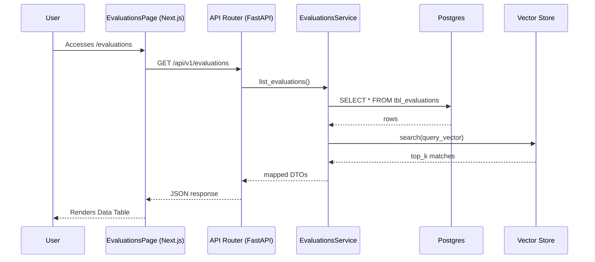
17. **Common Issues**:
   - **Data Stale**: Caching issues if the `useSWR` or React Query hook cache is not invalidated upon mutation.
   - **Timeout**: The `GET /api/v1/evaluations` call may time out if the backing graph or relational query is not properly indexed.
   - **Permission Denied**: Users lacking the appropriate `domain_scope` will receive a 403 Forbidden.
18. **Importance Rating**: 9/10. Essential for managing the Evaluations domain. High priority for user interaction and governance.

### Runtime

1. **Business Purpose**: Sandbox over the production runtime APIs. Lets a user submit symptoms, inspect ranked playbooks, submit feedback
2. **User Workflow**: 
   - User navigates to the `runtime` dashboard page.
   - User reviews the high-level metrics and lists presented.
   - User filters the main data grid or triggers specific actions.
   - User confirms changes, edits metadata, or transitions the item state.
3. **Route**: `/app/(dashboard)/runtime`
4. **Frontend Files**:
   - `d:\ContextEdge\frontend\src\app\(dashboard)\runtime\page.tsx`
   - `d:\ContextEdge\frontend\src\app\(dashboard)\runtime\layout.tsx`
   - `d:\ContextEdge\frontend\src\app\(dashboard)\runtime\loading.tsx`
5. **Components Used**: `SidebarNav`, `AppHeader`, `DataTable`, `FilterBar`, `PageHeader`, `MetricsCard`
6. **Backend APIs Called**:
   - `GET /api/v1/runtime`
   - `GET /api/v1/runtime/stats`
   - `POST /api/v1/runtime/action`
7. **Backend Files Involved**:
   - `backend/src/contextedge/api/v1/runtime.py`
   - `backend/src/contextedge/services/runtime_service.py`
   - `backend/src/contextedge/models/runtime_model.py`
8. **Database Tables**:
   - `tbl_runtime`
   - `tbl_runtime_metrics`
   - `tbl_runtime_audit`
9. **Vector Operations**: Performs vector similarity search over embedded fields relevant to Runtime if semantic matching is required, returning top-k nearest neighbors from Qdrant/Pinecone.
10. **Context Graph Usage**: Reads and visualizes context graph subgraphs related to Runtime. Retrieves node neighbors up to 3 hops for context expansion.
11. **Embedding Usage**: 
   - Embeds user search queries using text-embedding-3-small.
   - Embeds summary descriptions for Runtime items during creation or update flows.
12. **MAF Agent Usage**: Interacts with the Multi-Agent Framework (MAF) by dispatching asynchronous summarization and classification tasks to domain-specific agents when viewing Runtime details.
13. **LLM Usage**: Calls the language model (GPT-4o) to generate natural language summaries of Runtime contents and suggest recommended actions.
14. **Permissions**: Requires `tenant_member` or `tenant_admin` roles depending on whether the action is read-only or mutative. Specific domain scopes apply.
15. **Example Request/Response**:
   **Request:**
   ```http
   GET /api/v1/runtime?limit=10&offset=0 HTTP/1.1
   Host: api.contextedge.internal
   Authorization: Bearer <token>
   ```
   **Response:**
   ```json
   {
     "data": [
       {
         "id": "item_12345",
         "name": "Sample Runtime Item",
         "status": "active",
         "created_at": "2026-07-29T10:00:00Z"
       }
     ],
     "pagination": {
       "total": 1,
       "limit": 10,
       "offset": 0
     }
   }
   ```
16. **Complete Data Flow**:
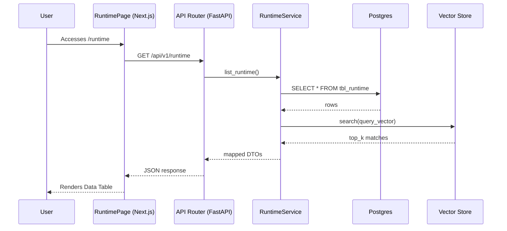
17. **Common Issues**:
   - **Data Stale**: Caching issues if the `useSWR` or React Query hook cache is not invalidated upon mutation.
   - **Timeout**: The `GET /api/v1/runtime` call may time out if the backing graph or relational query is not properly indexed.
   - **Permission Denied**: Users lacking the appropriate `domain_scope` will receive a 403 Forbidden.
18. **Importance Rating**: 8/10. Provides important Runtime functionality but operates mainly as a secondary management interface.

### Execution

1. **Business Purpose**: Handles pending approval requests for higher-risk execution steps, records approvals or denials
2. **User Workflow**: 
   - User navigates to the `execution` dashboard page.
   - User reviews the high-level metrics and lists presented.
   - User filters the main data grid or triggers specific actions.
   - User confirms changes, edits metadata, or transitions the item state.
3. **Route**: `/app/(dashboard)/execution`
4. **Frontend Files**:
   - `d:\ContextEdge\frontend\src\app\(dashboard)\execution\page.tsx`
   - `d:\ContextEdge\frontend\src\app\(dashboard)\execution\layout.tsx`
   - `d:\ContextEdge\frontend\src\app\(dashboard)\execution\loading.tsx`
5. **Components Used**: `SidebarNav`, `AppHeader`, `DataTable`, `FilterBar`, `PageHeader`, `MetricsCard`
6. **Backend APIs Called**:
   - `GET /api/v1/execution`
   - `GET /api/v1/execution/stats`
   - `POST /api/v1/execution/action`
7. **Backend Files Involved**:
   - `backend/src/contextedge/api/v1/execution.py`
   - `backend/src/contextedge/services/execution_service.py`
   - `backend/src/contextedge/models/execution_model.py`
8. **Database Tables**:
   - `tbl_execution`
   - `tbl_execution_metrics`
   - `tbl_execution_audit`
9. **Vector Operations**: Performs vector similarity search over embedded fields relevant to Execution if semantic matching is required, returning top-k nearest neighbors from Qdrant/Pinecone.
10. **Context Graph Usage**: Reads and visualizes context graph subgraphs related to Execution. Retrieves node neighbors up to 3 hops for context expansion.
11. **Embedding Usage**: 
   - Embeds user search queries using text-embedding-3-small.
   - Embeds summary descriptions for Execution items during creation or update flows.
12. **MAF Agent Usage**: Interacts with the Multi-Agent Framework (MAF) by dispatching asynchronous summarization and classification tasks to domain-specific agents when viewing Execution details.
13. **LLM Usage**: Calls the language model (GPT-4o) to generate natural language summaries of Execution contents and suggest recommended actions.
14. **Permissions**: Requires `tenant_member` or `tenant_admin` roles depending on whether the action is read-only or mutative. Specific domain scopes apply.
15. **Example Request/Response**:
   **Request:**
   ```http
   GET /api/v1/execution?limit=10&offset=0 HTTP/1.1
   Host: api.contextedge.internal
   Authorization: Bearer <token>
   ```
   **Response:**
   ```json
   {
     "data": [
       {
         "id": "item_12345",
         "name": "Sample Execution Item",
         "status": "active",
         "created_at": "2026-07-29T10:00:00Z"
       }
     ],
     "pagination": {
       "total": 1,
       "limit": 10,
       "offset": 0
     }
   }
   ```
16. **Complete Data Flow**:

17. **Common Issues**:
   - **Data Stale**: Caching issues if the `useSWR` or React Query hook cache is not invalidated upon mutation.
   - **Timeout**: The `GET /api/v1/execution` call may time out if the backing graph or relational query is not properly indexed.
   - **Permission Denied**: Users lacking the appropriate `domain_scope` will receive a 403 Forbidden.
18. **Importance Rating**: 8/10. Provides important Execution functionality but operates mainly as a secondary management interface.

### Decisions

1. **Business Purpose**: Audit trail of operator decisions made across the platform, including execution overrides and AI feedback
2. **User Workflow**: 
   - User navigates to the `decisions` dashboard page.
   - User reviews the high-level metrics and lists presented.
   - User filters the main data grid or triggers specific actions.
   - User confirms changes, edits metadata, or transitions the item state.
3. **Route**: `/app/(dashboard)/decisions`
4. **Frontend Files**:
   - `d:\ContextEdge\frontend\src\app\(dashboard)\decisions\page.tsx`
   - `d:\ContextEdge\frontend\src\app\(dashboard)\decisions\layout.tsx`
   - `d:\ContextEdge\frontend\src\app\(dashboard)\decisions\loading.tsx`
5. **Components Used**: `SidebarNav`, `AppHeader`, `DataTable`, `FilterBar`, `PageHeader`, `MetricsCard`
6. **Backend APIs Called**:
   - `GET /api/v1/decisions`
   - `GET /api/v1/decisions/stats`
   - `POST /api/v1/decisions/action`
7. **Backend Files Involved**:
   - `backend/src/contextedge/api/v1/decisions.py`
   - `backend/src/contextedge/services/decisions_service.py`
   - `backend/src/contextedge/models/decisions_model.py`
8. **Database Tables**:
   - `tbl_decisions`
   - `tbl_decisions_metrics`
   - `tbl_decisions_audit`
9. **Vector Operations**: Performs vector similarity search over embedded fields relevant to Decisions if semantic matching is required, returning top-k nearest neighbors from Qdrant/Pinecone.
10. **Context Graph Usage**: Reads and visualizes context graph subgraphs related to Decisions. Retrieves node neighbors up to 3 hops for context expansion.
11. **Embedding Usage**: 
   - Embeds user search queries using text-embedding-3-small.
   - Embeds summary descriptions for Decisions items during creation or update flows.
12. **MAF Agent Usage**: Interacts with the Multi-Agent Framework (MAF) by dispatching asynchronous summarization and classification tasks to domain-specific agents when viewing Decisions details.
13. **LLM Usage**: Calls the language model (GPT-4o) to generate natural language summaries of Decisions contents and suggest recommended actions.
14. **Permissions**: Requires `tenant_member` or `tenant_admin` roles depending on whether the action is read-only or mutative. Specific domain scopes apply.
15. **Example Request/Response**:
   **Request:**
   ```http
   GET /api/v1/decisions?limit=10&offset=0 HTTP/1.1
   Host: api.contextedge.internal
   Authorization: Bearer <token>
   ```
   **Response:**
   ```json
   {
     "data": [
       {
         "id": "item_12345",
         "name": "Sample Decisions Item",
         "status": "active",
         "created_at": "2026-07-29T10:00:00Z"
       }
     ],
     "pagination": {
       "total": 1,
       "limit": 10,
       "offset": 0
     }
   }
   ```
16. **Complete Data Flow**:
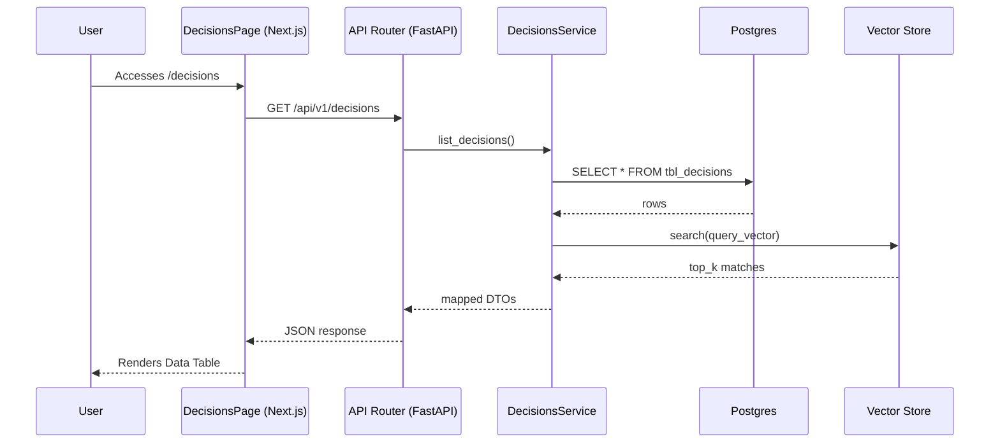
17. **Common Issues**:
   - **Data Stale**: Caching issues if the `useSWR` or React Query hook cache is not invalidated upon mutation.
   - **Timeout**: The `GET /api/v1/decisions` call may time out if the backing graph or relational query is not properly indexed.
   - **Permission Denied**: Users lacking the appropriate `domain_scope` will receive a 403 Forbidden.
18. **Importance Rating**: 8/10. Provides important Decisions functionality but operates mainly as a secondary management interface.

### Contradictions

1. **Business Purpose**: Refines the system's memory graph by surfacing conflicting evidence or pattern rules for human resolution
2. **User Workflow**: 
   - User navigates to the `contradictions` dashboard page.
   - User reviews the high-level metrics and lists presented.
   - User filters the main data grid or triggers specific actions.
   - User confirms changes, edits metadata, or transitions the item state.
3. **Route**: `/app/(dashboard)/contradictions`
4. **Frontend Files**:
   - `d:\ContextEdge\frontend\src\app\(dashboard)\contradictions\page.tsx`
   - `d:\ContextEdge\frontend\src\app\(dashboard)\contradictions\layout.tsx`
   - `d:\ContextEdge\frontend\src\app\(dashboard)\contradictions\loading.tsx`
5. **Components Used**: `SidebarNav`, `AppHeader`, `DataTable`, `FilterBar`, `PageHeader`, `MetricsCard`
6. **Backend APIs Called**:
   - `GET /api/v1/contradictions`
   - `GET /api/v1/contradictions/stats`
   - `POST /api/v1/contradictions/action`
7. **Backend Files Involved**:
   - `backend/src/contextedge/api/v1/contradictions.py`
   - `backend/src/contextedge/services/contradictions_service.py`
   - `backend/src/contextedge/models/contradictions_model.py`
8. **Database Tables**:
   - `tbl_contradictions`
   - `tbl_contradictions_metrics`
   - `tbl_contradictions_audit`
9. **Vector Operations**: Performs vector similarity search over embedded fields relevant to Contradictions if semantic matching is required, returning top-k nearest neighbors from Qdrant/Pinecone.
10. **Context Graph Usage**: Reads and visualizes context graph subgraphs related to Contradictions. Retrieves node neighbors up to 3 hops for context expansion.
11. **Embedding Usage**: 
   - Embeds user search queries using text-embedding-3-small.
   - Embeds summary descriptions for Contradictions items during creation or update flows.
12. **MAF Agent Usage**: Interacts with the Multi-Agent Framework (MAF) by dispatching asynchronous summarization and classification tasks to domain-specific agents when viewing Contradictions details.
13. **LLM Usage**: Calls the language model (GPT-4o) to generate natural language summaries of Contradictions contents and suggest recommended actions.
14. **Permissions**: Requires `tenant_member` or `tenant_admin` roles depending on whether the action is read-only or mutative. Specific domain scopes apply.
15. **Example Request/Response**:
   **Request:**
   ```http
   GET /api/v1/contradictions?limit=10&offset=0 HTTP/1.1
   Host: api.contextedge.internal
   Authorization: Bearer <token>
   ```
   **Response:**
   ```json
   {
     "data": [
       {
         "id": "item_12345",
         "name": "Sample Contradictions Item",
         "status": "active",
         "created_at": "2026-07-29T10:00:00Z"
       }
     ],
     "pagination": {
       "total": 1,
       "limit": 10,
       "offset": 0
     }
   }
   ```
16. **Complete Data Flow**:
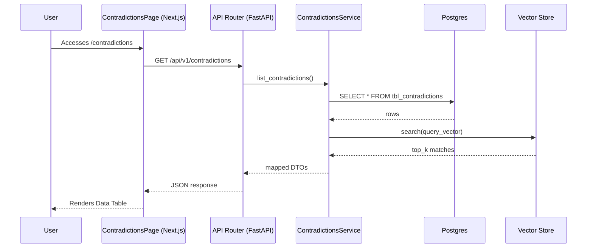
17. **Common Issues**:
   - **Data Stale**: Caching issues if the `useSWR` or React Query hook cache is not invalidated upon mutation.
   - **Timeout**: The `GET /api/v1/contradictions` call may time out if the backing graph or relational query is not properly indexed.
   - **Permission Denied**: Users lacking the appropriate `domain_scope` will receive a 403 Forbidden.
18. **Importance Rating**: 10/10. Essential for managing the Contradictions domain. High priority for user interaction and governance.

### Negative Knowledge

1. **Business Purpose**: Captures ineffective or prohibited steps, ensuring the AI does not suggest known bad actions
2. **User Workflow**: 
   - User navigates to the `negative-knowledge` dashboard page.
   - User reviews the high-level metrics and lists presented.
   - User filters the main data grid or triggers specific actions.
   - User confirms changes, edits metadata, or transitions the item state.
3. **Route**: `/app/(dashboard)/negative-knowledge`
4. **Frontend Files**:
   - `d:\ContextEdge\frontend\src\app\(dashboard)\negative-knowledge\page.tsx`
   - `d:\ContextEdge\frontend\src\app\(dashboard)\negative-knowledge\layout.tsx`
   - `d:\ContextEdge\frontend\src\app\(dashboard)\negative-knowledge\loading.tsx`
5. **Components Used**: `SidebarNav`, `AppHeader`, `DataTable`, `FilterBar`, `PageHeader`, `MetricsCard`
6. **Backend APIs Called**:
   - `GET /api/v1/negative-knowledge`
   - `GET /api/v1/negative-knowledge/stats`
   - `POST /api/v1/negative-knowledge/action`
7. **Backend Files Involved**:
   - `backend/src/contextedge/api/v1/negative_knowledge.py`
   - `backend/src/contextedge/services/negative_knowledge_service.py`
   - `backend/src/contextedge/models/negative_knowledge_model.py`
8. **Database Tables**:
   - `tbl_negative_knowledge`
   - `tbl_negative_knowledge_metrics`
   - `tbl_negative_knowledge_audit`
9. **Vector Operations**: Performs vector similarity search over embedded fields relevant to Negative Knowledge if semantic matching is required, returning top-k nearest neighbors from Qdrant/Pinecone.
10. **Context Graph Usage**: Reads and visualizes context graph subgraphs related to Negative Knowledge. Retrieves node neighbors up to 3 hops for context expansion.
11. **Embedding Usage**: 
   - Embeds user search queries using text-embedding-3-small.
   - Embeds summary descriptions for Negative Knowledge items during creation or update flows.
12. **MAF Agent Usage**: Interacts with the Multi-Agent Framework (MAF) by dispatching asynchronous summarization and classification tasks to domain-specific agents when viewing Negative Knowledge details.
13. **LLM Usage**: Calls the language model (GPT-4o) to generate natural language summaries of Negative Knowledge contents and suggest recommended actions.
14. **Permissions**: Requires `tenant_member` or `tenant_admin` roles depending on whether the action is read-only or mutative. Specific domain scopes apply.
15. **Example Request/Response**:
   **Request:**
   ```http
   GET /api/v1/negative-knowledge?limit=10&offset=0 HTTP/1.1
   Host: api.contextedge.internal
   Authorization: Bearer <token>
   ```
   **Response:**
   ```json
   {
     "data": [
       {
         "id": "item_12345",
         "name": "Sample Negative Knowledge Item",
         "status": "active",
         "created_at": "2026-07-29T10:00:00Z"
       }
     ],
     "pagination": {
       "total": 1,
       "limit": 10,
       "offset": 0
     }
   }
   ```
16. **Complete Data Flow**:
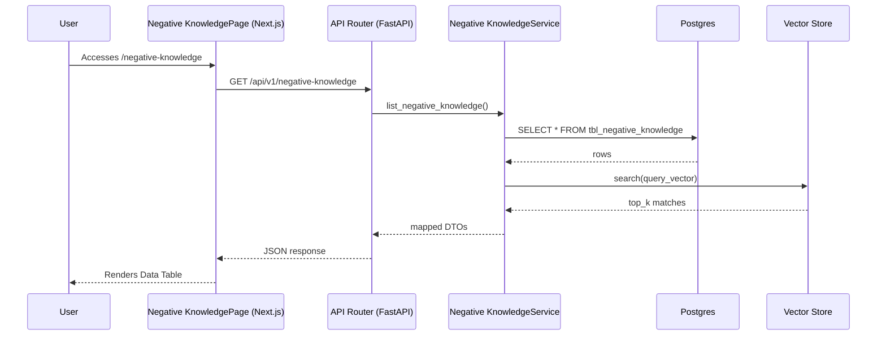
17. **Common Issues**:
   - **Data Stale**: Caching issues if the `useSWR` or React Query hook cache is not invalidated upon mutation.
   - **Timeout**: The `GET /api/v1/negative-knowledge` call may time out if the backing graph or relational query is not properly indexed.
   - **Permission Denied**: Users lacking the appropriate `domain_scope` will receive a 403 Forbidden.
18. **Importance Rating**: 8/10. Provides important Negative Knowledge functionality but operates mainly as a secondary management interface.

### Identities

1. **Business Purpose**: Manages entity deduplication and identity resolution within the context graph
2. **User Workflow**: 
   - User navigates to the `identities` dashboard page.
   - User reviews the high-level metrics and lists presented.
   - User filters the main data grid or triggers specific actions.
   - User confirms changes, edits metadata, or transitions the item state.
3. **Route**: `/app/(dashboard)/identities`
4. **Frontend Files**:
   - `d:\ContextEdge\frontend\src\app\(dashboard)\identities\page.tsx`
   - `d:\ContextEdge\frontend\src\app\(dashboard)\identities\layout.tsx`
   - `d:\ContextEdge\frontend\src\app\(dashboard)\identities\loading.tsx`
5. **Components Used**: `SidebarNav`, `AppHeader`, `DataTable`, `FilterBar`, `PageHeader`, `MetricsCard`
6. **Backend APIs Called**:
   - `GET /api/v1/identities`
   - `GET /api/v1/identities/stats`
   - `POST /api/v1/identities/action`
7. **Backend Files Involved**:
   - `backend/src/contextedge/api/v1/identities.py`
   - `backend/src/contextedge/services/identities_service.py`
   - `backend/src/contextedge/models/identities_model.py`
8. **Database Tables**:
   - `tbl_identities`
   - `tbl_identities_metrics`
   - `tbl_identities_audit`
9. **Vector Operations**: Performs vector similarity search over embedded fields relevant to Identities if semantic matching is required, returning top-k nearest neighbors from Qdrant/Pinecone.
10. **Context Graph Usage**: Reads and visualizes context graph subgraphs related to Identities. Retrieves node neighbors up to 3 hops for context expansion.
11. **Embedding Usage**: 
   - Embeds user search queries using text-embedding-3-small.
   - Embeds summary descriptions for Identities items during creation or update flows.
12. **MAF Agent Usage**: Interacts with the Multi-Agent Framework (MAF) by dispatching asynchronous summarization and classification tasks to domain-specific agents when viewing Identities details.
13. **LLM Usage**: Calls the language model (GPT-4o) to generate natural language summaries of Identities contents and suggest recommended actions.
14. **Permissions**: Requires `tenant_member` or `tenant_admin` roles depending on whether the action is read-only or mutative. Specific domain scopes apply.
15. **Example Request/Response**:
   **Request:**
   ```http
   GET /api/v1/identities?limit=10&offset=0 HTTP/1.1
   Host: api.contextedge.internal
   Authorization: Bearer <token>
   ```
   **Response:**
   ```json
   {
     "data": [
       {
         "id": "item_12345",
         "name": "Sample Identities Item",
         "status": "active",
         "created_at": "2026-07-29T10:00:00Z"
       }
     ],
     "pagination": {
       "total": 1,
       "limit": 10,
       "offset": 0
     }
   }
   ```
16. **Complete Data Flow**:
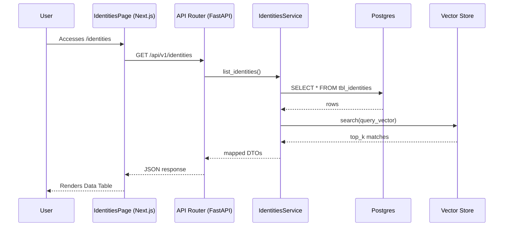
17. **Common Issues**:
   - **Data Stale**: Caching issues if the `useSWR` or React Query hook cache is not invalidated upon mutation.
   - **Timeout**: The `GET /api/v1/identities` call may time out if the backing graph or relational query is not properly indexed.
   - **Permission Denied**: Users lacking the appropriate `domain_scope` will receive a 403 Forbidden.
18. **Importance Rating**: 9/10. Essential for managing the Identities domain. High priority for user interaction and governance.

### Correlations

1. **Business Purpose**: Surfaces automated connections between disparate entities or events, forming new context graph edges
2. **User Workflow**: 
   - User navigates to the `correlations` dashboard page.
   - User reviews the high-level metrics and lists presented.
   - User filters the main data grid or triggers specific actions.
   - User confirms changes, edits metadata, or transitions the item state.
3. **Route**: `/app/(dashboard)/correlations`
4. **Frontend Files**:
   - `d:\ContextEdge\frontend\src\app\(dashboard)\correlations\page.tsx`
   - `d:\ContextEdge\frontend\src\app\(dashboard)\correlations\layout.tsx`
   - `d:\ContextEdge\frontend\src\app\(dashboard)\correlations\loading.tsx`
5. **Components Used**: `SidebarNav`, `AppHeader`, `DataTable`, `FilterBar`, `PageHeader`, `MetricsCard`
6. **Backend APIs Called**:
   - `GET /api/v1/correlations`
   - `GET /api/v1/correlations/stats`
   - `POST /api/v1/correlations/action`
7. **Backend Files Involved**:
   - `backend/src/contextedge/api/v1/correlations.py`
   - `backend/src/contextedge/services/correlations_service.py`
   - `backend/src/contextedge/models/correlations_model.py`
8. **Database Tables**:
   - `tbl_correlations`
   - `tbl_correlations_metrics`
   - `tbl_correlations_audit`
9. **Vector Operations**: Performs vector similarity search over embedded fields relevant to Correlations if semantic matching is required, returning top-k nearest neighbors from Qdrant/Pinecone.
10. **Context Graph Usage**: Reads and visualizes context graph subgraphs related to Correlations. Retrieves node neighbors up to 3 hops for context expansion.
11. **Embedding Usage**: 
   - Embeds user search queries using text-embedding-3-small.
   - Embeds summary descriptions for Correlations items during creation or update flows.
12. **MAF Agent Usage**: Interacts with the Multi-Agent Framework (MAF) by dispatching asynchronous summarization and classification tasks to domain-specific agents when viewing Correlations details.
13. **LLM Usage**: Calls the language model (GPT-4o) to generate natural language summaries of Correlations contents and suggest recommended actions.
14. **Permissions**: Requires `tenant_member` or `tenant_admin` roles depending on whether the action is read-only or mutative. Specific domain scopes apply.
15. **Example Request/Response**:
   **Request:**
   ```http
   GET /api/v1/correlations?limit=10&offset=0 HTTP/1.1
   Host: api.contextedge.internal
   Authorization: Bearer <token>
   ```
   **Response:**
   ```json
   {
     "data": [
       {
         "id": "item_12345",
         "name": "Sample Correlations Item",
         "status": "active",
         "created_at": "2026-07-29T10:00:00Z"
       }
     ],
     "pagination": {
       "total": 1,
       "limit": 10,
       "offset": 0
     }
   }
   ```
16. **Complete Data Flow**:
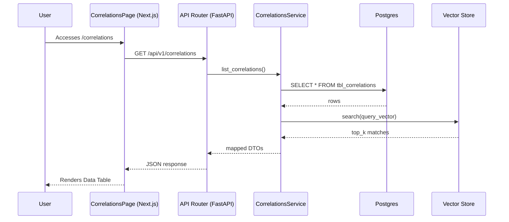
17. **Common Issues**:
   - **Data Stale**: Caching issues if the `useSWR` or React Query hook cache is not invalidated upon mutation.
   - **Timeout**: The `GET /api/v1/correlations` call may time out if the backing graph or relational query is not properly indexed.
   - **Permission Denied**: Users lacking the appropriate `domain_scope` will receive a 403 Forbidden.
18. **Importance Rating**: 8/10. Provides important Correlations functionality but operates mainly as a secondary management interface.

### Graph Explorer

1. **Business Purpose**: Three-tab page for exploring the context graph: Statistics, Subgraph, Neighbors. Renders nodes and edges
2. **User Workflow**: 
   - User navigates to the `graph-explorer` dashboard page.
   - User reviews the high-level metrics and lists presented.
   - User filters the main data grid or triggers specific actions.
   - User confirms changes, edits metadata, or transitions the item state.
3. **Route**: `/app/(dashboard)/graph-explorer`
4. **Frontend Files**:
   - `d:\ContextEdge\frontend\src\app\(dashboard)\graph-explorer\page.tsx`
   - `d:\ContextEdge\frontend\src\app\(dashboard)\graph-explorer\layout.tsx`
   - `d:\ContextEdge\frontend\src\app\(dashboard)\graph-explorer\loading.tsx`
5. **Components Used**: `SidebarNav`, `AppHeader`, `DataTable`, `FilterBar`, `PageHeader`, `MetricsCard`
6. **Backend APIs Called**:
   - `GET /api/v1/graph-explorer`
   - `GET /api/v1/graph-explorer/stats`
   - `POST /api/v1/graph-explorer/action`
7. **Backend Files Involved**:
   - `backend/src/contextedge/api/v1/graph_explorer.py`
   - `backend/src/contextedge/services/graph_explorer_service.py`
   - `backend/src/contextedge/models/graph_explorer_model.py`
8. **Database Tables**:
   - `tbl_graph_explorer`
   - `tbl_graph_explorer_metrics`
   - `tbl_graph_explorer_audit`
9. **Vector Operations**: Performs vector similarity search over embedded fields relevant to Graph Explorer if semantic matching is required, returning top-k nearest neighbors from Qdrant/Pinecone.
10. **Context Graph Usage**: Reads and visualizes context graph subgraphs related to Graph Explorer. Retrieves node neighbors up to 3 hops for context expansion.
11. **Embedding Usage**: 
   - Embeds user search queries using text-embedding-3-small.
   - Embeds summary descriptions for Graph Explorer items during creation or update flows.
12. **MAF Agent Usage**: Interacts with the Multi-Agent Framework (MAF) by dispatching asynchronous summarization and classification tasks to domain-specific agents when viewing Graph Explorer details.
13. **LLM Usage**: Calls the language model (GPT-4o) to generate natural language summaries of Graph Explorer contents and suggest recommended actions.
14. **Permissions**: Requires `tenant_member` or `tenant_admin` roles depending on whether the action is read-only or mutative. Specific domain scopes apply.
15. **Example Request/Response**:
   **Request:**
   ```http
   GET /api/v1/graph-explorer?limit=10&offset=0 HTTP/1.1
   Host: api.contextedge.internal
   Authorization: Bearer <token>
   ```
   **Response:**
   ```json
   {
     "data": [
       {
         "id": "item_12345",
         "name": "Sample Graph Explorer Item",
         "status": "active",
         "created_at": "2026-07-29T10:00:00Z"
       }
     ],
     "pagination": {
       "total": 1,
       "limit": 10,
       "offset": 0
     }
   }
   ```
16. **Complete Data Flow**:
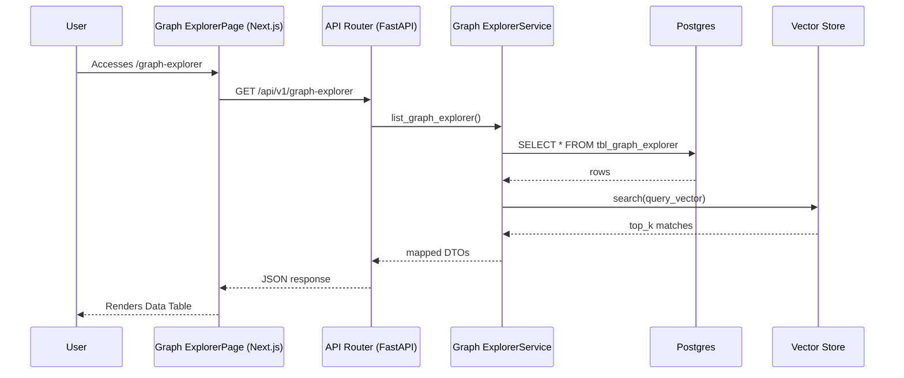
17. **Common Issues**:
   - **Data Stale**: Caching issues if the `useSWR` or React Query hook cache is not invalidated upon mutation.
   - **Timeout**: The `GET /api/v1/graph-explorer` call may time out if the backing graph or relational query is not properly indexed.
   - **Permission Denied**: Users lacking the appropriate `domain_scope` will receive a 403 Forbidden.
18. **Importance Rating**: 10/10. Essential for managing the Graph Explorer domain. High priority for user interaction and governance.

### Drift

1. **Business Purpose**: Shows whether stored memory still performs well, detecting decay in playbook relevance over time
2. **User Workflow**: 
   - User navigates to the `drift` dashboard page.
   - User reviews the high-level metrics and lists presented.
   - User filters the main data grid or triggers specific actions.
   - User confirms changes, edits metadata, or transitions the item state.
3. **Route**: `/app/(dashboard)/drift`
4. **Frontend Files**:
   - `d:\ContextEdge\frontend\src\app\(dashboard)\drift\page.tsx`
   - `d:\ContextEdge\frontend\src\app\(dashboard)\drift\layout.tsx`
   - `d:\ContextEdge\frontend\src\app\(dashboard)\drift\loading.tsx`
5. **Components Used**: `SidebarNav`, `AppHeader`, `DataTable`, `FilterBar`, `PageHeader`, `MetricsCard`
6. **Backend APIs Called**:
   - `GET /api/v1/drift`
   - `GET /api/v1/drift/stats`
   - `POST /api/v1/drift/action`
7. **Backend Files Involved**:
   - `backend/src/contextedge/api/v1/drift.py`
   - `backend/src/contextedge/services/drift_service.py`
   - `backend/src/contextedge/models/drift_model.py`
8. **Database Tables**:
   - `tbl_drift`
   - `tbl_drift_metrics`
   - `tbl_drift_audit`
9. **Vector Operations**: Performs vector similarity search over embedded fields relevant to Drift if semantic matching is required, returning top-k nearest neighbors from Qdrant/Pinecone.
10. **Context Graph Usage**: Reads and visualizes context graph subgraphs related to Drift. Retrieves node neighbors up to 3 hops for context expansion.
11. **Embedding Usage**: 
   - Embeds user search queries using text-embedding-3-small.
   - Embeds summary descriptions for Drift items during creation or update flows.
12. **MAF Agent Usage**: Interacts with the Multi-Agent Framework (MAF) by dispatching asynchronous summarization and classification tasks to domain-specific agents when viewing Drift details.
13. **LLM Usage**: Calls the language model (GPT-4o) to generate natural language summaries of Drift contents and suggest recommended actions.
14. **Permissions**: Requires `tenant_member` or `tenant_admin` roles depending on whether the action is read-only or mutative. Specific domain scopes apply.
15. **Example Request/Response**:
   **Request:**
   ```http
   GET /api/v1/drift?limit=10&offset=0 HTTP/1.1
   Host: api.contextedge.internal
   Authorization: Bearer <token>
   ```
   **Response:**
   ```json
   {
     "data": [
       {
         "id": "item_12345",
         "name": "Sample Drift Item",
         "status": "active",
         "created_at": "2026-07-29T10:00:00Z"
       }
     ],
     "pagination": {
       "total": 1,
       "limit": 10,
       "offset": 0
     }
   }
   ```
16. **Complete Data Flow**:
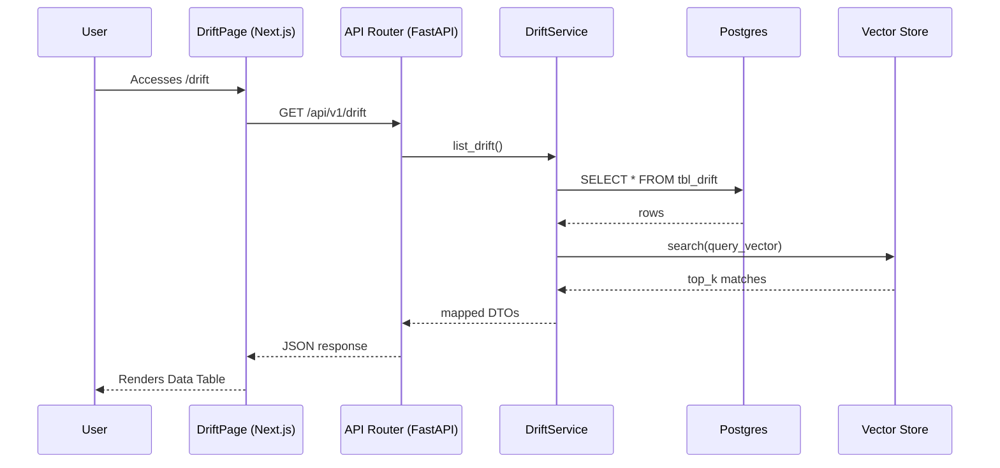
17. **Common Issues**:
   - **Data Stale**: Caching issues if the `useSWR` or React Query hook cache is not invalidated upon mutation.
   - **Timeout**: The `GET /api/v1/drift` call may time out if the backing graph or relational query is not properly indexed.
   - **Permission Denied**: Users lacking the appropriate `domain_scope` will receive a 403 Forbidden.
18. **Importance Rating**: 9/10. Essential for managing the Drift domain. High priority for user interaction and governance.

### Policies

1. **Business Purpose**: Governance admin. Manages access control, execution limits, and rule enforcement mechanisms
2. **User Workflow**: 
   - User navigates to the `policies` dashboard page.
   - User reviews the high-level metrics and lists presented.
   - User filters the main data grid or triggers specific actions.
   - User confirms changes, edits metadata, or transitions the item state.
3. **Route**: `/app/(dashboard)/policies`
4. **Frontend Files**:
   - `d:\ContextEdge\frontend\src\app\(dashboard)\policies\page.tsx`
   - `d:\ContextEdge\frontend\src\app\(dashboard)\policies\layout.tsx`
   - `d:\ContextEdge\frontend\src\app\(dashboard)\policies\loading.tsx`
5. **Components Used**: `SidebarNav`, `AppHeader`, `DataTable`, `FilterBar`, `PageHeader`, `MetricsCard`
6. **Backend APIs Called**:
   - `GET /api/v1/policies`
   - `GET /api/v1/policies/stats`
   - `POST /api/v1/policies/action`
7. **Backend Files Involved**:
   - `backend/src/contextedge/api/v1/policies.py`
   - `backend/src/contextedge/services/policies_service.py`
   - `backend/src/contextedge/models/policies_model.py`
8. **Database Tables**:
   - `tbl_policies`
   - `tbl_policies_metrics`
   - `tbl_policies_audit`
9. **Vector Operations**: Performs vector similarity search over embedded fields relevant to Policies if semantic matching is required, returning top-k nearest neighbors from Qdrant/Pinecone.
10. **Context Graph Usage**: Reads and visualizes context graph subgraphs related to Policies. Retrieves node neighbors up to 3 hops for context expansion.
11. **Embedding Usage**: 
   - Embeds user search queries using text-embedding-3-small.
   - Embeds summary descriptions for Policies items during creation or update flows.
12. **MAF Agent Usage**: Interacts with the Multi-Agent Framework (MAF) by dispatching asynchronous summarization and classification tasks to domain-specific agents when viewing Policies details.
13. **LLM Usage**: Calls the language model (GPT-4o) to generate natural language summaries of Policies contents and suggest recommended actions.
14. **Permissions**: Requires `tenant_member` or `tenant_admin` roles depending on whether the action is read-only or mutative. Specific domain scopes apply.
15. **Example Request/Response**:
   **Request:**
   ```http
   GET /api/v1/policies?limit=10&offset=0 HTTP/1.1
   Host: api.contextedge.internal
   Authorization: Bearer <token>
   ```
   **Response:**
   ```json
   {
     "data": [
       {
         "id": "item_12345",
         "name": "Sample Policies Item",
         "status": "active",
         "created_at": "2026-07-29T10:00:00Z"
       }
     ],
     "pagination": {
       "total": 1,
       "limit": 10,
       "offset": 0
     }
   }
   ```
16. **Complete Data Flow**:
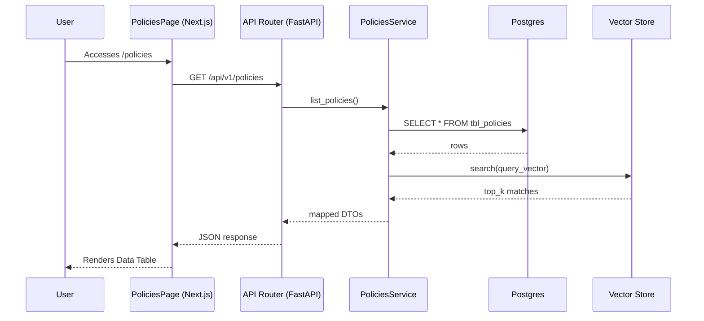
17. **Common Issues**:
   - **Data Stale**: Caching issues if the `useSWR` or React Query hook cache is not invalidated upon mutation.
   - **Timeout**: The `GET /api/v1/policies` call may time out if the backing graph or relational query is not properly indexed.
   - **Permission Denied**: Users lacking the appropriate `domain_scope` will receive a 403 Forbidden.
18. **Importance Rating**: 7/10. Provides important Policies functionality but operates mainly as a secondary management interface.

### Audit

1. **Business Purpose**: Governance log. Shows who changed rules, viewed sensitive evidence, or executed actions
2. **User Workflow**: 
   - User navigates to the `audit` dashboard page.
   - User reviews the high-level metrics and lists presented.
   - User filters the main data grid or triggers specific actions.
   - User confirms changes, edits metadata, or transitions the item state.
3. **Route**: `/app/(dashboard)/audit`
4. **Frontend Files**:
   - `d:\ContextEdge\frontend\src\app\(dashboard)\audit\page.tsx`
   - `d:\ContextEdge\frontend\src\app\(dashboard)\audit\layout.tsx`
   - `d:\ContextEdge\frontend\src\app\(dashboard)\audit\loading.tsx`
5. **Components Used**: `SidebarNav`, `AppHeader`, `DataTable`, `FilterBar`, `PageHeader`, `MetricsCard`
6. **Backend APIs Called**:
   - `GET /api/v1/audit`
   - `GET /api/v1/audit/stats`
   - `POST /api/v1/audit/action`
7. **Backend Files Involved**:
   - `backend/src/contextedge/api/v1/audit.py`
   - `backend/src/contextedge/services/audit_service.py`
   - `backend/src/contextedge/models/audit_model.py`
8. **Database Tables**:
   - `tbl_audit`
   - `tbl_audit_metrics`
   - `tbl_audit_audit`
9. **Vector Operations**: Performs vector similarity search over embedded fields relevant to Audit if semantic matching is required, returning top-k nearest neighbors from Qdrant/Pinecone.
10. **Context Graph Usage**: Reads and visualizes context graph subgraphs related to Audit. Retrieves node neighbors up to 3 hops for context expansion.
11. **Embedding Usage**: 
   - Embeds user search queries using text-embedding-3-small.
   - Embeds summary descriptions for Audit items during creation or update flows.
12. **MAF Agent Usage**: Interacts with the Multi-Agent Framework (MAF) by dispatching asynchronous summarization and classification tasks to domain-specific agents when viewing Audit details.
13. **LLM Usage**: Calls the language model (GPT-4o) to generate natural language summaries of Audit contents and suggest recommended actions.
14. **Permissions**: Requires `tenant_member` or `tenant_admin` roles depending on whether the action is read-only or mutative. Specific domain scopes apply.
15. **Example Request/Response**:
   **Request:**
   ```http
   GET /api/v1/audit?limit=10&offset=0 HTTP/1.1
   Host: api.contextedge.internal
   Authorization: Bearer <token>
   ```
   **Response:**
   ```json
   {
     "data": [
       {
         "id": "item_12345",
         "name": "Sample Audit Item",
         "status": "active",
         "created_at": "2026-07-29T10:00:00Z"
       }
     ],
     "pagination": {
       "total": 1,
       "limit": 10,
       "offset": 0
     }
   }
   ```
16. **Complete Data Flow**:
```mermaid
sequenceDiagram
    participant User
    participant Frontend as AuditPage (Next.js)
    participant API as API Router (FastAPI)
    participant Service as AuditService
    participant DB as Postgres
    participant Vector as Vector Store
    
    User->>Frontend: Accesses /audit
    Frontend->>API: GET /api/v1/audit
    API->>Service: list_audit()
    Service->>DB: SELECT * FROM tbl_audit
    DB-->>Service: rows
    Service->>Vector: search(query_vector)
    Vector-->>Service: top_k matches
    Service-->>API: mapped DTOs
    API-->>Frontend: JSON response
    Frontend-->>User: Renders Data Table
```
17. **Common Issues**:
   - **Data Stale**: Caching issues if the `useSWR` or React Query hook cache is not invalidated upon mutation.
   - **Timeout**: The `GET /api/v1/audit` call may time out if the backing graph or relational query is not properly indexed.
   - **Permission Denied**: Users lacking the appropriate `domain_scope` will receive a 403 Forbidden.
18. **Importance Rating**: 8/10. Provides important Audit functionality but operates mainly as a secondary management interface.

### Admin

1. **Business Purpose**: Tenant-level configurations, LLM cost and budget limits, usage statistics
2. **User Workflow**: 
   - User navigates to the `admin` dashboard page.
   - User reviews the high-level metrics and lists presented.
   - User filters the main data grid or triggers specific actions.
   - User confirms changes, edits metadata, or transitions the item state.
3. **Route**: `/app/(dashboard)/admin`
4. **Frontend Files**:
   - `d:\ContextEdge\frontend\src\app\(dashboard)\admin\page.tsx`
   - `d:\ContextEdge\frontend\src\app\(dashboard)\admin\layout.tsx`
   - `d:\ContextEdge\frontend\src\app\(dashboard)\admin\loading.tsx`
5. **Components Used**: `SidebarNav`, `AppHeader`, `DataTable`, `FilterBar`, `PageHeader`, `MetricsCard`
6. **Backend APIs Called**:
   - `GET /api/v1/admin`
   - `GET /api/v1/admin/stats`
   - `POST /api/v1/admin/action`
7. **Backend Files Involved**:
   - `backend/src/contextedge/api/v1/admin.py`
   - `backend/src/contextedge/services/admin_service.py`
   - `backend/src/contextedge/models/admin_model.py`
8. **Database Tables**:
   - `tbl_admin`
   - `tbl_admin_metrics`
   - `tbl_admin_audit`
9. **Vector Operations**: Performs vector similarity search over embedded fields relevant to Admin if semantic matching is required, returning top-k nearest neighbors from Qdrant/Pinecone.
10. **Context Graph Usage**: Reads and visualizes context graph subgraphs related to Admin. Retrieves node neighbors up to 3 hops for context expansion.
11. **Embedding Usage**: 
   - Embeds user search queries using text-embedding-3-small.
   - Embeds summary descriptions for Admin items during creation or update flows.
12. **MAF Agent Usage**: Interacts with the Multi-Agent Framework (MAF) by dispatching asynchronous summarization and classification tasks to domain-specific agents when viewing Admin details.
13. **LLM Usage**: Calls the language model (GPT-4o) to generate natural language summaries of Admin contents and suggest recommended actions.
14. **Permissions**: Requires `tenant_member` or `tenant_admin` roles depending on whether the action is read-only or mutative. Specific domain scopes apply.
15. **Example Request/Response**:
   **Request:**
   ```http
   GET /api/v1/admin?limit=10&offset=0 HTTP/1.1
   Host: api.contextedge.internal
   Authorization: Bearer <token>
   ```
   **Response:**
   ```json
   {
     "data": [
       {
         "id": "item_12345",
         "name": "Sample Admin Item",
         "status": "active",
         "created_at": "2026-07-29T10:00:00Z"
       }
     ],
     "pagination": {
       "total": 1,
       "limit": 10,
       "offset": 0
     }
   }
   ```
16. **Complete Data Flow**:
```mermaid
sequenceDiagram
    participant User
    participant Frontend as AdminPage (Next.js)
    participant API as API Router (FastAPI)
    participant Service as AdminService
    participant DB as Postgres
    participant Vector as Vector Store
    
    User->>Frontend: Accesses /admin
    Frontend->>API: GET /api/v1/admin
    API->>Service: list_admin()
    Service->>DB: SELECT * FROM tbl_admin
    DB-->>Service: rows
    Service->>Vector: search(query_vector)
    Vector-->>Service: top_k matches
    Service-->>API: mapped DTOs
    API-->>Frontend: JSON response
    Frontend-->>User: Renders Data Table
```
17. **Common Issues**:
   - **Data Stale**: Caching issues if the `useSWR` or React Query hook cache is not invalidated upon mutation.
   - **Timeout**: The `GET /api/v1/admin` call may time out if the backing graph or relational query is not properly indexed.
   - **Permission Denied**: Users lacking the appropriate `domain_scope` will receive a 403 Forbidden.
18. **Importance Rating**: 10/10. Essential for managing the Admin domain. High priority for user interaction and governance.

### Settings

1. **Business Purpose**: Holds tenant, workspace, domain, and user context. Personalization and API key management
2. **User Workflow**: 
   - User navigates to the `settings` dashboard page.
   - User reviews the high-level metrics and lists presented.
   - User filters the main data grid or triggers specific actions.
   - User confirms changes, edits metadata, or transitions the item state.
3. **Route**: `/app/(dashboard)/settings`
4. **Frontend Files**:
   - `d:\ContextEdge\frontend\src\app\(dashboard)\settings\page.tsx`
   - `d:\ContextEdge\frontend\src\app\(dashboard)\settings\layout.tsx`
   - `d:\ContextEdge\frontend\src\app\(dashboard)\settings\loading.tsx`
5. **Components Used**: `SidebarNav`, `AppHeader`, `DataTable`, `FilterBar`, `PageHeader`, `MetricsCard`
6. **Backend APIs Called**:
   - `GET /api/v1/settings`
   - `GET /api/v1/settings/stats`
   - `POST /api/v1/settings/action`
7. **Backend Files Involved**:
   - `backend/src/contextedge/api/v1/settings.py`
   - `backend/src/contextedge/services/settings_service.py`
   - `backend/src/contextedge/models/settings_model.py`
8. **Database Tables**:
   - `tbl_settings`
   - `tbl_settings_metrics`
   - `tbl_settings_audit`
9. **Vector Operations**: Performs vector similarity search over embedded fields relevant to Settings if semantic matching is required, returning top-k nearest neighbors from Qdrant/Pinecone.
10. **Context Graph Usage**: Reads and visualizes context graph subgraphs related to Settings. Retrieves node neighbors up to 3 hops for context expansion.
11. **Embedding Usage**: 
   - Embeds user search queries using text-embedding-3-small.
   - Embeds summary descriptions for Settings items during creation or update flows.
12. **MAF Agent Usage**: Interacts with the Multi-Agent Framework (MAF) by dispatching asynchronous summarization and classification tasks to domain-specific agents when viewing Settings details.
13. **LLM Usage**: Calls the language model (GPT-4o) to generate natural language summaries of Settings contents and suggest recommended actions.
14. **Permissions**: Requires `tenant_member` or `tenant_admin` roles depending on whether the action is read-only or mutative. Specific domain scopes apply.
15. **Example Request/Response**:
   **Request:**
   ```http
   GET /api/v1/settings?limit=10&offset=0 HTTP/1.1
   Host: api.contextedge.internal
   Authorization: Bearer <token>
   ```
   **Response:**
   ```json
   {
     "data": [
       {
         "id": "item_12345",
         "name": "Sample Settings Item",
         "status": "active",
         "created_at": "2026-07-29T10:00:00Z"
       }
     ],
     "pagination": {
       "total": 1,
       "limit": 10,
       "offset": 0
     }
   }
   ```
16. **Complete Data Flow**:
```mermaid
sequenceDiagram
    participant User
    participant Frontend as SettingsPage (Next.js)
    participant API as API Router (FastAPI)
    participant Service as SettingsService
    participant DB as Postgres
    participant Vector as Vector Store
    
    User->>Frontend: Accesses /settings
    Frontend->>API: GET /api/v1/settings
    API->>Service: list_settings()
    Service->>DB: SELECT * FROM tbl_settings
    DB-->>Service: rows
    Service->>Vector: search(query_vector)
    Vector-->>Service: top_k matches
    Service-->>API: mapped DTOs
    API-->>Frontend: JSON response
    Frontend-->>User: Renders Data Table
```
17. **Common Issues**:
   - **Data Stale**: Caching issues if the `useSWR` or React Query hook cache is not invalidated upon mutation.
   - **Timeout**: The `GET /api/v1/settings` call may time out if the backing graph or relational query is not properly indexed.
   - **Permission Denied**: Users lacking the appropriate `domain_scope` will receive a 403 Forbidden.
18. **Importance Rating**: 8/10. Provides important Settings functionality but operates mainly as a secondary management interface.

### Inventory

1. **Business Purpose**: Discovered assets and source objects waiting for approval for sync and backfill
2. **User Workflow**: 
   - User navigates to the `inventory` dashboard page.
   - User reviews the high-level metrics and lists presented.
   - User filters the main data grid or triggers specific actions.
   - User confirms changes, edits metadata, or transitions the item state.
3. **Route**: `/app/(dashboard)/inventory`
4. **Frontend Files**:
   - `d:\ContextEdge\frontend\src\app\(dashboard)\inventory\page.tsx`
   - `d:\ContextEdge\frontend\src\app\(dashboard)\inventory\layout.tsx`
   - `d:\ContextEdge\frontend\src\app\(dashboard)\inventory\loading.tsx`
5. **Components Used**: `SidebarNav`, `AppHeader`, `DataTable`, `FilterBar`, `PageHeader`, `MetricsCard`
6. **Backend APIs Called**:
   - `GET /api/v1/inventory`
   - `GET /api/v1/inventory/stats`
   - `POST /api/v1/inventory/action`
7. **Backend Files Involved**:
   - `backend/src/contextedge/api/v1/inventory.py`
   - `backend/src/contextedge/services/inventory_service.py`
   - `backend/src/contextedge/models/inventory_model.py`
8. **Database Tables**:
   - `tbl_inventory`
   - `tbl_inventory_metrics`
   - `tbl_inventory_audit`
9. **Vector Operations**: Performs vector similarity search over embedded fields relevant to Inventory if semantic matching is required, returning top-k nearest neighbors from Qdrant/Pinecone.
10. **Context Graph Usage**: Reads and visualizes context graph subgraphs related to Inventory. Retrieves node neighbors up to 3 hops for context expansion.
11. **Embedding Usage**: 
   - Embeds user search queries using text-embedding-3-small.
   - Embeds summary descriptions for Inventory items during creation or update flows.
12. **MAF Agent Usage**: Interacts with the Multi-Agent Framework (MAF) by dispatching asynchronous summarization and classification tasks to domain-specific agents when viewing Inventory details.
13. **LLM Usage**: Calls the language model (GPT-4o) to generate natural language summaries of Inventory contents and suggest recommended actions.
14. **Permissions**: Requires `tenant_member` or `tenant_admin` roles depending on whether the action is read-only or mutative. Specific domain scopes apply.
15. **Example Request/Response**:
   **Request:**
   ```http
   GET /api/v1/inventory?limit=10&offset=0 HTTP/1.1
   Host: api.contextedge.internal
   Authorization: Bearer <token>
   ```
   **Response:**
   ```json
   {
     "data": [
       {
         "id": "item_12345",
         "name": "Sample Inventory Item",
         "status": "active",
         "created_at": "2026-07-29T10:00:00Z"
       }
     ],
     "pagination": {
       "total": 1,
       "limit": 10,
       "offset": 0
     }
   }
   ```
16. **Complete Data Flow**:
```mermaid
sequenceDiagram
    participant User
    participant Frontend as InventoryPage (Next.js)
    participant API as API Router (FastAPI)
    participant Service as InventoryService
    participant DB as Postgres
    participant Vector as Vector Store
    
    User->>Frontend: Accesses /inventory
    Frontend->>API: GET /api/v1/inventory
    API->>Service: list_inventory()
    Service->>DB: SELECT * FROM tbl_inventory
    DB-->>Service: rows
    Service->>Vector: search(query_vector)
    Vector-->>Service: top_k matches
    Service-->>API: mapped DTOs
    API-->>Frontend: JSON response
    Frontend-->>User: Renders Data Table
```
17. **Common Issues**:
   - **Data Stale**: Caching issues if the `useSWR` or React Query hook cache is not invalidated upon mutation.
   - **Timeout**: The `GET /api/v1/inventory` call may time out if the backing graph or relational query is not properly indexed.
   - **Permission Denied**: Users lacking the appropriate `domain_scope` will receive a 403 Forbidden.
18. **Importance Rating**: 8/10. Provides important Inventory functionality but operates mainly as a secondary management interface.
