# ContextEdge — UI Tabs Explanation

Reference documentation for every tab in the ContextEdge dashboard: **25 sidebar entries plus one
un-navigated detail page**, 26 entries in total.

> **Accurate as of 2026-08-19.** Every route, endpoint, table, and role below was read out of the
> code. Paths are relative to the repository root. Citations look like
> `frontend/src/app/(dashboard)/evidence/page.tsx:207` and point at a real line.
>
> **Corrections applied across the whole file — read these once, they save you 26 repetitions:**
>
> 1. **There is no per-tab `layout.tsx` or `loading.tsx`.** The app has exactly two layout files,
>    `frontend/src/app/layout.tsx` and `frontend/src/app/(dashboard)/layout.tsx`, and no
>    `loading.tsx` anywhere. Pages render their own skeletons.
> 2. **There are no `tbl_*` tables.** Real table names are plain and plural
>    (`evidence_items`, `episodes`, `playbooks`, …). There is no `<domain>_metrics` or
>    `<domain>_audit` table per domain; auditing is one shared `audit_logs` table and metrics come
>    from `operational_events`.
> 3. **There is no Qdrant or Pinecone.** Vector storage is **pgvector inside Postgres**. Embeddings
>    are 3,072 dimensions, and because pgvector's HNSW caps at 2,000, migration `0032` builds
>    *expression* indexes `USING hnsw ((embedding::halfvec(3072)) halfvec_cosine_ops)` on
>    `evidence_items`, `evidence_chunks`, `decisions`, and `episodes`. Queries must order by the
>    same cast or they silently fall back to a sequential scan
>    (`backend/src/contextedge/search/vector_ops.py:40-45`), and recall is tuned per transaction
>    with `SET LOCAL hnsw.ef_search = 200` (`vector_ops.py:26-37`).
> 4. **There is no GPT-4o anywhere, and the embedding model is not what the code default says.**
>    The default LLM provider is `vertex_ai`; classification and extraction both route to
>    `vertex_ai/gemini-2.5-flash`, the pattern lane too, and playbook generation to
>    `vertex_ai/gemini-3.7-flash` (`backend/src/contextedge/config.py:53-67`). Embeddings are the
>    trap: the pydantic default is still `default_embedding_model = "text-embedding-3-small"`
>    (`config.py:58`), which returns 1,536 dimensions and makes the provider **raise**, because
>    3,072 are required (`backend/src/contextedge/ai/provider.py:787-793`). Every working
>    deployment overrides it — `.env.example` pins `DEFAULT_EMBEDDING_MODEL=text-embedding-3-large`
>    (`.env.example:87-89`). If embeddings fail wholesale on a fresh install, this is why.
> 5. **Almost no tab calls an LLM at read time.** LLM work happens in Celery tasks, ahead of time.
>    Where a button dispatches such a task, this document says which task.
> 6. **There is no per-tab "MAF agent" fan-out.** The Microsoft Agent Framework surface is one
>    projection, `POST /api/v1/graph/agent-subsets`, reachable only from the Graph Explorer's
>    *Agent Context* tab. No other page touches it.
> 7. **There is no generic `/api/v1/<tab>` + `/stats` + `/action` triple.** Real routers are listed
>    at `backend/src/contextedge/api/v1/__init__.py:41-83`; several tabs compose several routers and
>    two tabs have no router of their own at all.
> 8. **Frontend role gates are UX filtering, not security.** The frontend treats only
>    `platform_super_admin` as a super-role (`frontend/src/lib/roles.ts:7-9`); the backend also
>    short-circuits `tenant_admin` and `admin` (`backend/src/contextedge/deps.py:37-44`). And
>    `RoleBinding.scope_type`/`scope_id` are stored but **not enforced**, so a role granted for one
>    domain applies tenant-wide (`codewiki/KNOWN_GAPS.md:187-191`).
>
> Running example throughout: the **Acme VPN incident** — ServiceNow ticket `INC0010427` on CI
> `vpn-gw-east-01`, duplicated in Teams, with a root-cause email from an engineer.

---

## How to read an entry

Each entry keeps the original 18-point skeleton. Point 9 (Vector Operations), 10 (Context Graph),
11 (Embedding), 12 (MAF Agent), and 13 (LLM) now say **"None"** wherever that is the truth — a
truthful "None" is more useful than an aspirational paragraph.

---

### Overview

1. **Business Purpose**: The operator's landing page. Six headline tiles plus a short list of
   playbooks that look stale. It answers "is anything obviously wrong right now?" before you go
   digging.
2. **User Workflow**:
   - Land on `/overview` after login (`frontend/src/app/page.tsx:9-11` redirects here).
   - Scan the six tiles: active sources, evidence items, episodes, approved playbooks, pending
     reviews, healthy syncs.
   - Read the "Drift & freshness signals" list.
   - Click through to `/drift` or `/playbooks/{id}` for anything flagged.
3. **Route**: `/overview`
4. **Frontend Files**:
   - `frontend/src/app/(dashboard)/overview/page.tsx` (255 lines; `StatTile` at 27-53,
     `playbookNeedsAttention` at 55-75, `OverviewSkeleton` at 77-103)
5. **Components Used**: `PageHeader`, `StatusBadge`, shadcn `Card`/`Skeleton`/`buttonVariants`,
   lucide icons. No `DataTable` on this page.
6. **Backend APIs Called** — **there is no `/api/v1/overview` router.** One React Query key
   (`["overview-stats"]`) runs `Promise.all` over four list endpoints, each `limit=200`
   (`overview/page.tsx:106-117`):
   - `GET /api/v1/sources?limit=200`
   - `GET /api/v1/evidence?limit=200`
   - `GET /api/v1/episodes?limit=200`
   - `GET /api/v1/playbooks?limit=200`
7. **Backend Files Involved**:
   - `backend/src/contextedge/api/v1/sources.py:38`
   - `backend/src/contextedge/api/v1/evidence.py:29`
   - `backend/src/contextedge/api/v1/episodes.py:40`
   - `backend/src/contextedge/api/v1/playbooks.py:81`
8. **Database Tables**: `sources`, `evidence_items`, `episodes`, `playbooks` (read only).
9. **Vector Operations**: None.
10. **Context Graph Usage**: None.
11. **Embedding Usage**: None.
12. **MAF Agent Usage**: None.
13. **LLM Usage**: None.
14. **Permissions**: Any authenticated user. No `require_role` on the four list endpoints; results
    are tenant-scoped by the JWT, and evidence additionally filters excluded access policies
    (`backend/src/contextedge/api/v1/evidence.py:42`).
15. **Example Request/Response**:
    **Request:**
    ```http
    GET /api/v1/episodes?limit=200 HTTP/1.1
    Host: localhost:8000
    Authorization: Bearer <jwt>
    X-Request-ID: 4f2c9d1a-...-b17e
    ```
    **Response** (array, not an envelope — there is no `pagination` wrapper anywhere in this API):
    ```json
    [
      {
        "id": "9c1f...-a4",
        "title": "VPN users unable to connect - expired gateway certificate",
        "reviewer_state": "pending_review",
        "status": "draft",
        "extraction_confidence": 0.82,
        "ai_review": { "verdict": "approve", "confidence": 0.86, "mode": "advisory" },
        "evidence_ids": ["...", "..."],
        "created_at": "2026-08-19T09:14:02Z"
      }
    ]
    ```
16. **Complete Data Flow**:
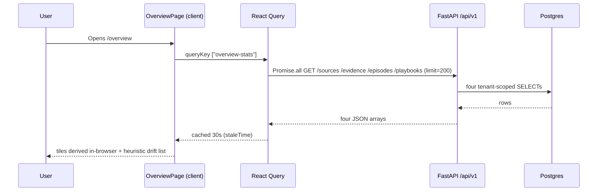
17. **Common Issues**:
    - **Counts look wrong on a big tenant.** They are counts of the **first 200 rows**, not totals.
      The UI says so with the "(up to 200 each)" hint (`overview/page.tsx:120`). This is the single
      most common misreading of this page.
    - **Drift list disagrees with `/drift`.** It should. This list is a browser-side heuristic over
      playbook metadata (`overview/page.tsx:55-75`); `/drift` is the server heuristic including
      negative retrieval feedback and pattern-node drift.
    - **One failure blanks everything.** `Promise.all` means any one of the four failing shows the
      single error panel at `overview/page.tsx:148-151`.
18. **Importance Rating**: 10/10. First screen every operator sees.

---

### Review Queue

1. **Business Purpose**: The human-in-the-loop console for pending decisions — approve, modify, or
   reject what the system proposed, with precedent from similar past decisions alongside.
2. **User Workflow**:
   - Open `/review`; pending decisions load ranked and refresh every 30 seconds.
   - Select one; the full reviewer context loads in a single request.
   - Read the confidence badge and the similar-decision aggregate.
   - Approve, Modify (edit step inputs), or Reject with a comment.
3. **Route**: `/review`
4. **Frontend Files**:
   - `frontend/src/app/(dashboard)/review/page.tsx` (898 lines — the densest page in the app)
5. **Components Used**: `PageHeader`, `StatusBadge`, `PlaybookSteps`, shadcn dialog/form
   primitives, `sonner` toasts.
6. **Backend APIs Called**:
   - `GET /api/v1/decisions?status=pending…` — `refetchInterval: 30_000` (`review/page.tsx:109-116`)
   - `GET /api/v1/review-queue/{session_id}/context` (`review/page.tsx:782-783`)
   - `GET /api/v1/decisions/similar/aggregate` (`review/page.tsx:788-791`)
   - `POST /api/v1/decisions/{decision_id}/reject` (`review/page.tsx:438`)
   - `POST /api/v1/execution/runs/{run_id}/approvals/{approval_id}/decide` (`review/page.tsx:690`)
   - `POST /api/v1/execution/runs/{run_id}/approvals/{approval_id}/modify` (`review/page.tsx:553`)
7. **Backend Files Involved**:
   - `backend/src/contextedge/api/v1/review_queue.py:30`
   - `backend/src/contextedge/services/review_queue_service.py` (`build_review_context`)
   - `backend/src/contextedge/api/v1/decisions.py:159, 240`
   - `backend/src/contextedge/api/v1/execution.py:259, 291`
8. **Database Tables**: `decisions`, `decision_options`, `decision_outcomes`, `decision_evidence`,
   `resolution_sessions`, `execution_runs`, `execution_step_runs`, `approval_requests`,
   `policy_checks`, `operational_events`.
9. **Vector Operations**: Indirect. `GET /decisions/similar/aggregate` uses cosine similarity over
   `decisions.embedding` — one of the four halfvec HNSW expression indexes from migration `0032`.
10. **Context Graph Usage**: Reads only. Decisions are graph-connected with typed edges
    (`based_on`, `considered`, `chose`, `applied_policy`, `required_approval`, `resulted_in`,
    `followed_by`) written by the execution service, not by this page
    (`codewiki/KNOWN_GAPS.md:352`).
11. **Embedding Usage**: None at read time. Decision embeddings are written by
    `ai/embeddings.embed_decision` when the decision is created.
12. **MAF Agent Usage**: None.
13. **LLM Usage**: None at read time.
14. **Permissions**: `GET /decisions` has no `require_role` — any authenticated user reads
    tenant-scoped decisions. The execution approve/modify/decide routes are `domain_admin`
    (`backend/src/contextedge/api/v1/execution.py`, three `require_role("domain_admin")` calls),
    and approval policy can further restrict *who* may decide via `approver_roles` and
    `forbid_self_approval` (`backend/src/contextedge/services/approval_policy_service.py:12-19`).
15. **Example Request/Response**:
    **Request:**
    ```http
    GET /api/v1/review-queue/3b8e...-91/context HTTP/1.1
    Authorization: Bearer <jwt>
    ```
    **Response** — the seven `ReviewQueueContext` fields, composed in one round trip so the
    reviewer UI does not fan out (`backend/src/contextedge/schemas/review_queue.py:61-68`):
    ```json
    {
      "session": { "id": "3b8e...-91", "status": "open", "symptoms": ["vpn login fails"],
                   "entities": ["vpn-gw-east-01"] },
      "top_decision": { "id": "d1...", "decision_type": "playbook_selection", "confidence": 0.62 },
      "top_decision_badge": { "level": "amber" },
      "similar": { "count": 4, "approved": 3, "rejected": 1 },
      "decisions": [ "..." ],
      "execution_runs": [ "..." ],
      "recent_events": [ "..." ]
    }
    ```
    Note there is no `title` on a session — `ResolutionSessionResponse` has none
    (`backend/src/contextedge/schemas/session.py:37-50`); the UI labels a session by its symptoms.
    `top_decision_badge.level` is derived server-side by `derive_badge_level` — green ≥ 0.8,
    amber 0.5–0.8, red < 0.5 — so the threshold cannot drift between consumers
    (`backend/src/contextedge/services/review_queue_service.py:132-140`;
    `codewiki/KNOWN_GAPS.md:246`).
16. **Complete Data Flow**:
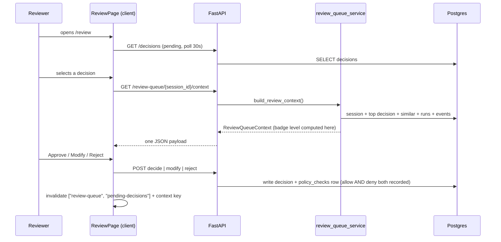
17. **Common Issues**:
    - **Stale list after acting.** Both query keys must be invalidated; the page does this at
      `review/page.tsx:443-444`. A new mutation that forgets one leaves a ghost row.
    - **Modify is a raw JSON textarea.** Deliberate — it preserves the backend's schema-less step
      shape — but it is a rough reviewer UX and typed per-step forms are a named follow-up
      (`codewiki/KNOWN_GAPS.md:258`).
    - **403 on decide.** Either the caller lacks `domain_admin`, or an approval policy's
      `forbid_self_approval` blocked them because they initiated the run. Separation of duties is
      enforced initiator↔approver only, never recommender↔approver
      (`codewiki/KNOWN_GAPS.md:12`).
    - **Missing bulk approve and keyboard shortcuts.** Both are designed but unbuilt
      (`codewiki/KNOWN_GAPS.md:263-264`).
18. **Importance Rating**: 9/10. This is where governance actually happens.

---

### Sources

1. **Business Purpose**: Configure and manage connectors. Acme's ServiceNow, Teams, and mail
   connections are defined here, together with their credentials and sync posture.
2. **User Workflow**:
   - Open `/sources`; the configured connectors list.
   - Add a source via `AddSourceDialog` (connector type, config, credentials).
   - Open a source to see its sync-run history, run discovery, or rotate credentials.
   - Pause, resume, or cancel a running sync.
3. **Route**: `/sources` and `/sources/[id]`
4. **Frontend Files**:
   - `frontend/src/app/(dashboard)/sources/page.tsx` (list, `useQuery` at 118-119)
   - `frontend/src/app/(dashboard)/sources/[id]/page.tsx` (460 lines)
   - `frontend/src/components/sources/add-source-dialog.tsx`
   - `frontend/src/components/sources/edit-source-dialog.tsx`
5. **Components Used**: `PageHeader`, `DataTable`, `StatusBadge`, `PaginationControls`,
   `AddSourceDialog`, `EditSourceDialog`.
6. **Backend APIs Called**:
   - `GET /api/v1/sources`, `GET /api/v1/sources/types`, `POST /api/v1/sources`
   - `GET|PATCH|DELETE /api/v1/sources/{id}`
   - `POST /api/v1/sources/{id}/discover`
   - `GET /api/v1/sources/{id}/sync-runs`
   - `POST /api/v1/sources/{id}/credentials/rotate`
   - `POST /api/v1/sources/{id}/sync/control` — body `{action: pause|resume|cancel,
     source_object_id?}`
   - `POST /api/v1/sources/{id}/probe-config`
   - `POST /api/v1/sources/local-ingest` — the folder-picker path in `AddSourceDialog`, which
     ingests local files directly (`backend/src/contextedge/api/v1/sources.py:456-462`)
   - `GET /api/v1/policies` (to attach retention/classification policies)
7. **Backend Files Involved**:
   - `backend/src/contextedge/api/v1/sources.py` (all fifteen routes: 38, 57, 80, 153, 164, 204,
     219, 237, 295, 368, 386, 418, 456, 569, 661)
   - `backend/src/contextedge/services/sync_control_service.py`
   - `backend/src/contextedge/services/sync_worker_service.py`
   - `backend/src/contextedge/connectors/` (registry + per-connector modules)
8. **Database Tables**: `sources`, `source_objects`, `source_credentials`, `sync_runs`,
   `sync_checkpoints`, `tenant_policies`.
9. **Vector Operations**: None.
10. **Context Graph Usage**: None.
11. **Embedding Usage**: None.
12. **MAF Agent Usage**: None.
13. **LLM Usage**: None. (Ingestion spends LLM budget later, in `extraction.normalize_evidence`.)
14. **Permissions**: `domain_admin` on eight routes including create, update, discover, sync
    control, and credential rotation; `tenant_admin` on two
    (`backend/src/contextedge/api/v1/sources.py`). Credentials are Fernet-encrypted at rest, and
    the app refuses to boot outside development with a missing or placeholder Fernet key, because
    encrypted credentials would become unrecoverable garbage
    (`backend/src/contextedge/config.py:254-264`).
15. **Example Request/Response**:
    **Request:**
    ```http
    POST /api/v1/sources/7a0c...-3f/sync/control HTTP/1.1
    Authorization: Bearer <jwt>
    Content-Type: application/json

    { "action": "pause", "source_object_id": "b21d...-08" }
    ```
    **Response** — the echoed action plus one row per affected object
    (`backend/src/contextedge/api/v1/sources.py:347-365`):
    ```json
    {
      "status": "pause",
      "objects": [
        { "object": "incident", "action": "pause",
          "running_run_id": "51ae...-c2", "signalled": true }
      ]
    }
    ```
    `signalled` is `false` when no run was live — the pause still lands, as a
    `metadata_extra["sync_paused"]` gate on the *next* run.
16. **Complete Data Flow**:
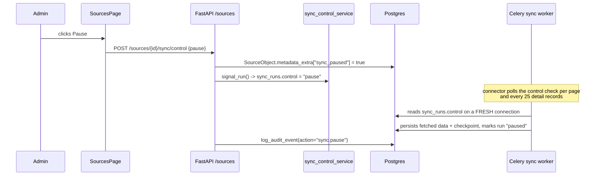
17. **Common Issues**:
    - **Pause seems ignored.** It is cooperative, and — this is the part that surprises people —
      only the **Zoho Desk** connector actually honours it today. It checks between pages and every
      `CONTROL_CHECK_EVERY = 25` detail records
      (`backend/src/contextedge/connectors/zoho_desk/connector.py:128, 818, 946`). ServiceNow,
      Gmail, Teams, Jira SM, ManageEngine and SapphireIMS never call the `_check_control` hook
      (`backend/src/contextedge/connectors/base.py:92-105`), so a running sync on those finishes and
      only the *next* one is gated. Where the check does run it reads on a *fresh* connection,
      because the job's own transaction predates the operator's write and cannot see it
      (`backend/src/contextedge/services/sync_control_service.py:97-122`).
    - **Filter key silently ignored.** Each connector has its own key —
      `module_filters` for Zoho, `table_filters` for ServiceNow. The wrong key is accepted and
      ignored (`docs/RUNBOOK.md`, bulk-backfill checklist).
    - **Second sync returns `skipped_locked`.** A per-source-object Postgres advisory transaction
      lock prevents two workers racing one checkpoint
      (`backend/src/contextedge/services/sync_worker_service.py:379-395`).
18. **Importance Rating**: 8/10.

---

### Sync

1. **Business Purpose**: The history of ingestion runs — backfills, incremental syncs, and
   discovery — with their counts and error payloads. Where you look when Acme's ServiceNow feed
   stopped producing evidence.
2. **User Workflow**:
   - Open `/sync`; recent runs list with status and item counts.
   - Read a failed run's `errors` blob.
   - Delete a single run row, or purge run history.
3. **Route**: `/sync`
4. **Frontend Files**:
   - `frontend/src/app/(dashboard)/sync/page.tsx` (140 lines)
5. **Components Used**: `PageHeader`, `DataTable`, `StatusBadge`.
6. **Backend APIs Called**:
   - `GET /api/v1/sync-runs` (`sync/page.tsx:93-94`) — note the prefix is `/sync-runs`, not `/sync`
     (`backend/src/contextedge/api/v1/__init__.py:48`)
   - `GET /api/v1/sources?limit=200` for name resolution (`sync/page.tsx:97-98`)
   - `DELETE /api/v1/sync-runs/{run_id}` (`sync/page.tsx:78`)
   - `DELETE /api/v1/sync-runs/purge` (`sync/page.tsx:122`)
   - `POST /api/v1/sync-runs/{run_id}/retry` exists on the API (`sync.py:43`)
7. **Backend Files Involved**:
   - `backend/src/contextedge/api/v1/sync.py` (routes at 13, 32, 43, 64, 74)
   - `backend/src/contextedge/workers/sync_tasks.py` (`sync.trigger_scheduled_syncs:14`,
     `sync.run_backfill:39`, `sync.run_incremental_sync:68`)
   - `backend/src/contextedge/services/sync_worker_service.py`
8. **Database Tables**: `sync_runs`, `sync_checkpoints`, `source_objects`, `sources`.
9. **Vector Operations**: None.
10. **Context Graph Usage**: None.
11. **Embedding Usage**: None.
12. **MAF Agent Usage**: None.
13. **LLM Usage**: None.
14. **Permissions**: `domain_admin` on the three mutating routes
    (`backend/src/contextedge/api/v1/sync.py`).
15. **Example Request/Response**:
    **Request:**
    ```http
    GET /api/v1/sync-runs HTTP/1.1
    Authorization: Bearer <jwt>
    ```
    **Response:**
    ```json
    [
      {
        "id": "51ae...-c2",
        "source_id": "7a0c...-3f",
        "run_type": "incremental",
        "status": "completed",
        "items_processed": 84,
        "errors": { "created": 84, "skipped_duplicate": 12, "handoff": null },
        "started_at": "2026-08-19T09:00:00Z",
        "completed_at": "2026-08-19T09:03:41Z"
      }
    ]
    ```
16. **Complete Data Flow**:
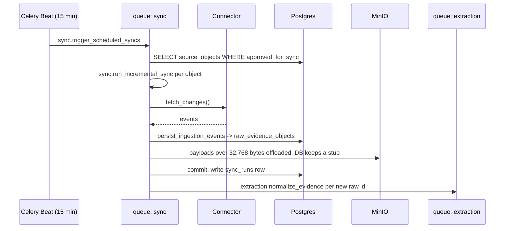
17. **Common Issues**:
    - **The page is not live.** It has no `refetchInterval`; it relies on the global 30-second
      `staleTime` (`frontend/src/components/providers.tsx:13`). For live queue state use
      `/admin/pipeline`, which polls every 5 seconds.
    - **"Run completed, no evidence appeared."** The run only creates `raw_evidence_objects`.
      Evidence appears after `extraction.normalize_evidence` drains the `extraction` queue. Check
      `/admin/pipeline`.
    - **Large tickets look empty in SQL.** Raw payloads over **32,768 bytes** are offloaded to MinIO
      at `raw/{tenant_id}/{raw_id}.json` and the DB row holds only
      `{"_offloaded": true, "size_bytes": N}`
      (`backend/src/contextedge/services/ingestion_persistence.py:84-87`). Any ad-hoc SQL that
      filters on `raw_payload` silently skips exactly the biggest records.
18. **Importance Rating**: 8/10.

---

### Evidence

1. **Business Purpose**: The evidence explorer. Search and browse every normalized fact the system
   holds, with its provenance. For Acme this is where `INC0010427`, the Teams messages, and the
   root-cause email all live as separate, citable records.
2. **User Workflow**:
   - Open `/evidence`; the newest items list.
   - Type a query — this runs full-text search, not semantic search.
   - Filter by evidence type, relevance state, or source type.
   - Open an item for body, attachments, thread conversation, and correlation context.
   - Optionally set the item's access policy, or delete it.
3. **Route**: `/evidence` and `/evidence/[id]`
4. **Frontend Files**:
   - `frontend/src/app/(dashboard)/evidence/page.tsx` (397 lines; query at 207-214)
   - `frontend/src/app/(dashboard)/evidence/[id]/page.tsx` (472 lines)
   - `frontend/src/components/common/thread-conversation.tsx`
   - `frontend/src/components/common/applicability.tsx`
5. **Components Used**: `PageHeader`, `DataTable`, `StatusBadge`, `ThreadConversation`,
   `Applicability`, `PaginationControls`.
6. **Backend APIs Called**:
   - `GET /api/v1/evidence` with `query`, `evidence_type`, `relevance_state`, `source_type`,
     `source_id`, `domain_id`, `limit`, `offset`
   - `GET /api/v1/evidence/{id}`, `/attachments`, `/context`
   - `PATCH /api/v1/evidence/{id}/access-policy`, `PATCH /api/v1/evidence/{id}/relevance`
   - `POST /api/v1/evidence/bulk-delete`, `DELETE /api/v1/evidence/purge`,
     `DELETE /api/v1/evidence/{id}`
   - `GET /api/v1/threads/{thread_id}`, `/evidence`, `POST /api/v1/threads/{thread_id}/hydrate`
   - `GET /api/v1/policies`
7. **Backend Files Involved**:
   - `backend/src/contextedge/api/v1/evidence.py` (routes at 29, 98, 238, 261, 297, 318, 409, 494,
     530)
   - `backend/src/contextedge/search/pg_fts.py` (`search_evidence_fts`)
   - `backend/src/contextedge/api/v1/threads.py`
   - `backend/src/contextedge/workers/extraction_tasks.py` (`_normalize` at 122-642)
   - `backend/src/contextedge/services/evidence_chunk_service.py`
8. **Database Tables**: `evidence_items`, `evidence_chunks`, `raw_evidence_objects`, `threads`,
   `attachment_artifacts`, `correlation_edges`, `evidence_identity_links`,
   `evidence_case_memberships`, `tenant_policies`.
9. **Vector Operations**: **None on this tab.** The search box is Postgres full-text search over
   the generated `evidence_items.search_tsvector` column
   (`backend/src/contextedge/api/v1/evidence.py:44-59`). It is not a way around access control
   either: `search_evidence_fts` imports and applies the same `_visibility_predicates` the vector
   path uses (`backend/src/contextedge/search/pg_fts.py:10`). Vector retrieval over
   `evidence_chunks` — halfvec HNSW, chunk oversample, maximal-marginal-relevance diversification at
   `MMR_LAMBDA = 0.7` (`backend/src/contextedge/search/chunk_rollup.py:29-31`), then a rollup to one
   best chunk per parent merged with a parent-embedding pass — is used by the **runtime ranker** and
   playbook generation, not by this list
   (`backend/src/contextedge/search/vector_search.py:204-243`).
10. **Context Graph Usage**: Read only, on the detail page's context panel — correlation edges and
    case memberships around the item.
11. **Embedding Usage**: Written ahead of time, never at read time. Each evidence item gets a
    parent embedding in `_ensure_embedding` during normalize
    (`extraction_tasks.py:65-70`), and each of its chunks gets one from
    `extraction.embed_chunks_batch` in batches of 32
    (`backend/src/contextedge/workers/chunk_tasks.py:238`).
12. **MAF Agent Usage**: None.
13. **LLM Usage**: None at read time. Normalize spends the LLM budget: relevance classification,
    message-function classification, identity extraction, and decision extraction all run there
    (`extraction_tasks.py:122-642`).
14. **Permissions**: Read is any authenticated user, but every query first resolves
    `resolve_excluded_access_policy_ids` and filters out evidence the caller's roles must not see
    (`evidence.py:42`). The three destructive routes — bulk-delete, purge, and single delete —
    require `domain_admin` (`evidence.py:334, 412, 497`). The access-policy patch takes a different
    shape: it accepts **`domain_admin` or `knowledge_manager`** via an explicit `has_role` check
    rather than `require_role`, and validates the policy is of type `access` and belongs to the
    tenant before assigning it (`evidence.py:271-277, 288-290`).
15. **Example Request/Response**:
    **Request:**
    ```http
    GET /api/v1/evidence?query=VPN%20gateway%20certificate&limit=50 HTTP/1.1
    Authorization: Bearer <jwt>
    ```
    **Response** — exactly the `EvidenceItemResponse` fields
    (`backend/src/contextedge/schemas/evidence.py:23-45`); `message_function`, `thread_id` and the
    chunk counters live on the model but are **not** on the list response:
    ```json
    [
      {
        "id": "e1f4...-77",
        "tenant_id": "t001...-aa",
        "source_id": "7a0c...-3f",
        "source_type": "servicenow",
        "evidence_type": "ticket",
        "title": "INC0010427 - VPN users cannot connect",
        "body_summary": "Multiple users report VPN login failure...",
        "relevance_state": "operational",
        "relevance_score": 0.91,
        "delta_signal": null,
        "created_at_source": "2026-08-19T08:41:00Z",
        "ingested_at": "2026-08-19T08:44:10Z",
        "source_reference": { "external_id": "sys_id-9f2c", "display_id": "INC0010427",
                              "url": "https://acme.service-now.com/incident.do?sys_id=9f2c" }
      }
    ]
    ```
16. **Complete Data Flow**:
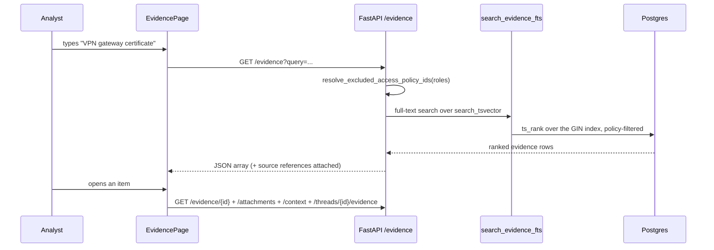
17. **Common Issues**:
    - **"Semantic search does not work here."** Correct — it is not semantic. Use `/runtime` to
      exercise the vector path.
    - **Thread replies are missing from the list.** By design: rows with
      `evidence_type = "thread_message"` are hidden from the default list because they belong under
      their parent ticket's conversation view. Pass `evidence_type=thread_message` explicitly to
      see them (`backend/src/contextedge/api/v1/evidence.py:75-81`).
    - **Delete returns 404 for a whole batch.** Destructive routes resolve-and-authorize before any
      delete statement, so a single foreign id fails the entire request. Legal-hold items return
      409 (`codewiki/KNOWN_GAPS.md:46`).
    - **Chunks exist but nothing is retrievable.** Look for chunks with `embedding IS NULL` while the
      tenant's `llm.usage` events stop arriving — that is the daily LLM budget gate. A block raises
      before the usage recorder, so there is no event to inspect; check
      `GET /api/v1/admin/tenant-budget/status` instead.
18. **Importance Rating**: 9/10.

---

### Episodes

1. **Business Purpose**: AI-reconstructed incident narratives awaiting human approval. The Acme VPN
   episode — "VPN users unable to connect, expired gateway certificate" — is assembled here from the
   ticket, the Teams thread, and the engineer's email.
2. **User Workflow**:
   - Open `/episodes`; drafts sorted by review priority.
   - Read a draft's steps, root cause, outcome, and the `ai_review` verdict if one is stamped.
   - Approve individually or in bulk; or dispatch reconstruction, AI review, or clustering.
3. **Route**: `/episodes` and `/episodes/[id]`
4. **Frontend Files**:
   - `frontend/src/app/(dashboard)/episodes/page.tsx` (376 lines; list query at 206-207)
   - `frontend/src/app/(dashboard)/episodes/[id]/page.tsx` (370 lines)
5. **Components Used**: `PageHeader`, `DataTable`, `StatusBadge`, `DetailPageSkeleton`.
6. **Backend APIs Called**:
   - `GET /api/v1/episodes?sort=…`, `GET /api/v1/episodes/{id}`
   - `PATCH /api/v1/episodes/{id}`, `PATCH /api/v1/episodes/{id}/steps/{step_id}`
   - `POST /api/v1/episodes/{id}/approve`, `POST /api/v1/episodes/bulk-approve`
   - `POST /api/v1/episodes/reconstruct`
   - `POST /api/v1/episodes/ai-review?limit=&advisory=`
   - `POST /api/v1/patterns/cluster`
   - `POST|DELETE /api/v1/episodes/{id}/evidence/{evidence_id}`
   - `DELETE /api/v1/episodes/{id}`
7. **Backend Files Involved**:
   - `backend/src/contextedge/api/v1/episodes.py` (routes at 40, 91, 156, 189, 230, 282, 342, 414,
     459, 510, 556)
   - `backend/src/contextedge/workers/extraction_tasks.py:1404`
     (`extraction.reconstruct_episode`)
   - `backend/src/contextedge/workers/evaluation_tasks.py:129`
     (`evaluation.ai_review_episodes`)
   - `backend/src/contextedge/services/episode_review_service.py`
   - `backend/src/contextedge/workers/signature_tasks.py:24`
     (`evaluation.extract_issue_signature`)
   - `backend/src/contextedge/workers/pattern_tasks.py:422` (`pattern.cluster_episodes`)
8. **Database Tables**: `episodes`, `episode_steps`, `episode_evidence_links`,
   `episode_issue_signatures`, `issue_signatures`, `evidence_items`, `graph_edges`,
   `operational_events`.
9. **Vector Operations**: `episodes.embedding` carries one of the four halfvec HNSW expression
   indexes and is read by pattern clustering, not by this page's list query.
10. **Context Graph Usage**: Approval writes graph edges downstream —
    `episode -[has_signature]-> issue_signature` from the signature extractor
    (`backend/src/contextedge/services/issue_signature_service.py:217-229`), fail-soft so an edge
    failure never fails extraction.
11. **Embedding Usage**: Episode embeddings are produced during reconstruction, not here.
12. **MAF Agent Usage**: None on this page. (`issue_signature` **is** a hydratable node type in the
    maf.v1 projection, visible from Graph Explorer's Agent Context tab.)
13. **LLM Usage**: Not synchronous, but three of this page's buttons dispatch LLM-bearing tasks:
    - **Reconstruct** → `extraction.reconstruct_episode` (task `extraction`,
      `vertex_ai/gemini-2.5-flash`, output ceiling 16,384 tokens —
      `backend/src/contextedge/config.py:134-136`, applied at
      `backend/src/contextedge/ai/provider.py:527`).
    - **AI review** → `evaluation.ai_review_episodes` → one `review_episode_llm` call per draft
      (`backend/src/contextedge/ai/classifiers/episode_review.py:53-98`).
    - **Approve** (either kind) → `evaluation.extract_issue_signature`, one LLM call per approved
      episode.
14. **Permissions**: `knowledge_manager` on six routes including approve, bulk-approve, and
    ai-review; `domain_admin` on one (`backend/src/contextedge/api/v1/episodes.py`). The frontend
    predicate is `canApproveEpisode = isKnowledgeManager` (`frontend/src/lib/roles.ts`).
15. **Example Request/Response**:
    **Request:**
    ```http
    POST /api/v1/episodes/ai-review?limit=50&advisory=true HTTP/1.1
    Authorization: Bearer <jwt>
    ```
    **Response:**
    ```json
    { "task_id": "c7e1...-aa", "status": "queued",
      "detail": { "mode": "advisory", "limit": 50 } }
    ```
    A draft that has been reviewed carries the verdict verbatim on the episode row
    (`backend/src/contextedge/api/v1/episodes.py:145`):
    ```json
    "ai_review": {
      "verdict": "approve", "confidence": 0.86,
      "reasons": ["steps supported by cited evidence"],
      "prompt_version": "v1", "mode": "advisory",
      "auto_approved": false, "failed_floors": [],
      "reviewed_at": "2026-08-19T10:02:11Z"
    }
    ```
16. **Complete Data Flow**:
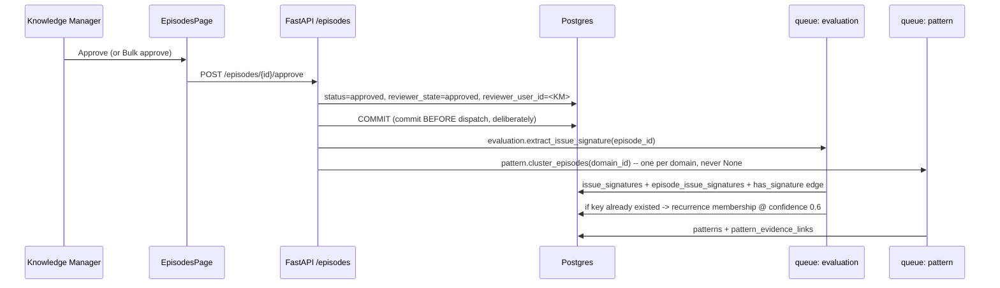
17. **Common Issues**:
    - **"AI review approved nothing."** Expected unless `EPISODE_AI_REVIEW=auto_approve`. The three
      modes are exactly `off | advisory | auto_approve`
      (`backend/src/contextedge/config.py:185-187`). Advisory stamps a verdict and approves nothing.
      Even in auto-approve mode a draft must clear four deterministic floors: ≥ 2 evidence ids, a
      `final_outcome` of ≥ 20 characters, verdict exactly `"approve"`, and confidence ≥ 0.8
      (`backend/src/contextedge/services/episode_review_service.py:89-101`).
      The API can only ever **downgrade** the configured mode, never escalate
      (`backend/src/contextedge/workers/evaluation_tasks.py:171-181`).
    - **The sweep skipped a tenant.** During bulk ingest both the AI-review sweep and the dedup
      sweep defer, counting `deferred_tenants` rather than churning — active means more than
      `DEDUP_ACTIVITY_THRESHOLD = 50` new evidence rows or more than
      `EPISODE_ACTIVITY_THRESHOLD = 30` new episodes inside
      `DEDUP_ACTIVITY_WINDOW_MINUTES = 10`
      (`backend/src/contextedge/workers/pattern_tasks.py:730-745`).
    - **Auto-approved episodes have no reviewer.** By design: `reviewer_user_id` stays NULL so an AI
      approval is permanently distinguishable from a human one.
    - **Approved but no pattern appeared.** Clustering is dispatched once **per domain**; passing
      `None` clustered nothing, because the global pass only sees NULL-domain episodes
      (`evaluation_tasks.py:335-351`). Also confirm a worker is consuming the `pattern` queue.
    - **The "Construct pattern" toast never names a domain.** A live type drift, not a backend bug:
      the page declares the response as `{ task_id, domain_id }` (`episodes/page.tsx:266`) but the
      endpoint returns a `TaskDispatchResponse` where the domain sits under `detail`
      (`backend/src/contextedge/api/v1/patterns.py:423-427`), so `res.domain_id` is always
      `undefined`. Harmless today because only `task_id` is rendered.
18. **Importance Rating**: 10/10.

---

### Patterns

1. **Business Purpose**: Recurring structure generalized from clusters of approved episodes. Three
   separate VPN-certificate outages become one pattern that a playbook can be written against.
2. **User Workflow**:
   - Open `/patterns`; approved patterns list with episode counts.
   - Open one to see its graph and its evidence links.
   - Generate a playbook candidate from it, or run knowledge dedup.
3. **Route**: `/patterns` and `/patterns/[id]`
4. **Frontend Files**:
   - `frontend/src/app/(dashboard)/patterns/page.tsx` (286 lines; query at 189-190)
   - `frontend/src/app/(dashboard)/patterns/[id]/page.tsx` (433 lines)
   - `frontend/src/components/patterns/pattern-graph.tsx`
5. **Components Used**: `PageHeader`, `DataTable`, `StatusBadge`, `PatternGraph`.
6. **Backend APIs Called**:
   - `GET /api/v1/patterns` (`patterns/page.tsx:189-190`), `GET /api/v1/patterns/{id}`
     (`patterns/[id]/page.tsx:110`), `GET /api/v1/patterns/{id}/graph` — issued by the
     `PatternGraph` component, not the page shell
     (`frontend/src/components/patterns/pattern-graph.tsx:344`)
   - `GET|POST|DELETE /api/v1/patterns/{id}/evidence-links…` (`patterns/[id]/page.tsx:40, 116, 121`)
   - `POST /api/v1/patterns/{id}/approve` (`patterns/[id]/page.tsx:127`)
   - `POST /api/v1/patterns/deduplicate` (`patterns/page.tsx:194`)
   - `POST /api/v1/playbooks/generate` with `{pattern_id}` (`patterns/page.tsx:36`)
   - `DELETE /api/v1/patterns/{id}` (`patterns/page.tsx:49`)
   - **Not from this page**: `POST /api/v1/patterns/cluster` is dispatched from the *Episodes*
     page's "Construct pattern" button (`episodes/page.tsx:266`).
7. **Backend Files Involved**:
   - `backend/src/contextedge/api/v1/patterns.py` (routes at 22, 31, 41, 95, 133, 163, 190, 207,
     240, 265, 304, 412)
   - `backend/src/contextedge/workers/pattern_tasks.py`
     (`pattern.cluster_episodes:422`, `pattern.generate_playbook_candidate:446`,
     `pattern.deduplicate_knowledge:834`)
   - `backend/src/contextedge/services/pattern_service.py`
8. **Database Tables**: `patterns`, `pattern_evidence_links`, `episodes`, `playbooks`,
   `graph_edges`, `operational_events`.
9. **Vector Operations**: Clustering matches episodes to existing patterns by embedding proximity
   over the halfvec HNSW index before an LLM adjudicates the match; the page itself reads rows.
   Two named, measured thresholds do the work. Joining an existing pattern prefilters at
   `PATTERN_MATCH_MAX_DISTANCE = 0.30` and then orders by distance to take the **nearest** pattern
   member — the `ORDER BY` is the whole point, because on this corpus nearly every episode has
   *some* member within 0.35, so an unordered `LIMIT 1` used to hand the validator a near-random
   pattern (validator accept rate 12% → 40% once nearest was used). Forming a **new** cluster is
   stricter, `CLUSTER_GROUP_MAX_DISTANCE = 0.27`, picked as the knee of a measured
   singletons-versus-cluster-size curve (`backend/src/contextedge/workers/pattern_tasks.py:44-60,
   228-257, 309`).
10. **Context Graph Usage**: `GET /patterns/{id}/graph` returns the pattern's neighbourhood.
    Promotion writes a `memory.pattern_promoted` operational event.
11. **Embedding Usage**: Written by clustering, not by this page.
12. **MAF Agent Usage**: None.
13. **LLM Usage**: Not synchronous. **Cluster** dispatches `pattern.cluster_episodes`, which makes
    **up to two LLM calls per unlinked episode** — `validate_pattern_match` when a nearest existing
    pattern falls inside `PATTERN_MATCH_MAX_DISTANCE` (`pattern_tasks.py:273`), then
    `synthesize_pattern` (`:341`) only if that validator rejected or no pattern matched. An accepted
    match `continue`s after one call; a rejected match is the only two-call path. **Generate
    playbook** dispatches generation on `vertex_ai/gemini-3.7-flash`
    (`backend/src/contextedge/config.py:53-67`). **Deduplicate** runs the same
    `pattern_service.deduplicate_patterns_and_playbooks` the hourly beat job uses.
14. **Permissions**: `knowledge_manager` on four routes, `domain_admin` on three
    (`backend/src/contextedge/api/v1/patterns.py`).
15. **Example Request/Response**:
    **Request:**
    ```http
    POST /api/v1/patterns/cluster HTTP/1.1
    Authorization: Bearer <jwt>
    Content-Type: application/json

    {}
    ```
    **Response** — a `TaskDispatchResponse`, not a bare id
    (`backend/src/contextedge/schemas/common.py:44-64`;
    `backend/src/contextedge/api/v1/patterns.py:412-427`). With `?domain_id=` it is one dispatch;
    without, one pass per tenant domain plus a global NULL-domain pass:
    ```json
    { "status": "clustering_queued", "task_id": "8f31...-04",
      "detail": { "domain_id": "d0c2...-19" } }
    ```
16. **Complete Data Flow**:
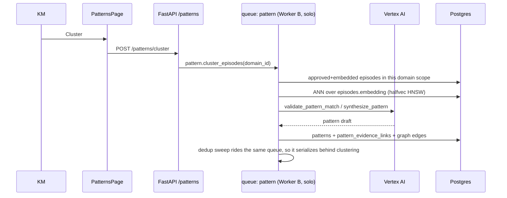
17. **Common Issues**:
    - **Duplicate patterns.** Clustering and playbook generation operate on the whole graph and hold
      **no advisory lock**, which is exactly why the `pattern` queue runs on a single serialized
      worker (Worker B, `-P solo`). Running two pattern workers reintroduces duplicates
      (`docs/RUNBOOK.md`, "Worker topology").
    - **Dedup retired drafts mid-run.** The hourly sweep defers while ingest is active precisely
      because a 12:29 sweep once retired 446 drafts during a reconstruction tail — evidence inflow
      alone missed that phase, which is why the episode threshold exists
      (`backend/src/contextedge/workers/pattern_tasks.py:738-745`).
    - **Nothing clusters.** Verify the `pattern` queue has a consumer, and that the dispatch carried
      a real `domain_id`.
18. **Importance Rating**: 8/10.

---

### Playbooks

1. **Business Purpose**: Governed, versioned operational procedures. The approved "renew and deploy
   the VPN gateway certificate" playbook lives here with its lifecycle state, automation mode, and
   full version history.
2. **User Workflow**:
   - Open `/playbooks`; search and page through the library.
   - Open one: read its steps, versions, provenance, and governance panel.
   - Transition its lifecycle, adjust automation mode, diff two versions, or roll back.
3. **Route**: `/playbooks` and `/playbooks/[id]`
4. **Frontend Files**:
   - `frontend/src/app/(dashboard)/playbooks/page.tsx` (125 lines — a list, nothing more)
   - `frontend/src/app/(dashboard)/playbooks/[id]/page.tsx` (1,049 lines — governance, versions,
     provenance, documented-vs-observed)
   - `frontend/src/components/common/playbook-steps.tsx`
5. **Components Used**: `PageHeader`, `DataTable`, `StatusBadge`, `PlaybookSteps`,
   `PaginationControls`.
   **There is no drag-and-drop workflow builder.** No such component exists in
   `frontend/src/components/`.
6. **Backend APIs Called**:
   - `GET /api/v1/playbooks`, `GET /api/v1/playbooks/{id}`, `GET /api/v1/playbooks/{id}/references`
   - `GET /api/v1/playbooks/{id}/versions`, `GET .../versions/{version_id}/diff`
   - `POST /api/v1/playbooks/{id}/transition`, `POST /api/v1/playbooks/{id}/rollback`
   - `PATCH /api/v1/playbooks/{id}` (title, steps, `automation_mode`)
   - `POST /api/v1/playbooks/generate`
   - `GET /api/v1/policies` (approval policy attachment)
7. **Backend Files Involved**:
   - `backend/src/contextedge/api/v1/playbooks.py` (routes at 81, 206, 239, 250, 403, 465, 505, 515,
     544, 613, 654)
   - `backend/src/contextedge/services/playbook_service.py`
   - `backend/src/contextedge/workers/pattern_tasks.py:446`
     (`pattern.generate_playbook_candidate`)
   - `backend/src/contextedge/workers/playbook_tasks.py:74`
     (`evaluation.backfill_playbook_embeddings`)
8. **Database Tables**: `playbooks`, `playbook_versions`, `playbook_approvals`,
   `playbook_evidence_links`, `patterns`, `policy_checks`, `operational_events`.
9. **Vector Operations**: Playbook version embeddings feed the runtime ranker's semantic signal;
   the pages themselves do not run ANN queries.
10. **Context Graph Usage**: The "Approved knowledge used" panel renders `playbook_evidence_links`
    provenance — the evidence that retrieval actually put into the generation prompt.
11. **Embedding Usage**: Backfilled by `evaluation.backfill_playbook_embeddings`, not by the UI.
12. **MAF Agent Usage**: None.
13. **LLM Usage**: Only via **Generate**, which is the manual path into playbook synthesis. Note
    that the manual API path is deliberately **not** identical to the worker path. Diffed
    2026-08-19: both build episode summaries and pull up to 20 `NegativeKnowledgeItem` rows, but
    only the worker (`pattern_tasks.py:554-580`) calls `retrieve_knowledge_for_pattern` and
    `persist_knowledge_links` and passes the result as `knowledge_sources=`. The manual route
    (`api/v1/playbooks.py:708`) omits that argument entirely, so a manually generated playbook is
    synthesised without approved KB/SOP grounding and writes no knowledge links.
    Either way the model's `branching_logic` is repaired structurally, not trusted:
    `playbook_generator.sanitize_branching_logic` drops decision points whose anchor or target
    names a step that does not exist, that jump back to the step just finished (an infinite loop),
    or whose true and false paths are identical (deciding nothing) — then a second pass removes
    points that would strand a step no path can reach. It repairs rather than rejects, because the
    steps of such a playbook are usually fine and only `decision_points` is junk, and it counts what
    it dropped so a regressing prompt shows up in the counters rather than in a reviewer's
    confusion. An audit of 190 generated playbooks found 20 with branching defects — 39% of the 51
    that branch at all (`backend/src/contextedge/ai/generators/playbook_generator.py:93, 154-255`).
    The playbook prompt is on **v6** (`backend/src/contextedge/ai/prompts/playbook.py:418`);
    shipped prompt versions are immutable, so a change means a new version, never an edit.
14. **Permissions**: `knowledge_manager` on five routes, `playbook_reviewer` on one,
    `tenant_admin` on two (`backend/src/contextedge/api/v1/playbooks.py`). Frontend predicates:
    `canTransitionPlaybook` (playbook_reviewer | knowledge_manager | tenant_admin) and
    `canEditAutomationMode` (**tenant_admin only** — deliberately narrower than editing, because
    automation mode is what makes every other approval gate load-bearing;
    `frontend/src/lib/roles.ts`).
15. **Example Request/Response**:
    **Request:**
    ```http
    POST /api/v1/playbooks/generate HTTP/1.1
    Authorization: Bearer <jwt>
    Content-Type: application/json

    { "pattern_id": "p44a...-1c" }
    ```
    **Response (201):**
    ```json
    {
      "id": "pb77...-e0",
      "stable_key": "acme.vpn.gateway_certificate_renewal",
      "title": "Renew and deploy VPN gateway certificate",
      "lifecycle_state": "candidate",
      "automation_mode": "suggest_only",
      "risk_tier": "medium",
      "pattern_id": "p44a...-1c",
      "last_validated_at": null,
      "expiry_at": null,
      "allowed_transitions": ["under_review"]
    }
    ```
    `allowed_transitions` is a `@computed_field` served by the API rather than duplicated in the
    browser (`backend/src/contextedge/schemas/playbook.py:148-166`, reading `VALID_TRANSITIONS` at
    `backend/src/contextedge/services/playbook_service.py:22-30`). A `candidate` may only go to
    `under_review` — that single value is not a truncation. The field exists because the UI used to
    keep its own copy of the map and it had drifted both ways: it offered `candidate → retired`,
    which the backend rejects, and omitted `approved → restricted`, which left the one lever for
    narrowing a live playbook unreachable from the UI entirely.
16. **Complete Data Flow**:
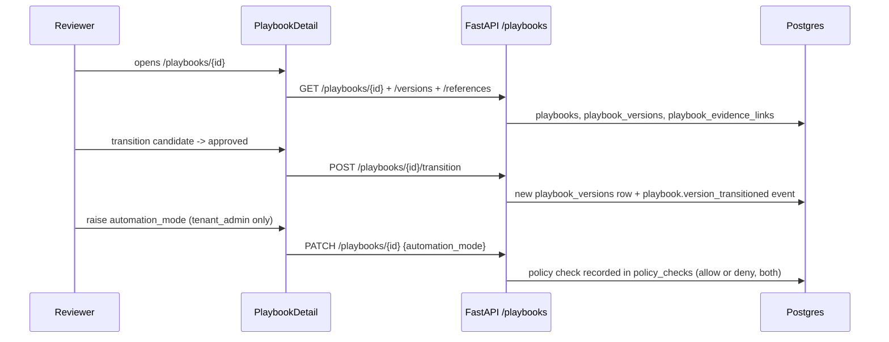
17. **Common Issues**:
    - **Expecting a visual builder.** There is none; steps are edited through the API and rendered
      by `PlaybookSteps`.
    - **`verification_policy` looks ignored.** It is. Migration `0018` added
      `playbook_versions.verification_policy`, the UI can render it, but the execution engine does
      not yet act on it — the recheck worker is a follow-up (`codewiki/KNOWN_GAPS.md:344`).
    - **A playbook never appears in `/runtime` results.** The ranker only considers
      `lifecycle_state = "approved"` playbooks that have a **published** version, applies your role's
      risk cap, and abstains entirely below score 0.35
      (`backend/src/contextedge/search/hybrid_ranker.py:213-379`).
18. **Importance Rating**: 9/10.

---

### Sessions

1. **Business Purpose**: Resolution sessions — the per-incident working record that ties symptoms,
   retrieval, decisions, and outcome together. Acme's VPN outage gets one session; everything the
   responder did hangs off it.
2. **User Workflow**:
   - Open `/sessions`; open and closed sessions list.
   - Create a session with symptoms and entities.
   - Expand one to see its decisions and its history.
   - Close it, optionally asserting an outcome.
3. **Route**: `/sessions`
4. **Frontend Files**:
   - `frontend/src/app/(dashboard)/sessions/page.tsx` (694 lines; list at 627-628, per-session
     decisions and history at 437-445)
5. **Components Used**: `PageHeader`, `DataTable`, `StatusBadge`, `PaginationControls`,
   shadcn dialog/form.
6. **Backend APIs Called**:
   - `GET /api/v1/sessions`, `POST /api/v1/sessions`, `GET /api/v1/sessions/{id}`
   - `GET /api/v1/sessions/{id}/history`
   - `PATCH /api/v1/sessions/{id}/close`
   - `GET /api/v1/decisions?session_id=…&limit=50`
7. **Backend Files Involved**:
   - `backend/src/contextedge/api/v1/sessions.py` (routes at 26, 45, 64, 76, 102, 139)
   - `backend/src/contextedge/services/session_service.py` (`append_trace_event:139-181`)
8. **Database Tables**: `resolution_sessions`, `decision_trace_events`, `decisions`,
   `execution_runs`, `operational_events`.
9. **Vector Operations**: None.
10. **Context Graph Usage**: None directly. The session id is the join key that
    `POST /runtime/match` uses when it writes a `retrieve` trace event.
11. **Embedding Usage**: None.
12. **MAF Agent Usage**: None.
13. **LLM Usage**: None.
14. **Permissions**: Opening a session is available to any authenticated user
    (`frontend/src/app/(dashboard)/sessions/page.tsx:621`). Asserting an outcome on close is
    `knowledge_manager` — one `require_role("knowledge_manager")` in
    `backend/src/contextedge/api/v1/sessions.py`, mirrored in the UI at `sessions/page.tsx:222`
    with explanatory copy at line 316.
15. **Example Request/Response**:
    **Request:**
    ```http
    POST /api/v1/sessions HTTP/1.1
    Authorization: Bearer <jwt>
    Content-Type: application/json

    { "symptoms": ["vpn login fails", "certificate error"],
      "entities": ["vpn-gw-east-01"],
      "external_case_ids": ["INC0010427"],
      "notes": "Reported by the Acme service desk" }
    ```
    There is **no `title` field** on a session, on create or on read — `ResolutionSessionCreate`
    takes `domain_id`, `symptoms`, `entities`, `external_case_ids`, `notes` and nothing else
    (`backend/src/contextedge/schemas/session.py:29-35`), and the page sends exactly those four
    (`sessions/page.tsx:117-122`). A session is identified by its symptoms and case ids.
    **Response (201):**
    ```json
    { "id": "3b8e...-91", "tenant_id": "t001...-aa", "status": "open",
      "symptoms": ["vpn login fails", "certificate error"],
      "entities": ["vpn-gw-east-01"], "external_case_ids": ["INC0010427"],
      "closed_at": null, "trace_events": [],
      "created_at": "2026-08-19T08:47:10Z" }
    ```
16. **Complete Data Flow**:
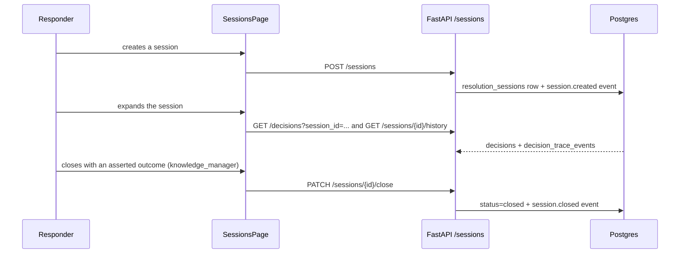
17. **Common Issues**:
    - **Expecting a live log tail.** There is none. This is a paginated table with expandable
      history; the frontend has no streaming transport anywhere.
    - **Close button disabled.** Asserting an outcome needs `knowledge_manager`; closing without an
      assertion does not.
    - **Empty history.** Trace events are written by `/runtime/match` when a `session_id` was passed
      and by the execution service. A session nobody used has nothing to show.
18. **Importance Rating**: 8/10.

---

### Evaluations

1. **Business Purpose**: Replay historical cases against the current retrieval ranker, so a change
   to weights or prompts can be measured instead of argued about.
2. **User Workflow**:
   - Open `/evaluations`; datasets and runs list.
   - Create a dataset from historical cases.
   - Start a run; read its scores.
3. **Route**: `/evaluations`
4. **Frontend Files**:
   - `frontend/src/app/(dashboard)/evaluations/page.tsx` (queries at 182-188, mutations at 201, 218)
5. **Components Used**: `PageHeader`, `DataTable`, `StatusBadge`.
6. **Backend APIs Called**:
   - `GET|POST /api/v1/evaluations/datasets`
   - `GET|POST /api/v1/evaluations/runs`
   - `GET /api/v1/evaluations/runs/{run_id}`
7. **Backend Files Involved**:
   - `backend/src/contextedge/api/v1/evaluations.py` (routes at 50, 60, 75, 86, 105)
   - `backend/src/contextedge/services/evaluation_service.py` (calls `rank_playbooks` at :134)
   - `backend/src/contextedge/workers/evaluation_tasks.py:18` (`evaluation.run_evaluation`)
8. **Database Tables**: `evaluation_datasets`, `evaluation_runs`.
9. **Vector Operations**: Indirect and real — a run exercises the same `rank_playbooks` path as
   production, so it embeds each query and runs the halfvec ANN over linked evidence chunks.
10. **Context Graph Usage**: Indirect; the ranker's graph-distance signal reads `graph_edges` and
    `correlation_edges`.
11. **Embedding Usage**: One attributed, budget-gated query embedding per evaluated case
    (`backend/src/contextedge/search/hybrid_ranker.py:271-281`).
12. **MAF Agent Usage**: None.
13. **LLM Usage**: Embeddings only. No generative call in the eval loop itself.
14. **Permissions**: `knowledge_manager` on the two create routes
    (`backend/src/contextedge/api/v1/evaluations.py`). Frontend predicate `canManageEval`.
15. **Example Request/Response**:
    **Request:**
    ```http
    POST /api/v1/evaluations/runs HTTP/1.1
    Authorization: Bearer <jwt>
    Content-Type: application/json

    { "dataset_id": "ds10...-6b", "config": {} }
    ```
    `EvalRunCreate` takes only `dataset_id` and `config` — there is no `notes` field
    (`backend/src/contextedge/api/v1/evaluations.py:31-33`).
    **Response (201)** — the run is created with `status: "pending"` and dispatched immediately
    (`evaluations.py:89-100`):
    ```json
    { "id": "run4...-8d", "tenant_id": "t001...-aa", "dataset_id": "ds10...-6b",
      "config": {}, "status": "pending", "results": null,
      "started_at": null, "completed_at": null,
      "created_at": "2026-08-19T11:20:00Z" }
    ```
16. **Complete Data Flow**:
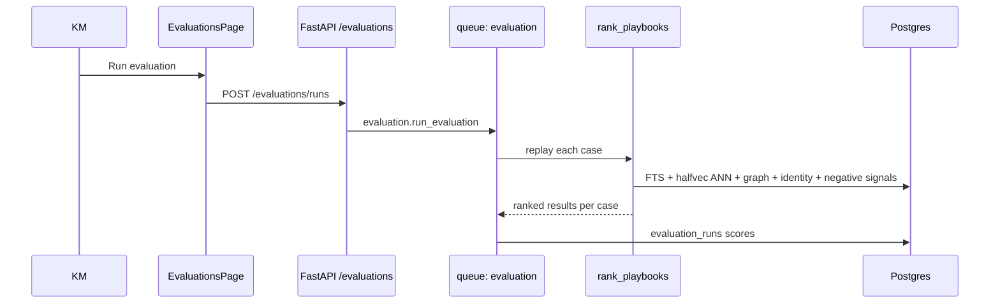
17. **Common Issues**:
    - **A run costs LLM budget.** Every case embeds its query, and embeddings are budget-gated. A
      large dataset can trip the daily cap.
    - **Not a release gate yet.** Wiring evaluation into CI as a gate is a roadmap item
      (`codewiki/KNOWN_GAPS.md:57`).
18. **Importance Rating**: 9/10.

---

### Runtime

1. **Business Purpose**: A sandbox over the production retrieval ranker. Type Acme's symptoms, see
   which playbooks the system would recommend, and inspect exactly why.
2. **User Workflow**:
   - Open `/runtime`; pick a domain and optionally a session.
   - Enter symptoms and entity terms; submit.
   - Read the ranked playbooks and each one's signal breakdown.
   - Open "Explain" for the cached full payload; leave feedback.
3. **Route**: `/runtime`
4. **Frontend Files**:
   - `frontend/src/app/(dashboard)/runtime/page.tsx` (556 lines; match at 197, explain at 208,
     selectors at 131-137, feedback list at 60-61)
5. **Components Used**: `PageHeader`, `DataTable`, `StatusBadge`, `SearchableSelect`.
6. **Backend APIs Called**:
   - `POST /api/v1/runtime/match`
   - `GET /api/v1/runtime/explain/{match_id}`
   - `GET /api/v1/runtime/playbooks/{stable_key}`
   - `POST /api/v1/runtime/feedback`, `GET /api/v1/runtime/feedback`
   - `GET /api/v1/domains`, `GET /api/v1/sessions?limit=50`
7. **Backend Files Involved**:
   - `backend/src/contextedge/api/v1/runtime.py` (routes at 89, 249, 270, 352, 372; risk cap at
     42-52)
   - `backend/src/contextedge/search/hybrid_ranker.py:213-379` (`rank_playbooks`)
   - `backend/src/contextedge/services/memory_service.py:82-288`
     (`build_runtime_memory_context`)
   - `backend/src/contextedge/search/vector_search.py:246-297`
     (`search_evidence_semantic_for_playbook`)
   - `backend/src/contextedge/search/vector_ops.py:26-45` (halfvec distance + `ef_search`)
8. **Database Tables**: `playbooks`, `playbook_versions`, `playbook_evidence_links`,
   `evidence_items`, `evidence_chunks`, `graph_edges`, `correlation_edges`,
   `negative_knowledge_items`, `canonical_identities`, `retrieval_feedback`,
   `decision_trace_events`, `operational_events`.
9. **Vector Operations**: **This is the tab where vector search actually happens.** One query
   embedding is generated (attributed and budget-gated), `SET LOCAL hnsw.ef_search = 200` is
   applied, and per candidate playbook the ranker runs an ANN over that version's linked evidence
   chunks using the `embedding::halfvec(3072)` cosine expression. Chunk candidates are oversampled,
   diversified by maximal marginal relevance at `MMR_LAMBDA = 0.7`
   (`backend/src/contextedge/search/chunk_rollup.py:29-31`), rolled up to one best chunk per parent
   evidence item, and merged with a parent-embedding pass so unchunked evidence still surfaces
   (`backend/src/contextedge/search/vector_search.py:246-297` for the per-playbook variant the
   ranker actually calls; `:204-243` for the tenant-wide one).
10. **Context Graph Usage**: Real and weighted. The graph signal counts `graph_edges` touching the
    playbook plus `correlation_edges` between the version's evidence and this query's semantic hits
    (`hybrid_ranker.py:57-112`). The identity signal counts `references_identity` edges to the
    query's resolved identities.
11. **Embedding Usage**: One `generate_embedding(query_text, tenant_id, db)` per match; any
    exception degrades the semantic signal to zero rather than failing the request
    (`hybrid_ranker.py:271-281`).
12. **MAF Agent Usage**: None.
13. **LLM Usage**: Embedding only — no generative call on this path.
14. **Permissions**: No `require_role` in `runtime.py`. Instead the caller's roles set an
    **effective risk cap**: `platform_super_admin`, `tenant_admin` and `domain_admin` uncapped,
    `knowledge_manager` and service accounts capped at `high`, everyone else at `medium`
    (`backend/src/contextedge/api/v1/runtime.py:42-52`).
    Service tokens are additionally restricted by `allowed_domain_ids` (403 on a foreign domain).
15. **Example Request/Response**:
    **Request:**
    ```http
    POST /api/v1/runtime/match HTTP/1.1
    Authorization: Bearer <jwt>
    Content-Type: application/json

    { "symptoms": ["vpn login fails", "certificate error"],
      "entities": ["vpn-gw-east-01"],
      "domain_id": "d0c2...-19",
      "session_id": "3b8e...-91" }
    ```
    **Response** — `RuntimeMatchResponse` / `RuntimeMatchResult`
    (`backend/src/contextedge/schemas/playbook.py:280-303`). Note the field is `match_score`, not
    `score`, and the per-signal map is `scoring_breakdown`, whose keys are the ranker's own —
    `graph` and `quality`, not `graph_distance` and `evidence_quality`
    (`backend/src/contextedge/search/hybrid_ranker.py:356-365`):
    ```json
    {
      "match_id": "m5c8...-2a",
      "session_id": "3b8e...-91",
      "results": [
        {
          "playbook_id": "pb77...-e0",
          "playbook_title": "Renew and deploy VPN gateway certificate",
          "stable_key": "acme.vpn.gateway_certificate_renewal",
          "match_score": 0.71,
          "confidence": 0.71,
          "playbook_confidence": 0.82,
          "freshness_status": "fresh",
          "evidence_count": 6,
          "risk_tier": "medium",
          "automation_mode": "suggest_only",
          "scoring_breakdown": { "keyword": 0.63, "semantic": 0.78, "graph": 0.40,
                                 "quality": 0.66, "identity": 1.0,
                                 "recency": 0.88, "freshness": 0.88,
                                 "negative_penalty": 0.0 }
        }
      ],
      "fallback_guidance": null,
      "filters_applied": { "domain_id": "d0c2...-19", "max_risk_tier": "medium" }
    }
    ```
    `freshness_status` is derived from the same freshness number the breakdown carries: `fresh`
    above 0.7, `aging` above 0.3, `stale` otherwise (`hybrid_ranker.py:347`).
16. **Complete Data Flow**:
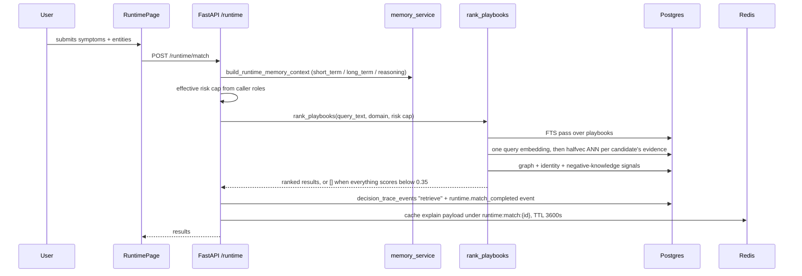
17. **Common Issues**:
    - **Empty results are a real answer.** The ranker abstains below
      `MIN_RECOMMENDATION_SCORE = 0.35` and logs `ranking.abstained` with the top score. An empty
      list means "no recommendation", by contract (`hybrid_ranker.py:168-171, 368-379`).
    - **Explain returns 404.** The payload is cached in Redis for one hour only
      (`backend/src/contextedge/api/v1/runtime.py:230-238`). The page says so in its own
      description (`runtime/page.tsx:236`).
    - **A colleague sees different results.** Expected — the risk cap is role-derived, and domain
      scope filters candidates.
    - **Semantic score is zero across the board.** Either the query embedding failed, or the
      environment never executed migration `0032` and every ANN query is a sequential scan over an
      index that was never built (`codewiki/KNOWN_GAPS.md:40`).
18. **Importance Rating**: 8/10.

---

### Execution

1. **Business Purpose**: The approval gate for higher-risk automated steps. Before an automated
   playbook run touches Acme's gateway, a human says yes here.
2. **User Workflow**:
   - Open `/execution`; pending approvals list, refreshing every 30 seconds.
   - Read the requested step and its risk.
   - Approve or deny.
3. **Route**: `/execution`
4. **Frontend Files**:
   - `frontend/src/app/(dashboard)/execution/page.tsx` (query at 122-124, decide at 36)
5. **Components Used**: `PageHeader`, `DataTable`, `StatusBadge`, `PlaybookSteps`.
6. **Backend APIs Called**:
   - `GET /api/v1/execution/approvals/pending`
   - `POST /api/v1/execution/runs/{run_id}/approvals/{approval_id}/decide`
   - (Also on the API: `POST /execution/runs`, `GET /execution/runs`,
     `POST /execution/runs/{id}/abort`, `/complete`.)
7. **Backend Files Involved**:
   - `backend/src/contextedge/api/v1/execution.py` (routes at 65, 90, 110, 135, 179, 216, 233, 259,
     291, 324)
   - `backend/src/contextedge/services/approval_policy_service.py`
   - `backend/src/contextedge/services/policy_check_service.py:34` (`record_policy_check`)
   - `backend/src/contextedge/workers/verification_tasks.py:112`
     (`evaluation.verify_executions`, every 15 minutes)
8. **Database Tables**: `execution_runs`, `execution_step_runs`, `execution_attempts`,
   `execution_contracts`, `approval_requests`, `policy_checks`, `tool_invocations`,
   `rollback_plans`, `verification_assessments`, `verification_observations`.
9. **Vector Operations**: None.
10. **Context Graph Usage**: Execution writes decision edges (`required_approval`, `resulted_in`)
    as part of the decision trace.
11. **Embedding Usage**: None.
12. **MAF Agent Usage**: None.
13. **LLM Usage**: None on the approval path.
14. **Permissions**: `domain_admin` on three routes
    (`backend/src/contextedge/api/v1/execution.py`), further narrowed by the attached approval
    policy's `approver_roles`, `forbid_self_approval`, `require_approval_min_safety_class`, and
    `max_automation_mode` (`backend/src/contextedge/services/approval_policy_service.py:12-19`).
    **Both allow and deny are recorded** in `policy_checks` (`codewiki/KNOWN_GAPS.md:14`).
15. **Example Request/Response**:
    **Request:**
    ```http
    POST /api/v1/execution/runs/r91b...-5e/approvals/a20f...-77/decide HTTP/1.1
    Authorization: Bearer <jwt>
    Content-Type: application/json

    { "decision": "approved", "comment": "Cert renewal verified with the CA team" }
    ```
    The value is `approved` or `denied` — not `approve`
    (`backend/src/contextedge/schemas/execution.py:22-23`; the Review Queue page sends `"approved"`
    at `review/page.tsx:692`).
    **Response** (an `ApprovalRequestResponse`,
    `backend/src/contextedge/schemas/execution.py:146-160`):
    ```json
    { "id": "a20f...-77", "execution_run_id": "r91b...-5e", "status": "approved",
      "requested_action": "renew_certificate", "safety_class": "medium",
      "decided_by": "u33c...-01", "decided_at": "2026-08-19T12:05:44Z",
      "decision_comment": "Cert renewal verified with the CA team" }
    ```
16. **Complete Data Flow**:
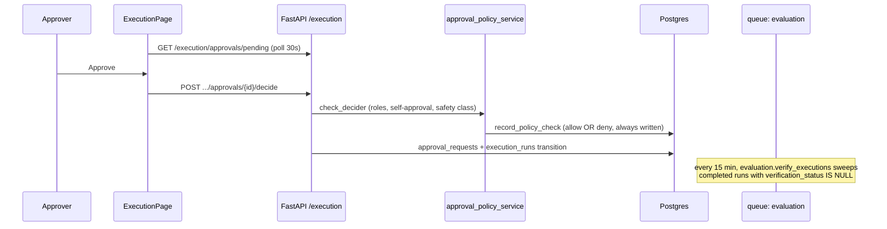
17. **Common Issues**:
    - **"I approved my own run and it failed."** `forbid_self_approval` is doing its job. Note the
      residual: separation of duties covers initiator↔approver only, never recommender↔approver
      (`codewiki/KNOWN_GAPS.md:12`).
    - **Verification says `verified` but nothing was fixed.** A known false-positive shape:
      verification infers success from the *absence* of new incident threads and alerts, so a CI
      that simply stopped emitting telemetry reads as verified
      (`codewiki/KNOWN_GAPS.md:24`).
    - **Approvals expired.** An `execution.approval_expired` operational event is written; the run
      does not proceed.
18. **Importance Rating**: 8/10.

---

### Decisions

1. **Business Purpose**: First-class decision traces — what was decided, which options were
   considered and rejected, on what evidence, and how it turned out.
2. **User Workflow**:
   - Open `/decisions`; filter by type, step, session, or review state.
   - Select one to see its chain.
   - Follow the chain back to the evidence and forward to the outcome.
3. **Route**: `/decisions`
4. **Frontend Files**:
   - `frontend/src/app/(dashboard)/decisions/page.tsx` (list at 151-152, chain at 156-157, deep-link
     detail at 162-163)
   - `frontend/src/components/decisions/decision-chain.tsx`
   - `frontend/src/components/decisions/decision-detail.tsx`
5. **Components Used**: `PageHeader`, `DataTable`, `StatusBadge`, `DecisionChain`,
   `DecisionDetail`.
6. **Backend APIs Called**:
   - `GET /api/v1/decisions` with `min_confidence`, `max_confidence`,
     `sort=confidence_desc|confidence_asc|created_desc`, `session_id`, and type filters
   - `GET /api/v1/decisions/{id}`, `GET /api/v1/decisions/{id}/chain`
   - `GET /api/v1/decisions/similar`, `GET /api/v1/decisions/effectiveness`
   - `POST /api/v1/decisions`, `POST /api/v1/decisions/{id}/reject`
7. **Backend Files Involved**:
   - `backend/src/contextedge/api/v1/decisions.py` (routes at 50, 93, 135, 159, 196, 228, 240, 268,
     278, 304)
   - `backend/src/contextedge/services/decision_service.py`
   - `backend/src/contextedge/workers/decision_tasks.py`
     (`evaluation.mine_decision_patterns:34`, `evaluation.calibrate_decision_confidence:130`)
8. **Database Tables**: `decisions`, `decision_options`, `decision_outcomes`, `decision_evidence`,
   `decision_claims`, `decision_action_policies`, `decision_trace_events`, `graph_edges`.
9. **Vector Operations**: `GET /decisions/similar` runs cosine similarity over `decisions.embedding`
   using the halfvec HNSW expression index from migration `0032`.
10. **Context Graph Usage**: Heavy. Decisions carry typed edges `based_on`, `considered`, `chose`,
    `applied_policy`, `required_approval`, `resulted_in`, `followed_by`
    (`codewiki/KNOWN_GAPS.md:352`). The chain view walks them.
11. **Embedding Usage**: Written on create by `ai/embeddings.embed_decision`; read by similarity.
12. **MAF Agent Usage**: Indirect — decision write-back is the flywheel the agent's proposals feed.
13. **LLM Usage**: None at read time. Two daily beat jobs operate on this data:
    `evaluation.mine_decision_patterns` (deliberately tenant-wide; emits counts into operational
    events, not synthesized content — `codewiki/KNOWN_GAPS.md:123`) and
    `evaluation.calibrate_decision_confidence`.
14. **Permissions**: No `require_role` in `decisions.py`; results are tenant-scoped.
15. **Example Request/Response**:
    **Request:**
    ```http
    GET /api/v1/decisions?min_confidence=0.5&sort=confidence_asc&limit=50 HTTP/1.1
    Authorization: Bearer <jwt>
    ```
    **Response:**
    ```json
    [
      {
        "id": "d1a9...-34",
        "decision_type": "playbook_selection",
        "summary": "Selected VPN gateway certificate renewal playbook",
        "confidence": 0.62,
        "session_id": "3b8e...-91",
        "created_at": "2026-08-19T09:22:31Z"
      }
    ]
    ```
16. **Complete Data Flow**:
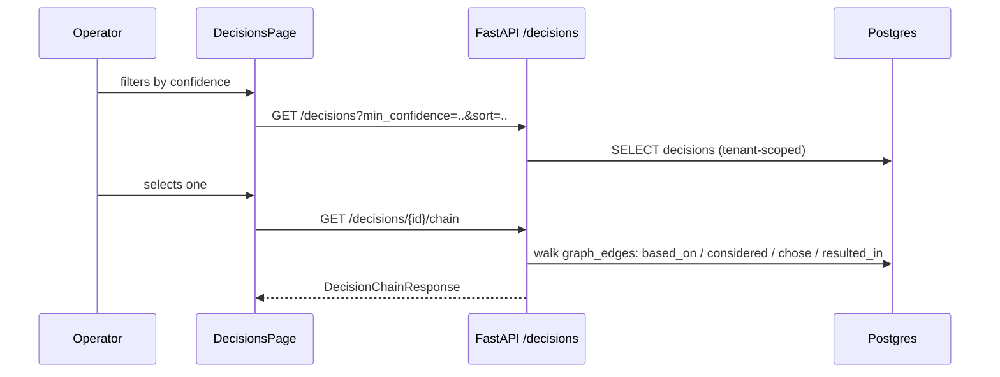
17. **Common Issues**:
    - **Two decision tables.** `decisions` (+ options/outcomes) is the first-class model;
      `decision_trace_events` is the older flat audit trail, kept for backward compatibility. Do not
      treat them as duplicates.
    - **Confidence moved without anyone editing anything.** The daily
      `evaluation.calibrate_decision_confidence` job adjusts it.
18. **Importance Rating**: 8/10.

---

### Contradictions

1. **Business Purpose**: Surface conflicts between approved playbooks and knowledge-base evidence,
   so someone decides which one is right instead of both quietly staying in retrieval.
2. **User Workflow**:
   - Open `/contradictions`; filter by resolution status (the list defaults to `open`).
   - Read the two conflicting accounts, `source_a_ref` against `source_b_ref`.
   - Set a status. The four the UI offers are **open, acknowledged, resolved, suppressed**
     (`frontend/src/app/(dashboard)/contradictions/page.tsx:26`) — there is no "dismissed".
3. **Route**: `/contradictions`
4. **Frontend Files**:
   - `frontend/src/app/(dashboard)/contradictions/page.tsx` (list at 140-144, status patch at 41)
5. **Components Used**: `PageHeader`, `DataTable`, `StatusBadge`, `PaginationControls`.
6. **Backend APIs Called**:
   - `GET /api/v1/contradictions?resolution_status=…` — the query parameter is
     `resolution_status`, not `status` (`contradictions/page.tsx:143`)
   - `PATCH /api/v1/contradictions/{id}/status` (`contradictions/page.tsx:41`)
7. **Backend Files Involved**:
   - `backend/src/contextedge/api/v1/contradictions.py` (routes at 17, 37)
   - `backend/src/contextedge/services/contradiction_service.py` (`scan_contradictions`)
   - `backend/src/contextedge/workers/evaluation_tasks.py:88`
     (`evaluation.scan_contradictions_task`, every 12 hours)
8. **Database Tables**: `contradictions`, `contradiction_scan_state`, `playbook_versions`,
   `evidence_items`.
9. **Vector Operations**: Detection uses semantic proximity to find candidate conflicts; the page
   itself reads rows.
10. **Context Graph Usage**: A resolved contradiction can write a `contradicts` edge, which the
    runtime ranker reads as part of its negative penalty
    (`backend/src/contextedge/search/hybrid_ranker.py:140-163`).
11. **Embedding Usage**: In detection only.
12. **MAF Agent Usage**: None.
13. **LLM Usage**: Not on this page — but the 12-hourly scan **is** LLM-bearing and carries a real
    cost note in the runbook. `contradiction_scan_state` exists so a scan resumes rather than
    re-paying.
14. **Permissions**: `knowledge_manager` on both routes
    (`backend/src/contextedge/api/v1/contradictions.py`).
15. **Example Request/Response**:
    **Request:**
    ```http
    PATCH /api/v1/contradictions/c88a...-12/status HTTP/1.1
    Authorization: Bearer <jwt>
    Content-Type: application/json

    { "resolution_status": "resolved",
      "description": "KB article superseded; playbook is correct" }
    ```
    `ContradictionStatusUpdate` has exactly two fields, `resolution_status` and `description`
    (`backend/src/contextedge/schemas/review.py:22-24`) — there is no `resolution_note`.
    **Response:**
    ```json
    { "id": "c88a...-12", "source_a_ref": "playbook_version:pv44...-1c",
      "source_b_ref": "evidence:e8b0...-2d", "contradiction_type": "step_conflict",
      "description": "KB article superseded; playbook is correct",
      "resolution_status": "resolved", "resolved_by": "u33c...-01",
      "updated_at": "2026-08-19T13:11:02Z" }
    ```
16. **Complete Data Flow**:
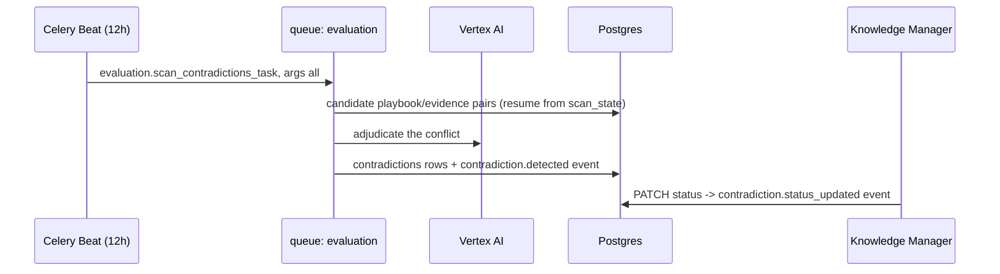
17. **Common Issues**:
    - **Nothing new appears.** The scan runs every 12 hours. With `args=("all",)` the task loops
      every tenant in **one session with no per-tenant `try`** (`evaluation_tasks.py:108-113`), so a
      single failing tenant aborts the whole loop, rolls the shared transaction back, logs
      `contradiction.scan_failed` and burns the task's one retry. One bad tenant **does** block the
      sweep. What limits the damage is `contradiction_scan_state`: `_needs_rescan`
      (`contradiction_service.py:304-316`) re-scans a pair only when its state row is missing or the
      evidence's `updated_at` is newer than `last_scanned_at`, so the retry does not re-pay for pairs
      already scanned — there is no time-based staleness window at all.
    - **This is a cost centre.** The scan is one of the few beat jobs that spends LLM budget on a
      schedule.
18. **Importance Rating**: 9/10.

---

### Negative Knowledge

1. **Business Purpose**: Record what does **not** work — ineffective, conditional, deprecated, or
   prohibited steps — so the system stops recommending them.
2. **User Workflow**:
   - Open `/negative-knowledge`; filter by status.
   - Add an item describing the failed approach and its scope.
   - Edit or delete as understanding improves.
3. **Route**: `/negative-knowledge`
4. **Frontend Files**:
   - `frontend/src/app/(dashboard)/negative-knowledge/page.tsx` (list at 170-174, create/update at
     49-60, delete at 133)
5. **Components Used**: `PageHeader`, `DataTable`, `StatusBadge`, shadcn form primitives.
6. **Backend APIs Called**:
   - `GET|POST /api/v1/negative-knowledge`
   - `PATCH|DELETE /api/v1/negative-knowledge/{item_id}`
7. **Backend Files Involved**:
   - `backend/src/contextedge/api/v1/negative_knowledge.py` (routes at 17, 36, 58, 83)
   - `backend/src/contextedge/search/hybrid_ranker.py:140-163` (the consumer)
8. **Database Tables**: `negative_knowledge_items`.
9. **Vector Operations**: None.
10. **Context Graph Usage**: Read by the ranker's negative-penalty computation alongside
    `contradicts` edges.
11. **Embedding Usage**: None.
12. **MAF Agent Usage**: None.
13. **LLM Usage**: None.
14. **Permissions**: `knowledge_manager` on the three mutating routes
    (`backend/src/contextedge/api/v1/negative_knowledge.py`). The nav item is additionally visible
    to `domain_admin` and `tenant_admin` (`frontend/src/components/shell/sidebar-nav.tsx:57`).
15. **Example Request/Response**:
    **Request:**
    ```http
    POST /api/v1/negative-knowledge HTTP/1.1
    Authorization: Bearer <jwt>
    Content-Type: application/json

    { "step_text": "Restart the VPN service on vpn-gw-east-01",
      "failure_reason": "Does not clear an expired gateway certificate; the cert must be reissued",
      "status": "ineffective",
      "domain_id": "d0c2...-19" }
    ```
    The required field is `step_text` — there is no `title`
    (`backend/src/contextedge/schemas/review.py:47-52`), and the page sends `step_text` plus
    `failure_reason` and `status` (`negative-knowledge/page.tsx:49-58`).
    **Response (201):**
    ```json
    { "id": "nk12...-9a", "tenant_id": "t001...-aa", "domain_id": "d0c2...-19",
      "step_text": "Restart the VPN service on vpn-gw-east-01",
      "failure_reason": "Does not clear an expired gateway certificate; the cert must be reissued",
      "status": "ineffective", "evidence_refs": null,
      "created_at": "2026-08-19T13:30:00Z" }
    ```
16. **Complete Data Flow**:
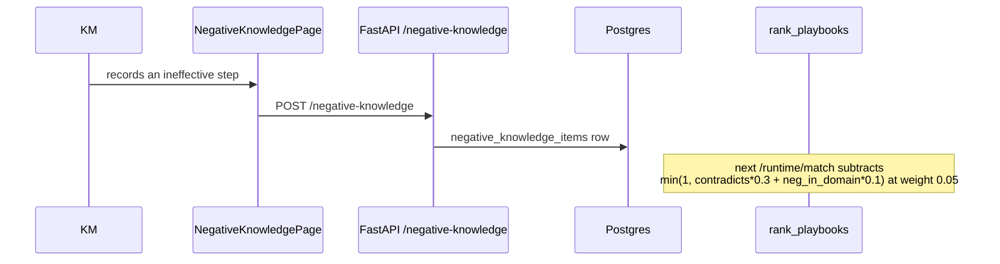
17. **Common Issues**:
    - **"It did not change the ranking much."** The penalty weight is −0.05 and the count term is
      0.1 per item, so a single note nudges rather than suppresses. Domain scope matters: only items
      in the playbook's domain count.
18. **Importance Rating**: 8/10.

---

### Identities

1. **Business Purpose**: Entity resolution. `jdoe`, `John Doe`, `john.doe@acme.com`, and
   `vpn-gw-east-01` versus `VPN-GW-EAST-01` must each collapse to one trusted entity before
   correlation and retrieval can rely on them.
2. **User Workflow**:
   - Open `/identities`; search, or filter by `resolution_state`.
   - Edit aliases and resolution state.
   - Merge duplicates into one canonical identity.
3. **Route**: `/identities`
4. **Frontend Files**:
   - `frontend/src/app/(dashboard)/identities/page.tsx` (list at 195-199, patch at 41, merge at 134)
5. **Components Used**: `PageHeader`, `DataTable`, `StatusBadge`, `SearchableSelect`,
   `PaginationControls`.
6. **Backend APIs Called**:
   - `GET /api/v1/identities` — this page sends only `query` plus pagination
     (`identities/page.tsx:194-200`); the `resolution_state` filter the endpoint also supports is
     what `/suggestions` uses
   - `PATCH /api/v1/identities/{id}` (`identities/page.tsx:41`)
   - `POST /api/v1/identities/merge` (`identities/page.tsx:134`)
   - `GET /api/v1/identities/merge-proposals` and
     `POST /api/v1/identities/merge-proposals/{id}/decide` — on the API
     (`backend/src/contextedge/api/v1/identities.py:186, 250`), not yet wired to this page
7. **Backend Files Involved**:
   - `backend/src/contextedge/api/v1/identities.py` (routes at 32, 71, 162, 186, 250)
   - `backend/src/contextedge/services/identity_service.py`
   - `backend/src/contextedge/services/identity_reconciliation_service.py`
   - `backend/src/contextedge/workers/identity_tasks.py`
     (`identity.reconcile_identities:147` daily, `extraction.rebuild_identity_snapshots:72`)
8. **Database Tables**: `canonical_identities`, `identity_aliases`, `evidence_identity_links`,
   `identity_merge_proposals`, `pending_identifier_mentions`, `graph_edges`.
9. **Vector Operations**: None. Resolution is layered: exact strong-alias match, normalized-name
   match, then LLM adjudication — not embedding similarity.
10. **Context Graph Usage**: Resolution writes `mentions_identity` edges from evidence
    (`backend/src/contextedge/services/identity_service.py:893-906`), and emits
    `identity.resolved` / `identity.resolution_decision` / `identity.merged` operational events.
11. **Embedding Usage**: None.
12. **MAF Agent Usage**: None on this page; identities are a seed layer in the agent projection.
13. **LLM Usage**: None at read time. Identity extraction happens inside
    `extraction.normalize_evidence`, and adjudication confidence is threshold-gated — the person
    auto-link threshold is 0.95, which is why the config deliberately leaves thinking budgets
    uncapped for identity work: a controlled comparison returned the same verdict at every budget
    while its *confidence* moved 0.95 → 0.80, which would have quietly turned auto-links into
    review-queue items (`backend/src/contextedge/config.py:151-167`).
14. **Permissions**: `knowledge_manager` on all five routes
    (`backend/src/contextedge/api/v1/identities.py`); nav visible also to `domain_admin` and
    `tenant_admin`.
15. **Example Request/Response**:
    **Request:**
    ```http
    POST /api/v1/identities/merge HTTP/1.1
    Authorization: Bearer <jwt>
    Content-Type: application/json

    { "primary_identity_id": "id77...-b1", "duplicate_identity_id": "id90...-c4" }
    ```
    `IdentityMergeRequest` is exactly this pair — one duplicate per call, not a list
    (`backend/src/contextedge/schemas/review.py:118-120`; the page sends it at
    `identities/page.tsx:134-137`).
    **Response** (an `IdentityResponse`, `backend/src/contextedge/schemas/review.py:89-102`) — the
    folded-in aliases come back as the `aliases` array; there is no `alias_count` scalar:
    ```json
    { "id": "id77...-b1", "tenant_id": "t001...-aa",
      "canonical_name": "vpn-gw-east-01", "entity_type": "ci",
      "resolution_state": "resolved", "resolution_confidence": 1.0,
      "resolution_method": "human_merge", "is_active": true,
      "aliases": [
        { "id": "al01...-77", "alias_text": "VPN-GW-EAST-01", "confidence": 1.0 },
        { "id": "al02...-3d", "alias_text": "vpn-gw-east-01.acme.local", "confidence": 1.0 }
      ] }
    ```
    A human merge stamps `resolution_method = "human_merge"` on the survivor
    (`backend/src/contextedge/services/identity_service.py:1153`), which is how a reviewed identity
    stays distinguishable from a machine-resolved one.
16. **Complete Data Flow**:
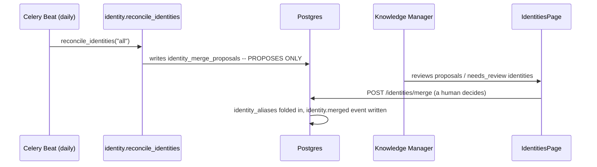
17. **Common Issues**:
    - **"The nightly job did not merge anything."** Correct — it proposes; a human decides
      (`backend/src/contextedge/workers/identity_tasks.py:147-195`).
    - **Strong aliases collide.** Strong alias types (email, username, hostname, FQDN, IP, serial,
      external id) are unique per tenant via a partial index; display names are not.
    - **Where do I review parked identities?** `/suggestions`, which lists
      `resolution_state = needs_review` with resolve/deactivate actions
      (`codewiki/KNOWN_GAPS.md:159`).
18. **Importance Rating**: 9/10.

---

### Correlations

1. **Business Purpose**: Explicit links between distinct evidence items — "this Teams thread is the
   same outage as `INC0010427`". Correlation is what turns scattered records into one case.
2. **User Workflow**:
   - Open `/correlations`; existing edges list.
   - Create an edge between two evidence items.
   - Record a decision on an edge, or delete it.
3. **Route**: `/correlations`
4. **Frontend Files**:
   - `frontend/src/app/(dashboard)/correlations/page.tsx` (list at 313-314, evidence picker at
     318-319, create at 111, decision at 223, delete at 325)
5. **Components Used**: `PageHeader`, `DataTable`, `StatusBadge`, `SearchableSelect`.
6. **Backend APIs Called**:
   - `GET|POST /api/v1/correlations`
   - `PATCH /api/v1/correlations/{id}`, `DELETE /api/v1/correlations/{id}`
   - `POST /api/v1/correlations/{id}/decision`
   - `GET /api/v1/evidence?limit=200` (to populate the pickers)
7. **Backend Files Involved**:
   - `backend/src/contextedge/api/v1/correlations.py` (routes at 26, 51, 237, 263, 330)
   - `backend/src/contextedge/workers/correlation_tasks.py:16`
     (`extraction.correlate_evidence`)
   - `backend/src/contextedge/services/ticket_bridge_service.py`
8. **Database Tables**: `correlation_edges`, `correlation_suggestions`,
   `evidence_case_memberships`, `case_links`, `evidence_items`.
9. **Vector Operations**: The automated correlator uses chunk-embedding proximity; manual edges
   created here do not.
10. **Context Graph Usage**: Correlation edges are read directly by the runtime ranker's graph
    signal (`backend/src/contextedge/search/hybrid_ranker.py:57-112`).
11. **Embedding Usage**: In the automated path only.
12. **MAF Agent Usage**: None.
13. **LLM Usage**: `extraction.correlate_evidence` has two tiers, the second of which adjudicates
    with a model; this page's manual edges bypass both.
14. **Permissions**: `knowledge_manager` on twelve routes — the most heavily gated router in the API
    (`backend/src/contextedge/api/v1/correlations.py`).
15. **Example Request/Response**:
    **Request:**
    ```http
    POST /api/v1/correlations HTTP/1.1
    Authorization: Bearer <jwt>
    Content-Type: application/json

    { "source_evidence_id": "e1f4...-77",
      "target_evidence_id": "e8b0...-2d",
      "correlation_type": "same_issue",
      "confidence": 0.9,
      "explanation": "Same outage window and the same gateway CI" }
    ```
    The field is `correlation_type` throughout — there is no `relationship_type` anywhere in this
    API (`backend/src/contextedge/schemas/review.py:123-149`; the page sends it at
    `correlations/page.tsx:111-115`).
    **Response (201):**
    ```json
    { "id": "ce55...-3b", "tenant_id": "t001...-aa",
      "source_evidence_id": "e1f4...-77", "target_evidence_id": "e8b0...-2d",
      "correlation_type": "same_issue", "confidence": 0.9,
      "explanation": "Same outage window and the same gateway CI",
      "created_by": "u33c...-01", "created_at": "2026-08-19T14:02:00Z" }
    ```
16. **Complete Data Flow**:
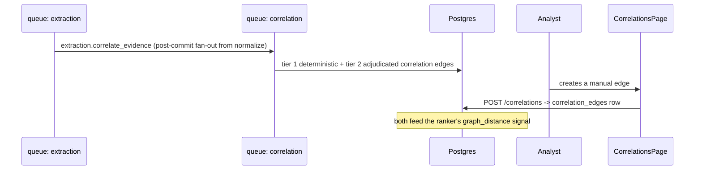
17. **Common Issues**:
    - **Nothing correlates automatically.** `extraction.correlate_evidence` routes to the dedicated
      `correlation` queue, added on 2026-08-17 after the task was dispatched but never consumed —
      episodes, patterns, and playbooks all sat at zero after 193 evidence items
      (`backend/src/contextedge/workers/celery_app.py:234-258`). Confirm the fleet consumes
      `correlation`.
    - **Suggestions versus edges.** Machine-proposed pairs live at `/suggestions`, not here.
      Accepting one there creates the edge you see here; rejecting is permanent for that pair.
18. **Importance Rating**: 8/10.

---

### Review Queues (Suggestions)

1. **Business Purpose**: Three machine-proposed decision queues in one page — semantic evidence
   pairs, fleet incident groups, and identities the resolver parked for human eyes. This is the
   sidebar item labelled **"Review Queues"**, distinct from **"Review Queue"** at `/review`.
   *Missing entirely from earlier versions of this document.*
2. **User Workflow**:
   - Open `/suggestions`.
   - Accept or reject correlation suggestions (accepting creates an edge; rejecting is permanent for
     that pair).
   - Accept or reject fleet group suggestions (accepting mints a parent case).
   - Resolve or deactivate identities in `needs_review`.
3. **Route**: `/suggestions`
4. **Frontend Files**:
   - `frontend/src/app/(dashboard)/suggestions/page.tsx` (303 lines; three queries at 37, 127, 206)
5. **Components Used**: `PageHeader`, `DataTable`, `StatusBadge`.
6. **Backend APIs Called**:
   - `GET /api/v1/correlations/suggestions?status=pending`
   - `POST /api/v1/correlations/suggestions/{id}/accept|reject`
   - `GET /api/v1/correlations/fleet-suggestions?status=pending`
   - `POST /api/v1/correlations/fleet-suggestions/{id}/accept|reject`
   - `GET /api/v1/identities?resolution_state=needs_review`
   - `PATCH /api/v1/identities/{id}`
   - (`GET /api/v1/correlations/suggestions/stats` also exists.)
7. **Backend Files Involved**:
   - `backend/src/contextedge/api/v1/correlations.py` (routes at 70, 125, 138, 152, 172, 212, 223)
   - `backend/src/contextedge/api/v1/identities.py:32, 71`
   - `backend/src/contextedge/workers/suggestion_tasks.py:26`
     (`evaluation.generate_correlation_suggestions`)
   - `backend/src/contextedge/workers/fleet_tasks.py:41` (`evaluation.detect_fleet_groups`,
     every 30 minutes)
8. **Database Tables**: `correlation_suggestions`, `fleet_group_suggestions`, `correlation_edges`,
   `canonical_identities`, `case_links`, `evidence_case_memberships`.
9. **Vector Operations**: Correlation suggestions come from chunk-embedding proximity — the task is
   dispatched immediately after `extraction.embed_chunks_batch` commits, so it can never race an
   unwritten embedding (`backend/src/contextedge/workers/chunk_tasks.py:261-262`).
10. **Context Graph Usage**: Accepting a correlation suggestion writes a `correlation_edges` row;
    accepting a fleet group creates a parent case and `case_links`.
11. **Embedding Usage**: Upstream, in the suggestion generator.
12. **MAF Agent Usage**: None.
13. **LLM Usage**: None at read time. Fleet detection is deterministic
    (`backend/src/contextedge/workers/fleet_tasks.py:1-50`).
14. **Permissions**: `knowledge_manager` on the correlation-suggestion routes and on
    `PATCH /identities/{id}`; the nav item is visible to `knowledge_manager`, `domain_admin`, and
    `tenant_admin` (`frontend/src/components/shell/sidebar-nav.tsx:60`).
15. **Example Request/Response**:
    **Request:**
    ```http
    POST /api/v1/correlations/suggestions/cs31...-7f/accept HTTP/1.1
    Authorization: Bearer <jwt>
    ```
    **Response** — accepting mints a `CorrelationEdgeResponse`, the same shape the Correlations tab
    shows (`backend/src/contextedge/api/v1/correlations.py:212`):
    ```json
    { "id": "ce90...-11", "tenant_id": "t001...-aa",
      "source_evidence_id": "e1f4...-77", "target_evidence_id": "e8b0...-2d",
      "correlation_type": "same_issue", "confidence": 0.74,
      "explanation": "Chunk-embedding proximity above the suggestion floor",
      "created_at": "2026-08-19T14:20:00Z" }
    ```
16. **Complete Data Flow**:
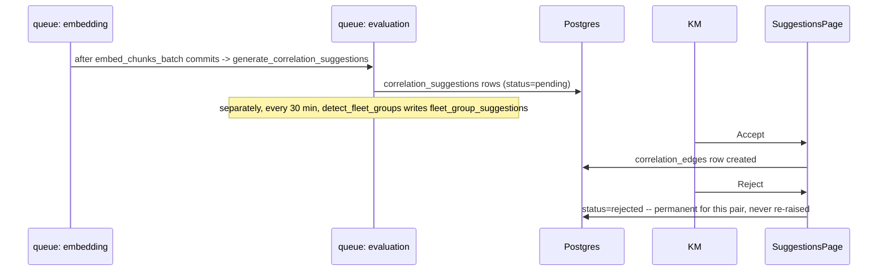
17. **Common Issues**:
    - **Rejection cannot be undone from the UI.** It is permanent per pair by design, so a
      scheduled pass never re-raises a declined suggestion.
    - **Three empty queues.** Check that the `embedding` and `evaluation` queues have consumers; the
      correlation-suggestion generator only runs after chunk embeddings land.
18. **Importance Rating**: 8/10.

---

### Graph Explorer

1. **Business Purpose**: Read-only exploration of the context graph — statistics, subgraphs,
   neighbours, the agent-facing projection, and pending edge proposals.
2. **User Workflow**:
   - Open `/graph-explorer`; choose a domain scope and optionally an "as of" timestamp.
   - **Statistics**: node and edge counts by type.
   - **Subgraph**: pick a node, choose a depth, render it.
   - **Neighbors**: breadth-first neighbour browsing with an edge-type filter.
   - **Agent Context**: preview the exact subset an agent would receive.
   - **Proposals**: approve or reject proposed edges.
3. **Route**: `/graph-explorer`
4. **Frontend Files**:
   - `frontend/src/app/(dashboard)/graph-explorer/page.tsx` (161 lines; **five** `TabsTrigger`
     entries at 113-127)
   - `frontend/src/components/graph/graph-stats.tsx`, `graph-subgraph.tsx`, `graph-neighbors.tsx`,
     `graph-node-picker.tsx`, `graph-query-controls.tsx`, `agent-context-preview.tsx`,
     `edge-proposals.tsx`, `graph-layout.ts`, `graph-constants.ts`
   - `frontend/src/lib/graph-api.ts`
5. **Components Used**: `PageHeader`, shadcn `Tabs`, the graph component set, `@xyflow/react` for
   rendering and `dagre` for layout.
6. **Backend APIs Called** (all via `frontend/src/lib/graph-api.ts:18-50`, each carrying
   `domain_id` and `as_of` scope params from `scopeParams` at 11-16):
   - `GET /api/v1/graph/stats`
   - `GET /api/v1/graph/subgraph/{entity_type}/{entity_id}?max_depth=`
   - `GET /api/v1/graph/neighbors?node_type=&node_id=&edge_type=&max_depth=`
   - `POST /api/v1/graph/agent-subsets`
   - `GET /api/v1/graph/edge-proposals`, `POST /api/v1/graph/edge-proposals/{id}/approve|reject`
7. **Backend Files Involved**:
   - `backend/src/contextedge/api/v1/graph.py` (routes at 18, 120, 142, 167, 190, 220, 242)
   - `backend/src/contextedge/graph/agent/` (`repository.py`, `profiles.py`, `hydrators.py`,
     `materializer.py`)
   - `backend/src/contextedge/workers/graph_tasks.py:33`
     (`evaluation.reconcile_graph_relationships`, every 6 hours)
8. **Database Tables**: `graph_edges` plus every node table it points at — `evidence_items`,
   `episodes`, `patterns`, `playbooks`, `canonical_identities`, `decisions`, `issue_signatures`,
   `entities`, `entity_classes`.
9. **Vector Operations**: Only inside the Agent Context tab's seed resolution, which mixes
   full-text and structured seed layers.
10. **Context Graph Usage**: This tab **is** the context graph surface. `as_of` makes the temporal
    predicates real — you can look at the graph as it stood before the Acme incident.
11. **Embedding Usage**: Only in agent seed resolution.
12. **MAF Agent Usage**: **The only place in the UI that touches it.**
    `POST /graph/agent-subsets` returns the `maf.v1` projection: seeds are resolved across layers
    (including issue signatures, whose slug fields are de-slugged before `to_tsvector` so query
    words can match at all, then ranked by `ts_rank` desc with `episode_count` desc only breaking
    ties — `backend/src/contextedge/graph/agent/repository.py:262-310`), traversed under a profile
    budget, and hydrated per node type (`issue_signature` is in both the profile's node set and the
    hydrator map — `graph/agent/profiles.py:85`, `graph/agent/hydrators.py:53, 634`).
    **Unapproved episode drafts are now visible to the agent**, which is worth knowing before you
    read the preview and think something leaked. Visible states are `approved` and `pending_review`
    (`graph/agent/hydrators.py:108, 152`), but a draft is fenced three ways: it draws on its own
    `UNAPPROVED_EPISODE_SEED_LIMIT = 2` seed slots so it can never evict a reviewed precedent, its
    relevance is multiplied by `UNAPPROVED_SEED_RELEVANCE_FACTOR = 0.8` so an approved episode wins
    any tie (`graph/agent/repository.py:106-117`), and its label is prefixed `[UNAPPROVED DRAFT]`
    with an `agent_caveat` fact attached — because a bare `reviewer_state` enum sitting among a
    dozen sibling facts is not a warning the model will act on
    (`graph/agent/hydrators.py:438-463`). The seed reason is `query_semantic_unapproved`, so a
    decision trace shows exactly which draft was admitted (`repository.py:498-507`).
13. **LLM Usage**: None.
14. **Permissions**: `knowledge_manager` on five routes — edge-proposal list, approve, and reject
    (`graph.py:129, 151, 174`) plus `fix-outcomes` and `fix-applicability` (`graph.py:64, 88`).
    The Statistics, Subgraph, Neighbors, and **Agent Context** tabs are ungated beyond tenant
    scoping, so the Proposals tab is the only one that can 403 for a non-knowledge-manager.
15. **Example Request/Response**:
    **Request:**
    ```http
    GET /api/v1/graph/subgraph/episode/9c1f...-a4?max_depth=2&domain_id=d0c2...-19 HTTP/1.1
    Authorization: Bearer <jwt>
    ```
    **Response** — nodes carry `title` (not `label`), edge endpoints are the composite
    `"{type}:{id}"` node keys, and a `truncated` flag reports whether the node/edge budget cut the
    traversal short (`backend/src/contextedge/graph/queries.py:108-113, 176-181, 368-372`):
    ```json
    {
      "nodes": [
        { "type": "episode", "id": "9c1f...-a4", "title": "VPN gateway certificate expiry" },
        { "type": "issue_signature", "id": "is22...-05",
          "title": "remote_access|tls_certificate|certificate_expired" },
        { "type": "evidence", "id": "e1f4...-77", "title": "INC0010427" }
      ],
      "edges": [
        { "source": "episode:9c1f...-a4", "target": "issue_signature:is22...-05",
          "type": "has_signature", "weight": 1.0 },
        { "source": "episode:9c1f...-a4", "target": "evidence:e1f4...-77",
          "type": "derived_from", "weight": 1.0 }
      ],
      "truncated": false
    }
    ```
16. **Complete Data Flow**:
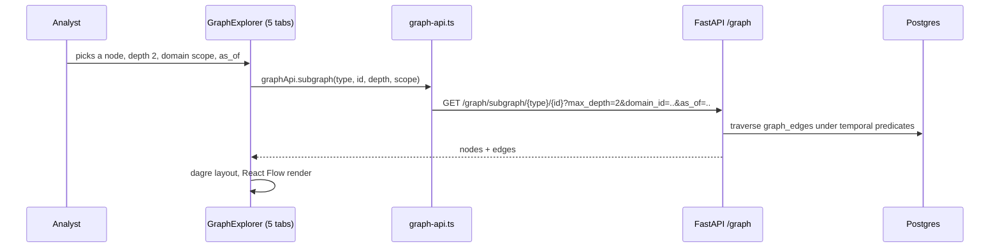
17. **Common Issues**:
    - **"I cannot edit the graph."** By design. The page visualizes and traverses but cannot create,
      edit, or delete edges. Every mutation happens in backend services — pattern discovery,
      playbook generation, contradiction scans, identity linking, decision extraction, episode
      construction, plus the 6-hourly `evaluation.reconcile_graph_relationships` materializer
      (`codewiki/KNOWN_GAPS.md:226`).
    - **Sparse graph after a fresh ingest.** The materializer runs every 6 hours; it is idempotent
      because `ensure_edge` is ON CONFLICT-safe. You can wait or dispatch it.
    - **Large depths get slow.** Depth is the cost driver; keep it at 2 unless you have a reason.
18. **Importance Rating**: 10/10.

---

### Drift

1. **Business Purpose**: Which approved playbooks look stale, and why. Prevents Acme from running a
   certificate procedure written for a gateway that has since been replaced.
2. **User Workflow**:
   - Open `/drift`; alerts list with severity.
   - Read the issue codes on each alert.
   - Regenerate the playbook from its pattern, or open the playbook.
3. **Route**: `/drift`
4. **Frontend Files**:
   - `frontend/src/app/(dashboard)/drift/page.tsx` (query at 95-96, regenerate at 23)
5. **Components Used**: `PageHeader`, `StatusBadge`, `DataTable`.
6. **Backend APIs Called**:
   - `GET /api/v1/drift/alerts` — the router's **only** route
     (`backend/src/contextedge/api/v1/drift.py:19`)
   - `POST /api/v1/playbooks/generate` (regenerate from the pattern)
7. **Backend Files Involved**:
   - `backend/src/contextedge/api/v1/drift.py`
   - `backend/src/contextedge/services/drift_service.py`
     (`list_drift_alerts:13`, `check_playbook_drift:104`)
   - `backend/src/contextedge/workers/evaluation_tasks.py:41` (`evaluation.detect_drift`,
     every 6 hours)
8. **Database Tables**: `playbooks`, `playbook_versions`, `patterns`, `retrieval_feedback`.
   **There is no `drift_alerts` table** — alerts are computed on read.
9. **Vector Operations**: None.
10. **Context Graph Usage**: None.
11. **Embedding Usage**: None.
12. **MAF Agent Usage**: None.
13. **LLM Usage**: None on read. Clicking "regenerate" dispatches playbook generation, which is
    LLM-bearing.
14. **Permissions**: No `require_role` in `drift.py`; results are tenant-scoped. Regenerating needs
    `knowledge_manager` on the playbooks router.
15. **Example Request/Response**:
    **Request:**
    ```http
    GET /api/v1/drift/alerts HTTP/1.1
    Authorization: Bearer <jwt>
    ```
    **Response** — the four issue codes are exactly these
    (`backend/src/contextedge/services/drift_service.py:31-66`):
    ```json
    [
      {
        "playbook_id": "pb77...-e0",
        "title": "Renew and deploy VPN gateway certificate",
        "issues": ["not_validated_in_142_days", "high_negative_feedback_4"],
        "severity": "high"
      }
    ]
    ```
    - `past_expiry` — `expiry_at` is in the past.
    - `not_validated_in_{N}_days` — `last_validated_at` older than 90 days.
    - `high_negative_feedback_{N}` — 3 or more `retrieval_feedback` rows of type `wrong_match`,
      `step_ineffective`, or `expired_workaround` in the last 30 days.
    - `pattern_nodes_added_drift` — the source pattern was updated after the playbook was.
16. **Complete Data Flow**:
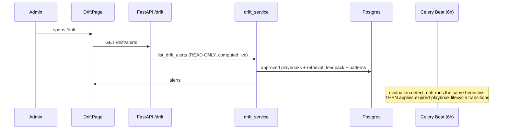
17. **Common Issues**:
    - **Alerts differ from Overview's list.** They should — Overview uses a smaller browser-side
      heuristic without negative feedback or pattern drift.
    - **A playbook silently changed state.** The HTTP endpoint is read-only, but the 6-hourly beat
      job snapshots alerts *while still approved* and then applies expiry transitions
      (`drift_service.py:108-113`).
    - **Nothing is ever flagged.** Only `lifecycle_state = "approved"` playbooks are considered
      (`drift_service.py:19-22`).
18. **Importance Rating**: 9/10.

---

### Policies

1. **Business Purpose**: Tenant governance — retention windows, classification rules, access rules,
   and approval gates. This is where Acme decides that VPN evidence with resolved identities is
   long-term memory.
2. **User Workflow**:
   - Open `/policies`; policies arrive already grouped by type.
   - Create or edit one; edit its JSON config.
   - Delete an unused policy.
3. **Route**: `/policies`
4. **Frontend Files**:
   - `frontend/src/app/(dashboard)/policies/page.tsx` (query at 355-356, create at 112,
     patch at 142, delete at 159)
5. **Components Used**: `PageHeader`, `DataTable`, `StatusBadge`, shadcn tabs/form.
6. **Backend APIs Called**:
   - `GET /api/v1/policies` (returns `PoliciesGroupedResponse`)
   - `POST /api/v1/policies`
   - `PATCH /api/v1/policies/{policy_id}`
   - `DELETE /api/v1/policies/{policy_id}`
7. **Backend Files Involved**:
   - `backend/src/contextedge/api/v1/policies.py` (routes at 57, 83, 120, 148; version bump logic at
     133-140)
   - `backend/src/contextedge/models/policy.py` (`POLICY_TYPES:21-23`, `TenantPolicy:31-67`,
     `PolicyCheck:70-128`)
   - `backend/src/contextedge/services/policy_assignment.py` (`assert_policy_assignment`)
   - `backend/src/contextedge/services/policy_check_service.py:34`
8. **Database Tables**: `tenant_policies`, `policy_checks`, `action_policies`.
9. **Vector Operations**: None.
10. **Context Graph Usage**: None.
11. **Embedding Usage**: None.
12. **MAF Agent Usage**: None.
13. **LLM Usage**: None.
14. **Permissions**: The API allows reads for `tenant_admin`, `domain_admin`, or
    `knowledge_manager` (`backend/src/contextedge/api/v1/policies.py:60-62`); create, update, and
    delete are `tenant_admin` (`policies.py:85, 127, 150`). Nav gate: `tenant_admin`. Note this
    page is stricter than the API it calls — the list query is `enabled: isTenantAdmin(roles)`
    (`policies/page.tsx:352-358`), so a `domain_admin` who reaches the URL directly sees an empty
    page rather than the policies the backend would have served them.
15. **Example Request/Response**:
    **Request:**
    ```http
    PATCH /api/v1/policies/pol4...-2e HTTP/1.1
    Authorization: Bearer <jwt>
    Content-Type: application/json

    { "config": { "retention_days": 730 } }
    ```
    **Response** — `PolicyRecordResponse` is deliberately narrow: id, name, description, config,
    is_active, timestamps (`backend/src/contextedge/api/v1/policies.py:14-23`). The `version`
    column and `policy_type` live on the row but are **not** returned here; type is implied by
    which array of `PoliciesGroupedResponse` the record arrives in, and version is what
    `policy_checks` rows point at:
    ```json
    { "id": "pol4...-2e", "name": "Acme long-term retention",
      "description": "VPN evidence with resolved identities",
      "config": { "retention_days": 730 }, "is_active": true,
      "updated_at": "2026-08-19T13:44:00Z" }
    ```
16. **Complete Data Flow**:
```mermaid
sequenceDiagram
    participant Admin
    participant Page as PoliciesPage
    participant API as FastAPI /policies
    participant DB as Postgres
    participant Exec as execution service

    Admin->>Page: edits a policy's config
    Page->>API: PATCH /policies/{id}
    API->>DB: version += 1 ONLY when config changed (rename/deactivate do not bump)
    Note over Exec: at start_execution and decide_approval,<br/>each rule evaluation appends one policy_checks row<br/>recording pass / fail / not_applicable
```
17. **Common Issues**:
    - **"I renamed a policy and the version did not change."** Correct. The version tracks *rules*,
      not labels, so a `policy_checks` row always points at the exact rule set evaluated
      (`backend/src/contextedge/api/v1/policies.py:133-140`).
    - **Retention config typo.** A boolean `retention_days` is explicitly rejected — `bool` is an
      `int` subclass in Python, so a config typo of `true` would silently mean a one-day window
      (`backend/src/contextedge/workers/retention_tasks.py:38-65`).
    - **No assignment workflow.** Source retention/classification and evidence access assignment are
      surfaced elsewhere; generic policy assignment and playbook approval-policy assignment exist in
      the backend without a first-class dashboard workflow
      (`codewiki/KNOWN_GAPS.md:201-203`).
18. **Importance Rating**: 7/10.

---

### Audit

1. **Business Purpose**: The governance log — who changed a rule, who approved an execution, who
   dispatched an AI review.
2. **User Workflow**:
   - Open `/audit`; filter by action, or by a `since` / `until` date range
     (`audit/page.tsx:77-86`). There is no actor filter in the UI.
   - Page through the results.
3. **Route**: `/audit`
4. **Frontend Files**:
   - `frontend/src/app/(dashboard)/audit/page.tsx` (174 lines; query at 78-84)
5. **Components Used**: `PageHeader`, `DataTable`, `PaginationControls`.
6. **Backend APIs Called**:
   - `GET /api/v1/audit-logs` — note the prefix is `/audit-logs`, not `/audit`
     (`backend/src/contextedge/api/v1/__init__.py:46`)
7. **Backend Files Involved**:
   - `backend/src/contextedge/api/v1/audit.py:14`
   - `backend/src/contextedge/middleware/request_audit.py:25-124` (the writer)
   - `backend/src/contextedge/models/audit.py:11-31`
8. **Database Tables**: `audit_logs` — `tenant_id`, `actor_id`, `actor_email`, `action`,
   `resource_type`, `resource_id`, `details`, `ip_address`, `timestamp`.
9. **Vector Operations**: None.
10. **Context Graph Usage**: None.
11. **Embedding Usage**: None.
12. **MAF Agent Usage**: None.
13. **LLM Usage**: None.
14. **Permissions**: `tenant_admin` on the read route (`backend/src/contextedge/api/v1/audit.py`).
    Nav gate is `tenant_admin` or `domain_admin`
    (`frontend/src/components/shell/sidebar-nav.tsx:66`) — a `domain_admin` will see the nav item
    and get a 403 from the API, which is the frontend/backend asymmetry in miniature.
15. **Example Request/Response**:
    **Request:**
    ```http
    GET /api/v1/audit-logs?limit=50&offset=0 HTTP/1.1
    Authorization: Bearer <jwt>
    ```
    **Response:**
    ```json
    [
      {
        "id": "al77...-3c",
        "actor_email": "ops@acme.example",
        "action": "http.post.api.v1.episodes.ai-review",
        "resource_type": "http_request",
        "resource_id": null,
        "details": { "path": "/api/v1/episodes/ai-review", "status": 202,
                     "outcome": "success", "request_id": "4f2c9d1a-...-b17e",
                     "correlation_id": "4f2c9d1a-...-b17e" },
        "timestamp": "2026-08-19T10:01:58Z"
      },
      {
        "id": "al78...-9b",
        "actor_email": "ops@acme.example",
        "action": "episode.ai_review_dispatched",
        "resource_type": "episode",
        "resource_id": "batch",
        "details": { "limit": 50, "mode": "advisory" },
        "timestamp": "2026-08-19T10:01:58Z"
      }
    ]
    ```
    One click, two rows: the middleware row (always `resource_type = "http_request"`, `resource_id`
    NULL, path slug including the `api.v1.` prefix —
    `backend/src/contextedge/middleware/request_audit.py:70-71, 100`) and the semantic row from the
    endpoint's own `log_audit_event` (`backend/src/contextedge/api/v1/episodes.py:593-602`).
16. **Complete Data Flow**:
```mermaid
sequenceDiagram
    participant Any as Any mutating request
    participant MW as RequestAuditMiddleware
    participant Log as structlog
    participant DB as Postgres (sync engine, off-thread)
    participant Auditor
    participant Page as AuditPage

    Any->>MW: POST/PATCH/PUT/DELETE under /api/v1 (except /auth/login)
    MW->>Log: http.mutating_request  (ALWAYS)
    MW->>DB: audit_logs row  (only when a tenant was resolved)
    Note over MW: insert failures are swallowed -- auditing never breaks a request
    Auditor->>Page: GET /audit-logs
```
17. **Common Issues**:
    - **Failed logins are missing.** Unauthenticated 401 probes never resolve a tenant, so they
      exist only in structlog and will never appear here. Alert on `http.mutating_request` with
      status 401 instead (`backend/src/contextedge/middleware/request_audit.py:59-64`).
    - **Actions look like URLs.** They are: `action = "http.<method>.<path-slug>"`, and the slug is
      the *whole* path with slashes replaced by dots, `api.v1.` prefix included — so search for
      `http.post.api.v1.sources`, not `http.post.sources`
      (`backend/src/contextedge/middleware/request_audit.py:70-71`). Semantic actions such as
      `sync.pause` come from explicit `log_audit_event` calls and sit alongside them.
    - **403 as a domain_admin.** Expected — the nav gate is broader than the API gate.
18. **Importance Rating**: 8/10.

---

### LLM Cost

1. **Business Purpose**: Per-tenant model spend, the daily budget, and what happens when it is
   exceeded. This is the page that stops a cold-start backfill from quietly costing a fortune.
2. **User Workflow**:
   - Open `/admin/cost`; the budget status panel polls every 60 seconds.
   - Choose a time window, optionally scoped to one sync run.
   - Read spend by model and by task.
   - Edit the daily token limit, cost cap, and `action_on_exceed`.
3. **Route**: `/admin/cost`
4. **Frontend Files**:
   - `frontend/src/app/(dashboard)/admin/cost/page.tsx` (893 lines; budget status at 193-195,
     budget write at 200, usage query at 581-593, run selector at 573-574)
5. **Components Used**: `PageHeader`, `StatusBadge`, shadcn `Select`/`Card`, **Recharts** charts.
6. **Backend APIs Called**:
   - `GET /api/v1/admin/tenant-budget/status` — `refetchInterval: 60_000`
   - `GET|PUT /api/v1/admin/tenant-budget`
   - `GET /api/v1/admin/llm-usage?window_hours=&sync_run_id=` — `refetchInterval` **5 s while a
     sync run is active**, 60 s otherwise
   - `GET /api/v1/sync-runs?limit=20` (the run scope selector)
7. **Backend Files Involved**:
   - `backend/src/contextedge/api/v1/admin_cost.py` (this tab's four routes at 33, 102, 113, 137;
     the router's fifth, `pipeline-health` at 166, belongs to the Pipeline Health tab)
   - `backend/src/contextedge/services/tenant_budget_service.py`
     (`check_budget:234-282`, usage sum at 191-231, `upsert_budget:333-372`)
   - `backend/src/contextedge/services/admin_cost_service.py:64` (`_estimate_cost`)
   - `backend/src/contextedge/ai/observability.py:133-247` (`record_llm_usage`)
   - `backend/src/contextedge/ai/provider.py:231-279` (the pre-spend gate)
8. **Database Tables**: `operational_events` (all `llm.usage` and `llm.budget_warning` rows),
   `tenant_llm_budgets`, `sync_runs`.
9. **Vector Operations**: None.
10. **Context Graph Usage**: None.
11. **Embedding Usage**: Reported, not performed. Embedding calls appear here because
    `generate_embeddings_batch` is budget-gated and attributed
    (`backend/src/contextedge/workers/chunk_tasks.py:169-171`).
12. **MAF Agent Usage**: None.
13. **LLM Usage**: None — this page only reports.
14. **Permissions**: `tenant_admin` on every route in the router — five `require_role` calls at
    `backend/src/contextedge/api/v1/admin_cost.py:60, 106, 118, 142, 175`.
15. **Example Request/Response**:
    **Request:**
    ```http
    PUT /api/v1/admin/tenant-budget HTTP/1.1
    Authorization: Bearer <jwt>
    Content-Type: application/json

    { "daily_token_limit": 5000000, "daily_cost_cap_usd": 60.0, "action_on_exceed": "warn" }
    ```
    **Response** (`TenantBudgetResponse`, `backend/src/contextedge/schemas/admin_cost.py:80-91` —
    `daily_cost_cap_usd` is a JSON number, not the `Numeric(12,4)` string the column stores):
    ```json
    { "tenant_id": "t001...-aa", "daily_token_limit": 5000000,
      "daily_cost_cap_usd": 60.0, "action_on_exceed": "warn",
      "updated_at": "2026-08-19T12:30:00Z" }
    ```
    A `PUT` **replaces** the row rather than patching it — omitting an axis sets it to null, which
    means "not capped" on that axis (`schemas/admin_cost.py:93-114`).
    `action_on_exceed` accepts exactly two values, and the UI labels them precisely
    (`admin/cost/page.tsx:525-526`): **warn** (allow, log event) and **block** (raise exception).
16. **Complete Data Flow**:
```mermaid
sequenceDiagram
    participant Task as Any LLM-bearing task
    participant Prov as ai/provider.llm_complete
    participant Budget as tenant_budget_service
    participant DB as Postgres
    participant Admin
    participant Page as CostPage

    Task->>Prov: llm_complete(...)
    Prov->>Budget: check_budget(tenant) BEFORE spending
    Budget->>DB: sum today's llm.usage operational events (60s cache)
    alt over cap and action=block
        Budget-->>Prov: TenantBudgetExceeded -- no spend
    else over cap and action=warn
        Budget-->>Prov: allowed + llm.budget_warning event
    end
    Prov->>DB: record_llm_usage -> one llm.usage operational event
    Admin->>Page: GET /admin/llm-usage (5s while a sync runs)
```
17. **Common Issues**:
    - **A tenant with no budget row is still capped.** Deployment defaults apply — 2,000,000
      tokens/day, $25/day, action `block` — through a stand-in that goes down the identical
      evaluation path and is deliberately not persisted
      (`backend/src/contextedge/config.py:191-198`;
      `backend/src/contextedge/services/tenant_budget_service.py:107-121`). This is exactly what
      froze a live 84-ticket Zoho backfill mid-run.
    - **Usage lags by up to a minute.** A 60-second module-level cache means at most one over-cap
      call slips through per minute; cross-worker races are documented as unbounded pending a Redis
      counter (`tenant_budget_service.py:51, 60-63`).
    - **Token limit trips before the cost cap.** Ordering is deliberate: a tenant with only a token
      cap never sees `cost_cap_exceeded` (`tenant_budget_service.py:240-243`).
    - **Retries cost money.** `llm_num_retries = 2` and each retry is a fully billed call
      (`backend/src/contextedge/config.py:91`).
18. **Importance Rating**: 10/10.

---

### Pipeline Health

1. **Business Purpose**: The live operational view of the ingest and enrichment pipeline. *Missing
   entirely from earlier versions of this document.* It exists because every per-task metric once
   read healthy while `extraction.correlate_evidence` starved behind 8,000 normalizations and
   episodes stayed at zero.
2. **User Workflow**:
   - Open `/admin/pipeline`; queue depths and the graph chain refresh every 5 seconds.
   - Find the first zero in the chain — that is the diagnosis.
   - Cross-check the in-flight (`unacked`) count when every queue reads zero but nothing progresses.
3. **Route**: `/admin/pipeline`
4. **Frontend Files**:
   - `frontend/src/app/(dashboard)/admin/pipeline/page.tsx` (549 lines; query at 140-142)
5. **Components Used**: `PageHeader`, `StatusBadge`, shadcn `Card`.
6. **Backend APIs Called**:
   - `GET /api/v1/admin/pipeline-health` — `refetchInterval: 5_000`
7. **Backend Files Involved**:
   - `backend/src/contextedge/api/v1/admin_cost.py:166` (route), `:175` (the `tenant_admin` gate)
   - `backend/src/contextedge/services/pipeline_health_service.py`
     (queue list at 43-52, `BACKLOG_ALERT_DEPTH = 500` at 55, `unacked` at 58-84, the one big
     counts query at 89-139, latency/percall/spend queries at 141-205, the graph chain and
     `stalled_at` at 210-221, alert assembly at 223-308, founding-incident docstring at 1-27)
8. **Database Tables**: One SQL statement counts `evidence_items`, `raw_evidence_objects`,
   `evidence_chunks`, `canonical_identities`, `correlation_edges`, `case_links`, `episodes`,
   `patterns`, `playbooks`; three more read `operational_events` for LLM latency, per-prompt calls,
   and the last hour's spend. Queue depths come from **Redis**, not Postgres.
9. **Vector Operations**: None — but it counts embedded chunks, which is how you see the embedding
   lane falling behind.
10. **Context Graph Usage**: The chain counts include graph-stage outputs.
11. **Embedding Usage**: Reported only.
12. **MAF Agent Usage**: None.
13. **LLM Usage**: None.
14. **Permissions**: `tenant_admin` — route at `backend/src/contextedge/api/v1/admin_cost.py:166`,
    gate at `:175`; nav gate `tenant_admin`
    (`frontend/src/components/shell/sidebar-nav.tsx:68`).
15. **Example Request/Response**:
    **Request:**
    ```http
    GET /api/v1/admin/pipeline-health HTTP/1.1
    Authorization: Bearer <jwt>
    ```
    **Response** — the keys are `queues` (in pipeline order), `in_flight`, `counts`, `graph_chain`,
    `stalled_at`, and `alerts`, plus throughput, latency and spend
    (`backend/src/contextedge/services/pipeline_health_service.py:43-52, 310-322`):
    ```json
    {
      "queues": { "extraction": 8255, "correlation": 0, "embedding": 309,
                  "hydration": 12, "pattern": 0, "evaluation": 3,
                  "sync": 0, "default": 1 },
      "in_flight": 41,
      "counts": { "evidence": 193, "embedded": 289, "embed_gap": 12,
                  "identities": 44, "correlation_edges": 0,
                  "episodes": 0, "patterns": 0, "playbooks": 0,
                  "chunks_total": 1204, "chunks_embedded": 895 },
      "throughput_per_10min": 27,
      "episodes_per_10min": 0,
      "spend_last_hour_usd": 3.41,
      "latency_10min": { "calls": 118, "p50_ms": 4120, "p95_ms": 9800, "max_ms": 14200 },
      "by_call_60min": [ { "call": "relevance", "calls": 402, "p50_ms": 900, "tokens": 51200 } ],
      "graph_chain": [
        { "stage": "evidence", "count": 193 },
        { "stage": "correlations", "count": 0 },
        { "stage": "episodes", "count": 0 },
        { "stage": "patterns", "count": 0 },
        { "stage": "playbooks", "count": 0 }
      ],
      "stalled_at": "correlations",
      "alerts": [ { "level": "warning",
                    "message": "The graph chain stops at 'correlations': ..." } ]
    }
    ```
    The chain is **evidence → correlations → episodes → patterns → playbooks** — the service names
    the first zero itself in `stalled_at`, so you do not have to eyeball five numbers
    (`pipeline_health_service.py:210-221`).
16. **Complete Data Flow**:
```mermaid
sequenceDiagram
    participant Admin
    participant Page as PipelineHealthPage
    participant API as FastAPI /admin
    participant Svc as pipeline_health_service
    participant Redis
    participant DB as Postgres

    Admin->>Page: opens /admin/pipeline
    loop every 5 seconds
        Page->>API: GET /admin/pipeline-health
        API->>Svc: get_pipeline_health()
        Svc->>Redis: LLEN per lane + HLEN unacked
        Svc->>DB: one SQL read counting the graph chain end to end
        Svc-->>Page: depths + in-flight + chain counts
    end
```
17. **Common Issues**:
    - **Every queue reads zero but nothing finishes.** Look at `in_flight` (the broker's `unacked`
      hash). During the episode reconstruction phase **all** remaining work lives there — 5,800
      debounced reconstructs once churned for hours while every queue read zero and the page said
      "idle" about a pipeline burning a dollar a minute
      (`backend/src/contextedge/services/pipeline_health_service.py:58-84`). The service now writes
      that distinction into `alerts` for you: in-flight work plus recent episodes is an `info`
      alert; in-flight work with nothing produced in ten minutes is `critical`, meaning the holding
      workers may be dead (`pipeline_health_service.py:275-299`).
    - **`correlation` and `embedding` depths never move.** Your workers are probably not consuming
      them. The full queue set is
      `default, sync, hydration, extraction, correlation, embedding, pattern, evaluation`
      (`backend/dev.py:16`); an older runbook block omits the last two lanes, and a fleet started
      from it starves the graph and retrieval stages silently.
    - **All depths zero after a broker blip.** The service never raises on broker failure; it
      returns empty depths (`pipeline_health_service.py:82-84`). Check the worker logs.
18. **Importance Rating**: 10/10.

---

### Settings

1. **Business Purpose**: Tenant identity, workspaces, domains, users, and retention defaults.
2. **User Workflow**:
   - Open `/settings`; pick one of five tabs.
   - **General**: tenant name, slug, config.
   - **Workspaces**: list and create.
   - **Domains**: list and create, optionally under a workspace.
   - **Users**: list.
   - **Retention**: defaults.
3. **Route**: `/settings`
4. **Frontend Files**:
   - `frontend/src/app/(dashboard)/settings/page.tsx` (411 lines; five `TabsTrigger` at 280-284,
     content blocks at 288-399, queries at 244-263)
5. **Components Used**: `PageHeader`, shadcn `Tabs`/`Select`/form primitives, `DataTable`.
6. **Backend APIs Called**:
   - `GET /api/v1/tenants/{tenantId}`
   - `GET|POST /api/v1/workspaces`
   - `GET|POST /api/v1/domains` (optionally `?workspace_id=`)
   - `GET /api/v1/users`
7. **Backend Files Involved**:
   - `backend/src/contextedge/api/v1/tenants.py` (routes at 14, 28, 56, 67; the own-tenant read
     check sits at 62 and the update gate at 74)
   - `backend/src/contextedge/api/v1/workspaces.py`
   - `backend/src/contextedge/api/v1/domains.py`
   - `backend/src/contextedge/api/v1/users.py` (routes at 22, 40, 70, 81, 111, 140, 151; the five
     `require_role("tenant_admin")` gates at 29, 42, 83, 115, 153)
   - `frontend/src/lib/hooks/use-tenants.ts` (exports `useWorkspaces` and `useDomains` — despite the
     filename there is no `useTenants`)
8. **Database Tables**: `tenants`, `workspaces`, `domains`, `users`, `role_bindings`,
   `tenant_policies`.
9. **Vector Operations**: None.
10. **Context Graph Usage**: None.
11. **Embedding Usage**: None.
12. **MAF Agent Usage**: None.
13. **LLM Usage**: None.
14. **Permissions**: Tenant read allows your own tenant; tenant update, user CRUD, and role-binding
    assignment are `tenant_admin`; tenant list and create are `platform_super_admin`
    (`backend/src/contextedge/api/v1/tenants.py:21, 34, 62, 74`;
    `backend/src/contextedge/api/v1/users.py:29, 42, 83, 115, 153`). The nav item itself is
    ungated.
15. **Example Request/Response**:
    **Request:**
    ```http
    POST /api/v1/domains HTTP/1.1
    Authorization: Bearer <jwt>
    Content-Type: application/json

    { "name": "Network Operations", "workspace_id": "ws01...-4e" }
    ```
    **Response (201):**
    ```json
    { "id": "d0c2...-19", "name": "Network Operations",
      "workspace_id": "ws01...-4e", "tenant_id": "t001...-aa" }
    ```
16. **Complete Data Flow**:
```mermaid
sequenceDiagram
    participant Admin
    participant Page as SettingsPage (5 tabs)
    participant API as FastAPI
    participant DB as Postgres

    Admin->>Page: opens /settings
    Page->>API: GET /tenants/{id} + /workspaces + /domains + /users
    DB-->>API: rows
    Admin->>Page: creates a domain
    Page->>API: POST /domains
    API->>DB: domains row (tenant-scoped)
    Page->>Page: invalidate ["domains"]
```
17. **Common Issues**:
    - **This is not a complete admin console.** Role-binding CRUD, edit/deactivate flows for
      workspaces and domains, and the retention console remain mostly API-led or placeholder UI
      (`codewiki/KNOWN_GAPS.md:199`).
    - **Assigning a role does not scope it.** `RoleBinding.scope_type`/`scope_id` are stored but not
      enforced — the grant is effectively tenant-wide
      (`codewiki/KNOWN_GAPS.md:187-191`).
    - **Two users share an email.** Legal, and more permissively than you might expect:
      `users.email` carries a plain non-unique index and no unique constraint at all — not global,
      not per tenant (`backend/src/contextedge/models/tenant.py:78`). Login fetches every match and
      verifies the password against each; if more than one survives, it refuses with 401
      "Ambiguous account; contact your administrator" rather than guessing a tenant
      (`backend/src/contextedge/api/v1/auth.py:39-41, 65-89`).
18. **Importance Rating**: 8/10.

---

### Inventory (source object detail)

1. **Business Purpose**: The human gate between discovery and spend. A connector may discover
   thousands of objects; this page is where someone approves which of them get backfilled and
   synced.
2. **User Workflow**:
   - Reach `/inventory/{source_id}` from Sources (there is **no** nav entry and **no** list page).
   - Run discovery to enumerate the source's objects.
   - Toggle `approved_for_sync` and `approved_for_backfill` per object.
   - Kick off a backfill.
3. **Route**: `/inventory/[id]` — **`[id]` is a SOURCE id**, not an inventory-item id.
4. **Frontend Files**:
   - `frontend/src/app/(dashboard)/inventory/[id]/page.tsx` (402 lines; queries at 49-56, discover
     at 61, object patch at 82, backfill at 91)
5. **Components Used**: `PageHeader`, `DataTable`, `StatusBadge`.
6. **Backend APIs Called** — **this page does not touch the `/api/v1/inventory` router at all**
   (that router has exactly one route, `POST /inventory/report`, for agent inventory reporting —
   `backend/src/contextedge/api/v1/inventory.py:56`):
   - `GET /api/v1/sources/{source_id}`
   - `GET /api/v1/sources/{source_id}/objects`
   - `POST /api/v1/sources/{source_id}/discover`
   - `PATCH /api/v1/sources/{source_id}/objects/{object_id}`
   - `POST /api/v1/sources/{source_id}/backfill`
7. **Backend Files Involved**:
   - `backend/src/contextedge/api/v1/sources.py` (routes at 153, 204, 219, 237, 386)
   - `backend/src/contextedge/workers/sync_tasks.py`
     (`sync.trigger_scheduled_syncs:14`, `sync.run_backfill:39`)
   - `backend/src/contextedge/services/sync_worker_service.py:445-446` (backfill approval gate)
8. **Database Tables**: `sources`, `source_objects`, `sync_runs`, `sync_checkpoints`.
9. **Vector Operations**: None.
10. **Context Graph Usage**: None.
11. **Embedding Usage**: None.
12. **MAF Agent Usage**: None.
13. **LLM Usage**: None here — but approving an object is what *authorizes* the LLM spend that
    normalization will incur on its records. Budget for roughly 100,000 tokens per thread-heavy
    ticket before starting a large backfill (`docs/RUNBOOK.md`, bulk-backfill checklist).
14. **Permissions**: `domain_admin` on discover, object patch, and backfill
    (`backend/src/contextedge/api/v1/sources.py`). Frontend predicate `canDiscoverSources` is
    `isDomainAdmin` (`frontend/src/lib/roles.ts`).
15. **Example Request/Response**:
    **Request:**
    ```http
    PATCH /api/v1/sources/7a0c...-3f/objects/b21d...-08 HTTP/1.1
    Authorization: Bearer <jwt>
    Content-Type: application/json

    { "approved_for_sync": true, "approved_for_backfill": true }
    ```
    **Response:**
    ```json
    { "id": "b21d...-08", "external_id": "incident",
      "object_type": "table", "approved_for_sync": true,
      "approved_for_backfill": true, "last_successful_sync_at": null }
    ```
16. **Complete Data Flow**:
```mermaid
sequenceDiagram
    participant Admin
    participant Page as InventoryPage
    participant API as FastAPI /sources
    participant DB as Postgres
    participant Beat as Celery Beat (15 min)
    participant SyncQ as queue: sync

    Admin->>Page: Discover
    Page->>API: POST /sources/{id}/discover
    API->>DB: source_objects rows
    Admin->>Page: approves an object for sync
    Page->>API: PATCH /sources/{id}/objects/{objectId}
    Beat->>SyncQ: sync.trigger_scheduled_syncs
    SyncQ->>DB: SELECT source_objects WHERE approved_for_sync IS TRUE
    SyncQ->>SyncQ: one sync.run_incremental_sync per approved object
```
17. **Common Issues**:
    - **Approved for sync but nothing runs.** The 15-minute beat job only picks up
      `approved_for_sync` objects; backfill additionally requires `approved_for_backfill`
      (`backend/src/contextedge/services/sync_worker_service.py:445-446`).
    - **Backfill froze partway.** The classic cause is the default 2,000,000-token daily budget with
      `action_on_exceed = block`. Provision a `tenant_llm_budgets` row or switch to `warn` for the
      window (`docs/RUNBOOK.md`, bulk-backfill checklist).
    - **`window_days` caps at 365.** A UI-driven backfill cannot reach further back than a year
      (`codewiki/KNOWN_GAPS.md:567`).
18. **Importance Rating**: 8/10.

---

## Appendix A — Endpoint prefixes that do not match their tab name

| Tab | Route | Actual API prefix |
|---|---|---|
| Sync | `/sync` | `/api/v1/sync-runs` |
| Audit | `/audit` | `/api/v1/audit-logs` |
| Graph Explorer | `/graph-explorer` | `/api/v1/graph` |
| Review Queues | `/suggestions` | `/api/v1/correlations/{fleet-,}suggestions` + `/api/v1/identities` |
| Inventory | `/inventory/[id]` | `/api/v1/sources/{id}/…` (**not** `/api/v1/inventory`) |
| Overview | `/overview` | none — four list endpoints |
| Pipeline Health | `/admin/pipeline` | `/api/v1/admin/pipeline-health` |
| LLM Cost | `/admin/cost` | `/api/v1/admin/llm-usage`, `/admin/tenant-budget` |

## Appendix B — Which tabs actually touch a vector index

Approximate-nearest-neighbour queries against the halfvec HNSW indexes from migration `0032` are
issued from exactly these places — every module that imports `halfvec_cosine_distance`:

**On a request you make:**

1. **Runtime** — `POST /runtime/match` → `rank_playbooks` → chunk ANN + parent ANN
   (`backend/src/contextedge/search/vector_search.py`).
2. **Review Queue / Decisions** — decision similarity over `decisions.embedding`.
3. **Evaluations** — because a run replays the Runtime path.
4. **Graph Explorer → Agent Context** — seed resolution mixes ANN over episodes, playbooks and
   chunks with its full-text and structured layers
   (`backend/src/contextedge/graph/agent/repository.py:326-429`).

**Behind the scenes, feeding tabs that themselves only read rows:**

5. **Patterns** — episode-to-pattern matching inside `pattern.cluster_episodes`
   (`backend/src/contextedge/workers/pattern_tasks.py`).
6. **Review Queues (`/suggestions`)** — the correlation-suggestion generator runs chunk ANN
   (`backend/src/contextedge/services/correlation_suggestion_service.py:165-167`).
7. **Contradictions** — the 12-hourly scan finds candidate conflicts by ANN
   (`backend/src/contextedge/services/contradiction_service.py:236-242`).
8. **Playbooks** — knowledge retrieval during generation
   (`backend/src/contextedge/services/knowledge_retrieval_service.py`), and decision-trace lookups
   (`backend/src/contextedge/services/decision_trace_service.py`).

Everything else is relational or full-text. In particular, the **Evidence** search box is Postgres
full-text search, not semantic search.

## Appendix C — Further reading

- `docs/05_Frontend_KT.md` — the frontend architecture and per-file knowledge transfer.
- `docs/RUNBOOK.md` — worker topology, bulk-backfill checklist, operational recovery. Apply the
  queue-list correction: the current authority is `backend/dev.py:16`, which lists all eight queues.
- `codewiki/KNOWN_GAPS.md` — read this before claiming any feature works end to end. Newer entries
  are layered above older ones; prefer the newest and verify in code.
- `codewiki/EDITORIAL-GUIDE.md` — voice and structure conventions for the numbered codewiki
  chapters.
