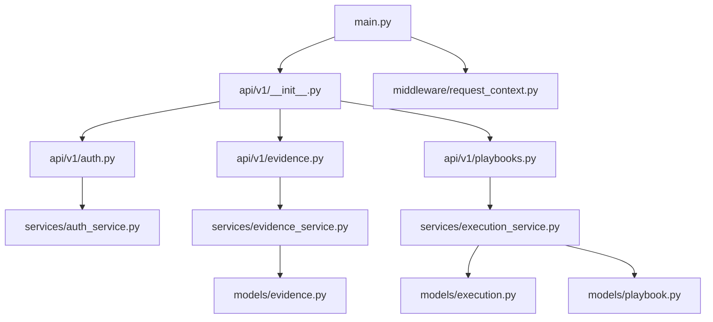
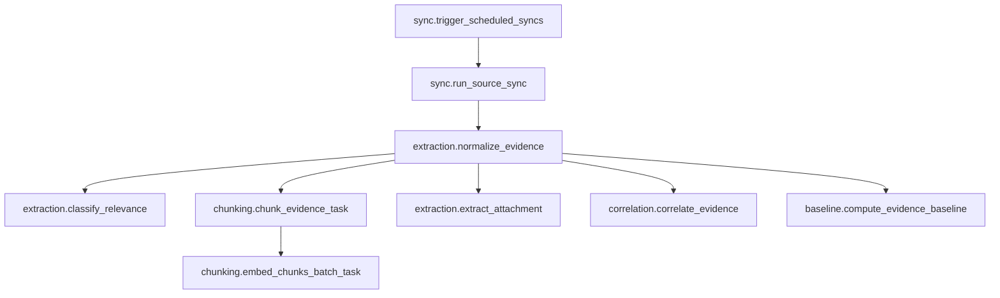
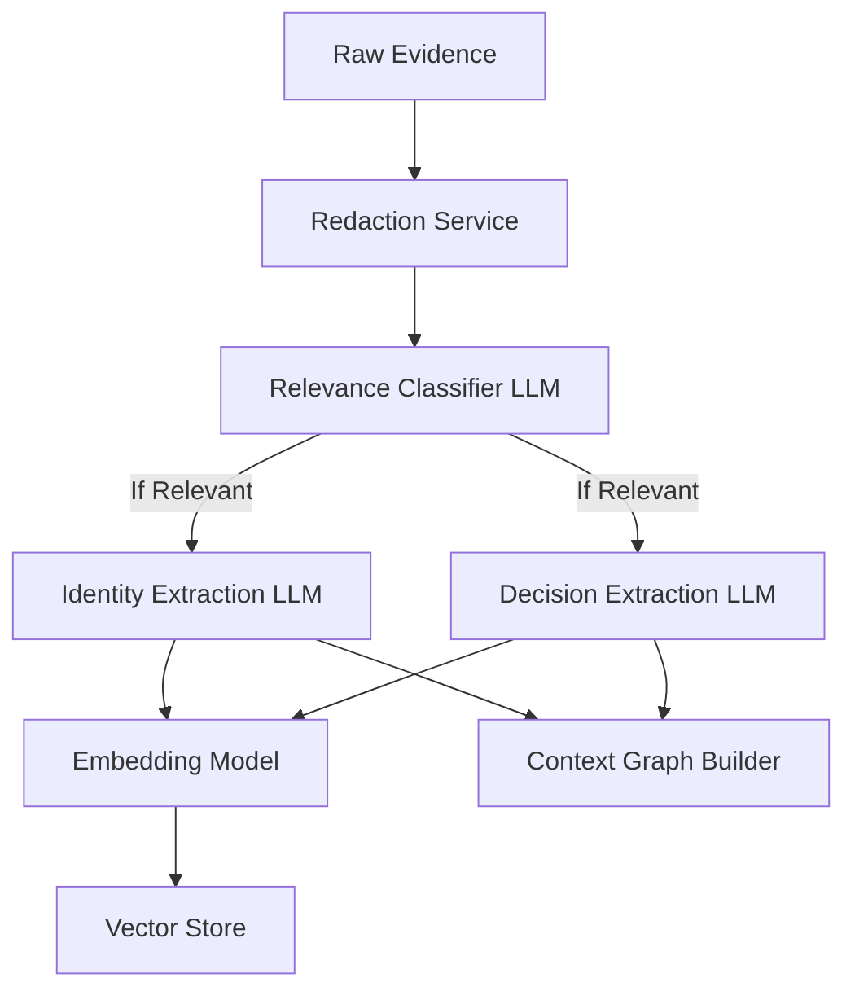
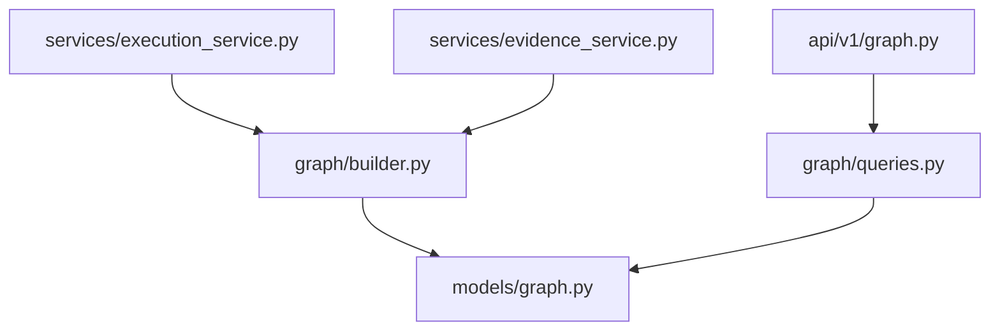
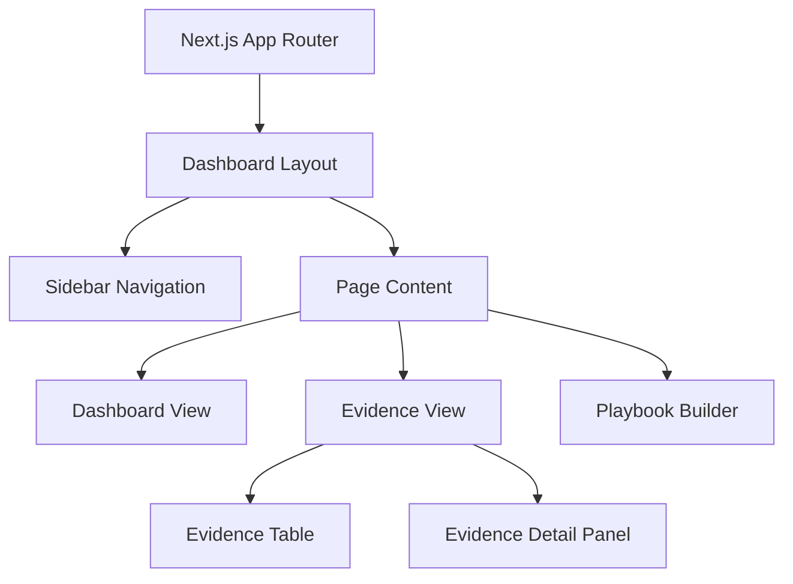

# ContextEdge — File Dependency Map

## Overview
This document maps the core file dependencies in the ContextEdge repository. It outlines who imports what, data flow, control flow, and design rationale for each key file. 

---

## 1. Backend Core

### `backend/src/contextedge/main.py`
**Rating: 10/10**
- **What it is:** The entry point for the FastAPI application.
- **Why it exists:** To configure and launch the web server, attach middleware, handle startup/shutdown lifecycles (like connecting to Redis and MinIO), and include API routers.
- **Where it is:** `backend/src/contextedge/main.py`
- **Who calls it:** Uvicorn or another ASGI server invokes it to start the app.
- **Who it imports from:** `contextedge.config.settings`, `contextedge.services.object_store.ensure_bucket`, `contextedge.api.v1.router`, `contextedge.middleware.request_audit`, `contextedge.middleware.request_context`.
- **What happens next:** The application starts listening for HTTP requests on the configured port.
- **Data flow:** Receives raw HTTP requests, processes global exception handling, and forwards them to API routers.
- **Control flow:** Initialization -> Lifespan context (startup) -> App creation -> Request handling -> Lifespan context (shutdown).
- **Design rationale:** Centralized app configuration makes it easier to inject middleware and manage global state.

### `backend/src/contextedge/api/v1/__init__.py`
**Rating: 9/10**
- **What it is:** The central router registry for API v1.
- **Why it exists:** To aggregate all sub-routers (e.g., auth, tenants, evidence, etc.) under the `/api/v1` prefix.
- **Where it is:** `backend/src/contextedge/api/v1/__init__.py`
- **Who calls it:** `backend/src/contextedge/main.py` imports and mounts it.
- **Who it imports from:** All module-level routers inside the `v1` package (e.g., `auth.py`, `tenants.py`, `sources.py`, etc.).
- **Data flow:** Routes incoming HTTP requests to the appropriate handler function based on the URL path.
- **Control flow:** Path matching -> Delegation to specific router.

---

## 2. Workers & Background Tasks

### `backend/src/contextedge/workers/celery_app.py`
**Rating: 10/10**
- **What it is:** The Celery application configuration and task registry.
- **Why it exists:** To manage asynchronous background tasks, configure queues, and schedule periodic beats.
- **Where it is:** `backend/src/contextedge/workers/celery_app.py`
- **Who calls it:** The Celery worker process on startup.
- **Who it imports from:** `contextedge.config.settings`, `contextedge.middleware.request_context` (for correlation ID injection). Includes task modules like `sync_tasks`, `extraction_tasks`, etc.
- **What happens next:** Celery workers start polling the broker (Redis/RabbitMQ) for tasks.
- **Data flow:** Injects HTTP correlation headers into Celery task messages and extracts them when a task starts running.
- **Control flow:** Task Enqueue -> Broker -> Worker -> Task Prerun (context bind) -> Execution -> Task Postrun (context release).
- **Design rationale:** Separates heavy lifting (syncs, AI extractions) from the fast HTTP request-response cycle.

### `backend/src/contextedge/workers/extraction_tasks.py`
**Rating: 9/10**
- **What it is:** Defines Celery tasks for processing raw evidence, extracting entities, classifying relevance, and embedding.
- **Why it exists:** Ingestion is computationally heavy. Processing must be offloaded to avoid blocking the API.
- **Where it is:** `backend/src/contextedge/workers/extraction_tasks.py`
- **Who calls it:** Triggered by evidence ingestion API endpoints or sync workers.
- **Who it imports from:** `contextedge.ai.classifiers`, `contextedge.ai.embeddings`, `contextedge.models.evidence`, `contextedge.services.*`.
- **What happens next:** Creates `EvidenceItem` rows, triggers chunking tasks, and evaluates relevance.
- **Data flow:** `RawEvidenceObject` -> Redaction -> AI Classification -> Identity/Decision extraction -> Embedding.
- **Design rationale:** Uses an allow-list for inline vs async chunking to balance ingest latency against reliability.

---

## 3. Services Layer

### `backend/src/contextedge/services/execution_service.py`
**Rating: 10/10**
- **What it is:** Orchestrates the execution of AI playbooks with safety class enforcement and approval gates.
- **Why it exists:** Provides a governed way for the system to execute automated remediation or analysis steps while keeping human-in-the-loop oversight.
- **Where it is:** `backend/src/contextedge/services/execution_service.py`
- **Who calls it:** API endpoints (e.g., user triggering a playbook) or background automated response systems.
- **Who it imports from:** `contextedge.models.execution`, `contextedge.models.playbook`, `contextedge.graph.builder`.
- **Data flow:** Playbook inputs -> Safety evaluation -> Step execution -> Tool invocations -> Results/Approvals.
- **Control flow:** `start_execution` checks caller roles. If a step exceeds safety limits, an `ApprovalRequest` is spawned. Execution halts until `decide_approval` is invoked.
- **Design rationale:** Shadow-mode allows dry-runs for testing side-effects safely. Approval gates enforce organizational policies.

---

## 4. Frontend Core

### `frontend/src/lib/api.ts`
**Rating: 9/10**
- **What it is:** A centralized fetch wrapper for communicating with the backend API.
- **Why it exists:** Ensures consistent error handling, auth token injection, and request ID generation across the UI.
- **Where it is:** `frontend/src/lib/api.ts`
- **Who calls it:** React components, hooks, and services in the frontend.
- **What happens next:** Makes an HTTP request to the backend. If it receives a 401, it logs the user out.
- **Data flow:** JSON objects in -> Serialized HTTP request -> Parsed JSON response out.
- **Design rationale:** Avoids repetitive fetch boilerplate and standardizes auth token handling from localStorage.

---

## Dependency Diagrams

### 1. Backend Module Dependency Graph



### 2. API → Service → Model Dependency Graph

```mermaid
graph TD
    API[API Layer (FastAPI)] --> SvcAuth[Auth Service]
    API --> SvcExec[Execution Service]
    API --> SvcSync[Sync Service]
    API --> SvcGraph[Graph Service]
    
    SvcAuth --> ModUser[User Model]
    SvcAuth --> ModTenant[Tenant Model]
    
    SvcExec --> ModPlaybook[Playbook Model]
    SvcExec --> ModExecution[Execution Model]
    SvcExec --> GraphBuilder[Graph Builder]
    
    SvcSync --> ModSource[Source Model]
    SvcSync --> WorkerTasks[Celery Tasks]
```

### 3. Worker Task Dependency Chain



### 4. AI Pipeline Dependency Graph



### 5. Graph Module Dependency Graph



### 6. Frontend Component Hierarchy



### 7. Frontend API Layer Dependency Graph

```mermaid
graph TD
    Hooks[React Query Hooks] --> APIClient[lib/api.ts]
    Components[UI Components] --> Hooks
    APIClient --> Fetch[Browser fetch API]
    APIClient --> LocalStorage[localStorage (Auth Token)]
    APIClient --> AuthGuard[401 Redirect Logic]
```

---
*Generated by the Senior Technical Writer Agent.*
