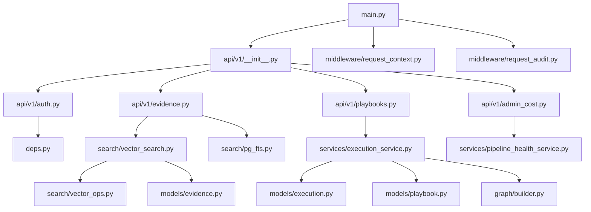
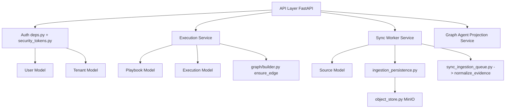
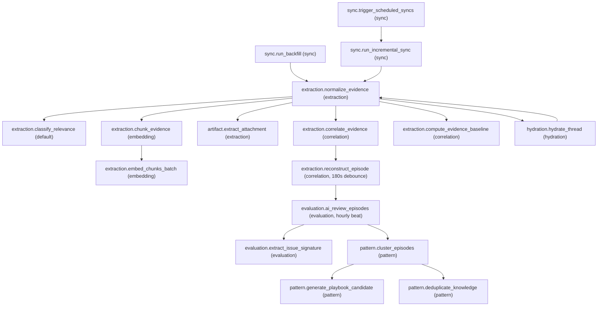
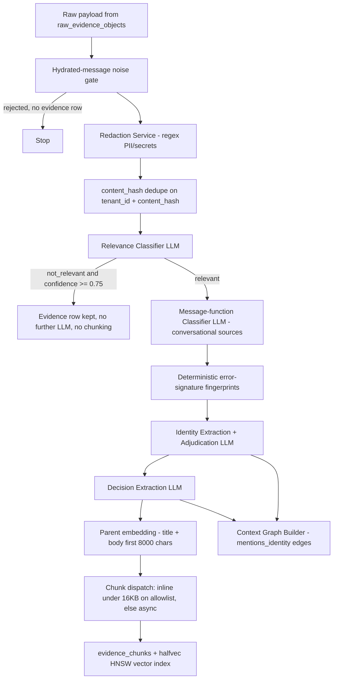
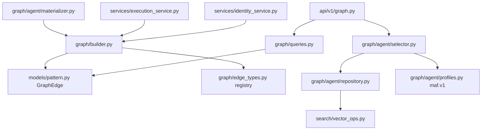
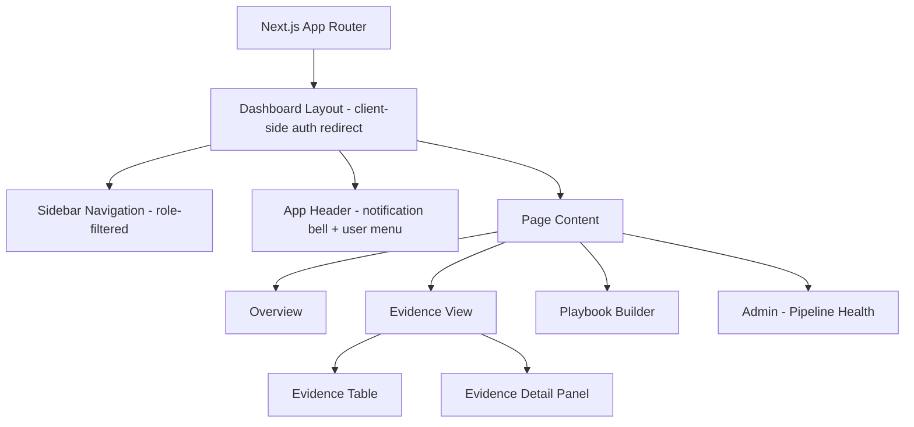
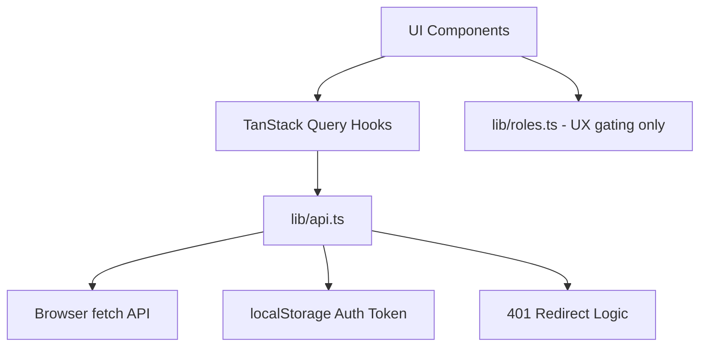

# ContextEdge — File Dependency Map

## Overview

This document maps the core file dependencies in the ContextEdge repository. It outlines who imports what, data flow, control flow, and design rationale for each key file.

Use it when you are tracing a symptom back to the code that caused it. Every entry names the real module path; the task names in the diagrams are the **registered Celery task names**, which is what you will actually see in a worker log or in Flower — not the Python function names, which differ.

*Verified against the working tree on 2026-08-19.*

---

## 1. Backend Core

### `backend/src/contextedge/main.py`
**Rating: 10/10**
- **What it is:** The entry point for the FastAPI application.
- **Why it exists:** To configure and launch the web server, attach middleware, handle startup/shutdown lifecycles (Redis client, MinIO bucket), and include API routers.
- **Where it is:** `backend/src/contextedge/main.py`
- **Who calls it:** Uvicorn or another ASGI server invokes `create_app()` to start the app.
- **Who it imports from:** `contextedge.config.settings`, `contextedge.services.object_store.ensure_bucket`, `contextedge.api.v1.router`, `contextedge.middleware.request_audit`, `contextedge.middleware.request_context`, plus `prometheus_fastapi_instrumentator`.
- **What happens next:** The application starts listening for HTTP requests on the configured port.
- **Data flow:** Receives raw HTTP requests, processes global exception handling, and forwards them to API routers.
- **Control flow:** Middleware is added in the order `RequestAuditMiddleware`, `TenantContextMiddleware`, `CORSMiddleware` (`main.py:121-129`). Starlette wraps the last-added outermost, so a request actually travels **CORS → TenantContext → RequestAudit → router → handler**. Getting this order backwards is a classic source of "why can't the browser read my error response".
- **Design rationale:** Centralized app configuration makes it easier to inject middleware and manage global state. The global exception handler re-adds CORS headers by hand (`main.py:131-166`) because it runs *outside* `CORSMiddleware` — without that, a browser could never read the `request_id` the handler exists to return.
- **Health contract:** `/health` is pure liveness; `/ready` probes database, Alembic head, and Redis with 5-second timeouts and 503s on failure (`main.py:179-210`); `/metrics` is the Prometheus scrape target (`main.py:168`).

### `backend/src/contextedge/api/v1/__init__.py`
**Rating: 9/10**
- **What it is:** The central router registry for API v1.
- **Why it exists:** To aggregate every sub-router under the `/api/v1` prefix so `main.py` mounts one object.
- **Where it is:** `backend/src/contextedge/api/v1/__init__.py`
- **Who calls it:** `backend/src/contextedge/main.py` imports and mounts it (`main.py:170-171`).
- **Who it imports from:** All module-level routers inside the `v1` package — 32 of them, including `auth`, `tenants`, `sources`, `sync`, `evidence`, `threads`, `episodes`, `patterns`, `playbooks`, `decisions`, `graph`, `runtime`, `sessions`, `policies`, `action_policies`, `audit_logs`, `admin_cost`, `negative_knowledge`.
- **Data flow:** Routes incoming HTTP requests to the appropriate handler based on the URL path.
- **Control flow:** Path matching → delegation to a specific router → FastAPI dependency resolution (`get_db`, `get_current_user`) → handler.

### `backend/src/contextedge/deps.py`
**Rating: 9/10**
- **What it is:** The FastAPI dependency layer — DB session, current principal, role checks.
- **Why it exists:** So auth and session handling live in one place and every route gets them the same way.
- **Who calls it:** Every route module in `api/v1/`.
- **Control flow:** `get_current_user` (`deps.py:72-114`) checks `X-Service-Token` **first** — a present-but-invalid one is a 403, never a silent fall-through to JWT — then decodes the Bearer JWT into a `CurrentUser`.
- **Load-bearing detail:** `has_role` returns True unconditionally for `platform_super_admin`, `tenant_admin`, or `admin` (`deps.py:37-44`), and `require_role` raises 403 otherwise (`deps.py:46-51`). `RoleBinding.scope_type` / `scope_id` are stored but **not** consulted here, so a role granted for one domain is effectively tenant-wide on every `require_role` route.

### `backend/src/contextedge/database.py`
**Rating: 9/10**
- **What it is:** Async engine and session factory.
- **Why it exists:** The API and the workers need *different* connection strategies, and this module provides both.
- **Control flow:** The API path uses a pooled engine (`pool_size=20, max_overflow=10, pool_timeout=30`, `database.py:19-21`) and `get_db` commits only if the session is still active (`database.py:29-42`). Workers never use this pool — see `asyncio_runner.py` below.

---

## 2. Workers & Background Tasks

### `backend/src/contextedge/workers/celery_app.py`
**Rating: 10/10**
- **What it is:** The Celery application: task registry, queue routing table, beat schedule, and the signals that carry request context into workers.
- **Why it exists:** To manage asynchronous background tasks, configure queues, and schedule periodic sweeps.
- **Who calls it:** The Celery worker and beat processes on startup.
- **Who it imports from:** `contextedge.config.settings`, `contextedge.middleware.request_context`, and 19 task modules via `include=[...]` (`celery_app.py:142-190`).
- **Data flow:** Injects HTTP correlation headers into Celery task messages and extracts them when a task starts running.
- **Control flow:** Task enqueue → `before_task_publish` (`_inject_correlation_headers`, `celery_app.py:25-42`) → broker → worker → `task_prerun` (`_bind_worker_context`, `celery_app.py:45-68`) → execution → `task_postrun` (`_release_worker_context`, `celery_app.py:71-80`).
- **Routing:** `task_routes` (`celery_app.py:226-279`) is **matched in order**, so specific keys beat later wildcards. Eight queues total: `default`, `sync`, `hydration`, `extraction`, `correlation`, `embedding`, `pattern`, `evaluation`. The `correlation` and `embedding` lanes exist because both were previously starved behind bulk normalization in the `extraction` FIFO.
- **Startup guard:** the `worker_ready` signal compares `alembic_version` against the bundled head and calls `SystemExit` on a mismatch (`celery_app.py:83-139`) — a worker on a stale schema corrupts ingestion mid-transaction.
- **Design rationale:** Separates heavy lifting (syncs, AI extractions) from the fast HTTP request-response cycle, and keeps every lane's starvation profile independent.

### `backend/src/contextedge/workers/asyncio_runner.py`
**Rating: 10/10**
- **What it is:** The single wrapper every task body goes through: `run_async(fn)`.
- **Why it exists:** Windows plus Celery plus asyncpg produced "Event loop is closed" errors during connection check-in when a pooled engine crossed task boundaries.
- **Who calls it:** Every Celery task in `workers/`.
- **Control flow:** `run_async` calls `asyncio.run(_with_session(fn))`; `_with_session` creates a **fresh NullPool engine and session per task**, commits on success, rolls back on exception, then closes and disposes the engine (`asyncio_runner.py:10-34`).
- **Why it matters to everyone else:** Services called from workers must `flush()`, never `commit()` — the commit contract belongs to this module. It is also why running many solo worker *processes* is safe: nothing shares a loop or a connection.

### `backend/src/contextedge/workers/sync_tasks.py`
- **What it is:** The three sync entry points — `sync.trigger_scheduled_syncs` (`:14`), `sync.run_backfill` (`:39`, 3 retries / 120 s), `sync.run_incremental_sync` (`:68`, 5 retries / 30 s).
- **Who calls it:** Celery beat every 15 minutes for the trigger task; `api/v1/sources.py` and `api/v1/sync.py` for the other two.
- **Delegates to:** `services/sync_worker_service.py`, which owns the advisory lock, checkpoints, control signals, and the handoff to normalization.

### `backend/src/contextedge/workers/extraction_tasks.py`
**Rating: 9/10**
- **What it is:** Defines the normalization pipeline — the single biggest function in the ingest path — plus manual re-classification and episode reconstruction.
- **Why it exists:** Ingestion is computationally heavy and LLM-bound. Processing must be offloaded to avoid blocking the API.
- **Registered tasks:** `extraction.normalize_evidence` (`:1304`, queue `extraction`), `extraction.classify_relevance` (`:1361`, queue `default` — a deliberate fast lane), `extraction.reconstruct_episode` (`:1391`, queue `correlation`).
- **Who calls it:** The sync handoff (`services/sync_ingestion_queue.py`), thread hydration, and the evidence API.
- **Who it imports from:** `contextedge.ai.classifiers`, `contextedge.ai.embeddings`, `contextedge.models.evidence`, and a long list of `contextedge.services.*` (message filter, redaction, evidence normalization, typing, knowledge lifecycle, case state, source facets, identity, decisions, error signatures, chunk dispatch).
- **Data flow inside `_normalize` (`:122-628`), in order:** load raw payload → hydrated-message noise gate → title/body extraction and content hash → redaction → dedupe on `(tenant_id, content_hash)` → insert `EvidenceItem` → thread + attachments → relevance classification (LLM) → extraction gate → message-function classification (LLM) → error-signature fingerprints → identity resolution (LLM) → decision extraction (LLM) → parent embedding → chunk dispatch.
- **Post-commit fan-out (the task wrapper, `:1306-1354`):** attachments → `artifact.extract_attachment` each; otherwise `extraction.correlate_evidence` + `extraction.compute_evidence_baseline`; plus `hydration.hydrate_thread` when the payload carried a thread id and this record is not itself a hydrated message.
- **Design rationale:** Every LLM stage is individually try/except'd so one failing model call degrades a field rather than failing ingestion. The chunking allow-list (`:54,60-62`) balances ingest latency against reliability: known-good sources under 16 KB chunk inline, everything else goes async.

### `backend/src/contextedge/workers/chunk_tasks.py`
- **What it is:** `extraction.chunk_evidence` (`:210`) and `extraction.embed_chunks_batch` (`:238`), both routed to the **`embedding`** queue.
- **Why it exists:** Parent-evidence embedding covers only `title + body[:8000]`; chunking is what makes long documents retrievable at all.
- **Control flow:** chunk task is idempotent on `chunker_version`; embed task filters `embedding IS NULL` and embeds in batches of `EMBED_BATCH_SIZE = 32` (`:51`), breaking without raising on a batch failure so the next replay picks up the rest.
- **Delegates to:** `services/chunkers/registry.py` (which chunker) and `services/evidence_chunk_service.write_chunks` (persistence).

### `backend/src/contextedge/workers/correlation_tasks.py`
- **What it is:** `extraction.correlate_evidence` (`:16`, queue `correlation`, 2 retries / 60 s).
- **Control flow:** runs `correlate_evidence_item`; when it created correlations, schedules `extraction.reconstruct_episode` with a 180-second debounce so a still-arriving thread is narrated once, not per message.

### `backend/src/contextedge/workers/evaluation_tasks.py`
- **What it is:** The `evaluation` lane — drift, contradiction scans, and the episode AI review sweep `evaluation.ai_review_episodes` (`:129`).
- **Control flow of the review sweep:** resolve mode (downgrade-only) → defer if the tenant is mid-ingest → crash-recovery mop-up → select drafts (`pending_review` AND `ai_review IS NULL`) → per-episode review, **commit per episode before any dispatch** → dispatch issue-signature extraction per approval and `pattern.cluster_episodes` once per domain that had approvals.
- **Delegates to:** `services/episode_review_service.py` (the verdict, the deterministic auto-approve floors) and `workers/pattern_tasks.tenant_pipeline_active` (the shared ingest-activity gate).

### `backend/src/contextedge/workers/signature_tasks.py`
- **What it is:** `evaluation.extract_issue_signature` (`:24`, queue `evaluation`, 2 retries / 30 s).
- **Who calls it:** Four dispatch sites — human single approve, human bulk approve, the AI review sweep, and that sweep's crash-recovery mop-up. All of them commit **before** dispatching, because the task no-ops without retry on a not-yet-approved episode.
- **Delegates to:** `services/issue_signature_service.py`, which distils the episode into a `capability|component|failure_mode` key and, when that key already existed, writes the low-confidence `recurrence` membership that links this occurrence to the previous one.

### `backend/src/contextedge/workers/pattern_tasks.py`
- **What it is:** The `pattern` lane — `pattern.cluster_episodes` (`:422`), `pattern.generate_playbook_candidate` (`:446`), `pattern.deduplicate_knowledge` (`:834`).
- **Why it is serialized:** clustering and generation operate on the whole graph and take no advisory lock, so the pattern queue is consumed by a single solo worker and the dedup sweep deliberately rides the same queue to serialize behind clustering.
- **Also exports:** `tenant_pipeline_active` (`:748`) and its thresholds (`:736-745`) — the shared "is this tenant mid-ingest?" gate used by both hourly sweeps.
- **Note:** there is **no beat entry** for clustering. It fires on episode approval and from `POST /api/v1/patterns/cluster`.

### `backend/src/contextedge/workers/retention_tasks.py` and `cleanup_tasks.py`
- **What they are:** `evaluation.apply_retention_archive` (`retention_tasks.py:72`, daily), `evaluation.purge_archived` (`retention_tasks.py:104`, weekly), `evaluation.cleanup_hard_deleted_evidence` (`cleanup_tasks.py:165`, daily).
- **Delegates to:** `services/retention_service.py` for the archive/purge logic and `services/memory_service.py` for the per-class retention windows.

---

## 3. Services Layer

### `backend/src/contextedge/services/ingestion_persistence.py`
**Rating: 9/10**
- **What it is:** `persist_ingestion_events` — the one function that turns connector output into `raw_evidence_objects` rows.
- **Who calls it:** Both sync jobs and thread hydration.
- **Control flow:** inject `_`-prefixed connector metadata keys → compute `content_hash` → dedupe on `(tenant_id, source_id, external_id, content_hash)` → insert → **offload to MinIO if the payload exceeds `OFFLOAD_THRESHOLD_BYTES = 32_768`** (`:16,84-87`), leaving a `{"_offloaded": true, "size_bytes": N}` stub in the column.
- **Why the caveat matters:** it returns new raw ids but does **not** commit or enqueue — the caller does, after commit, so workers never see uncommitted rows. And every SQL query elsewhere that filters on `raw_payload` silently misses offloaded rows.

### `backend/src/contextedge/services/sync_worker_service.py`
- **What it is:** The body of every sync run: advisory lock, connector loading, checkpoint handling, control-signal callback, and the crash-safe handoff to normalization.
- **Control flow:** `acquire_sync_lock` (`:379`) → load and gate the `SourceObject` → create the `SyncRun` and stamp `celery_task_id` → decrypt credentials and build the connector → read the newest checkpoint → install the pause/cancel callback → run the connector → persist events → finalize status → append a checkpoint → commit and enqueue `extraction.normalize_evidence` per raw id.
- **Design rationale:** ids that fail to enqueue are parked on `source_objects.metadata_extra["pending_normalize_raw_ids"]` and re-drained by the next successful run, so a broker outage after commit does not lose evidence.

### `backend/src/contextedge/services/evidence_chunk_service.py`
- **What it is:** `write_chunks` (`:43`) — persists chunk rows with per-chunk `content_hash`, `chunker_version`, and `source_authority`, then stamps `evidence.chunked_at` and `chunk_count`.
- **Who calls it:** the inline path inside `_normalize` and the async `extraction.chunk_evidence` task.

### `backend/src/contextedge/services/execution_service.py`
**Rating: 10/10**
- **What it is:** Orchestrates execution of playbooks with safety-class enforcement and approval gates.
- **Why it exists:** Provides a governed way to run remediation or analysis steps while keeping humans in the loop.
- **Who calls it:** API endpoints (a user triggering a playbook) and automated-response callers.
- **Who it imports from:** `contextedge.graph.builder.ensure_edge`, `contextedge.models.execution`, `contextedge.models.playbook`, `contextedge.models.attempt`, `contextedge.models.skill`, plus `services/approval_policy_service`, `services/decision_trace_service`, `services/policy_check_service`, `services/session_service`, `services/event_log_service`.
- **Data flow:** Playbook inputs → safety evaluation → step execution → tool invocations → results/approvals.
- **Control flow:** `start_execution` checks caller roles and approval policy. If a step exceeds safety limits, an `ApprovalRequest` is spawned and execution halts until `decide_approval` is invoked. Both allow and deny verdicts are recorded in `policy_checks`.
- **Design rationale:** Shadow mode allows dry-runs. Approval gates enforce organizational policy. Separation of duties is enforced initiator↔approver only — recommender↔approver is a known residual.

### `backend/src/contextedge/services/pipeline_health_service.py`
- **What it is:** The operator's single-screen answer to "where did the pipeline stop?"
- **Control flow:** Redis `LLEN` per lane over `QUEUES` in pipeline order plus `HLEN unacked` for in-flight work (`:43-55`), then one SQL read counting the graph chain end to end so the first zero in the sequence is the diagnosis (`:87`).
- **Design rationale:** it never raises on broker failure — it returns empty depths. It exists because every per-task metric read "healthy" while correlation starved behind 8,000 normalizations.

### `backend/src/contextedge/search/vector_ops.py`
- **What it is:** The two functions every semantic query must go through: `halfvec_cosine_distance` and `tune_ann_recall`.
- **Why it exists:** pgvector's HNSW caps the plain `vector` type at 2,000 dimensions and this app stores 3,072, so the real indexes (migration `0032`) are **expression** indexes over `(embedding::halfvec(3072))`. Any direct `column.cosine_distance(...)` ordering is a guaranteed sequential scan.
- **Control flow:** callers run `tune_ann_recall(db)` — `SET LOCAL hnsw.ef_search = 200` (`:31-37`) — before any tenant-filtered ANN query, because the indexes are global while every query post-filters by tenant.

---

## 4. Frontend Core

### `frontend/src/lib/api.ts`
**Rating: 9/10**
- **What it is:** A centralized fetch wrapper for communicating with the backend API.
- **Why it exists:** Ensures consistent error handling, auth token injection, and request-id generation across the UI.
- **Who calls it:** React Query hooks, components, and services in the frontend.
- **What happens next:** Makes an HTTP request to the backend. On a 401 it logs the user out.
- **Data flow:** JSON objects in → serialized HTTP request → parsed JSON response out.
- **Design rationale:** Avoids repetitive fetch boilerplate and standardizes auth token handling from localStorage.

### `frontend/src/lib/roles.ts`
- **What it is:** The client-side role predicates that drive nav visibility and button enablement.
- **Load-bearing asymmetry:** the frontend's `hasRole` treats only `platform_super_admin` as a super-role, while the backend also short-circuits `tenant_admin` and `admin` (`backend/src/contextedge/deps.py:37-44`). A `tenant_admin` therefore sees fewer nav items than the API would authorize them for. **Nav visibility is UX filtering, not security** — the API's 401/403 is the boundary.

---

## Dependency Diagrams

### 1. Backend Module Dependency Graph

### 2. API → Service → Model Dependency Graph

### 3. Worker Task Dependency Chain

Task names below are the **registered Celery names**, and the bracketed label is the queue each one is routed to (`workers/celery_app.py:226-279`).

Two loops worth noticing: `hydrate_thread` feeds messages back into `normalize_evidence` (it terminates because a hydrated message never requests hydration again, and re-delivered messages dedupe at the raw layer), and `cluster_episodes` runs the dedup sweep at its own tail.

### 4. AI Pipeline Dependency Graph

This is the ordered inside of `_normalize` (`workers/extraction_tasks.py:122-628`). Note that redaction happens **before** any model call, and the relevance gate can skip everything downstream of it.

### 5. Graph Module Dependency Graph

`graph/edge_types.py` is the write-side vocabulary: `require_registered` refuses an unregistered edge type in `add_edge` / `ensure_edge` / `close_edge` / `replace_edge`, and adding a type requires either allowlisting it in the `maf.v1` projection or recording why it is excluded — a test enforces the pairing.

### 6. Frontend Component Hierarchy

### 7. Frontend API Layer Dependency Graph

---

## Where to go next

- Queue behaviour, beat schedule, and worker topology: [RUNBOOK.md](RUNBOOK.md)
- What is *not* implemented despite appearing in the code: [../codewiki/KNOWN_GAPS.md](../codewiki/KNOWN_GAPS.md)
- Term definitions used above: [16_Glossary.md](16_Glossary.md)
