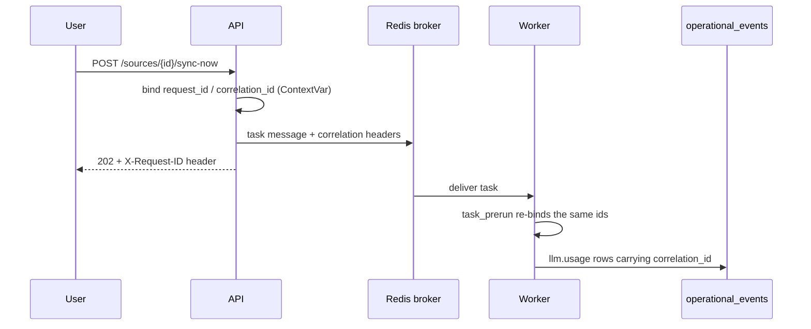

# ContextEdge — Debugging Guide

This is the guide for when something is wrong. It is written for an engineer who knows how to code but does not yet know this codebase, so mechanisms are spelled out: what calls what, what moves where, and in what order. Every load-bearing claim carries a `file:line` you can click through.

> **Verified against the working tree on 2026-08-19.** Line numbers move when files are edited — search for the named symbol if a citation looks a few lines off.

**The two fastest diagnostics in the whole system, before anything else:**

1. **`GET /api/v1/admin/pipeline-health`** (UI: `/admin/pipeline`) — one read of every queue depth, in-flight work, and the whole ingest chain counted end to end. The first zero in the chain sequence is your diagnosis.
2. **The `request_id`** returned in every response header and every log line. It follows the work from the HTTP click into the Celery task and into the `llm.usage` events, so one id joins a user action to the money it spent.

---

## Table of contents

1. [How to run each component](#1-how-to-run-each-component)
2. [Log configuration](#2-log-configuration)
3. [Observability](#3-observability)
4. [Common errors and solutions](#4-common-errors-and-solutions)
5. [Debugging the backend](#5-debugging-the-backend)
6. [Debugging the frontend](#6-debugging-the-frontend)
7. [Debugging Celery workers and queues](#7-debugging-celery-workers-and-queues)
8. [Debugging API issues](#8-debugging-api-issues)
9. [Debugging AI / LLM](#9-debugging-ai--llm)
10. [Debugging ingestion](#10-debugging-ingestion)
11. [Debugging vector search and chunking](#11-debugging-vector-search-and-chunking)
12. [Debugging identity resolution and correlation](#12-debugging-identity-resolution-and-correlation)
13. [Debugging episodes, signatures and patterns](#13-debugging-episodes-signatures-and-patterns)
14. [Debugging the context graph](#14-debugging-the-context-graph)
15. [Debugging MAF integration](#15-debugging-maf-integration)
16. [Environment variables](#16-environment-variables)
17. [Known issues and constraints](#17-known-issues-and-constraints)
18. [Useful commands](#18-useful-commands)

---

## 1. How to run each component

### What and why
ContextEdge is Next.js (frontend) + FastAPI (API) + Celery (background work) + Docker infrastructure (PostgreSQL, Redis, MinIO). You need all of them running to reproduce most bugs, because the interesting failures live in the handoffs between them.

### Where it is defined
- **Infrastructure:** `docker-compose.yml`, `docker-compose.dev.yml`
- **Backend:** `backend/dev.py`, `backend/src/contextedge/main.py`
- **Frontend:** `frontend/package.json`

### What happens next
The frontend calls the API over HTTP. The API writes Postgres and MinIO and pushes tasks to Redis. Celery workers pull those tasks and do the slow work: connector syncs, LLM extraction, embeddings, graph writes.

### Practical steps

```bash
make up              # postgres + redis + minio (detached)
make backend-dev     # cd backend && python dev.py api          → http://localhost:8000/docs
make celery-dev      # cd backend && python dev.py worker       → all eight queues
make celery-beat-dev # cd backend && python dev.py beat         → the 14 scheduled tasks
make frontend-dev    # cd frontend && npm run dev               → http://localhost:3000
make down            # stop infrastructure
```

### The queue list is the thing people get wrong

A worker consumes only the queues you give it. The complete set is **eight**:

```
default, sync, hydration, extraction, correlation, embedding, pattern, evaluation
```

That is `DEFAULT_QUEUES` at `backend/dev.py:16`, and the routing table lives at `backend/src/contextedge/workers/celery_app.py:226-279`.

**The failure this prevents is silent, not loud.** The `correlation` and `embedding` lanes were split out on 2026-08-17 after measured starvation: the extraction queue was growing ~70 tasks/min at 8,255 deep, `correlate_evidence` was dispatched but never consumed, and 1,879 chunks existed with only 289 embedded (15 %). Normalization finished, everything looked healthy, and episodes stayed at zero while newly ingested evidence was unretrievable. `dev.py:12-16` records that a stock deployment ran a month that way.

> **Check the `-Q` list on every worker you did not start yourself.** A fleet started from an older command — `-Q extraction,hydration,default` was in circulation for a while — never consumes `correlation` or `embedding`, which is the exact failure the lanes were created to fix. [RUNBOOK.md §7.1](RUNBOOK.md) now lists all eight and its Windows worker block includes both lanes; `dev.py:16` is the authority if the two ever disagree.

### Windows worker topology
Prefork does not work on Windows, and `-P threads` does not work for LLM-bearing lanes either: LiteLLM holds asyncio locks bound to the loop that created them, so a threads pool raises "Lock is bound to a different event loop" on every enrichment call, trips the provider circuit breaker, and fails the run near-silently (measured on a live backfill, 2026-08-16). Parallelism therefore comes from **separate `-P solo` processes**, each with its own loop. Full commands are in [13_Developer_Guide.md §3.4](13_Developer_Guide.md#34-windows-worker-topology).

Exactly **one** beat process, always. A second one double-dispatches every scheduled entry.

---

## 2. Log configuration

### What and why
`structlog` gives structured, searchable logs. You find things by `request_id`, `tenant_id` or event name rather than by grepping prose.

### Where it is defined
- `backend/src/contextedge/main.py:15-27` — the structlog configuration itself. The renderer is chosen by **`APP_DEBUG`**, not `APP_ENV`: `app_debug` true gives `ConsoleRenderer` (pretty, human-readable), false gives `JSONRenderer` (machine-readable). `APP_DEBUG` defaults to true (`config.py:202`), so a deployment that sets `APP_ENV=production` and forgets `APP_DEBUG=false` still emits console-formatted logs.
- `backend/src/contextedge/config.py` — `APP_LOG_LEVEL`.
- `backend/src/contextedge/middleware/request_context.py` — correlation ids.
- `backend/src/contextedge/middleware/request_audit.py` — HTTP mutation logging.

### How correlation actually propagates

This is worth knowing precisely, because it is what makes cross-process debugging possible.

1. `TenantContextMiddleware.dispatch` mints or parses `request_id` (header `x-request-id`, else uuid4), `correlation_id` (`x-correlation-id`, else the request id) and `causation_id`, then binds all three into a ContextVar (`middleware/request_context.py:88-104`). Responses echo `X-Request-ID` and `X-Correlation-ID` (`:145-146`).
2. When any handler calls `task.delay(...)`, Celery's `before_task_publish` signal `_inject_correlation_headers` copies the three ids into the outgoing message using `headers.setdefault`, so a caller-set header is never clobbered (`workers/celery_app.py:25-42`).
3. On the worker, `task_prerun` reads them back and re-binds the ContextVar for that task's duration, keyed **per task id** because concurrent pools interleave tasks (`celery_app.py:45-68`); `task_postrun` pops and resets, tolerating a double reset (`:71-80`).
4. `append_operational_event` defaults `correlation_id`, `causation_id` and `actor_id` from the ContextVar (`services/event_log_service.py:54-56`).

**Concretely:** an operator clicks "retry sync" for the Acme ServiceNow source; that request's id rides into `sync.run_incremental_sync`; and the `llm.usage` events for classifying `INC0010427`'s evidence carry the same `correlation_id`. One id joins the click to the spend.



### Practical steps
- Set `APP_LOG_LEVEL=DEBUG` in `.env` while troubleshooting, `INFO` otherwise.
- Search worker output by event name. The high-signal ones: `skipped_noise_message`, `relevance_classification_failed`, `identity_resolution_failed`, `chunking_failed`, `chunk_embedding_failed`, `llm.usage`, `llm.budget_warning`, `ranking.abstained`, `worker.migration_mismatch_refusing_to_start`, `pipeline_health.queue_read_failed`, `audit_db_error`.

---

## 3. Observability

### Health endpoints
- **`GET /health`** — pure liveness; returns 200 if the process is up (`main.py:173-177`).
- **`GET /ready`** — probes the database (`SELECT 1`), the **Alembic head**, and Redis, each with a 5 s timeout, and returns **503 `not_ready`** with a per-check dict on any failure (`main.py:179-210`). The object store is reported as `ok|degraded` but deliberately does **not** gate readiness. An installed layout without the alembic scripts reports the migration check as explicitly disabled rather than passing (`main.py:89-95`).
- **`GET /metrics`** — Prometheus, exposed by `Instrumentator().instrument(app).expose(app)` (`main.py:168`).

### Prometheus metrics that exist
Defined in `backend/src/contextedge/ai/observability.py:39-60`:

| Metric | Labels | Meaning |
| --- | --- | --- |
| `contextedge_llm_tokens_total` | tenant_id, model, task, token_type | tokens by type (prompt / completion / cached) |
| `contextedge_llm_requests_total` | tenant_id, model, task, outcome | request count; `outcome` is only ever `ok` or `error` (`ai/provider.py:324, 383`). A budget block raises before the recorder runs, so it increments **nothing** |
| `contextedge_llm_reasoning_tokens_total` | tenant_id, model, task | thinking tokens — **a subset of completion tokens, deliberately a separate metric** so a dashboard summing across `token_type` cannot double-count |

### What `record_llm_usage` does on every call
`ai/observability.py:133-252`, in order:
1. Extract token usage from the LiteLLM response.
2. Increment the three Prometheus counters.
3. Write one structlog `llm.usage` line, enriched with `request_id` / `correlation_id` / `causation_id` from the ContextVar.
4. Insert one `OperationalEvent(event_type="llm.usage")` whose payload carries `model`, `task`, `prompt_tokens`, `completion_tokens`, `reasoning_tokens`, `cached_tokens`, `total_tokens`, `outcome`, `duration_ms`, `prompt_name`, `prompt_version`. When the call is *about* an existing row, the caller passes `subject_type` / `subject_id` and the event's `entity_type` / `entity_id` columns carry them; otherwise `entity_type` is the literal `"llm_usage"` (`:227`).
5. Failures here are caught and logged as `llm.usage_event_failed` — **observability must never break the LLM work it is observing.**

**That operational-events table is the source of truth for budgets and the cost dashboard.** There is no second aggregation column, so nothing can drift.

### Pipeline health — the single best diagnostic
`GET /api/v1/admin/pipeline-health` → `services/pipeline_health_service.py:87`.

It reads two things:
- **Queue depths** — Redis `LLEN` on each of the eight lane names, in pipeline order (`:43-52`), plus `HLEN unacked` for **in-flight** work (`:58-84`). The in-flight number matters more than it looks: it includes every countdown/ETA task a worker holds in its heap. During the reconstruction phase of a bulk ingest, *all* remaining work lives there — 5,800 debounced reconstructs once churned for hours while every queue read zero and the page said "idle" about a pipeline burning a dollar a minute. `BACKLOG_ALERT_DEPTH = 500` (`:55`).
- **The chain, counted end to end**, in one SQL statement (`:87-136`): evidence → embedded → embed gap → raw objects → identities → case links → **correlation edges** → episodes (total / last 10 min / pending / approved) → chunks (total / embedded) → patterns → playbooks, plus `llm.usage` p50/p95/max latency over the last 10 minutes and per-prompt totals over the last hour.

**Read it as a sequence: the first zero is the diagnosis.** The module's docstring records the founding incident — every per-task metric said healthy while `correlate_evidence` starved behind 8,000 normalizations and episodes stayed at zero.

Two deliberate design details you should know so you do not misread it:
- The `embed_gap` counts only evidence in `relevance_state IN ('operational','possibly_relevant')` that has no embedding. `not_relevant` rows skip embedding **by design** (the relevance gate's cost short-circuit); counting them showed a permanent 3,700-item "backlog" that was actually the gate working.
- The chain shows **`correlation_edges`, not `case_links`**. Episode reconstruction is triggered by a new evidence↔evidence correlation edge; case links are an input to that, not the thing itself. Showing case links once read as "1.3k correlations" while the quantity actually gating episodes was zero — a green number on the exact link that was broken.

---

## 4. Common errors and solutions

### Database connection errors
**Error:** `could not connect to server` / `ConnectionRefusedError` on port 5432 or 5433.
**Fix:** `make up`, then check `DATABASE_URL`.

> **The trap most people hit on day one:** `.env.example` ships `DATABASE_URL=...@localhost:5433/...` (`.env.example:11-14`) while `docker-compose.yml` publishes **5432:5432** (`docker-compose.yml:9-10`). Copying the template verbatim gives you connection refused. Change the port in your `.env` to 5432, or add a compose override that maps 5433. Credentials come from the same `.env` (`POSTGRES_USER` / `POSTGRES_PASSWORD`), and changing them after the volume exists has no effect until the volume is dropped.

### Migration errors
**Error:** missing tables or columns; or `alembic upgrade` reports success but nothing changed.
**Fix:** `make migrate`.
- Duplicate unique-index errors on `0026`/`0027` need the pre-migration dedupe/NULLing SQL in [RUNBOOK.md](RUNBOOK.md).
- `value too long for type character varying(32)` on the **stamp** is not a broken migration — it is a database whose `alembic_version` table predates Alembic 1.10. `alembic/env.py:70-72` widens it on a separate bootstrap connection before anything runs. If you see this, you are on an old script; pull.
- **Never trust a head revision number written in a doc.** Run `cd backend && alembic heads`.

### Workers exit immediately at startup
**Error:** the worker prints `worker.migration_mismatch_refusing_to_start` and calls `SystemExit`; your supervisor restart-loops.
**Cause:** this is intentional. `_require_migrations_at_head` (`workers/celery_app.py:83-139`) compares `alembic_version.version_num` to the bundled scripts' head and refuses to consume on a **definite** mismatch — including the "no `alembic_version` table at all" case. Without it, workers consume the normalize queue against a stale schema and corrupt ingestion mid-transaction.
**Fix:** `make migrate`. Transient DB errors and installed layouts without the alembic directory are skipped with `worker.migration_check_skipped`, so a mismatch message means a real mismatch.

### Redis connection errors
**Error:** worker hangs, or the API's `/ready` reports the Redis check failed.
**Fix:** `make up`; verify `REDIS_URL` (DB 0), `CELERY_BROKER_URL` (DB 1), `CELERY_RESULT_BACKEND` (DB 2).
**Note:** the broker is configured to retry forever with keepalive and 30 s health checks (`workers/celery_app.py:216-224`), so a blip pauses a worker rather than killing it. That configuration exists because on Windows the broker is reached through WSL's port relay, which drops TCP under load — one blip previously killed four of eight workers silently.

### MinIO errors
**Error:** object-store offload failing, or a sync run failing on upload.
**Fix:** `make up`; verify `MINIO_ENDPOINT`, `MINIO_ROOT_USER`, `MINIO_ROOT_PASSWORD`, `MINIO_BUCKET`. API on 9000, console on 9001.
**Note:** the boto3 client uses `connect_timeout=1`, `read_timeout=1`, `max_attempts=1` (`services/object_store.py:28-33`) so a slow MinIO fails fast rather than stalling a worker. The API still starts if MinIO is down — the lifespan just marks `object_store_ok=False` (`main.py:44-59`).

### JWT / Fernet startup errors
**Error:** `RuntimeError` at import time about `JWT_SECRET_KEY` or `FERNET_KEY`.
**Cause:** `APP_ENV` is not `development` and you are on a default JWT secret (`config.py:248-252`) or a missing/placeholder Fernet key (`config.py:254-264`).
**Why the Fernet guard is harsh:** if that key changes, every previously encrypted source credential becomes unrecoverable garbage. Refusing to boot is the kind outcome.

### CORS errors
**Error:** the browser console shows "Cross-Origin Request Blocked".
**Fix:** add the frontend origin to `APP_CORS_ORIGINS`.
**Note:** the global exception handler re-adds CORS headers by hand (`main.py:132-166`) because it runs *outside* `CORSMiddleware` — without that, a browser could not read the `request_id` that the 500 response exists to give you.

### LLM API key errors
**Error:** `AuthenticationError` from the provider.
**Fix:** set the credential matching your model prefix — `OPENAI_API_KEY`, `ANTHROPIC_API_KEY`, `GOOGLE_API_KEY`, or `GOOGLE_APPLICATION_CREDENTIALS` for `vertex_ai/*`. LiteLLM routes on the prefix; `DEFAULT_LLM_PROVIDER` only matters for bare `gemini-*` ids.

### Embeddings never appear
**Error:** `embedding IS NULL` persists past the expected window.
Work through these in order:
1. **Is a worker consuming the `embedding` queue?** See §1. This is the most common cause by a wide margin.
2. **Budget block.** Call `GET /api/v1/admin/tenant-budget/status` — a blocked tenant writes **no `llm.usage` event at all**, so there is nothing to query for; the tell is that the day's usage line stops growing. In worker logs look for `chunk_embedding_failed` naming `TenantBudgetExceeded`. Raise the cap at `/admin/cost` or via `PUT /api/v1/admin/tenant-budget`.
3. **Dimension mismatch** — see §11.
4. **The item is `not_relevant`.** That is the gate working, not a bug.

### Celery tasks queue but never run
**Fix:** start a worker (`make celery-dev`) — and check its `-Q` list covers the queue your task routes to. Routing is by task-name prefix and is order-matched (`workers/celery_app.py:226-279`).

### Frontend build errors
**Error:** `npm run dev` fails with module not found → `npm install` in `frontend/`.
**Error:** `npm test` fails on `util.markAsUncloneable` → you are on Node 20. CI pins **Node 22** for exactly this reason (`.github/workflows/ci.yml:53-56`).

### Import errors
**Error:** `ModuleNotFoundError: No module named 'contextedge'`.
**Fix:** use `cd backend && python dev.py api`, which prepends `backend/src` to `PYTHONPATH` (`backend/dev.py:19-26`). Running `uvicorn` directly skips that.

---

## 5. Debugging the backend

### structlog over print
```python
import structlog
logger = structlog.get_logger()

logger.info("debugging_state", my_var=my_var, evidence_id=str(ev.id))
```
This inherits the current `request_id` / `correlation_id`, so the line joins to everything else that request did.

### Breakpoints
Set `APP_DEBUG=true`. Run the server from your IDE's debugger (VS Code: attach to the uvicorn process, or launch `backend/dev.py api`) and put breakpoints on any route or service.

**Debugging a Celery task is different.** Every task body runs inside `run_async`, which does `asyncio.run` on a fresh `NullPool` engine and session (`workers/asyncio_runner.py:10-34`). Run the worker with `-P solo` and a single process, or you will be stepping through interleaved tasks.

### Swagger UI
`http://localhost:8000/docs`. Click **Authorize**, paste a bearer token, and call anything. It is generated from the Pydantic schemas, so it is always in sync with the code.

### Checking the database directly
```bash
docker compose exec postgres psql -U "$POSTGRES_USER" -d "$POSTGRES_DB"
```
Use the values from your `.env` — the compose defaults are `contextedge`/`contextedge`, but `.env.example` sets `POSTGRES_USER=postgres`.

Tables you will look at most:

| Table | What lives there |
| --- | --- |
| `raw_evidence_objects` | the untouched source payload (or a `{"_offloaded": true}` stub if over 32 KB) |
| `evidence_items` | normalized evidence: title, body, classification, embedding, state columns |
| `evidence_chunks` | retrieval units with their own embeddings |
| `canonical_identities` / `identity_aliases` | resolved people, devices, services and their known names |
| `correlation_edges` / `case_links` | which evidence relates to which |
| `episodes` | narrated incidents, with `reviewer_state` and `ai_review` |
| `patterns` / `playbooks` | recurring structure and governed procedures |
| `graph_edges` | the context graph |
| `operational_events` | LLM usage, identity decisions, approvals, correlations — the audit spine |
| `audit_logs` | every mutating HTTP request |
| `tenant_llm_budgets` | per-tenant daily caps |
| `sync_runs` / `sync_checkpoints` | connector run history and cursors |

**Useful queries:**

```sql
-- Where did an ingest stop? Read this as a sequence; the first zero is the answer.
SELECT
  (SELECT count(*) FROM evidence_items WHERE tenant_id = :t) AS evidence,
  (SELECT count(*) FROM evidence_items WHERE tenant_id = :t AND embedding IS NOT NULL) AS embedded,
  (SELECT count(*) FROM evidence_chunks WHERE tenant_id = :t) AS chunks,
  (SELECT count(*) FROM evidence_chunks WHERE tenant_id = :t AND embedding IS NOT NULL) AS chunks_embedded,
  (SELECT count(*) FROM correlation_edges WHERE tenant_id = :t) AS correlation_edges,
  (SELECT count(*) FROM episodes WHERE tenant_id = :t) AS episodes,
  (SELECT count(*) FROM patterns WHERE tenant_id = :t) AS patterns;

-- Today's spend, by prompt.
SELECT payload->>'prompt_name'  AS prompt,
       payload->>'prompt_version' AS version,
       count(*)                                     AS calls,
       sum((payload->>'total_tokens')::bigint)      AS tokens
FROM operational_events
WHERE tenant_id = :t AND event_type = 'llm.usage'
  AND occurred_at > now() - interval '1 day'
GROUP BY 1, 2 ORDER BY tokens DESC;

-- Calls the budget gate WARNED about (action = 'warn' lets the call through).
-- Note: there is no equivalent query for BLOCKED calls. A block raises
-- TenantBudgetExceeded before the call is made, so no event is written at all.
SELECT occurred_at, payload->>'model', payload->>'task', payload->>'reason'
FROM operational_events
WHERE tenant_id = :t AND event_type = 'llm.budget_warning'
ORDER BY occurred_at DESC LIMIT 50;

-- Relevant evidence that retrieval cannot see.
SELECT count(*) FROM evidence_items
WHERE tenant_id = :t AND embedding IS NULL
  AND relevance_state IN ('operational', 'possibly_relevant');
```

---

## 6. Debugging the frontend

### Browser DevTools
`F12` (or `Cmd+Option+I`). Your primary tool.

### React DevTools
Install the extension to inspect the component tree, props and state.

### Network tab
1. Is the request going to `http://localhost:8000/api/v1/...`?
2. What is the status — 200, 401 (auth), 403 (role), 422 (validation), 500?
3. Read the response body. On a 500 it contains a `request_id` — grep the backend logs for it.

### Console and Next.js overlay
Next.js shows a helpful dev overlay pointing at the failing file and line. **Check both places:** client errors appear in the browser, server-side rendering errors appear in the terminal running `npm run dev`.

### A nav item is missing but the API works
That is expected asymmetry, not a bug. The frontend's `hasRole` treats only `platform_super_admin` as a super-role (`frontend/src/lib/roles.ts:7-9`), while the backend also short-circuits `tenant_admin` and `admin` (`backend/src/contextedge/deps.py:37-44`). So a `tenant_admin` sees only nav items that name `tenant_admin` explicitly, yet the API authorizes them for `knowledge_manager`-gated calls anyway. **Nav visibility is UX filtering, not security** — the dashboard layout's redirect is client-side only (`frontend/src/app/(dashboard)/layout.tsx:17-21`). Real enforcement is the API's 401/403.

Nav items and their role gates are the array at `frontend/src/components/shell/sidebar-nav.tsx:44-70`.

---

## 7. Debugging Celery workers and queues

### What and why
Celery takes heavy jobs out of the HTTP cycle. Extracting entities from 1,000 tickets synchronously inside a request would time out the browser and cost a fortune in held connections.

### The queues, and what each one owns

| Queue | Tasks | Typical symptom when unconsumed |
| --- | --- | --- |
| `sync` | `sync.trigger_scheduled_syncs`, `run_backfill`, `run_incremental_sync` | backfills never start; retries pile up |
| `hydration` | `hydration.hydrate_thread` | tickets exist but the conversation around them never appears |
| `extraction` | `extraction.normalize_evidence`, `artifact.extract_attachment`, `extraction.rebuild_identity_snapshots` | raw objects exist, `evidence_items` stays flat |
| `default` | `extraction.classify_relevance` (fast lane), `identity.*`, `maintenance.*`, `review_queue.*` | re-classification never completes |
| `correlation` | `extraction.correlate_evidence`, `reconstruct_episode`, `compute_evidence_baseline` | **evidence grows, `correlation_edges` and `episodes` stay at zero** |
| `embedding` | `extraction.chunk_evidence`, `embed_chunks_batch` | **chunks exist, `embedding IS NULL`, nothing is retrievable** |
| `pattern` | `pattern.cluster_episodes`, `generate_playbook_candidate`, `deduplicate_knowledge` | episodes approved, no patterns form |
| `evaluation` | drift, contradictions, retention, cleanup, verification, `ai_review_episodes`, `extract_issue_signature`, graph reconciliation | scheduled sweeps silently never run |

`extraction.classify_relevance` is routed to `default` on purpose: it is a ~2.5 s gate call and must not queue behind 20–60 s episode tasks. Five hundred classifications once starved for about 40 minutes in the extraction FIFO.

**`extraction.backfill_evidence_types` is not in this table because no worker knows it.** `workers/evidence_typing_tasks.py` is neither in the Celery app's `include` list nor imported by anything under `backend/src`, so a worker started from `celery_app` rejects the name instead of running it. If you dispatched it and nothing happened, that is why — not a queue problem.

### Monitoring the queues

```bash
# Depth per lane, straight from the broker (Celery uses the queue name as the list key).
redis-cli -n 1 llen extraction
redis-cli -n 1 llen correlation
redis-cli -n 1 llen embedding

# In-flight: delivered to a worker but not finished, INCLUDING countdown/ETA
# tasks held in a worker's heap. During a reconstruction tail this is where
# all the work is while every queue reads zero.
redis-cli -n 1 hlen unacked
```

Or just call `GET /api/v1/admin/pipeline-health`, which does exactly this plus the chain counts (`services/pipeline_health_service.py:58-84`).

### Retry behavior
`task_acks_late=True` (`workers/celery_app.py:199`) means a task whose worker crashes mid-run is re-delivered to another worker. Application exceptions retry per the task's own decorator — for example `sync.run_backfill` retries 3× at 120 s, `sync.run_incremental_sync` 5× at 30 s, `extraction.normalize_evidence` 3× at 60 s.

### Dead-letter queue
There is none. A task that exhausts its retries disappears from the active queue, leaving an error trace in structlog.

**Related trap:** poison messages live in the Redis broker (DB 1), not in Postgres, so they **survive a database rebuild**. If a queue keeps failing on the same task after you reset the database, flush the broker DB rather than hunting the code.

### Timing rule that explains several past bugs
**Commit before you dispatch.** A task consumed before its transaction commits reads stale state and no-ops **without retry**. Call sites that own their transaction follow commit → `.delay(...)` → treat a broker failure as a warning, not a rollback (`api/v1/episodes.py:255-278`; `workers/evaluation_tasks.py:273-331`). The AI-review sweep goes further and commits **per episode** before dispatching, because a batch-end commit made every verdict hostage to the last one — one deadlock meant re-paying 50 LLM calls.

Services that do **not** own their transaction go through `dispatch_after_commit` (`services/deferred_dispatch.py:72-95`), which parks the send on the session and fires it from SQLAlchemy's `after_commit` event, dropping it on `after_rollback`. If you see queued tasks naming rows that do not exist, look for a service dispatching inline instead of through that helper — a rolled-back clustering pass once left 65 `pattern.generate_playbook_candidate` messages naming patterns that were never committed.

---

## 8. Debugging API issues

### 401 Unauthorized
- Did you send `Authorization: Bearer <token>`?
- Has the token expired? Default lifetime 60 minutes.
- Did you change `JWT_SECRET_KEY` and forget to restart?
- For service callers: the `X-Service-Token` header **wins when present** — an invalid one returns **403**, not 401, and never falls back to the Bearer token (`deps.py:72-83`).

### 401 "Ambiguous account" on login
Not a bug. `users.email` is unique per tenant, not globally. If the same email and password work in two tenants, login returns 401 rather than guessing which tenant you meant (`api/v1/auth.py:76-89`).

### 403 Forbidden
- The principal is authenticated but lacks the role. Note `has_role` short-circuits True for `platform_super_admin`, `tenant_admin` and `admin` (`deps.py:37-44`).
- For service tokens, `allowed_domain_ids` may restrict the call.
- **A caveat that explains surprising 403-adjacent behavior:** `RoleBinding.scope_type`/`scope_id` are stored but **not enforced**. Login flattens role names into the JWT, so a domain admin bound to one domain holds that role tenant-wide on every `require_role` route (`codewiki/KNOWN_GAPS.md:187-191`). If you expected a scoped denial and got a success, that is why.

### 409 Conflict from execution routes
Not a 500 in disguise. A duplicate replay and a stale approval binding are well-formed requests the state declines, and the execution ledger returns 409 for them deliberately.

### 422 Unprocessable Entity
FastAPI's Pydantic validation. The response body names the exact field and the exact problem.

### 500 Internal Server Error
The response gives you `{"detail": "Internal server error", "request_id": "..."}` and nothing else, on purpose (`main.py:132-166`). Take the `request_id` to the backend logs, where the full traceback is.

### Who called what
`RequestAuditMiddleware` records every mutating `/api/v1` request (POST/PATCH/PUT/DELETE, except `/auth/login`) to `audit_logs`, including denials, with `action = "http.<method>.<path-slug>"` (`middleware/request_audit.py:25-124`). Read it at `/api/v1/audit-logs` or the `/audit` page.

**Blind spot to know:** unauthenticated 401 probes never resolve a tenant, so they are **not** in `audit_logs` — they exist only in structlog. Alert on `http.mutating_request` with status 401 for those (`request_audit.py:59-64`).

---

## 9. Debugging AI / LLM

### Where it lives
- `backend/src/contextedge/ai/provider.py` — the one funnel every call goes through.
- `backend/src/contextedge/ai/prompts/` — eleven immutable, versioned prompt families.
- `backend/src/contextedge/services/tenant_budget_service.py` — the spend gate.
- `backend/src/contextedge/ai/resilience.py` — timeout and circuit breaker.

### What happens on every LLM call, in order
`llm_complete` (`ai/provider.py:177`) and `llm_complete_json` (`:504`):
1. **Budget gate** — `check_budget(db, tenant_id)` **before** spending. `block` raises `TenantBudgetExceeded`; `warn` proceeds and writes an `llm.budget_warning` operational event (`:231-279`).
2. **Output-token clamp** — `ceiling = settings.llm_task_output_tokens.get(task, settings.llm_max_output_tokens)` (`:290-291`).
3. **Circuit breaker and timeout** — 120 s per call; 5 consecutive failures opens the breaker for 60 s with a single half-open probe (`ai/resilience.py:28-30`). The breaker is per-worker process by design; there is no cross-process coordination.
4. **One fallback-model attempt** if `LLM_FALLBACK_MODEL` is set (`:365`).
5. **JSON repair ladder** for truncated output (`:544-597`).
6. **Usage recorded in a `finally` block**, even on error.

### Budget debugging
`check_budget` (`services/tenant_budget_service.py:234-282`):
- A tenant with **no `tenant_llm_budgets` row** gets the deployment defaults — 2,000,000 tokens/day, $25/day, action `block` — through the identical evaluation path, deliberately not persisted (`:107-121, 249-279`).
- Usage is computed by summing the current UTC day's `llm.usage` operational events. No second counter to drift.
- **Token limit is checked before the cost cap**, so a tenant with only a token cap never sees `cost_cap_exceeded`.
- There is a 60-second module-level usage cache (`:51`), so at most one over-cap call slips through per minute per process. Cross-worker races are unbounded and documented as such.

**Operator symptom to recognize:** chunks stuck at `embedding IS NULL` plus a tenant whose `llm.usage` events simply **stop** — a blocked call raises before the usage recorder runs, so silence is the signal, not an error row. Confirm with `GET /api/v1/admin/tenant-budget/status`. Fix at `/admin/cost` or `PUT /api/v1/admin/tenant-budget`. Before a bulk backfill, provision a real budget row — a measured 84-ticket Zoho backfill burned the 2M default in about two hours and froze mid-run.

### Prompt debugging
Prompts are **immutable per version**. To change behavior you add a new version and update the default; you never edit a shipped one, because evaluation baselines pin the exact strings.

- Per-tenant overrides go in `TENANT_PROMPT_VARIANTS_JSON`, e.g. `{"<tenant-uuid>": {"relevance": "v2"}}`.
- Resolution is tenant override → registered default. An unknown prompt **name** raises `KeyError` (fail loud). An unregistered **override** falls back with a `prompt_variant_not_registered_falling_back` log. Malformed JSON logs `prompt_variants_config_invalid` and yields an empty map, so ingest never crashes on config (`ai/prompts/__init__.py:96-162`).
- Every call threads `prompt_name` and `prompt_version` into `llm.usage`, so `SELECT payload->>'prompt_version' ...` tells you exactly which version served a given call.

### Cost investigation checklist
1. `GET /api/v1/admin/llm-usage` or the `/admin/cost` page.
2. Group `llm.usage` by `prompt_name` (query in §5). Episode synthesis is usually the largest line — it has measured at 29 % of all tokens.
3. Check `reasoning_tokens`. Thinking budgets are set for exactly one prompt (`{"relevance": 0}`) and everything else uses the provider's dynamic default, on purpose: a controlled test showed identity-adjudication confidence dropping 0.95 → 0.80 under caps, which would silently divert auto-links (person threshold 0.95) into the review queue.
4. Check `duration_ms` percentiles in the pipeline-health response.

### Truncation symptoms
If a generated artifact looks structurally complete but is missing content — a playbook with zero steps, an episode with truncated steps — suspect the output ceiling before you suspect the prompt. The flat 4096 ceiling once silently overruled callers, truncated playbook JSON mid-array, and the repair path then **persisted a playbook with zero steps while reporting success**. Per-task ceilings live at `config.py:132-138`; add any new long-output lane there.

---

## 10. Debugging ingestion

This is where most "my data is missing" tickets actually live. Work the chain in order.

### Stage 1 — did the connector fetch anything?
Check `sync_runs`: `status`, `items_processed`, and the `errors` JSONB.

| Status | Meaning |
| --- | --- |
| `completed` | normal |
| `skipped_locked` | another worker held the per-source-object advisory lock; not an error (`services/sync_worker_service.py:379-395`) |
| `skipped_no_checkpoint` | incremental sync with no checkpoint — **run a backfill for this object first**. Deliberate: a schedule must never trigger a surprise full pull (`sync_worker_service.py:571-595`) |
| `paused` / `cancelled` | an operator signalled a cooperative stop; everything fetched was still persisted |
| `failed` | see `errors["message"]`, or `errors["handoff"]` (below) |

**Zoho-specific:** the API's token quotas return **empty results, not errors**. Zoho allows 5 refresh exchanges per minute and 30 live tokens per refresh token; exceeding either yields empty responses that look like success. The connector caches access tokens process-wide and serializes minting behind a per-credential lock because of this, and classifies auth/quota failures as fatal-for-the-run so hydration re-raises instead of storing plausible-looking empty threads. The measured symptom before that fix: 11 of 20 hydrated threads stored empty while reporting success.

### Stage 2 — did the raw payload land?
`SELECT count(*) FROM raw_evidence_objects WHERE tenant_id = :t;`

**Then check for offload.** Any payload over `OFFLOAD_THRESHOLD_BYTES = 32_768` is uploaded to MinIO and the column keeps only `{"_offloaded": true, "size_bytes": N}` (`services/ingestion_persistence.py:16, 85-87`).

> **This is the single most under-appreciated debugging fact in the system: every code path and every ad-hoc SQL query that reads `raw_payload` fields silently sees the stub for large rows.** Ingest-priority ordering sorts them as zero-thread/no-resolution; reply-inheritance reconciliation explicitly skips them; and any backfill you write over payload fields will silently skip **the biggest tickets — exactly the longest conversations**. If a SQL backfill "worked" but the longest articles are still NULL, this is why.
>
> ```sql
> SELECT count(*) FROM raw_evidence_objects
> WHERE tenant_id = :t AND raw_payload ? '_offloaded';
> ```

### Stage 3 — did normalization create evidence?
The ordered pipeline is `_normalize` (`workers/extraction_tasks.py:122-641`). Reasons an evidence row may legitimately not exist:

- **The noise gate rejected it.** For hydrated messages only, `message_noise_reason` (`services/message_filter.py:174-206`) returns one of the four values in `NOISE_REASONS` (`:81`): `delivery_failure`, `quote_only`, `empty` or `coordination_only`. `coordination_only` means under `MIN_DIAGNOSTIC_CHARS = 150` (`:52`) **and** carrying no technical signal across the 16 regexes in `_TECHNICAL_SIGNALS` (`:56-79` — error codes, paths, files with extensions, versions, URLs, IPs, emails, hostnames, identifier-shaped tokens, stack traces, SQL, shell). Measured: 47 % of 18,907 live messages rejected. The task returns `{"status": "skipped_noise_message", "reason": ..., "filter_version": "v1"}` and **no evidence row is created** — but the raw object stays, so a rule change can re-judge every rejected message exactly.
- **It deduped.** `content_hash` is a SHA-256 over the **raw** body, computed pre-cleaning and pre-redaction so tuning a regex never breaks dedupe. A hit *refreshes* the existing row (facets, `case_state`, `knowledge_state`, a missing embedding, identities, decisions, attachments) and returns `{"deduped": true}`. Correlation and baseline (or attachment extraction) **still** fire for that row; the only thing suppressed is auto-hydration, guarded by `not res.get("deduped")` in the wrapper (`extraction_tasks.py:1356`).
- **An insert race.** `IntegrityError` on the `(tenant_id, content_hash)` unique index → rollback → adopt the winner → `{"deduped": true, "raced": true}`, with no repeated LLM spend.
- **The offloaded payload has no storage key** → `{"error": "raw_payload_offloaded_without_storage_key"}` (legacy corruption).

### Stage 4 — is the evidence enriched?
Look at the row's columns:
- **`relevance_state`** — `unclassified` means the classifier has not run or failed (fail-open: it logs `relevance_classification_failed` and continues into the full pipeline).
- **`not_relevant` with confidence ≥ 0.75** trips the extraction gate (`extraction_tasks.py:484-492`). Those rows keep their evidence row for audit but get **no** message-function call, no identity, no decisions, **no embedding and no chunking** — they are invisible to vector search by construction. That is the design, not a bug. Error-signature fingerprinting still runs on them (`:520-539`), because a confidently-irrelevant thread can still carry a pasted stack trace.
- **`embedding IS NULL`** on a relevant row — see §11.
- **`canonical_entity_refs`** — an empty `identities` list is the "already attempted" marker; a missing key means identity extraction never ran.
- **`chunked_at IS NULL`** — chunking never ran. Note that evidence ingested before the chunking pipeline landed keeps `chunked_at IS NULL`, and a standalone backfill drainer has not shipped.

Every enrichment step in `_normalize` is individually try/except'd, so a blocked tenant's evidence still lands as a row — un-embedded and un-linked, but present and repairable.

### Stage 5 — the handoff ledger
If a sync run shows `errors["handoff"]` with `message: normalize_enqueue_failed`, the broker failed **after** the raw rows were committed. Those un-enqueued raw ids are parked on `source_objects.metadata_extra["pending_normalize_raw_ids"]`, and the next successful run's claim step re-drains them (`services/sync_worker_service.py:322-376`). No action needed beyond letting the next run happen.

### Stage 6 — thread hydration
A ticket exists but the conversation around it does not:
- `threads.hydration_status` should move `pending` → `complete`.
- Auto-hydration is decided in two places: `_normalize` only reports a `_thread_external_id` when the record is **not itself a hydrated message** (`extraction_tasks.py:626-628`), and the task wrapper only dispatches `hydrate_thread` when that id is present and the row was not deduped (`:1354-1359`). That `is_hydrated_message` guard is what prevents a 10–50× re-hydration amplification loop.
- Threads are created lazily by normalization, so calling the manual hydration API before normalize processed the parent returns 404.
- Hydration strips text already seen earlier in the same thread (`clean_thread_bodies`), because only hydration holds the whole thread in arrival order. Measured: 89 % of substantive text was repetition.

**Acme VPN worked example:** `INC0010427` normalizes once and dispatches `hydrate_thread`; the work-notes exchange becomes N `hydrated_message` raw rows; "Any update on the VPN?" dies at `coordination_only`; "Restarted IPSec on vpn-gw-east-01, tunnel stable" survives — only 47 characters, but it carries a hostname signal — and becomes its own evidence item.

---

## 11. Debugging vector search and chunking

### No results from semantic search

Work these in order.

**1. Are there embeddings at all?**
```sql
SELECT count(*) FROM evidence_chunks WHERE tenant_id = :t AND embedding IS NULL;
```
If chunks exist unembedded, check that a worker consumes the **`embedding` queue** and check the budget (§9). `embed_chunks_batch` embeds in batches of `EMBED_BATCH_SIZE = 32` and, on a batch failure, logs `chunk_embedding_failed` and **breaks without raising** — the surviving NULL rows are picked up on the next replay (`workers/chunk_tasks.py:172-181`).

**2. Is the ANN index actually being used?**
This is the subtle one. pgvector's HNSW on the plain `vector` type supports at most **2,000 dimensions**, and we store **3,072**. Migrations `0021` and `0030` originally tried to build HNSW directly on those columns and **those indexes never existed** — every similarity query was a sequential scan until migration `0032_halfvec_hnsw_indexes` built HNSW **expression** indexes over `(embedding::halfvec(3072))` on `evidence_items`, `evidence_chunks`, `decisions` and `episodes`.

Consequences you must know:
- **Every cosine ordering must use the same expression the index was built on.** `search/vector_ops.py:40-45` casts both column and query to `halfvec(3072)`; a bare `column.cosine_distance(...)` is a **guaranteed sequential scan**.
- `0032` **requires pgvector server extension ≥ 0.7** and fails loud below it. `docker-compose.yml:3` pins `pgvector/pgvector:pg16`.
- **An environment stamped at an earlier revision of `0032` never re-executes it and stays on sequential scans** (`codewiki/KNOWN_GAPS.md:40`). If search is correct but slow, check this first.

```sql
-- Confirm the four expression indexes exist and are valid.
SELECT c.relname, i.indisvalid
FROM pg_class c
JOIN pg_index i ON i.indexrelid = c.oid
WHERE c.relname LIKE '%halfvec%' OR c.relname LIKE '%hnsw%';
```

**3. Recall, not correctness.** The HNSW indexes are global across tenants while every query post-filters by `tenant_id`. At pgvector's default `ef_search = 40`, a small tenant's rows can be **entirely absent** from the candidate set and the query silently returns fewer rows than `limit`. Every caller therefore runs `tune_ann_recall(db)` → `SET LOCAL hnsw.ef_search = ANN_EF_SEARCH` (200) before the ORDER BY (`search/vector_ops.py:31-37`). If you write a new ANN query and skip that call, you will see exactly this symptom.

**4. Visibility filters.** Both ANN passes apply `_visibility_predicates` (`search/vector_search.py:49-70`): not `sensitivity_label = 'legal_hold'`, `redaction_status` not in `('pending','pending_redaction')`, and `access_policy_id` not in the caller's excluded set. Admin roles (`platform_super_admin`, `tenant_admin`, `domain_admin`) get no exclusions (`search/access_control.py:12-39`).

**Lexical search now applies the identical gate**, importing the same helper (`search/pg_fts.py:10, 65-78`). It previously filtered access policies only, so a legal-hold or pending-redaction record hidden from semantic search was still reachable by full-text, by ticket number, or by a title substring. If you are comparing the two surfaces and expect an old asymmetry, it is gone.

**5. Knowledge lifecycle.** `evidence_items.knowledge_state` withholds `draft`, `review` and `retired` articles. **NULL serves** — "the source did not say" must be current, or every corpus but ServiceNow's would empty (`services/knowledge_lifecycle.py:133-152`). If a KB article vanished from results after a sync, check whether its source marked it retired.

### Dimension mismatches
`generate_embedding` asks for `dimensions: 3072` — skipped when the model name contains `gemini-embedding`, which returns 3,072 natively (`ai/provider.py:777-779`) — and then **hard-fails any model whose vector is not exactly 3,072 floats**, naming the fix in the error (`:786-793`). Note the trap: the code default `DEFAULT_EMBEDDING_MODEL` is `text-embedding-3-small` (`config.py:58`), which returns **1,536** and will raise. `.env.example:87-89` pins `text-embedding-3-large` and names `vertex_ai/gemini-embedding-001` as the alternative. Your deployed value comes from the untracked `.env`.

### Results are correct but repetitive
That is what MMR exists to prevent. `search_evidence_semantic` oversamples chunks to `min(max(80, limit*3), 240)`, applies maximal-marginal-relevance at chunk level with `MMR_LAMBDA = 0.7`, then rolls up to **one hit per parent evidence, its closest chunk** (`search/vector_search.py:204-243`; `search/chunk_rollup.py:31, 111-121`). A malformed chunk vector makes MMR degrade to pure distance ordering rather than failing the request — so if diversity looks broken, suspect a corrupt embedding.

### Evidence with no chunks still needs to be findable
It is: a second **parent-pass** ANN over `evidence_items.embedding` runs in the same cosine space and merges by distance (`vector_search.py:161-201`). So an evidence row whose chunks are all unembedded still surfaces through its parent embedding.

### A playbook returns no evidence
`search_evidence_semantic_for_playbook` distinguishes two cases and logs the second: "no chunk matched" versus **"this version has no provenance rows at all"** (`search.playbook_scope_has_no_evidence_links`, `vector_search.py:120-145`). The second means `playbook_evidence_links` is empty for that published version.

### `/runtime/match` returns an empty list
Not an error. `rank_playbooks` **abstains** below `MIN_RECOMMENDATION_SCORE = 0.35` (`search/hybrid_ranker.py:171`) and logs `ranking.abstained` with the top score and the threshold that rejected it (`:368-378`). An empty list means "no recommendation", by contract. Check the log line to see whether candidates existed and how close they came. A caller can pass its own `min_score`, which overrides the constant (`:369`).

Other reasons the ranker returns nothing: no approved playbooks for the tenant; every candidate filtered out by `domain_id`, the service token's `allowed_domain_ids`, or the risk cap (admins uncapped, `knowledge_manager` and service accounts capped at `high`, everyone else at `medium`); or a candidate with no **published** version, which is skipped entirely.

---

## 12. Debugging identity resolution and correlation

### Identities look duplicated or wrong
`resolve_extracted_entities` (`services/identity_service.py:616-796`) has four layers, tried in order:

| Layer | Mechanism | Confidence |
| --- | --- | --- |
| 1. Strong identifier | SQL lookup on `(tenant, alias_type, normalized_alias)` for email / username / hostname / fqdn / ip / serial / external id | 1.0 |
| 2. Typed exact alias | `normalized_alias` equality scoped to compatible entity types | 0.95 |
| 3. LLM adjudication | up to 5 candidates from substring tokens or trigram similarity > 0.3 | auto-links only at ≥ `AUTO_LINK_THRESHOLDS` |
| 4. Provisional creation | unmatched mention becomes a `provisional` identity | 0.5 |

**Auto-link thresholds are `{"person": 0.95}` with a 0.9 default** (`identity_service.py:58-59`). Below threshold, or if the adjudicator abstains, the system mints a **`needs_review`** identity — never a silent link and never a silent fork. Those land in the Review Queues console at `/suggestions`.

Between layers 2 and 3 sits a **candidacy gate** (`services/identity_candidacy.py:65-196`) that rejects mentions before they cost an LLM call: facet types like environment/version/vendor (they belong in `source_facets`), unsupported entity types (only person, device, application, service bear identity), and things that are not name-shaped. Identity work was **78 % of all model spend** before that gate existed.

**Promotion:** a `provisional` identity linked by ≥`CORROBORATION_DEGREE_MIN` 2 distinct evidence items and ≤`RARE_DEGREE_MAX` 5 flips to `resolved` (`services/identity_promotion.py:58-69`, applied in `promote_corroborated_identities` at `:72-138`) — the moment it first *could* correlate anything, with the upper bound acting as a rarity guard against product-name hubs. `needs_review` rows are deliberately never auto-promoted.

**Merging** is human-decided. The daily `identity.reconcile_identities` beat task **proposes, never merges** — proposals land in `identity_merge_proposals` above a `MIN_CONFIDENCE` of 0.95, and rejections persist so the schedule never re-raises them.

**Debug trail:** every non-trivial decision writes an `identity.resolution_decision` operational event carrying method, confidence, candidate ids and reason (`identity_service.py:587-613`).

```sql
SELECT occurred_at, payload FROM operational_events
WHERE tenant_id = :t AND event_type = 'identity.resolution_decision'
ORDER BY occurred_at DESC LIMIT 50;
```

**Acme VPN example:** the extractor pulls `vpn-gw-east-01` (device) and "Priya Sharma" (person). A single-token device name matching the hostname regex becomes a **hostname strong identifier**, so it resolves at layer 1 forever after its first sighting. "Priya" in a later Teams message shares a substring, goes to adjudication, and links only at ≥0.95 because persons carry the stricter threshold.

### Evidence is not correlating
`correlate_evidence_item` (`services/correlation_service.py:197-791`) runs two tiers.

**Tier 1 — deterministic case links, confidence 1.0.** Built from `(system, external_id)` keys: the record's own id, `{source}:thread`, ServiceNow reference fields (`problem_id`, `rfc`, `caused_by`, `parent_incident`), Jira linked-issue keys, SapphireIMS related tickets, Zoho `ticket_number` and related ids. **CI and assignment-group references are deliberately never case-link keys** — shared infrastructure would mass-merge unrelated cases.

**Tier 2 — identity co-occurrence, gated and scored.** Only identities in `resolved`/`verified` state and `is_active` count. Then:
- `IDENTITY_CORRELATION_WINDOW = 7 days` (`:38`) — outside it there is no signal, and the gate is **fail-closed on missing timestamps**.
- `HUB_DEGREE_MIN = 200` — identities at or above that degree carry zero signal.
- Rare non-person entity (degree ≤ 5) scores 0.75; otherwise 0.65; +0.1 when ≥2 non-hub identities are shared, capped at 0.85.
- **A single shared person is dropped entirely.** Person-only overlap needs ≥2 shared non-hub identities and scores 0.5.
- **Conflicting-ticket veto:** if both items hold anchor case memberships in disjoint case sets, the identity correlation is deleted and `correlation.conflicting_ticket_veto` is logged — "same infrastructure, different incidents".

Edges are **created once and never upgraded**; when both tiers matched, the case-link tier wins (`case_link_match` at 1.0 over `identity_match`).

Enrichment runs in per-source SAVEPOINTs, so an enrichment failure loses enrichment, never the correlation.

**Known limitation:** conversational bridging of **bare-integer Zoho ticket numbers** is deliberately not built — the shared token regex never matches bare integers, because widening it would also match order numbers and hex colors. The ticket's own registration and primary membership work; only the "Teams message quoting #4021" direction is missing (`codewiki/KNOWN_GAPS.md:99`).

---

## 13. Debugging episodes, signatures and patterns

### No episodes are forming

Check in this order:

1. **Is a worker consuming the `correlation` queue?** Reconstruction routes there.
2. **Are there `correlation_edges`?** Reconstruction is dispatched by `correlate_evidence` only when `correlations_created > 0`, with `countdown=RECONSTRUCT_DEBOUNCE_SECONDS = 180`. Zero edges means zero episodes, and `case_links` being non-zero does not help.
3. **Cluster size floor.** `MIN_AUTO_SYNTHESIS_CLUSTER = 3`. A stable two-evidence cluster is **terminally skipped, not deferred** — it retries only on a new correlation dispatch, so a pair that never grows never gets an episode.
4. **Re-synthesis growth floor.** `MIN_RESYNTHESIS_GROWTH = 0.5` — a cluster must be 1.5× the largest already-covered episode before it is re-narrated.
5. **Starvation guard.** A never-quiet cluster is force-narrated within `MAX_SYNTHESIS_DELAY_SECONDS = 1800` of its oldest evidence, so "nothing happened for 30 minutes" is not a normal state.
6. **The resolution gate.** With `EPISODE_RESOLUTION_GATE=cluster`, clusters carrying no resolution signal anywhere are **deferred at zero LLM cost** and re-checked as new evidence joins. Deferred, not dropped. Default is `off`.
7. **In-flight work hides here.** Debounced reconstructs live in the broker's `unacked` hash, not in a queue — `redis-cli -n 1 hlen unacked`.

### Cluster contents look wrong
`resolve_episode_cluster` (`services/episode_cluster_service.py`) materializes the connected component over `case_links` and `correlation_edges` before any LLM sees it, bounded by `MAX_CLUSTER_SIZE = 50`, `MAX_HOPS = 3` and `CLUSTER_TIME_WINDOW = 30 days` from the **nearest seed** (undated evidence fails open). Legal hold and pending redaction are fenced in SQL, so they never enter a cluster.

**One invariant that explains surprising non-expansion:** the resolver explicitly refuses to expand through `recurrence` and `mentioned_only` memberships. Recurrence means "similar problem, **never** the same occurrence" — it exists for precedent retrieval, not for merging clusters.

### Drafts exist but nothing is approved
Two paths approve an episode: a human (`POST /api/v1/episodes/{id}/approve` or `/bulk-approve`) and the machine sweep.

**The machine sweep — `evaluation.ai_review_episodes`** (`workers/evaluation_tasks.py:125-358`), hourly on the `evaluation` queue:
- Mode comes from `settings.episode_ai_review`. **The code's review modes are exactly `off`, `advisory` and `auto_approve`** (`config.py:185-187`) — there are no others.
- `off` (the default) makes the task return `{"status": "disabled"}` immediately. The beat entry is scheduled unconditionally so enabling the setting needs no beat restart.
- A dispatch `mode_override` can only **downgrade** (advisory under auto_approve), never escalate.
- **Draft selection is `reviewer_state = 'pending_review' AND ai_review IS NULL`** — the sweep never pays twice for one draft — ordered by a shared priority expression so machine and human attention agree.
- **The sweep defers entirely while a tenant is ingesting**: `tenant_pipeline_active` counts >50 fresh evidence or >30 fresh episodes in the last 10 minutes and logs `episode_ai_review.deferred_ingest_active`. The episode threshold exists because a 12:29 sweep once retired 446 drafts mid-reconstruction-tail while watching only evidence inflow.
- It commits **per episode before any dispatch**, aborts a tenant's batch after **5 consecutive transient failures** (provider down), and re-reads the row `FOR UPDATE` after the ~14 s LLM call so a concurrent human decision always wins (`skipped_state_changed`).

**Auto-approve floors** are deterministic and evaluated on top of the model verdict; **all** must pass (`services/episode_review_service.py:42-44, 89-101`): `MIN_EVIDENCE = 2`, `MIN_OUTCOME_CHARS = 20`, verdict exactly `approve`, and `MIN_VERDICT_CONFIDENCE = 0.8`. Failures are recorded in `ai_review.failed_floors`, so you can see exactly why a draft was held.

**Auto-approvals keep `reviewer_user_id` NULL**, permanently distinguishable from human approvals:
```sql
SELECT id, title, ai_review->>'verdict', ai_review->>'auto_approved', ai_review->'failed_floors'
FROM episodes
WHERE tenant_id = :t AND ai_review IS NOT NULL
ORDER BY updated_at DESC LIMIT 50;
```

> **Careful when reading `ai_review`.** Because the sweep skips any draft where `ai_review IS NOT NULL`, a non-NULL value permanently removes a draft from the sweep. Operational one-off DB scripts have written marker values directly into that column to park batches of drafts (for example the drafts stamped `hold / timeline_corrupted_pending_repair`). **Those markers are data written by a script, not modes the code implements** — do not go looking for a code path behind a value you find there. The only modes in the code are `off`, `advisory`, `auto_approve`. If you find a draft that will not be reviewed, check `ai_review` for a stamp before debugging the sweep.

### Issue signatures are missing on approved episodes
`extract_issue_signature` (`services/issue_signature_service.py:89`) turns an approved episode into a generalized fingerprint — for Acme VPN, roughly `affected_capability=remote_access`, `failing_component=tls_certificate`, `failure_mode=certificate_expired`, key `remote_access|tls_certificate|certificate_expired`.

Reasons a signature may not exist:
- The episode is not `approved` — the task no-ops with `not_approved_or_missing` and **does not retry**.
- The LLM output failed the schema gate → logged `issue_signature.invalid_draft`, returned as a normal `skipped` result, so **Celery does not retry**. Nothing will re-attempt unless something re-dispatches.
- The dispatch was lost (crash or broker down). The hourly sweep re-dispatches for up to 20 auto-approved episodes with no signature row per sweep — scoped to auto-approvals so the pre-signature era is never surprise-backfilled.

When a signature already exists, `_link_recurrence` adds a **`recurrence` case membership at confidence 0.6** from the new episode's first evidence item to the previous occurrence's case. Again: that link is for precedent retrieval and the cluster resolver never expands through it.

### Patterns never form
- **There is no beat schedule for `pattern.cluster_episodes`.** It is dispatched on approval (single at `api/v1/episodes.py:275`, bulk at `:335`), by the AI-review sweep **once per domain that had approvals** (`workers/evaluation_tasks.py:340-347`), and manually via `POST /api/v1/patterns/cluster` (`api/v1/patterns.py:412`). Passing `None` for the domain clusters only NULL-domain episodes, and on a live graph every episode is domain-scoped — that bug produced exactly zero patterns while looking like it ran.
- **Domain scoping is strict:** a domain pass sees only that domain's episodes; the global pass sees only `domain_id IS NULL`. NULL episodes are deliberately not folded into domain passes, because whichever pass ran first would capture them arbitrarily.
- Candidates must be **approved, embedded and unlinked**; the pass repairs missing episode embeddings first, then takes 100 per run (`workers/pattern_tasks.py:214`).
- **Thresholds are named constants — read them, do not remember them.** An existing pattern becomes a candidate at cosine distance **< `PATTERN_MATCH_MAX_DISTANCE` = 0.30** (`pattern_tasks.py:50`), still subject to LLM adjudication; a new cluster forms from neighbours at **< `CLUSTER_GROUP_MAX_DISTANCE` = 0.27** (`:60`); single-episode clusters are allowed. Both were tuned against the measured pairwise spread on this corpus (min 0.157, p01 0.257, median 0.409, max 0.524 — everything is an AutomationEdge support incident, so the embeddings bunch), and the grouping constant was raised from 0.20, which left 126 of 150 probed episodes able to group with nothing. Re-measure both if the corpus mix changes; the in-file comments carry the full sweep.
- **The match query orders by distance and takes the NEAREST pattern member** (`pattern_tasks.py:243-256`). The `ORDER BY` used to be missing, so `LIMIT 1` returned an arbitrary qualifying row: at the old 0.35 gate every unlinked episode had *some* member within range, the validator was handed a near-random pattern and correctly rejected it, and 88 % of episodes went off to mint singleton patterns. Asking about the nearest pattern took the validator's accept rate from 12 % to 40 % on the same corpus.
- **Adjudication fails open**: if the LLM is down or budget-blocked, `validate_pattern_match` returns `is_match=True` at confidence 0.75 (`ai/extractors/pattern_extractor.py:112`), so during an outage the embedding probe alone decides membership.
- **Known gap:** a full 100-episode pass has run 25 minutes in a **single database transaction** (~156 LLM calls) with nothing committed until the end. A late failure rolls back every row while the spend stays spent, and `patterns` reads 0 for the whole run. If clustering "did nothing" but the cost dashboard shows a spike, this is why.

---

## 14. Debugging the context graph

### Missing nodes or edges
The Graph Explorer (`/graph-explorer`) renders `graph_edges`. If nodes are missing, the writers have not run yet: identity linking, decision extraction, correlation, episode graph construction, pattern enrichment, or the 6-hourly `evaluation.reconcile_graph_relationships` materializer.

`GraphRelationshipMaterializer.reconcile_tenant` (`graph/agent/materializer.py:107-359`) is **additive-only and idempotent** — it streams relational rows and calls `ensure_edge` for each. There is no event-driven materialization, so a freshly written relational row can be up to six hours from having its edge.

### An edge write raised `UnknownEdgeType`
Intended. All 69 edge types are declared across five group frozensets in `graph/edge_types.py:36-137`, and `require_registered` (`:186`) is called by `add_edge`, `ensure_edge`, `close_edge` and `replace_edge`. Register the type — and in the same change either allowlist it in `MAF_RELATIONSHIP_TYPES` (`graph/agent/profiles.py:89`) or record why it is excluded in `PROJECTION_EXCLUSIONS`, because `backend/tests/test_edge_type_registry.py` fails if you do neither.

### Duplicate-looking edges
Check `domain_id`. The partial unique index `uq_graph_edges_active_logical` covers the full logical key `WHERE valid_to IS NULL` with `NULLS NOT DISTINCT` (`models/pattern.py:187-199`), so the **same** logical edge written with **different** domains is two distinct rows. Every writer must follow the one domain-derivation rule, written out per edge type at `graph/agent/materializer.py:23-37`.

### `weight` vs `confidence`
They are different and both are stored: `weight` is traversal importance, `confidence` is belief (`graph/builder.py:63-72`). Conflating them was a real defect. If a traversal ranks something oddly, check which of the two the writer actually set.

### Slow traversals
`get_neighbors` is an iterative BFS up to `MAX_TRAVERSAL_DEPTH = 3` with **no per-hop edge cap** on that path (`graph/queries.py:12, 20-81`). Subgraph payloads are bounded at `MAX_SUBGRAPH_NODES = 250` / `MAX_SUBGRAPH_EDGES = 500`. If edge-metadata filters are slow, check the GIN index `ix_graph_edges_metadata_extra_gin` (migration `0025_jsonb_gin_indexes`).

### Scope caveat
`/graph/neighbors`, `/graph/subgraph`, `/graph/stats`, CMDB topology, change-risk and fix-applicability routes pass only `tenant_id` — **a domain-limited principal can read wider here than its MAF projection would allow** (`codewiki/KNOWN_GAPS.md:56`). Open, tracked, and worth knowing before you rely on those routes for isolation.

### `as_of` semantics
`edge_valid_at(as_of)` (`graph/temporal.py:29-36`) gives point-in-time edges, and `normalize_graph_as_of` rejects naive datetimes (422) and anything more than 5 minutes in the future. **But historical edges combine with *current* node facts** — the projection warns callers explicitly. Do not draw historical operational conclusions from an `as_of` query.

---

## 15. Debugging MAF integration

**MAF is Microsoft Agent Framework.** The adapter lives at `backend/src/contextedge/integrations/maf/`.

### The projection an agent sees
`AgentGraphBudget` defaults to 24 nodes / 48 relationships / depth 2 / 12,000 characters, hard-capped at 100 / 250 / 3 / 50,000 (`graph/agent/contracts.py:26-30`). If an agent "cannot see" something, check whether it was budget-truncated: the response carries `truncated` and `truncation_reasons`.

Profile `maf.v1` declares 20 node types (`graph/agent/profiles.py:59`) and 53 relationship types (`:89`), leaving 16 of the 69 registered edge types untraversable. **Every exclusion carries its reason** in `PROJECTION_EXCLUSIONS` (`graph/edge_types.py`) — `mentions_identity` is excluded because it fans out 40–70 edges per handful of tickets and would spend the entire budget on identity hubs; `related_to` is excluded for unknown semantics plus hub fan-out. An "expected" relationship that never appears is often a deliberate exclusion, not a bug.

### An episode the agent should see is missing — or one it should not see is there
`AGENT_VISIBLE_EPISODE_STATES` is `{"approved", "pending_review"}` (`graph/agent/hydrators.py:108`). So **unapproved drafts do reach the agent**, deliberately, as reference material; `superseded` drafts do not, because they would read as independent corroboration of an episode the agent can already see.

A draft that reaches the agent is marked twice over: its node label is prefixed `[UNAPPROVED DRAFT]` and an `agent_caveat` fact spells out that no reviewer has confirmed it (`hydrators.py:448-463`). Drafts also seed from their own small allocation — `UNAPPROVED_EPISODE_SEED_LIMIT = 2`, separate from the approved slots so a draft can never evict a reviewed precedent — and their seed relevance is multiplied by `UNAPPROVED_SEED_RELEVANCE_FACTOR = 0.8`. That discount is deliberately smaller than the spread of the admitted similarity band (0.6–0.9), so an approved episode outranks a draft of equal similarity while a clearly better draft can still win (`graph/agent/repository.py:106-117`).

### Tool failures
Check `operational_events` for `agent_graph.projected` and `tool.shadow_executed`. Tools in shadow mode (`suggest_only`) do not mutate state; they simulate.

### The honest limitation
**Every MAF tool on this branch is read-or-propose. There is no write-capable agent tool and no executor** (`codewiki/KNOWN_GAPS.md:34`). `execution_service` is a ledger driven by external callers — it records invocations, attempts, approvals and verification, but nothing in this repo dispatches a step. If you are debugging "why did the agent not do the thing", the answer is that nothing can.

---

## 16. Environment variables

### Missing `.env`
The app refuses to start or crashes instantly. Copy `.env.example` to the **repo root** as `.env`. Settings are read from `<repo>/.env` first, then `backend/.env` (`config.py:10-15`).

### Wrong values — the two that bite
1. **Host vs container names.** Inside a container, `localhost` means the container itself. Use the compose service names (`postgres`, `redis`, `minio`) in `docker-compose.dev.yml`, and `localhost` when host-running with `make backend-dev`.
2. **The Postgres port.** `.env.example` says 5433; `docker-compose.yml` publishes 5432. See §4.

### Secrets
Never commit `.env`. Treat `FERNET_KEY`, `JWT_SECRET_KEY` and `SERVICE_TOKENS_JSON` as highly sensitive. Scan every staged diff before committing.

### Config reference
The annotated per-variable reference is [13_Developer_Guide.md §11](13_Developer_Guide.md#11-configuration-reference).

---

## 17. Known issues and constraints

`codewiki/KNOWN_GAPS.md` is the authoritative list and should be read before you claim any feature works end to end. The constraints that most often turn into debugging sessions:

- **Worker queue coverage.** A worker that does not consume `correlation` and `embedding` produces a pipeline that looks healthy and silently builds nothing. Check the `-Q` list on any fleet you did not start yourself.
- **Sync overlap.** Concurrent syncs for one source object are handled — the second returns `skipped_locked` via a transaction-scoped advisory lock, which releases automatically so a crashed worker cannot leak it.
- **Offloaded raw payloads.** Payloads over 32 KB become a MinIO stub, so **SQL filtering on `raw_payload` silently skips the biggest rows**. Any backfill you write over payload fields inherits this.
- **Raw-blob lifecycle.** There is no TTL or GC for raw blobs belonging to *live* evidence; retention for those relies on external bucket lifecycle rules. What *is* automated: the daily `evaluation.cleanup_hard_deleted_evidence` sweep reaps raw blobs and rows orphaned by a hard-delete purge, plus dangling `graph_edges` (`workers/cleanup_tasks.py:161-223`). **Artifact blobs are a documented stub returning 0** — the rows CASCADE, but once they are gone the blobs cannot be found by a DB scan, so run an S3 lifecycle rule on the `artifacts/` prefix.
- **Decision extraction input cap.** `extract_decisions` operates on the first **4,000 characters** of the parent evidence body, so decisions mentioned later in a long item are missed. Chunking mitigates *retrieval* (per-chunk rows under 1,500 chars mean the content is still findable) but **per-chunk decision extraction has not shipped**, so the cap still applies to the extraction pass. Decision types are open-ended labels rather than a fixed enum, so analytics may need normalization.
- **Chunk backfill.** Evidence ingested before the chunking pipeline keeps `chunked_at IS NULL`; a standalone drainer task has not landed. What exists is the `needs_fanout` path in the manual re-classification route plus the `maintenance.reclassify_stale_evidence` sweep.
- **No chunk GC.** Old chunker generations coexist with new ones after a version bump. Search tolerates this (MMR demotes near-duplicates and rollup keeps one per parent), but nothing deletes them.
- **Zoho articles have never been ingested** on the live tenant — the module is discovered but both approvals are false, so the Zoho knowledge-state path is code-verified but corpus-dark. Zoho ticket behaviour *is* live-verified.
- **Graph Explorer is read-only.** All graph mutations happen through backend services.
- **Role-binding scope is unenforced** — see §8.
- **Stacked episode timelines — now fenced at the database.** The 2026-08-18 run left 949 live episodes with several narrations' step lists concatenated onto one episode, each renumbered from step 1 (worst case: 319 steps across 24 orders). The writer could not be found by reading the code — every visible path only writes steps to a freshly created row — so migration `0071_episode_step_uniqueness` deduplicated the data (originals kept in `episode_steps_stacked_backup`) and added `uq_episode_step_order` on `(episode_id, step_order)`. The next append now raises `IntegrityError` with a stack trace naming the culprit. Note the working theory that multi-chunk synthesis was responsible is **not** established: clusters over `MAX_ITEMS_PER_CALL = 20` do split into separate calls (`ai/extractors/episode_extractor.py:44`), but that path writes one episode per chunk rather than appending.
- **Poison messages survive a database rebuild** because they live in the Redis broker (DB 1).

---

## 18. Useful commands

| Goal | Command |
| --- | --- |
| Start infrastructure | `make up` |
| Stop infrastructure | `make down` |
| Start the API | `make backend-dev` |
| Start a worker (all 8 queues) | `make celery-dev` |
| Start beat (one only) | `make celery-beat-dev` |
| Start the frontend | `make frontend-dev` |
| Apply migrations | `make migrate` |
| What is the head revision? | `cd backend && alembic heads` |
| What am I stamped at? | `cd backend && alembic current` |
| Seed dev data | `make seed` |
| Run backend tests | `make test-backend` (or `cd backend && python -m pytest -q`) |
| Run frontend tests | `make test-frontend` |
| Lint | `make lint` |
| Docker logs | `docker compose logs -f` |
| Database CLI | `docker compose exec postgres psql -U "$POSTGRES_USER" -d "$POSTGRES_DB"` |
| Queue depth | `redis-cli -n 1 llen <queue>` |
| In-flight tasks | `redis-cli -n 1 hlen unacked` |
| Whole-pipeline snapshot | `GET /api/v1/admin/pipeline-health` |
| Spend snapshot | `GET /api/v1/admin/llm-usage` |
| Budget state | `GET /api/v1/admin/tenant-budget/status` |

---

**When in doubt:** read `GET /api/v1/admin/pipeline-health` first, find the first zero in the chain, then follow the `request_id` through the structlog output. Almost every real incident in this system's history has been one of three things — a queue nobody was consuming, a budget that blocked, or a schema that was behind the code.
