# ContextEdge — Project Flow Diagrams

This document contains flow diagrams for critical processes and data pipelines within the ContextEdge platform.

## 1. Project Architecture Overview
**Description:** High-level overview of the ContextEdge system architecture, showing the relationship between Frontend, API, Workers, and Data Stores.
**Key Files:** `main.py`, `celery_app.py`, `api.ts`

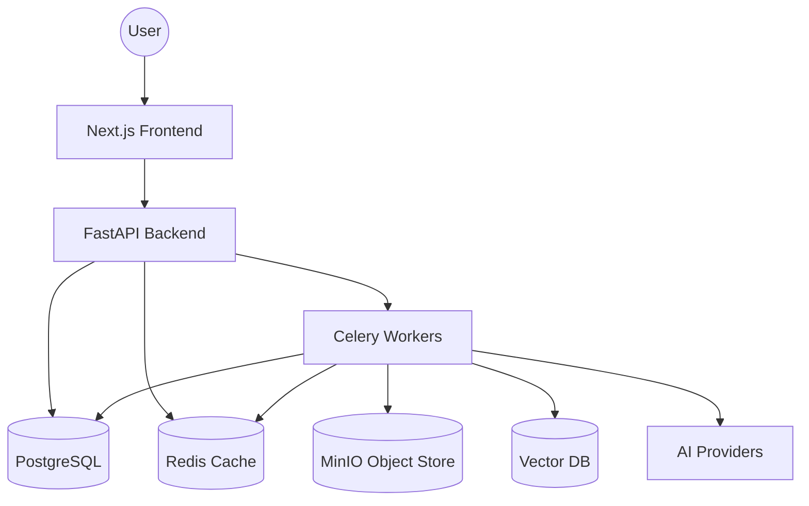

## 2. Login/Authentication Flow
**Description:** Sequence of events when a user logs in.
**Key Files:** `frontend/src/lib/auth.ts`, `backend/src/contextedge/api/v1/auth.py`

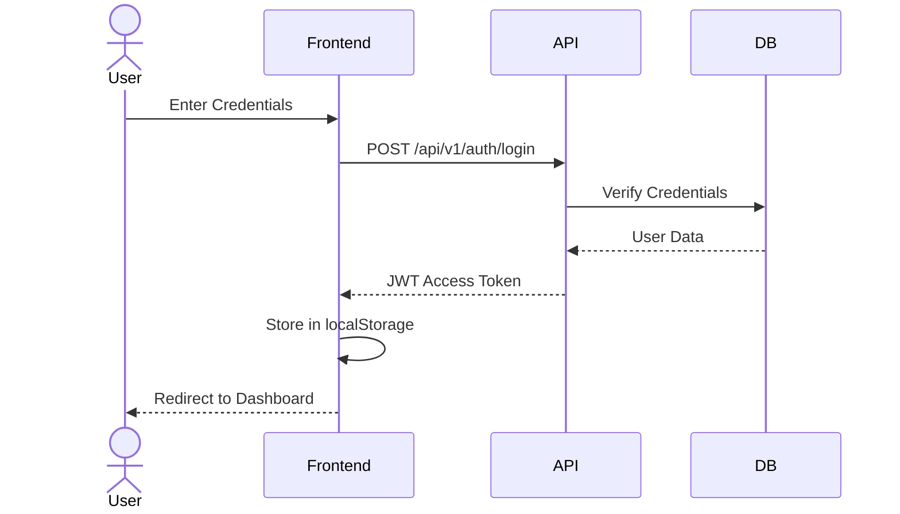

## 3. API Request Lifecycle
**Description:** How an HTTP request flows through the FastAPI middleware before hitting the router.
**Key Files:** `main.py`, `middleware/request_context.py`

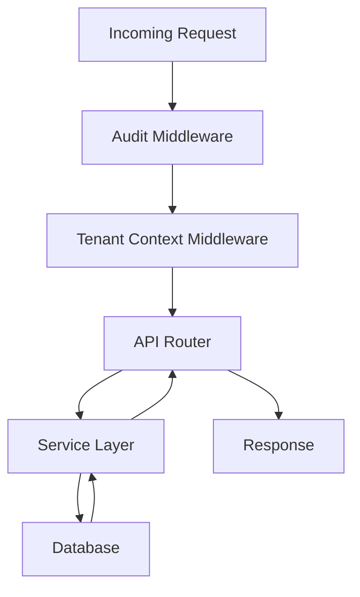

## 4. Evidence Ingestion Flow
**Description:** How raw data is ingested and normalized.
**Key Files:** `sync_tasks.py`, `extraction_tasks.py`

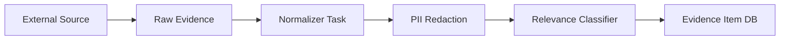

## 5. AI Extraction Pipeline
**Description:** Fan-out of tasks to extract knowledge from evidence.
**Key Files:** `extraction_tasks.py`, `chunk_tasks.py`

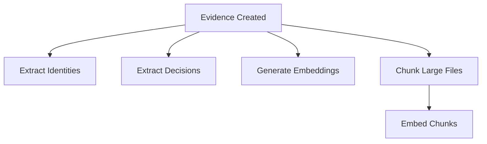

## 6. Episode Creation Flow
**Description:** Reconstructing episodes from grouped evidence.
**Key Files:** `episode_service.py`

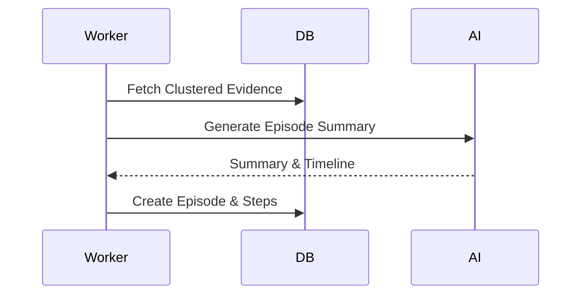

## 7. Pattern Detection Flow
**Description:** Background mining of recurring issues.
**Key Files:** `pattern_tasks.py`

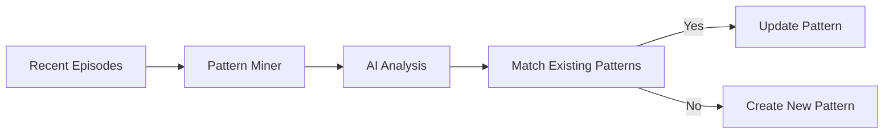

## 8. Playbook Generation Flow
**Description:** Converting detected patterns into actionable playbooks.
**Key Files:** `playbook_service.py`

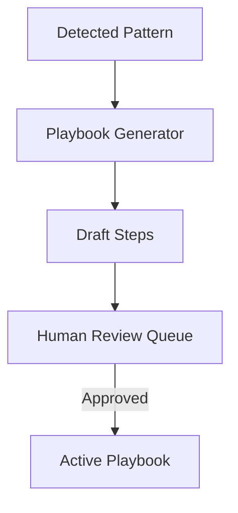

## 9. Agent Execution Flow (MAF)
**Description:** Orchestration of a playbook run.
**Key Files:** `execution_service.py`

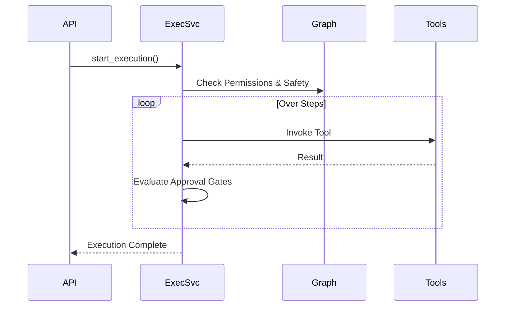

## 10. Vector Retrieval Flow
**Description:** Semantic search for relevant knowledge.
**Key Files:** `hybrid_ranker.py`

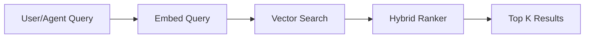

## 11. Context Graph Update Flow
**Description:** Mutating the knowledge graph.
**Key Files:** `graph/builder.py`

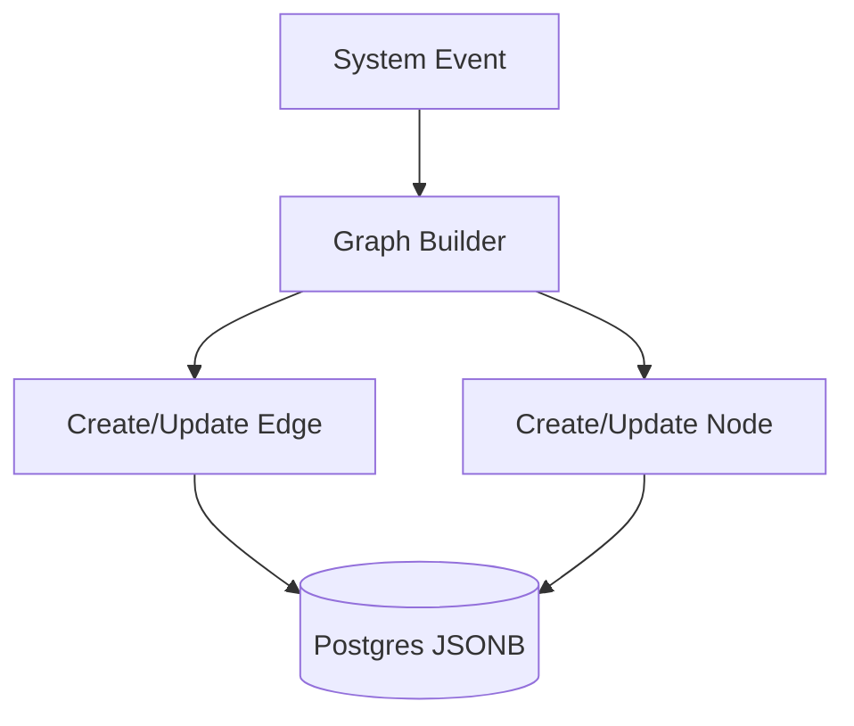

## 12. Review Queue Flow
**Description:** Human-in-the-loop approvals for uncertain AI actions.
**Key Files:** `review_queue_service.py`

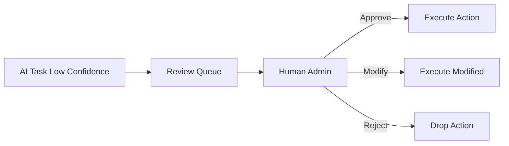

## 13. Evidence Baseline Flow
**Description:** Computing the operational baseline of an entity.
**Key Files:** `evidence_baseline_tasks.py`

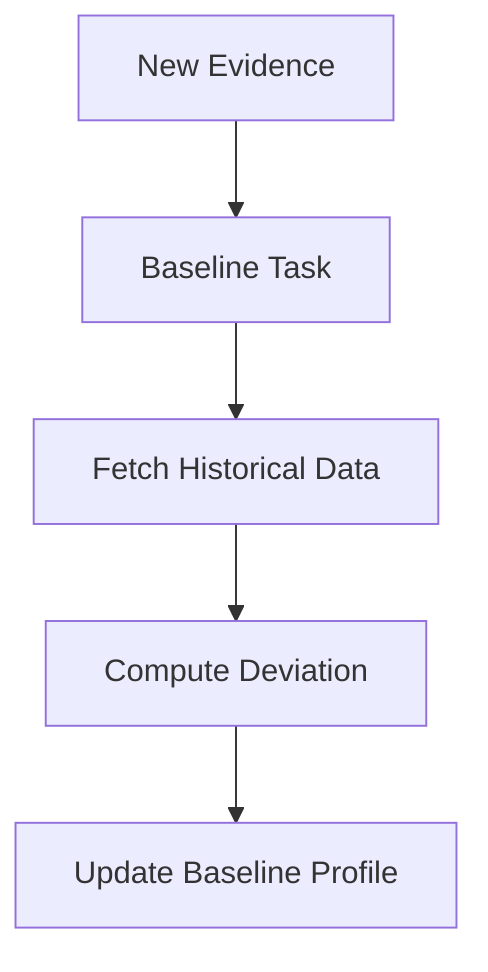

## 14. Sync Operation Flow
**Description:** Syncing from external integrations (e.g. Jira).
**Key Files:** `sync_worker_service.py`

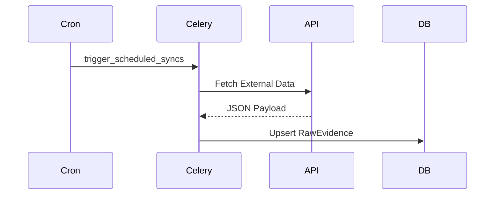

## 15. Runtime Query Execution Flow
**Description:** Processing dynamic queries against the operational memory.
**Key Files:** `graph/queries.py`

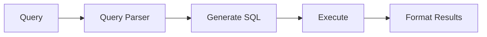

## 16. Decision Pipeline Flow
**Description:** How historical decisions inform current actions.
**Key Files:** `decision_tasks.py`

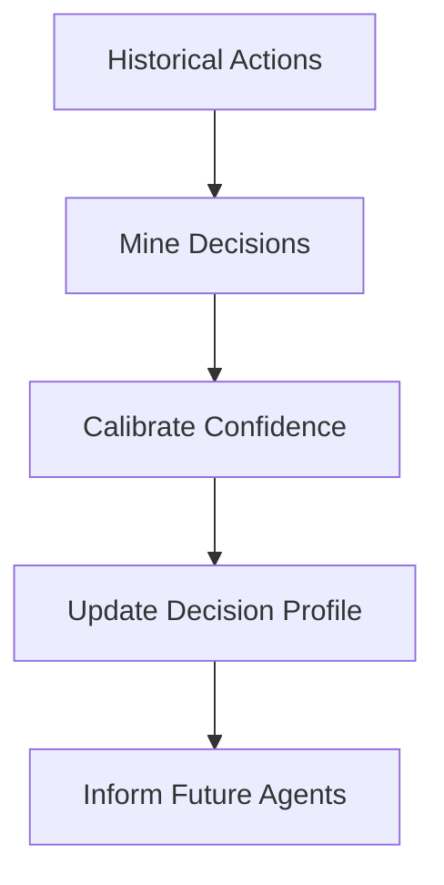

## 17. Evaluation Flow
**Description:** Evaluating playbook performance and AI output quality.
**Key Files:** `evaluations.py`


## 18. Policy Enforcement Flow
**Description:** Checking RBAC and safety policies before actions.
**Key Files:** `execution_service.py`

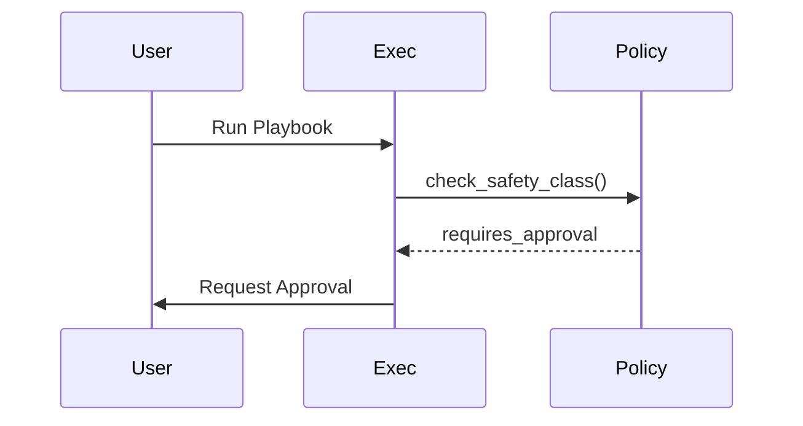

## 19. LLM Interaction Flow
**Description:** Wrapper around AI providers (OpenAI, Anthropic).
**Key Files:** `ai/provider.py`

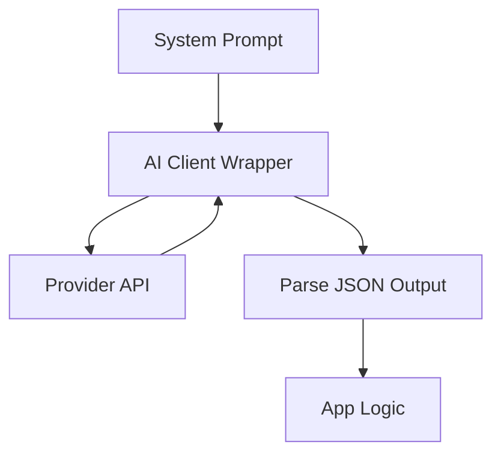

## 20. Contradiction Detection Flow
**Description:** Identifying conflicting information in the memory graph.
**Key Files:** `contradiction_service.py`


## 21. Identity Resolution Flow
**Description:** Merging aliases into a single canonical identity.
**Key Files:** `identity_service.py`

```mermaid
flowchart TD
    Raw[Raw Identity String] --> Match[Fuzzy Match DB]
    Match -- High Confidence --> Merge[Link to Canonical]
    Match -- Low Confidence --> New[Create New Identity]
```

## 22. Correlation Discovery Flow
**Description:** Finding links between disparate evidence items.
**Key Files:** `correlation_service.py`

```mermaid
flowchart LR
    Ev1[Evidence A] --> Analyzer[Correlation Engine]
    Ev2[Evidence B] --> Analyzer
    Analyzer --> Embed[Compare Embeddings]
    Analyzer --> Meta[Compare Metadata]
    Embed & Meta --> Link[Create Correlation Edge]
```

## 23. Drift Detection Flow
**Description:** Detecting when playbooks become stale compared to recent evidence.
**Key Files:** `drift.py`

```mermaid
sequenceDiagram
    participant Cron
    participant DB
    participant AI
    Cron->>DB: Get Active Playbooks
    DB->>AI: Compare with Recent Incidents
    AI-->>DB: Drift Score
    DB->>DB: If > Threshold, Flag Stale
```

## 24. Worker Task Chain Flow
**Description:** The propagation of Celery request context and correlations.
**Key Files:** `celery_app.py`

```mermaid
flowchart TD
    Req[HTTP Request] --> ID[Inject Request ID]
    ID --> Queue[Celery Queue]
    Queue --> Prerun[Task Prerun Context Bind]
    Prerun --> Work[Execute Work]
    Work --> Postrun[Release Context]
```

## 25. Retention/Cleanup Flow
**Description:** Hard deletion of expired data and orphans.
**Key Files:** `cleanup_tasks.py`

```mermaid
flowchart TD
    Cron[Daily Cron] --> Sweep[Find Expired Evidence]
    Sweep --> DB[Delete DB Rows]
    Sweep --> S3[Delete MinIO Objects]
    Sweep --> Graph[Delete Orphan Edges]
```

---
*Generated by the Senior Technical Writer Agent.*
