# ContextEdge — Project Flow Diagrams

A catalog of flow diagrams for the critical processes and data pipelines in ContextEdge. Use it to orient quickly; use [03_End_to_End_Project_Flow.md](03_End_to_End_Project_Flow.md) when you need the prose walkthrough, and the code citations here when you need the truth.

**Accuracy note.** Every diagram below was re-checked against the working tree on **2026-08-19**, and the "Key files" lines carry real line numbers you can click through. Where a diagram used to imply something the code does not do, the correction is called out under **Notes** rather than quietly dropped — knowing what a doc used to get wrong is often more useful than the fix.

**Running example.** Diagrams that need concrete data use the **Acme VPN incident**: ServiceNow incident `INC0010427` on CI `vpn-gw-east-01`, its Teams thread, the engineer's email quoting the incident number, and the older "how the VPN works" KB article.

---

## 1. Project architecture overview

**Description:** High-level shape of the system: Next.js frontend, FastAPI backend, Celery workers across eight queues, Postgres with pgvector, Redis (three logical databases), MinIO, and the model provider through LiteLLM.
**Key files:** `backend/src/contextedge/main.py:109-212` (app assembly), `backend/src/contextedge/workers/celery_app.py:142-190` (worker app), `backend/src/contextedge/config.py:26-35` (Redis and MinIO wiring), `docker-compose.yml:1-60`.

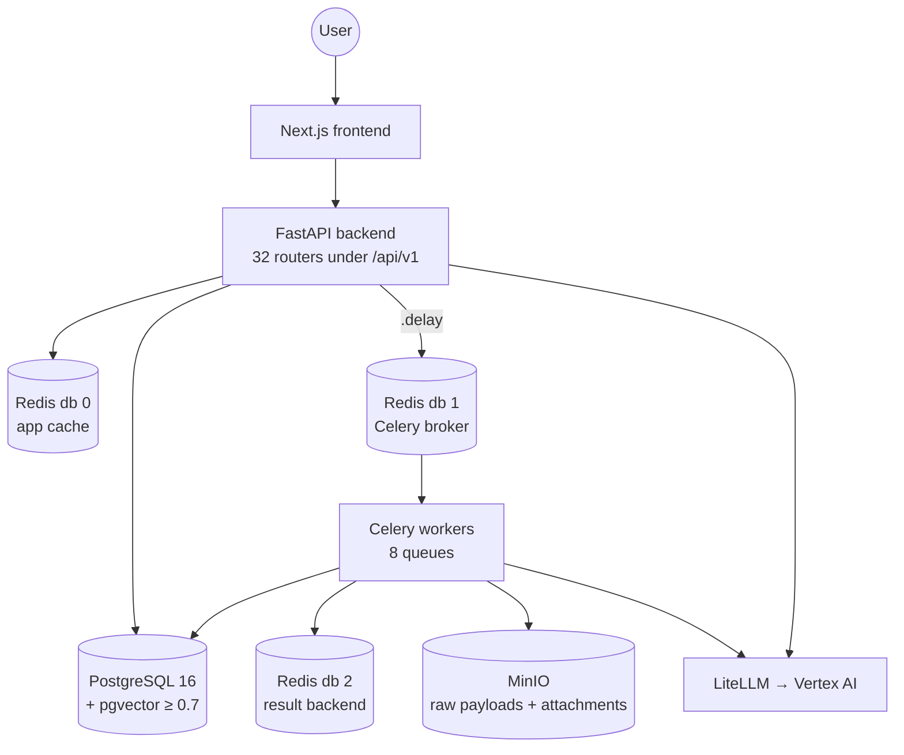

**Notes**
- There is no separate vector database. Vectors live in Postgres as `Vector(3072)` columns, indexed by halfvec expression HNSW — see diagram 26.
- Redis is used three ways at once: app cache on db 0, Celery broker on db 1, result backend on db 2 (`config.py:26-28`). A "Redis purge" that targets db 0 does not clear stuck broker messages.

---

## 2. Login / authentication flow

**Description:** What happens when a user signs in, including the parts that exist to resist enumeration and cross-tenant ambiguity.
**Key files:** `backend/src/contextedge/api/v1/auth.py:35-101`, `backend/src/contextedge/deps.py:72-114`, `frontend/src/lib/auth.ts`.

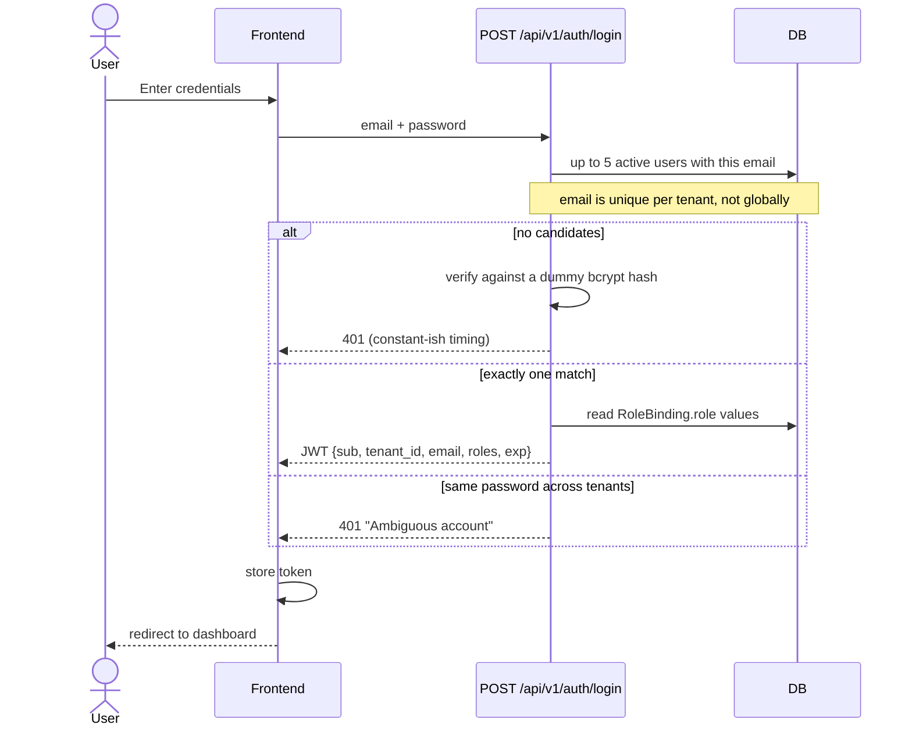

**Notes**
- bcrypt runs on a thread, never the event loop (`auth.py:66-73`). The 5-candidate cap bounds attacker-triggered bcrypt work.
- Access tokens expire after `jwt_access_token_expire_minutes` (60). Outside development, a default JWT secret or a missing Fernet key raises at import (`config.py:248-264`).
- Frontend nav gating is UX only: the frontend treats just `platform_super_admin` as a super-role, while the backend also short-circuits `tenant_admin` and `admin` (`deps.py:37-44`; `frontend/src/lib/roles.ts:7-9`). Authorization is the API's 401/403.

---

## 3. API request lifecycle

**Description:** How an HTTP request flows through middleware before reaching a route handler, and where the correlation ids come from.
**Key files:** `backend/src/contextedge/main.py:119-166`, `backend/src/contextedge/middleware/request_context.py:74-152`, `backend/src/contextedge/middleware/request_audit.py:25-124`, `backend/src/contextedge/database.py:29-42`.

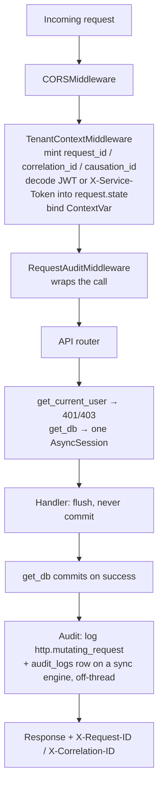

**Notes**
- Middleware is **added** as audit → tenant → CORS, and Starlette wraps last-added outermost, so the effective order is the one drawn above.
- The global exception handler re-adds CORS headers by hand, because it runs outside `CORSMiddleware` — without them a browser could never read the `request_id` the handler exists to return (`main.py:132-166`).
- Audit rows are only written when a tenant resolved. Unauthenticated 401 probes exist **only** in the structlog line — alert on `http.mutating_request` with status 401 (`request_audit.py:59-64`).

---

## 4. Evidence ingestion flow (raw side)

**Description:** How connector output becomes durable raw rows, including the MinIO offload and the crash-safe handoff to normalization.
**Key files:** `backend/src/contextedge/workers/sync_tasks.py:13-81`, `backend/src/contextedge/services/sync_worker_service.py:301-376, 419-523`, `backend/src/contextedge/services/ingestion_persistence.py:19-91`, `backend/src/contextedge/services/object_store.py:50-59`.

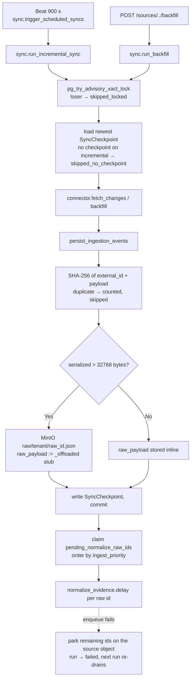

**Notes**
- `OFFLOAD_THRESHOLD_BYTES = 32_768` (`ingestion_persistence.py:16`). The DB row keeps `{"_offloaded": true, "size_bytes": N}` plus `object_storage_key`.
- **Any SQL that filters on `raw_payload` silently skips offloaded rows** — the biggest tickets and longest articles. Live examples: ingest-priority ordering (`services/ingest_priority.py:76-95`) and reply-inheritance reconciliation (`workers/extraction_tasks.py:949-967`).
- The MinIO client uses 1-second connect and read timeouts with one attempt (`object_store.py:19-35`) — a slow store fails fast instead of stalling a worker.

---

## 5. Evidence normalization (`_normalize`)

**Description:** The ordered pipeline inside one Celery task and one transaction: noise gate, redaction, dedup, derivation, four model calls, embedding, chunk dispatch.
**Key files:** `backend/src/contextedge/workers/extraction_tasks.py:122-628` (body) and `:1300-1354` (task shell), `backend/src/contextedge/services/message_filter.py:81-206`, `backend/src/contextedge/services/redaction_service.py:36-191`.

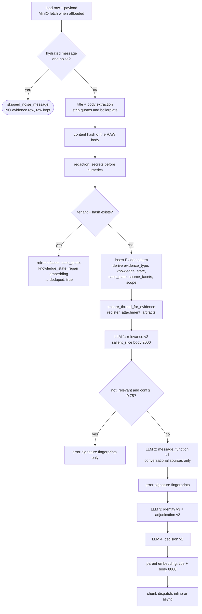

**Notes**
- The noise gate is deterministic and pre-LLM. `coordination_only` needs content under `MIN_DIAGNOSTIC_CHARS = 150` **and** no technical signal across 15 regexes. Measured: 47% of 18,907 live messages rejected (`message_filter.py:52, 104-108`).
- The content hash covers the **raw, pre-redaction** body, so tuning a cleaning or redaction rule never breaks dedup.
- Error-signature fingerprinting runs even for gated-out items — a confidently-irrelevant thread can still carry a pasted stack trace.
- Every enrichment is individually try/except-wrapped. A classifier failure is **fail-open**: it falls through to the full pipeline.

---

## 6. Thread hydration loop

**Description:** How one ticket becomes N message rows, and what stops the loop from re-hydrating itself.
**Key files:** `backend/src/contextedge/workers/hydration_tasks.py:36-205`, `backend/src/contextedge/services/thread_text_service.py:346+`, `backend/src/contextedge/services/message_filter.py:209-213`.

```mermaid
sequenceDiagram
    participant N as normalize_evidence
    participant H as hydration.hydrate_thread
    participant C as Connector
    participant P as persist_ingestion_events
    N->>N: payload has _thread_id, not itself a hydrated<br/>message, not a dedup
    N->>H: delay(thread_ext_id, source_id, tenant_id) AFTER commit
    H->>C: hydrate_thread(thread_id)
    C-->>H: messages (threads + internal comments, merged)
    H->>H: clean_thread_bodies — strip text already<br/>seen earlier in this thread (89% was repetition)
    H->>P: one IngestionEvent per message<br/>object_type = hydrated_message
    P-->>H: new raw ids (dedup + 32 KB offload apply)
    H->>H: Thread.hydration_status = complete, counts stamped
    H->>N: normalize_evidence.delay per NEW raw id
    Note over N: is_hydrated_message → never requests<br/>hydration again; loop converges in one pass
```

**Notes**
- Without the `is_hydrated_message` guard, each of a thread's messages would re-hydrate its own thread — measured 10x amplification.
- When **both** Zoho thread endpoints fail, hydration re-raises rather than storing a thread as "hydrated but empty" — Zoho answers quota exhaustion with empty results, not errors (`connectors/zoho_desk/connector.py:1344-1349`).

---

## 7. AI extraction fan-out

**Description:** What runs inline inside `_normalize` versus what is dispatched after the commit.
**Key files:** `backend/src/contextedge/workers/extraction_tasks.py:1306-1354`, `backend/src/contextedge/workers/artifact_tasks.py:11-46`.

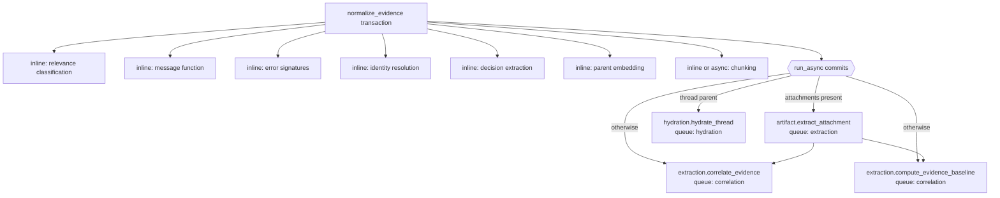

**Notes**
- **Nothing is dispatched before the commit.** A message consumed before its transaction lands would read pending state and no-op without retry — the same rule governs episode approval (diagram 20).
- When attachments exist, correlation waits for artifact extraction, because attachment text is merged into the body and re-redacted before the item is re-classified (`services/artifact_extraction_service.py:430-499`).

---

## 8. Chunking and chunk embedding

**Description:** How evidence becomes retrievable pieces, which chunker runs, and why chunking has its own queue.
**Key files:** `backend/src/contextedge/workers/extraction_tasks.py:73-119`, `backend/src/contextedge/workers/chunk_tasks.py:54-263`, `backend/src/contextedge/services/evidence_chunk_service.py:43-169`, `backend/src/contextedge/services/chunkers/registry.py:116-143`.

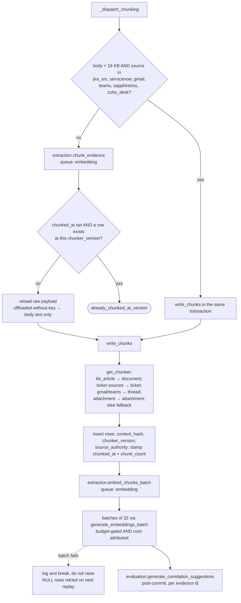

**Notes**
- The dedicated `embedding` queue exists because of a measured failure: 1,879 chunks with 289 embedded (15%) while 309 embed tasks sat behind 10,226 normalizations. Nothing errored — the evidence was ingested and silently unretrievable (`workers/celery_app.py:259-268`).
- `source_authority` is decided **evidence-type first**: knowledge types get `knowledge_article` regardless of source, so the Acme KB page never competes with `INC0010427` as if it were a ticket (`evidence_chunk_service.py:135-169`).
- Chunk rows at different `chunker_version` values coexist by design; there is **no garbage-collection task** for old generations (`codewiki/KNOWN_GAPS.md:421-427`).

---

## 9. Correlation discovery

**Description:** How disparate evidence becomes one case: deterministic case links first, gated identity co-occurrence second.
**Key files:** `backend/src/contextedge/services/correlation_service.py:116-194` (candidates), `:197-791` (the two tiers plus enrichment), `backend/src/contextedge/workers/correlation_tasks.py:12-71`.

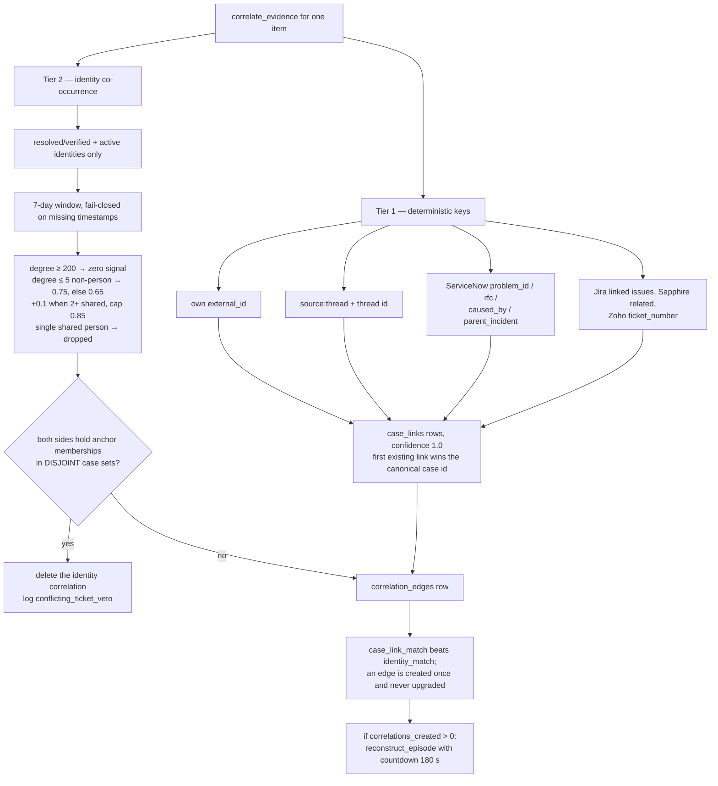

**Notes**
- CI and assignment-group references are deliberately **never** case-link keys — shared infrastructure would mass-merge unrelated incidents.
- All enrichment (ServiceNow references, ticket bridging, per-source reference services) runs inside `begin_nested()` savepoints, so a failure loses enrichment and never the correlation.
- Acme: the email quoting `INC0010427` links at 1.0 through the ticket-number bridge; the Teams thread naming `vpn-gw-east-01` correlates at 0.75 as a rare device.

---

## 10. Episode reconstruction

**Description:** Turning a correlated cluster into one narrated story — and the six gates that stop it from paying for narration that dedup would retire.
**Key files:** `backend/src/contextedge/workers/extraction_tasks.py:995-1297`, `backend/src/contextedge/services/episode_cluster_service.py:47-105`, `backend/src/contextedge/ai/extractors/episode_extractor.py:97-211`, `backend/src/contextedge/services/episode_service.py:114-333`.

```mermaid
sequenceDiagram
    participant T as reconstruct_episode
    participant CS as episode_cluster_service
    participant AI as episode prompt v3
    participant DB
    T->>CS: resolve_episode_cluster(seed ids)
    CS->>DB: connected component over case_links +<br/>correlation_edges, both directions
    Note over CS: max 50 members, 3 hops, 30-day window<br/>from the NEAREST seed; legal hold and<br/>pending redaction fenced out in SQL
    CS-->>T: EpisodeCluster + sha256 fingerprint
    T->>T: gate 1 — cluster < 3 → skipped_below_min_cluster
    T->>T: gate 2 — resolution gate (only when set to "cluster")
    T->>DB: gate 3 — advisory lock on fingerprint
    T->>T: gate 4 — newest member < 180 s old → defer<br/>(unless oldest > 1800 s: starvation guard)
    T->>DB: gate 5 — same fingerprint pending → duplicate_cluster
    T->>T: gate 6 — cluster must be ≥ 1.5× the covered episode
    T->>AI: items labelled [ev-N], fenced as untrusted,<br/>salient_slice 2000 chars each, max 20 per call
    AI-->>T: episodes with evidence_refs
    T->>T: translate ev-N → real UUIDs, DROP minted refs
    T->>T: validate_episode (structure strict, vocabulary lenient)
    T->>T: stamp _generation provenance AFTER the gate
    T->>DB: episodes + episode_evidence_links + episode_steps
    T->>DB: supersede pending drafts whose evidence is a strict subset
```

**Notes**
- The advisory lock exists because 8 concurrent tasks once minted 8 identical episodes in 46 seconds.
- A reviewer's manual trigger passes `settle=False` and bypasses the debounce — an explicit request is not a duplicate.
- **Open P1:** clusters over 20 evidence items split into 2-3 model calls and their steps stack, all numbered from #1 (worst live case: 319 steps). Row-level fields stay clean. 949 live episodes affected; 836 pending drafts are on hold for repair (`codewiki/KNOWN_GAPS.md:464-478`).

---

## 11. Episode review — advisory and auto-approve

**Description:** The hourly sweep that stamps a model verdict on drafts, and the deterministic floors that stand between a verdict and an approval.
**Key files:** `backend/src/contextedge/workers/evaluation_tasks.py:125-358`, `backend/src/contextedge/services/episode_review_service.py:40-44, 89-101, 174-308`, `backend/src/contextedge/config.py:185-187`.

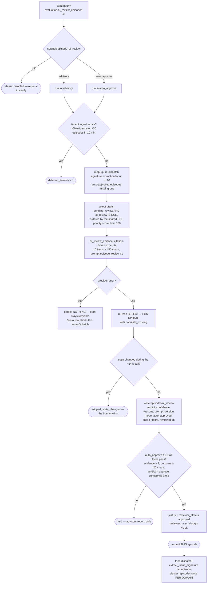

**Notes**
- The three modes are exactly `off` (default), `advisory`, `auto_approve` (`episode_review_service.py:40`; regex-enforced at `config.py:185-187`).
- A dispatch `mode_override` can only **downgrade**. Passing `auto_approve` as an override under `advisory` still yields advisory.
- `reviewer_user_id` stays NULL on a machine approval, permanently distinguishing it from a human signature.
- Commit is **per episode, before any dispatch**. A batch-end commit made every verdict hostage to the last one; one deadlock cost 50 re-paid model calls.
- Clustering is dispatched **per domain**: passing `None` clusters only NULL-domain episodes, which on a live graph is nothing.

---

## 12. Issue signatures and recurrence

**Description:** How an approved episode becomes a generalized problem fingerprint, and how a second occurrence links back to the first case as precedent.
**Key files:** `backend/src/contextedge/services/issue_signature_service.py:47-86, 89-312`, `backend/src/contextedge/workers/signature_tasks.py:20-41`, `backend/src/contextedge/ai/prompts/issue_signature.py:14-61`.

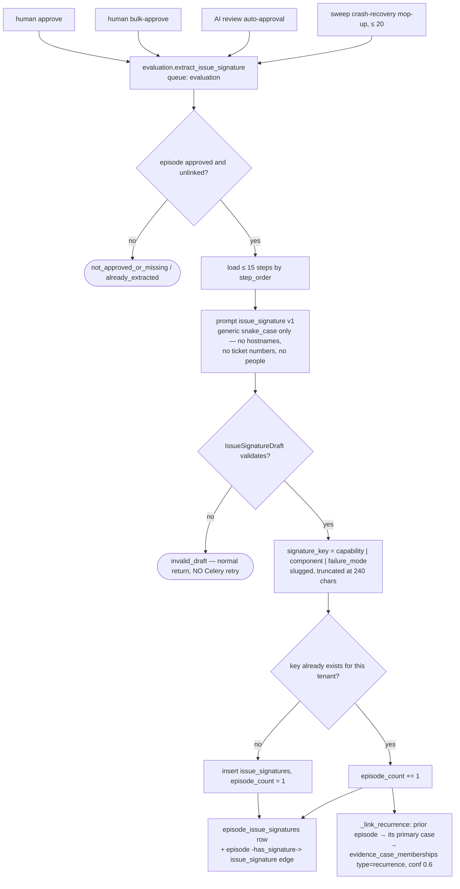

**Notes**
- Trigger, environment and scope are **descriptive, not identity** — the same failure triggered differently still recurs under one key.
- The cluster resolver refuses to expand through `recurrence` memberships (`services/episode_cluster_service.py:158-193`). Recurrence means "similar problem, never the same occurrence".
- `IssueSignature.error_signature_id` has a column, an FK and a projection edge — but **no writer** (`issue_signature_service.py:168-177`). Deterministic error signatures and LLM issue signatures are parallel, unjoined systems today.
- Acme: `remote_access|tls_certificate|certificate_expired`. Six months on, the same failure mints a second episode under that key and links back to `INC0010427`'s case as precedent.

---

## 13. Pattern clustering

**Description:** Background mining of recurring issues from approved episodes. Note the trigger — there is no scheduled entry.
**Key files:** `backend/src/contextedge/workers/pattern_tasks.py:117-372`, `backend/src/contextedge/ai/extractors/pattern_extractor.py:26-112`, `backend/src/contextedge/services/pattern_service.py:62-197`.

```mermaid
flowchart TD
    T1[human approve / bulk-approve<br/>per affected domain] --> C[pattern.cluster_episodes<br/>queue: pattern]
    T2[AI review sweep, per domain with approvals] --> C
    T3[POST /api/v1/patterns/cluster, domain_admin] --> C
    C --> Rep[repair: embed approved episodes with NULL embedding]
    Rep --> Cand[candidates: approved + embedded + unlinked,<br/>THIS domain scope, limit 100]
    Cand --> Probe{existing pattern with a member<br/>at cosine distance &lt; 0.35?}
    Probe -- yes --> Adj[validate_pattern_match — inline prompt,<br/>task=verification, FAILS OPEN at 0.75]
    Adj -- is_match --> Add[add_episode_to_pattern → re-enqueue playbook generation]
    Adj -- no match --> Sim
    Probe -- no --> Sim[similar approved unlinked episodes<br/>at cosine distance &lt; 0.20]
    Sim --> Cl{cluster empty?}
    Cl -- yes --> Single[single-episode cluster]
    Cl -- no --> Multi[multi-episode cluster]
    Single --> Syn[synthesize_pattern — prompt pattern v2,<br/>task=pattern, NO Pydantic gate]
    Multi --> Syn
    Syn --> Title{title contains "no incident" / "no pattern"?}
    Title -- yes --> SkipP([skip persistence, mark assigned])
    Title -- no --> P[create_pattern_from_episodes]
    Syn -. any exception .-> FB[fallback pattern "Auto: title", confidence 0.75,<br/>no synthesized fields, NULL provenance]
    P --> Edges[pattern_evidence_links + enrichment edges<br/>+ belongs_to / affects edges + memory promotion]
    Edges --> Gen[pattern.generate_playbook_candidate]
    Gen --> Dd[dedup sweep rides along, fail-soft]
```

**Notes**
- **There is no `beat_schedule` entry for clustering** (verified across `workers/celery_app.py:281-384`). It is approval-event-driven plus manual. The older "patterns never form without an operator" note is now half-stale: approval-time auto-dispatch exists (`services/pattern_service.py:181-188`).
- Domain scoping is strict: a domain pass sees only that domain's episodes; the global pass sees only NULL-domain ones.
- A full 100-episode pass ran **25 minutes in one transaction** with ~156 model calls; a late failure rolls back every row while the spend stays spent (`codewiki/KNOWN_GAPS.md:528-539`).

---

## 14. Playbook generation

**Description:** Converting a pattern into a versioned, citation-validated candidate — with the retrieval step that pulls the tenant's own KB into the prompt.
**Key files:** `backend/src/contextedge/workers/pattern_tasks.py:405-684`, `backend/src/contextedge/services/knowledge_retrieval_service.py:226-624`, `backend/src/contextedge/ai/generators/playbook_generator.py:40-241`, `backend/src/contextedge/services/playbook_service.py:360-436`.

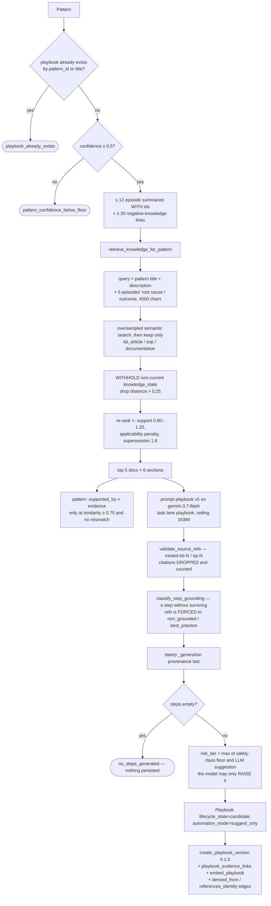

**Notes**
- The empty-steps refusal exists because a truncated response's complete-looking prefix once survived JSON repair and persisted a playbook with zero steps.
- `knowledge_ids` are recorded **separately** from `evidence_ids` on the version — normative and empirical grounding must not flatten.
- `POST /api/v1/playbooks/generate` is a **different, leaner path**: no knowledge retrieval, no confidence floor, no risk floor, no empty-steps guard, no embedding, and every `ep-N` citation dropped because the summaries omit ids (`api/v1/playbooks.py:654-767`).

---

## 15. Playbook lifecycle and review

**Description:** The governed state machine a candidate walks before runtime can see it.
**Key files:** `backend/src/contextedge/services/playbook_service.py:22-30, 233-261`, `backend/src/contextedge/api/v1/playbooks.py`.

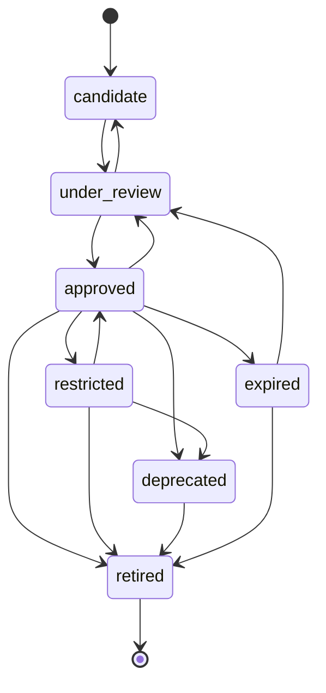

**Notes**
- Transitions are validated against `VALID_TRANSITIONS`; an illegal jump raises `InvalidTransitionError`. `retired` is terminal.
- Runtime ranks only `approved` playbooks that have a published version. `create_playbook_version` repoints `current_version_id` immediately, before review — the lifecycle state, not the pointer, is the gate.
- `automation_mode` is separate from lifecycle: `suggest_only` means the playbook can be recommended but not executed, and only `tenant_admin` may change it (`frontend/src/lib/roles.ts:22-56`).

---

## 16. Runtime match and hybrid ranking

**Description:** Turning symptoms into a ranked playbook recommendation with an inspectable score breakdown.
**Key files:** `backend/src/contextedge/api/v1/runtime.py:89-267`, `backend/src/contextedge/search/hybrid_ranker.py:22-31, 213-379`, `backend/src/contextedge/services/memory_service.py:82-288`.

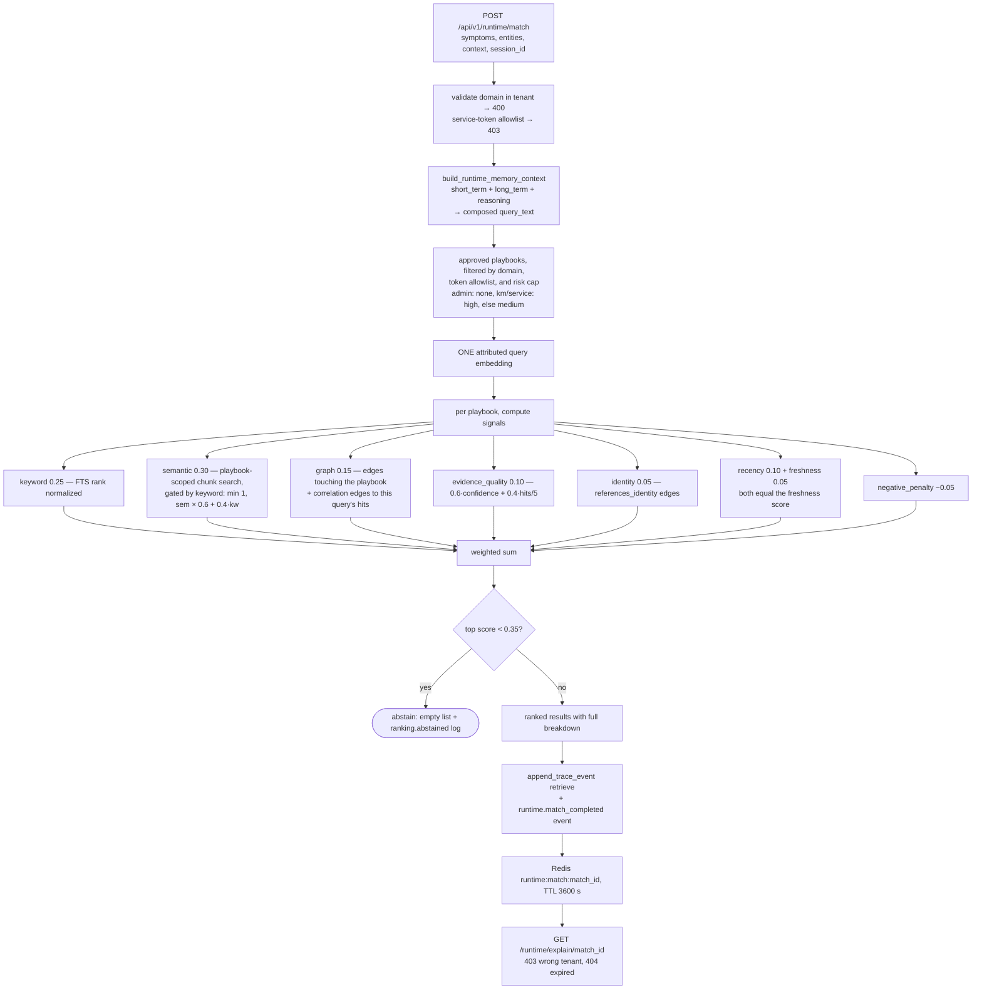

**Notes**
- These are the **actual** weights from `RankingWeights` (`hybrid_ranker.py:22-31`). Because `recency_score = freshness` (`:334`), freshness effectively carries 0.15.
- An empty result is the contract for "no recommendation", not an error (`hybrid_ranker.py:168-171`).
- `MATCH_CACHE_TTL_SEC = 3600` (`runtime.py:29`). A cache write failure is swallowed; the explain call later 404s.

---

## 17. Semantic search read path

**Description:** How a query actually reaches the vector index — chunk pass, MMR, rollup, parent merge.
**Key files:** `backend/src/contextedge/search/vector_search.py:40-70, 204-243`, `backend/src/contextedge/search/chunk_rollup.py:31-121`, `backend/src/contextedge/search/vector_ops.py:26-45`.

```mermaid
flowchart LR
    Q[query text] --> E[generate_embedding<br/>or a pre-computed one]
    E --> T[tune_ann_recall<br/>SET LOCAL hnsw.ef_search = 200]
    T --> CP[chunk ANN over evidence_chunks<br/>joined to evidence_items<br/>oversample min max 80, limit×3, 240]
    CP --> Vis[visibility on the PARENT:<br/>no legal hold, no pending redaction,<br/>no excluded access policy]
    Vis --> M[MMR λ = 0.7 — picks WHICH survive]
    M --> R[rollup: one candidate per parent,<br/>its closest chunk — decides RANK]
    R --> PP[parent ANN over evidence_items.embedding<br/>same halfvec space, same predicates]
    PP --> Merge[merge, sort by distance, truncate to limit]
    Merge --> Out[EvidenceItem, distance, best_chunk<br/>with parent_section + 240-char snippet]
```

**Notes**
- `ef_search` is raised per transaction because the HNSW indexes are **global across tenants** while every query post-filters by `tenant_id`; at the default 40 a small tenant's rows can be absent from the candidate set entirely.
- The parent pass is what keeps unchunked evidence — pre-chunking rows, chunker failures — findable at all.
- A corrupt chunk embedding makes MMR degrade to pure distance ordering, never a failed request (`chunk_rollup.py:59-76`).

---

## 18. Agent graph projection (MAF)

**Description:** The bounded, access-scoped subgraph an agent receives instead of raw graph access.
**Key files:** `backend/src/contextedge/graph/agent/service.py:39-167`, `graph/agent/repository.py:156-512` (seeds), `graph/agent/selector.py:28-261` (traversal), `graph/agent/hydrators.py:98-233` (visibility and facts), `graph/agent/contracts.py:26-30`.

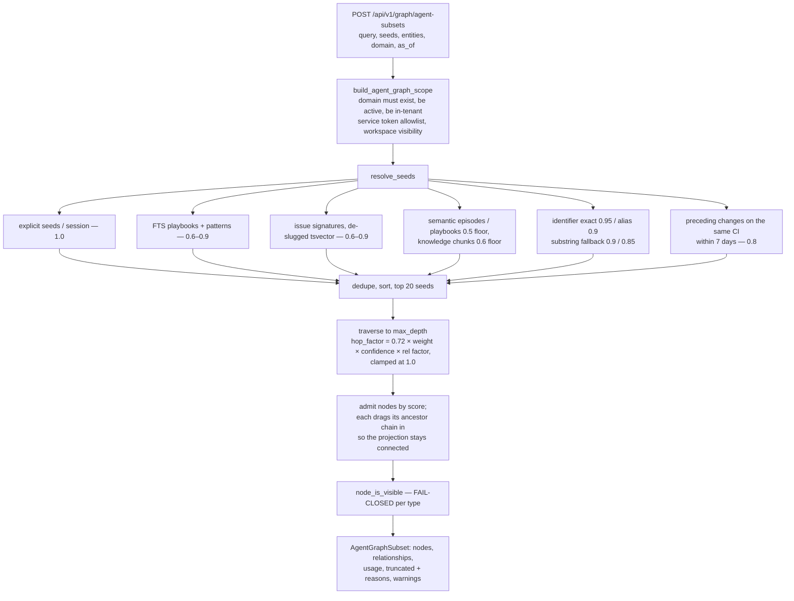

**Notes**
- Default budget 24 nodes / 48 relationships / depth 2 / 12,000 characters; profile maximum 60 / 120 / 3 / 30,000 (`contracts.py:26-30`; `graph/agent/profiles.py:183-188`).
- Visibility is fail-closed: a playbook must be approved with a current version inside the risk cap, an episode must be approved, evidence must pass the knowledge-lifecycle check — **and a pending AI-authored decision is invisible**, so agent output cannot launder itself back into agent input (`hydrators.py:152-160`).
- `mentions_identity` is deliberately excluded from traversal: measured fan-out of 40-70 edges per handful of tickets would spend the whole budget on identity hubs.
- When `as_of` is set, the projection warns that **relationship topology is point-in-time while node facts are current** (`selector.py:236-242`).

---

## 19. Context graph writes

**Description:** How edges get created, deduped and closed.
**Key files:** `backend/src/contextedge/graph/builder.py:16-217, 477-518`, `backend/src/contextedge/graph/edge_types.py:1-33`, `backend/src/contextedge/models/pattern.py:174-273`.

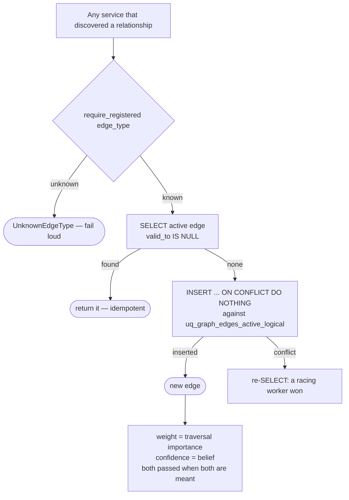

**Notes**
- 69 edge types are registered in five semantic groups; 18 are deliberately **not** traversable by `maf.v1`, each with its exclusion reason recorded. A test enforces that every registered type is either projected or excluded-with-a-reason.
- `replace_edge` (close + re-add for temporal versioning) exists but has **no production callers** (`codewiki/KNOWN_GAPS.md:66`).
- Materialization from relational rows runs on Beat every 6 hours and is **additive only** — there is no event-driven materialization (`graph/agent/materializer.py:54-359`; `workers/celery_app.py:329-333`).

---

## 20. Knowledge dedup sweep

**Description:** The hourly sweep that keeps evidence, episodes, patterns and playbooks from re-inflating.
**Key files:** `backend/src/contextedge/services/pattern_service.py:254-549`, `backend/src/contextedge/services/episode_service.py:336-744`, `backend/src/contextedge/workers/pattern_tasks.py:687-805`.

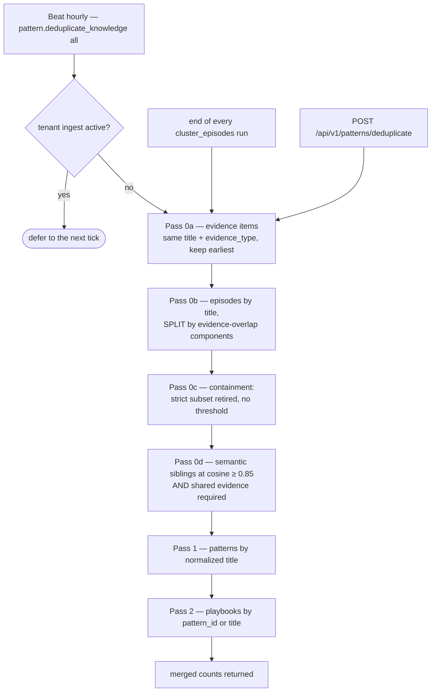

**Notes**
- The activity guard is beat-path only: the ride-along and the API route tolerate overlap via existence checks.
- Semantic sibling merges **require shared evidence**. Disjoint pairs at 0.85+ are exactly the recurrence case, and merging them would destroy the signal diagram 12 depends on — they are refused and counted.
- Merges never hard-delete: the duplicate becomes `reviewer_state = "superseded"`. Steps deliberately stay with the duplicate, because moving them concatenated whole narrations.

---

## 21. Identity resolution

**Description:** Turning a mention in text into a canonical identity — four layers, with a candidacy gate in the middle that exists purely for cost.
**Key files:** `backend/src/contextedge/services/identity_service.py:56-69, 616-918`, `services/identity_candidacy.py:65-196`, `services/identity_normalizer.py:81-138`, `services/identity_promotion.py:56-138`.

```mermaid
flowchart TD
    T[extract_identities — prompt identity v3,<br/>fenced + salient_slice 4000] --> Nz[normalize_extracted_entity<br/>lower, typed identifiers, alias capture]
    Nz --> L1{strong identifier match?<br/>email, username, hostname, fqdn, ip, serial, external_id}
    L1 -- yes --> R1([resolved 1.0 — strong:type])
    L1 -- no --> L2{typed exact alias match?}
    L2 -- yes --> R2([resolved 0.95 — alias_exact])
    L2 -- no --> Gate{candidacy gate}
    Gate -- facet_type / unsupported_type / not_a_name --> Rej([rejected, counted, no row, no model call])
    Gate -- candidate --> L3[≤ 5 candidates: substring tokens<br/>or pg_trgm similarity &gt; 0.3]
    L3 --> Adj[prompt identity_adjudication v2,<br/>schema-validated]
    Adj -- confidence ≥ threshold<br/>person 0.95, else 0.9 --> R3([auto-link])
    Adj -- below threshold or abstain --> NR([NEW identity in needs_review<br/>never a silent link or fork])
    Adj -. adjudicator error .-> L4
    L3 -- no candidates --> L4[create provisional identity 0.5]
    R1 & R2 & R3 & NR & L4 --> Persist[evidence_identity_links<br/>+ canonical_entity_refs cache<br/>+ mentions_identity edge weighted by confidence]
    Persist --> Prom{provisional, linked by 2–5 distinct evidence?}
    Prom -- yes --> Res([promote to resolved / corroborated])
```

**Notes**
- The candidacy gate sits **below** the free deterministic layers and **above** everything that costs a model call or a row. Identity work was 78% of all model spend before it existed.
- Alias learning means the next bare "SFA" resolves deterministically after one successful adjudication.
- The daily `identity.reconcile_identities` Beat task **proposes merges and never performs them**; rows land in `identity_merge_proposals` and rejections persist so the schedule never re-raises a declined pair.
- Acme: `vpn-gw-east-01` becomes a `hostname` strong identifier — the literal example in the normalizer's own comment (`identity_normalizer.py:134-136`).

---

## 22. Decision trace pipeline

**Description:** How a decision is recorded, what edges it writes, and how similar past decisions are retrieved.
**Key files:** `backend/src/contextedge/services/decision_trace_service.py:51-243, 478-583`, `backend/src/contextedge/api/v1/decisions.py`.

```mermaid
flowchart TD
    C[create_decision] --> I[decision_intent from decision_type<br/>risk_level from the SELECTED option only]
    I --> Row[decisions row + decision_options rows]
    Row --> E1[based_on → evidence / episode / pattern]
    Row --> E2[considered per option, chose for the selected one]
    Row --> E3[applied_policy → tenant_policy]
    Row --> E4[followed_by when chained]
    E1 & E2 & E3 & E4 --> Tr[append_trace_event + decision.created event]
    Tr --> Emb[inline embed_decision → decisions.embedding]
    Emb -. failure .-> Null[NULL embedding — structural retrieval only,<br/>and there is NO backfill task]
    Emb --> Sim[find_similar_decisions]
    Sim --> P1[embedding priority: query_decision_id's stored vector<br/>→ else embed query_text → else none]
    P1 --> P2[with embedding: halfvec ANN after tune_ann_recall<br/>without: created_at DESC]
    P2 --> P3[both paths apply a JSONB containment pre-filter<br/>on workflow / environment / impacted_dependency]
```

**Notes**
- `risk_level` comes from the selected option, never the riskiest one considered.
- `policy_result` NULL means "no rule existed" — distinct from `allowed_auto`.
- Rejection is structured: a code from `REJECTION_REASON_CODES`, options un-selected with the code stamped, status `superseded`, `human_override=True`, and an outcome row with `execution_result="rejected"`.

---

## 23. Execution and policy enforcement

**Description:** The governed ledger a caller drives to run a playbook, and where policy actually bites.
**Key files:** `backend/src/contextedge/services/execution_service.py:206-289, 403-497, 638-1010, 1136-1232`, `backend/src/contextedge/services/approval_policy_service.py:12-149`, `backend/src/contextedge/services/policy_check_service.py:34`.

```mermaid
sequenceDiagram
    participant Caller
    participant Exec as execution_service
    participant Pol as policy engines
    participant DB
    Caller->>Exec: start_execution(playbook, version, session)
    Exec->>Pol: automation-mode cap (approval policy)
    Pol-->>DB: policy_checks row (pass AND fail both recorded)
    Exec->>Pol: per-step action_policies — scope, specificity,<br/>conflict resolution (default most_restrictive)
    Pol-->>Exec: strictest verdict → Decision.policy_result
    Exec->>Pol: trust suspension check (vetoes, never grants)
    Exec->>DB: assign idempotency keys to side-effecting steps<br/>(derived from the approved artifact hash + case)
    Caller->>Exec: request_approval(step)
    Exec->>DB: approval_requests + artifact_version / artifact_hash /<br/>policy_snapshot / expires_at
    Caller->>Exec: decide_approval
    Exec->>Pol: check_decider — approver roles, forbid_self_approval
    Caller->>Exec: record_tool_invocation
    Exec->>Exec: re-check the artifact hash and the duplicate key
    Note over Exec: a mismatch, an expired approval or a duplicate<br/>is refused as 409 — a well-formed request the state declines
    Exec->>DB: execution_attempts + tool_invocations
```

**Notes**
- **There is no executor on this branch.** `execution_service` is a ledger driven by external callers, and all MAF tools are read-or-propose (`codewiki/KNOWN_GAPS.md:34`). The safety controls are prerequisites, not live exposure.
- An invocation may not declare a **higher** safety class than its own step — that is refused in the service, so any caller inherits the rule.
- Policy audit writes are fail-soft by design: the gate has already decided, and an audit failure must not turn an allowed action into a failed one.

---

## 24. Review context prefetch

**Description:** What the `review_queue` lane actually does — it warms a Redis cache for the reviewer console, it is not a queue of pending AI actions.
**Key files:** `backend/src/contextedge/services/review_queue_service.py:39-131, 174+`, `backend/src/contextedge/workers/review_queue_tasks.py:33`.

```mermaid
flowchart LR
    S[session created] --> T[review_queue.prefetch_review_context<br/>queue: default]
    T --> B[build_review_context:<br/>pick the top decision, gather its options,<br/>provenance, similar-decision aggregate, badge level]
    B --> W[write_cache — Redis, 300 s TTL]
    W --> UI[reviewer console reads the cache]
    D[create_decision / outcome / rejection] --> Inv[invalidate_review_context<br/>post-flush, pre-commit]
    Inv --> W
```

**Notes**
- Invalidation fires post-flush and pre-commit, so there is a narrow re-population race; the 300-second TTL is the backstop (`codewiki/KNOWN_GAPS.md:328`).
- Human review of episodes and playbooks happens through their own endpoints (diagrams 11 and 15), not through this lane.

---

## 25. Evidence baseline

**Description:** Computing "was this normal?" for a new evidence item.
**Key files:** `backend/src/contextedge/services/evidence_baseline_service.py:1-45`, `backend/src/contextedge/workers/evidence_baseline_tasks.py:22-40`.

```mermaid
flowchart TD
    Ev[new EvidenceItem] --> T[extraction.compute_evidence_baseline<br/>queue: correlation, 2 retries at 60 s]
    T --> Q[ONE indexed lookup:<br/>most recent prior evidence with the same<br/>tenant + evidence_type + source_object_id<br/>inside DEFAULT_WINDOW_DAYS = 7]
    Q --> W[write baseline_ref + delta_signal = neutral]
    W --> UI[reviewer console renders<br/>"last seen N days ago"]
```

**Notes**
- **No LLM is involved.** This is a relationship-only baseline: a single indexed SQL lookup, which is why it can ride along with the correlation fan-out.
- `delta_signal` defaults to `neutral`. Richer amber/red severity is left to connectors that ingest real time series and can populate `baseline_ref` directly at ingest.

---

## 26. Vector index and the halfvec story

**Description:** Why every cosine ordering in this codebase looks the way it does.
**Key files:** `backend/src/contextedge/search/vector_ops.py:1-45`, `backend/alembic/versions/0032_halfvec_hnsw_indexes.py:57-113`, `backend/alembic/versions/0030_evidence_chunks.py:44-63, 128-134`.

```mermaid
flowchart TD
    A[App stores Vector 3072] --> B{pgvector HNSW on the plain<br/>vector type: max 2000 dims}
    B --> C[Indexes declared in 0021 and 0030<br/>NEVER EXISTED — 0030 encodes the check<br/>and drops invalid leftovers]
    C --> D[Every similarity query was a sequential scan]
    D --> E[0032: HNSW EXPRESSION indexes over<br/>embedding::halfvec 3072, halfvec_cosine_ops,<br/>m = 16, ef_construction = 64, built CONCURRENTLY]
    E --> F[on evidence_items, evidence_chunks,<br/>decisions, episodes]
    F --> G[Query side MUST use halfvec_cosine_distance<br/>— a bare cosine_distance bypasses the index]
    G --> H[tune_ann_recall per transaction:<br/>SET LOCAL hnsw.ef_search = 200]
```

**Notes**
- `0032` requires the pgvector server extension at **0.7 or above** and fails loud below it, because the query side casts to halfvec unconditionally — succeeding on an old extension would 500 every semantic search.
- Indexes are drop-before-create so an interrupted `CONCURRENTLY` build leaves no INVALID index behind.
- **Deployment caveat:** an environment stamped at an earlier revision of that file never re-executes it and silently stays on sequential scans (`codewiki/KNOWN_GAPS.md:40`). `docker-compose.yml:3` pins `pgvector/pgvector:pg16`.

---

## 27. Worker queue topology

**Description:** The eight queues, why each of the specialized ones exists, and how the Windows fleet is laid out.
**Key files:** `backend/src/contextedge/workers/celery_app.py:226-280` (routes), `:83-139` (startup guard), `:192-224` (broker resilience), `backend/dev.py:16, 102-126`, `docs/RUNBOOK.md` "Worker topology".

```mermaid
flowchart TD
    subgraph WorkerA[Worker A — N separate processes, each -P solo]
        Q1[default]
        Q2[extraction]
        Q3[hydration]
        Q4[correlation]
        Q5[embedding]
    end
    subgraph WorkerB[Worker B — one -P solo process]
        Q6[sync]
        Q7[pattern]
        Q8[evaluation]
    end
    Beat[Beat — exactly ONE instance] --> Broker[(Redis db 1)]
    API[FastAPI .delay] --> Broker
    Broker --> WorkerA
    Broker --> WorkerB
```

**Notes**
- Prefork is unusable on Windows, and `-P threads` is also unusable for LLM-bearing lanes: LiteLLM holds asyncio locks bound to their creating loop, so a threads pool raises "Lock is bound to a different event loop" on every enrichment call and trips the circuit breaker near-silently.
- Worker B is serialized because clustering and playbook generation touch the whole graph and have **no advisory lock** (unlike sync) — two concurrent runs could mint duplicate patterns.
- **Starting workers from an older command line that omits `correlation` and `embedding` silently starves the graph and retrieval lanes.** `backend/dev.py:16` is the authority on the queue list.
- `identity.*` and `maintenance.*` match no explicit route and land on `default` — not `evaluation`.
- Every task body runs through `run_async`, which builds a fresh NullPool engine per task and owns commit/rollback (`workers/asyncio_runner.py:10-34`). Workers refuse to start when the DB is behind the code's Alembic head.

---

## 28. Beat schedule

**Description:** Everything that runs on a timer. All fan-out tasks take the literal sentinel `"all"` and iterate tenants with per-tenant exception isolation.
**Key files:** `backend/src/contextedge/workers/celery_app.py:281-384`.

```mermaid
flowchart LR
    B[Celery Beat<br/>exactly one instance] --> F[every 15 min]
    B --> H[every 30 min]
    B --> I[hourly]
    B --> S[every 6 h]
    B --> T[every 12 h]
    B --> D[daily]
    B --> W[weekly]

    F --> F1[sync.trigger_scheduled_syncs]
    F --> F2[evaluation.verify_executions]
    H --> H1[evaluation.detect_fleet_groups]
    I --> I1[pattern.deduplicate_knowledge]
    I --> I2[evaluation.ai_review_episodes]
    S --> S1[evaluation.detect_drift]
    S --> S2[evaluation.reconcile_graph_relationships]
    T --> T1[evaluation.scan_contradictions_task]
    D --> D1[identity.reconcile_identities]
    D --> D2[evaluation.calibrate_decision_confidence]
    D --> D3[evaluation.mine_decision_patterns]
    D --> D4[evaluation.cleanup_hard_deleted_evidence]
    D --> D5[evaluation.apply_retention_archive]
    W --> W1[evaluation.purge_archived]
```

| Beat entry | Interval | What it does |
|---|---|---|
| `trigger-syncs-every-15m` | 900 s | one `run_incremental_sync` per `approved_for_sync` source object |
| `verify-executions-every-15m` | 900 s | re-check completed runs past their `recheck_after_sec`; 50 per tenant |
| `detect-fleet-groups` | 1800 s | deterministic fleet-group detector; suggestions idempotent per change ref |
| `deduplicate-knowledge-hourly` | 3600 s | the shared dedup sweep; defers while a tenant's ingest is active |
| `ai-review-episodes-hourly` | 3600 s | episode AI review; instantly returns `disabled` while the setting is `off` |
| `detect-drift-every-6h` | 21600 s | deterministic drift heuristics, then expiry transitions |
| `reconcile-graph-relationships-every-6h` | 21600 s | relational rows → `graph_edges`, additive only, batch 500 |
| `scan-contradictions-every-12h` | 43200 s | the only routinely LLM-bearing evaluation sweep |
| `reconcile-identities-daily` | 86400 s | **proposes** identity merges; a human decides |
| `calibrate-decision-confidence-daily` | 86400 s | compare predicted confidence to recorded outcomes |
| `mine-decision-patterns-daily` | 86400 s | tenant-wide by design — emits counts, not synthesized content |
| `cleanup-hard-deleted-daily` | 86400 s | orphan raw objects, MinIO blobs, dangling graph edges |
| `retention-archive-daily` | 86400 s | flip past-window evidence to `archived` |
| `retention-purge-weekly` | 604800 s | purge archived evidence in `settings.retention_purge_mode` |

**Notes**
- Fourteen entries. **`pattern.cluster_episodes` is not one of them** — clustering is approval-event-driven and manual (diagram 13).
- `ai_review_episodes` is scheduled unconditionally and returns `{"status": "disabled"}` while the setting is `off`, so enabling it needs no Beat restart.
- Both retention entries (archive daily, purge weekly) exist in code. Any note saying retention is not wired into Beat is stale.
- A second Beat instance double-dispatches every entry.

---

## 29. LLM call funnel

**Description:** The single path every model call takes, and the five controls it cannot bypass.
**Key files:** `backend/src/contextedge/ai/provider.py:177-405, 504-597, 739-916`, `backend/src/contextedge/services/tenant_budget_service.py:234-282`, `backend/src/contextedge/ai/observability.py:133-249`, `backend/src/contextedge/ai/resilience.py:28-95`.

```mermaid
flowchart TD
    Call[any prompt or embedding call] --> B{budget gate<br/>tenant_id + db present?}
    B -- block --> Raise([TenantBudgetExceeded — before any tokens])
    B -- warn --> Warn[log + llm.budget_warning event, proceed]
    B -- ok --> Clamp[output clamp:<br/>4096 global, 16384 for playbook/extraction/pattern]
    Warn --> Clamp
    Clamp --> Think[resolve thinking budget PER ATTEMPT<br/>only relevance is pinned, at 0]
    Think --> Br{circuit breaker for this model}
    Br -- open --> Fast([LlmCircuitOpenError — fail fast])
    Br -- closed --> Att[asyncio.wait_for litellm.acompletion<br/>timeout 120 s]
    Att -- error --> FB{llm_fallback_model set?}
    FB -- yes --> Att2[one retry on the fallback<br/>model reassigned so usage names who served]
    FB -- no --> Err[raise]
    Att --> Parse[JSON path: strip fences → brace slice →<br/>repair_truncated_json → entity salvage]
    Att2 --> Parse
    Parse --> Fin[[finally: record_llm_usage ALWAYS<br/>even on error]]
    Fin --> Out1[Prometheus counters<br/>reasoning as a SEPARATE metric]
    Fin --> Out2[structlog llm.usage with prompt_name + version]
    Fin --> Out3[operational_events row — the budget's source of truth]
```

**Notes**
- Budget defaults for a tenant with no row: 2,000,000 tokens/day, $25/day, action `block` (`config.py:194-198`). Usage is summed from the day's `llm.usage` events — there is no second aggregation column to drift.
- Reasoning tokens count against the output ceiling. One live incident recorded completion_tokens 4,082 of 4,096 of which **3,930 were reasoning** — about 150 tokens of actual answer.
- Thinking is resolved per attempt, not once, because a fallback model may not support reasoning and would 400.
- Prompt caching markers are sent only to Anthropic/OpenAI/Azure prefixes; Vertex is excluded because above ~3K characters LiteLLM turns the marker into a context-cache resource whose creation 404s (`provider.py:152-174`).

---

## 30. Retention and cleanup

**Description:** Archive, purge and orphan sweep — three separate Beat tasks with three different jobs.
**Key files:** `backend/src/contextedge/workers/retention_tasks.py:38-131`, `backend/src/contextedge/services/retention_service.py:66-258`, `backend/src/contextedge/workers/cleanup_tasks.py:50-223`, `backend/src/contextedge/services/memory_service.py:64-79`.

```mermaid
flowchart TD
    A[Beat daily — apply_retention_archive] --> A1[retention_days from the tenant's active<br/>retention policy, else settings default 365]
    A1 --> A2[classify memory class:<br/>knowledge types or resolved identities → long_term<br/>everything else → short_term]
    A2 --> A3[long_term window = max base×6, 180<br/>short_term = base]
    A3 --> A4[past its window → relevance_state = archived<br/>legal hold excluded IN THE SQL WHERE]
    B[Beat weekly — purge_archived] --> B1[archived for ≥ 30 days,<br/>oldest-first, 1000 per tick]
    B1 --> M{settings.retention_purge_mode}
    M -- soft_purge, the DEFAULT --> S[NULL embedding, body_text, body_summary,<br/>canonical_entity_refs, raw_object_ref;<br/>title := purged; DELETE its evidence_chunks]
    M -- hard_delete --> H[delete the row; FK cascades;<br/>playbook_evidence_links.evidence_id SET NULL<br/>so the audit record survives]
    C[Beat daily — cleanup_hard_deleted_evidence] --> C1[unreferenced raw_evidence_objects + their MinIO blobs]
    C --> C2[graph_edges pointing at deleted evidence]
    C --> C3[artifact blobs: documented stub returning 0<br/>— use an S3 lifecycle rule on artifacts/]
```

**Notes**
- The scheduled purge default is **`soft_purge`**, not hard delete (`config.py:212-215`).
- Soft purge deletes chunk rows explicitly, because chunks carry the same content and the FK cascade does not apply while the parent row survives.
- Offloaded raw payloads for *live* evidence have no TTL or garbage collection in code; that depends on an external bucket lifecycle rule (`codewiki/KNOWN_GAPS.md:222`).

---

## 31. Contradiction detection

**Description:** Finding approved playbook steps that conflict with the knowledge base, without spending a model call on every pair.
**Key files:** `backend/src/contextedge/services/contradiction_service.py:49-330`, `backend/src/contextedge/workers/evaluation_tasks.py:88-116`.

```mermaid
flowchart TD
    B[Beat every 12 h — scan_contradictions_task all] --> V[latest published version per approved playbook]
    V --> St[extract_step_texts]
    St --> G1[Gate 1 — top-K vector candidates<br/>DEFAULT_TOP_K_CANDIDATES = 20 KB/SOP items]
    G1 --> G2[Gate 2 — scan cursor:<br/>pairs already judged at this version are skipped]
    G2 --> G3[Gate 3 — lexical token overlap<br/>should_compare_contradiction]
    G3 --> Bud{DEFAULT_SCAN_BUDGET = 1000 exhausted?}
    Bud -- yes --> Stop([record skipped_budget in scan state])
    Bud -- no --> LLM[_llm_confirms_contradiction]
    LLM -- contradicts --> Row[contradictions row + edge + reviewer notification]
    LLM -- no --> State[contradiction_scan_state: no_contradiction]
```

**Notes**
- The three gates exist so tokens are spent only on highly suspicious pairs. Skipped reasons are recorded per pair, so "we looked and it was fine" is distinguishable from "we never looked".
- This is the only Beat-scheduled task in the evaluation family that routinely spends model tokens.

---

## 32. Correlation-ID propagation

**Description:** How one id joins an HTTP click to the model spend it caused.
**Key files:** `backend/src/contextedge/middleware/request_context.py:88-146`, `backend/src/contextedge/workers/celery_app.py:16-80`, `backend/src/contextedge/services/event_log_service.py:32-61`.

```mermaid
sequenceDiagram
    participant Browser
    participant MW as TenantContextMiddleware
    participant H as Handler
    participant Pub as before_task_publish
    participant W as task_prerun
    participant Ev as operational_events
    Browser->>MW: request (may carry x-request-id)
    MW->>MW: mint request_id / correlation_id / causation_id<br/>bind into a ContextVar
    MW->>H: request
    H->>Pub: task.delay(...)
    Pub->>Pub: headers.setdefault the three ids<br/>(a caller-set header is never clobbered)
    Pub->>W: Celery message
    W->>W: re-bind the ContextVar for this task<br/>reset token stored per task id
    W->>Ev: append_operational_event inherits the ids<br/>actor_id falls back to the ContextVar user
    W->>W: task_postrun releases the context
    MW-->>Browser: echo X-Request-ID / X-Correlation-ID
```

**Notes**
- Acme, concretely: an operator clicks "retry sync" for the ServiceNow source; that request's `request_id` rides into `sync.run_incremental_sync`, and the `llm.usage` events for classifying `INC0010427`'s evidence carry the same `correlation_id`. One id joins the click to the spend.
- Reset tokens are stored **per task id** because concurrent pools interleave tasks.

---

## Where to go next

| If you want to … | Read |
|---|---|
| The prose walkthrough of the same pipeline | [03_End_to_End_Project_Flow.md](03_End_to_End_Project_Flow.md) |
| Stage-by-stage graph contents with sample rows | [CONTEXT_GRAPH_WALKTHROUGH.md](CONTEXT_GRAPH_WALKTHROUGH.md) |
| Run it locally and start workers correctly | [RUNBOOK.md](RUNBOOK.md) |
| Route signatures | [API.md](API.md) |
| What is not finished | [../codewiki/KNOWN_GAPS.md](../codewiki/KNOWN_GAPS.md) |
