# Context Graph Walkthrough

A stage-by-stage tour of what is actually **in** the ContextEdge graph at each pipeline step, with concrete rows. Read it end to end if you want to watch an empty database become operational memory.

> **Documentation map**
> - [03_End_to_End_Project_Flow.md](03_End_to_End_Project_Flow.md) — the prose pipeline walkthrough
> - [15_Project_Flow_Diagrams.md](15_Project_Flow_Diagrams.md) — the same flows as diagrams
> - [TECHNICAL_BLUEPRINT.md](TECHNICAL_BLUEPRINT.md) — architecture and data model reference
> - [MIGRATIONS.md](MIGRATIONS.md) — schema revision history
> - [API.md](API.md) — HTTP route surface
> - [codewiki/01-end-to-end-pipeline.md](../codewiki/01-end-to-end-pipeline.md) — narrative pipeline overview
> - [codewiki/KNOWN_GAPS.md](../codewiki/KNOWN_GAPS.md) — what is not finished

**Verified against the working tree on 2026-08-19.** Every load-bearing claim carries a `path:line` citation that was read, not remembered. If a file has moved, search for the named symbol rather than trusting the number.

---

## How to read this document

Three kinds of statement appear below, and they are labeled, because mixing them is how a design doc becomes a lie:

| Label | Meaning |
|---|---|
| **Live** | Code writes these rows today. A citation names the writer. |
| **Live, human-gated** | Code produces the row only after a person clicks approve, or after the opt-in AI review passes its floors. |
| **Schema only** | The table and the readers exist; **nothing writes it yet**. Named explicitly, with the gap reference. |

Sample rows are illustrative shapes, not dumps from a live database.

**The canonical example.** Every doc in this repo follows one thread: the **Acme VPN incident**. Acme Corp's gateway `vpn-gw-east-01` starts dropping tunnels. Someone files ServiceNow incident `INC0010427`. Three engineers work it in a Teams thread, one emails a root-cause note quoting the incident number, and there is an older "How the corporate VPN works" KB article in ServiceNow. Five records, four systems, one incident. That thread runs through Examples 1-3 below. Example 4 is an explicitly-labeled additional scenario for the AutomationEdge case spine, which the VPN incident does not exercise.

---

## Contents

- [Example 1 — Acme VPN: from empty database to a narrated episode](#example-1--acme-vpn-from-empty-database-to-a-narrated-episode)
- [Example 2 — Acme VPN: recurrence, six months later](#example-2--acme-vpn-recurrence-six-months-later)
- [Example 3 — Acme VPN: pattern, playbook, runtime selection](#example-3--acme-vpn-pattern-playbook-runtime-selection)
- [Additional scenario — AE Ops case lifecycle (MG22 DB Dump)](#additional-scenario--ae-ops-case-lifecycle-mg22-db-dump)
- [Retention defaults](#retention-defaults)
- [Where to go next](#where-to-go-next)

Diagrams use Mermaid; if your renderer does not support it, the prose under each diagram describes the same shape.

---

## Example 1 — Acme VPN: from empty database to a narrated episode

### Stage 0 — empty graph

Right after `alembic upgrade head`, before any sync. Schema exists, no rows.

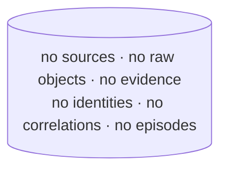

A worker started against this database is fine. A worker started against a database that is **behind** the code's Alembic head refuses to boot — `raise SystemExit` on any definite mismatch, including "no `alembic_version` table at all" (`backend/src/contextedge/workers/celery_app.py:83-139`). Otherwise workers would consume the normalize queue against a stale schema and corrupt ingestion mid-transaction.

### Stage 1 — a source is configured and discovered

An operator adds a ServiceNow source. Discovery decrypts the credentials (Fernet — a missing or placeholder key raises rather than minting a transient one, `backend/src/contextedge/services/source_service.py:17-48`), instantiates the connector, and upserts one `source_objects` row per readable table.

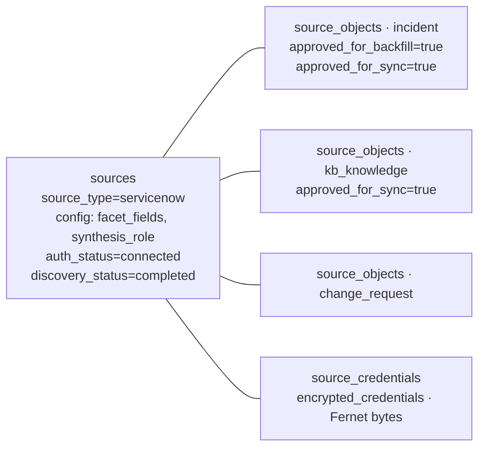

**Live** — `discover_source_objects` (`backend/src/contextedge/services/source_service.py:87-150`). Nothing is fetched until an object is approved: backfill requires `approved_for_backfill`, and the 15-minute Beat fan-out only picks up objects with `approved_for_sync=True` (`backend/src/contextedge/workers/sync_tasks.py:13-32`).

Seven connector types are registered — `teams`, `gmail`, `servicenow`, `jira_sm`, `manageengine`, `sapphireims`, `zoho_desk` (`backend/src/contextedge/connectors/registry.py:91-122`). `confluence`, `sharepoint` and `exchange` appear in the picker with status `planned` and no implementation.

### Stage 2 — raw objects land

The backfill runs under a Postgres advisory lock, so a second worker for the same object returns `skipped_locked` rather than racing the checkpoint (`backend/src/contextedge/services/sync_worker_service.py:379-395`).

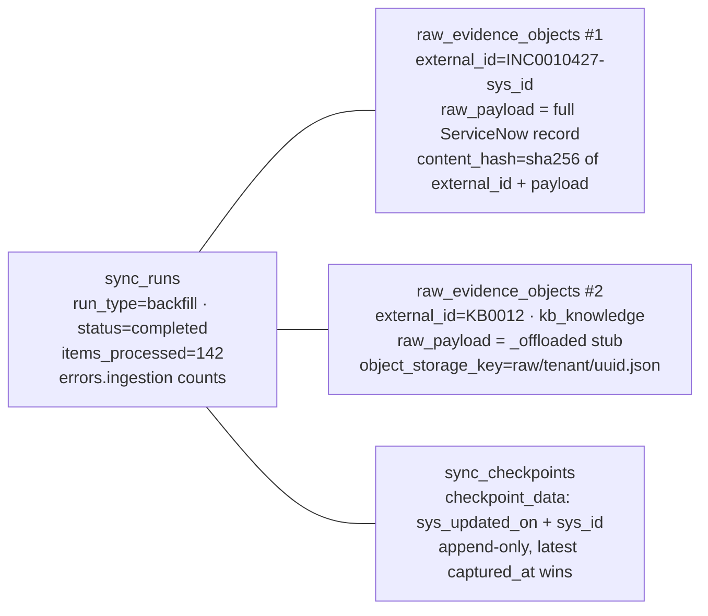

Two things happen here that shape everything downstream.

**The 32 KB rule.** If the serialized payload exceeds `OFFLOAD_THRESHOLD_BYTES = 32_768`, the JSON goes to MinIO at `raw/{tenant_id}/{raw_id}.json` and the database row keeps only `{"_offloaded": true, "size_bytes": N}` plus `object_storage_key` (`backend/src/contextedge/services/ingestion_persistence.py:16, 84-87`; `backend/src/contextedge/services/object_store.py:50-59`). The KB article above is exactly that case — a long article is the common offload.

> **Consequence you must carry into every query you write.** An offloaded row's `raw_payload` column holds a stub, not data. **Any SQL filter or backfill over `raw_evidence_objects.raw_payload` silently skips the biggest rows** — the longest conversations and the longest articles. Two live examples in the codebase: ingest-priority ordering reads `thread_count`/`resolution` out of `raw_payload` and therefore sorts every offloaded ticket to the back (`backend/src/contextedge/services/ingest_priority.py:76-95`), and reply-inheritance reconciliation explicitly skips offloaded rows (`backend/src/contextedge/workers/extraction_tasks.py:959-979`). The knowledge-state backfill was left undone for the same reason (`codewiki/KNOWN_GAPS.md:36`).

**The handoff ledger.** Normalize tasks are dispatched **after** the commit, so the dispatch itself can fail while the data is already durable. Ids that were not enqueued are parked on `source_objects.metadata_extra["pending_normalize_raw_ids"]`, the run flips to `failed` with an `errors["handoff"]` blob, and the next successful run re-drains the ledger (`sync_worker_service.py:301-376`).

### Stage 3 — evidence items

One `normalize_evidence` task per raw id turns each payload into a normalized `evidence_items` row. The full ordered pipeline is in [03_End_to_End_Project_Flow.md §3](03_End_to_End_Project_Flow.md); here is what lands in the graph.

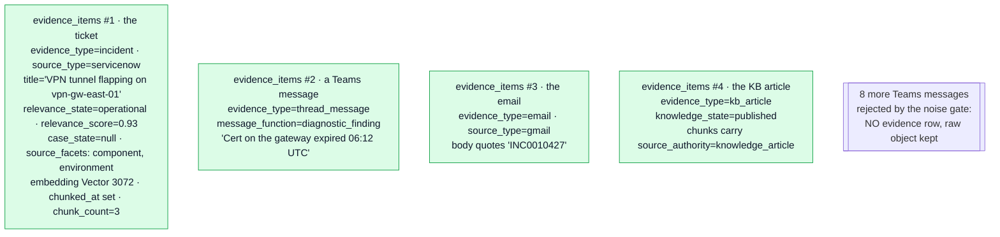

**Live.** Four derivations run at insert, all pure functions of the payload, no model calls:

| Column | Derived by | Rule for this example |
|---|---|---|
| `evidence_type` | `derive_evidence_type` (`backend/src/contextedge/services/evidence_typing.py:34-146`) | `("servicenow","incident") → incident`; `("servicenow","kb_knowledge") → kb_article`; every `hydrated_message` → `thread_message` |
| `knowledge_state` | `derive_knowledge_state` (`backend/src/contextedge/services/knowledge_lifecycle.py:48-130`) | the KB article's `workflow_state` → `published`. NULL means "the source did not say" and always serves |
| `case_state` | `derive_case_state` (`backend/src/contextedge/services/case_state.py:42-126`) | still NULL — the incident is open. It becomes `resolved` on the **re-ingest refresh path**, because closing a ticket does not rewrite its description |
| `source_facets` | `derive_facets` (`backend/src/contextedge/services/source_facets.py:38-85`) | config-mapped `{root_cause, component, environment, version, …}` from the source's `facet_fields` |

**The noise gate is why eight messages have no row.** For hydrated thread messages only, `message_noise_reason` returns `delivery_failure`, `quote_only`, `empty` or `coordination_only` before any model call (`backend/src/contextedge/services/message_filter.py:81, 174-206`). "Any update on the VPN?" dies as `coordination_only`: under `MIN_DIAGNOSTIC_CHARS = 150` with no technical signal across 15 regexes. "Restarted IPSec on vpn-gw-east-01, tunnel stable" survives at 28 characters, because a hostname is a technical signal. Measured on the live corpus: **47% of 18,907 messages rejected** (`message_filter.py:104-108`). The raw object is kept and `MESSAGE_FILTER_VERSION` travels with every rejection, so a rule change can re-judge every rejected message exactly.

**Scope is copied from the source at ingest**: `workspace_id` always, `domain_id` **only when the source has exactly one configured domain** — a multi-domain source leaves it NULL, which by graph convention means tenant-wide (`extraction_tasks.py:339-352`).

### Stage 4 — chunks

Long bodies become retrievable pieces. This is what closed the historical "8 KB cliff", where `embed_evidence(title, body[:8000])` made everything past ~8,000 characters invisible to semantic search.

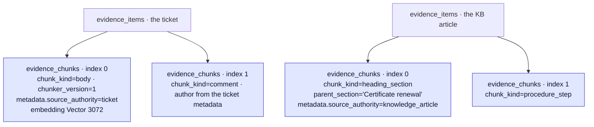

**Live** — `write_chunks` (`backend/src/contextedge/services/evidence_chunk_service.py:43-132`). Which chunker runs is decided by `get_chunker(source_type, evidence_type)` (`backend/src/contextedge/services/chunkers/registry.py:116-143`), and **record shape beats source type**: a `kb_article` goes to the heading-aware document chunker even when the source is a ticket system.

`source_authority` is likewise decided evidence-type first: knowledge types get `knowledge_article` regardless of source (`evidence_chunk_service.py:135-169`). That is precisely why Acme's "How the corporate VPN works" page carries knowledge authority instead of competing with `INC0010427` as if it were a ticket.

Small bodies (under 16 KB) from allowlisted sources are chunked **inline** inside the normalize transaction; everything else dispatches `extraction.chunk_evidence` to the dedicated `embedding` queue. Chunk embeddings run in batches of 32 and are **budget-gated and cost-attributed** — unlike the parent-evidence embedding, which passes no tenant context at its call site (`backend/src/contextedge/workers/chunk_tasks.py:133-191`; `extraction_tasks.py:65-71`).

**The queue exists because of a measured failure**: 1,879 chunks with 289 embedded (15%) while 309 embed tasks sat behind 10,226 normalizations. Nothing errored — the evidence was ingested and silently unretrievable (`backend/src/contextedge/workers/celery_app.py:259-268`).

### Stage 5 — identities

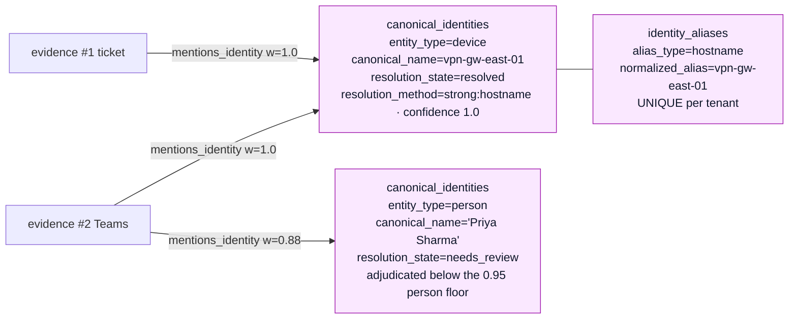

**Live** — `link_evidence_identities` (`backend/src/contextedge/services/identity_service.py:810-918`). Resolution runs in four layers with a cost gate in the middle:

1. **Strong identifier** — SQL lookup on `(tenant, alias_type, normalized_alias)`, confidence 1.0. `vpn-gw-east-01` is a single-token `device` name matching the hostname regex, so the normalizer promotes it to a `hostname` strong identifier — this exact string is the example in the code's own comment (`backend/src/contextedge/services/identity_normalizer.py:134-136`). After its first sighting it resolves here forever.
2. **Typed exact alias** — 0.95.
3. **Candidacy gate** — rejects facet types (`environment`, `version`, `vendor` belong in `source_facets`), unsupported types, and things that are not names (`backend/src/contextedge/services/identity_candidacy.py:65-196`). It sits below the free layers and above everything that costs a model call or a row: **identity work was 78% of all model spend before it existed**.
4. **LLM adjudication** — up to 5 candidates from substring tokens or pg_trgm similarity above 0.3, prompt `identity_adjudication` v2, schema-validated. Auto-links only at `AUTO_LINK_THRESHOLDS`: **person 0.95, everything else 0.9** (`identity_service.py:58-59`). Below threshold or on abstention it creates a **new identity in `needs_review`** — never a silent link, never a silent fork. That is why Priya sits at `needs_review` at 0.88.
5. **Provisional creation** at 0.5 for anything unmatched. A provisional identity linked by 2 to 5 distinct evidence items — the upper bound is a rarity guard against product-name hubs — flips to `resolved` at the exact moment it could first correlate anything (`backend/src/contextedge/services/identity_promotion.py:56-138`).

A daily Beat pass, `identity.reconcile_identities`, **proposes** merges into `identity_merge_proposals` and never performs them; rejections persist so the schedule never re-raises a declined pair (`backend/src/contextedge/services/identity_reconciliation_service.py:29-98`).

### Stage 6 — correlation: the case graph

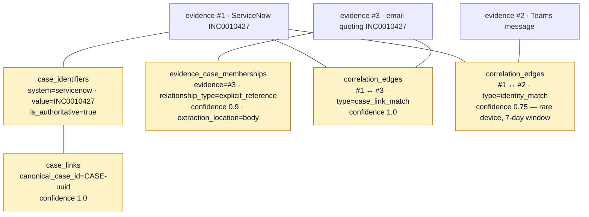

**Live** — `correlate_evidence_item` (`backend/src/contextedge/services/correlation_service.py:197-791`), on the dedicated `correlation` queue. Two tiers:

**Tier 1, confidence 1.0** — deterministic `(system, external_id)` keys: the record's own id, `{source}:thread` plus the thread id, ServiceNow reference fields (`problem_id`, `rfc`, `caused_by`, `parent_incident` — these share a namespace with the referenced records' own ids, so incident ↔ problem ↔ change correlate **regardless of ingestion order**), Jira linked issues, SapphireIMS related tickets, Zoho ticket numbers. CI and assignment-group references are deliberately **never** case-link keys, because shared infrastructure would mass-merge unrelated incidents (`correlation_service.py:116-194`).

**Tier 2, gated and scored** — identity co-occurrence. Only `resolved`/`verified`, active identities count. Degree statistics are computed before the link fetch, so hub identities never fan out: at or above `HUB_DEGREE_MIN = 200` an identity carries zero signal; at or below `RARE_DEGREE_MAX = 5` a non-person entity scores 0.75, otherwise 0.65, plus 0.1 when two or more non-hub identities are shared, capped at 0.85. A **single shared person is dropped entirely** (`correlation_service.py:36-88, 263-342`). The 7-day window fails **closed** when timestamps are missing.

**The conflicting-ticket veto**: if both items hold anchor case memberships in disjoint case sets, the identity correlation is deleted and `correlation.conflicting_ticket_veto` is logged — "same infrastructure, different incidents" (`correlation_service.py:344-404`).

**Ticket-number bridging** is what puts the email into the incident's case. Ticket sources register their human-readable number in `case_identifiers`; conversational sources extract ticket-shaped tokens and resolve-then-link into `evidence_case_memberships` (subject 0.98, body 0.9). Unknown tokens park in `pending_identifier_mentions` and reconcile the moment the ticket registers, so ingestion order does not matter. A message quoting three or more distinct cases becomes `mentioned_only` at 0.5, which the cluster resolver never expands through.

An edge is **created once and never upgraded**; when both tiers matched, the case-link tier wins.

### Stage 7 — episode reconstruction

Correlation dispatches `extraction.reconstruct_episode` with a **180-second countdown** when it created edges (`backend/src/contextedge/workers/correlation_tasks.py:39-52`). Six gates run before any model call, because episode synthesis was measured at **29% of all tokens with 71% of its output superseded**.

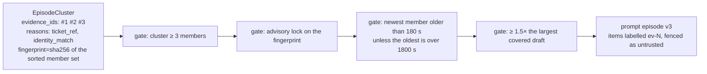

`resolve_episode_cluster` materializes the connected component over `case_links` and `correlation_edges` in both directions, bounded at `MAX_CLUSTER_SIZE = 50`, `MAX_HOPS = 3`, and a `CLUSTER_TIME_WINDOW` of 30 days from the **nearest** seed — correlation chains cannot drag in last quarter's ticket. Legal-hold and pending-redaction rows are fenced out **in SQL**, so they never enter a cluster at all (`backend/src/contextedge/services/episode_cluster_service.py:47-105`).

The resulting rows:

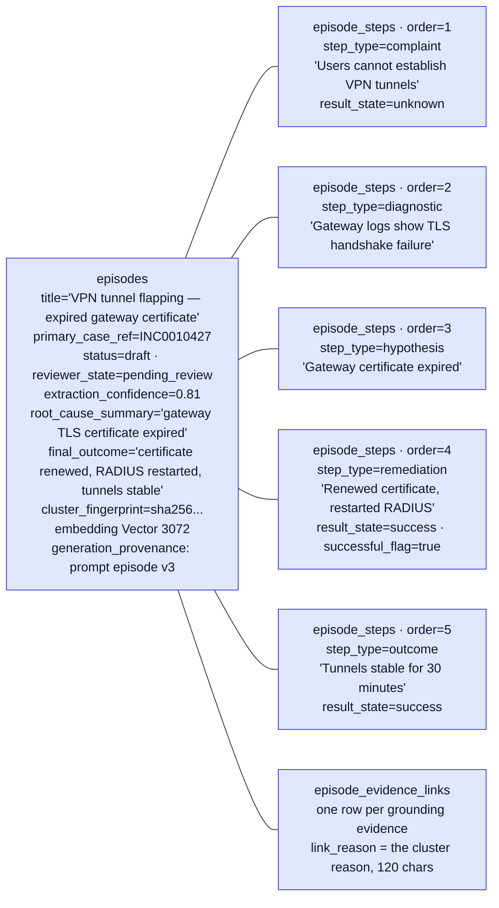

**Live** — `create_episodes_from_evidence` (`backend/src/contextedge/services/episode_service.py:114-333`).

The step vocabulary is fixed and validated: `STEP_TYPES` = complaint, diagnostic, hypothesis, action, observation, failed_step, remediation, escalation, outcome; `RESULT_STATES` = success, failure, inconclusive, unknown (`backend/src/contextedge/ai/extractors/episode_schema.py:22-33`). Unknown values do not fail the episode — an unknown `step_type` coerces to `observation`, an unknown `result_state` to `unknown`. The gate is **strict about structure, lenient about vocabulary**.

Three things make the grounding real rather than decorative:
- Evidence items are labeled `[ev-N]` in the prompt, and `_translate_refs` maps the labels back to real UUIDs, **dropping anything the model invented** — the model cannot mint an evidence reference (`backend/src/contextedge/ai/extractors/episode_extractor.py:77-89`).
- The whole evidence block is wrapped by `fence_untrusted`, because ticket and chat text is data, not instructions (`backend/src/contextedge/ai/fencing.py:13-28`).
- `generation_provenance` is stamped **after** the schema gate, so the model cannot supply its own (`episode_extractor.py:159-161`). It records prompt name, version, task, the routed model, and a `correlation_id` that joins to the `llm.usage` events.

Prompt `episode` **v3** is the default. Its contribution is field-level **source authority**: the ticket source is authoritative for state, priority and close code; monitoring for technical observations; working discussion for what was actually tried; email for external commitments; bot output is never authoritative (`backend/src/contextedge/ai/prompts/episode.py:162-260`). v1 and v2 remain registered and immutable as evaluation baselines.

> **Open P1 — do not gloss over this.** Clusters larger than 20 evidence items split into 2-3 model calls, and each chunk's steps are concatenated with all of them numbered from #1. The worst live case shows **319 steps**. Row-level fields (title, root cause, outcome) stay clean; only steps stack. 949 live episodes are affected, and 836 pending drafts were stamped on hold for repair (`codewiki/KNOWN_GAPS.md:464-478`).

### Stage 8 — review

`reviewer_state='pending_review'` queues the episode. A human `knowledge_manager` can:
- **Approve** — `POST /api/v1/episodes/{id}/approve` sets `status` and `reviewer_state` to `approved`, stamps `reviewer_user_id`, **commits**, and only then dispatches signature extraction and per-domain pattern clustering (`backend/src/contextedge/api/v1/episodes.py:230-277`). Commit-before-dispatch is deliberate: a message consumed before the commit would read pending state and no-op **without retry**.
- **Add or remove evidence** — endpoints update both the JSONB list and the normalized links.
- **Re-narrate** — `POST /api/v1/episodes/reconstruct` with `settle=False`, which bypasses the debounce, because an explicit request is not a duplicate.

**Optionally, AI review assists.** `settings.episode_ai_review` has exactly three values — `off` (default), `advisory`, `auto_approve` (`backend/src/contextedge/config.py:185-187`; `backend/src/contextedge/services/episode_review_service.py:40`).

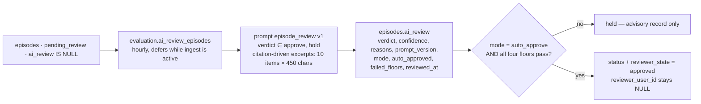

The floors are deterministic and the model cannot argue with them (`episode_review_service.py:42-44, 89-101`): at least **2** evidence ids, a stripped `final_outcome` of at least **20** characters, verdict exactly `approve`, and confidence at least **0.8**.

Mechanics worth knowing:
- `ai_review IS NULL` is the selection filter, so the sweep never pays twice for one draft. That column's "NULL means never reviewed" contract is load-bearing.
- Excerpt selection is **citation-driven**: evidence the steps cite first, then the chronologically last item (the fix confirmation lives at the end of a thread), then the first (the complaint). The first version sent a blind head+tail sample and held 100 of 100 drafts with "steps not supported by the provided evidence excerpts" — structurally true, because the cited evidence was never in the window.
- After the roughly 14-second model call the row is re-read `SELECT ... FOR UPDATE` with `populate_existing=True` (without which SQLAlchemy's identity map returns stale attributes and the check is vacuous). A concurrent human decision, a dedup supersede, or a twin sweep's stamp always wins, and the sweep records `skipped_state_changed`.
- Commit is **per episode, before any dispatch**. A batch-end commit made every verdict hostage to the last one; one deadlock cost 50 re-paid model calls.
- A provider outage persists **nothing** for that draft, so it stays retryable; five consecutive transients abort that tenant's batch.

**A pending draft is no longer invisible to the MAF agent.** `AGENT_VISIBLE_EPISODE_STATES` is `{"approved", "pending_review"}` (`backend/src/contextedge/graph/agent/hydrators.py:108`). The reviewer queue lags ingestion, so hiding drafts meant an agent could not see this week's outage while being asked about it. What keeps a draft from passing as vetted history: it gets its own two seed slots rather than competing for the three approved-episode ones (`UNAPPROVED_EPISODE_SEED_LIMIT`), its seed relevance is multiplied by `UNAPPROVED_SEED_RELEVANCE_FACTOR = 0.8` under a distinct `query_semantic_unapproved` reason so the discount shows up in a decision trace, and hydration prefixes its label with `[UNAPPROVED DRAFT]` and attaches an `agent_caveat` telling the agent to treat it as a lead to verify (`graph/agent/repository.py:111, 117, 372-384, 487-509`; `hydrators.py:110-116, 437-463`). `superseded` episodes stay out entirely — that is the state a merge gives the loser, and the corpus holds roughly nine times more of them than live episodes.

### Stage 9 — dedup keeps the graph from re-inflating

An hourly sweep merges duplicates across evidence, episodes, patterns and playbooks — reached from Beat, from the tail of every clustering run, and from `POST /api/v1/patterns/deduplicate` (`backend/src/contextedge/services/pattern_service.py:336-549`). It was scheduled because the passes were correct and called by nothing: the graph re-inflated from 643 to 2,869 pending drafts in one bulk-ingest night.

Four episode passes, in order:
- **By title**, but each title group is first **split into evidence-overlap connected components** via union-find. Title alone would merge different incidents that share a label.
- **Containment** — a strict subset is retired. No threshold to tune. Partial overlap deliberately never merges: on the measured ticket, 148 non-nested overlapping pairs were different problems sharing a ticket.
- **Semantic siblings** at cosine ≥ `SIMILAR_EPISODE_MIN_COSINE = 0.85` **that also share evidence**. Disjoint pairs at 0.85+ are exactly the recurrence case (Example 2) and are refused and counted — merging them would destroy that signal.
- Merges never hard-delete. `_merge_episode_into` repoints links and edges and sets `reviewer_state = "superseded"`. Steps deliberately stay with the duplicate, because moving them concatenated whole narrations.

---

## Example 2 — Acme VPN: recurrence, six months later

**Scenario.** In February, Acme's VPN gateway certificate expires and `INC0010427` closes with "renew certificate, restart RADIUS". In August, the renewed certificate expires again. A new ticket, a new cluster, a new episode — and the graph should say *"we have seen this exact shape before"* without merging the two incidents.

### Stage A — an approved episode gets a signature

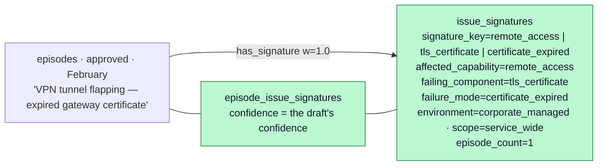

**Live, human-gated** — `extract_issue_signature` (`backend/src/contextedge/services/issue_signature_service.py:89-312`), task `evaluation.extract_issue_signature` on the `evaluation` queue. Four dispatch sites, all of which commit first: single human approve, bulk human approve, the AI review sweep after each auto-approval, and the sweep's bounded crash-recovery mop-up (limit 20 per sweep, scoped to auto-approvals so the pre-signature era is never surprise-backfilled).

The prompt is `issue_signature` v1 — the only version. Its system prompt demands short generic snake_case values and **forbids device names, hostnames, ticket numbers and people** (`backend/src/contextedge/ai/prompts/issue_signature.py:14-42`). A signature naming `vpn-gw-east-01` would never match the next occurrence, which is the entire point.

The schema gate is strict about structure and lenient about vocabulary (`issue_signature_service.py:47-73`): `affected_capability` and `failure_mode` are required; `environment` must be one of `production` / `corporate_managed` / `development` or it silently nulls; `scope` must be one of `single_device` / `multiple_devices` / `site_wide` / `service_wide`; confidence clamps to [0,1]. **A validation failure returns normally** with `invalid_draft` — so there is no Celery retry, and the episode has no signature until something re-dispatches.

The key is `slug(capability)|slug(component or "-")|slug(failure_mode)`, truncated at 240 characters, unique per tenant. Trigger, environment and scope are **descriptive, not identity** — the same failure triggered differently still recurs under one key (`issue_signature_service.py:76-86`).

### Stage B — August: the same key, a recurrence link

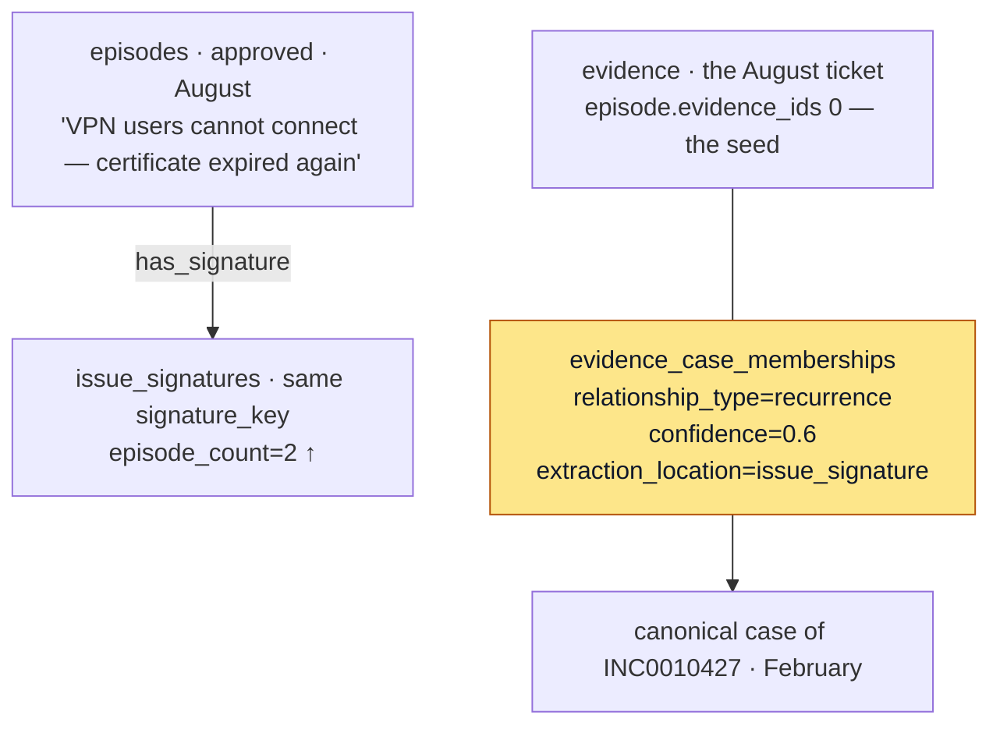

**Live** — `_link_recurrence` (`issue_signature_service.py:249-312`), which runs **only** when the signature already existed. It finds the most recent other episode on that signature, finds that episode's first active `primary_case` membership among its first 50 evidence ids, and adds a `recurrence` membership from the new episode's seed evidence to that case, at `RECURRENCE_CONFIDENCE = 0.6`. The write is idempotent, first-writer-wins.

> **The load-bearing invariant.** The episode cluster resolver explicitly refuses to expand through `recurrence` (and `mentioned_only`) memberships: `relationship_type.notin_(("mentioned_only", "recurrence"))` appears in both membership queries (`backend/src/contextedge/services/episode_cluster_service.py:158-193`). Recurrence means **"similar problem, never the same occurrence"**. It exists for precedent retrieval and for the agent's seed layer, not for merging clusters. The semantic-sibling dedup pass refuses the same pairs for the same reason (`backend/src/contextedge/services/episode_service.py:645-656`).

### The three "signature" concepts, and which are live

This is the part most readers conflate. They are three different tables answering three different questions:

| Concept | Question it answers | Status | Writer |
|---|---|---|---|
| **`error_signatures`** | "What is the exact log shape?" | **Live**, deterministic regex, runs on **every** evidence item at ingest — including ones the relevance gate skipped, since a confidently-irrelevant thread can still carry a pasted stack trace | `fingerprint_evidence` (`backend/src/contextedge/services/error_signature_service.py:176-260`), writing an `evidence -[exhibits]-> error_signature` edge at confidence 0.9 |
| **`issue_signatures`** | "What is the generalized problem?" | **Live, human-gated** — one LLM call per approved episode | `extract_issue_signature` (`issue_signature_service.py:157-208`) |
| **`fix_patterns`** | "What fix has worked for this signature, and how often?" | **Schema only.** The model, five readers, and a projection edge all exist. **Nothing constructs a `FixPattern` anywhere in the codebase** | none — verified by repo-wide grep; recorded at `codewiki/KNOWN_GAPS.md:10` |

Two consequences follow, and any doc that skips them is misleading:
- `IssueSignature.error_signature_id` is a real column with a real FK, and the materializer would project an `addresses` edge from it — but the only constructor never sets it (`issue_signature_service.py:168-177`). The deterministic and the generalized signature systems are **parallel and unjoined today**.
- Because nothing mints a `FixPattern`, the fix-applicability ladder, the cohort counters and the verification fix-outcome write-back are **dormant, not merely unexercised**. `CaseOutcomeFixPattern` has a writer (`backend/src/contextedge/services/case_outcome_service.py:239`) but nothing for it to reference.

### Where the recurrence chain is actually consumed

**Live** — the agent seed resolver treats issue signatures as their own seed layer: a full-text query over `affected_capability`, `failing_component`, `failure_mode` and `trigger_change` with underscores replaced by spaces (the slugs have to be de-slugged or nothing could match), tiebroken by `episode_count DESC`, limit 3 (`backend/src/contextedge/graph/agent/repository.py:270-308`). `issue_signature` is a hydratable node type and the episode ↔ signature hop is in the `maf.v1` traversal profile.

---

## Example 3 — Acme VPN: pattern, playbook, runtime selection

**Scenario.** Across several months, three approved episodes describe certificate-expiry failures on VPN infrastructure. The clustering pass notices the shape, synthesizes a `Pattern`, and the pattern auto-enqueues a playbook candidate that reads Acme's own certificate-renewal SOP.

### Stage A — pattern clustering

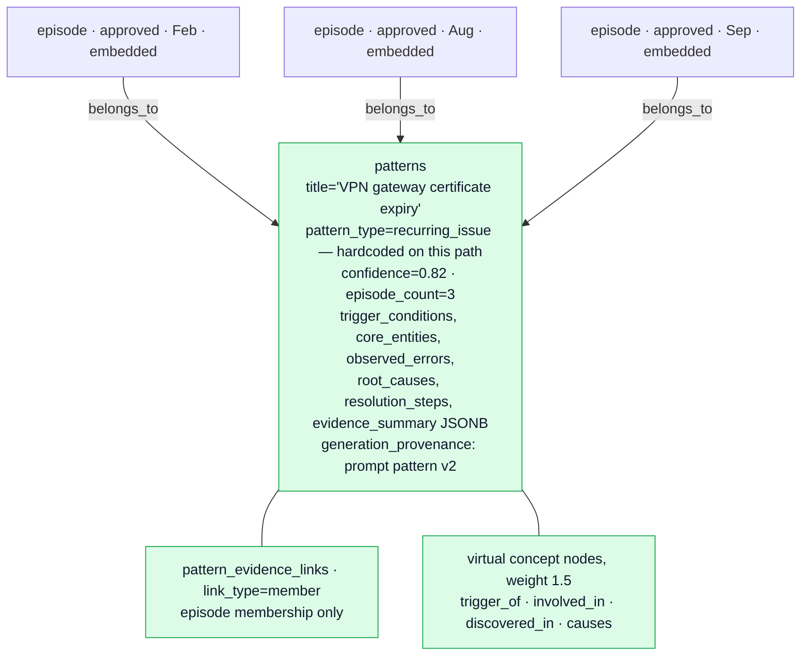

**Live, human-gated** — `_cluster` (`backend/src/contextedge/workers/pattern_tasks.py:153-417`) on the `pattern` queue.

**There is no Beat entry for clustering.** Verified by reading the whole `beat_schedule` (`backend/src/contextedge/workers/celery_app.py:281-384`). It is dispatched from three places: after human episode approve or bulk-approve, per affected domain (`api/v1/episodes.py:270-277, 330-337`); by the hourly AI review sweep, once per domain that had auto-approvals (`backend/src/contextedge/workers/evaluation_tasks.py:335-351`); and manually via `POST /api/v1/patterns/cluster`. Dispatching with `domain_id=None` clusters **only** NULL-domain episodes, which on a live graph is nothing — hence per-domain dispatch.

The loop, per candidate (limit 100 per run):
1. Repair embeddings on approved episodes that have none.
2. **Existing-pattern probe**: the pattern owning the single **nearest** member episode, provided that member is within `PATTERN_MATCH_MAX_DISTANCE = 0.30` (`pattern_tasks.py:50, 227-257`). The `ORDER BY` is the point and used to be missing — on this corpus every unlinked episode has *some* pattern member within 0.35, so an unordered `LIMIT 1` handed the validator an arbitrary pattern and it rejected almost all of them; ordering by distance took the accept rate from 12% to 40%. Then `validate_pattern_match` adjudicates. That call uses an **inline prompt, not the registry**, so `llm.usage` records NULL prompt name and version for it. It **fails open**: any exception returns `{"is_match": True, "confidence": 0.75}`, so during a provider outage the embedding probe alone decides membership (`backend/src/contextedge/ai/extractors/pattern_extractor.py:81-112`).
3. **New cluster** from same-scope approved unlinked episodes within `CLUSTER_GROUP_MAX_DISTANCE = 0.27` (`pattern_tasks.py:60, 299-317`); empty means a single-episode cluster, which is allowed — better a pattern than a silently dropped approved episode.
4. **Synthesis** with prompt `pattern` **v2** on `vertex_ai/gemini-2.5-flash`. There is **no Pydantic gate** on this output; fields are read with `.get()`. A returned title containing "no incident" / "no pattern" / "no operational pattern" / "no recurring pattern" skips persistence.
5. On any synthesis exception, a **fallback** pattern titled `"Auto: <episode title>"` at confidence 0.75 with no synthesized fields and NULL provenance.

Both distance thresholds were re-measured against the live corpus on 2026-08-19, and both are only meaningful relative to how this corpus is distributed: two randomly chosen approved episodes sit at p01 0.257 and median 0.409. Everything here is an AutomationEdge support incident, so the embeddings bunch and a threshold tuned on another corpus does not discriminate. 0.27 is the grouping knee — at 0.20, 126 of 150 probed episodes could group with nothing and became single-episode "patterns"; at 0.40 the corpus collapses into one blob (`pattern_tasks.py:36-60`).

Persistence asserts domain-safe membership: a domain-scoped episode may never enter a NULL-domain pattern, and a foreign-tenant id gets the same "does not exist" message as a missing one, so another tenant's data is never confirmed (`backend/src/contextedge/services/pattern_service.py:21-59`).

Two honest caveats. `PatternEvidenceLink.evidence_id` is **never populated** by this path — membership is episodes only. And a full 100-episode pass ran **25 minutes inside a single database transaction** with roughly 156 model calls; a late failure rolls back every row while the spend stays spent, and an operator watching the `patterns` table sees zero the whole time (`codewiki/KNOWN_GAPS.md:528-539`).

### Stage B — playbook candidate, generated with the tenant's own SOP in the prompt

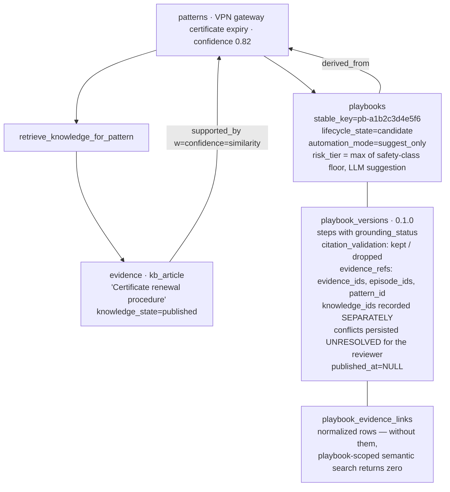

**Live** — `generate_playbook_candidate` (`backend/src/contextedge/workers/pattern_tasks.py:442-747`), enqueued by pattern creation and by membership growth — in both cases **after the transaction commits**, via `dispatch_after_commit` (`backend/src/contextedge/services/deferred_dispatch.py:72-95`; call sites `pattern_service.py:192-194, 245-247`). Dispatching inline failed both ways on live runs: a rolled-back clustering pass left 65 tasks naming patterns that never existed, and on the success path a worker reading before the commit landed returned `skipped`, so a real pattern silently never got its playbook.

**The retrieval step is the interesting part.** The query text is the **pattern's** vocabulary — title, description, and the root cause / title / outcome of up to 5 episodes, capped at 4,000 characters — not the incident title. "Laptop Wi-Fi not working" matches nothing; "Intel AX201 Code 10 driver rollback" matches the article. That is why this runs at pattern time rather than at ingest (`backend/src/contextedge/services/knowledge_retrieval_service.py:199-288`).

Then, in order (`knowledge_retrieval_service.py:291-418`):
- keep only `KNOWLEDGE_EVIDENCE_TYPES = {kb_article, sop, documentation}`;
- **withhold** anything whose `knowledge_state` is not current, counted and logged — a human retired it in their own system, and serving it ranked-last would override that decision. "No guidance exists" and "all of it is retired" are different answers;
- drop anything past `MAX_DISTANCE = 0.25`;
- re-rank **multiplicatively, never filtering**: empirical support (`proven` 0.80, `emerging` 0.92, `unproven` 1.0, `contested` 1.25 — absent is exactly neutral, because silence is not failure), an applicability penalty, and supersession at **1.6**, heavier than contested because a human reviewed it;
- truncate to `MAX_KNOWLEDGE_DOCS = 5`, attach up to `MAX_SECTIONS_PER_DOC = 6` sections each, flagging vision-read sections as `model_derived` so a paraphrase is never presented as the SOP's exact wording.

Documents that survive at similarity ≥ `KNOWLEDGE_LINK_MIN_SIMILARITY = 0.75` and without an applicability mismatch become durable `pattern -[supported_by]-> evidence` edges carrying `weight = confidence = similarity`. The 0.75 was **measured**: genuine pairs sat at 0.75-0.84 and vocabulary noise at 0.62-0.69, and `MAX_DISTANCE` is derived as `1 − 0.75` so "too weak to link" and "too weak to prompt" agree by construction.

An empty result renders as the literal string `"None found. Base the playbook on observed practice only."` so the model cannot invent normative sources to fill silence.

**Deterministic gates around the model** (`pattern_tasks.py:32-34, 63-92, 487-498, 600-619`):
- confidence floor 0.5, calibrated by reading 37 generated playbooks — below it the corpus was structured but hollow;
- risk floor from each step's `safety_class` (`read_only` → low, `low_side_effect` → medium, `high_side_effect`/`destructive` → high, unrecognised → high); the model may only **raise** it, and a missing or unrecognised model suggestion falls back to the floor but never below `medium`. Risk assessment is policy, not model output;
- empty-steps refusal — a steps-less result fails the task rather than minting an empty candidate. The motivating incident: a truncated response whose complete-looking prefix survived JSON repair and persisted a playbook with **zero steps**.

**The generation prompt is `playbook` v6** (`ai/prompts/playbook.py:362-423`). v6 keeps everything v5 said about what a step may claim and adds three rules about the procedure as a whole: sequence by causality, emit the minimal complete set of steps, and write them in plain friendly language for a tired on-call engineer. Its 2026-08-19 A/B won on economy (6.3 → 5.5 steps at roughly the same citation count), grounding (0.79 → 0.94) and language, with latency unchanged — and recorded an honest negative: the sequencing rule did not make branching more reliable, so branch validity is enforced structurally instead.

**Post-processing, in a fixed order** (`backend/src/contextedge/ai/generators/playbook_generator.py:90-95`): `validate_source_refs` translates only the labels actually shown and **drops minted citations**, recording `{kept, dropped}` on the version; `classify_step_grounding` is structural and not arguable — a step with surviving `source_refs` is `grounded`, a step without is **forced** to `non_grounded` / `best_practice` even if the model claimed otherwise; `sanitize_branching_logic` drops decision points that cannot execute (an anchor or target naming a step that does not exist, a jump back to its own anchor, both branches landing on the same step) and then removes jumps — never invents them — until no step is left unreachable, counting the drops onto `branching_validation` (`playbook_generator.py:154-252`); provenance is stamped last.

Repairing the branching rather than rejecting the whole playbook is a deliberate choice. An audit of 190 generated playbooks found 20 with branching defects — 39% of the 51 that branch at all — and in those the steps themselves were usually fine; only the `decision_points` appendix was junk. Failing the generation would have thrown away good work over a bad appendix.

Acme, concretely: the pattern retrieves the certificate-renewal SOP; the episodes show engineers renewing and restarting but never backing up the certificate; the generated playbook keeps the SOP's backup step, cites `[kb-1]`, and records the documented-versus-observed disagreement in `conflicts` for the reviewer rather than silently picking a side.

> **The manual route is not this route.** `POST /api/v1/playbooks/generate` calls the same generator but skips knowledge retrieval, the confidence floor, the risk floor, the empty-steps guard and `embed_playbook` — and its episode summaries omit ids, so every `ep-N` citation the model writes is dropped by `validate_source_refs` (`backend/src/contextedge/api/v1/playbooks.py:654-767`). It exists for patterns below the floor and for humans who disagree with the floor. Use it knowingly.

### Stage C — lifecycle and publication

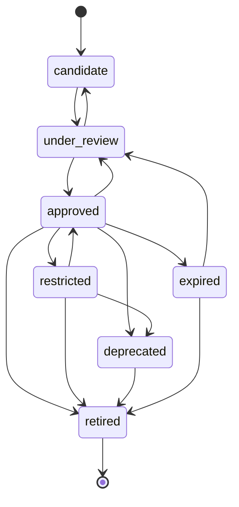

Transitions are validated against `VALID_TRANSITIONS` (`backend/src/contextedge/services/playbook_service.py:22-30`); an illegal jump raises `InvalidTransitionError`, and `retired` is terminal.

While a playbook is `under_review`, the contradiction scanner compares its steps against similar knowledge evidence. It is LLM-bearing, so it runs behind a three-gate funnel — top-K vector candidates (`DEFAULT_TOP_K_CANDIDATES = 20`), a scan cursor so a pair is never re-judged at the same version, and a lexical token-overlap check — all under `DEFAULT_SCAN_BUDGET = 1000` (`backend/src/contextedge/services/contradiction_service.py:49-330`). Per-pair outcomes land in `contradiction_scan_state`, so "we looked and it was fine" stays distinguishable from "we never looked".

`create_playbook_version` validates step-to-skill bindings, enforces semantic-version uniqueness with retries, writes normalized `playbook_evidence_links`, repoints `current_version_id` immediately, and emits `playbook.version_created` (`playbook_service.py:360-436`).

`automation_mode` is a separate axis from lifecycle. `suggest_only` means the playbook can be recommended but not executed. Only `tenant_admin` may change it — deliberately narrower than the right to edit the playbook, since automation mode is what makes every other approval gate load-bearing (`frontend/src/lib/roles.ts:22-56`).

### Stage D — runtime selection

A new VPN complaint arrives. `POST /api/v1/runtime/match` assembles a memory context, ranks approved playbooks, and returns results with a full score breakdown.

**The real scoring weights** (`backend/src/contextedge/search/hybrid_ranker.py:22-31`):

| Signal | Weight | What it measures |
|---|---|---|
| keyword | 0.25 | `search_playbooks_fts` rank, normalized to [0,1] |
| semantic | 0.30 | best distance from playbook-scoped chunk search → `max(0, 1 − d/2)`, then gated by keyword: `min(1, sem × (0.6 + 0.4 × keyword))` |
| graph_distance | 0.15 | edges touching the playbook, plus correlation edges between its evidence and this query's semantic hits |
| evidence_quality | 0.10 | `0.6 × playbook_confidence + 0.4 × min(hits/5, 1)` |
| identity | 0.05 | distinct `references_identity` edges to the query's resolved identities |
| recency | 0.10 | equals the freshness score |
| freshness | 0.05 | 0 if past `expiry_at`; else `max(0, 1 − days_since_validated/180)`; 0.5 if never validated |
| negative_penalty | −0.05 | contradiction edges plus domain negative-knowledge count |

Because `recency_score = freshness` (`hybrid_ranker.py:334`), freshness effectively carries 0.15.

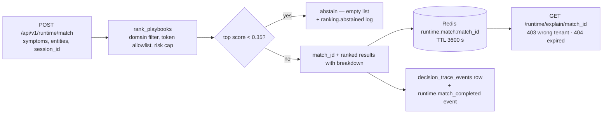

**Abstention is a feature.** Results below `MIN_RECOMMENDATION_SCORE = 0.35` are dropped, and when candidates existed but all fell below, `ranking.abstained` is logged with the top score. **An empty list means "no recommendation"** — that is the contract, not an error (`hybrid_ranker.py:168-171, 368-379`).

The risk cap comes from the caller's roles: admins uncapped, `knowledge_manager` and service accounts capped at `high`, everyone else at `medium` (`backend/src/contextedge/api/v1/runtime.py:42-52`).

### Stage E — execution, and what the ledger actually is

**Live, but caller-driven.** `execution_service` is a governed ledger, not an executor. `start_execution` evaluates the automation-mode cap and per-step `action_policies` (scope filter → specificity → conflict resolution, default `most_restrictive`, with an unknown verdict ranking most restrictive so a typo cannot read as `allowed_auto`), checks trust suspension, and assigns idempotency keys to side-effecting steps derived from the approved artifact hash scoped to the case. `request_approval` binds an approval to `artifact_version` / `artifact_hash` / `policy_snapshot` / `expires_at`, and `record_tool_invocation` re-checks both the hash and the duplicate key — refusing with **409, not 500**, because a duplicate replay and a stale binding are well-formed requests the state declines.

Every policy evaluation writes an append-only `policy_checks` row keyed to the policy **version**, including on the denial path (`backend/src/contextedge/services/policy_check_service.py:34`). Audit writes are fail-soft by design: the gate has already decided, and an audit failure must not turn an allowed action into a failed one.

> **There is no executor and no write-capable agent tool on this branch.** All six MAF tools are read-or-propose, and `execution_service` is driven by external callers (`codewiki/KNOWN_GAPS.md:34`). These controls are prerequisites, not live exposure.

### Stage F — the feedback loop that exists today

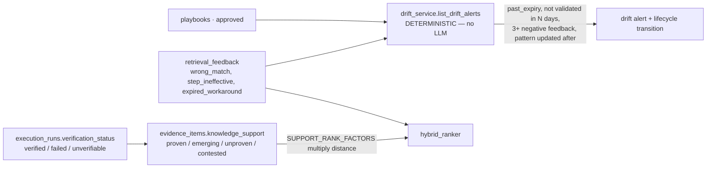

**Live.** Drift runs every 6 hours and is **entirely deterministic** — no model call. `list_drift_alerts` flags a playbook when it is past `expiry_at`, has not been validated in over 90 days, has 3 or more negative retrieval-feedback rows in the last 30 days, or its source pattern was updated after the playbook (`backend/src/contextedge/services/drift_service.py:13-81`). The alert snapshot is taken **before** `apply_expired_playbook_transitions` runs, so past-expiry playbooks still appear in the alerts.

Verification (`evaluation.verify_executions`, every 15 minutes) re-checks completed runs after the version's `recheck_after_sec` (`DEFAULT_RECHECK_AFTER_SEC = 1800`, floored at 300). **Absence passes only when the CI has actually produced an incident or alert within `OBSERVABILITY_LOOKBACK_DAYS = 30`**; otherwise the criterion is `not_observable` — "silence here is not evidence" — and the verdict is `inconclusive` (`backend/src/contextedge/services/execution_verification_service.py:56-70, 201, 325-370`). Runs that previously read `verified` on a silent CI now read `unverifiable` — that is the correction, not a regression, because those counters were being fed silence as success.

Verification verdicts refresh `evidence_items.knowledge_support`, which re-ranks knowledge retrieval multiplicatively (Stage B). That is the closed loop as it exists today: **outcomes adjust support levels, support levels adjust retrieval ranking, ranking shapes the next generated playbook.** The `FixPattern` counter loop drawn in older versions of this document is **schema only** — nothing mints the row it depends on.

---

## Additional scenario — AE Ops case lifecycle (MG22 DB Dump)

> **This is an additional scenario, not the canonical one.** It exists because it exercises the case-spine tables from migration `0029` — `resolution_sessions` case columns, `case_state_transitions`, `case_outcomes`, `claims`, `action_policies`, `approval_requests`, `execution_step_runs` — which the Acme VPN thread does not touch. Read Examples 1-3 first.

**Scenario.** Business user `abc@xyz` reports: *"I did not receive my MG22 output today."* This is the AutomationEdge Ops `output_not_received` use case.

### Stage 1 — catalogue entities

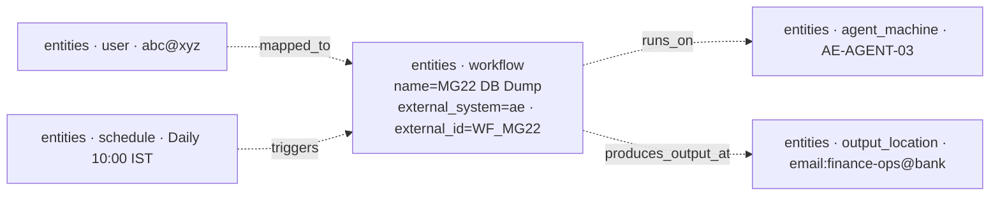

**Live.** `entities` rows carry an `(entity_type, external_system, external_id)` natural key, and `graph_edges` carry temporal validity (`valid_from` / `valid_to`), so "this user owned this workflow on the incident date" is a valid query. `edge_valid_at(as_of)` supplies the predicate (`backend/src/contextedge/graph/temporal.py:29-36`).

> **`as_of` caveat.** Historical edges combine with **current** node facts. The agent projection says so in an explicit warning, and callers must not draw historical operational conclusions from a point-in-time projection (`backend/src/contextedge/graph/agent/selector.py:236-242`; `codewiki/KNOWN_GAPS.md:66`).

### Stage 2 — case opened

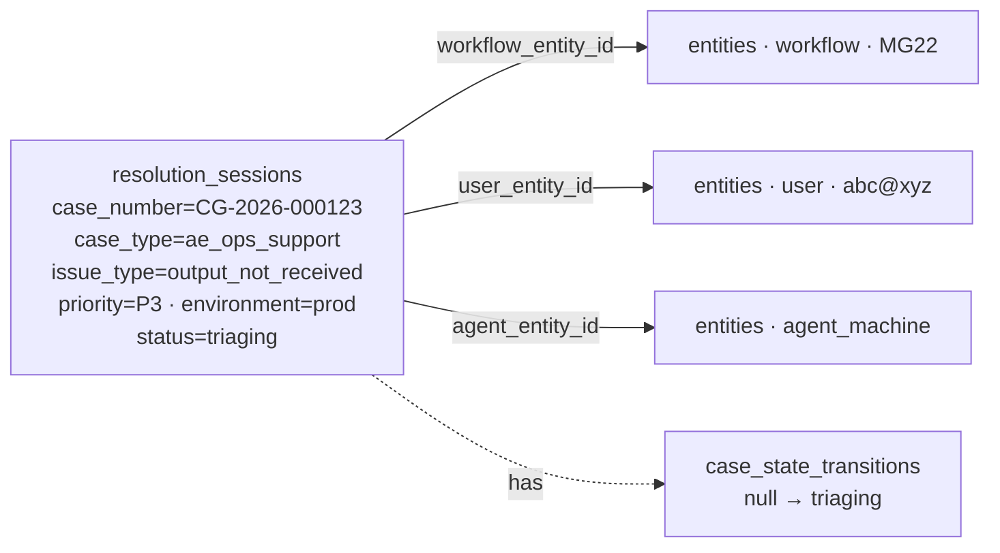

**Live** for the row and the transitions — `case_outcome_service` writes `CaseOutcome` and `CaseStateTransition` (`backend/src/contextedge/services/case_outcome_service.py:161`). The case-spine columns are all nullable for back-compat and are populated by AE/ServiceNow ingestion or graduated from the older `entities[]` JSONB during an enrichment pass (`backend/src/contextedge/models/session.py:48-56`).

### Stage 3 — evidence and claims

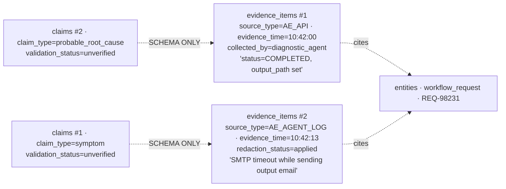

`evidence_time` (the **subject** time, 10:42) is distinct from `ingested_at` (when the graph stored it) and from `created_at_source`.

**Live**: `claims` rows — `claim_service` constructs them (`backend/src/contextedge/services/claim_service.py:77`).
**Schema only**: `claim_evidence` and `decision_claims`. Nothing links a claim to its evidence or to a decision, and nothing moves a claim past `unverified`, so the `VALIDATION_STATUSES` lifecycle is currently unreachable (`codewiki/KNOWN_GAPS.md:11`). The dotted edges above are drawn as design intent, not as rows you will find.

### Stage 4 — decision, approval, execution

```mermaid
graph LR
  D[decisions<br/>decision_intent=recommendation<br/>risk_level from the SELECTED option only<br/>policy_result = strictest action-policy verdict]
  O1[decision_options #1 · rerun_workflow · selected=false]
  O2[decision_options #2 · resend_existing_output · selected=true]
  AP[action_policies<br/>action_name=rerun_workflow · environment=prod<br/>verdict=approval_required]
  AR[approval_requests<br/>artifact_version + artifact_hash + policy_snapshot<br/>expires_at · status=approved]
  ESR[execution_step_runs<br/>idempotency_key derived from the artifact hash + case<br/>status=completed]
  TI[tool_invocations · ae.resend_output · success]
  PC[policy_checks<br/>append-only, keyed to the policy VERSION<br/>records the DENIAL path too]

  D -- considered --> O1
  D -- chose --> O2
  D -- applied_policy --> AP
  D -- required_approval --> AR
  AR --- ESR
  ESR --- TI
  AP -.-> PC
```

**Live.** `Decision.policy_result` carries the run's strictest verdict; NULL means "no rule existed", which is distinct from `allowed_auto`. The idempotency key is live as of the F8 work: derived from the approved artifact hash scoped to the case, assigned only to side-effecting steps, skipped-and-recorded on a duplicate, and refused again at `record_tool_invocation` (`codewiki/KNOWN_GAPS.md:20`).

**Residual to state honestly**: separation of duties is enforced only on the initiator ↔ approver axis via `forbid_self_approval`, never recommender ↔ approver; `recommended_by`, `sod_check_status`, `sod_violation_reason`, `approval_channel` and `approval_note` remain unwritten (`codewiki/KNOWN_GAPS.md:12`).

### Stage 5 — outcome

```mermaid
graph LR
  CO[case_outcomes<br/>outcome_status=resolved<br/>confirmed_root_cause='SMTP relay timeout'<br/>successful_action=resend_existing_output<br/>failed_actions=[] · user_confirmed=true<br/>mttr_minutes = closed_at − started]
  CASE[resolution_sessions · closed]
  TR2[case_state_transitions · monitoring → closed]
  ES[error_signatures · SMTP timeout shape<br/>LIVE — deterministic regex at ingest]
  FP[fix_patterns<br/>SCHEMA ONLY — no constructor exists]

  CO -- case_id --> CASE
  CASE -. has .-> TR2
  CO -. would increment .-> FP
```

**Live**: `case_outcomes`, `case_state_transitions`, `error_signatures`.
**Schema only**: `fix_patterns`. `CaseOutcomeFixPattern` has a writer, but nothing mints the `FixPattern` it references, so that write is unreachable in practice. Until Epic B populates it, MTTR and first-time-right numbers derived from a fix-pattern counter are **not measurable** from this system.

---

## Retention defaults

Sources: `backend/src/contextedge/services/retention_service.py`, `backend/src/contextedge/services/memory_service.py`, `backend/src/contextedge/workers/retention_tasks.py`, `backend/src/contextedge/config.py`.

| Knob | Default | Where set |
|---|---|---|
| `retention_days` (base) | The scheduled task resolves the newest active `TenantPolicy(policy_type="retention")` `config.retention_days`, and falls back to **`settings.retention_default_days = 365`** | `workers/retention_tasks.py:38-65`; `config.py:217-219` |
| Short-term window | `base` days | `memory_retention_windows()` (`services/memory_service.py:64-71`) |
| Reasoning window | `max(base × 3, 90)` days | same |
| Long-term window | `max(base × 6, 180)` days | same |
| Archive grace (archive → purge) | **30 days** | `DEFAULT_ARCHIVE_GRACE_DAYS` (`services/retention_service.py:66`) |
| Scheduled purge mode | **`soft_purge`** — `hard_delete` is opt-in | `settings.retention_purge_mode` (`config.py:212-215`) |
| Purge limit per tick | 1,000 rows, oldest-first | `purge_archived_evidence(limit=…)` (`services/retention_service.py:177-196`) |
| Legal-hold items | **Always excluded** from archive and purge — in the SQL `WHERE`, never post-filtered | `evidence_filters.exclude_legal_hold()` |

> Two corrections to older versions of this table: `retention_days` **does** have an effective default now (the scheduled path supplies 365 when no policy exists), and the scheduled purge default is **`soft_purge`**, not `hard_delete`.

### Memory-class assignment (`classify_evidence_memory_class`)

- `evidence_type ∈ {kb_article, sop, documentation}` → **long_term**
- `canonical_entity_refs.identities` populated → **long_term**
- everything else → **short_term**

`reasoning` is a class used for decision and execution material in the runtime memory context; evidence classification only ever yields short or long (`memory_service.py:73-79`).

### Worked example (base 365, the deployment default)

| Memory class | Window |
|---|---|
| short_term | 365 days |
| reasoning | 1,095 days (`max(365 × 3, 90)`) |
| long_term | 2,190 days (`max(365 × 6, 180)`) |
| then archived | +30 days grace |
| then purged | `soft_purge` by default |

Acme, concretely: the `INC0010427` evidence carries resolved identities, so it is `long_term` and archives after 2,190 days. A drive-by Teams message with no identities archives after 365.

### Soft purge vs hard delete

- **`soft_purge`** (the scheduled default) keeps the row and its FK targets but scrubs content: NULLs `embedding`, `body_text`, `body_summary`, `canonical_entity_refs` (extracted person and service names in clear text) and `raw_object_ref` (so the object-store blob can be lifecycle-reaped and a re-ingest cannot rehydrate it), and sets `title = "[purged]"`. It then **explicitly deletes the evidence's `evidence_chunks` rows** — chunks carry the same content and the same embeddings, and the hard-delete FK cascade does not apply when the parent row survives (`retention_service.py:212-242`).
- **`hard_delete`** removes the `evidence_items` row entirely. Cascades clean up `attachment_artifacts`, `correlation_edges` and `contradiction_scan_state`. `playbook_evidence_links.evidence_id` is `ON DELETE SET NULL` rather than `CASCADE`, so the audit record — "this playbook version was built with support from evidence that has since been removed" — survives.

### The daily orphan sweep

`evaluation.cleanup_hard_deleted_evidence` reaps what hard delete deliberately leaves: `raw_evidence_objects` rows and their MinIO blobs that no `evidence_items.raw_object_ref` references (there is no FK), and `graph_edges` whose evidence endpoint no longer exists (edge node ids are plain UUIDs, also with no FK). Blob-delete failures leave the DB row in place so the next sweep retries. **Attachment blobs are a documented stub returning 0** — once the rows are gone, a DB scan cannot find them; run an S3 lifecycle rule on the `artifacts/` prefix instead (`backend/src/contextedge/workers/cleanup_tasks.py:50-223`).

**Caveat that still stands**: offloaded raw payloads for *live* evidence have no TTL or garbage collection in code. Blob retention for those depends on an external bucket lifecycle rule (`codewiki/KNOWN_GAPS.md:222`).

---

## Where to go next

| If you want to … | Read |
|---|---|
| The prose pipeline walkthrough | [03_End_to_End_Project_Flow.md](03_End_to_End_Project_Flow.md) |
| The same flows as diagrams | [15_Project_Flow_Diagrams.md](15_Project_Flow_Diagrams.md) |
| Understand the full pipeline narratively | [codewiki/01-end-to-end-pipeline.md](../codewiki/01-end-to-end-pipeline.md) |
| Dive into episode reconstruction internals | [codewiki/07-episodes-patterns-playbooks.md](../codewiki/07-episodes-patterns-playbooks.md) |
| See how `graph_edges` adjacency works | [codewiki/09-graph-and-correlation.md](../codewiki/09-graph-and-correlation.md) |
| Read the chunker strategy table | [codewiki/CHUNKING_DESIGN.md](../codewiki/CHUNKING_DESIGN.md) |
| Read the AE Ops alignment design notes | [codewiki/17-ae-ops-context-graph-alignment.md](../codewiki/17-ae-ops-context-graph-alignment.md) |
| Run it locally, or start workers correctly | [RUNBOOK.md](RUNBOOK.md) |
| Look up an HTTP route | [API.md](API.md) |
| Check what is not finished before you claim it works | [codewiki/KNOWN_GAPS.md](../codewiki/KNOWN_GAPS.md) |
