# Context Graph Walkthrough

A visual, stage-by-stage tour of what's in the ContextEdge graph at each pipeline step, using concrete examples. Read this end-to-end if you want to see how an empty database becomes operational memory.

> **Documentation map**
> - [TECHNICAL_BLUEPRINT.md](TECHNICAL_BLUEPRINT.md) — architecture and data model reference
> - [MIGRATIONS.md](MIGRATIONS.md) — schema revision history including `0029_ae_ops_concept_alignment`
> - [API.md](API.md) — HTTP route surface
> - [codewiki/01-end-to-end-pipeline.md](../codewiki/01-end-to-end-pipeline.md) — narrative pipeline overview
> - [codewiki/17-ae-ops-context-graph-alignment.md](../codewiki/17-ae-ops-context-graph-alignment.md) — engineering narrative for `0029`

---

## Contents

- [Example 1 — AE Ops case lifecycle (MG22 DB Dump)](#example-1--ae-ops-case-lifecycle-mg22-db-dump): the design's flagship use case, end-to-end through the new `0029` tables.
- [Example 2 — Episode reconstruction (Acme VPN outage)](#example-2--episode-reconstruction-acme-vpn-outage): how scattered Jira + Teams + ServiceNow evidence becomes a single `Episode` with ordered `EpisodeStep` rows.
- [Example 3 — Pattern emergence (recurring SMTP timeout)](#example-3--pattern-emergence-recurring-smtp-timeout): how five closed cases get aggregated into one `Pattern` and an `ErrorSignature` with success counters.
- [Example 4 — Playbook lifecycle and runtime selection](#example-4--playbook-lifecycle-and-runtime-selection): `candidate → under_review → approved`, version publishing, runtime ranking.
- [Retention defaults](#retention-defaults): what the windows are, where they're set, what `0029` did and didn't change.

Diagrams use Mermaid; if your renderer doesn't support it, the prose under each diagram describes the same shape.

---

## Example 1 — AE Ops case lifecycle (MG22 DB Dump)

**Scenario.** Business user `abc@xyz` reports: *"I did not receive my MG22 output today."* This is the design doc's flagship `output_not_received` use case. Every node and edge that appears below is queryable via the schema landed in migration `0029`.

### Stage 0 — empty graph

Right after `make migrate`, before any seed or ingest. Schema exists, no rows.

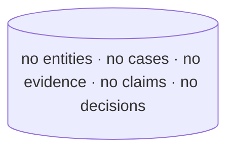

### Stage 1 — AE catalogue ingest

Connector (or `make seed`) populates `entities` rows for the AutomationEdge catalogue. Edges in `graph_edges` carry temporal validity (`valid_from`/`valid_to` from `0029`) so "this user owned this workflow on the incident date" is a valid query.

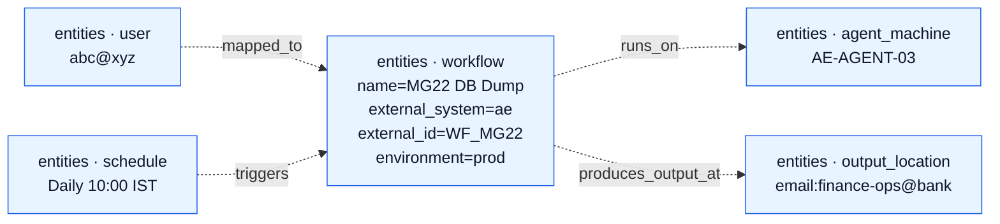

### Stage 2 — user complaint → case opened

Triage agent creates a `resolution_sessions` row. The case spine columns from `0029` (case_number / case_type / issue_type / priority / severity / environment + four entity FKs) are populated structurally instead of stuffed into the existing `entities[]` JSONB.

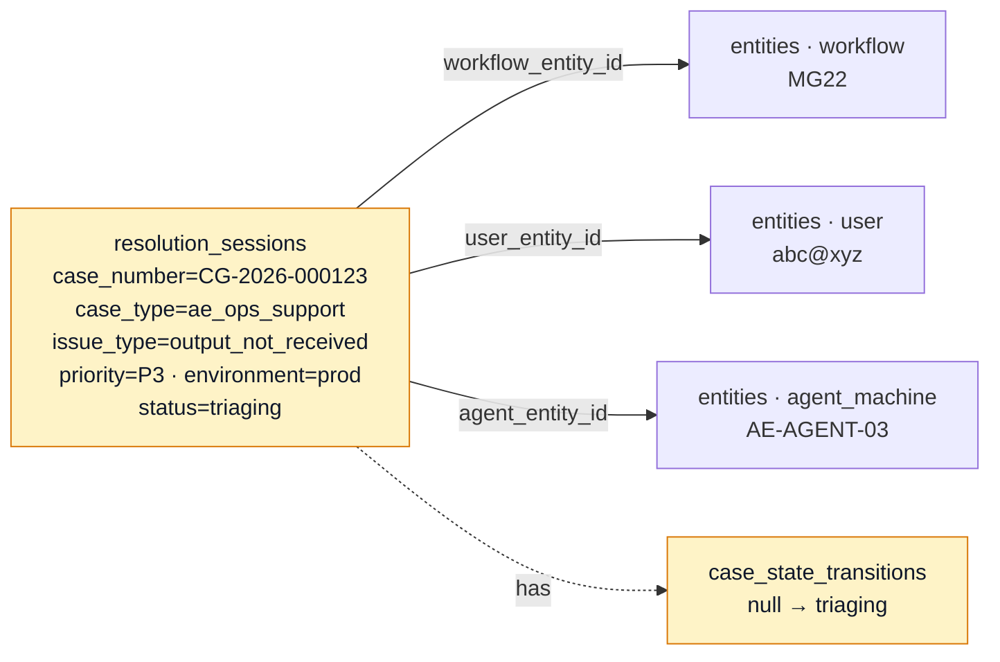

### Stage 3 — evidence collected

Diagnostic agent fetches AE request status + a 60-second log window. Two `evidence_items` rows land — both with the new lineage columns from `0029` (`source_type`, `evidence_time`, `collected_by`, `redaction_status`).

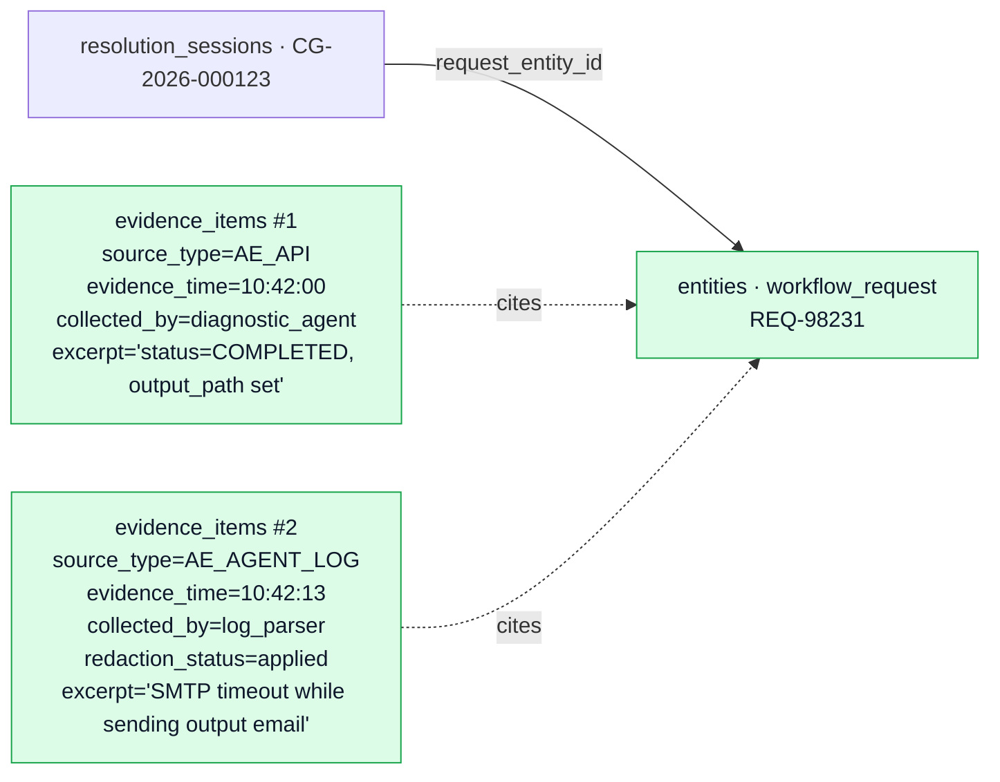

`evidence_time` (the *subject* time, 10:42) is distinct from `ingested_at` (when the graph stored it, ~30s later) and from the existing `created_at_source`.

### Stage 4 — claims formed

Diagnostic agent posts `context.create_claim` against each piece of evidence. The relational claim → evidence trail is the spine that didn't exist before `0029`.

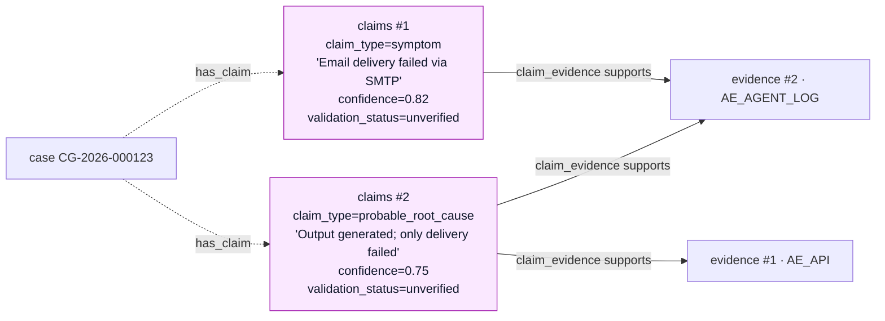

`validation_status='unverified'` blocks high-risk remediation per the design's Section 27.3 rule.

### Stage 5 — decision created with options

Remediation planner queries `error_signatures` (matches `SMTP_TIMEOUT_AFTER_OUTPUT_GENERATED`) and `fix_patterns` (returns "resend existing output"). Creates a `decisions` row with two options, then checks `action_policies`.

```mermaid
graph LR
  D[decisions<br/>decision_intent=recommendation<br/>decision_summary='Resend existing output, do not rerun'<br/>risk_level=medium<br/>policy_result=approval_required]
  O1[decision_options #1<br/>action=rerun_workflow<br/>risk_level=high<br/>selected=false<br/>rejection_code=duplicate_output_risk]
  O2[decision_options #2<br/>action=resend_existing_output<br/>risk_level=medium<br/>selected=true]

  ES[error_signatures<br/>SMTP_TIMEOUT_AFTER_OUTPUT_GENERATED<br/>success_count=2 · failure_count=0<br/>confidence=0.85]
  FP[fix_patterns<br/>issue_type=output_not_received<br/>recommended_fix='Resend without rerun'<br/>success_count=2]
  AP[action_policies<br/>action_name=rerun_workflow<br/>environment=prod<br/>policy_result=approval_required<br/>required_approver_roles=[Finance Process Owner]]

  C2[claim · probable_root_cause]

  D -- decision_evidence --> C2
  D -- considered --> O1
  D -- chose --> O2
  D -- applied_policy --> AP
  D -- based_on --> ES
  D -- based_on --> FP

  classDef new fill:#fef3c7,stroke:#d97706,color:#0f172a;
  classDef ext fill:#fae8ff,stroke:#a21caf,color:#0f172a;
  class D,O1,O2,ES,FP,AP new;
  class C2 ext;
```

`Decision.policy_result = approval_required` is the **verdict** the executor checks (new column in `0029`). The `decision_evidence` link table replaces the loose JSONB cache for query-by-evidence.

### Stage 6 — approval gated

HITL agent emits a Teams adaptive card. Approver clicks Approve. `approval_requests` carries the new role / channel / SoD columns from `0029`.

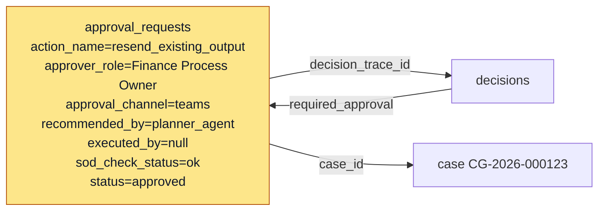

`recommended_by ≠ approved_by ≠ executed_by` is the SoD check — three different actors, three columns now distinct.

### Stage 7 — action executed (idempotent)

Executor agent runs the resend. `execution_step_runs` carries the new `idempotency_key` so a retried orchestrator call can't double-send.

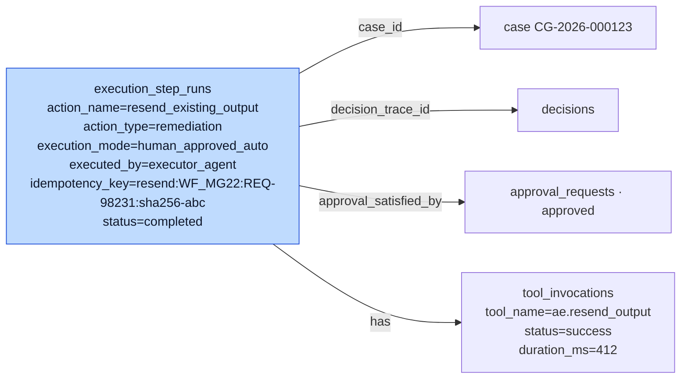

The partial unique index `WHERE idempotency_key IS NOT NULL` blocks the duplicate at insert time. NULL keys (read-only steps) stay unconstrained.

### Stage 8 — outcome recorded → counters updated

User confirms receipt. `case_outcomes` is written; `fix_patterns` and `error_signatures` counters tick up.

```mermaid
graph LR
  CO[case_outcomes<br/>outcome_status=resolved<br/>confirmed_root_cause='SMTP relay timeout'<br/>successful_action=resend_existing_output<br/>failed_actions=[]<br/>user_confirmed=true<br/>mttr_minutes=42<br/>should_create_or_update_pattern=true]

  CASE[case CG-2026-000123<br/>status=closed]
  TR2[case_state_transitions<br/>monitoring → closed]

  ES[error_signatures<br/>success_count=3 ↑<br/>confidence=0.88 ↑]
  FP[fix_patterns<br/>success_count=3 ↑<br/>last_used_at=2026-04-27]

  CO -- case_id --> CASE
  CASE -. has .-> TR2
  CO -. increments .-> ES
  CO -. increments .-> FP

  classDef new fill:#bbf7d0,stroke:#15803d,color:#0f172a;
  class CO,TR2,ES,FP new;
```

`mttr_minutes = closed_at − opened_at`. `successful_action` feeds the `FixPattern` counter so the next `output_not_received` case ranks this fix higher.

### Final shape — what's in the graph after one case closes

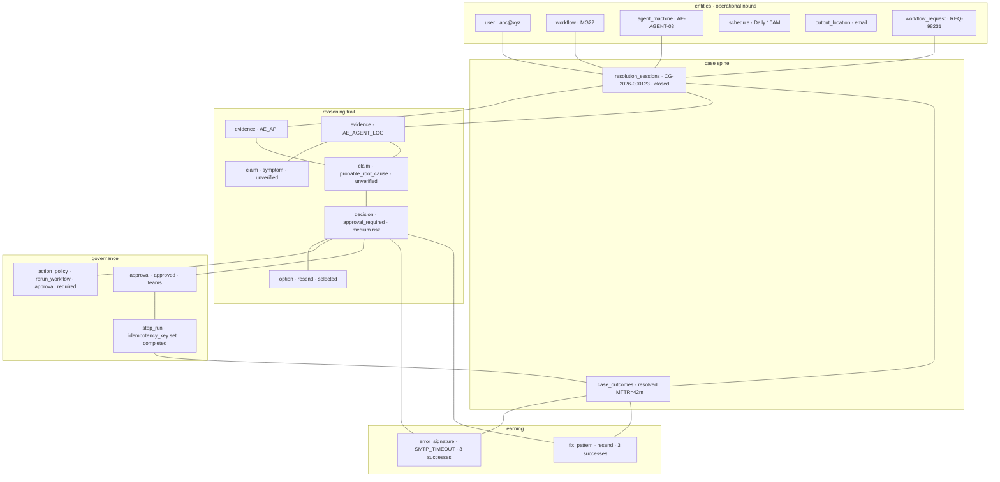

Every node in `case` / `reasoning` / `governance` / `learning` is a column or table that did not exist before `0029`. The `entities` block is also new.

---

## Example 2 — Episode reconstruction (Acme VPN outage)

**Scenario.** Acme Corp engineer files Jira `INC-4471` after the East-coast VPN gateway starts dropping connections. Over the next 90 minutes, two more Jira tickets, a Teams thread between three engineers, and a ServiceNow change record all reference the same incident. The Episode reconstructor pulls these five evidence items into a single ordered story with a root cause and a confirmed fix.

`Episode` and `EpisodeStep` are existing tables (live since `0001_initial`). They model **operational stories**, not specific support cases — distinct from the `resolution_sessions`/`case_outcomes` spine added by `0029`. An Episode aggregates evidence across systems; a case is a specific incident a user opened.

### Inputs — five evidence items in five hours

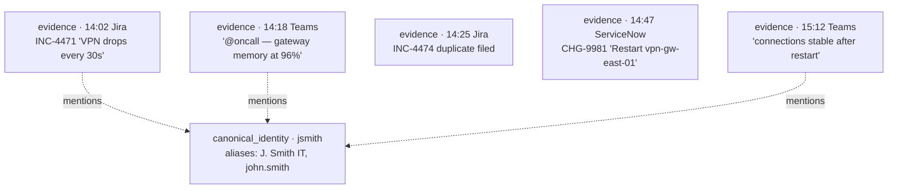

### Reconstruction — Episode + ordered steps

The `episode_extractor` worker reads correlated evidence (joined via `correlation_edges` and `evidence_identity_links`) and emits a draft `Episode` with ordered `EpisodeStep` rows. Each step is one of `observation` / `hypothesis` / `action` / `verification`.

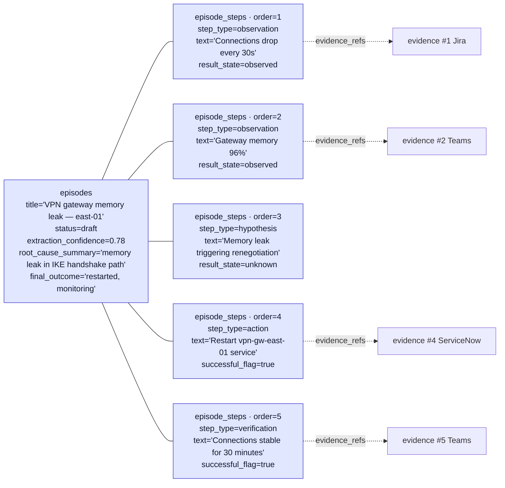

### What governance does next

`reviewer_state='pending_review'` queues the Episode in the reviewer console. A human SRE either:
- **Approves** the Episode → it becomes eligible for Pattern aggregation (Example 3).
- **Rejects** with a `feedback_code` → reconstruction is filed as a learning signal but no Pattern emerges.
- **Edits** the steps → an updated draft is re-queued.

`Episode.embedding Vector(3072)` lets the reconstructor find similar past episodes during extraction, which is how a brand-new VPN ticket can immediately surface "we've seen this shape before".

### Episode vs case (when to use which)

| Concept | Driven by | Lifetime | Outcome shape |
|---|---|---|---|
| `Episode` (existing) | Evidence reconstruction | Spans systems and time | `final_outcome` text + `root_cause_summary` |
| `ResolutionSession` + `CaseOutcome` (case spine, `0029`) | A user opening a support case | One incident, one user | Structured `outcome_status` + `successful_action` + counters |

Both can reference the same evidence; they answer different questions.

---

## Example 3 — Pattern emergence (recurring SMTP timeout)

**Scenario.** Over six weeks, five different cases close with the same root cause: SMTP relay timeout after the workflow has already generated its output file. The first three are MG22 (finance), the next is RR07 (risk reporting), and the last is OPS31 (ops audit). The Pattern aggregator notices the shape and emits a single `Pattern` plus an `ErrorSignature` row that any future case can match against.

### The five source cases (closed)

| Case | Workflow | Successful action | Closed at |
|---|---|---|---|
| CG-2026-000089 | MG22 | resend_existing_output | 2026-03-12 |
| CG-2026-000101 | MG22 | resend_existing_output | 2026-03-21 |
| CG-2026-000123 | MG22 | resend_existing_output | 2026-04-27 |
| CG-2026-000128 | RR07 | resend_existing_output | 2026-04-29 |
| CG-2026-000131 | OPS31 | resend_existing_output | 2026-05-02 |

Each case has a `case_outcomes` row with `successful_action='resend_existing_output'` and `should_create_or_update_pattern=true`. The Pattern worker (`workers/pattern_tasks.py`) sweeps cases periodically.

### What the worker creates

```mermaid
graph TD
  P[patterns<br/>title='SMTP relay timeout post-generation'<br/>pattern_type=recurring_issue<br/>episode_count=5<br/>confidence=0.86<br/>contradiction_score=0.0<br/>freshness_score=0.95<br/>observed_errors=['SMTP timeout', 'Could not connect to SMTP relay']<br/>root_causes=['SMTP relay unavailable', 'mail gateway throttling']<br/>resolution_steps=['confirm output exists', 'retry email step', 'do not rerun workflow']]

  ES[error_signatures<br/>signature_key=SMTP_TIMEOUT_AFTER_OUTPUT_GENERATED<br/>display_name='SMTP timeout after output generated'<br/>success_count=5<br/>failure_count=0<br/>confidence=0.92<br/>recommended_actions=['resend_existing_output', 'verify_smtp_relay']<br/>risk_notes=['Full workflow rerun creates duplicate output']]

  FP[fix_patterns<br/>pattern_name='Resend existing output, do not rerun'<br/>issue_type=output_not_received<br/>error_signature_id=ES<br/>recommended_fix='Resend output file from existing path'<br/>success_count=5 · failure_count=0<br/>confidence=0.92<br/>approval_required=true<br/>risk_level=medium]

  EV1[evidence_items · 5 logs]
  EP1[episodes · 5 reconstructions]

  P -. evidence_links .-> EV1
  P -. derived_from .-> EP1
  ES -- pattern_id --> P
  FP -- error_signature_id --> ES

  classDef ext fill:#dcfce7,stroke:#16a34a,color:#0f172a;
  classDef new fill:#bbf7d0,stroke:#15803d,color:#0f172a;
  class P ext;
  class ES,FP new;
```

### How the trio works together

- **`Pattern`** (existing) is the *high-level "there's a recurring issue here"* aggregation. It cites evidence and episodes, has a confidence that decays with `freshness_score`, and gets demoted via `contradiction_score` when claims conflict.
- **`ErrorSignature`** (`0029`) is the *low-level "this exact log shape"* fingerprint. `signature_key` is the stable normalised name. Counters track success/failure of the recommended action per signature.
- **`FixPattern`** (`0029`) is the *recommender's answer*: "for `output_not_received` on a workflow whose log matches this signature, here's the fix that's worked 5/5 times". Multiple FixPatterns can share the same Playbook with different precondition contexts.

A Pattern can aggregate multiple ErrorSignatures (e.g. SMTP timeout + DNS resolution failure both map to "delivery problem post-generation"); a FixPattern points at one ErrorSignature and optionally one Playbook.

### Runtime effect on the next case

When a sixth `output_not_received` case opens, the planner queries `error_signatures` first. A match returns `recommended_actions[]`, the planner pulls the matching `FixPattern` (`success_count=5, confidence=0.92`), and builds the `Decision` ranking *resend* far above *rerun_workflow* — without rebuilding the reasoning from scratch.

---

## Example 4 — Playbook lifecycle and runtime selection

**Scenario.** Based on the Pattern from Example 3, an SRE drafts a Playbook called `pb_resend_output_smtp_timeout`. It moves through governance, gets approved, ships a published version, and starts serving runtime traffic.

### Lifecycle states (existing, in `services/playbook_service.py`)

```
candidate → under_review → approved → restricted | deprecated | expired | retired
```

Approval flips `lifecycle_state` to `approved` and stamps `current_version_id`. Runtime only ranks **approved** playbooks that have a **published** version (`PlaybookVersion.published_at IS NOT NULL`).

### Stage A — draft

```mermaid
graph LR
  PB[playbooks<br/>stable_key=pb_resend_output_smtp_timeout<br/>title='Resend output after SMTP timeout'<br/>lifecycle_state=candidate<br/>risk_tier=medium<br/>automation_mode=suggest_only<br/>pattern_id=P · approval_policy_id=AP1]

  V1[playbook_versions · 1.0.0<br/>published_at=NULL<br/>steps=[verify_output_exists, resend_email_step, confirm_delivery]<br/>verification_policy={auto_close_on_recheck#58;true}<br/>playbook_confidence=0.7]

  P[patterns · SMTP timeout post-gen]
  AP1[tenant_policies · approval_policy<br/>config={approver_roles#58;['L2','Finance Owner']}]

  PB -- pattern_id --> P
  PB -- approval_policy_id --> AP1
  PB --- V1
```

`automation_mode=suggest_only` means the playbook can be *recommended* by runtime but not executed — even if a caller approves it, the executor short-circuits.

### Stage B — under review

A reviewer opens the playbook and walks the steps in shadow mode (`automation_mode='shadow'` runs the motions without real side effects). The contradiction scanner (`workers/contradiction_tasks.py`) fans out from the playbook version against `evidence_items` to flag any evidence that contradicts the proposed steps. Output rows land in `contradictions` and `contradiction_scan_state` (the latter from `0022_contradiction_scan_state`).

```mermaid
graph LR
  V1[playbook_versions · 1.0.0]
  EV[evidence_items · 47 cited]
  CS[contradiction_scan_state<br/>27 no_contradiction · 18 skipped_token_overlap · 2 skipped_budget · 0 contradicts]
  PA1[playbook_approvals<br/>action=request_review<br/>approver=sre@xyz]

  V1 -. evidence_links .-> EV
  V1 -. scanned_pairs .-> CS
  V1 -. approval .-> PA1
```

### Stage C — approved + published

Approver clicks **Approve**. `playbook_approvals` records the action; `Playbook.lifecycle_state='approved'`; `PlaybookVersion.published_at` and `published_by` get stamped.

```mermaid
graph LR
  PB[playbooks<br/>lifecycle_state=approved<br/>automation_mode=human_confirmed<br/>current_version_id=V1.id]
  V1[playbook_versions · 1.0.0<br/>published_at=2026-04-30 11#58;15<br/>published_by=approver_user]
  PA2[playbook_approvals<br/>action=approve<br/>approver=l2_lead@xyz]

  PB --- V1
  PB --- PA2

  classDef appr fill:#bbf7d0,stroke:#15803d,color:#0f172a;
  class PB,V1,PA2 appr;
```

`automation_mode='human_confirmed'` means each step needs explicit per-step approval at runtime.

### Stage D — runtime selection

A new case `CG-2026-000147` (`output_not_received`, MG22) reaches the planner. `hybrid_ranker` ranks playbooks:

```text
score = 0.30 * semantic + 0.25 * pattern_match
      + 0.20 * error_signature_match + 0.10 * fix_pattern_confidence
      + 0.10 * outcome_success + 0.05 * recency
```

`pb_resend_output_smtp_timeout` wins: pattern match, error-signature match, fix-pattern confidence 0.92, recent success. `runtime/match` returns the playbook + a `match_id`; `/runtime/explain/{match_id}` (cached in Redis) shows the score breakdown.

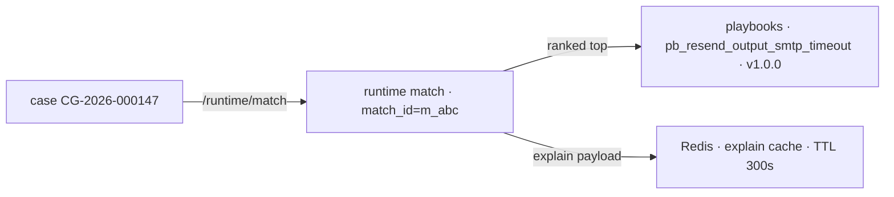

### Stage E — execution

Planner creates a `Decision` (`decision_intent=remediation`, `policy_result=approval_required`); HITL approves; an `ExecutionRun` starts with `automation_mode=human_confirmed`. Each `ExecutionStepRun` carries the `idempotency_key` from `0029` so retries can't duplicate. On success the step's `tool_invocations` row records the `ae.resend_output` call.

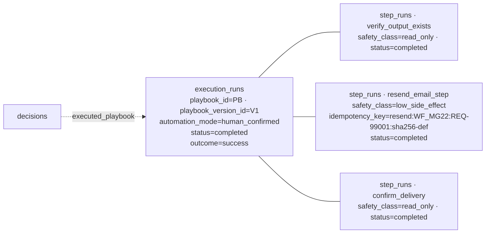

### Stage F — outcome and back-pressure on the recommender

`CaseOutcome.successful_action='resend_existing_output'` increments `FixPattern.success_count` to 6; `ErrorSignature.success_count` to 6; `Pattern.episode_count` to 6 with a small confidence bump. The Playbook's own usage stats (queryable via `decision_outcomes` filtered by `decision_type='execute_playbook'` for that playbook) show 100% success across six executions.

If a future case fails this fix:
- `case_outcomes.failed_actions[]` would include `resend_existing_output`.
- `FixPattern.failure_count` increments; `confidence` decays.
- The contradiction scanner re-runs against the playbook's cited evidence.
- If decay drops below the recommender threshold, `hybrid_ranker` stops surfacing it as the top match — the playbook stays `approved` but is naturally demoted by the math.

This is the closed-loop learning signal: **outcomes write counters, counters write rankings, rankings drive next-case recommendations**.

---

## Retention defaults

Source: `backend/src/contextedge/services/retention_service.py` and `services/memory_service.py`.

| Knob | Default | Where set |
|---|---|---|
| `retention_days` (base) | **No code default — caller must supply.** Tests pass `30`. Per-tenant override via `Tenant.retention_defaults JSONB` or `TenantPolicy(policy_type='retention')` | `apply_retention_policy(retention_days=…)` |
| Short-term window | `base` days (= `retention_days`) | `memory_retention_windows()` |
| Reasoning window | `max(base × 3, 90)` days | `memory_retention_windows()` |
| Long-term window | `max(base × 6, 180)` days | `memory_retention_windows()` |
| Archive grace (archive → purge) | **`30` days** | `DEFAULT_ARCHIVE_GRACE_DAYS` |
| Purge mode | `hard_delete` (default) or `soft_purge` | `purge_archived_evidence(mode=…)` |
| Purge limit per tick | `1000` rows, oldest-first (review F-16) | `purge_archived_evidence(limit=…)` |
| Legal-hold items | **Always excluded** from archive + purge | `evidence_filters.exclude_legal_hold()` |

### Memory-class assignment (`classify_evidence_memory_class`)

- `evidence_type ∈ {kb_article, sop, documentation}` → **long_term**
- `canonical_entity_refs.identities` populated → **long_term**
- everything else → **short_term**

### Worked example (caller passes `retention_days=30`)

| Memory class | Window |
|---|---|
| short_term | 30 days |
| reasoning | 90 days (`max(30 × 3, 90)`) |
| long_term | 180 days (`max(30 × 6, 180)`) |
| Then: archived | +30 days grace |
| Then: hard_delete or soft_purge | `soft_purge` nulls `body_text`, `body_summary`, `embedding`, `canonical_entity_refs`, `raw_object_ref`; sets `title='[purged]'` |

### Soft-purge vs hard-delete

- **`hard_delete`** removes the `evidence_items` row entirely. Cascades clean up `attachment_artifacts`, `correlation_edges`, `claim_evidence`, `decision_evidence`. The companion daily Beat task (`workers/cleanup_tasks.py::cleanup_hard_deleted_evidence`) reaps MinIO blobs and `graph_edges` rows that referenced the deleted evidence (review F-18, F-20). `playbook_evidence_links.evidence_id` is `SET NULL` rather than `CASCADE` so the audit record "this playbook version was built with support from evidence that has since been removed" survives (review F-19, migration `0027`).
- **`soft_purge`** keeps the row and FK targets but scrubs identifying content. Useful for GDPR right-to-erasure where the audit trail must remain.

### What `0029` did not add to retention

The design's Section 43.9 `cg_retention_policy` table is **not** in `0029` — retention still flows through `TenantPolicy(policy_type='retention')` + the per-tenant `Tenant.retention_defaults` JSONB. That's a deliberate next-wave hook (listed in [codewiki/17-ae-ops-context-graph-alignment.md](../codewiki/17-ae-ops-context-graph-alignment.md) under "What's deliberately not in 0029").

---

## Where to go next

| If you want to … | Read |
|---|---|
| Understand the full pipeline narratively | [codewiki/01-end-to-end-pipeline.md](../codewiki/01-end-to-end-pipeline.md) |
| Dive into Episode reconstruction internals | [codewiki/07-episodes-patterns-playbooks.md](../codewiki/07-episodes-patterns-playbooks.md) |
| See how `graph_edges` adjacency works | [codewiki/09-graph-and-correlation.md](../codewiki/09-graph-and-correlation.md) |
| Read the AE Ops alignment design notes | [codewiki/17-ae-ops-context-graph-alignment.md](../codewiki/17-ae-ops-context-graph-alignment.md) |
| Check the migration that landed the `0029` columns | [docs/MIGRATIONS.md](MIGRATIONS.md) |
| Look up an HTTP route | [docs/API.md](API.md) |
