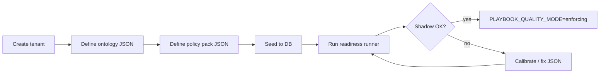

# Playbook Quality — Readiness Runner

Operational guide for **tenant-scoped** playbook quality: bootstrap governance data, verify persistence, align caches, and enable enforcement. Structured like a Process Studio **create → configure → validate → publish** flow.

For architecture and phase plan, see [PLAYBOOK_QUALITY_PERMANENT_FIX_PLAN.md](PLAYBOOK_QUALITY_PERMANENT_FIX_PLAN.md). For JSON schemas, see [backend/data/quality/README.md](../backend/data/quality/README.md).

---

## 1. Principles

| Rule | Why |
|------|-----|
| **Tenant data in JSON/DB, never in Python** | Policy rules and product ontology differ per customer; validators stay generic. |
| **Empty template by default** | `default_policy_pack.json` and `default_ontology.json` have zero rules/terms until you seed tenant JSON. |
| **Product examples are opt-in** | AutomationEdge vocabulary lives under `examples/automationedge/` and loads only with `--profile automationedge`. |
| **Shadow before enforce** | `PLAYBOOK_QUALITY_MODE=shadow` records verdicts without blocking approval. |

---

## 2. Create flow (Process Studio pattern)



### Step 1 — Create tenant

Use your normal tenant provisioning (admin UI or seed). Quality is **per `tenant_id`**: each tenant gets its own active policy pack and ontology version.

### Step 2 — Define ontology (product vocabulary)

Create JSON for canonical component names and aliases **for that tenant's product**:

```json
{
  "version": "acme-2026.09.01",
  "owner": "Acme Support",
  "terms": [
    {
      "canonical_term": "Widget Service",
      "term_kind": "component",
      "aliases": ["WS", "widget svc"]
    }
  ]
}
```

Copy from `backend/data/quality/default_ontology.json` or an example profile.

### Step 3 — Define policy pack (governance rules)

```json
{
  "version": "acme-2026.09.01",
  "owner": "Acme Support",
  "rules": [
    {
      "normalized_action": "delete configuration file",
      "decision": "discouraged",
      "alternative_action": "Use the supported rollback procedure.",
      "source_kind": "review_adjudication"
    }
  ]
}
```

### Step 4 — Seed to database

```bash
cd backend

# Generic empty templates (validators run; no product terms until you add JSON)
python scripts/seed_quality_policy_pack.py --tenant <TENANT_UUID>

# Your tenant JSON files
python scripts/seed_quality_policy_pack.py --tenant <TENANT_UUID> \
  --policy-pack /path/to/policy_pack.json \
  --ontology /path/to/ontology.json

# Optional: AutomationEdge example only (not default)
python scripts/seed_quality_policy_pack.py --tenant <TENANT_UUID> --profile automationedge

# List available example profiles
python scripts/seed_quality_policy_pack.py --list-profiles
```

Idempotent: skips tenants that already have an active pack or ontology.

### Step 5 — Run readiness runner

Run these in order after migration `0094` and tenant seed:

```bash
cd backend

# 1. Unit + integration quality suite
python -m pytest tests/ -k quality -q

# 2. PostgreSQL persistence verification (rolled-back transaction)
python scripts/verify_quality_persistence.py --tenant <TENANT_UUID>
```

Exit code `0` on both = persistence layer ready.

### Step 6 — Shadow mode (default)

```env
PLAYBOOK_QUALITY_MODE=shadow
```

Assessments run on transitions and edits; **approval is never blocked**. Use the reviewer quality panel to inspect false passes/blocks.

### Step 7 — Enforcing mode (publication gate)

When shadow data is acceptable:

```env
PLAYBOOK_QUALITY_MODE=enforcing
```

`transition_playbook(..., "approved")` then:

1. Runs assessment
2. Calls `publication_readiness`
3. Raises `InvalidTransitionError` if not ready (stale, no assessment, non-passing state, content hash mismatch)

---

## 3. Cache alignment

Quality interacts with two cache layers. Misalignment makes the UI or runtime lie.

| Cache | What it holds | Invalidation |
|-------|---------------|--------------|
| **Runtime match** (`runtime:match:*` Redis keys) | Scored playbook matches for `/runtime/explain` | Flushed on playbook **transition** when Redis is passed to `transition_playbook` |
| **Assessment vs content** | Verdict for a `content_hash` | `summary.matches_current_content=false` when live hash ≠ assessed hash; panel shows stale banner |
| **Policy / ontology staleness** | Assessment tied to pack/ontology version | Mark assessments stale when active pack or ontology version changes (Phase 7 hooks) |
| **JSON file loader** (`seed_data.load_quality_data`) | Parsed `data/quality/*.json` | Call `clear_quality_data_cache()` after editing JSON on disk without restart |

**Readiness check:** After seeding new policy/ontology, re-assess affected playbooks or wait for the next transition/edit to mint a fresh assessment with the new `policy_pack_version` / `ontology_version` on the row.

---

## 4. What runs when

| Event | Assessment | Blocks (enforcing) |
|-------|------------|-------------------|
| Draft edit / title edit | Re-assess (shadow) | No |
| Send to review | Re-assess | No |
| Approve | Assess + readiness | Yes, if not ready |
| GET `/playbooks/{id}/quality` | Never (read-only) | — |
| Pre-generation (worker/API) | Contract + gates | 422 on hard gate failure |

---

## 5. Deployment checklist

- [ ] `alembic upgrade head` (includes `0094_playbook_quality_foundation`)
- [ ] Tenant ontology + policy JSON prepared (generic or custom)
- [ ] `seed_quality_policy_pack.py` run per tenant
- [ ] `pytest -k quality` green
- [ ] `verify_quality_persistence.py` green
- [ ] `PLAYBOOK_QUALITY_MODE=shadow` in production first
- [ ] Reviewer panel shows coverage ("N of 14 checks run") not false clean state
- [ ] After calibration: `PLAYBOOK_QUALITY_MODE=enforcing`

---

## 6. Troubleshooting

| Symptom | Likely cause | Fix |
|---------|--------------|-----|
| Validators never flag terminology | Empty ontology for tenant | Seed ontology JSON |
| Safety policy always inconclusive | Empty policy pack | Seed policy rules |
| Panel shows pass but approval blocked | Enforcing + readiness false | Check `readiness.blocked_reason` in API |
| Assessment about old text | Edit after assess | Re-save or transition to re-assess |
| Stale after JSON edit on disk | Loader cache | Restart workers or `clear_quality_data_cache()` |

---

## 7. Related files

| Path | Role |
|------|------|
| `backend/data/quality/` | Tenant JSON templates and examples |
| `backend/scripts/seed_quality_policy_pack.py` | DB bootstrap |
| `backend/scripts/verify_quality_persistence.py` | Readiness runner (DB) |
| `backend/scripts/batch_assess_playbook_corpus.py` | Batch shadow assessment + triage JSON |
| `backend/src/contextedge/quality/context_loader.py` | Loads contract + tenant policy + ontology into validators |
| `backend/src/contextedge/services/playbook_quality_service.py` | Assessment orchestration |
| `frontend/src/components/playbooks/quality-panel.tsx` | Reviewer UI |
