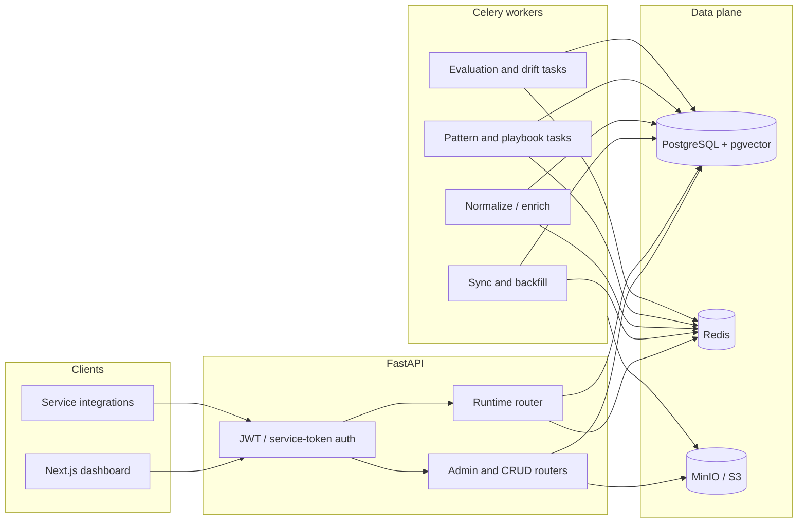
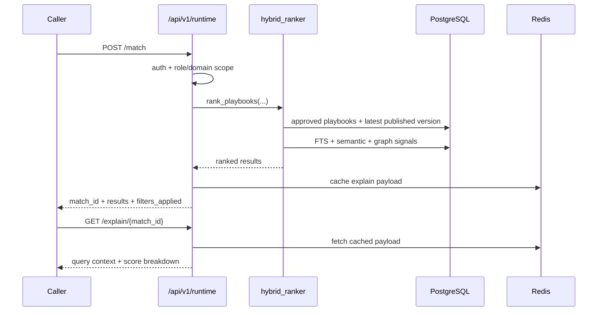
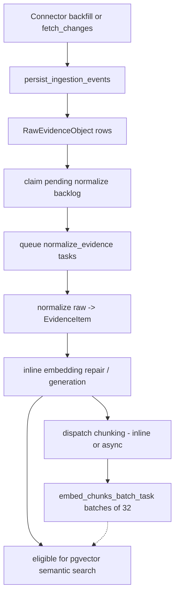

# ContextEdge - Technical Blueprint

**Scope:** Current implementation architecture, subsystem map, core flows, design patterns, and logical data model.

Detailed HTTP behavior lives in [API.md](API.md). First-time local onboarding lives in [SETUP_GUIDE.md](SETUP_GUIDE.md). Operations, Docker, workers, and troubleshooting live in [RUNBOOK.md](RUNBOOK.md). Migration caveats live in [MIGRATIONS.md](MIGRATIONS.md).

**Related:** [Product PRD](../STANDALONE_OPERATIONAL_MEMORY_PRD.md) | [Implementation plan](../CONTEXTEDGE_IMPLEMENTATION_PLAN.md)

---

## 1. Purpose

ContextEdge ingests operational evidence from external systems, normalizes it into tenant-scoped evidence records, derives episodes and patterns, and turns governed knowledge into versioned playbooks that can be retrieved at runtime.

The codebase is implementation-first. This document describes what the repository currently does, not the aspirational end state from the phased plan.

---

## 2. Documentation Map

| Document | Focus |
| --- | --- |
| [SETUP_GUIDE.md](SETUP_GUIDE.md) | First-time local setup, Docker-first and host-run workflows |
| [API.md](API.md) | Auth headers, router index, runtime semantics, policy and drift endpoints |
| [RUNBOOK.md](RUNBOOK.md) | Environment, Docker, Make targets, migrations, health checks, workers |
| [MIGRATIONS.md](MIGRATIONS.md) | Alembic `0001` caveat, reproducibility, operational mitigations |
| This file | Architecture, flows, package map, design patterns, data model |

---

## 3. System Characteristics

- **Architecture style:** modular monolith
- **API framework:** FastAPI with routers mounted under `/api/v1`
- **Persistence:** PostgreSQL with pgvector
- **Async model:** async SQLAlchemy on HTTP and worker service code paths
- **Background execution:** Celery with Redis broker/result backend
- **Frontend:** Next.js 16 App Router dashboard
- **Storage model:** relational source of truth in Postgres, Redis for short-lived runtime explain cache, optional S3-compatible object storage for larger artifacts
- **Tenancy:** tenant-scoped models and auth claims drive isolation throughout the stack
- **Governance:** playbooks are lifecycle-managed and runtime only serves published versions

---

## 4. High-Level Architecture

### Request / worker split

- **HTTP path:** validation, auth, routing, service orchestration, DB commit, JSON response
- **Worker path:** Celery task -> `run_async(...)` session wrapper -> async service function -> DB commit/rollback
- **Shared domain logic:** kept in `services/`, `search/`, `connectors/`, and model-layer constraints rather than in routers or task wrappers

---

## 5. Core Runtime Flow

Runtime retrieval is intentionally narrower than the admin surface.

### Current runtime rules

- Human callers authenticate with Bearer JWT.
- Service integrations may use `X-Service-Token`.
- Service tokens can carry `allowed_domain_ids`; runtime enforces that allowlist.
- Risk caps are currently **role-based**, not driven by `TenantPolicy.config`.
- `GET /runtime/playbooks/{stable_key}` only returns **published** versions.
- If `current_version_id` points to an unpublished version, runtime falls back to the latest published version.

---

## 6. Ingestion and Worker Pipeline

The ingestion path is now explicitly post-commit and recovery-aware.

The dashed `CHE -.-> H` arrow marks the planned chunk-level retrieval rollup — chunks land today (migration `0030_evidence_chunks`) but `vector_search.py` still queries `evidence_items.embedding` only. See [codewiki/05-search-hybrid-and-access.md](../codewiki/05-search-hybrid-and-access.md) "Chunk-level retrieval (planned)" and [codewiki/CHUNKING_DESIGN.md](../codewiki/CHUNKING_DESIGN.md) §6.

### Sync handoff behavior

- Connector output is normalized into `IngestionEvent` records.
- `persist_ingestion_events(...)` writes `RawEvidenceObject` rows and returns the new raw IDs.
- `_claim_pending_raw_ids_for_handoff(...)` claims any previously stranded raw IDs from `SourceObject.metadata_extra`, clears that backlog under a row lock, and only then allows queue publication.
- On partial broker failure, only the unqueued tail is re-added to the source-object backlog.
- Recovery filtering uses the same normalized body hash as the normalize worker, so deduped raws do not loop forever.

### Normalization behavior

- `normalize_evidence` reads `RawEvidenceObject`, derives title/body/hash, and inserts or dedupes into `EvidenceItem`.
- After insertion or dedup repair, the worker runs **identity linking** (`link_evidence_identities`) and **decision extraction** (`link_evidence_decisions`) inline. Decision extraction uses an LLM to identify operational actions from evidence text, resolves actors and targets against canonical identities, and creates `records_decision` / `records_action_on` graph edges.
- Dedupe is hash-based at the application layer and is now backed by a partial unique index `(tenant_id, content_hash) WHERE content_hash IS NOT NULL` (migration `0026_dedup_uniqueness`); concurrent inserts catch `IntegrityError` and re-fetch the winning row.
- Embeddings are ensured inline on normalization so semantic search sees newly normalized evidence without a second broker hop.
- After the parent embed lands, `_dispatch_chunking` writes `EvidenceChunk` rows via `services/evidence_chunk_service.write_chunks` and queues `embed_chunks_batch_task` for the chunk-level embeddings (batches of 32). Inline for ticket / thread bodies under 16 KB; async via `chunk_evidence_task` for everything else. The whole block is wrapped in `try/except` so a chunker bug cannot regress today's parent-embedding retrieval. Per-source chunkers under `services/chunkers/` (ticket / thread / attachment / fallback) are pure functions; `chunker_version` on every chunk row makes re-chunking under schema change atomic. See [codewiki/CHUNKING_DESIGN.md](../codewiki/CHUNKING_DESIGN.md).

---

## 7. Governance and Playbook Lifecycle

Playbooks are governed objects, not free-form documents.

### Lifecycle states

`candidate -> under_review -> approved -> restricted/deprecated/expired/retired`

Implementation lives in `services/playbook_service.py`.

### Versioning model

- Every playbook has a `stable_key`.
- Versions are stored in `PlaybookVersion`.
- `semantic_version` is unique per playbook.
- Version creation uses retry-on-unique-conflict logic so concurrent auto-allocation does not surface as an internal error.
- Approval publishes the current version by setting `published_at` and `published_by`.
- Runtime only ranks approved playbooks that have a published version.

---

## 8. Backend Package Map

| Area | Path under `backend/src/contextedge/` | Responsibility |
| --- | --- | --- |
| App bootstrap | `main.py`, `config.py` | App factory, CORS, metrics, settings |
| Persistence | `database.py`, `models/` | Engine, sessions, ORM |
| Schemas | `schemas/` | Pydantic request/response models, including shared response shapes in `schemas/common.py` (`StatusResponse`, `TaskDispatchResponse`, `MutationAckResponse`) |
| Auth and request context | `deps.py`, `security_tokens.py`, `middleware/` | JWT, service tokens, request state, auditing |
| API routers | `api/v1/` | HTTP entry points |
| Connectors | `connectors/` | Source-specific adapters behind a shared contract |
| Services | `services/` | Application-layer orchestration and domain logic |
| Search | `search/` | FTS, vector search, risk gating, hybrid ranking |
| Graph, patterning, decisions | `graph/`, `api/v1/graph.py`, `services/decision_service.py`, `ai/extractors/decision_extractor.py`, parts of `services/`, `workers/pattern_tasks.py` | Graph HTTP API, BFS traversal, aggregate stats, relationship, pattern, and decision signals |
| AI integration | `ai/` | Embeddings, classification, generation helpers, decision extraction, versioned prompt registry (`ai/prompts/`), schema-validated retry wrapper (`llm_complete_json_validated`) |
| Cost & budget | `services/admin_cost_service.py`, `services/tenant_budget_service.py`, `api/v1/admin_cost.py` | Per-tenant LLM spend aggregation, daily token/cost caps with pre-call enforcement (in-process `asyncio.Lock` + SQLAlchemy `after_delete` cache invalidation) |
| Redaction | `services/redaction_service.py` | Regex PII/secret redaction at ingest, before any embed / LLM call |
| Evidence filters | `services/evidence_filters.py` | Shared `exclude_legal_hold()` WHERE fragment — single source of truth for the "legal-hold never reaches an LLM" invariant, used by retention + contradiction scan + episode reconstruction |
| Object store | `services/object_store.py` | MinIO/S3 client helpers: `upload_raw`, `download_raw`, `upload_artifact`, `download_artifact`, `delete_object` |
| Worker wrappers | `workers/` | Celery tasks, async session bridge, correlation-ID propagation via Celery signals; includes `workers/cleanup_tasks.py` (daily Beat sweep for MinIO blob + graph-edge orphans left by hard-delete) |
| Golden evals | `backend/evals/` | Per-extractor `golden.jsonl` + `run_regression.py` CLI for regression smoke tests |

---

## 9. Frontend Summary

- **Framework:** Next.js 16 App Router
- **UI stack:** React, Tailwind, shadcn/ui
- **Data fetching:** TanStack Query
- **API client:** `frontend/src/lib/api.ts`
- **Representative route groups:** `overview`, `sources`, `evidence`, `episodes`, `patterns`, `playbooks`, `runtime`, `evaluations`, `drift`, `policies`, `audit`, `sync`, `graph-explorer`
- **Graph visualization:** The Graph Explorer page (`/graph-explorer`) provides interactive subgraph visualization via React Flow with dagre layout, BFS neighbor traversal, and aggregate statistics. Shared node/edge styling lives in `components/graph/graph-constants.ts` and is reused by both the pattern-scoped graph and the generic Graph Explorer. Decision-related node types (`session`, `execution_run`, `approval_request`, `user`) and edge types (`executed_playbook`, `approved_by`, `denied_by`, `execution_outcome`, `records_decision`, `records_action_on`) are included in the graph constants for visualization.

The frontend is a thin client over the FastAPI API. Most business rules remain on the server.

---

## 10. Design Patterns Used

This codebase uses a small number of consistent patterns repeatedly.

| Pattern | Where it appears | Why it is used |
| --- | --- | --- |
| **Modular monolith** | `api/`, `services/`, `models/`, `workers/` | Keeps deployment simple while preserving subsystem boundaries |
| **Adapter pattern** | `connectors/base.py`, concrete connector modules | External systems present different APIs but expose one internal contract |
| **Registry / factory** | `connectors/registry.py` | Resolves connector implementation from `source_type` without router-level branching |
| **Dependency injection** | FastAPI `Depends(...)` in `deps.py` | Centralizes auth and DB session construction |
| **Service layer** | `services/*.py` | Keeps orchestration and business rules out of routers and Celery wrappers |
| **Command worker pattern** | `workers/*_tasks.py` | Thin task wrappers call explicit service functions with retry policy at the task boundary |
| **Session wrapper / unit-of-work style** | `database.get_db`, `workers.asyncio_runner.run_async` | Gives request and worker paths symmetrical commit/rollback semantics |
| **State machine** | `services/playbook_service.py` | Makes lifecycle transitions explicit and enforceable |
| **Cache-aside** | runtime explain cache in Redis | Keeps runtime explain cheap and bounded by TTL |
| **Policy gate** | `search/risk_policy.py`, runtime auth checks | Applies caller-based caps before runtime retrieval |
| **Hybrid scoring pipeline** | `search/hybrid_ranker.py` | Combines FTS, semantic, graph, and freshness signals instead of relying on one retrieval mode |
| **Claim-before-queue recovery** | `services/sync_worker_service.py` | Prevents recovered backlog from being picked up twice and enables bounded broker-failure recovery |
| **Retry-on-constraint-conflict** | playbook version allocation | Converts concurrent uniqueness races into deterministic behavior |

---

## 11. Logical Data Model

Primary entity groups:

1. **Tenant core**
   `Tenant`, `Workspace`, `Domain`, `User`, `RoleBinding`, `AuditLog`
2. **Source and ingestion**
   `Source`, `SourceObject`, `SourceCredential`, `SyncCheckpoint`, `SyncRun`
3. **Evidence**
   `RawEvidenceObject`, `EvidenceItem`, `EvidenceChunk` (per-chunk index added in `0030`; sibling table FK'd to `EvidenceItem` with `ON DELETE CASCADE`, carries its own 3072-dim embedding + per-source `metadata` JSONB + `chunker_version` for re-chunk safety), `Thread`, `AttachmentArtifact`
4. **Identity and reconstruction**
   `CanonicalIdentity`, `IdentityAlias`, `CorrelationEdge`, `Episode`, `EpisodeStep`
5. **Patterns, graph, and decisions**
   `Pattern`, `NegativeKnowledgeItem`, `Contradiction`, `GraphEdge` (includes `domain_id` for domain-scoped graph queries; migration `0029` adds `valid_from` / `valid_to` / `confidence` for temporal-validity queries). Decision edges use `GraphEdge` with edge types `executed_playbook`, `approved_by`, `denied_by`, `execution_outcome` (governed, Tier 2) and `records_decision`, `records_action_on` (AI-extracted, Tier 1). Node types include `session`, `execution_run`, `approval_request`, and `user`.
6. **Playbooks**
   `Playbook`, `PlaybookVersion`, `PlaybookEvidenceLink`, `PlaybookApproval`
7. **Evaluation and runtime feedback**
   `EvaluationDataset`, `EvaluationRun`, `RetrievalFeedback`
8. **Policies**
   `TenantPolicy`
9. **AE Ops Context Graph alignment** (migration `0029`)
   - **Operational-noun entities** — `Entity` (workflow, workflow_request, agent_machine, schedule, output_location, application, database, file_share, business_service, incident, sop, …), keyed `(entity_type, external_system, external_id)` UNIQUE. Coexists with `CanonicalIdentity`, which keeps its identity-resolution role.
   - **Claims** — `Claim`, `ClaimEvidence`, `DecisionEvidence`. First-class evidence-backed assertion with validation lifecycle (`unverified` → `machine_verified` → `human_validated` → `rejected` → `superseded`). `DecisionEvidence` is the relational complement to the existing `Decision.evidence_summary` JSONB cache.
   - **Action policy** — `ActionPolicy`. Action-keyed verdict (`allowed_auto` / `approval_required` / `recommendation_only` / `restricted` / `manual_only`), distinct from `TenantPolicy` (which stays as the generic config bucket).
   - **Error signature + fix pattern** — `ErrorSignature` (signature_key UNIQUE per tenant, success/failure counters), `FixPattern` (issue_type + workflow + error_signature + counters, optionally pointing at a `Playbook`). Separate from `Pattern` / `Playbook` to preserve existing semantics.
   - **Case lifecycle** — `CaseOutcome` (case-level outcome distinct from per-decision `DecisionOutcome`), `CaseStateTransition` (append-only `resolution_sessions.status` history).
   - **Case spine columns** — `ResolutionSession` gains nullable `case_number` (partial-unique), `case_type`, `issue_type`, `title`, `description`, `priority`, `severity`, `environment`, plus four FKs (`user_entity_id`, `workflow_entity_id`, `request_entity_id`, `agent_entity_id`) into the new `entities` table.
   - **Evidence lineage** — `EvidenceItem` gains nullable `evidence_time`, `collected_by`, `source_type`, `redaction_status` (the design distinguishes "subject time" from `created_at_source` / `ingested_at`).
   - **Decision verdict** — `Decision` gains nullable `decision_intent` (governance axis: diagnosis / recommendation / remediation / …), `decision_summary`, trace-level `risk_level`, and `policy_result` (the verdict the executor checks).
   - **Decision step** — `DecisionTraceEvent` gains nullable `decision_id` FK + `tool_name` / `tool_input_ref` / `tool_output_ref` so rows can serve the cg_decision_step role.
   - **Approval governance** — `ApprovalRequest` gains nullable `action_name`, `approver_role`, `approval_channel`, `recommended_by` / `executed_by` / `sod_check_status` SoD fields, and `case_id` / `decision_trace_id` FKs.
   - **Action idempotency** — `ExecutionStepRun` gains nullable `action_name`, `action_type`, `execution_mode`, `executed_by`, `idempotency_key` (partial unique index, banking-grade duplicate prevention), and `case_id` / `decision_trace_id` FKs.

   Every new column is nullable, every new constraint guarded by `IF NOT EXISTS` / `pg_constraint` lookup. No service code changes — population is the next wave. See [MIGRATIONS.md](MIGRATIONS.md#notable-revisions) and [codewiki/17-ae-ops-context-graph-alignment.md](../codewiki/17-ae-ops-context-graph-alignment.md).

### Important model relationships

- `Source -> SourceObject -> SyncCheckpoint / SyncRun`
- `RawEvidenceObject -> EvidenceItem` through `raw_object_ref` when not deduped
- `EvidenceItem -> EvidenceChunk` (1:N, `ON DELETE CASCADE`) — `EvidenceItem.chunked_at` stamps the latest chunker run; `chunk_count` is observability-only
- `Playbook -> PlaybookVersion` with `current_version_id` on the parent
- `PlaybookVersion -> PlaybookEvidenceLink -> EvidenceItem`
- `PlaybookApproval` records governance actions independently of current lifecycle state
- `ResolutionSession -> Entity` (4 FKs: user / workflow / request / agent) — case spine after `0029`
- `Claim -> ClaimEvidence -> EvidenceItem`; `Decision -> DecisionEvidence -> EvidenceItem`
- `FixPattern -> ErrorSignature` and `FixPattern -> Playbook` (recommended_playbook_id) — recommender bridge
- `CaseOutcome -> ResolutionSession` (case-level), distinct from `DecisionOutcome -> Decision` (per-decision)

---

## 12. Current Constraints and Tradeoffs

- **Alembic `0001` is not frozen DDL.** See [MIGRATIONS.md](MIGRATIONS.md).
- **Runtime risk caps are role-based today.** Policies are assignable but not yet the runtime decision engine.
- **Redis explain cache is best-effort.** Runtime explain depends on a cached `match_id` payload and returns 404 after expiry or cache loss.
- **Connector orchestration is implemented, but connector completeness varies by source.** The shared contract is stable; source-specific depth differs.
- **Sync scheduling is not single-flight per `SourceObject`.** Recovery handoff is bounded and claim-before-queue, but overlapping manual backfills or retries against the same object can still create duplicate work.
- **Evidence dedupe remains application-layer.** Normalize workers dedupe by normalized content hash, but there is no database uniqueness constraint yet on the resulting evidence rows.
- **Service tokens are tenant-wide unless explicitly scoped.** Omitting `allowed_domain_ids` from `SERVICE_TOKENS_JSON` grants full-tenant runtime access by design.

---

## 13. Maintenance Rules

Update this blueprint when any of the following change:

- subsystem boundaries or new packages
- worker pipeline shape
- runtime retrieval or publishing semantics
- architectural patterns that future contributors need to follow

Update [API.md](API.md) when changing routes, auth headers, or response semantics. Update [SETUP_GUIDE.md](SETUP_GUIDE.md) when onboarding steps change. Update [RUNBOOK.md](RUNBOOK.md) when operational commands, migrations, or deployment requirements change.

**Last reviewed:** 2026-04-27. Codebase includes Alembic revisions through `0029_ae_ops_concept_alignment`. Decision graph edges (Tier 1 AI-extracted + Tier 2 governed execution) are implemented. AE Ops Context Graph alignment landed in `0029` as additive schema only — service code consumes the new columns lazily (nullable, no backfill).
