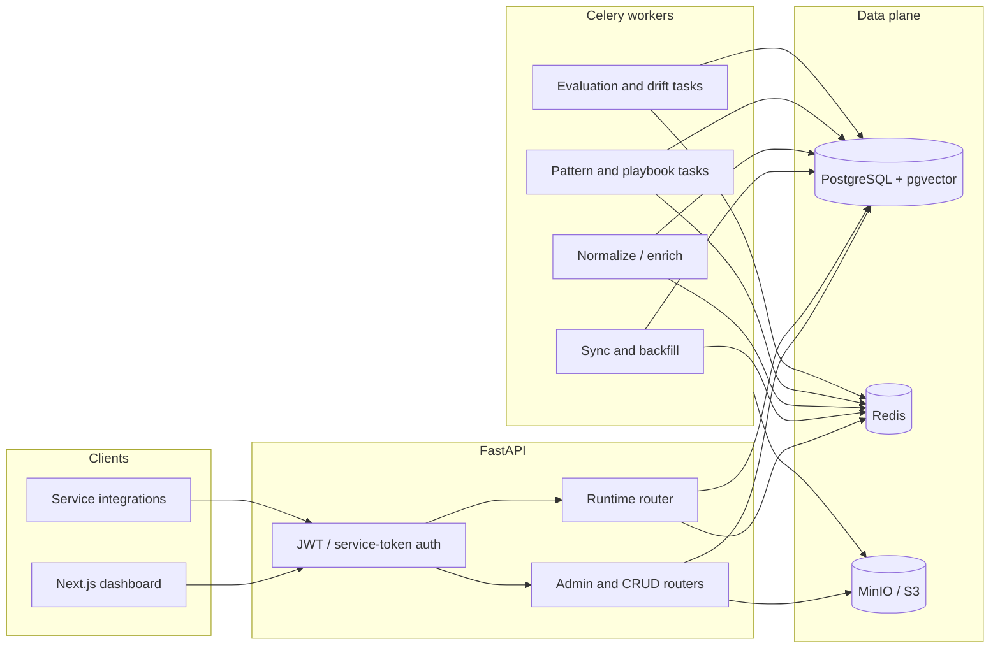
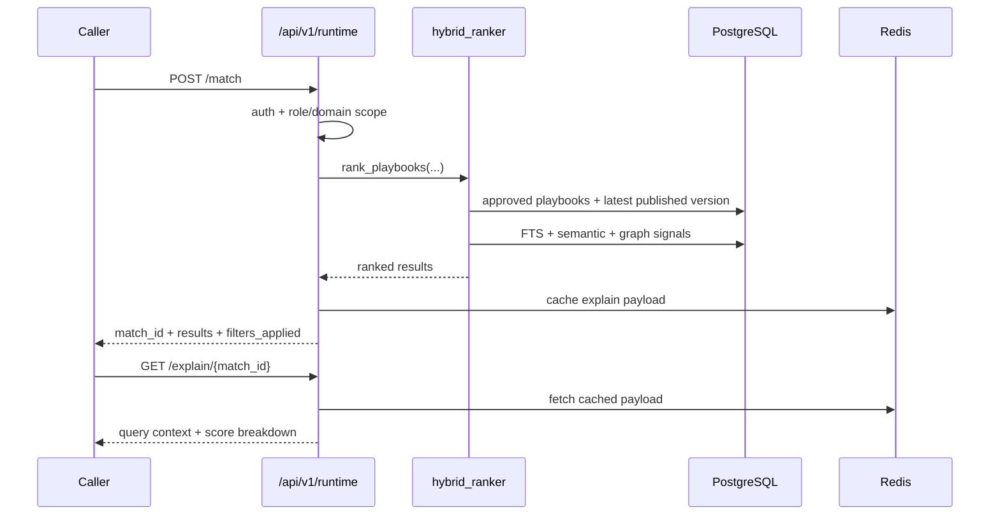
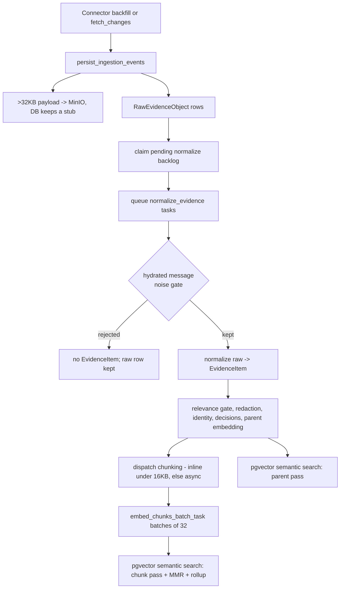

# ContextEdge - Technical Blueprint

**Scope:** Current implementation architecture, subsystem map, core flows, design patterns, and logical data model.

**Accurate as of 2026-08-19.** Load-bearing claims carry a `file:line` citation, verified by reading the file. Paths are relative to the repository root.

Detailed HTTP behavior lives in [API.md](API.md). First-time local onboarding lives in [SETUP_GUIDE.md](SETUP_GUIDE.md). Operations, Docker, workers, and troubleshooting live in [RUNBOOK.md](RUNBOOK.md). Migration caveats live in [MIGRATIONS.md](MIGRATIONS.md). What is deliberately unbuilt lives in [codewiki/KNOWN_GAPS.md](../codewiki/KNOWN_GAPS.md) — check it before asserting any capability works end to end.

**Related:** [Product PRD](../STANDALONE_OPERATIONAL_MEMORY_PRD.md) | [Implementation plan](../CONTEXTEDGE_IMPLEMENTATION_PLAN.md)

**Worked example.** All ContextEdge docs trace the same incident: the **Acme VPN incident** — ServiceNow `INC0010427`, "VPN tunnel flapping on `vpn-gw-east-01`", plus the Teams working thread and the engineer email that quotes the ticket number.

---

## 1. Purpose

ContextEdge ingests operational evidence from external systems, normalizes it into tenant-scoped evidence records, derives episodes and patterns, and turns governed knowledge into versioned playbooks that can be retrieved at runtime.

The codebase is implementation-first. This document describes what the repository currently does, not the aspirational end state from the phased plan.

---

## 2. Documentation Map

| Document | Focus |
| --- | --- |
| [SETUP_GUIDE.md](SETUP_GUIDE.md) | First-time local setup, Docker-first and host-run workflows |
| [API.md](API.md) | Auth headers, router index, runtime semantics, policy and drift endpoints |
| [RUNBOOK.md](RUNBOOK.md) | Environment, Docker, Make targets, migrations, health checks, workers |
| [MIGRATIONS.md](MIGRATIONS.md) | Alembic `0001` caveat, reproducibility, operational mitigations |
| This file | Architecture, flows, package map, design patterns, data model |

---

## 3. System Characteristics

- **Architecture style:** modular monolith
- **API framework:** FastAPI with routers mounted under `/api/v1`
- **Persistence:** PostgreSQL with pgvector
- **Async model:** async SQLAlchemy on HTTP and worker service code paths
- **Background execution:** Celery with Redis broker/result backend
- **Frontend:** Next.js 16 App Router dashboard
- **Storage model:** relational source of truth in Postgres, Redis for short-lived runtime explain cache, optional S3-compatible object storage for larger artifacts
- **Tenancy:** tenant-scoped models and auth claims drive isolation throughout the stack
- **Governance:** playbooks are lifecycle-managed and runtime only serves published versions

---

## 4. High-Level Architecture

### Request / worker split

- **HTTP path:** validation, auth, routing, service orchestration, DB commit, JSON response
- **Worker path:** Celery task -> `run_async(...)` session wrapper -> async service function -> DB commit/rollback
- **Shared domain logic:** kept in `services/`, `search/`, `connectors/`, and model-layer constraints rather than in routers or task wrappers

---

## 5. Core Runtime Flow

Runtime retrieval is intentionally narrower than the admin surface.

### Current runtime rules

- Human callers authenticate with Bearer JWT.
- Service integrations may use `X-Service-Token`; the header wins over a Bearer token when both are present, and an invalid service token is 403, not 401 (backend/src/contextedge/deps.py:72-114).
- Service tokens can carry `allowed_domain_ids`; runtime enforces that allowlist.
- Risk caps are currently **role-based**, not driven by `TenantPolicy.config`: admins are uncapped, `knowledge_manager` and service accounts cap at `high`, everyone else at `medium` (backend/src/contextedge/api/v1/runtime.py:42-52).
- `GET /runtime/playbooks/{stable_key}` only returns **published** versions.
- If `current_version_id` points to an unpublished version, runtime falls back to the latest published version.
- **Abstention is part of the contract.** `rank_playbooks` drops every result below `MIN_RECOMMENDATION_SCORE = 0.35` (or the caller's `min_score`) and logs `ranking.abstained` when candidates existed but none cleared the bar (backend/src/contextedge/search/hybrid_ranker.py:171, 369-378). An empty list means "no recommendation", not "no data" — callers must not treat it as an error.

### Hybrid scoring, concretely

`rank_playbooks` (backend/src/contextedge/search/hybrid_ranker.py:213) is a **weighted sum of independent signals**, not reciprocal rank fusion. Current weights (`RankingWeights`, hybrid_ranker.py:22-31): keyword 0.25, semantic 0.30, graph distance 0.15, evidence quality 0.10, identity 0.05, recency 0.10, freshness 0.05, minus a negative-knowledge penalty weighted 0.05. Note that `recency_score` is assigned the freshness value, so freshness effectively carries 0.15.

Mechanism worth knowing:

- Candidates are approved playbooks that have a published version; one batched query loads the newest published version per playbook, and a playbook without one is skipped entirely.
- Exactly **one** query embedding is generated per call, budget-gated and cost-attributed, then passed down into every per-playbook semantic search. If embedding fails, the semantic signal contributes 0 and ranking continues on the others.
- The semantic score is gated by the keyword score — `min(1.0, semantic * (0.6 + 0.4 * keyword))` — so pure vector drift cannot carry a playbook that shares no vocabulary with the query.
- Every `RankedPlaybook` carries the full `breakdown` dict, which is what `GET /runtime/explain/{match_id}` serves back from the Redis cache (`MATCH_CACHE_TTL_SEC = 3600`, backend/src/contextedge/api/v1/runtime.py:29). The cache is written **after** the match and keyed by `match_id`; it is not a request-level short-circuit, so a repeated identical query is fully re-ranked.

---

## 6. Ingestion and Worker Pipeline

The ingestion path is explicitly post-commit and recovery-aware.

**Chunk-level retrieval has shipped** — earlier revisions of this document described it as planned. `search_evidence_semantic` now runs an oversampled chunk ANN pass, diversifies it with maximal-marginal-relevance at the chunk level (`MMR_LAMBDA = 0.7`), rolls up to one hit per parent evidence scored by its closest chunk, and then merges a parent-embedding pass so unchunked evidence still surfaces (backend/src/contextedge/search/vector_search.py:204-243; backend/src/contextedge/search/chunk_rollup.py). Results are 3-tuples `(EvidenceItem, distance, best_chunk | None)`, and consumers indexing `row[0]` / `row[1]` — notably the hybrid ranker — were preserved deliberately. Oversampling is `min(max(80, limit*3), 240)` (vector_search.py:40-46). Design rationale: [codewiki/CHUNKING_DESIGN.md](../codewiki/CHUNKING_DESIGN.md) §6.

### Raw payload offload

`persist_ingestion_events` writes the payload inline into `raw_evidence_objects.raw_payload` (JSONB). **Above `OFFLOAD_THRESHOLD_BYTES = 32_768` the JSON goes to object storage at `raw/{tenant_id}/{raw_id}.json` and the database row keeps only the stub `{"_offloaded": true, "size_bytes": N}`**, with the key recorded in `object_storage_key` (backend/src/contextedge/services/ingestion_persistence.py:16, 84-87; backend/src/contextedge/services/object_store.py:50-59).

This has one consequence every contributor must internalize: **any SQL that filters or sorts on `raw_payload` silently skips the biggest rows**, because they hold the stub. It is not an error path — the query succeeds and quietly omits exactly the longest tickets and articles. Known affected paths: ingest-priority ordering (which sorts offloaded rows to the back regardless of mode), reply-inheritance reconciliation (which skips them explicitly), and any ad-hoc backfill over payload fields. When a column needs populating from the payload, prefer a re-sync over a SQL backfill.

### Sync handoff behavior

- Connector output is normalized into `IngestionEvent` records.
- `persist_ingestion_events(...)` writes `RawEvidenceObject` rows and returns the new raw IDs.
- `_claim_pending_raw_ids_for_handoff(...)` claims any previously stranded raw IDs from `SourceObject.metadata_extra`, clears that backlog under a row lock, and only then allows queue publication.
- On partial broker failure, only the unqueued tail is re-added to the source-object backlog.
- Recovery filtering uses the same normalized body hash as the normalize worker, so deduped raws do not loop forever.

### Normalization behavior

`extraction.normalize_evidence` (backend/src/contextedge/workers/extraction_tasks.py:1304) wraps `_normalize` (extraction_tasks.py:122). The whole body is one transaction; every `.delay()` fan-out happens in the task wrapper **after** `run_async` commits (extraction_tasks.py:1306-1354).

- **Deterministic noise gate first.** For hydrated thread messages only, `message_noise_reason` classifies the message as `delivery_failure` / `quote_only` / `empty` / `coordination_only` before any model call. A hit returns `skipped_noise_message` and **creates no `EvidenceItem`** — the raw row is kept, so a rule change can re-judge every rejection exactly (extraction_tasks.py:147-160). `coordination_only` means under `MIN_DIAGNOSTIC_CHARS = 150` after markup and signature stripping *and* carrying no technical signal (backend/src/contextedge/services/message_filter.py:52).
- **Redaction runs before every consumer.** `redact_evidence_fields` scrubs title and body, and the identity-extractor blob is re-redacted separately because nested custom fields carry PII the field extractors miss (extraction_tasks.py:173-198). The content hash is taken on the **raw, pre-redaction** body so tuning a regex never invalidates dedupe (backend/src/contextedge/services/evidence_normalization.py:138-152).
- **Dedupe is hash-based at the application layer, backed by a partial unique index** `(tenant_id, content_hash) WHERE content_hash IS NOT NULL` (migration `0026_dedup_uniqueness`). Concurrent inserts catch `IntegrityError`, roll back, re-fetch the winning row, and return without re-spending LLM calls (extraction_tasks.py:374-409).
- **A dedupe hit refreshes rather than duplicates.** `source_facets`, `case_state`, and `knowledge_state` are re-derived on the existing row, a missing embedding is repaired, and identity/decision extraction re-runs only when the cached refs are empty (extraction_tasks.py:221-325). This is the mechanism by which resolving a ticket or retiring a knowledge article lands: neither rewrites the body, so the hash is unchanged and a new row would never be created.
- **The relevance gate short-circuits the expensive half.** `skip_extraction = (label == "not_relevant" and confidence >= 0.75)` (extraction_tasks.py:475-479). A skipped item keeps its row for audit but gets no message-function call, no identity resolution, no decision extraction, no parent embedding, and no chunking — it is invisible to vector search by construction. Classifier *failure* is fail-open: the item continues down the full path (extraction_tasks.py:462-469).
- **Error-signature fingerprinting is deterministic and runs on every item, including skipped ones** — a confidently-irrelevant thread can still carry a pasted stack trace (extraction_tasks.py:511-526).
- After the relevance gate, the worker runs **identity linking** (`link_evidence_identities`, extraction_tasks.py:533) and **decision extraction** (`link_evidence_decisions`, extraction_tasks.py:551) inline. Decision extraction uses an LLM to identify operational actions, resolves actors and targets through the same identity resolver, and creates `records_decision` / `records_action_on` graph edges.
- **Parent embedding** is ensured inline so semantic search sees newly normalized evidence without a second broker hop (extraction_tasks.py:65-70, 567-571).
- After the parent embed lands, `_dispatch_chunking` writes `EvidenceChunk` rows via `services/evidence_chunk_service.write_chunks` and queues `embed_chunks_batch_task` (batches of 32). Inline when the body is under `INLINE_CHUNK_BUDGET_BYTES = 16 * 1024` **and** the source is in `INLINE_CHUNK_SOURCE_ALLOWLIST`; async via `chunk_evidence_task` otherwise (extraction_tasks.py:54-62, 73-119). The whole block is wrapped in `try/except` so a chunker bug cannot regress parent-embedding retrieval. Chunker selection is `get_chunker(source_type, evidence_type)` and **record shape beats source type** — a `kb_article` routes to the heading-aware document chunker even from a ticket source (backend/src/contextedge/services/chunkers/registry.py:116-143). `chunker_version` on every chunk row makes a re-chunk under schema change additive rather than destructive. See [codewiki/CHUNKING_DESIGN.md](../codewiki/CHUNKING_DESIGN.md).
- Each enrichment is individually `try/except`-wrapped and logged. A blocked LLM budget or a provider outage therefore yields an evidence row that is un-embedded and un-linked, rather than no row at all.

### Post-commit fan-out

After `_normalize` commits, the task wrapper dispatches (extraction_tasks.py:1314-1351):

1. `artifact.extract_attachment` per attachment, **or** — when there are none — `extraction.correlate_evidence` plus `extraction.compute_evidence_baseline`.
2. `hydration.hydrate_thread`, but only when the payload carried a `_thread_id`, the record is **not itself a hydrated message**, and the row was not a dedupe hit. That guard is load-bearing: hydration stamps `_thread_id` onto every message it writes, so without it each hydrated message would re-hydrate its own thread (measured 10× amplification, comments at extraction_tasks.py:598-615).

### Queues and worker topology

Eight queues: `default`, `sync`, `hydration`, `extraction`, `correlation`, `embedding`, `pattern`, `evaluation` (routes at backend/src/contextedge/workers/celery_app.py:226-280; authoritative consumed list at `backend/dev.py:16`).

The `correlation` and `embedding` lanes exist because a single FIFO starved everything downstream of bulk ingestion, silently. Measured 2026-08-17: the extraction queue growing ~70 tasks/minute at 8,255 deep, correlation dispatched and never once received, and 1,879 chunks with 289 embedded — evidence ingested and unretrievable, with no error anywhere (celery_app.py:234-266). **A fleet that does not consume both lanes reproduces exactly that failure.**

Windows worker shape (details in [RUNBOOK.md](RUNBOOK.md) "Worker topology"): prefork is unusable, and `-P threads` is unusable for LLM-bearing lanes because litellm holds loop-bound asyncio locks. The shipped topology is N `-P solo` **processes** for the high-volume lanes plus one `-P solo` worker for `sync,pattern,evaluation` (clustering has no advisory lock, so it must serialize), plus exactly one beat. Safety rests on three things: a fresh NullPool engine and session per task (backend/src/contextedge/workers/asyncio_runner.py:10-34), a transaction-scoped advisory lock per source object (backend/src/contextedge/services/sync_worker_service.py:379-395), and `task_acks_late=True`.

Workers refuse to start when the database revision is behind the code's Alembic head, raising `SystemExit` so a supervisor restart-loops until migrations run (celery_app.py:83-139).

---

## 6b. Knowledge Pipeline: evidence → episode → signature → pattern → playbook

Ingestion stops at a stored, embedded, correlated evidence row. Everything above it is a separate chain, and each link has explicit gates whose job is to *not* spend a model call.

### Correlation (evidence → case graph)

`correlate_evidence_item` (backend/src/contextedge/services/correlation_service.py:197) runs two tiers:

- **Tier 1 — deterministic case links, confidence 1.0.** `(system, external_id)` keys built from the record's own id, its thread id, ServiceNow task references, Jira linked-issue keys, SapphireIMS related tickets, and Zoho ticket numbers. Referenced ids share a namespace with the referenced records' own ids, so incident ↔ problem ↔ change correlate regardless of ingestion order. CI and assignment-group references are deliberately **never** case-link keys — shared infrastructure would mass-merge unrelated cases.
- **Tier 2 — identity co-occurrence, gated and scored.** Only `resolved`/`verified`, active identities count; a 7-day window applies and fails closed on missing timestamps; hub identities at degree ≥ 200 carry zero signal; a rare non-person entity scores 0.75 and a common one 0.65, with a bonus for ≥2 shared identities capped at 0.85. **A single shared person is dropped entirely** — people work on many unrelated incidents.

When both tiers match, the case-link tier wins. Edges are created once and never upgraded. Reference enrichment (typed ServiceNow/Jira/Zoho edges, ticket-number bridging, CI entities) runs in nested SAVEPOINTs so an enrichment failure loses enrichment, never the correlation.

### Episode synthesis

`extraction.correlate_evidence` schedules `extraction.reconstruct_episode` with a **180-second debounce** when it created correlations. `_reconstruct` (extraction_tasks.py:995) then runs these gates in order, each of which exists to avoid paying for narration a later sweep would retire:

1. **Cluster resolution** — `resolve_episode_cluster` materializes the connected component over `case_links` + `correlation_edges` before any LLM sees it, bounded at 50 members / 3 hops / a 30-day window from the nearest seed, with legal-hold and pending-redaction rows fenced out in SQL.
2. **Minimum cluster** — fewer than 3 members is skipped (`MIN_AUTO_SYNTHESIS_CLUSTER`). Honest caveat: a stable two-evidence cluster is skipped *terminally*, not deferred.
3. **Resolution gate** — only when `settings.episode_resolution_gate == "cluster"`; default is `"off"` (backend/src/contextedge/config.py:175). It reads `evidence_items.case_state` first — the source system's own verdict — then a precision-first regex.
4. **Per-cluster advisory lock** — losers return without spending a call. Eight concurrent tasks once minted eight identical episodes in 46 seconds.
5. **Settlement re-check** — defer if the newest member arrived inside the debounce window, unless the oldest member is already 1,800 seconds old (starvation guard).
6. **Draft idempotency and growth gate** — an existing pending draft with the same `cluster_fingerprint` is a duplicate; a cluster that is not at least 1.5× a covered episode is skipped.

The extractor labels each evidence item `[ev-N]` and translates citations back to real ids afterward, dropping any label the model minted — **the model can never invent an evidence reference**. Output passes a schema gate that is strict about structure (a malformed episode is dropped with a warning) and lenient about vocabulary (an unknown `step_type` coerces to `observation`). Provenance is stamped by the caller *after* validation, so the model cannot supply its own.

### Episode review (`EPISODE_AI_REVIEW`)

Three modes, and only three: `off` (default), `advisory`, `auto_approve` (backend/src/contextedge/config.py:185-187; `REVIEW_MODES`, backend/src/contextedge/services/episode_review_service.py:40).

- **advisory** stamps a verdict dict onto `episodes.ai_review` and approves nothing.
- **auto_approve** approves only drafts clearing the model verdict **and** four deterministic floors: at least 2 evidence ids, a `final_outcome` of at least 20 characters, a verdict of exactly `approve`, and confidence ≥ 0.8 (`passes_auto_approve_floors`, episode_review_service.py:42-44, 89-101). An auto-approved episode keeps `reviewer_user_id = NULL`, so it stays permanently distinguishable from a human approval.
- A dispatch-time `mode_override` can only **downgrade** (advisory under auto_approve), never escalate.
- The hourly sweep commits **per episode before any dispatch**, re-reads the row `FOR UPDATE` after the ~14-second model call so a concurrent human decision always wins, and aborts a tenant's batch after 5 consecutive transient provider failures.

### Issue signatures and recurrence

On approval, `evaluation.extract_issue_signature` (backend/src/contextedge/workers/signature_tasks.py:24) distills the episode into a generalized fingerprint: `affected_capability | failing_component | failure_mode`, slugged and truncated to 240 characters (`signature_key_for`, backend/src/contextedge/services/issue_signature_service.py:76-86). Trigger, environment, and scope are descriptive, not identity — the same failure triggered differently still recurs under one key.

When the key already exists, `_link_recurrence` gives the new episode's first evidence item a `recurrence` membership pointing at the *previous* occurrence's case, at confidence `RECURRENCE_CONFIDENCE = 0.6` (issue_signature_service.py:36). **The episode cluster resolver refuses to expand through `recurrence` memberships** — recurrence means "similar problem, never the same occurrence", and it exists for precedent retrieval, not for merging clusters.

For the Acme VPN incident: an approved episode "VPN users unable to connect — expired gateway certificate" fingerprints as roughly `remote_access|tls_certificate|certificate_expired`. Six months later the same failure mints a second episode under the same key, and its first evidence item gains a precedent pointer back to `INC0010427`'s case.

### Pattern clustering

`pattern.cluster_episodes` (backend/src/contextedge/workers/pattern_tasks.py:422) is **event-driven and manual — there is no beat entry for it**. It is dispatched per affected domain after episode approval (human or auto) and by `POST /api/v1/patterns/cluster`.

Per unassigned approved episode: probe for an existing pattern whose member episodes sit within `PATTERN_MATCH_MAX_DISTANCE` and confirm with an LLM adjudication call (pattern_tasks.py:243-252); otherwise gather similar unassigned episodes within `CLUSTER_GROUP_MAX_DISTANCE` and synthesize a new pattern (pattern_tasks.py:305-309).

**Both thresholds were recalibrated on 2026-08-19 against the live corpus and are now `PATTERN_MATCH_MAX_DISTANCE = 0.30` and `CLUSTER_GROUP_MAX_DISTANCE = 0.27`** (pattern_tasks.py:50, 60). Earlier documents quoting 0.35 and 0.20 are stale. The reasoning is recorded in the constants' own comments and is worth reading before touching either number: both are only meaningful relative to how *this* corpus is distributed — two randomly chosen approved episodes sit at p01 0.257, p10 0.342, median 0.409 — so absolute thresholds tuned on a different corpus do not discriminate here. The old grouping value of 0.20 sat *below* the random-pair p01 and was so strict that 126 of 150 probed episodes could group with nothing and became single-episode "patterns"; measured singletons and mean cluster size across that same set of 150 ran 0.20 → 126 / 2.3, 0.25 → 83 / 3.3, 0.27 → 50 / 3.8, 0.30 → 20 / 6.3, 0.40 → 0 / 66.2, where 0.40 is the corpus collapsing into one blob. 0.27 is the knee. **Re-measure both if the corpus mix changes.**

Two honest caveats: the adjudication call **fails open** (`is_match: True` at confidence 0.75) during a provider outage, so while the provider is down the distance probe alone decides membership; and a full 100-episode pass runs as one long transaction, so a late failure rolls back every row while the model spend stays spent.

Domain scoping is strict: a domain pass sees only that domain's episodes, and the global pass sees only NULL-domain episodes — NULL episodes are deliberately not folded into domain passes, because whichever pass ran first would capture them arbitrarily (`_domain_predicate`, pattern_tasks.py:143).

### Playbook generation

`pattern.generate_playbook_candidate` (pattern_tasks.py:446) is the worker path, and it is materially different from the manual `POST /api/v1/playbooks/generate` route:

| Control | Worker path | Manual API path |
|---|---|---|
| Knowledge retrieval + `supported_by` edges | yes | **no** |
| Pattern confidence floor (0.5) | yes | no (deliberate — the route exists for patterns below the floor) |
| Risk-tier floor from step safety classes | yes | no |
| Empty-steps refusal | yes | no |
| Playbook embedding | yes | no |
| `ep-N` episode citations resolvable | yes | **no** — summaries omit ids, so every episode citation is dropped |

Deterministic gates around the model on the worker path:

- **Risk floor:** step safety class maps to a minimum tier (`read_only` → low, `low_side_effect` → medium, `high_side_effect`/`destructive` → high, unknown → high). The model's suggested `risk_tier` may only **raise** above the floor. Risk assessment is policy, not model output.
- **Citation validation:** only labels actually shown to the model resolve; minted labels are dropped, counted, and recorded on the version as `citation_validation`.
- **Grounding classification is structural:** a step with surviving `source_refs` is `grounded`; a step without is **forced** to `best_practice` even if the model claimed otherwise.
- **Empty-steps refusal:** a steps-less result fails the task rather than persisting a hollow playbook. This exists because a truncated response whose complete-looking prefix survived JSON repair once shipped a playbook with zero steps while reporting success.

Knowledge retrieved for the prompt is re-ranked, never filtered, except on one axis: an article whose source system marked it `draft`, `review`, or `retired` is **withheld** (a human used their own system to say this is not current), while empirical support and applicability only multiply the distance, and a superseded article is demoted by 1.6× rather than hidden. See §6c.

---

## 6c. Knowledge lifecycle, support, and supersession

Three independent signals modulate whether and how strongly a knowledge document reaches a generator or an agent:

- **Lifecycle (`evidence_items.knowledge_state`)** — normalized from the source system at ingest: ServiceNow `kb_knowledge.workflow_state`, Zoho `articles.status`. Vocabulary is `draft` / `review` / `published` / `retired`; the first, second, and fourth are **withheld**. **NULL serves**: most knowledge has no lifecycle at all, and treating "the source did not say" as "withheld" would empty the corpus for every source but one (backend/src/contextedge/services/knowledge_lifecycle.py). The SQL twin is written as an explicit `IS NULL OR NOT IN` because `NOT IN` alone drops NULL rows under three-valued logic.
- **Empirical support (`evidence_items.knowledge_support`)** — multiplies cosine distance by `proven` 0.80 / `emerging` 0.92 / `unproven` 1.0 / `contested` 1.25 (`SUPPORT_RANK_FACTORS`, backend/src/contextedge/services/knowledge_retrieval_service.py:106-111). Absent or malformed is **exactly neutral** — silence is not failure.
- **Supersession** — a reviewer-accepted `superseded_by` edge multiplies distance by `SUPERSEDED_RANK_FACTOR = 1.6` (knowledge_retrieval_service.py:123), heavier than `contested` because a human reviewed it. It demotes rather than drops: when the successor does not match the query, the predecessor is still the only guidance that exists.

Two constants are deliberately derived from one number: `KNOWLEDGE_LINK_MIN_SIMILARITY = 0.75` (the bar to write a `pattern -[supported_by]-> evidence` edge) and `MAX_DISTANCE = 1 - 0.75 = 0.25` (the bar to enter the prompt), so "too weak to assert as an edge" and "too weak to write into a procedure" agree by construction (knowledge_retrieval_service.py:61-75).

Caveat to carry: rows ingested before the lifecycle column existed stay NULL until their next sync, and because payloads over 32 KB are offloaded, a SQL backfill would silently skip the longest articles.

---

## 7. Governance and Playbook Lifecycle

Playbooks are governed objects, not free-form documents.

### Lifecycle states

Transitions are an explicit map, not free movement (`VALID_TRANSITIONS`, backend/src/contextedge/services/playbook_service.py:22-30):

| From | May go to |
|---|---|
| `candidate` | `under_review` |
| `under_review` | `approved`, `candidate` |
| `approved` | `under_review`, `restricted`, `deprecated`, `expired`, `retired` |
| `restricted` | `approved`, `deprecated`, `retired` |
| `deprecated` | `retired` |
| `expired` | `under_review`, `retired` |
| `retired` | *(terminal)* |

Implementation lives in `services/playbook_service.py`.

### Versioning model

- Every playbook has a `stable_key`.
- Versions are stored in `PlaybookVersion`.
- `semantic_version` is unique per playbook.
- Version creation uses retry-on-unique-conflict logic so concurrent auto-allocation does not surface as an internal error.
- Approval publishes the current version by setting `published_at` and `published_by`.
- Runtime only ranks approved playbooks that have a published version.

---

## 8. Backend Package Map

| Area | Path under `backend/src/contextedge/` | Responsibility |
| --- | --- | --- |
| App bootstrap | `main.py`, `config.py` | App factory, CORS, metrics, settings |
| Persistence | `database.py`, `models/` | Engine, sessions, ORM |
| Schemas | `schemas/` | Pydantic request/response models, including shared response shapes in `schemas/common.py` (`StatusResponse`, `TaskDispatchResponse`, `MutationAckResponse`) |
| Auth and request context | `deps.py`, `security_tokens.py`, `middleware/` | JWT, service tokens, request state, auditing |
| API routers | `api/v1/` | HTTP entry points |
| Connectors | `connectors/` | Source-specific adapters behind a shared contract |
| Services | `services/` | Application-layer orchestration and domain logic |
| Search | `search/` | FTS, vector search, risk gating, hybrid ranking |
| Graph, patterning, decisions | `graph/`, `api/v1/graph.py`, `services/decision_service.py`, `ai/extractors/decision_extractor.py`, parts of `services/`, `workers/pattern_tasks.py` | Graph HTTP API, BFS traversal, aggregate stats, relationship, pattern, and decision signals |
| AI integration | `ai/` | Embeddings, classification, generation helpers, decision extraction, versioned prompt registry (`ai/prompts/`), schema-validated retry wrapper (`llm_complete_json_validated`) |
| Cost & budget | `services/admin_cost_service.py`, `services/tenant_budget_service.py`, `api/v1/admin_cost.py` | Per-tenant LLM spend aggregation, daily token/cost caps with pre-call enforcement (in-process `asyncio.Lock` + SQLAlchemy `after_delete` cache invalidation) |
| Redaction | `services/redaction_service.py` | Regex PII/secret redaction at ingest, before any embed / LLM call |
| Evidence filters | `services/evidence_filters.py` | Shared `exclude_legal_hold()` WHERE fragment — single source of truth for the "legal-hold never reaches an LLM" invariant, used by retention + contradiction scan + episode reconstruction |
| Object store | `services/object_store.py` | MinIO/S3 client helpers: `upload_raw`, `download_raw`, `upload_artifact`, `download_artifact`, `delete_object`. Client timeouts are 1s connect / 1s read with `max_attempts=1`, so a slow MinIO fails fast rather than stalling a worker (object_store.py:28-33) |
| Chunking | `services/chunkers/` | `registry.py` resolves a chunker from `(source_type, evidence_type)`; `fallback` / `ticket` / `thread` / `attachment` / `document` implementations are pure functions with no I/O. A chunker module that fails to import is skipped at registry load rather than taking the pipeline down |
| Evidence derivations | `services/evidence_typing.py`, `services/knowledge_lifecycle.py`, `services/case_state.py`, `services/source_facets.py`, `services/message_filter.py` | Pure payload → column functions applied at ingest: evidence type, knowledge lifecycle state, case state, config-mapped facets, and the deterministic noise gate |
| Identity | `services/identity_service.py`, `identity_normalizer.py`, `identity_candidacy.py`, `identity_promotion.py`, `identity_reconciliation_service.py` | Layered resolution, the pre-LLM candidacy gate, corroboration promotion, and the daily propose-only reconciliation pass |
| Knowledge chain | `services/issue_signature_service.py`, `services/pattern_service.py`, `services/knowledge_retrieval_service.py`, `services/episode_review_service.py`, `services/episode_cluster_service.py` | Signatures + recurrence, pattern persistence and dedup, RAG-into-prompt retrieval, AI draft review, and cluster materialization |
| Agent projection | `graph/agent/` | `contracts.py` (budgets and request/response shapes), `profiles.py` (`maf.v1` node/edge allowlists, hop decay, weights), `repository.py` (seed layers + edge loading), `selector.py` (traversal and admission), `hydrators.py` (per-type visibility and bounded facts), `materializer.py` (relational → graph reconciliation) |
| MAF integration | `integrations/maf/` | `plugin.py` (bundle), `tools.py` (six read-or-propose tools), `provider.py` (proactive fenced injection + decision write-back), `client.py` (in-process and HTTP clients) |
| Worker wrappers | `workers/` | Celery tasks, async session bridge, correlation-ID propagation via Celery signals; includes `workers/cleanup_tasks.py` (daily Beat sweep for MinIO blob + graph-edge orphans left by hard-delete) |
| Golden evals | `backend/evals/` | Per-extractor `golden.jsonl` + `run_regression.py` CLI for regression smoke tests |

---

## 9. Frontend Summary

- **Framework:** Next.js 16 App Router
- **UI stack:** React, Tailwind, shadcn/ui
- **Data fetching:** TanStack Query
- **API client:** `frontend/src/lib/api.ts`
- **Route groups** (sidebar order, `frontend/src/components/shell/sidebar-nav.tsx:44-70`): `overview`, `sources`, `sync`, `evidence`, `sessions`, `runtime`, `review`, `execution`, `decisions`, `episodes`, `patterns`, `playbooks`, `negative-knowledge`, `identities`, `correlations`, `suggestions`, `graph-explorer`, `contradictions`, `drift`, `evaluations`, `policies`, `audit`, `admin/cost`, `admin/pipeline`, `settings`. `inventory/[id]` exists but is reached from other pages rather than the sidebar.
- **Auth gating on the client is UX only.** The dashboard layout redirects to `/login` when no token is present, and nav items are filtered by role — but real enforcement is the API returning 401/403. Note the asymmetry: the frontend treats only `platform_super_admin` as a super-role while the backend also short-circuits `tenant_admin` and `admin`, so a tenant admin sees fewer links than they are actually authorized for.
- **Graph visualization:** The Graph Explorer page (`/graph-explorer`) provides interactive subgraph visualization via React Flow with dagre layout, BFS neighbor traversal, and aggregate statistics. Shared node/edge styling lives in `components/graph/graph-constants.ts` and is reused by both the pattern-scoped graph and the generic Graph Explorer. Decision-related node types (`session`, `execution_run`, `approval_request`, `user`) and edge types (`executed_playbook`, `approved_by`, `denied_by`, `execution_outcome`, `records_decision`, `records_action_on`) are included in the graph constants for visualization.

The frontend is a thin client over the FastAPI API. Most business rules remain on the server.

---

## 10. Design Patterns Used

This codebase uses a small number of consistent patterns repeatedly.

| Pattern | Where it appears | Why it is used |
| --- | --- | --- |
| **Modular monolith** | `api/`, `services/`, `models/`, `workers/` | Keeps deployment simple while preserving subsystem boundaries |
| **Adapter pattern** | `connectors/base.py`, concrete connector modules | External systems present different APIs but expose one internal contract |
| **Registry / factory** | `connectors/registry.py` | Resolves connector implementation from `source_type` without router-level branching |
| **Dependency injection** | FastAPI `Depends(...)` in `deps.py` | Centralizes auth and DB session construction |
| **Service layer** | `services/*.py` | Keeps orchestration and business rules out of routers and Celery wrappers |
| **Command worker pattern** | `workers/*_tasks.py` | Thin task wrappers call explicit service functions with retry policy at the task boundary |
| **Session wrapper / unit-of-work style** | `database.get_db`, `workers.asyncio_runner.run_async` | Gives request and worker paths symmetrical commit/rollback semantics |
| **State machine** | `services/playbook_service.py` | Makes lifecycle transitions explicit and enforceable |
| **Cache-aside** | runtime explain cache in Redis | Keeps runtime explain cheap and bounded by TTL |
| **Policy gate** | `search/risk_policy.py`, runtime auth checks | Applies caller-based caps before runtime retrieval |
| **Hybrid scoring pipeline** | `search/hybrid_ranker.py` | Combines FTS, semantic, graph, and freshness signals instead of relying on one retrieval mode |
| **Claim-before-queue recovery** | `services/sync_worker_service.py` | Prevents recovered backlog from being picked up twice and enables bounded broker-failure recovery |
| **Retry-on-constraint-conflict** | playbook version allocation, `graph/builder.ensure_edge`, identity strong-alias insert | Converts concurrent uniqueness races into deterministic behavior instead of aborting the enclosing transaction |
| **Commit-before-dispatch** | every Celery task wrapper; `api/v1/episodes.py` approve routes; `services/deferred_dispatch.py` for services that do not own their commit | A message consumed before its transaction commits reads pending state and no-ops **without retry** — the row is real, the task is gone, and nothing recovers it. Dispatching early is wrong in both directions: on rollback the row vanishes but the task does not (one clustering pass that rolled back left 65 queued tasks naming patterns that never existed, observed 2026-08-19), and on success the worker can win the race against the commit |
| **Cheap gates before expensive calls** | relevance skip gate, identity candidacy gate, episode min-cluster / growth / debounce gates, knowledge facet skip | Each one exists to *not* spend a model call. Identity work was 78% of model spend before its gate; episode synthesis was 29% of tokens with 71% of output superseded |
| **Fail-soft enrichment, fail-closed safety** | per-enrichment `try/except` in `_normalize`; SAVEPOINT-wrapped correlation enrichment; fail-**closed** identity correlation on missing timestamps and per-node visibility in the agent projection | Losing an enrichment must not lose the record; letting an unauthorized or unverifiable thing through must never be the default |
| **Deterministic gate on model output** | `validate_episode`, `IssueSignatureDraft`, `classify_step_grounding`, risk-tier floor, auto-approve floors | The model proposes; a rule the model cannot argue with decides. Provenance is stamped *after* validation so the model cannot supply its own |
| **Label-and-translate citations** | episode `[ev-N]`, playbook `[kb-N]` / `[ep-N]` | The model only ever sees opaque labels, and unknown labels are dropped on the way back — so it cannot mint a reference to evidence that does not exist |

---

## 11. Logical Data Model

Primary entity groups:

1. **Tenant core**
   `Tenant`, `Workspace`, `Domain`, `User`, `RoleBinding`, `AuditLog`
2. **Source and ingestion**
   `Source`, `SourceObject`, `SourceCredential`, `SyncCheckpoint`, `SyncRun`
3. **Evidence**
   `RawEvidenceObject` (`raw_payload` JSONB is nullable and holds an `{"_offloaded": true}` stub once the payload exceeds 32 KB; `object_storage_key` then points at MinIO), `EvidenceItem`, `EvidenceChunk` (per-chunk index added in `0030`; sibling table FK'd to `EvidenceItem` with `ON DELETE CASCADE`, carries its own 3072-dim embedding + per-source `metadata` JSONB + `chunker_version` for re-chunk safety), `Thread`, `AttachmentArtifact`

   `EvidenceItem` columns added since the previous review, all on `backend/src/contextedge/models/evidence.py`: `chunked_at` / `chunk_count` (130-131), `applicability` JSONB (139), `knowledge_state` (146), `case_state` (153), `source_facets` JSONB (159), `knowledge_support` JSONB (170). `search_tsvector` is a **generated, persisted, deferred** column over `title || ' ' || body_text` (108-115) — you never write it.
4. **Identity and reconstruction**
   `CanonicalIdentity`, `IdentityAlias`, `EvidenceIdentityLink`, `CorrelationEdge`, `CaseLink`, `EvidenceCaseMembership`, `Episode`, `EpisodeStep`, `EpisodeEvidenceLink`

   `Episode` carries `cluster_fingerprint` (draft idempotency and supersede-on-growth), `generation_provenance` (prompt name/version, task, requested model, correlation id — stamped after the schema gate so the model cannot supply it), and `ai_review` (NULL means never reviewed; the sweep's selection filter depends on that contract).
4b. **Issue signatures**
   `IssueSignature` (unique `signature_key` per tenant, `episode_count`), `EpisodeIssueSignature` (unique `(episode_id, issue_signature_id)`, carries the draft confidence). Note that `IssueSignature.error_signature_id` exists but has **no writer** — deterministic `error_signatures` (regex fingerprints, no LLM) and LLM-derived issue signatures are parallel, unjoined systems today.
5. **Patterns, graph, and decisions**
   `Pattern`, `NegativeKnowledgeItem`, `Contradiction`, `GraphEdge` (includes `domain_id` for domain-scoped graph queries; migration `0029` adds `valid_from` / `valid_to` / `confidence` for temporal-validity queries). Decision edges use `GraphEdge` with edge types `executed_playbook`, `approved_by`, `denied_by`, `execution_outcome` (governed, Tier 2) and `records_decision`, `records_action_on` (AI-extracted, Tier 1). Node types include `session`, `execution_run`, `approval_request`, and `user`.
6. **Playbooks**
   `Playbook`, `PlaybookVersion`, `PlaybookEvidenceLink`, `PlaybookApproval`
7. **Evaluation and runtime feedback**
   `EvaluationDataset`, `EvaluationRun`, `RetrievalFeedback`
8. **Policies and governance audit**
   `TenantPolicy` (versioned; `version` bumps **only when `config` changes** — renaming or deactivating does not, because the version tracks rules, not labels), `PolicyCheck` (append-only, one row per evaluation of one policy *version* against one artifact, with an `input_snapshot` so the verdict stays reproducible; `result` is one of `pass` / `fail` / `not_applicable`, and the **denial** path is recorded too — that is the evaluation an implementation recording only successes loses), `ActionPolicy` (separate scope-filter → specificity → conflict-resolution engine, default `most_restrictive`)
8b. **Execution safety scaffolding**
   `Skill` + `ExecutionContract` (what can be invoked and the envelope it must run inside; a skill is born `draft`), `ExecutionAttempt` (one row per try, with `deduplicated` / `timeout` / `cancelled` distinct from `failed`), `VerificationAssessment` + `VerificationObservation` (per-criterion records; absence of new incidents only passes when the CI has actually reported in the last 30 days, otherwise the verdict is `inconclusive`), `TrustProfile` (per agent × action type × resource class × environment × criticality, scored by a Wilson lower bound; **trust vetoes, never grants**), `RollbackPlan`, `Escalation`, `KnowledgeSupersessionProposal`.

   These tables exist and are written, but there is **no executor** — the execution service is a ledger driven by external callers. Treat this group as prerequisites, not as live automation.
9. **AE Ops Context Graph alignment** (migration `0029`)
   - **Operational-noun entities** — `Entity` (workflow, workflow_request, agent_machine, schedule, output_location, application, database, file_share, business_service, incident, sop, …), keyed `(entity_type, external_system, external_id)` UNIQUE. Coexists with `CanonicalIdentity`, which keeps its identity-resolution role.
   - **Claims** — `Claim`, `ClaimEvidence`, `DecisionEvidence`. First-class evidence-backed assertion with validation lifecycle (`unverified` → `machine_verified` → `human_validated` → `rejected` → `superseded`). `DecisionEvidence` is the relational complement to the existing `Decision.evidence_summary` JSONB cache.
   - **Action policy** — `ActionPolicy`. Action-keyed verdict (`allowed_auto` / `approval_required` / `recommendation_only` / `restricted` / `manual_only`), distinct from `TenantPolicy` (which stays as the generic config bucket).
   - **Error signature + fix pattern** — `ErrorSignature` (signature_key UNIQUE per tenant, success/failure counters), `FixPattern` (issue_type + workflow + error_signature + counters, optionally pointing at a `Playbook`). Separate from `Pattern` / `Playbook` to preserve existing semantics.
   - **Case lifecycle** — `CaseOutcome` (case-level outcome distinct from per-decision `DecisionOutcome`), `CaseStateTransition` (append-only `resolution_sessions.status` history).
   - **Case spine columns** — `ResolutionSession` gains nullable `case_number` (partial-unique), `case_type`, `issue_type`, `title`, `description`, `priority`, `severity`, `environment`, plus four FKs (`user_entity_id`, `workflow_entity_id`, `request_entity_id`, `agent_entity_id`) into the new `entities` table.
   - **Evidence lineage** — `EvidenceItem` gains nullable `evidence_time`, `collected_by`, `source_type`, `redaction_status` (the design distinguishes "subject time" from `created_at_source` / `ingested_at`).
   - **Decision verdict** — `Decision` gains nullable `decision_intent` (governance axis: diagnosis / recommendation / remediation / …), `decision_summary`, trace-level `risk_level`, and `policy_result` (the verdict the executor checks).
   - **Decision step** — `DecisionTraceEvent` gains nullable `decision_id` FK + `tool_name` / `tool_input_ref` / `tool_output_ref` so rows can serve the cg_decision_step role.
   - **Approval governance** — `ApprovalRequest` gains nullable `action_name`, `approver_role`, `approval_channel`, `recommended_by` / `executed_by` / `sod_check_status` SoD fields, and `case_id` / `decision_trace_id` FKs.
   - **Action idempotency** — `ExecutionStepRun` gains nullable `action_name`, `action_type`, `execution_mode`, `executed_by`, `idempotency_key` (partial unique index), and `case_id` / `decision_trace_id` FKs.

   Every new column is nullable, every new constraint guarded by `IF NOT EXISTS` / `pg_constraint` lookup. See [MIGRATIONS.md](MIGRATIONS.md#notable-revisions) and [codewiki/17-ae-ops-context-graph-alignment.md](../codewiki/17-ae-ops-context-graph-alignment.md).

   **Status update — "no service code changes, population is the next wave" is no longer true, and the difference matters when auditing this schema.** A dedicated audit found **79** columns across the codebase declared by a model and written by nothing. Several from this group have since gained writers: the execution step's `action_name` / `action_type` / `execution_mode` / `executed_by`, the approval's `action_name` / `approver_role`, and the decision's `decision_intent` / `risk_level`. `idempotency_key` and `duplicate_check_status` are now live too — the key is derived from an approved artifact's hash scoped to the case, assigned only to side-effecting steps, and a duplicate is skipped-and-recorded rather than replayed.

   The rest are tracked deliberately rather than quietly: `tests/test_governance_column_writers.py` scans every `mapped_column` for a writer and asserts set equality against a register of known-unwritten columns, each carrying an owner and a reason. **Set equality runs both ways**, so a column that later gains a writer fails CI until its register entry is removed. Read the register, not the schema, when you need to know what is actually populated.

   One dormant chain to be explicit about: **nothing constructs `FixPattern`**. It is read in five places, so the fix-applicability join, the cohort counters, and the verification fix-outcome write-back are dormant rather than merely unexercised — nothing can mint the row the whole chain keys on.

### Important model relationships

- `Source -> SourceObject -> SyncCheckpoint / SyncRun`
- `RawEvidenceObject -> EvidenceItem` through `raw_object_ref` when not deduped
- `EvidenceItem -> EvidenceChunk` (1:N, `ON DELETE CASCADE`) — `EvidenceItem.chunked_at` stamps the latest chunker run; `chunk_count` is observability-only
- `Playbook -> PlaybookVersion` with `current_version_id` on the parent
- `PlaybookVersion -> PlaybookEvidenceLink -> EvidenceItem`
- `PlaybookApproval` records governance actions independently of current lifecycle state
- `ResolutionSession -> Entity` (4 FKs: user / workflow / request / agent) — case spine after `0029`
- `Claim -> ClaimEvidence -> EvidenceItem`; `Decision -> DecisionEvidence -> EvidenceItem`
- `FixPattern -> ErrorSignature` and `FixPattern -> Playbook` (recommended_playbook_id) — recommender bridge
- `CaseOutcome -> ResolutionSession` (case-level), distinct from `DecisionOutcome -> Decision` (per-decision)

---

## 12. Current Constraints and Tradeoffs

- **Alembic `0001` is not frozen DDL.** See [MIGRATIONS.md](MIGRATIONS.md).
- **Runtime risk caps are role-based today.** Policies are assignable but not yet the runtime decision engine (backend/src/contextedge/api/v1/runtime.py:42-52).
- **Redis explain cache is best-effort.** Runtime explain depends on a cached `match_id` payload and returns 404 after expiry or cache loss. Cache-write failures are swallowed.
- **Connector orchestration is implemented, but connector completeness varies by source.** Seven connectors are registered: `teams`, `gmail`, `servicenow`, `jira_sm`, `manageengine`, `sapphireims`, `zoho_desk` (backend/src/contextedge/connectors/registry.py:100-110). `confluence`, `sharepoint`, and `exchange` appear in the source-picker catalog with status `planned` only. SapphireIMS is config-mapped because its endpoint contract is not public — operators must verify the defaults against their instance before first sync. Thread hydration is a no-op there.
- **`RoleBinding.scope_type` / `scope_id` are stored but not enforced.** Login selects role names only and `has_role` is a pure name check (backend/src/contextedge/deps.py:37-44), so a domain-scoped grant behaves tenant-wide on every `require_role` route. Deliberately not spot-fixed — a partially honoured scoping change is worse than the documented state. Single-domain tenants are unaffected.
- **Service tokens are tenant-wide unless explicitly scoped.** Omitting `allowed_domain_ids` from `SERVICE_TOKENS_JSON` grants full-tenant runtime access by design.
- **Offloaded raw payloads are invisible to SQL.** See §6 — any filter over `raw_evidence_objects.raw_payload` silently omits rows above 32 KB. There is also no TTL or garbage collection for raw blobs belonging to *live* evidence; only the hard-delete orphan sweep deletes, so blob retention relies on an external bucket lifecycle rule.
- **The parent evidence embedding is not budget-gated or cost-attributed.** Its call site passes no `tenant_id`/`db` (backend/src/contextedge/workers/extraction_tasks.py:65-70), unlike the chunk batch path which is gated and attributed (backend/src/contextedge/workers/chunk_tasks.py:234-263).
- **Cross-worker budget races are bounded but not closed.** The usage cache has a 60-second TTL, so at most one over-cap call slips through per minute per worker; closing it fully needs a shared Redis counter.
- **No executor exists.** All six MAF tools are read-or-propose, and `execution_service` is a ledger driven by external callers. The execution-governance surfaces (approval binding, attempt ledger, trust profiles, rollback plans) are prerequisites, not live exposure.
- **Graph API scope is inconsistent.** `/graph/agent-subsets` builds a fully scoped projection, but `/graph/neighbors`, `/graph/subgraph`, and the CMDB/change-risk/fix routes filter by tenant only — a domain-limited principal can read wider there than its projection would allow.
- **Graph materialization is additive-only** and runs on a 6-hour beat; `replace_edge` has no production callers.
- **Two chunk-maintenance tasks that the design references do not exist:** there is no old-generation chunk garbage collector, and no standalone chunk-backfill drainer for pre-chunking evidence. What exists instead is the `needs_fanout` path in the manual re-classification task plus the `maintenance.reclassify_stale_evidence` sweep that feeds it.
- **Some declared columns still have no writer**, and one chain is dormant because of it: nothing constructs `FixPattern`, so the fix-applicability join, the cohort counters, and the verification fix-outcome write-back cannot fire. The register of known-unwritten columns is enforced by `tests/test_governance_column_writers.py`.

### Resolved constraints (previously listed here)

Two entries in earlier revisions of this document were stale and are corrected rather than deleted, because both were quoted downstream:

- **"Sync scheduling is not single-flight per `SourceObject`."** It is now. `acquire_sync_lock` takes a transaction-scoped `pg_try_advisory_xact_lock(hashtext("sync:<object_id>"))`; a second worker returns `{"status": "skipped_locked"}` instead of racing a checkpoint, and a crashed worker cannot leak the lock (backend/src/contextedge/services/sync_worker_service.py:379-395).
- **"Evidence dedupe remains application-layer … no database uniqueness constraint yet."** Migration `0026_dedup_uniqueness` added the partial unique index on `(tenant_id, content_hash)`, and the insert path catches `IntegrityError` to adopt the winning row (backend/src/contextedge/workers/extraction_tasks.py:374-409).

---

## 13. Maintenance Rules

Update this blueprint when any of the following change:

- subsystem boundaries or new packages
- worker pipeline shape
- runtime retrieval or publishing semantics
- architectural patterns that future contributors need to follow

Update [API.md](API.md) when changing routes, auth headers, or response semantics. Update [SETUP_GUIDE.md](SETUP_GUIDE.md) when onboarding steps change. Update [RUNBOOK.md](RUNBOOK.md) when operational commands, migrations, or deployment requirements change.

**Never quote a migration head number in prose.** The standing rule across this repository is *trust `alembic heads`, not a number in a doc* — a stale head number in documentation has already caused real confusion twice. Describe revisions by what they did (`0026` added the dedupe index) rather than by claiming one is current.

**Last reviewed:** 2026-08-19. Since the previous review the following landed and are reflected above: chunk-level retrieval (chunk ANN + MMR + rollup, merged with a parent pass), the dedicated `correlation` and `embedding` queues, MinIO offload of raw payloads above 32 KB, the deterministic hydrated-message noise gate, `halfvec` expression HNSW indexes as the real ANN path, source-derived `knowledge_state` / `case_state` / `source_facets` on evidence, episode AI review in `advisory` / `auto_approve` modes, issue signatures with recurrence linking, cooperative sync pause/cancel, and the write-side edge-type registry.
