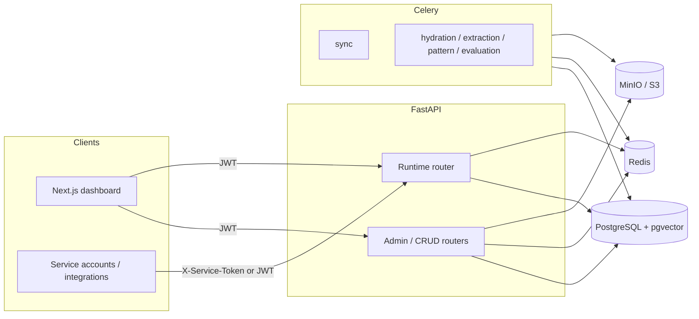

# ContextEdge — Technical blueprint

**Scope:** Architecture, component map, frontend summary, and **logical data model**. Detailed HTTP documentation lives in [**API.md**](API.md). Operations (Docker, migrations, troubleshooting) live in [**RUNBOOK.md**](RUNBOOK.md).

**Related:** [Product PRD](../STANDALONE_OPERATIONAL_MEMORY_PRD.md) · [Implementation plan](../CONTEXTEDGE_IMPLEMENTATION_PLAN.md)

---

## 1. Purpose

ContextEdge ingests operational evidence from multiple systems (tickets, chat, email, KBs), normalizes and enriches it, derives patterns and episodes, and produces **governed, versioned playbooks** suitable for human review and **runtime retrieval** (match, explain, fetch by `stable_key`, feedback). See [API.md — Runtime](API.md#runtime) for endpoint and policy details.

---

## 2. Documentation map

| Document | Contents |
| --- | --- |
| [**API.md**](API.md) | Auth headers, `/api/v1` router index, runtime risk/domain rules, policies and drift endpoints, observability URLs |
| [**RUNBOOK.md**](RUNBOOK.md) | Env checklist, Docker/Make, Alembic, workers, health, logs, common failures |
| **This file** | Architecture diagram, backend layout, frontend stack, entity groups, known gaps |

---

## 3. High-level architecture

- **Modular monolith**: `contextedge.main` mounts routers under **`/api/v1`**.
- **Async SQLAlchemy** on the request path; **sync** database URL for Celery and Alembic.
- **Redis**: Celery broker/result backend and **runtime match** cache for explain (see [API.md](API.md)).
- **MinIO**: S3-compatible storage for evidence blobs; endpoint configurable ([RUNBOOK.md](RUNBOOK.md)).

---

## 4. Backend package map

| Area | Path (under `backend/src/contextedge/`) |
| --- | --- |
| App factory, CORS, metrics | `main.py`, `config.py` |
| DB session | `database.py` |
| Auth deps | `deps.py`, `security_tokens.py` |
| HTTP middleware | `middleware/request_context.py`, `request_audit.py`, `audit.py`, `auth.py` |
| REST routers | `api/v1/*.py` |
| ORM | `models/*.py` |
| Pydantic IO | `schemas/*.py` |
| Connectors | `connectors/` (Teams, Gmail, ServiceNow, Jira SM, `base.py`, `registry.py`) |
| Search / rank | `search/` (`hybrid_ranker`, `risk_policy`, `pg_fts`, `vector_search`) |
| Graph | `graph/` |
| AI | `ai/` (provider, embeddings, classifiers, extractors, generators) |
| Domain services | `services/*.py` |
| Celery | `workers/celery_app.py`, `*_tasks.py` |

---

## 5. Frontend application

- **Stack**: Next.js 15 (App Router), React, Tailwind, shadcn/ui, TanStack Query.
- **API client**: `frontend/src/lib/api.ts` — `NEXT_PUBLIC_API_URL` (default `http://localhost:8000`), Bearer token from `localStorage`.
- **Representative routes**: `overview`, `sources`, `evidence`, `episodes`, `patterns`, `playbooks`, `evaluations`, `drift`, `policies`, `runtime`, `settings`, `audit`, `sync`.

---

## 6. Data model (entity groups)

Logical groups (exports in `models/__init__.py`):

1. **Tenant core**: `Tenant`, `Workspace`, `Domain`, `User`, `RoleBinding`, `AuditLog`
2. **Ingestion**: `Source`, `SourceObject`, `SourceCredential`, `SyncCheckpoint`, `SyncRun`
3. **Evidence**: `RawEvidenceObject`, `EvidenceItem`, `Thread`, `AttachmentArtifact`
4. **Identity / episodes**: `CanonicalIdentity`, `IdentityAlias`, `CorrelationEdge`, `Episode`, `EpisodeStep`
5. **Patterns / graph**: `Pattern`, links, `NegativeKnowledgeItem`, `Contradiction`, `GraphEdge`
6. **Playbooks**: `Playbook`, `PlaybookVersion`, `PlaybookEvidenceLink`, `PlaybookApproval`
7. **Evaluation / feedback**: `EvaluationDataset`, `EvaluationRun`, `RetrievalFeedback`
8. **Policies**: `TenantPolicy`

Tenant-scoped tables follow shared isolation patterns (`TenantScopedMixin` where applicable). **Schema migrations:** [RUNBOOK.md — Database migrations](RUNBOOK.md#database-migrations).

---

## 7. Known gaps and evolution

The phased [implementation plan](../CONTEXTEDGE_IMPLEMENTATION_PLAN.md) mixes **delivered** and **target** capabilities. Typical follow-ons:

- **SSO**: Full OIDC/SAML per tenant, SCIM — partial stubs in `middleware/auth.py`.
- **Policy `config`**: Retention enforcement, redaction, legal hold beyond FK assignment to sources/evidence.
- **Observability**: Structured logging and Prometheus are in place; full Grafana/OTel/alerting may be incomplete.
- **Product UX**: Runtime feedback UI, stricter 404 vs enumeration semantics where required.

Keep the implementation plan’s **Repository status** table aligned with reality.

---

## 8. Document maintenance

| Change | Update |
| --- | --- |
| New router or auth rule | [API.md](API.md) |
| Compose, Make, migrations, ops | [RUNBOOK.md](RUNBOOK.md) |
| New subsystem or diagram | This blueprint |
| Product intent | PRD |
| Phase / checklist | [CONTEXTEDGE_IMPLEMENTATION_PLAN.md](../CONTEXTEDGE_IMPLEMENTATION_PLAN.md) |

**Last reviewed:** Split into `API.md` + `RUNBOOK.md`; stack Next.js 15, FastAPI `0.1.0`, Alembic through `0004`.
